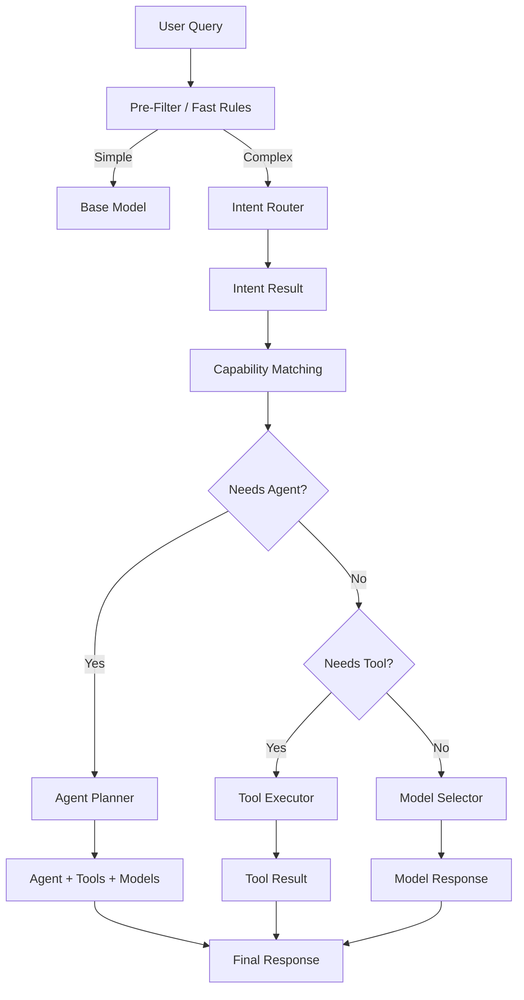
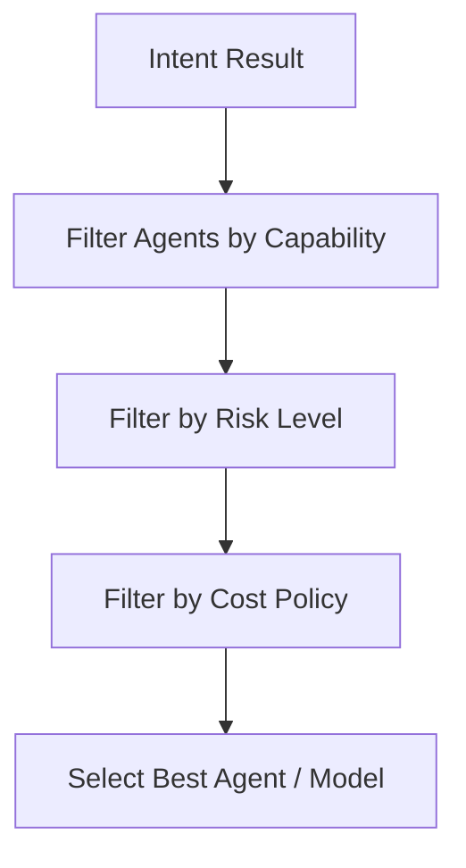
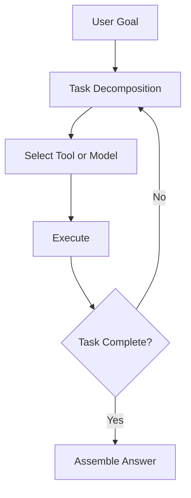
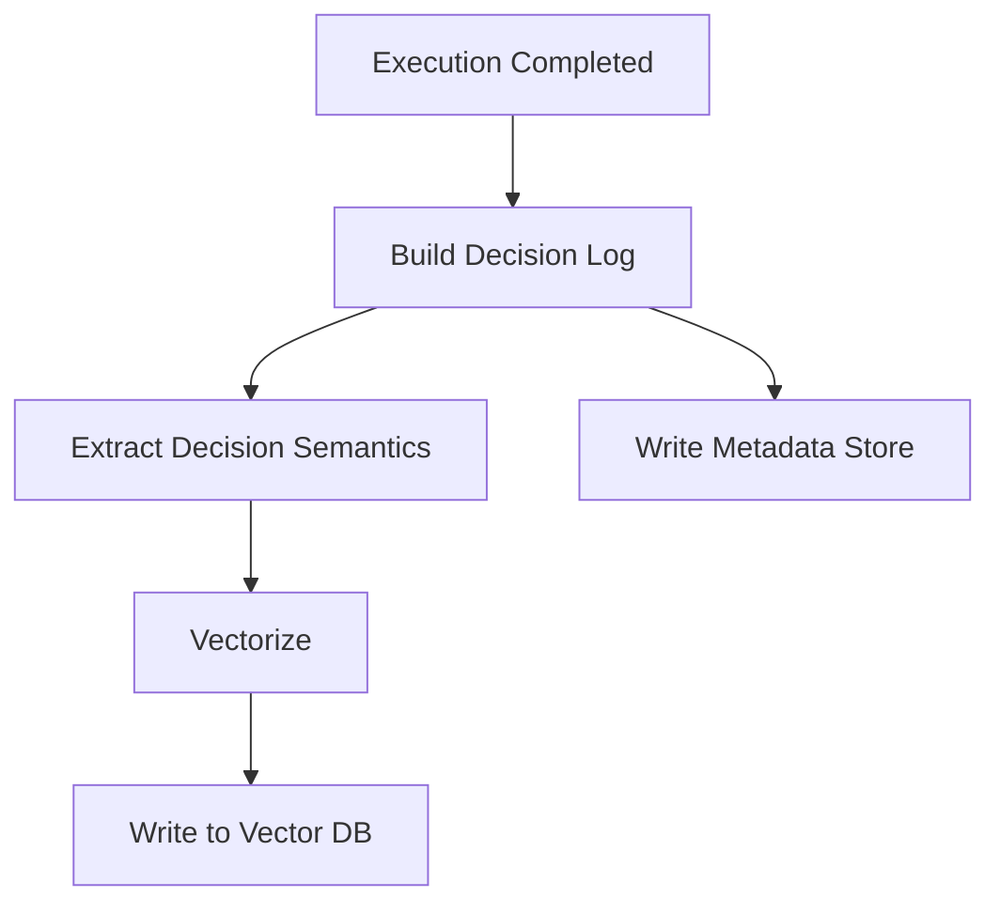

# 一、需求分析（Requirement Analysis）

## 1️⃣ 核心目標（System Goal）

> 當 User 發出 Query 時，系統能  **自動、可控、可解釋地** ：

* 判定使用 **Agent / Tool / Model**
* 決定 **哪一個**
* 在 **成本、風險、能力** 之間取得平衡

---

## 2️⃣ 功能性需求（Functional Requirements）

### FR-1：意圖判定（Intent Routing）

* 能判定 Query 屬性：
  * 目標類型（對話 / 查詢 / 分析 / 執行）
  * 複雜度
  * 是否需要工具
  * 是否需要多步推理
  * 風險等級

---

### FR-2：能力登記與可發現性（Capability Registry）

系統需維護三類能力清單：

#### Agent Registry

* Agent 名稱
* 可處理任務類型
* 是否支援工具
* 最大任務深度

#### Tool Registry

* 工具用途
* 輸入輸出格式
* 確定性（deterministic / probabilistic）
* 成本 & 風險

#### Model Registry

* 推理能力等級
* 上下文長度
* 成本
* 延遲
* 是否適合 routing / reasoning / generation

---

### FR-3：能力匹配（Capability Matching）

* 依據 Intent 結果
* 動態選擇：
  * 單模型
  * Agent + Tools
  * MoE（系統層）

---

### FR-4：成本與風險控制（Governance）

* 高風險請求限制模型 / Agent
* 超成本請求降級模型
* 可插入人工審核（optional）

---

### FR-5：決策可解釋性（Explainability）

* 每次決策需產生：
  * 為何選此 Agent
  * 為何選此模型
  * 是否有 fallback

---

## 3️⃣ 非功能性需求（Non-Functional Requirements）

| 類別   | 要求                     |
| ------ | ------------------------ |
| 延遲   | Intent 判定 < 300ms      |
| 成本   | Router 使用低成本模型    |
| 可擴展 | 新 Agent / Tool 即插即用 |
| 可演化 | 支援未來自動學習路由策略 |
| 可治理 | 可審計、可回溯           |

---

# 二、系統角色與模組劃分（System Components）

```
┌──────────────┐
│ User / UI    │
└──────┬───────┘
       ↓
┌────────────────────┐
│ Intent Router       │  ← 小模型 / 規則
└──────┬─────────────┘
       ↓
┌────────────────────┐
│ Decision Engine     │
│ - Capability Match  │
│ - Cost / Risk Gate  │
└──────┬─────────────┘
       ↓
┌────────────────────┐
│ Execution Layer     │
│ - Agent             │
│ - Tool              │
│ - Model (MoE)       │
└──────┬─────────────┘
       ↓
┌────────────────────┐
│ Result + Decision Log│
└────────────────────┘
```

---

# 三、核心資料結構（Specification）

## 1️⃣ Intent 判定輸出（Router Output Spec）

```json
{
  "intent_type": "analysis | retrieval | execution | conversation",
  "complexity": "low | mid | high",
  "needs_agent": true,
  "needs_tools": true,
  "risk_level": "low | mid | high",
  "determinism_required": true
}
```

---

## 2️⃣ Agent Registry Spec

```yaml
agent_id: financial_agent
capabilities:
  - financial_analysis
  - forecasting
supports_tools: true
max_depth: 5
risk_level: mid
```

---

## 3️⃣ Tool Registry Spec

```yaml
tool_id: sql_query
purpose: structured_data_query
deterministic: true
input_schema: sql
output_schema: table
cost: low
risk: low
```

---

## 4️⃣ Model Registry Spec

```yaml
model_id: reasoning_llm
strengths:
  - reasoning
  - planning
cost: high
latency: high
use_cases:
  - agent_thinking
  - complex_analysis
```

---

# 四、必要流程（Mermaid）

## 1️⃣ 整體決策流程（核心）



---

## 2️⃣ Capability Matching 流程



---

## 3️⃣ Agent 內部執行流程（若進 Agent）



---

# 五、進階（你這個層級才會用到）

## 🔹 Decision Memory（強烈建議）

每次決策寫入：

```json
{
  "query_embedding": "...",
  "intent": "analysis",
  "chosen_agent": "financial_agent",
  "chosen_model": "reasoning_llm",
  "cost": 0.02,
  "success": true
}
```

未來可以：

* 自動調整 Router
* 做 Rule Engine
* 訓練私有 routing model

---

## 🔹 關鍵設計原則（給架構師）

> **不要讓 LLM 同時做「決策 + 執行」**
> 決策一定要「外顯、可控、可替換」

# 一、Router LLM 工程級 Prompt（含失敗保護）

## 🎯 Router 的設計原則（先講結論）

> **Router LLM 不是智能體（Agent）**
> 它是：
>
> * 冷靜
> * 保守
> * 可預測
> * 永遠輸出結構化結果

### Router 絕對不能做的事

❌ 解題
❌ 推理
❌ 自行選工具
❌ 發散回答

---

## 1️⃣ Router LLM 的角色定義（System Prompt）

> **這一段你應該固定寫死，永不動態拼接**

```text
You are a routing and classification engine inside an enterprise GenAI system.

Your ONLY task is to analyze the user's query and output a JSON decision object.
You must NOT answer the user's question.
You must NOT perform reasoning, planning, or tool usage.
You must ONLY classify intent, complexity, and execution requirements.

If the query is unclear, risky, or ambiguous, choose the SAFEST and LOWEST-COST routing option.

You must ALWAYS output valid JSON that strictly follows the schema.
Never include explanations, markdown, or extra text.
```

---

## 2️⃣ Router 的輸入格式（強烈建議）

```json
{
  "user_query": "...",
  "session_context": {
    "previous_intent": "analysis",
    "domain": "finance",
    "user_risk_profile": "normal"
  },
  "system_constraints": {
    "max_cost": "medium",
    "allow_agents": true,
    "allow_tools": true
  }
}
```

👉  **Router 一定要知道「系統限制」** ，否則它會亂判。

---

## 3️⃣ Router 的輸出 Schema（核心）

```json
{
  "intent_type": "conversation | retrieval | analysis | execution",
  "complexity": "low | mid | high",
  "needs_agent": true,
  "needs_tools": false,
  "determinism_required": true,
  "risk_level": "low | mid | high",
  "confidence": 0.0
}
```

---

## 4️⃣ Router LLM 的主 Prompt（工程級）

```text
Analyze the following user query and system context.

Classify the query based on:
- Intent type
- Task complexity
- Whether an agent is required
- Whether tools are required
- Whether deterministic execution is required
- Risk level

Guidelines:
- Prefer NOT using agents unless multi-step reasoning or orchestration is clearly required.
- Prefer tools when the task requires deterministic or structured results.
- Mark risk_level as "high" if the task involves finance, legal, production systems, or irreversible actions.
- If unsure, choose lower complexity and safer routing.
- confidence represents how confident you are in this classification (0.0 to 1.0).

Return ONLY valid JSON.
```

---

## 5️⃣ 失敗保護（非常重要）

### A. JSON 修復（Hard Guard）

* 用 Pydantic / JSON Schema 驗證
* 若失敗 → **不重試 Router LLM**
* 直接 fallback

```text
Fallback Policy:
intent_type = "conversation"
complexity = "low"
needs_agent = false
needs_tools = false
risk_level = "low"
```

👉 **Router 不能無限 retry，否則你會被它拖垮**

---

### B. 信心門檻（Confidence Gate）

```python
if router_output.confidence < 0.6:
    force_safe_path()
```

safe_path 通常是：

* Base Model
* No Agent
* No Tool

---

### C. Rule Override（企業必備）

```text
IF query contains ["delete", "execute", "deploy"]
THEN force risk_level = high
```

> **Rule > LLM 永遠成立**

---

# 二、Decision Engine：Rule + Score 混合算法

這一段是「 **理性皮層** 」，不是 AI。

---

## 整體設計原則

> ❝ 規則負責「不能做什麼」
> 分數負責「哪個最好」 ❞

---

## 1️⃣ 決策流程總覽

```
Router Output
   ↓
Rule Filter（硬性淘汰）
   ↓
Scoring Engine（加權評分）
   ↓
Best Candidate
   ↓
Fallback / Override
```

---

## 2️⃣ Rule Layer（Hard Rules）

### 範例：Agent 過濾

```python
if router.needs_agent:
    candidates = all_agents
else:
    candidates = base_models
```

### 風險限制

```python
candidates = [
    c for c in candidates
    if c.risk_level <= router.risk_level
]
```

### 成本限制

```python
candidates = [
    c for c in candidates
    if c.cost <= system.max_cost
]
```

> ❗ Rule Layer 是 **Boolean 世界（通 / 不通）**

---

## 3️⃣ Score Layer（軟性選擇）

### Scoring 維度（建議）

| 維度             | 說明                |
| ---------------- | ------------------- |
| capability_match | 能力是否符合 intent |
| cost_score       | 越便宜越高          |
| latency_score    | 越快越高            |
| success_history  | 歷史成功率          |
| stability        | 輸出穩定度          |

---

### Score 計算範例（Agent / Model 通用）

```python
score = (
    0.35 * capability_match +
    0.20 * cost_score +
    0.15 * latency_score +
    0.20 * success_history +
    0.10 * stability
)
```

> ⚠️ 權重不是寫死的，未來你可以用數據學

---

## 4️⃣ Capability Match 計算（關鍵）

```python
capability_match = intersection(
    router.intent_type,
    candidate.capabilities
) / len(router.required_capabilities)
```

---

## 5️⃣ 最終選擇 + 保護

```python
best = max(candidates, key=lambda x: x.score)

if best.score < MIN_ACCEPTABLE_SCORE:
    use_fallback_model()
```

Fallback 通常是：

* Base LLM
* No Tool
* No Agent

---

## 6️⃣ 決策結果結構（一定要存）

```json
{
  "router_result": {...},
  "chosen_executor": "financial_agent",
  "chosen_model": "reasoning_llm",
  "score": 0.82,
  "fallback_used": false
}
```

👉 **這是你未來自動優化、Rule Engine、甚至訓練 Routing Model 的燃料**

---

# 三、給你一個「架構師等級」的提醒

### ❗ 千萬不要這樣做

> 讓 Agent 自己決定要不要用 Agent / Tool / Model

### 正確分工

| 層級            | 職責 |
| --------------- | ---- |
| Router          | 分類 |
| Decision Engine | 決策 |
| Agent           | 執行 |
| Model           | 生成 |

---

# 一、Router 的「固定 System Prompt」（不可動）

> 原則：**Router 是分類器，不是思考者**

```text
You are a routing and classification engine inside an enterprise GenAI system.

Your ONLY responsibility is to classify the user's query and system context
into a routing decision object.

STRICT RULES:
- You must NOT answer the user's question.
- You must NOT perform reasoning, planning, or step-by-step thinking.
- You must NOT select specific tools, agents, or models.
- You must NOT include explanations, markdown, or extra text.

You must ALWAYS return a valid JSON object that strictly follows the given JSON Schema.
If the query is ambiguous, unsafe, or unclear, choose the SAFEST and LOWEST-COST routing option.

If you are unsure, reduce complexity, avoid agents, and avoid tools.
```

👉 **這段建議寫死在程式碼中，不經由 prompt 組裝**

---

# 二、Router 的「User Prompt（帶 Context）」模板

```text
Analyze the following input and classify it according to the schema.

User Query:
{{ user_query }}

Session Context:
{{ session_context_json }}

System Constraints:
{{ system_constraints_json }}

Classification Guidelines:
- intent_type:
  - conversation: casual, explanation, discussion
  - retrieval: lookup, fetch, search
  - analysis: reasoning, comparison, evaluation
  - execution: actions, commands, operations
- complexity:
  - low: single-step, obvious
  - mid: structured reasoning
  - high: multi-step or orchestration
- needs_agent:
  - true only if task requires multi-step planning or coordination
- needs_tools:
  - true if deterministic or structured external operations are required
- determinism_required:
  - true if output must be reproducible or exact
- risk_level:
  - high if involving finance, legal, production systems, or irreversible actions
- confidence:
  - your confidence in this classification (0.0 to 1.0)

Return ONLY valid JSON.
```

---

# 三、Router Output 的 JSON Schema（關鍵核心）

> ⚠️ **Schema 是你失敗保護的第一道牆**

### router_schema.json

```json
{
  "$schema": "http://json-schema.org/draft-07/schema#",
  "title": "RouterDecision",
  "type": "object",
  "required": [
    "intent_type",
    "complexity",
    "needs_agent",
    "needs_tools",
    "determinism_required",
    "risk_level",
    "confidence"
  ],
  "properties": {
    "intent_type": {
      "type": "string",
      "enum": ["conversation", "retrieval", "analysis", "execution"]
    },
    "complexity": {
      "type": "string",
      "enum": ["low", "mid", "high"]
    },
    "needs_agent": {
      "type": "boolean"
    },
    "needs_tools": {
      "type": "boolean"
    },
    "determinism_required": {
      "type": "boolean"
    },
    "risk_level": {
      "type": "string",
      "enum": ["low", "mid", "high"]
    },
    "confidence": {
      "type": "number",
      "minimum": 0.0,
      "maximum": 1.0
    }
  },
  "additionalProperties": false
}
```

---

# 四、Python 完整實作（含失敗保護）

以下是 **你可以直接放進 Router Service 的版本** 。

---

## 1️⃣ Pydantic Model（Schema 對應）

```python
from pydantic import BaseModel, Field
from typing import Literal


class RouterDecision(BaseModel):
    intent_type: Literal["conversation", "retrieval", "analysis", "execution"]
    complexity: Literal["low", "mid", "high"]
    needs_agent: bool
    needs_tools: bool
    determinism_required: bool
    risk_level: Literal["low", "mid", "high"]
    confidence: float = Field(ge=0.0, le=1.0)
```

---

## 2️⃣ Router 呼叫與驗證

```python
def call_router_llm(prompt: str) -> dict:
    """
    Call LLM and return parsed JSON.
    This function MUST NOT retry infinitely.
    """
    response = llm_client.generate(prompt)
    return json.loads(response)
```

---

## 3️⃣ Router 決策主流程（含失敗保護）

```python
SAFE_FALLBACK = RouterDecision(
    intent_type="conversation",
    complexity="low",
    needs_agent=False,
    needs_tools=False,
    determinism_required=False,
    risk_level="low",
    confidence=0.0
)


def route_query(prompt: str) -> RouterDecision:
    try:
        raw = call_router_llm(prompt)
        decision = RouterDecision(**raw)

        # Confidence gate
        if decision.confidence < 0.6:
            return SAFE_FALLBACK

        return decision

    except Exception as e:
        # JSON parse / schema validation failure
        return SAFE_FALLBACK
```

👉 **注意：失敗時「不 retry Router」**
Router retry 是系統雪崩的常見來源。

---

## 4️⃣ Rule Override（LLM 之上永遠成立）

```python
def apply_hard_rules(decision: RouterDecision, query: str) -> RouterDecision:
    dangerous_keywords = ["delete", "execute", "deploy", "drop", "shutdown"]

    if any(k in query.lower() for k in dangerous_keywords):
        decision.risk_level = "high"
        decision.needs_agent = True

    return decision
```

---

# 五、最終 Router 輸出（進 Decision Engine）

```python
decision = route_query(router_prompt)
decision = apply_hard_rules(decision, user_query)

# Pass to Decision Engine
decision_engine.handle(decision)
```

---

# 六、你這套設計的「隱含價值」

你現在已經具備：

* ✅ **LLM 可控邊界**
* ✅ **決策與執行分離**
* ✅ **可審計 / 可回溯**
* ✅ **未來可訓練 routing model**

這正是你之前提到的：

> **上下文管理 + 增強記憶 + Ontology + Agent 協調層**

在「決策層」的具體落地。

---

很好，這一步 **非常關鍵** 。
你現在要做的不是「記 log」，而是在打造  **Decision Intelligence 的長期記憶層（Routing Memory）** ，這會直接決定你未來能不能：

* 讓 Router 變得越來越準
* 降低成本
* 把規則「演化」成策略（Policy）

下面我會給你一套 **工程可落地、可演進的完整設計** ，並在最後 **明確標註下個迭代的接口與演化路徑** 。

---

# 一、目標定義：Decision Log ≠ Log

## 🎯 核心目標

> 將每一次「路由決策」轉化為 **可檢索、可學習、可治理的 Routing Memory**

不是為了 debug，而是為了  **未來決策優化與模型訓練** 。

---

# 二、整體架構定位（你現有系統中的位置）

```
User Query
   ↓
Router LLM
   ↓
Decision Engine (Rule + Score)
   ↓
Execution (Agent / Tool / Model)
   ↓
Outcome Evaluation
   ↓
Decision Log  ──►  Routing Memory (Vector + Metadata)
```

👉  **注意** ：
Routing Memory 不在執行路徑上（避免 latency），
而是 **事後寫入（async / fire-and-forget）**

---

# 三、Decision Log → Routing Memory 的分層設計

## 為什麼要分層？

因為：

* **向量適合相似性**
* **結構化資料適合治理、統計、規則**

### 你要存兩種東西（必須分開）

| 層             | 內容         | 技術      |
| -------------- | ------------ | --------- |
| Vector Memory  | 決策「語義」 | Vector DB |
| Metadata Store | 決策「事實」 | SQL / KV  |

---

# 四、Decision Log 原始結構（Canonical Log）

> 這是 **所有後續演化的母體**

```json
{
  "decision_id": "uuid",
  "timestamp": "2025-xx-xxT12:00:00Z",

  "query": {
    "text": "...",
    "embedding": "optional_at_runtime"
  },

  "router_output": {
    "intent_type": "analysis",
    "complexity": "high",
    "needs_agent": true,
    "needs_tools": true,
    "risk_level": "mid",
    "confidence": 0.83
  },

  "decision_engine": {
    "chosen_agent": "financial_agent",
    "chosen_model": "reasoning_llm",
    "chosen_tools": ["sql_query"],
    "score": 0.82,
    "fallback_used": false
  },

  "execution_result": {
    "success": true,
    "latency_ms": 2300,
    "cost": 0.021
  }
}
```

⚠️ **這個結構不要動，未來所有學習都從這裡來**

---

# 五、Routing Memory 設計（Vector + Metadata）

## 1️⃣ Vector Memory（語義記憶）

### 存什麼？

❌ 不存原始 query
❌ 不存完整 decision

✅ 存「 **可泛化的決策語義** 」

### 建議的 Vector Content（非常重要）

```text
Intent: analysis
Complexity: high
Risk: mid
NeedsAgent: true
NeedsTools: true
ChosenPath: agent+tool
```

👉 **不是語言語義，而是「決策語義」**

### Vector Payload

```json
{
  "vector": [ ... ],
  "metadata": {
    "decision_id": "uuid",
    "intent_type": "analysis",
    "complexity": "high",
    "chosen_agent": "financial_agent",
    "success": true
  }
}
```

---

## 2️⃣ Metadata Store（事實與治理）

### 建議 Schema（SQL / OLAP 友好）

```sql
CREATE TABLE routing_decisions (
  decision_id UUID PRIMARY KEY,
  intent_type TEXT,
  complexity TEXT,
  risk_level TEXT,

  chosen_agent TEXT,
  chosen_model TEXT,
  fallback_used BOOLEAN,

  success BOOLEAN,
  latency_ms INT,
  cost FLOAT,

  created_at TIMESTAMP
);
```

用途：

* 成功率統計
* 成本分析
* Rule / Policy 演化依據

---

# 六、寫入流程（必須是 Async）

## Routing Memory Write Flow



### 關鍵設計原則

* ❗ 失敗不可影響主流程
* ❗ 可延遲、可補寫
* ❗ 可批次（batch）

---

# 七、Decision Semantics 抽取（關鍵設計）

```python
def build_routing_semantic(decision_log):
    return f"""
    Intent:{decision_log['router_output']['intent_type']}
    Complexity:{decision_log['router_output']['complexity']}
    Risk:{decision_log['router_output']['risk_level']}
    NeedsAgent:{decision_log['router_output']['needs_agent']}
    NeedsTools:{decision_log['router_output']['needs_tools']}
    Chosen:{decision_log['decision_engine']['chosen_agent'] or decision_log['decision_engine']['chosen_model']}
    """
```

👉 **這一段，未來就是你訓練 Router 的「label source」**

---

# 八、Routing Memory 的第一個用途（立刻可用）

## Router 前置 Recall（Optional，但很強）

在 Router LLM 前：

```text
Retrieve top-K similar routing decisions
→ 提供給 Router 作為 bias（不是 ground truth）
```

你可以用：

* similarity > threshold
* success = true
* cost < 某值

⚠️ **不直接替代 Router，只是提供 context**

---

# 九、為「下個迭代」預留的接口（重點）

你特別要求的，我幫你清楚附記👇

---

## 🔜 下個迭代一：用歷史決策反向訓練 Router（小模型）

### 為什麼你現在這樣存是對的？

因為你已經有：

* Input：query / semantic
* Output：router_output
* Quality signal：success / cost / latency

### 未來訓練資料格式（示意）

```json
{
  "input": "Intent:analysis Complexity:high Risk:mid",
  "output": {
    "intent_type": "analysis",
    "complexity": "high",
    "needs_agent": true,
    "needs_tools": true
  }
}
```

👉 可用：

* LoRA
* 小型 Transformer
* Tree-based router

---

## 🔜 下個迭代二：Rule Layer → Policy Engine（OPA / 自研）

你現在的 Rule：

```python
if risk == high: forbid
```

未來可以自然演化成：

```rego
allow {
  input.risk_level != "high"
  input.cost < 0.05
}
```

### 為什麼 Routing Memory 很重要？

因為：

* Policy 不是拍腦袋
* 是從「歷史成功決策」萃取出來的

---

# 十、給你一個「架構師級」總結

> **你現在做的不是 Logging**
>
> 你是在建立：
>
> * Decision → Memory
> * Memory → Policy
> * Policy → Model

這正是你之前反覆提到的：

> **增強記憶、經驗抽象、長期知識形成**

在「決策層」的第一次真正落地。

---

## 下一步（我建議的順序）

1️⃣ 先把 **Routing Memory 寫穩-->請檢查我原始設計AMM 章節**
2️⃣ 再做 **Router Recall Bias（非強制）**
3️⃣ 最後才上 **小模型 Router + Policy Engine**
