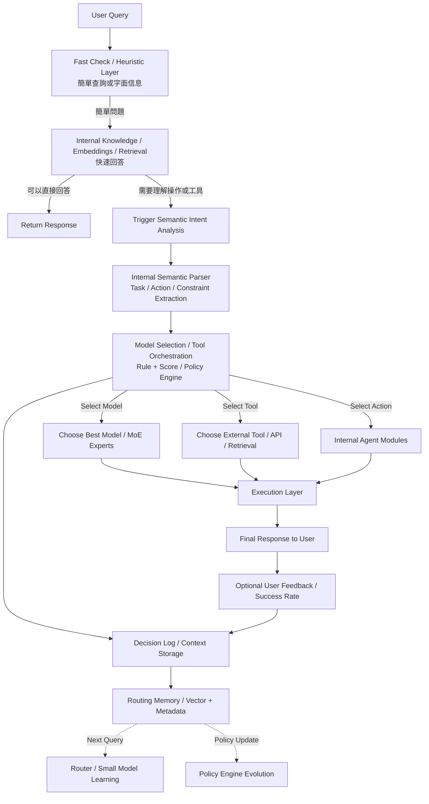
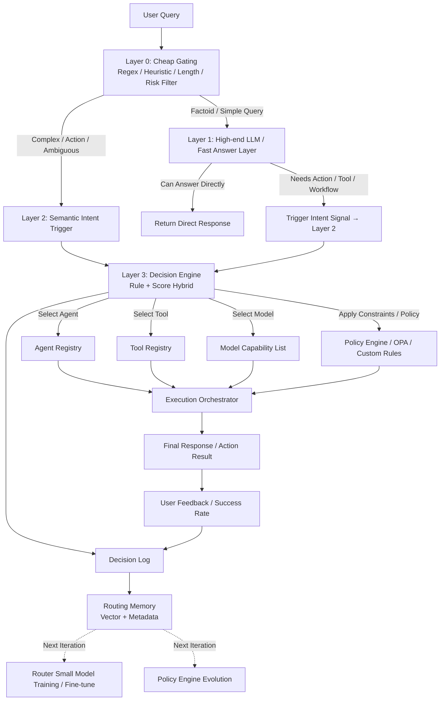

# 架构对比分析：ChatGPT 优化流程 vs 当前实现

**创建日期**: 2025-12-30
**创建人**: Daniel Chung
**最后修改日期**: 2025-12-30

---

## 📊 流程图对比

### ChatGPT 优化流程

### 当前实现流程

---

## 🔍 关键差异分析

### 1. Fast Check / Heuristic Layer (G0)

**ChatGPT 流程**：

- **名称**：Fast Check / Heuristic Layer
- **功能**：简单查询或字面信息
- **输出**：简单问题 → L1；复杂 → 需要分析

**当前实现**：

- **名称**：Layer 0: Cheap Gating
- **功能**：快速过滤（Regex / Heuristic / Length / Risk Filter）
- **输出**：Factoid/Simple → Layer 1；Complex/Action → Layer 2

**差异**：基本一致 ✅

---

### 2. Layer 1: 快速回答层

**ChatGPT 流程**：

- **名称**：Internal Knowledge / Embeddings / Retrieval
- **技术**：
  - Internal Knowledge（内部知识库）
  - Embeddings（向量检索）
  - Retrieval（检索系统）
- **特点**：不依赖外部 LLM，使用内部知识快速回答

**当前实现**：

- **名称**：Layer 1: High-end LLM / Fast Answer Layer
- **技术**：
  - 高级 LLM（GPT-4o / Gemini-1.5-pro）
  - LLM 判断是否需要系统行动
- **特点**：依赖外部 LLM API，利用 LLM 内建知识

**差异**：

- ❌ **技术栈不同**：ChatGPT 使用内部知识/检索，我们使用外部 LLM
- ❌ **成本模型不同**：ChatGPT 的成本更低（内部检索），我们的成本更高（LLM API 调用）
- ⚠️ **但功能相似**：都是快速回答层

---

### 3. Layer 2: 语义意图分析

**ChatGPT 流程**：

- **名称**：Internal Semantic Parser
- **功能**：Task / Action / Constraint Extraction
- **技术**：内部语义解析器（可能是规则 + 小模型）

**当前实现**：

- **名称**：Layer 2: Semantic Intent Trigger
- **功能**：语义意图分析和分类
- **技术**：
  - Router LLM（高级 LLM 进行分类）
  - Rule Override（硬性规则覆盖）

**差异**：

- ❌ **技术不同**：ChatGPT 使用内部解析器，我们使用 Router LLM
- ❌ **成本不同**：ChatGPT 的成本更低（内部解析），我们的成本更高（LLM API 调用）
- ✅ **输出相似**：都是意图分类结果

---

### 4. Layer 3: 决策引擎

**ChatGPT 流程**：

- **名称**：Model Selection / Tool Orchestration
- **功能**：
  - Select Model → Choose Best Model / MoE Experts
  - Select Tool → Choose External Tool / API / Retrieval
  - Select Action → Internal Agent Modules
- **技术**：Rule + Score / Policy Engine

**当前实现**：

- **名称**：Layer 3: Decision Engine
- **功能**：
  - Select Agent → Agent Registry
  - Select Tool → Tool Registry
  - Select Model → Model Capability List
- **技术**：Rule + Score Hybrid / Policy Engine

**差异**：

- ✅ **基本一致**：都是 Rule + Score 混合决策
- ✅ **功能相同**：都选择 Agent/Tool/Model
- ✅ **技术相似**：都使用 Policy Engine

---

### 5. Execution Layer

**ChatGPT 流程**：

- **名称**：Execution Layer
- **功能**：执行 Model/Tool/Action

**当前实现**：

- **名称**：Execution Orchestrator
- **功能**：执行 Agent/Tool/Model

**差异**：

- ✅ **基本一致**：都是执行层

---

### 6. Memory & Learning

**ChatGPT 流程**：

- Decision Log / Context Storage
- Routing Memory / Vector + Metadata
- Router / Small Model Learning
- Policy Engine Evolution

**当前实现**：

- Decision Log
- Routing Memory（Vector + Metadata）
- Router Small Model Training / Fine-tune
- Policy Engine Evolution

**差异**：

- ✅ **完全一致**：都使用相同的 Memory & Learning 机制

---

## 📋 差异总结

| 层级 | ChatGPT 流程 | 当前实现 | 差异程度 | 是否可以迁移 |
|------|-------------|---------|---------|------------|
| **Layer 0** | Fast Check / Heuristic | Cheap Gating | ✅ 一致 | 无需修改 |
| **Layer 1** | Internal Knowledge / Embeddings / Retrieval | High-end LLM | ⚠️ 技术不同 | 需要实现内部知识库 |
| **Layer 2** | Internal Semantic Parser | Router LLM | ⚠️ 技术不同 | 需要实现内部解析器 |
| **Layer 3** | Model Selection / Tool Orchestration | Decision Engine | ✅ 一致 | 无需修改 |
| **Execution** | Execution Layer | Execution Orchestrator | ✅ 一致 | 无需修改 |
| **Memory** | Routing Memory / Learning | Routing Memory / Learning | ✅ 一致 | 无需修改 |

---

## 🎯 关键差异：Layer 1 和 Layer 2 的技术栈

### ChatGPT 流程的优势

1. **成本更低**：
   - Layer 1 使用内部知识/检索（无需 LLM API 调用）
   - Layer 2 使用内部解析器（可能是规则 + 小模型）

2. **延迟更低**：
   - 内部检索比 LLM API 调用更快
   - 内部解析器比 Router LLM 更快

3. **可控制性更强**：
   - 内部知识库可以精确控制
   - 内部解析器可以精确调优

### 当前实现的优势

1. **更智能**：
   - 高级 LLM 有更广泛的知识
   - Router LLM 有更好的语义理解能力

2. **更灵活**：
   - 无需维护内部知识库
   - 无需训练内部解析器

3. **更简单**：
   - 实现更简单
   - 维护成本更低

---

## 💡 是否可以实现 ChatGPT 的流程？

### ✅ 可以实现的层面

1. **Layer 0**：✅ 已经实现
2. **Layer 3 (Decision Engine)**：✅ 已经实现
3. **Execution Layer**：✅ 已经实现
4. **Memory & Learning**：✅ 已经实现

### ⚠️ 需要实现的层面

1. **Layer 1: Internal Knowledge / Embeddings / Retrieval**
   - **需要**：
     - 内部知识库（向量数据库）
     - Embedding 模型
     - 检索系统
     - 查询处理逻辑
   - **实现难度**：中等
   - **成本**：需要初始开发和维护成本

2. **Layer 2: Internal Semantic Parser**
   - **需要**：
     - 规则引擎
     - 小模型（可选）
     - 意图提取逻辑
     - 约束提取逻辑
   - **实现难度**：中等
   - **成本**：需要初始开发和维护成本

---

## 🚀 迁移建议

### 方案 1：渐进式迁移（推荐）

**阶段 1**：保持当前实现，添加内部知识库作为 Layer 1 的备选

- Layer 1 先尝试内部知识库检索
- 如果检索不到，fallback 到高级 LLM
- 逐步增加内部知识库的覆盖率

**阶段 2**：实现内部语义解析器作为 Layer 2 的备选

- Layer 2 先尝试内部解析器
- 如果解析失败，fallback 到 Router LLM
- 逐步提升内部解析器的准确率

**阶段 3**：完全迁移

- 当内部知识库和解析器达到足够准确率后，完全替代外部 LLM

### 方案 2：直接实现（不推荐）

**缺点**：

- 开发成本高
- 需要大量数据训练
- 可能不如当前实现准确
- 维护成本高

---

## 📝 结论

1. **当前实现与 ChatGPT 流程在架构上基本一致** ✅
2. **主要差异在 Layer 1 和 Layer 2 的技术栈** ⚠️
3. **ChatGPT 流程可以使用，但需要实现内部知识库和解析器** ⚠️
4. **建议采用渐进式迁移方案** 💡

---

**最后更新日期**: 2025-12-30
**维护人**: Daniel Chung
