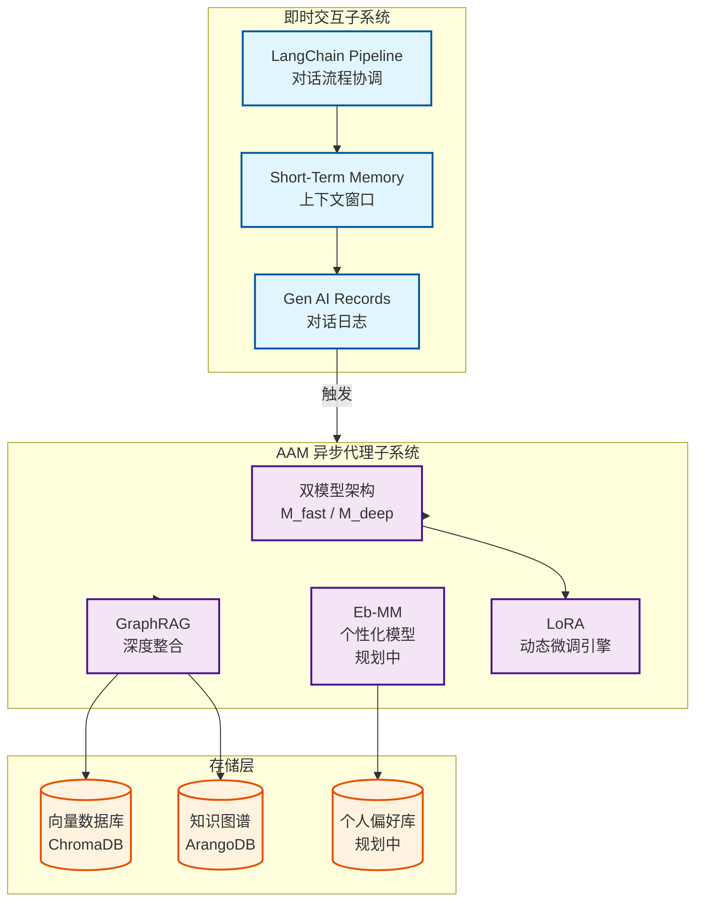

# AAM 系统（AI-Augmented Memory）架构文档

**创建日期**: 2025-12-25
**创建人**: Daniel Chung
**最后修改日期**: 2025-12-25

---

## 📋 概述

AAM（AI-Augmented Memory，AI增强记忆）系统是 AI-Box 的核心记忆架构，旨在模拟并增强人类的记忆与沟通模式。AAM 系统结合短期工作记忆与长期情景记忆，实现持续学习与进化的 AI 系统。

> **参考文档**：
>
> - Notion: [AAM-(AI-Augmented-Memory).md](../../參考文件/AAM-(AI-Augmented-Memory).md) - 详细设计理念
> - [WBS 4.4 AAM模块整合](../../開發過程文件/plans/phase4/wbs-4.4-aam-integration.md) - 开发计划

---

## 🧠 核心理念

### 三大支柱

AAM 系统包含三大支柱，协同工作形成持续学习和适应的闭环生态系统：

1. **短期工作记忆（Short-term Working Memory）**
   - 由大型语言模型（LLM）的**上下文窗口（Context Window）**提供
   - 负责处理当前对话的即时流动性
   - 基于窗口的记忆（Memory by Window）

2. **长期情景记忆（Long-term Episodic Memory）**
   - 由 **AAM 模块**提供
   - 通过向量数据库存储过去的对话、知识和互动细节
   - 让 AI 能够回忆过去

3. **个性化模型（Personalization Model）**
   - 由 **Eb-MM（Ebot Mini-Model）**提供（规划中）
   - 通过分析用户的语言习惯和情感，让 AI 不仅「记得」事实，更「懂得」用户
   - 实现真正的个人化互动

### 知识 vs 智慧框架

**知识的本质**：

- 对世界的描述，是事实、规则、模式的记录
- 可传承、可储存、可检索
- 具有真伪性（可验证）
- 目的性较弱，主要用于描述和记录

**在 AAM 中的体现**：

- 向量数据库中存储的历史对话
- 知识图谱中的三元组（实体-关系-实体）
- 从对话中提取的结构化事实

**智慧的本质**：

- 具备目的性的知识运用，能够绕过事实、达成目标
- 具有强烈的目的性（如生存、效率、用户满意度）
- 能够在冲突目标中进行价值取舍
- 能够预见未来后果并做出策略选择

**在 AAM 中的体现**：

- 动态路由机制：根据查询类型、敏感度、置信度选择最适合的模型
- 个性化策略：基于用户画像调整回应风格和内容
- 自我进化：系统能够从经验中学习，持续优化自身性能

> **核心洞察**：当意识出现目标时，知识的真伪变成次要的。智慧诞生的那一刻，是当知识开始被目的取代。AAM 系统不仅要储存知识，更要让 AI 具备运用知识达成目标的智慧。

---

## 🏗️ 系统架构

### 架构总览

AAM 系统采用**关注点分离（Separation of Concerns）**的设计哲学，将系统解耦为两个独立但协同工作的核心子系统：

1. **即时交互子系统（Real-time Interaction Subsystem）**：负责处理与用户之间的同步、低延迟的对话交互
2. **AAM 异步代理子系统（AAM Agentic Subsystem）**：作为系统的「认知后台」，负责异步地、深度地处理对话信息，进行学习、记忆归档与模型进化



### 即时交互子系统

这是面向用户的前线，所有设计都以**低延迟**和**高效率**为首要目标。

#### LangChain / GenKit Pipeline

**职责**：整个即时交互的中枢协调器（Orchestrator）

- 接收用户查询
- 管理短期记忆
- 发起 MCP 调用以丰富上下文
- 将最终的 Prompt 提交给 LLM
- 将结果返回给用户

#### Short-Term Memory（Memory by Window）

**职责**：提供对话的即时上下文

- 利用主要 LLM 的原生上下文窗口来维持对话的连贯性
- 高效且无状态的短期记忆实现方式
- 基于窗口的记忆管理

#### Gen AI Internal Records

**职责**：对话的原始日志记录

- 在一次成功的交互后，短期记忆中的对话内容会被格式化为包含 `id/user/timestamp` 的标准记录
- 作为触发长期记忆归档的数据源

### AAM 异步代理子系统

这是系统的「大脑」和「长期记忆」，所有设计都以**深度分析**和**可持续学习**为目标。

#### 双模型架构（Dual-Model Architecture）

**设计理念**：为了解决单一模型在即时回应与深度推理之间的矛盾，采用**双模型交替训练**架构：

**M_fast（快速模型）**：

- 负责低延迟回应及即时微调
- 专注于常见查询的快速处理
- 使用较小的 LoRA rank（如 r=8），训练速度快
- 目标：在 < 200ms 内生成回应

**M_deep（深度模型）**：

- 负责复杂推理及长期知识整合
- 处理需要深度思考的查询
- 使用较大的 LoRA rank（如 r=16），训练更深入
- 目标：提供高质量、有深度的推理结果

**交替训练策略**：

- M_fast 进行即时微调：新对话结束后，立即从知识图中抽样生成训练集，对 M_fast 进行快速微调
- M_deep 进行批次整合：定期（如每周）将 M_fast 的训练结果和累积的知识整合到 M_deep
- 避免 catastrophic forgetting：两个模型交替训练，确保系统既有即时适应能力，又保持长期稳定性

**动态路由机制**：

- 根据查询类型、敏感度、置信度决定使用哪个模型
- 简单查询 → M_fast（快速回应）
- 复杂查询或低置信度 → M_deep（深度推理）
- 混合回应：M_fast 生成初步回应，M_deep 提供补充和验证

**实现状态**：🔄 **规划中**

#### GraphRAG 深度整合

**核心概念**：不仅只是简单的 RAG（检索增强生成），而是将知识图谱（Knowledge Graph）深度整合到训练和推理流程中。

**知识图构建**：

- 从对话中提取三元组（实体-关系-实体）
- 储存结构化知识，包含 metadata（使用频率、时间戳、信心指标）
- 建立实体间的逻辑关系网络

**增强样本生成**：

- 使用知识图的逻辑关系生成合成训练样本
- 根据重要性指标（usage_count、recency、conflict_score）进行智能抽样
- 为 M_fast 和 M_deep 分别生成不同难度的训练集

**推理增强**：

- 在推理时，不仅检索向量相似度，还利用知识图的逻辑关系进行推理
- 能够回答需要多跳推理的复杂问题
- 提供可解释的推理路径（从知识图中追踪）

**实现状态**：🔄 **部分实现**（知识图谱提取已实现，GraphRAG 整合进行中）

#### 分离式数据存储（Decoupled Data Stores）

**设计决策**：将长期记忆分离为两个独立的数据库：

1. **个人偏好库**：专门用于存储高度敏感和个人化的用户画像数据
   - **实现状态**：❌ **规划中**（Personal Data / RoLA）

2. **Vector / KAg DB**：核心知识资产图谱
   - **向量部分**：用于语义搜索和相似度匹配（ChromaDB）
   - **图谱部分**：用于逻辑推理和关系查询（ArangoDB）
   - **整合优势**：结合两者优势，既能快速检索，又能深度推理
   - **实现状态**：✅ **已实现**

#### LoRA（动态微调引擎）

**职责**：实现系统的「神经可塑性」，即自我进化能力

- 定期从 KAg DB 中提取数据，对 M_fast 和 M_deep 进行交替微调
- 使其在知识提取和用户理解方面变得 increasingly 精准

**实现状态**：❌ **规划中**

---

## 🔄 数据流与工作流程

### 实时交互流程

```
用户查询
    ↓
LangChain Pipeline 接收
    ↓
Short-Term Memory（上下文窗口）
    ├── 检索相关历史对话
    └── 构建上下文
    ↓
MCP 调用（可选）
    ├── RAG 检索（ChromaDB）
    └── 图查询（ArangoDB）
    ↓
LLM 调用
    ├── M_fast（简单查询）
    └── M_deep（复杂查询）
    ↓
响应返回用户
    ↓
Gen AI Records（对话日志）
    ↓
触发 AAM 异步处理
```

### AAM 异步处理流程

```
对话日志（Gen AI Records）
    ↓
知识提取
    ├── NER（命名实体识别）
    ├── RE（关系抽取）
    └── RT（关系类型）
    ↓
知识图谱构建
    ├── 三元组提取
    └── 图存储（ArangoDB）
    ↓
向量化存储
    ├── 对话摘要
    └── 向量存储（ChromaDB）
    ↓
用户画像更新
    ├── 语言习惯分析
    └── 偏好记录（规划中）
    ↓
模型微调触发（规划中）
    ├── M_fast 即时微调
    └── M_deep 批次整合
```

---

## 📊 实现状态

### 已完成功能

| 功能模块 | 状态 | 说明 |
|---------|------|------|
| 短期记忆（上下文窗口） | ✅ 已实现 | 基于 LLM 上下文窗口的即时记忆 |
| 向量存储（ChromaDB） | ✅ 已实现 | 对话向量化存储与检索 |
| 知识图谱提取 | ✅ 已实现 | NER/RE/RT 三元组提取 |
| 知识图谱存储（ArangoDB） | ✅ 已实现 | 图存储与查询 |
| 对话记忆检索 | ✅ 已实现 | ChatMemoryService 实现记忆检索 |

### 部分实现功能

| 功能模块 | 状态 | 说明 |
|---------|------|------|
| GraphRAG 整合 | 🔄 部分实现 | 知识图谱提取已完成，GraphRAG 深度整合进行中 |
| 混合检索 | 🔄 部分实现 | 向量检索已实现，图检索整合进行中 |
| 记忆归档 | 🔄 部分实现 | 基础归档已实现，智能归档需增强 |

### 规划中功能

| 功能模块 | 状态 | 说明 |
|---------|------|------|
| 双模型架构（M_fast/M_deep） | ❌ 规划中 | 快速模型与深度模型的交替训练 |
| LoRA 动态微调 | ❌ 规划中 | 模型的持续学习与进化 |
| 个性化模型（Eb-MM） | ❌ 规划中 | 基于用户画像的个性化服务 |
| 个人偏好库 | ❌ 规划中 | Personal Data / RoLA 系统 |

---

## 🗺️ 开发进度

### 阶段四完成情况

根据 [项目控制表](../../../開發過程文件/項目控制表.md)，**阶段四：数据处理阶段**已完成（100%）：

- ✅ **WBS 4.3：上下文管理**（已完成）
  - Context Manager 实现
  - 上下文窗口管理
  - 上下文持久化

- ✅ **WBS 4.4：AAM 模块整合**（部分完成）
  - ✅ AAM 核心架构（基础实现）
  - ✅ 实时交互子系统（已实现）
  - 🔄 异步处理子系统（部分实现）
  - 🔄 混合 RAG 检索（部分实现）

### 当前工作重点

1. **GraphRAG 深度整合**：将知识图谱深度整合到训练和推理流程
2. **混合检索优化**：优化向量检索与图检索的混合检索策略
3. **记忆归档增强**：实现智能的记忆归档机制

### 下一阶段计划

1. **Personal Data / RoLA**：实现个人化学习系统
2. **双模型架构**：实现 M_fast 与 M_deep 的交替训练
3. **LoRA 动态微调**：实现模型的持续学习与进化

---

## 🎯 与系统其他组件的整合

### 与 RAG 系统的整合

- **向量检索**：AAM 的长期记忆通过 ChromaDB 向量检索实现
- **语义理解**：结合强化 RAG 系统的语义切片技术，提升记忆检索精度

### 与知识图谱系统的整合

- **知识提取**：AAM 系统从对话中提取知识，存储到知识图谱
- **图推理**：利用知识图谱的图推理能力，增强记忆检索与理解

### 与 Ontology 系统的整合

- **Ontology 约束**：知识提取时使用 Ontology 约束，确保提取质量
- **结构化知识**：基于 Ontology 的结构化知识表示，支持深度推理

### 与 MoE 系统的整合

- **模型选择**：AAM 的模型路由与 MoE 系统整合，实现智能模型选择
- **专家模型**：根据不同任务特性选择最适合的专家模型

---

## 📚 参考资料

### 设计文档

- Notion: [AAM-(AI-Augmented-Memory).md](../../參考文件/AAM-(AI-Augmented-Memory).md)
- [WBS 4.4 AAM模块整合](../../開發過程文件/plans/phase4/wbs-4.4-aam-integration.md)
- [WBS-G4 长期记忆MVP](../../開發過程文件/plans/genai/WBS/WBS-G4-長期記憶MVP（AAM-RAG）.md)

### 相关组件文档

- [强化RAG系统](./强化RAG系统.md)
- [知识图谱系统](./知识图谱系统.md)
- [Ontology系统](./Ontology系统.md)
- [MoE系统](./MoE系统.md)

---

**最后更新日期**: 2025-12-25
