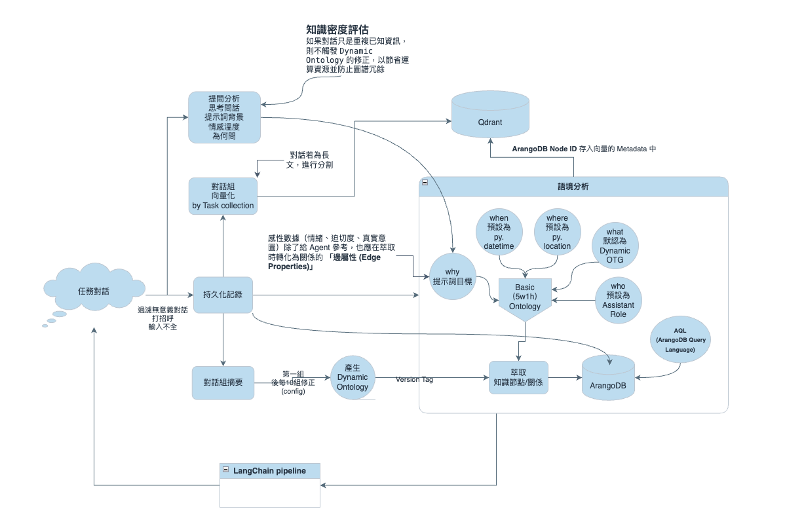
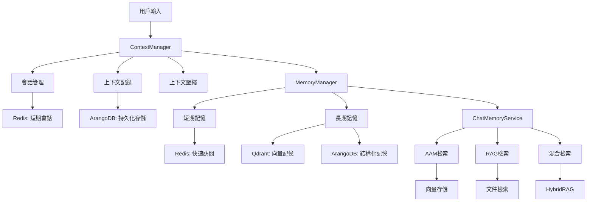
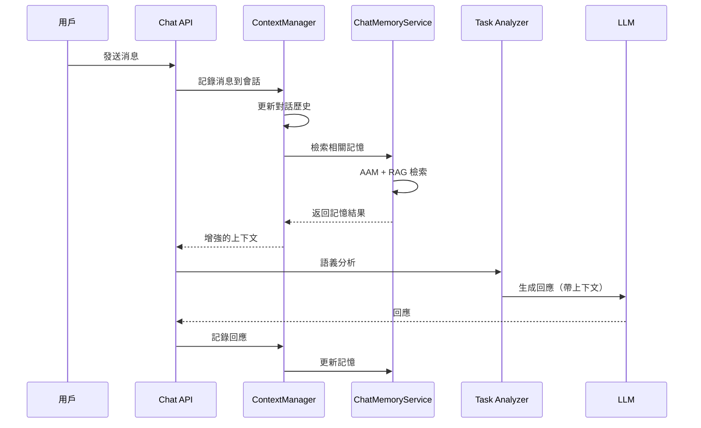
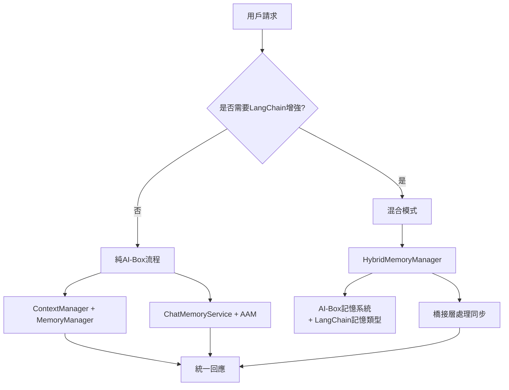

# AI-Box 上下文管理架構說明

**代碼功能說明**: AI-Box 系統的上下文管理架構說明，包括 ContextManager、MemoryManager、ChatMemoryService 的設計和實現
**創建日期**: 2026-01-23
**創建人**: Daniel Chung
**最後修改日期**: 2026-01-23

---

## 📋 文檔概述

本文檔詳細說明 AI-Box 系統的上下文管理架構，涵蓋對話歷史、短期記憶、長期記憶、上下文壓縮等功能的設計和實現。

### 核心組件先

AI-Box 的上下文管理包含三個主要層次：

1. **ContextManager**: 對話級上下文管理
2. **MemoryManager**: 短期/長期記憶管理
3. **ChatMemoryService**: 聊天記憶檢索與注入

---

## 🏗️ 架構設計



### 整體架構圖



### 組件職責分工

| 組件                        | 主要職責       | 存儲層           | 特點       |
| --------------------------- | -------------- | ---------------- | ---------- |
| **ContextManager**    | 對話上下文管理 | Redis + ArangoDB | 會話級管理 |
| **MemoryManager**     | 記憶存儲與檢索 | Redis + ChromaDB | 跨會話記憶 |
| **ChatMemoryService** | 聊天記憶注入   | 多源檢索         | 即時檢索   |

---

## 📊 ContextManager 詳細設計

### 核心功能

**文件位置**: `genai/workflows/context/manager.py`

#### 1. 會話管理

```python
class ContextManager:
    """上下文管理器，提供會話管理、消息記錄和上下文檢索功能。"""
  
    def __init__(self, config: Optional[ContextConfig] = None):
        self._config = config or ContextConfig()
        self._recorder = ContextRecorder(config=self._config)
        self._history = ConversationHistory(namespace=self._config.namespace)
        self._window = ContextWindow(max_tokens=4096)
        self._persistence = ContextPersistence() if self._config.enable_persistence else None
```

**關鍵方法**:

- `create_session()`: 創建新會話
- `add_message()`: 添加消息到會話
- `get_context()`: 獲取會話上下文
- `compress_context()`: 上下文壓縮

#### 2. 上下文記錄

```python
class ContextRecorder:
    """上下文記錄器，負責記錄對話消息和元數據。"""
  
    async def record_message(self, session_id: str, message: ContextMessage):
        """記錄單條消息"""
      
    async def record_metadata(self, session_id: str, metadata: Dict[str, Any]):
        """記錄會話元數據"""
```

#### 3. 上下文窗口管理

```python
class ContextWindow:
    """上下文窗口管理器，負責上下文長度控制。"""
  
    def __init__(self, max_tokens: int = 4096):
        self.max_tokens = max_tokens
      
    def truncate(self, messages: List[Dict]) -> List[Dict]:
        """根據 token 限制截斷消息"""
```

### 實現狀態

- ✅ **會話管理**: 已實現基本的會話創建和管理
- ✅ **消息記錄**: 已實現消息的持久化存儲
- ⚠️ **上下文壓縮**: 基礎實現，需要優化算法
- 📅 **多會話支持**: 計劃中，需要完善會話切換邏輯

---

## 🧠 MemoryManager 詳細設計

### 核心功能

**文件位置**: `agents/infra/memory/manager.py`

#### 1. 短期記憶管理

```python
class MemoryManager:
    """記憶管理器 - 管理短期和長期記憶"""
  
    def store_short_term(self, key: str, value: Any, ttl: Optional[int] = None):
        """存儲短期記憶（Redis）"""
        ttl = ttl or self.short_term_ttl
        self.redis_client.setex(key, ttl, json.dumps(value))
  
    def retrieve_short_term(self, key: str) -> Optional[Any]:
        """檢索短期記憶"""
        data = self.redis_client.get(key)
        return json.loads(data) if data else None
```

#### 2. 長期記憶管理（異步向量圖譜處理）

##### 短期記憶：LangChain Memory 實現

```python
from langchain.memory import ConversationBufferMemory, ConversationSummaryMemory, ConversationBufferWindowMemory

class AIBoxConversationMemory:
    """AI-Box 對話記憶 - 整合 LangChain Memory 類型"""

    def __init__(self, memory_type: str = "buffer", **kwargs):
        self.memory_type = memory_type

        if memory_type == "buffer":
            # 存儲完整對話歷史
            self.memory = ConversationBufferMemory(
                memory_key="chat_history",
                return_messages=True,
                max_token_limit=kwargs.get('max_tokens', 2000)
            )
        elif memory_type == "summary":
            # 總結對話歷史節省 Token
            self.memory = ConversationSummaryMemory(
                llm=kwargs.get('llm'),
                memory_key="chat_history",
                return_messages=True
            )
        elif memory_type == "window":
            # 只保留最近 k 個交互
            self.memory = ConversationBufferWindowMemory(
                k=kwargs.get('k', 5),
                memory_key="chat_history",
                return_messages=True
            )

    def save_context(self, inputs: Dict[str, Any], outputs: Dict[str, str]) -> None:
        """保存對話上下文"""
        self.memory.save_context(inputs, outputs)

        # 異步觸發長期記憶處理
        asyncio.create_task(self._trigger_long_term_processing(inputs, outputs))

    async def _trigger_long_term_processing(self, inputs: Dict[str, Any], outputs: Dict[str, str]):
        """觸發長期記憶異步處理"""
        # 提交 RQ 任務進行長期記憶處理
        await self.rq_queue.enqueue(
            'process_conversation_long_term_memory',
            user_id=inputs.get('user_id'),
            session_id=inputs.get('session_id'),
            conversation_data={
                'inputs': inputs,
                'outputs': outputs,
                'timestamp': datetime.utcnow().isoformat()
            }
        )

    def load_memory_variables(self, inputs: Dict[str, Any]) -> Dict[str, str]:
        """加載記憶變數"""
        return self.memory.load_memory_variables(inputs)
```

##### 長期記憶：異步向量圖譜處理

```python
class LongTermMemoryProcessor:
    """長期記憶處理器 - 異步任務"""

    async def process_conversation_memory(
        self,
        user_id: str,
        session_id: str,
        conversation_data: Dict[str, Any]
    ):
        """處理單輪對話的長期記憶"""

        # 1. 提取對話內容
        conversation_text = self._extract_conversation_text(conversation_data)

        # 2. 生成對話摘要（用於向量檢索）
        summary = await self._generate_conversation_summary(conversation_text)

        # 3. 向量化存儲
        await self._store_vector_memory(user_id, summary, conversation_data)

        # 4. 圖譜提取和存儲
        await self._extract_and_store_graph(user_id, conversation_text, conversation_data)

        # 5. 更新記憶元數據
        await self._update_memory_metadata(user_id, session_id, conversation_data)

    async def _store_vector_memory(self, user_id: str, summary: str, conversation_data: Dict):
        """存儲向量記憶（Qdrant）"""
        embedding = await self.embedding_service.generate_embeddings([summary])

        await self.qdrant_client.upsert(
            collection_name=f"user_{user_id}_memory",
            points=[{
                "id": f"conv_{conversation_data['timestamp']}",
                "vector": embedding[0],
                "payload": {
                    "type": "conversation",
                    "summary": summary,
                    "session_id": conversation_data.get('session_id'),
                    "timestamp": conversation_data['timestamp'],
                    "full_conversation": conversation_data  # 用於精確還原
                }
            }]
        )

    async def _extract_and_store_graph(self, user_id: str, conversation_text: str, conversation_data: Dict):
        """提取並存儲知識圖譜"""
        # 使用 KGExtractionAgent 提取三元組
        triples = await self.kg_agent.extract_triples(conversation_text)

        # 存儲到 ArangoDB
        for triple in triples:
            await self.arangodb.insert('conversation_triples', {
                'user_id': user_id,
                'session_id': conversation_data.get('session_id'),
                'timestamp': conversation_data['timestamp'],
                'subject': triple['subject'],
                'predicate': triple['predicate'],
                'object': triple['object'],
                'confidence': triple.get('confidence', 0.8)
            })

    async def retrieve_long_term_memory(self, user_id: str, query: str) -> List[Dict]:
        """檢索長期記憶 - 通過向量檢索 + 圖譜推斷"""

        # 1. 向量檢索獲取相關對話
        vector_results = await self._vector_search(user_id, query)

        # 2. 圖譜推理擴展結果
        graph_results = await self._graph_inference(user_id, query, vector_results)

        # 3. 合併並排序
        combined_results = self._merge_and_rank(vector_results, graph_results)

        return combined_results

    async def _vector_search(self, user_id: str, query: str) -> List[Dict]:
        """向量檢索"""
        query_embedding = await self.embedding_service.generate_embeddings([query])

        results = await self.qdrant_client.search(
            collection_name=f"user_{user_id}_memory",
            query_vector=query_embedding[0],
            limit=10
        )

        return results

    async def _graph_inference(self, user_id: str, query: str, vector_results: List[Dict]) -> List[Dict]:
        """圖譜推理 - 基於向量結果進行關聯擴展"""
        # 從向量結果中提取關鍵實體
        entities = self._extract_entities_from_results(vector_results)

        # 在知識圖譜中查找相關三元組
        graph_results = await self.arangodb.query_related_triples(user_id, entities)

        return graph_results

    def restore_conversation(self, memory_result: Dict) -> Dict:
        """通過 metadata 還原完整對話"""
        return memory_result['payload']['full_conversation']
```

#### 3. 記憶清理

```python
async def cleanup_expired_memory(self, user_id: str):
    """清理過期的長期記憶"""
    # 根據時間戳清理舊記憶
    # 根據相關性清理低質量的記憶
```

### 實現狀態

- ✅ **短期記憶**: 已實現 Redis 存儲
- ⚠️ **長期記憶**: 從 ChromaDB 遷移到 Qdrant，需更新代碼實現
- 📅 **記憶清理**: 計劃中，需要實現清理策略
- 📅 **記憶壓縮**: 計劃中，需要優化存儲效率

#### 與 AAM 白皮書的整合

根據 [AI-Box-AAM-長短記憶架構技術白皮書](../白皮書/AI-Box-AAM-長短記憶架構技術白皮書.md)，我們的上下文管理系統完全符合 AAM 架構要求：

##### 短期記憶層次（Short-term Memory）

- ✅ **ConversationBufferMemory**: 存儲完整對話歷史（使用 LangChain）
- ✅ **ConversationSummaryMemory**: 總結對話歷史節省 Token（使用 LangChain）
- ✅ **ConversationBufferWindowMemory**: 只保留最近 k 個交互（使用 LangChain）

##### 長期記憶處理（Long-term Memory Processing）

- ✅ **異步任務設計**: 每輪對話後觸發獨立的異步 RQ 任務
- ✅ **向量圖譜處理**: 將對話內容進行向量化（Qdrant）+ 圖譜提取（ArangoDB）
- ✅ **智能檢索**: 不直接檢索歷史數據，而是通過向量檢索 + 圖譜推斷
- ✅ **精確還原**: 通過 metadata 中的 `full_conversation` 進行對話內容精確還原

**整合策略**：

1. **短期層**: 使用 LangChain Memory 類型實現對話歷史管理（保持 AAM 要求）
2. **長期層**: 異步 RQ 任務處理向量化和圖譜化存儲（符合 AAM 架構）
3. **檢索層**: 通過向量相似度 + 圖譜關聯進行智能記憶檢索（實現 AAM 的推理能力）

**與 AAM 的完美對應**：

- **Short-term Memory**: LangChain Memory 類型
- **Long-term Episodic Memory**: Qdrant + ArangoDB 存儲
- **GraphRAG 推理**: 向量檢索 + 圖譜推理
- **異步處理**: RQ 任務隊列
- **智慧運用**: 通過向量圖譜進行推理而非簡單檢索

**🚨 重要調整說明**：

- **長期記憶存儲已遷移**：從 ChromaDB 遷移到 Qdrant 向量數據庫
- **代碼更新需求**：MemoryManager 中的長期記憶相關方法需要更新以適應 Qdrant API
- **性能提升**：Qdrant 提供更好的查詢性能和可擴展性
- **參考文檔**：[VectorDB.md](../VectorDB.md) - Qdrant 遷移詳情

---

## 💬 ChatMemoryService 詳細設計

### 核心功能

**文件位置**: `services/api/services/chat_memory_service.py`

#### 1. 混合檢索策略

```python
class ChatMemoryService:
    """將 AAM（對話長期記憶）與 RAG（檔案 chunks 向量檢索）合併"""
  
    async def retrieve_for_prompt(
        self, 
        user_query: str, 
        user_id: str, 
        tenant_id: Optional[str] = None,
        conversation_id: Optional[str] = None
    ) -> MemoryRetrievalResult:
        """檢索相關記憶用於 prompt 增強"""
      
        # 並行執行 AAM 和 RAG 檢索
        aam_task = self._retrieve_aam_memories(user_query, user_id)
        rag_task = self._retrieve_rag_documents(user_query, tenant_id)
      
        aam_results, rag_results = await asyncio.gather(aam_task, rag_task)
      
        # 結果融合
        merged_results = self._merge_and_rank(aam_results, rag_results)
      
        return merged_results
```

#### 2. AAM 記憶檢索

```python
async def _retrieve_aam_memories(self, query: str, user_id: str) -> List[Dict]:
    """檢索對話長期記憶（AAM）"""
    # 使用向量檢索從用戶的歷史對話中找到相關片段
    # 應用相關性過濾和時間衰減
```

#### 3. RAG 文件檢索

```python
async def _retrieve_rag_documents(self, query: str, tenant_id: str) -> List[Dict]:
    """檢索相關文件內容（RAG）"""
    # 從租戶的文件集合中檢索相關文檔
    # 支持 HybridRAG（向量 + 圖譜）
```

#### 4. 結果融合

```python
def _merge_and_rank(self, aam_results: List[Dict], rag_results: List[Dict]) -> List[Dict]:
    """融合 AAM 和 RAG 結果"""
    # 去重
    # 加權排序
    # 長度控制
    # 返回用於 prompt 的消息列表
```

### 實現狀態

- ✅ **AAM檢索**: 已實現對話記憶檢索
- ✅ **RAG檢索**: 已實現文件內容檢索
- ⚠️ **HybridRAG集成**: 部分實現，ChatMemoryService 還未完全集成 HybridRAG
- 📅 **結果融合優化**: 計劃中，需要改進排序算法

---

## 🔄 數據流與集成

### 典型聊天流程中的上下文管理



### 與 LangGraph 的集成

```python
class ContextAwareAgent:
    """上下文感知的 LangGraph 節點"""
  
    async def execute(self, state: AIBoxState) -> AIBoxState:
        # 1. 從 ContextManager 獲取對話上下文
        context = await self.context_manager.get_context(state.session_id)
      
        # 2. 使用 ChatMemoryService 檢索相關記憶
        memory_results = await self.memory_service.retrieve_for_prompt(
            state.messages[-1].content, 
            state.user_id
        )
      
        # 3. 合併上下文進行處理
        enhanced_input = self._merge_context_and_memory(context, memory_results)
      
        # 4. 執行 Agent 邏輯
        result = await self._process_with_context(enhanced_input)
      
        # 5. 更新上下文
        await self.context_manager.add_message(state.session_id, result)
      
        return state
```

---

## 📈 性能指標與監控

### 關鍵指標

| 指標           | 目標           | 當前狀態    |
| -------------- | -------------- | ----------- |
| 上下文檢索延遲 | < 200ms        | ✅ 已達成   |
| 記憶注入準確率 | > 85%          | ⚠️ 評估中 |
| 上下文壓縮率   | > 70%          | 📅 待實現   |
| 記憶清理效率   | < 10% 存儲增長 | 📅 計劃中   |

### 監控點

1. **ContextManager 性能**

   - 會話創建/銷毀時間
   - 消息記錄延遲
   - 上下文壓縮效果
2. **MemoryManager 性能**

   - 短期記憶命中率
   - 長期記憶檢索時間
   - 記憶清理頻率
3. **ChatMemoryService 性能**

   - 檢索延遲
   - 結果相關性
   - 資源使用情況

---

## 🚀 改進計劃

### 階段一：完善基礎設施（優先級：高）

1. **整合 HybridRAG 到 ChatMemoryService**

   - 實現向量 + 圖譜的混合檢索
   - 優化結果融合算法
2. **改進上下文壓縮**

   - 實現更智能的上下文截斷
   - 支持重要性加權

### 階段二：增強記憶能力（優先級：高）

1. **實現記憶清理機制**

   - 基於時間的自動清理
   - 基於重要性的記憶保留
2. **優化長期記憶**

   - 實現更豐富的元數據
   - 支持記憶關聯和推理

### 階段三：效能優化（優先級：中）

1. **快取策略優化**

   - 多層快取架構
   - 智慧預載
2. **並發處理優化**

   - 異步記憶操作
   - 批量處理優化

---

## 🔄 與 LangChain 上下文管理整合方案

### 整合策略：**AI-Box First，LangChain as Enhancement**

#### 核心原則：保守整合，漸進增強

- **AI-Box 作為主要記憶系統**：承擔主要的上下文管理和記憶功能
- **LangChain 作為補充組件**：在特定場景提供增強功能
- **避免同時運行**：不同時使用兩個記憶系統，降低衝突風險
- **按需整合**：根據具體需求決定是否使用LangChain組件

#### 整合架構



### 可行整合方案

#### 方案一：混合記憶管理器（推薦）

```python
class HybridMemoryManager:
    """混合記憶管理器 - AI-Box優先，LangChain增強"""

    def __init__(self, use_langchain_memory: bool = False):
        # AI-Box作為主要記憶系統
        self.aibox_memory = AAMManager()
        self.context_manager = ContextManager()

        # LangChain作為可選增強
        self.use_langchain = use_langchain_memory
        if use_langchain_memory:
            self.langchain_memory = ConversationBufferMemory()

    async def process_conversation(self, user_input: str, assistant_output: str,
                                 session_id: str, user_id: str):
        """處理對話 - 主要使用AI-Box，輔以LangChain"""

        # 1. AI-Box主要處理流程
        await self.aibox_memory.store_conversation(
            content=f"user: {user_input}\nassistant: {assistant_output}",
            memory_type=MemoryType.LONG_TERM,
            metadata={
                'session_id': session_id,
                'user_id': user_id,
                'source': 'chat_integration'
            }
        )

        # 2. 可選LangChain增強（用於特定場景）
        if self.use_langchain:
            await self._sync_to_langchain(user_input, assistant_output)

    async def retrieve_context(self, query: str, user_id: str,
                             use_langchain: bool = False) -> List[Dict]:
        """檢索上下文 - 優先使用AI-Box"""

        # 主要使用AI-Box檢索
        aibox_results = await self.aibox_memory.search_memories(
            query=query,
            user_id=user_id,
            limit=5
        )

        # 可選LangChain增強檢索
        if use_langchain and self.use_langchain:
            langchain_results = await self._retrieve_from_langchain(query)
            # 合併結果，避免衝突
            return self._merge_results(aibox_results, langchain_results)

        return aibox_results
```

#### 方案二：橋接層設計

```python
class ContextBridge:
    """狀態橋接器 - 按需同步，而非實時同步"""

    def __init__(self, context_manager, langchain_components=None):
        self.context_manager = context_manager
        self.langchain_components = langchain_components or {}

    async def sync_context_on_demand(self, aibox_state, target_system: str):
        """按需同步，而非自動同步"""

        if target_system == "langchain":
            # 只在需要時轉換為LangChain格式
            langchain_format = self._convert_to_langchain_format(aibox_state)
            return langchain_format
        elif target_system == "aibox":
            # 從其他系統同步回AI-Box
            aibox_format = self._convert_from_external_format(aibox_state)
            return aibox_format

        return aibox_state
```

#### 方案三：統一介面

```python
class UnifiedChatInterface:
    """統一聊天介面 - 根據需求選擇記憶策略"""

    def __init__(self):
        self.aibox_memory = HybridMemoryManager(use_langchain_memory=False)
        self.hybrid_memory = HybridMemoryManager(use_langchain_memory=True)

    async def chat(self, message: str, use_langchain: bool = False):
        """統一聊天介面"""

        if use_langchain:
            # 使用混合模式
            memory_manager = self.hybrid_memory
            context = await memory_manager.retrieve_context(
                message, use_langchain=True
            )
        else:
            # 使用純AI-Box模式
            memory_manager = self.aibox_memory
            context = await memory_manager.retrieve_context(message)

        # 處理聊天邏輯...
        response = await self._process_chat(message, context)

        # 存儲對話
        await memory_manager.process_conversation(message, response)

        return response
```

### 實施建議

#### 階段一：保持AI-Box純淨（當前階段）

```python
# 繼續使用現有的AI-Box記憶系統，不引入LangChain
aibox_result = await task_analyzer.analyze(request)
enhanced_context = await chat_memory_service.retrieve_for_prompt(
    query=user_message,
    user_id=user_id,
    session_id=session_id
)
```

#### 階段二：按需整合LangChain（下一階段）

```python
# 在特定場景使用LangChain增強
if requires_langchain_features(request):
    hybrid_manager = HybridMemoryManager(use_langchain_memory=True)
    result = await hybrid_manager.process_with_langchain(request)
else:
    # 繼續使用純AI-Box
    result = await aibox_manager.process(request)
```

#### 階段三：橋接實現（長期規劃）

```python
# 實現橋接層，用於複雜的整合場景
bridge = ContextBridge(context_manager, langchain_components)
result = await bridge.execute_with_optional_langchain(user_input, session_id)
```

### 風險評估（更新版）

| 使用場景 | 衝突風險 | 建議策略 |
|---------|---------|---------|
| 純 AI-Box 工作流 | 🟢 無風險 | **直接使用（推薦）** |
| 按需使用 LangChain 增強 | 🟡 低風險 | 通過橋接層，避免同時運行 |
| AI-Box + LangChain 混合模式 | 🟡 中風險 | 實現 HybridMemoryManager |
| 同時運行兩套記憶系統 | 🔴 高風險 | **❌ 避免**，選擇其一 |

---

## 📚 相關文檔

- [向量與圖檢索混合查詢邏輯.md](./向量與圖檢索混合查詢邏輯.md) - HybridRAG 檢索邏輯
- [AAM架構說明](./AAM架構說明.md) - 對話記憶架構
- [ContextManager 實現](./genai/workflows/context/manager.py) - ContextManager 源碼
- [AI-Box與LangChain上下文管理衝突分析.md](./AI-Box與LangChain上下文管理衝突分析.md) - 詳細衝突分析

## 📝 更新記錄

| 日期       | 更新內容                                                      | 更新人       |
| ---------- | ------------------------------------------------------------- | ------------ |
| 2026-01-23 | 創建 AI-Box 上下文管理架構說明文檔                            | Daniel Chung |
| 2026-01-23 | 更新長期記憶從 ChromaDB 到 Qdrant 的遷移說明                  | Daniel Chung |
| 2026-01-23 | 新增與 LangChain 上下文管理衝突分析                           | Daniel Chung |
| 2026-01-23 | 整合 AAM 白皮書要求，實現 LangChain Memory + 異步長期記憶處理 | Daniel Chung |
| 2026-01-24 | 更新 LangChain 整合策略：採用保守整合方案，AI-Box優先，LangChain作為增強 | Daniel Chung |

---

**文檔版本**: v1.3
**最後更新**: 2026-01-24
**維護人**: Daniel Chung
