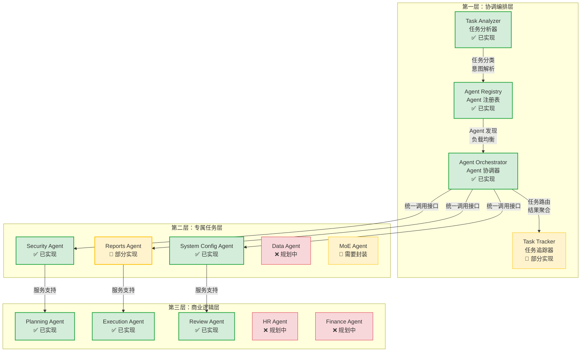

# Agent Platform 架构文档

**创建日期**: 2025-12-25
**创建人**: Daniel Chung
**最后修改日期**: 2025-12-25

---

## 📋 概述

Agent Platform 是 AI-Box 系统的核心协调中心，采用**三层分离架构**，实现职责清晰、易于扩展的 Multi-Agent 协作平台。本文档详细说明 Agent Platform 的架构设计、核心组件、实现状态与开发进度。

> **相关文档**：
>
> - [Agent架构规格书-v2](../datasets/Agent Platform/AI-Box-Agent-架構規格書-v2.md) - 详细架构规格
> - [Orchestrator协调层规格书](../datasets/Agent Platform/Orchestrator-協調層規格書.md) - 协调层详细说明
> - [Agent架构分离设计](../datasets/Agent Platform/ARCHITECTURE_AGENT_SEPARATION.md) - 架构分离开发指南

---

## 🏗️ 架构设计

### 三层架构概述

AI-Box Agent Platform 采用**三层分离架构**，从上层到下层分别是：

```
┌─────────────────────────────────────────────────────────┐
│  第一层：协调编排层（AI-Box Orchestration Agent）      │
│  - 任务分析、Agent 注册、任务路由与协调                │
└─────────────────────────────────────────────────────────┘
                        ↓ 统一调用接口
┌─────────────────────────────────────────────────────────┐
│  第二层：专属任务层（Dedicated Service Agents）        │
│  - 提供共享服务：Security, Reports, Data, MoE 等       │
└─────────────────────────────────────────────────────────┘
                        ↓ 服务调用
┌─────────────────────────────────────────────────────────┐
│  第三层：商业逻辑层（Business Process Agents）          │
│  - 执行具体业务逻辑：HR Recruiting, Finance 等          │
└─────────────────────────────────────────────────────────┘
```

### 架构图



### 核心设计原则

1. **统一协调**：所有 Agent 调用都通过 Orchestrator
2. **服务共享**：专属服务 Agent 提供共享能力，避免重复开发
3. **业务隔离**：业务 Agent 专注于业务逻辑，不直接访问基础设施
4. **异步支持**：支持异步任务执行和状态追踪
5. **指令澄清**：当指令不明确时，主动澄清而非降级处理

---

## 🔧 核心组件详解

### 第一层：协调编排层

协调编排层是 Agent Platform 的核心，负责任务分析、Agent 管理、任务路由与协调。

#### 1. Task Analyzer（任务分析器）

**职责**：

- 任务分类与意图识别
- 槽位提取（从自然语言中提取结构化参数）
- 指令澄清机制（当指令不明确时，生成澄清问题）
- Agent 能力匹配
- 工作流选择（LangChain/CrewAI/AutoGen/Hybrid）

**实现状态**：✅ **已实现**

**核心功能**：

- ✅ 任务分类器（`agents/task_analyzer/classifier.py`）
- ✅ 工作流选择器（`agents/task_analyzer/workflow_selector.py`）
- ✅ LLM 路由选择（`agents/task_analyzer/llm_router.py`）
- 🔄 指令澄清机制（部分实现，需增强）
- 🔄 配置操作专用解析（需增强）

**相关文档**：[Orchestrator协调层规格书](../datasets/Agent Platform/Orchestrator-協調層規格書.md) 第 3.1 节

#### 2. Agent Registry（Agent 注册表）

**职责**：

- Agent 注册与发现
- 健康监控与负载均衡
- 权限管理与安全审计
- Agent 能力索引
- 输入 Schema 支持（前置检查约束）

**实现状态**：✅ **已实现**

**核心功能**：

- ✅ Agent 注册（`agents/services/registry/registry.py`）
- ✅ Agent 发现（`agents/services/registry/discovery.py`）
- ✅ 自动注册（`agents/services/registry/auto_registration.py`）
- ✅ 健康监控
- 🔄 负载均衡（需增强）

**数据模型**：

```python
AgentRegistryInfo {
    agent_id: str              # Agent 唯一标识
    agent_type: str            # Agent 类型
    status: AgentStatus        # 当前状态（online/offline/busy）
    endpoints: AgentEndpoints  # 服务端点（HTTP/MCP）
    capabilities: List[str]    # 能力列表
    load: int                  # 当前负载
    last_heartbeat: datetime   # 最后心跳时间
}
```

**相关文档**：[Agent注册规格书](../datasets/Agent Platform/Agent-註冊-規格書.md)

#### 3. Agent Orchestrator（Agent 协调器）

**职责**：

- 任务路由与分发
- 结果聚合与管理
- 异步任务追踪
- 统一服务调用接口（ATC）
- 第一层预检（格式与边界验证）
- 结果修饰（使用 LLM 转换为自然语言）

**实现状态**：✅ **已实现**

**核心流程**：

```
自然语言指令
    ↓
Orchestrator 接收
    ↓
Task Analyzer 解析意图
    ├── 任务分类
    ├── 槽位提取
    ├── 指令澄清检查
    └── 生成结构化意图
    ↓
Security Agent 权限检查
    ↓
Agent Registry 发现合适的 Agent
    ↓
Task Tracker 创建任务记录
    ↓
Orchestrator 分发任务给目标 Agent
    ↓
Agent 执行任务
    ↓
Orchestrator 收集结果
    ↓
结果修饰（使用 LLM 转换为自然语言）
    ↓
返回给前端
```

**相关文档**：[Orchestrator协调层规格书](../datasets/Agent Platform/Orchestrator-協調層規格書.md)

#### 4. Task Tracker（任务追踪器）

**职责**：

- 任务记录与状态追踪
- 异步任务支持
- 任务状态查询 API

**实现状态**：🔄 **部分实现**

**相关文档**：[Orchestrator协调层规格书](../datasets/Agent Platform/Orchestrator-協調層規格書.md) 第 3.4 节

---

### 第二层：专属任务层

专属任务层提供系统级的共享服务，被业务 Agent 复用，避免重复开发。

#### 已实现的专属 Agent

1. **Security Agent** ✅
   - 权限检查
   - 安全检测
   - 审计日志
   - **详细文档**：[Security-Agent-规格书](../datasets/Agent Platform/Security-Agent-規格書.md)

2. **System Config Agent** ✅
   - 系统配置管理
   - 配置验证
   - 配置元数据机制
   - **详细文档**：[System-Config-Agent-规格书](../datasets/Agent Platform/System-Config-Agent-規格書.md)

3. **Reports Agent** 🔄
   - 报告生成
   - HTML 格式输出
   - 部分实现，需完善

4. **MoE Agent** 🔄
   - Multi-model 专家模型路由
   - 需要封装为 Agent 形式

5. **Data Agent** ❌
   - DataLake Agent（包含 ERP、PLM 等企业系统的集中化数据平台）
   - Data dictionary 与 schema
   - 协助 SQL 或数据库查询
   - **状态**：规划中

---

### 第三层：商业逻辑层

商业逻辑层执行具体的企业业务流程，可根据实际业务需求扩展。

#### 已实现的业务 Agent

1. **Planning Agent** ✅
   - 任务规划
   - 步骤分解
   - 依赖关系分析

2. **Execution Agent** ✅
   - 任务执行
   - 步骤执行追踪
   - 执行结果收集

3. **Review Agent** ✅
   - 结果审查
   - 质量评估
   - 改进建议

#### 规划中的业务 Agent

- **HR Recruiting Agent**：招聘流程 Agent
- **Finance Auditing Agent**：财务审计 Agent
- **Quotation Agent**：报价 Agent
- **Purchase Inquiry Agent**：采购询价 Agent
- **QC Analyzer Agent**：质量控制分析 Agent

**开发规范**：[Agent开发规范](../datasets/Agent Platform/Agent-開發規範.md)

---

## 📡 通信协议与接口

### 统一调用接口（ATC）

所有 Agent 通过统一的接口协议进行通信：

**HTTP REST API**：

- 同步调用接口
- 标准化的请求/响应格式
- 支持超时与重试机制

**MCP Protocol**：

- 异步调用支持
- 流式响应
- 工具调用与函数调用

**接口规范**：

```python
class AgentServiceRequest:
    agent_id: str
    task: str
    context: Dict[str, Any]
    user_id: str
    session_id: Optional[str]

class AgentServiceResponse:
    success: bool
    result: Any
    error: Optional[str]
    metadata: Dict[str, Any]
```

**详细说明**：[ARCHITECTURE_AGENT_SEPARATION.md](../datasets/Agent Platform/ARCHITECTURE_AGENT_SEPARATION.md)

---

## 📊 实现状态对比

### 协调编排层实现状态

| 组件 | 功能 | 状态 | 备注 |
|------|------|------|------|
| Task Analyzer | 任务分类 | ✅ 已实现 | 需增强指令澄清机制 |
| Task Analyzer | 工作流选择 | ✅ 已实现 | 支持 LangChain/AutoGen/CrewAI |
| Task Analyzer | LLM 路由 | ✅ 已实现 | 支持多 Provider 路由 |
| Agent Registry | Agent 注册 | ✅ 已实现 | 支持 HTTP/MCP 协议 |
| Agent Registry | Agent 发现 | ✅ 已实现 | 支持能力匹配 |
| Agent Registry | 健康监控 | ✅ 已实现 | 支持心跳检测 |
| Agent Orchestrator | 任务路由 | ✅ 已实现 | 支持统一调用接口 |
| Agent Orchestrator | 结果聚合 | ✅ 已实现 | 支持结果修饰 |
| Task Tracker | 任务追踪 | 🔄 部分实现 | 需完善异步任务支持 |

### 专属任务层实现状态

| Agent | 功能 | 状态 | 备注 |
|-------|------|------|------|
| Security Agent | 权限检查 | ✅ 已实现 | 完整的权限检查流程 |
| Security Agent | 安全检测 | ✅ 已实现 | 支持多种安全检测 |
| System Config Agent | 配置管理 | ✅ 已实现 | 支持配置验证 |
| Reports Agent | 报告生成 | 🔄 部分实现 | 需完善 HTML 格式输出 |
| MoE Agent | 模型路由 | 🔄 需封装 | MoE 功能已实现，需封装为 Agent |
| Data Agent | 数据查询 | ❌ 规划中 | 下一阶段开发重点 |

### 商业逻辑层实现状态

| Agent | 功能 | 状态 | 备注 |
|-------|------|------|------|
| Planning Agent | 任务规划 | ✅ 已实现 | 支持多步骤规划 |
| Execution Agent | 任务执行 | ✅ 已实现 | 支持步骤执行追踪 |
| Review Agent | 结果审查 | ✅ 已实现 | 支持质量评估 |
| HR/FIN/其他业务Agent | 业务逻辑 | ❌ 规划中 | 待 PoC 阶段实际导入剧本 |

---

## 🗺️ 开发进度

### 已完成（阶段二）

根据 [项目控制表](../../../開發過程文件/項目控制表.md)，**阶段二：Agent 核心阶段**已完成（100%）：

- ✅ **子阶段2.1：基础组件实现**（100%）
  - Task Analyzer 核心逻辑
  - Agent Process 核心组件（Memory Manager、Tool Registry、Prompt Manager 等）

- ✅ **子阶段2.2：协调层实现**（100%）
  - Agent Registry
  - Agent Orchestrator
  - 任务路由与协调

- ✅ **子阶段2.3：核心Agent实现**（100%）
  - Planning Agent
  - Execution Agent
  - Review Agent

### 进行中

- 🔄 **Task Tracker**：异步任务追踪功能需完善
- 🔄 **Reports Agent**：报告生成功能需完善
- 🔄 **MoE Agent 封装**：将 MoE 功能封装为 Agent

### 规划中

- ❌ **Data Agent**：DataLake Agent，下一阶段开发重点
- ❌ **商业逻辑层 Agent**：HR、Finance 等业务 Agent，待 PoC 阶段实际导入

---

## 🎯 下一步计划

### 短期目标（1-2个月）

1. **完善 Task Tracker**：完善异步任务追踪功能
2. **完善 Reports Agent**：完善报告生成功能
3. **MoE Agent 封装**：将 MoE 功能封装为 Agent 形式

### 中期目标（3-6个月）

1. **Data Agent 开发**：开发 DataLake Agent，支持企业数据系统集成
2. **商业逻辑层扩展**：根据 PoC 需求开发业务 Agent
3. **性能优化**：优化 Agent 路由与调用性能

### 长期目标（6-12个月）

1. **Agent 生态建设**：构建 Agent 开发与分发生态
2. **智能路由优化**：基于历史数据优化 Agent 路由策略
3. **多租户支持**：完善多租户 Agent 隔离与管理

---

## 📚 参考资料

### 架构文档

- [AI-Box-Agent-架构规格书-v2](../datasets/Agent Platform/AI-Box-Agent-架構規格書-v2.md)
- [Orchestrator-协调层规格书](../datasets/Agent Platform/Orchestrator-協調層規格書.md)
- [ARCHITECTURE_AGENT_SEPARATION.md](../datasets/Agent Platform/ARCHITECTURE_AGENT_SEPARATION.md)
- [ARCHITECTURE_DIAGRAM_EXPLANATION.md](../datasets/Agent Platform/ARCHITECTURE_DIAGRAM_EXPLANATION.md)

### Agent 规格文档

- [Security-Agent-规格书](../datasets/Agent Platform/Security-Agent-規格書.md)
- [System-Config-Agent-规格书](../datasets/Agent Platform/System-Config-Agent-規格書.md)
- [Agent-注册-规格书](../datasets/Agent Platform/Agent-註冊-規格書.md)

### 开发文档

- [Agent-开发规范](../datasets/Agent Platform/Agent-開發規範.md)
- [Agent生命周期](../datasets/Agent Platform/AGENT_LIFECYCLE.md)

### 工具文档

- [LogService-规格书](../datasets/Agent Platform/Tools/LogService-規格書.md)
- [ConfigMetadata-配置元数据机制规格书](../datasets/Agent Platform/Tools/ConfigMetadata-配置元數據機制規格書.md)

---

**最后更新日期**: 2025-12-25
