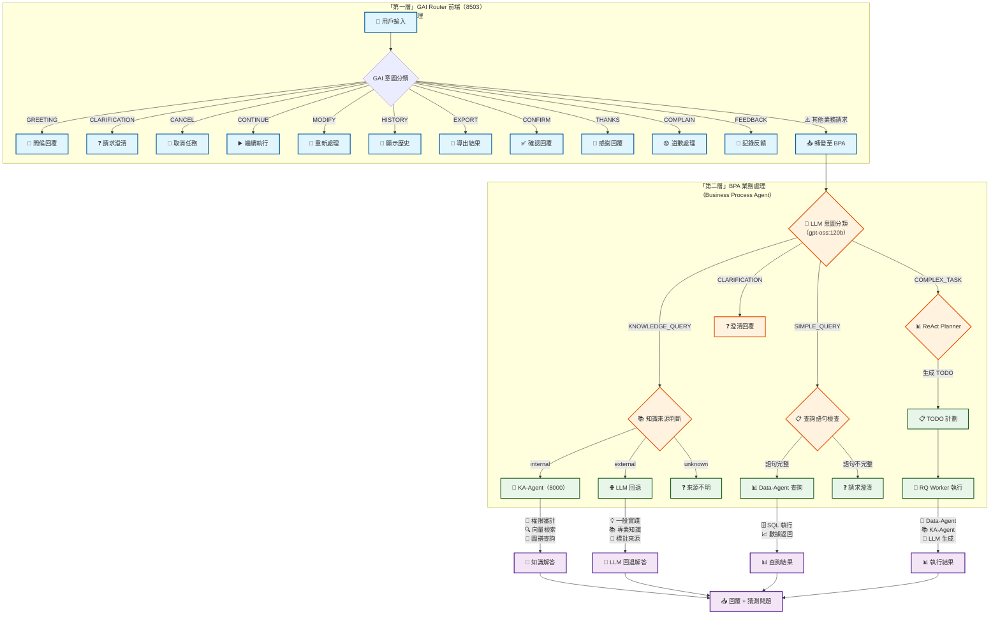

# Agent 意圖分類與業務處理架構

**版本**: v1.2.0
**創建日期**: 2026-02-09
**更新日期**: 2026-02-09
**適用範圍**: 所有 BPA Agent (MM-Agent, PO-Agent, FI-Agent 等)
**狀態**: 正式版

---

## 1. 概述

本文檔描述 Agent 系統的意圖分類架構，採用分層設計：

| 層級             | 名稱                         | 職責               |
| ---------------- | ---------------------------- | ------------------ |
| **第一層** | GAI (Router)                 | 通用對話、意圖過濾 |
| **第二層** | BPA (Business Process Agent) | 業務數據處理       |

### 1.1 設計原則

| 原則               | 說明                               |
| ------------------ | ---------------------------------- |
| **職責分離** | 前端處理通用對話，BPA 處理業務數據 |
| **分層架構** | GAI → BPA → Data-Agent/KA-Agent  |
| **意圖驅動** | LLM 判斷意圖，結構化輸出           |
| **可擴展**   | 新增 Agent 只需實現特定業務邏輯    |

### 1.2 適用 Agent

| Agent    | 領域     | 業務類型             |
| -------- | -------- | -------------------- |
| MM-Agent | 製造管理 | 庫存、採購、銷售     |
| PO-Agent | 採購管理 | 採購單、供應商、訂單 |
| FI-Agent | 財務管理 | 帳務、報表、審計     |

---

## 2. 架構總覽

### 2.1 系統架構圖（Mermaid 8.8）



**TODO 執行規範**：上圖中 COMPLEX_TASK 經 ReAct Planner 生成 TODO 計劃後，交付 RQ 隊列由 RQ Worker 執行時，依 **Agent 任務編排 todo 執行統一規範** 辦理。詳見：`docs/系统设计文档/核心组件/Agent平台/Agent 任務編排todo執行統一規範.md`。

### 2.2 架構層級說明

```
┌─────────────────────────────────────────────────────────────────┐
│                      AI-Box 前端 / NLP (8503)                     │
│                      第一層 GAI (Router)                        │
├─────────────────────────────────────────────────────────────────┤
│  通用對話能力（在前端/NLP處理）                                   │
│                                                                 │
│  ┌──────────┐  ┌──────────┐                                   │
│  │ GREETING │  │CLARIFICA-│                                   │
│  │ 問候      │  │  TION    │                                   │
│  └──────────┘  └──────────┘                                   │
│                                                                 │
│  ┌─────────────────────────────────────────────────────────┐   │
│  │           對話管理類                                      │   │
│  │ CANCEL | CONTINUE | MODIFY | HISTORY | EXPORT          │   │
│  └─────────────────────────────────────────────────────────┘   │
│                                                                 │
│  ┌─────────────────────────────────────────────────────────┐   │
│  │           確認/反饋類                                     │   │
│  │ CONFIRM | THANKS | COMPLAIN | FEEDBACK                 │   │
│  └─────────────────────────────────────────────────────────┘   │
│                                                                 │
│  ⚠️ 注意：所有業務相關請求轉發到第二層 BPA                        │
└─────────────────────────────────────────────────────────────────┘
                                    │
                                    │ 非對話管理類請求
                                    ▼
┌─────────────────────────────────────────────────────────────────┐
│                      BPA (Business Process Agent)                 │
│                      第二層 業務處理                              │
├─────────────────────────────────────────────────────────────────┤
│                                                                 │
│  ┌─────────────────────────────────────────────────────────┐   │
│  │              INTENT_CLASSIFICATION                       │   │
│  │                   意圖分類                              │   │
│  │  ┌───────────────┐  ┌─────────────────────────────┐ │   │
│  │  │ KNOWLEDGE_    │  │          DATA_QUERY         │ │   │
│  │  │    QUERY      │  │           數據相關           │ │   │
│  │  │   業務知識    │  │                             │ │   │
│  │  │  (問題型)     │  │  (請求型)                  │ │   │
│  │  └───────┬───────┘  └──────────────┬──────────┘ │   │
│  │          │                         │                  │   │
│  │          ▼                         ▼                  │   │
│  │  ┌───────────────┐  ┌─────────────────────────────┐ │   │
│  │  │ KA-Agent /    │  │ SIMPLE_QUERY │ COMPLEX_TASK │ │   │
│  │  │ LLM 回退      │  │             │               │ │   │
│  │  │ (外部/內部)    │  │             │               │ │   │
│  │  └───────────────┘  └──────────────┬──────────┘ │   │
│  │                                       │               │   │
│  │                                       ▼               │   │
│  │                               ┌───────────────┐       │   │
│  │                               │ TODO + RQ    │       │   │
│  │                               │ (請求型)     │       │   │
│  │                               └───────────────┘       │   │
│  └─────────────────────────────────────────────────────────┘   │
│                                                                 │
└─────────────────────────────────────────────────────────────────┘
```

---

## 3. 第一層 GAI (Router)

前端處理所有通用對話能力，無需調用後端 BPA。

### 3.1 意圖分類

| 意圖                    | 說明        | 範例                  | 處理方式     |
| ----------------------- | ----------- | --------------------- | ------------ |
| **GREETING**      | 問候/打招呼 | "你好"、"Hi"、"早安"  | 直接問候回覆 |
| **CLARIFICATION** | 需澄清      | "W03"（太短）、不成句 | 回問澄清     |

### 3.2 對話管理類

| 意圖               | 說明      | 範例                     | 處理方式       |
| ------------------ | --------- | ------------------------ | -------------- |
| **CANCEL**   | 取消/停止 | "取消"、"算了"、"停止"   | 中斷當前任務   |
| **CONTINUE** | 繼續執行  | "继续"、"下一步"、"执行" | 恢復/執行 TODO |
| **MODIFY**   | 修改輸入  | "不对"、"重新说"         | 重新處理       |
| **HISTORY**  | 查看歷史  | "前面说什么"、"之前结果" | 顯示對話記錄   |
| **EXPORT**   | 保存結果  | "保存"、"导出"           | 導出數據       |

### 3.3 確認/反饋類

| 意圖               | 說明     | 範例                   | 處理方式        |
| ------------------ | -------- | ---------------------- | --------------- |
| **CONFIRM**  | 確認詢問 | "对吗？"、"是不是？"   | 確認回覆        |
| **THANKS**   | 表達感謝 | "谢谢"、"太好了"       | 禮貌回覆        |
| **COMPLAIN** | 表達不滿 | "不对"、"答非所问"     | 道歉 + 重新處理 |
| **FEEDBACK** | 建議反饋 | "建议..."、"能不能..." | 記錄反饋        |

### 3.4 轉發規則

```python
# 轉發邏輯
if intent in [GREETING, CLARIFICATION, CANCEL, CONTINUE, MODIFY, HISTORY, EXPORT, CONFIRM, THANKS, COMPLAIN, FEEDBACK]:
    # 第一層 GAI 處理
    handle_at_first_layer()
else:
    # 轉發到第二層 BPA
    forward_to_bpa()
```

---

## 4. 第二層 BPA (Business Process Agent)

BPA 處理所有與業務相關的請求。

### 4.1 意圖分類

| 意圖                      | 說明                             | 範例                                 | 處理方式       |
| ------------------------- | -------------------------------- | ------------------------------------ | -------------- |
| **KNOWLEDGE_QUERY** | 業務知識問題（**問題型**） | "如何做好ABC庫存管理"                | KA-Agent / LLM |
| **SIMPLE_QUERY**    | 簡單數據查詢（**請求型**） | "查詢 W03 倉庫庫存"、"10-0001 品名"  | Data-Agent     |
| **COMPLEX_TASK**    | 複雜任務（**請求型**）     | "ABC 庫存分類分析"、"比較近三月採購" | TODO 編排 + RQ |

### 4.2 KNOWLEDGE_QUERY vs COMPLEX_TASK 區別

#### 核心差異

| 維度               | KNOWLEDGE_QUERY              | COMPLEX_TASK                   |
| ------------------ | ---------------------------- | ------------------------------ |
| **意圖**     | 尋求知識回答                 | 請求系統執行                   |
| **輸入模式** | 問句（如何、是什麼、什麼是） | 命令句（幫我、做、查詢、比較） |
| **輸出**     | 知識解答                     | 執行結果/數據                  |
| **流程**     | KA-Agent / LLM 回退          | TODO + RQ                      |

#### 測試案例（2026-02-09）

| 輸入                                      | 預期意圖        | 實際意圖        | 置信度 | 結果 |
| ----------------------------------------- | --------------- | --------------- | ------ | ---- |
| 如何做好ABC**庫存**分類管理         | KNOWLEDGE_QUERY | KNOWLEDGE_QUERY | 0.96   | ✅   |
| 幫我**做**ABC**庫房**分類管理 | COMPLEX_TASK    | COMPLEX_TASK    | 0.96   | ✅   |

**思考過程差異**：

- "如何做好ABC庫存分類管理" → 屬於尋求專業知識與最佳實踐的問題
- "幫我做ABC庫房分類管理" → 包含「幫我做」且要求「分類管理」，屬於需要多步驟執行的複雜任務

### 4.3 KNOWLEDGE_QUERY 處理流程

```
┌─────────────────────────────────────────────────────────┐
│           知識性問題 (KNOWLEDGE_QUERY)                    │
│                                                         │
│  範例: "如何做好ABC庫存管理"                             │
└─────────────────────────┬───────────────────────────────┘
                          │
                          ▼
┌─────────────────────────────────────────────────────────┐
│           判斷知識來源類型                                │
│                                                         │
│  internal: 公司內部知識（ERP操作、公司規定、業務流程）     │
│  external: 外部專業知識（產業最佳實踐、法規遵循）       │
└─────────────────────────┬───────────────────────────────┘
                          │
          ┌───────────────┴───────────────┐
          ▼                               ▼
┌─────────────────┐               ┌─────────────────┐
│   KA-Agent      │               │   LLM 回退      │
│   (port 8000)  │               │   (Ollama)     │
│                 │               │                 │
│ 1. 權限審計     │               │ 標註來源：      │
│ 2. 向量檢索     │               │ "一般企業管理實踐"│
│ 3. 圖譜查詢     │               │ "具體規定請參考..."│
│ 4. Rerank 合併   │               │                 │
└───────┬─────────┘               └────────┬─────────┘
        │                                 │
        └───────────────┬───────────────┘
                        │
                        ▼
               ┌─────────────────┐
               │   回覆 + 猜測問題 │
               └─────────────────┘
```

### 4.4 SIMPLE_QUERY 處理流程

```
用戶輸入 → 意圖分類 (SIMPLE_QUERY)
                    │
                    ▼
         ┌──────────────────────┐
         │ 檢查查詢語句完整性    │
         └──────────┬───────────┘
                    │
         ┌──────────┴───────────┐
         ▼                       ▼
  ┌─────────────┐        ┌────────────────┐
  │ 語句完整   │        │ 語句不完整      │
  │            │        │ (缺料號/倉庫等) │
  └──────┬──────┘        └───────┬────────┘
         │                       │
         ▼                       ▼
  ┌─────────────┐        ┌────────────────┐
  │ Data-Agent  │        │ CLARIFICATION  │
  │ SQL 查詢    │        │ 回問澄清       │
  └─────────────┘        └────────────────┘
```

### 4.5 COMPLEX_TASK 處理流程

調用 TODO 執行時，依 **Agent 任務編排 todo 執行統一規範**（`docs/系统设计文档/核心组件/Agent平台/Agent 任務編排todo執行統一規範.md`）執行。

```
用戶輸入 → 意圖分類 (COMPLEX_TASK)
                    │
                    ▼
         ┌──────────────────────┐
         │  ReAct Planner       │
         │  生成 TODO 計劃       │
         └──────────┬───────────┘
                    │
                    ▼
         ┌──────────────────────┐
         │  交付到 RQ 隊列       │
         │  agent_todo          │
         └──────────┬───────────┘
                    │
                    ▼
         ┌──────────────────────┐
         │  RQ Worker 執行       │
         │  - Data-Agent         │
         │  - KA-Agent           │
         │  - LLM 生成回覆        │
         └──────────────────────┘
```

### 4.6 工作流繼續機制

當用戶回覆「是」繼續執行時，系統通過 `PENDING_WORKFLOWS` 字典實現狀態傳遞：

```
用戶輸入 → 生成計劃 → 存儲到 PENDING_WORKFLOWS
                                      │
用戶回覆「是」 → 檢查 PENDING_WORKFLOWS → 啟動工作流
```

**實現代碼**：

```python
# main.py - 全局待執行工作流字典
PENDING_WORKFLOWS: dict = {}

# SSE/WebSocket 端點生成計劃後存儲
PENDING_WORKFLOWS[session_id] = {
    "instruction": instruction,
    "plan": plan_content,
    "thinking": thinking_content,
    "created_at": "now"
}

# 意圖分類端點檢查並啟動
if session_id in PENDING_WORKFLOWS:
    pending = PENDING_WORKFLOWS.pop(session_id)
    wf_result = await _react_engine.start_workflow(
        instruction=pending["instruction"],
        session_id=session_id,
        context={"original_plan": pending.get("plan")}
    )
    return {
        "intent": "CONTINUE_WORKFLOW",
        "workflow_result": wf_result,
        ...
    }
```

**返回意圖**：

```json
{
  "success": true,
  "intent": "CONTINUE_WORKFLOW",
  "confidence": 1.0,
  "is_simple_query": false,
  "workflow_result": {
    "success": true,
    "task_type": "abc_classification_consumption",
    ...
  }
}
```

---

## 5. 意圖分類實現

### 5.1 判斷方式

**Prompt + LLM**（不是硬編碼）

```python
INTENT_CLASSIFICATION_PROMPT = """你是一位專業的庫存管理 AI Assistant，負責分析用戶查詢意圖。

## 任務
分析以下用戶輸入，判斷其意圖類型。

## 用戶輸入
{instruction}

## 意圖類型定義

1. **KNOWLEDGE_QUERY** - 業務知識問題（問題型）
   - 例如：「如何做好ABC庫存管理」、「ERP操作步驟」
   - 特點：需要專業知識解答
   - 判斷關鍵：問句（如何、是什麼、什麼）

2. **SIMPLE_QUERY** - 簡單數據查詢（請求型）
   - 例如：「查詢 W01 倉庫的庫存」、「料號 10-0001 的品名」
   - 特點：明確的查詢目標，單一數據查詢

3. **COMPLEX_TASK** - 複雜任務（請求型）
   - 例如：「ABC 庫存分類分析」、「比較近三月採購金額」
   - 判斷關鍵：「幫我做」、「執行」、「比較」
   - 特點：需要多步驟執行、需要數據分析

4. **CLARIFICATION** - 需要澄清
   - 用戶意圖不明確，缺乏必要信息

## 輸出格式
...
"""
```

### 5.2 輸出結果

**結構化 JSON**

```json
{
  "success": true,
  "intent": "KNOWLEDGE_QUERY",
  "confidence": 0.96,
  "is_simple_query": false,
  "needs_clarification": false,
  "knowledge_source_type": "external",
  "thought_process": "用戶詢問『如何做好ABC庫存分類管理』，屬於尋求專業知識與最佳實踐的問題..."
}
```

### 5.3 優勢

| 方式                   | 優勢                         |
| ---------------------- | ---------------------------- |
| **Prompt + LLM** | 可擴展、維護方便、不用改代碼 |
| **JSON 結構化**  | 易於解析、可驗證、可類型約束 |

---

## 6. LLM 配置

### 6.1 模型配置

| 功能         | 模型         | 說明          |
| ------------ | ------------ | ------------- |
| 意圖分析     | gpt-oss:120b | 主要模型      |
| 任務編排     | gpt-oss:120b | ReAct Planner |
| 知識查詢回退 | gpt-oss:120b | LLM 回退      |
| 指代消解     | qwen3:32b    | 本地模型      |

### 6.2 配置範例

```python
# mm_agent/intent_endpoint.py
MODELS = [
    {"name": "gpt-oss:120b", "timeout": 120.0},
]

# mm_agent/knowledge_service.py
LLM_MODEL = os.getenv("KNOWLEDGE_LLM_MODEL", "gpt-oss:120b")
```

### 6.3 GPU 狀態

| 項目         | 狀態                    |
| ------------ | ----------------------- |
| GPU          | NVIDIA GB10 (CUDA 13.0) |
| gpt-oss:120b | 60.9 GB / 100% GPU      |

### 6.4 模型卸載時間

```ini
# /etc/systemd/system/ollama.service
Environment="OLLAMA_KEEP_ALIVE=10m"
```

---

## 7. 端點定義

### 7.1 BPA 端點

| Method | Endpoint                   | 功能           |
| ------ | -------------------------- | -------------- |
| POST   | `/api/v1/chat/intent`    | 意圖分類       |
| POST   | `/api/v1/chat`           | 一般對話       |
| POST   | `/api/v1/chat/stream`    | SSE 串流對話   |
| POST   | `/api/v1/chat/knowledge` | 知識查詢       |
| WS     | `/api/v1/chat/ws`        | WebSocket 串流 |

### 7.2 意圖分類請求

```bash
POST /api/v1/chat/intent
Content-Type: application/json

{
  "instruction": "如何做好ABC庫存管理",
  "session_id": "sess-001"
}
```

### 7.3 意圖分類響應

```json
{
  "success": true,
  "intent": "KNOWLEDGE_QUERY",
  "confidence": 0.96,
  "is_simple_query": false,
  "needs_clarification": false,
  "knowledge_source_type": "external",
  "thought_process": "用戶詢問『如何做好ABC庫存分類管理』..."
}
```

### 7.4 知識查詢請求

```bash
POST /api/v1/chat/knowledge
Content-Type: application/json

{
  "instruction": "如何做好ABC庫存管理",
  "session_id": "sess-001",
  "metadata": {
    "knowledge_source_type": "external"
  }
}
```

### 7.5 知識查詢響應

```json
{
  "success": true,
  "answer": "## ABC 庫存管理概述\\n\\n**ABC** 法（亦稱 **Pareto 分類法**）...",
  "sources": [
    {
      "type": "external",
      "source": "網路搜尋",
      "title": "ABC Classification Best Practices"
    }
  ],
  "source_type": "external",
  "query_time_ms": 65539
}
```

---

## 8. Agent 實現指南

### 8.1 新增 BPA Agent

```python
from mm_agent.intent_endpoint import classify_intent, IntentType
from mm_agent.knowledge_service import get_knowledge_service, KnowledgeSourceType

class NewAgent:
    def __init__(self):
        self.name = "New-Agent"
        self.domain = "新領域"

    async def process(self, instruction: str, session_id: str):
        # 1. 意圖分類
        intent = await classify_intent(instruction, session_id)

        # 2. 根據意圖處理
        if intent.intent == IntentType.SIMPLE_QUERY:
            return await self.handle_simple_query(instruction)
        elif intent.intent == IntentType.COMPLEX_TASK:
            return await self.handle_complex_task(instruction)
        elif intent.intent == IntentType.KNOWLEDGE_QUERY:
            return await self.handle_knowledge_query(instruction, intent.knowledge_source_type)
        elif intent.intent == IntentType.CLARIFICATION:
            return self.generate_clarification_prompt(intent)
```

### 8.2 知識查詢處理

```python
async def handle_knowledge_query(self, instruction: str, source_type: KnowledgeSourceType):
    knowledge_service = get_knowledge_service()
    result = await knowledge_service.query(
        query=instruction,
        source_type=source_type,
    )
    return {
        "answer": result.answer,
        "sources": result.sources,
    }
```

### 8.3 意圖類型擴展

```python
from enum import Enum

class DomainIntentType(str, Enum):
    """可擴展的意圖類型"""

    # 通用
    GREETING = "GREETING"
    CLARIFICATION = "CLARIFICATION"

    # 數據相關
    SIMPLE_QUERY = "SIMPLE_QUERY"
    COMPLEX_TASK = "COMPLEX_TASK"

    # 知識相關
    KNOWLEDGE_QUERY = "KNOWLEDGE_QUERY"

    # 領域特定
    ORDER_STATUS = "ORDER_STATUS"
    INVOICE_QUERY = "INVOICE_QUERY"
```

---

## 9. 測試案例

### 9.1 第一層 GAI 測試

| 輸入   | 預期意圖      | 處理位置 |
| ------ | ------------- | -------- |
| "你好" | GREETING      | 前端     |
| "W03"  | CLARIFICATION | 前端     |
| "取消" | CANCEL        | 前端     |
| "继续" | CONTINUE      | 前端     |
| "谢谢" | THANKS        | 前端     |

### 9.2 第二層 BPA 測試

| 輸入                  | 預期意圖        | 處理方式       |
| --------------------- | --------------- | -------------- |
| "查詢 W03 倉庫庫存"   | SIMPLE_QUERY    | Data-Agent     |
| "ABC 庫存分類分析"    | COMPLEX_TASK    | TODO + RQ      |
| "如何做好ABC庫存管理" | KNOWLEDGE_QUERY | KA-Agent / LLM |
| "ERP 收料操作"        | KNOWLEDGE_QUERY | KA-Agent       |

### 9.3 KNOWLEDGE_QUERY vs COMPLEX_TASK 測試

| 輸入                    | 預期            | 實際            | 置信度 | 結果 |
| ----------------------- | --------------- | --------------- | ------ | ---- |
| 如何做好ABC庫存分類管理 | KNOWLEDGE_QUERY | KNOWLEDGE_QUERY | 0.96   | ✅   |
| 幫我做ABC庫房分類管理   | COMPLEX_TASK    | COMPLEX_TASK    | 0.96   | ✅   |

**結論**：

- **問題型** ("如何做好...") → KNOWLEDGE_QUERY
- **請求型** ("幫我做...") → COMPLEX_TASK

---

## 10. 常見問題

### Q1: 為什麼用 LLM 判斷而不是硬編碼？

**A**:

- 可擴展：新增意圖只需修改 Prompt
- 維護方便：不用改代碼
- 智能：可處理模糊表達

### Q2: KNOWLEDGE_QUERY 和 COMPLEX_TASK 的區別？

**A**:

| 維度     | KNOWLEDGE_QUERY      | COMPLEX_TASK       |
| -------- | -------------------- | ------------------ |
| 輸入模式 | 問句（如何、是什麼） | 命令句（幫我、做） |
| 處理     | 知識回答             | 執行任務           |

### Q3: 如何標註知識來源？

**A**: 上網搜尋時需標註 URL 和標題，公司內部知識標註來源文件。

```json
{
  "answer": "ABC 庫存管理是...",
  "sources": [
    {"type": "external", "source": "網路搜尋", "title": "..."}
  ]
}
```

---

## 11. 未來擴展

### 11.1 短期 (P1)

- [X] 完善前端意圖分類 UI
- [X] 實現 KNOWLEDGE_QUERY 上網搜尋（LLM 回退）
- [ ] 實現猜測問題功能
- [ ] KA-Agent 整合（目前回退到 LLM）

### 11.2 中期 (P2)

- [ ] 支援多輪對話狀態管理
- [ ] 實現 RQ Worker 監控
- [ ] 領域特定意圖擴展框架

### 11.3 長期 (P3)

- [ ] 自動化意圖學習
- [ ] 跨 Agent 協作
- [ ] 語音輸入整合

---

## 12. 相關文檔

| 文檔                                  | 說明                  |
| ------------------------------------- | --------------------- |
| `MM-Agent-架構v3.md`                | MM-Agent 完整架構設計 |
| `Agent 任務編排todo執行統一規範.md` | TODO 編排規範         |
| `KA-Agent-規格書.md`                | KA-Agent 整合說明     |
| `MM-Agent 語義架構重實作計劃.md`    | 語義架構重構          |

---

## 13. 附錄

### 13.1 版本歷史

| 版本   | 日期       | 變更                                                       |
| ------ | ---------- | ---------------------------------------------------------- |
| v1.0.0 | 2026-02-09 | 初始版本                                                   |
| v1.1.0 | 2026-02-09 | 新增 KNOWLEDGE_QUERY vs COMPLEX_TASK 區別、知識查詢端點    |
| v1.2.0 | 2026-02-09 | 新增工作流繼續機制 (PENDING_WORKFLOWS)、WebSocket/SSE 整合 |

### 13.2 貢獻者

- AI-Box 開發團隊

### 13.3 測試腳本

```bash
# 意圖分類測試
cd /home/daniel/ai-box/datalake-system
PYTHONPATH=. python3 tests/test_intent_classification_50.py

# 知識查詢測試
PYTHONPATH=. python3 -c "
from mm_agent.knowledge_service import get_knowledge_service, KnowledgeSourceType
import asyncio

async def test():
    svc = get_knowledge_service()
    r = await svc.query('如何做好ABC庫存管理', KnowledgeSourceType.EXTERNAL, 'test')
    print(r.answer[:200])

asyncio.run(test())
"
```

---

**文檔創建日期**: 2026-02-09
**最後更新**: 2026-02-09
