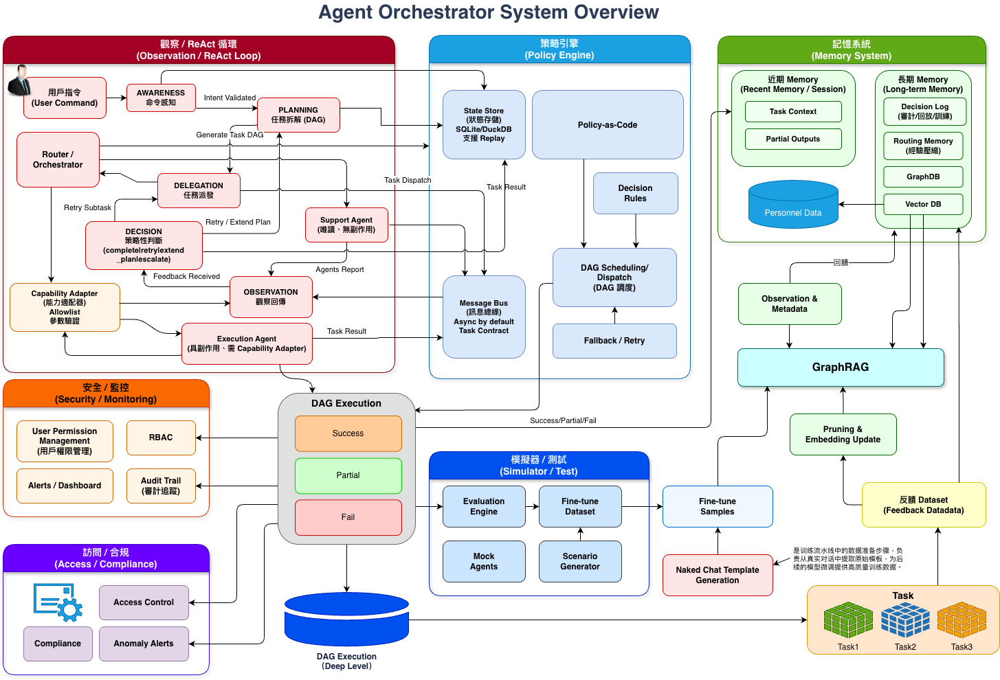
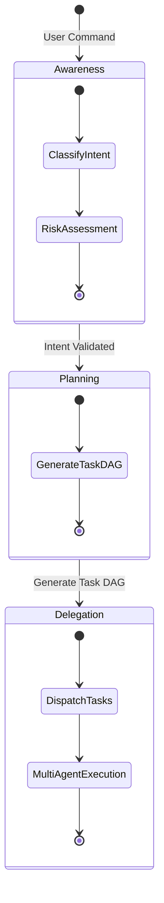

# AI-Box Agent 架構規格書 v3

**版本**：3.2**創建日期**：2026-01-08**創建人**：Daniel Chung**最後修改日期**：2026-01-08

> **📋 本文檔整合了以下文檔的精華內容**：
>
> - [Agent_Orchestration_White_Paper.md](./Agent_Orchestration_White_Paper.md) - GraphRAG-Orchestrator (GRO) 技術白皮書（理論框架）
> - [archive/AI-Box-Agent-架構規格書-v2.md](./archive/AI-Box-Agent-架構規格書-v2.md) - v2 版架構規格書（實現細節，已歸檔）
> - [Orchestrator-協調層規格書.md](./Orchestrator-協調層規格書.md) - Orchestrator 協調層完整規格
> - [Agent-開發規範.md](./Agent-開發規範.md) - Agent 開發指南（包含架構分離設計）
> - [archive/ARCHITECTURE_DIAGRAM_EXPLANATION.md](./archive/ARCHITECTURE_DIAGRAM_EXPLANATION.md) - 架構設計圖說明（已歸檔，內容已整合到本文檔）
> - [archive/Agent-Platform.md](./archive/Agent-Platform.md) - Agent Platform 架構文檔（已歸檔）
>
> **📦 歸檔說明**：v2 版架構規格書和 Agent-Platform.md 已歸檔到 `archive/` 目錄，內容已整合到本 v3 版文檔中。詳見 [archive/README.md](./archive/README.md)
>
> **🚀 升級計劃**：詳細的系統升級計劃請參考 [AI-Box-Agent-架構升級計劃-v3.md](./AI-Box-Agent-架構升級計劃-v3.md)

> **實現狀態標記說明**：
>
> - ✅ **已實現**：功能已完整實現並可用
> - 🔄 **部分實現**：功能已實現但需要增強或完善
> - ❌ **未實現**：功能尚未實現，需要開發
> - 🔧 **需要修改**：功能已實現但需要根據新需求修改

---

## 目錄

1. [架構概述](#1-架構概述)
   - [設計理念](#11-設計理念)
   - [整體架構圖](#12-整體架構圖)
     - [三層架構視圖](#121-三層架構視圖)
     - [GRO 完整系統架構圖（Mermaid）](#122-gro-完整系統架構圖mermaid)
     - [ReAct 循環架構圖](#123-react-循環架構圖)
     - [GRO 系統架構圖（原始圖片參考）](#124-gro-系統架構圖原始圖片參考)
2. [理論框架：GraphRAG-Orchestrator (GRO)](#2-理論框架graphrag-orchestrator-gro)
3. [三層架構設計](#3-三層架構設計)
4. [協調層（AI-Box Orchestration Agent）](#4-協調層ai-box-orchestration-agent)
5. [專屬服務層（Dedicated Service Agents）](#5-專屬服務層dedicated-service-agents)
6. [業務執行層（Business Process Agents）](#6-業務執行層business-process-agents)
7. [通信協議與接口](#7-通信協議與接口)
8. [實現狀態與開發路線圖](#8-實現狀態與開發路線圖)
9. [附錄：GRO 技術規範](#9-附錄gro-技術規範)
10. [參考文檔](#10-參考文檔)

---

## 1. 架構概述

### 1.1 設計理念

AI-Box Agent 系統採用**三層分離架構**，結合 **GraphRAG-Orchestrator (GRO)** 理論框架，實現職責清晰、易於擴展、可審計、可回放的 Multi-Agent 協作平台。

**核心設計原則**：

1. **統一協調**：所有 Agent 調用都通過 Orchestrator
2. **服務共享**：專屬服務 Agent 提供共享能力，避免重複開發
3. **業務隔離**：業務 Agent 專注於業務邏輯，不直接訪問基礎設施
4. **異步支持**：支持異步任務執行和狀態追蹤
5. **指令澄清**：當指令不明確時，主動澄清而非降級處理
6. **ReAct FSM**：將 ReAct 循環工程化為有限狀態機，每一步可序列化、可回放、可中斷、可重試
7. **Policy-as-Code**：將決策準則抽象為政策即代碼，支持動態熱加載
8. **本地優先**：控制平面本地化，確保數據隱私和安全

### 1.2 整體架構圖

#### 1.2.1 三層架構視圖

```
┌─────────────────────────────────────────────────────────┐
│  第一層：協調層（AI-Box Orchestration Agent）          │
│  - Task Analyzer（任務分析器）                          │
│  - Agent Registry（Agent 註冊表）                       │
│  - Agent Orchestrator（Agent 協調器）                   │
│  - Task Tracker（任務追蹤器）                           │
│  - Policy Engine（政策引擎）                            │
│  - State Store（狀態存儲）                              │
└─────────────────────────────────────────────────────────┘
                        ↓ 統一調用接口（Task Contract）
┌─────────────────────────────────────────────────────────┐
│  第二層：專屬服務層（Dedicated Service Agents）        │
│  - Security Agent（安全代理）                            │
│  - Reports Agent（報告代理）                             │
│  - System Config Agent（系統配置代理）                   │
│  - MoE Agent（模型路由代理）                             │
│  - Knowledge Ontology Agent（知識圖譜代理）              │
│  - Data Agent（數據代理）                                │
└─────────────────────────────────────────────────────────┘
                        ↓ 服務調用
┌─────────────────────────────────────────────────────────┐
│  第三層：業務執行層（Business Process Agents）          │
│  - Planning Agent（規劃代理）                            │
│  - Execution Agent（執行代理）                           │
│  - Review Agent（審查代理）                              │
│  - HR Recruiting Agent（人力資源代理）                   │
│  - Finance Auditing Agent（財務審計代理）                │
└─────────────────────────────────────────────────────────┘
```

#### 1.2.2 GRO 完整系統架構圖（Mermaid）

以下展示 GRO 在 AI-Box 中的完整部署拓撲，強調了 Control Plane (控制平面) 的本地化與 Cloud (雲端) 的「分析外包」定位：

```mermaid
graph TB
    subgraph ControlPlane["🖥️ Control Plane（控制平面）- 本地化"]
        direction TB
        subgraph OrchestratorCore["Orchestrator 核心"]
            TA[Task Analyzer<br/>任務分析器<br/>✅ 已實現]
            AR[Agent Registry<br/>Agent 註冊表<br/>✅ 已實現]
            AO[Agent Orchestrator<br/>Agent 協調器<br/>✅ 已實現]
            TT[Task Tracker<br/>任務追蹤器<br/>🔄 部分實現]
        end

        subgraph GROComponents["GRO 核心組件"]
            PE[Policy Engine<br/>政策引擎<br/>❌ 未實現]
            SS[State Store<br/>狀態存儲<br/>❌ 未實現]
            OC[Observation Collector<br/>觀察收集器<br/>❌ 未實現]
        end

        subgraph ReActFSM["ReAct FSM 循環"]
            AW[Awareness<br/>命令感知]
            PL[Planning<br/>任務規劃]
            DL[Delegation<br/>任務派發]
            OB[Observation<br/>觀察回傳]
            DC[Decision<br/>策略判斷]

            AW --> PL
            PL --> DL
            DL --> OB
            OB --> DC
            DC -->|Retry/Extend| PL
            DC -->|Complete| [*]
        end

        TA --> AW
        AO --> DL
        OC --> OB
        PE --> DC
        SS --> ReActFSM
    end

    subgraph DataPlane["📊 Data Plane（資料平面）"]
        direction TB
        subgraph SupportAgents["Support Agents（支援代理）"]
            SA1[Security Agent<br/>✅ 已實現]
            SA2[Reports Agent<br/>🔄 部分實現]
            SA3[MoE Agent<br/>🔄 需要封裝]
            SA4[Knowledge Ontology Agent<br/>🔄 需要封裝]
            SA5[Data Agent<br/>❌ 未實現]
        end

        subgraph DataResources["資料資源"]
            RAG[RAG<br/>向量檢索]
            GraphRAG[GraphRAG<br/>知識圖譜]
            Docs[文件庫<br/>Document Store]
        end

        SupportAgents --> RAG
        SupportAgents --> GraphRAG
        SupportAgents --> Docs
    end

    subgraph ActionPlane["⚙️ System/Action Plane（系統/動作平面）"]
        direction TB
        subgraph ExecutionAgents["Execution Agents（執行代理）"]
            EA1[Planning Agent<br/>✅ 已實現]
            EA2[Execution Agent<br/>✅ 已實現]
            EA3[Review Agent<br/>✅ 已實現]
            EA4[HR Recruiting Agent<br/>❌ 未實現]
            EA5[Finance Auditing Agent<br/>❌ 未實現]
        end

        subgraph CapabilityAdapters["Capability Adapters（能力適配器）"]
            CA1[文件操作 Adapter]
            CA2[資料庫 Adapter]
            CA3[API 調用 Adapter]
            CA4[系統 Shell Adapter]
        end

        subgraph Tools["工具層"]
            FS[檔案系統]
            DB[資料庫]
            API[外部 API]
            OS[作業系統]
        end

        ExecutionAgents --> CapabilityAdapters
        CapabilityAdapters --> Tools
    end

    subgraph Cloud["☁️ Cloud（可選外掛）- 僅分析外包"]
        direction TB
        CloudLLM[Cloud LLM<br/>GPT-4o / Claude<br/>僅用於 Support Agents]
    end

    subgraph MessageBus["📡 Message Bus（訊息總線）"]
        MB[Async Message Bus<br/>異步訊息總線<br/>Task Contract 模式]
    end

    %% Control Plane 連接
    OrchestratorCore --> MessageBus
    GROComponents --> MessageBus
    ReActFSM --> MessageBus

    %% Message Bus 連接各平面
    MessageBus <--> DataPlane
    MessageBus <--> ActionPlane
    MessageBus <--> Cloud

    %% Cloud 僅連接到 Support Agents
    CloudLLM -.->|僅 Observation| SupportAgents

    %% 安全控制
    CapabilityAdapters -.->|Air-gap Policy<br/>禁止雲端| ExecutionAgents

    %% 樣式定義
    classDef controlPlane fill:#e1f5ff,stroke:#01579b,stroke-width:3px
    classDef dataPlane fill:#fff3e0,stroke:#e65100,stroke-width:2px
    classDef actionPlane fill:#f3e5f5,stroke:#4a148c,stroke-width:2px
    classDef cloud fill:#e8f5e9,stroke:#2e7d32,stroke-width:2px,stroke-dasharray: 5 5
    classDef messageBus fill:#fce4ec,stroke:#c2185b,stroke-width:2px
    classDef implemented fill:#d4edda,stroke:#28a745
    classDef partial fill:#fff3cd,stroke:#ffc107
    classDef notImplemented fill:#f8d7da,stroke:#dc3545

    class ControlPlane,OrchestratorCore,GROComponents,ReActFSM controlPlane
    class DataPlane,SupportAgents,DataResources dataPlane
    class ActionPlane,ExecutionAgents,CapabilityAdapters,Tools actionPlane
    class Cloud,CloudLLM cloud
    class MessageBus,MB messageBus
    class TA,AR,AO,SA1,EA1,EA2,EA3 implemented
    class TT,SA2,SA3,SA4 partial
    class PE,SS,OC,SA5,EA4,EA5 notImplemented
```

**架構說明**：

1. **Control Plane（控制平面）**：本地化部署，負責決策、調度、審計，不直接做具副作用的行為

   - **Orchestrator 核心**：Task Analyzer、Agent Registry、Agent Orchestrator、Task Tracker
   - **GRO 核心組件**：Policy Engine、State Store、Observation Collector
   - **ReAct FSM 循環**：Awareness → Planning → Delegation → Observation → Decision
2. **Data Plane（資料平面）**：Support Agents（唯讀分析/檢索）與其檢索資源

   - Support Agents：Security Agent、Reports Agent、MoE Agent、Knowledge Ontology Agent、Data Agent
   - 資料資源：RAG、GraphRAG、文件庫
3. **System/Action Plane（系統/動作平面）**：Execution Agents + Capability Adapters + 真正工具/OS/API（具副作用）

   - Execution Agents：Planning Agent、Execution Agent、Review Agent 等
   - Capability Adapters：文件操作、資料庫、API 調用、系統 Shell 適配器
   - 工具層：檔案系統、資料庫、外部 API、作業系統
4. **Cloud（可選外掛）**：只允許作為 Support Agent 的「分析外包」

   - Cloud LLM（如 GPT-4o、Claude）僅能產生 Observation
   - 不得注入控制決策
   - Execution Agents 禁止使用雲端（Air-gap Policy）
5. **Message Bus（訊息總線）**：異步訊息總線，採用 Task Contract 模式

   - 所有代理間通訊都通過 Message Bus
   - 遵循 Task Contract（任務合約）模式
   - 支持 fan-out（多發）和 fan-in（匯整）

#### 1.2.3 ReAct 循環架構圖

GRO 將 ReAct 循環工程化為一個可觀測、可回溯的流程引擎，執行「感知-思考-行動」的循環：



**ReAct FSM 狀態說明**：

- **AWARENESS（命令感知）**：判斷指令是否具備可操作性 (Actionable)，並進行初步風險評估
- **PLANNING（規劃）**：將任務拆解為結構化的任務依賴圖 (Task DAG)
- **DELEGATION（任務派發）**：將任務分發給合適的 Agent
- **OBSERVATION（觀察回傳）**：收集 Agent 執行結果
- **DECISION（策略性判斷）**：根據觀察結果和決策預期決定下一步（Complete / Retry / Extend Plan / Escalate）

#### 1.2.4 GRO 系統架構圖（原始圖片參考）

> **註**：原始系統架構圖請參考 [Agent_Orchestration_White_Paper.md](./Agent_Orchestration_White_Paper.md) 第 3.7 節。上述 Mermaid 架構圖已完整展示 GRO 系統的部署拓撲和組件關係。

以下展示 GRO 在 AI-Box 中的完整部署拓撲，強調了 Control Plane (控制平面) 的本地化與 Cloud (雲端) 的「分析外包」定位：

**原始圖片位置**：`image/Agent_Orchestration_White_Paper/1767763738013.png`（如存在）

**架構設計原則**：

- **本地優先**：Control Plane 必須本地化，確保數據隱私和安全
- **能力與權力分離**：Support Agents（唯讀）與 Execution Agents（具副作用）嚴格分離
- **Air-gap Policy**：Execution Agents 禁止雲端；Cloud 僅能產生 Observation
- **Task Contract**：所有代理協作皆受限於明確的合約邊界
- **可審計性**：所有決策和操作都可追溯和回放

**名詞與邊界定義**：

- **Control Plane（控制平面）**：Orchestrator + Policy Engine + State Store + Observation Collector。負責決策、調度、審計，不直接做具副作用的行為。
- **Data Plane（資料平面）**：Support Agents（唯讀分析/檢索）與其檢索資源（RAG、GraphRAG、文件庫）。
- **System / Action Plane（系統/動作平面）**：Execution Agents + Capability Adapters + 真正工具/OS/API（具副作用）。
- **Cloud（可選外掛）**：只允許作為 Support Agent 的「分析外包」，其輸出必須以 Observation 形式回流，不得注入控制決策。

---

## 2. 理論框架：GraphRAG-Orchestrator (GRO)

### 2.1 GRO 核心概念

**GraphRAG-Orchestrator (GRO)** 是一個專為複雜任務環境設計的全本地化多代理協作框架，核心整合了 **ReAct 循環 (Observe-Think-Act)** 與基於 **GraphRAG** 的結構化知識檢索技術。

**GRO 核心原則**：

- **Orchestrator 不直接 Tool Call**：只能發出結構化任務合約（Task Contract），並依 Observations 做有限決策
- **ReAct = FSM**：每一步可序列化、可回放、可中斷、可重試（deterministic & auditable）
- **Async by default**：多發（fan-out）/多收（fan-in）是原生能力
- **本地優先，雲端可選且無控制權**：Cloud LLM 僅能產生「Observation」，不得掌握控制面或狀態面

### 2.2 ReAct 決策狀態機

GRO 將 ReAct 循環工程化為一個可觀測、可回溯的流程引擎：



**狀態說明**：

| 狀態 (State)          | 核心目標            | 輸出合約關鍵欄位                                                    |
| --------------------- | ------------------- | ------------------------------------------------------------------- |
| **AWARENESS**   | 感知意圖與風險      | `{"actionable": bool, "requires_planning": bool}`                 |
| **PLANNING**    | 任務拆解 (DAG)      | `{"plan": {"steps": [{"step_id": "...", "agent_role": "..."}]}}`  |
| **DELEGATION**  | 任務派發 (Dispatch) | `{"delegations": [{"task_id": "...", "delegate_to": "..."}]}`     |
| **OBSERVATION** | 觀察回傳 (Collect)  | `{"observations": [{"task_id": "...", "status": "success"}]}`     |
| **DECISION**    | 策略性判斷 (Act)    | `{"decision": {"action": "complete\|retry\|extend_plan\|escalate"}}` |

### 2.3 代理協作規則

GRO 強調「能力與權力的分離」：

- **支援代理 (Support Agents)**：唯讀、無副作用。負責 RAG 檢索、長文總結、數據分析。可接入雲端 LLM 進行非控制性推理。
- **執行代理 (Execution Agents)**：具備核心系統修改權限（如資料庫操作、API 呼叫）。必須全本地化運行，且受限於「能力適配器 (Capability Adapter)」。
- **沙箱隔離 (Sandbox)**：代理間無共享記憶體，僅能透過程式訊息總線 (Message Bus) 進行非同步通訊 (Async by default)。

### 2.4 政策引擎 (Policy Engine)

取代硬編碼的邏輯，將決策準則抽象為 **政策即代碼 (Policy-as-Code)**：

- **多代理調度策略**：定義 Fan-out (多發同步) 與 Fan-in (匯整觀察) 的觸發條件
- **動態熱加載**：可針對不同專案、不同風險等級即時更換調度政策
- **衝突處理**：確保並行 (Parallel) 執行時不會發生死鎖或數據競爭

**政策格式示例**：

```yaml
spec_version: "1.0"
defaults:
  max_parallel_agents: 3
  retry:
    max_retry: 2
    backoff_sec: 30
  fan_in:
    mode: all

rules:
  - name: "local_only_guard"
    when:
      constraints.local_only: true
    then:
      forbid:
        capabilities:
          - "capability.cloud_call"

  - name: "retry_on_timeout"
    when:
      observation_summary.blocking_issues: true
      observations.any_issue_type_in: ["timeout"]
      retry_count.lt: 2
    then:
      decision:
        action: "retry"
        next_state: "DELEGATION"
```

### 2.5 多層記憶策略

記憶體並非單一的向量庫，而是具備生命週期的管理系統：

- **短期工作記憶 (Working Memory)**：存放當前 session 的 Scratchpad (草稿紙)、中間變數與臨時上下文
- **長期決策記憶 (Routing Memory)**：透過向量化存儲歷史決策與結果模式
- **記憶裁剪 (Pruning)**：根據使用頻率 (Frequency-based) 與 TTL (Time-to-Live) 自動清理低價值數據，保持匹配效率

---

## 3. 三層架構設計

### 3.1 第一層：協調層（AI-Box Orchestration Agent）

**職責**：任務分析、Agent 管理、任務路由與協調

**核心組件**：

1. **Task Analyzer（任務分析器）** ✅ **已實現**

   - 任務分類與意圖識別
   - 槽位提取與指令澄清
   - Agent 能力匹配
   - 工作流選擇（LangChain/CrewAI/AutoGen/Hybrid）
   - 配置操作專用解析（生成 `ConfigIntent`）
2. **Agent Registry（Agent 註冊表）** ✅ **已實現**

   - Agent 註冊與發現
   - 健康監控與負載均衡
   - 權限管理與安全審計
   - Agent 能力索引
   - `input_schema` 支持（前置檢查約束）
3. **Agent Orchestrator（Agent 協調器）** ✅ **已實現**

   - 任務路由與分發
   - 結果聚合與管理
   - 異步任務追蹤
   - 統一服務調用接口（ATC）
   - 第一層預檢（格式與邊界驗證）
   - 自然語言理解與意圖解析
   - 結果修飾（使用 LLM 轉換為自然語言）
4. **Task Tracker（任務追蹤器）** 🔄 **部分實現**

   - 任務記錄與狀態追蹤
   - 異步任務支持
   - 任務狀態查詢 API
5. **Policy Engine（政策引擎）** ❌ **未實現**

   - Policy-as-Code 支持
   - 動態熱加載
   - 衝突處理
6. **State Store（狀態存儲）** ❌ **未實現**

   - ReAct 狀態持久化
   - Decision Log 存儲
   - 狀態回放支持

### 3.2 第二層：專屬服務層（Dedicated Service Agents）

**職責**：提供共享服務，供業務 Agent 調用

**服務列表**：

| 服務 Agent               | 功能描述                                | 狀態        | 詳細規格                                                      |
| ------------------------ | --------------------------------------- | ----------- | ------------------------------------------------------------- |
| Security Agent           | 權限驗證、風險評估、安全審計            | ✅ 已實現   | [Security-Agent-規格書.md](./Security-Agent-規格書.md)           |
| System Config Agent      | 系統設置服務、配置管理、參數調整        | ✅ 已實現   | [System-Config-Agent-規格書.md](./System-Config-Agent-規格書.md) |
| Reports Agent            | 報告生成（HTML/JSON/PDF）、結構化輸出   | 🔄 部分實現 | -                                                             |
| MoE Agent                | LLM 路由服務、模型選擇、成本優化        | 🔄 需要封裝 | -                                                             |
| Knowledge Ontology Agent | 知識圖譜服務、Ontology 管理、GraphRAG   | 🔄 需要封裝 | -                                                             |
| Data Agent               | 數據查詢服務、Text-to-SQL、安全查詢閘道 | ❌ 未實現   | -                                                             |
| Analyzer Agent           | 數據分析服務、統計分析、可視化          | ❌ 未實現   | -                                                             |
| Status Agent             | 狀態監控服務、任務狀態追蹤、健康檢查    | ❌ 未實現   | -                                                             |
| Coder Agent              | 代碼生成、代碼執行、代碼審查            | ❌ 未實現   | -                                                             |

### 3.3 第三層：業務執行層（Business Process Agents）

**職責**：執行具體業務邏輯

**業務 Agent 列表**：

| 業務 Agent             | 功能描述           | 狀態      |
| ---------------------- | ------------------ | --------- |
| Planning Agent         | 任務規劃、計劃生成 | ✅ 已實現 |
| Execution Agent        | 任務執行、工具調用 | ✅ 已實現 |
| Review Agent           | 結果審查、質量檢查 | ✅ 已實現 |
| HR Recruiting Agent    | 人力資源招聘業務   | ❌ 未實現 |
| Finance Auditing Agent | 財務審計業務       | ❌ 未實現 |
| Quotation Agent        | 報價業務           | ❌ 未實現 |
| Purchase Inquiry Agent | 採購詢價業務       | ❌ 未實現 |
| QC Analyzer Agent      | 質量控制分析業務   | ❌ 未實現 |

---

## 4. 協調層（AI-Box Orchestration Agent）

### 4.1 Task Analyzer（任務分析器）

#### 4.1.1 核心功能

**✅ 已實現**：

- 任務分類（`agents/task_analyzer/classifier.py`）
- 工作流選擇（`agents/task_analyzer/workflow_selector.py`）
- LLM 路由選擇（`agents/task_analyzer/llm_router.py`）

**❌ 需要新增**：

- 指令澄清機制（槽位提取、澄清問題生成）
- 意圖識別增強（支持配置操作、系統設置等）
- 前端指定 Agent 的驗證邏輯
- 配置操作專用解析（生成 `ConfigIntent`）

#### 4.1.2 數據模型

```python
class TaskAnalysisRequest(BaseModel):
    """任務分析請求"""
    task: str  # 自然語言指令
    context: Optional[Dict[str, Any]] = None
    user_id: Optional[str] = None
    session_id: Optional[str] = None
    specified_agent_id: Optional[str] = None  # 前端指定的 Agent ID

class TaskAnalysisResult(BaseModel):
    """任務分析結果"""
    task_type: str  # 任務類型
    workflow_type: str  # 工作流類型
    suggested_agents: List[str]  # 建議的 Agent 列表
    intent: Optional[Dict[str, Any]] = None  # 結構化意圖（如 ConfigIntent）
    clarification_needed: bool = False
    clarification_question: Optional[str] = None
    missing_slots: List[str] = []
    confidence: float  # 分析置信度

class ConfigIntent(BaseModel):
    """配置操作意圖"""
    action: Literal["query", "create", "update", "delete", "list", "rollback"]
    scope: str  # 配置範圍，如 "genai.policy"
    level: Literal["system", "tenant", "user"]
    tenant_id: Optional[str] = None
    user_id: Optional[str] = None
    config_data: Optional[Dict[str, Any]] = None
    clarification_needed: bool = False
    clarification_question: Optional[str] = None
    missing_slots: List[str] = []
    original_instruction: str
```

### 4.2 Agent Registry（Agent 註冊表）

#### 4.2.1 核心功能

**✅ 已實現**：

- Agent 註冊機制（`agents/services/registry/registry.py`）
- Agent 發現機制（`agents/services/registry/discovery.py`）
- 健康監控（`agents/services/registry/health_monitor.py`）
- 權限管理（`agents/services/registry/models.py`）

**🔄 需要增強**：

- 安全審計與測試機制
- 負載均衡策略優化

#### 4.2.2 數據模型

```python
class AgentRegistryInfo(BaseModel):
    """Agent 註冊信息"""
    agent_id: str
    agent_type: str  # "dedicated_service" | "business_process"
    name: str
    status: AgentStatus  # REGISTERING | ONLINE | MAINTENANCE | DEPRECATED | OFFLINE
    endpoints: AgentEndpoints
    capabilities: List[str]
    metadata: AgentMetadata
    permissions: AgentPermissionConfig
    registered_at: datetime
    last_heartbeat: Optional[datetime]
    load: int
```

### 4.3 Agent Orchestrator（Agent 協調器）

#### 4.3.1 核心功能

**✅ 已實現**：

- 任務路由與分發（`agents/services/orchestrator/orchestrator.py`）
- 結果聚合（`agents/services/processing/aggregator.py`）
- 負載均衡

**❌ 需要新增**：

- 統一服務調用接口（`call_service()` 方法）
- 異步任務追蹤（持久化到 ArangoDB）
- 任務狀態查詢 API
- 第一層預檢（格式與邊界驗證）
- 結果修飾（使用 LLM 轉換為自然語言）

#### 4.3.2 完整流程

```
自然語言指令
    ↓
Orchestrator 接收
    ↓
Task Analyzer 解析意圖
    ├── 任務分類
    ├── 槽位提取
    ├── 指令澄清檢查
    └── 生成結構化意圖
    ↓
第一層預檢（格式與邊界驗證）
    ↓
Security Agent 權限檢查
    ↓
Agent Registry 發現合適的 Agent
    ↓
Task Tracker 創建任務記錄
    ↓
Orchestrator 分發任務給目標 Agent
    ↓
Agent 執行任務
    ↓
Orchestrator 收集結果
    ↓
結果修飾（使用 LLM 轉換為自然語言）
    ↓
返回給前端
```

### 4.4 Task Tracker（任務追蹤器）

#### 4.4.1 職責

- 任務記錄與狀態追蹤
- 異步任務支持
- 任務狀態查詢 API

#### 4.4.2 數據模型

```python
class TaskRecord(BaseModel):
    """任務記錄"""
    task_id: str
    instruction: str
    intent: Optional[Dict[str, Any]] = None
    target_agent_id: str
    user_id: str
    status: TaskStatus  # pending/running/completed/failed
    created_at: datetime
    updated_at: datetime
    result: Optional[Dict[str, Any]] = None
    error: Optional[str] = None
```

---

## 5. 專屬服務層（Dedicated Service Agents）

### 5.1 Security Agent ✅

**實現位置**：`agents/builtin/security_manager/agent.py`

**功能**：

- ⭐ **權限驗證**：檢查「這件事誰能做」（RBAC、層級權限、租戶隔離）
- ⭐ **風險評估**：判斷「這件事危不危險」（高/中/低風險，二次確認機制）
- ⭐ **審計上下文**：為審計日誌提供安全相關的上下文信息
- 安全審計與日誌記錄

**詳細說明請參考**：[Security-Agent-規格書.md](./Security-Agent-規格書.md)

### 5.2 System Config Agent ✅

**實現位置**：`agents/builtin/system_config_agent/`

**功能**：

- ⭐ **自然語言交互**：通過 AI 聊天方式進行系統設置
- ⭐ **配置管理**：系統級/租戶級/用戶級三層配置管理
- ⭐ **配置驗證**：雙層驗證機制（第一層預檢 + 第二層深檢）
- ⭐ **配置預覽**：先預覽後執行，影響分析與成本預估
- ⭐ **時光機功能**：基於審計日誌的配置回滾
- ⭐ **主動巡檢**：主動檢測配置衝突並提供修復建議

**詳細說明請參考**：[System-Config-Agent-規格書.md](./System-Config-Agent-規格書.md)

### 5.3 Reports Agent 🔄

**實現位置**：`agents/services/processing/report_generator.py`

**已實現功能**：

- HTML 報告生成 ✅
- Markdown 報告生成 ✅

**需要增強**：

- 結構化 JSON 輸出（`displayType: inline/link`）❌
- PDF 報告生成 ❌
- 內嵌圖表數據（`inlineData`）❌
- 報告存儲服務 ❌

### 5.4 MoE Agent 🔄

**實現位置**：`llm/moe/moe_manager.py`

**已實現功能**：

- MoE 路由系統 ✅
- 多種路由策略 ✅
- 負載均衡 ✅
- 故障轉移 ✅

**需要增強**：

- 封裝為專屬服務 Agent ❌
- 統一調用接口 ❌

### 5.5 Knowledge Ontology Agent 🔄

**實現位置**：

- `genai/api/services/kg_builder_service.py`
- `kag/kag_schema_manager.py`

**已實現功能**：

- 知識圖譜構建 ✅
- Ontology 管理 ✅
- 圖譜查詢 ✅

**需要增強**：

- 封裝為專屬服務 Agent ❌
- GraphRAG 支持增強 🔄

---

## 6. 業務執行層（Business Process Agents）

### 6.1 Planning Agent ✅

**實現位置**：`agents/core/planning/agent.py`

**功能**：

- 任務規劃
- 計劃生成

### 6.2 Execution Agent ✅

**實現位置**：`agents/core/execution/agent.py`

**功能**：

- 任務執行
- 工具調用

### 6.3 Review Agent ✅

**實現位置**：`agents/core/review/agent.py`

**功能**：

- 結果審查
- 質量檢查

---

## 7. 通信協議與接口

### 7.1 Agent Service Protocol

**✅ 已實現**：`agents/services/protocol/base.py`

**支持的協議**：

- HTTP REST API ✅
- MCP Protocol ✅

### 7.2 任務合約 (Task Contract)

GRO 採用異步訊息總線 (Async Message Bus) 作為代理間的通訊基礎，遵循 **Task Contract (任務合約)** 模式。

#### 7.2.1 任務派發 (TASK_DISPATCH)

```json
{
  "message_type": "TASK_DISPATCH",
  "react_id": "uuid",
  "task_id": "uuid",
  "delegate_to": "execution_agent",
  "objective": "寫入日報檔案",
  "context": { "file_path": "/logs/daily.txt", "content": "..." },
  "policy": { "max_retry": 2, "timeout_sec": 300 },
  "success_criteria": ["file_exists", "content_match"]
}
```

#### 7.2.2 任務成果回報 (TASK_RESULT)

```json
{
  "message_type": "TASK_RESULT",
  "react_id": "uuid",
  "task_id": "uuid",
  "agent_id": "support_agent|execution_agent",
  "status": "success|partial|failed",
  "result": {
    "summary": "string",
    "data": {}
  },
  "issues": [
    { "type": "permission|missing_data|timeout|execution_error|unknown", "message": "string" }
  ],
  "confidence": 0.0,
  "execution_meta": {
    "started_at": "iso8601",
    "ended_at": "iso8601"
  }
}
```

### 7.3 調度邏輯：多發與匯整 (Fan-out / Fan-in)

為了支援「多次多發」，Orchestrator 具備並行調度能力：

- **Fan-out**: 在單次迭代中，Orchestrator 可將不同子任務同時派發給多個代理（如同步查詢資料庫與掃描本地文件）
- **Fan-in (Observation Summary)**: 當所有並行任務回傳或超時後，由 **Observation Collector** 匯整，並根據 `quorum` 或 `all_pass` 規則產出綜合評估，交由 Decision 階段處理

### 7.4 Decision 合約：只能做 4 件事

為確保 deterministic & auditable，DECISION 不允許自由生成「任意下一步」：

```json
{
  "decision": {
    "action": "complete|retry|extend_plan|escalate",
    "reason": "string",
    "next_state": "COMPLETE|DELEGATION|PLANNING"
  }
}
```

決策規則：

- `complete`：滿足 `success_criteria` 且風險政策允許
- `retry`：錯誤可修正且符合 retry policy（例如 timeout、可重試依賴）
- `extend_plan`：需要新增/拆分 subtasks（常見於 partial_success）
- `escalate`：超出權限/風險（restricted/critical）或低信心且反覆失敗

---

## 8. 實現狀態與開發路線圖

### 8.1 實現狀態統計

| 類別           | 已實現       | 部分實現    | 未實現       | 總計         |
| -------------- | ------------ | ----------- | ------------ | ------------ |
| 協調層組件     | 7            | 2           | 4            | 13           |
| 專屬服務 Agent | 4            | 4           | 4            | 12           |
| 業務 Agent     | 3            | 0           | 5            | 8            |
| 工具層服務     | 0            | 0           | 2            | 2            |
| **總計** | **14** | **6** | **15** | **35** |

**完成度**：40.0% (14/35)，部分實現 17.1% (6/35)

### 8.2 開發路線圖

#### 第一階段：核心功能完善（2-3週）

**目標**：完善協調層核心功能和工具層服務

**任務**：

1. ✅ 實現 LogService（統一日誌服務）
2. ✅ 實現 ConfigMetadata（配置元數據機制）
3. ✅ 增強 Orchestrator 協調層
4. ✅ 增強 Security Agent
5. ✅ 實現指令澄清機制
6. ✅ 實現統一服務調用接口（ATC）

**優先級**：高（所有後續開發的前置條件）

#### 第二階段：GRO 架構轉型（3-4週）

**目標**：引入 GRO 理論框架，實現 ReAct FSM 和政策引擎

**任務**：

1. ❌ FSM 重構：將 `AgentOrchestrator` 改寫為支持 ReAct 狀態轉移的流程引擎
2. ❌ 政策引擎導入：定義第一版本 YAML 政策文件，接管任務分發決策
3. ❌ 適配器中介：為 Execution Agents 建立初步的 `Capability Adapter`
4. ❌ State Store 實作：導入狀態存儲機制，支持 Decision Log

**優先級**：高（GRO 核心功能）

#### 第三階段：記憶優化與數據採集（2-3週）

**目標**：實現多層記憶策略和數據採集機制

**任務**：

1. ❌ Routing Memory 實作：導入向量資料庫存儲關鍵決策模式
2. ❌ 結構化日誌：升級 `LogService` 以支持符合 GRO 規範的 `Decision Log` 格式
3. ❌ 記憶裁剪任務：開發背景程序，定期進行數據清理與 Embedding 更新

**優先級**：中

#### 第四階段：專屬服務完善（2-3週）

**目標**：完善和新增其他專屬服務 Agent

**任務**：

1. ✅ 增強 Reports Agent
2. ✅ 封裝 MoE Agent
3. ✅ 封裝 Knowledge Ontology Agent
4. ✅ 實現 Data Agent

**優先級**：中

#### 第五階段：自適應進化（3-4週）

**目標**：實現模擬器和本地模型微調

**任務**：

1. ❌ 模擬器開發：建立基於 DAG 的隨機模擬環境，產生異常情境數據
2. ❌ 本地模型微調：利用採集的數據對本地 `Router/Orchestrator` 模型進行微調
3. ❌ 自動化測評：建立評估機制，對比微調前後的決策成功率

**優先級**：低（長期目標）

---

## 9. 附錄：GRO 技術規範

本附錄的目標是把 GRO 從「設計描述」補到「可直接實作與驗證」：提供 schema、策略規格、權限矩陣與端到端範例。為控制文件長度，以下 schema 以「Draft 等級」呈現：**足以約束系統行為、支援 validator 落地**，但不追求覆蓋 JSON Schema 全細節（可在工程 repo 內再機械化生成）。

### 9.1 Message Contracts JSON Schema（Draft）

#### 9.1.1 Global Envelope（建議所有核心訊息共用）

```json
{
  "$schema": "https://json-schema.org/draft/2020-12/schema",
  "$id": "gro.schema.global_envelope.v1",
  "type": "object",
  "required": ["spec_version", "react_id", "iteration", "trace", "timestamps"],
  "properties": {
    "spec_version": { "type": "string", "enum": ["1.0"] },
    "react_id": { "type": "string", "minLength": 8 },
    "iteration": { "type": "integer", "minimum": 0 },
    "trace": {
      "type": "object",
      "required": ["correlation_id"],
      "properties": {
        "correlation_id": { "type": "string", "minLength": 8 },
        "parent_task_id": { "type": ["string", "null"], "minLength": 8 }
      },
      "additionalProperties": true
    },
    "timestamps": {
      "type": "object",
      "required": ["created_at"],
      "properties": {
        "created_at": { "type": "string" },
        "sent_at": { "type": "string" }
      },
      "additionalProperties": true
    }
  },
  "additionalProperties": true
}
```

建議規則：

- `spec_version`：白皮書版本與程式驗證器一致，用於回放與向後相容治理。
- `react_id`：一次 ReAct session 的主鍵。
- `correlation_id`：跨系統追蹤（log/metric/trace）一致鍵。

#### 9.1.2 TASK_DISPATCH（Task Contract / Dispatch）

```json
{
  "$schema": "https://json-schema.org/draft/2020-12/schema",
  "$id": "gro.schema.task_dispatch.v1",
  "type": "object",
  "required": [
    "message_type",
    "react_id",
    "iteration",
    "task_id",
    "delegate_to",
    "objective",
    "context",
    "success_criteria",
    "timeout_sec",
    "policy"
  ],
  "properties": {
    "message_type": { "type": "string", "const": "TASK_DISPATCH" },
    "react_id": { "type": "string", "minLength": 8 },
    "iteration": { "type": "integer", "minimum": 0 },
    "task_id": { "type": "string", "minLength": 8 },
    "delegate_to": { "type": "string", "enum": ["support_agent", "execution_agent"] },
    "objective": { "type": "string", "minLength": 1 },
    "context": {
      "type": "object",
      "properties": {
        "background": { "type": "string" },
        "constraints": { "type": "array", "items": { "type": "string" } },
        "inputs": { "type": "object" }
      },
      "additionalProperties": true
    },
    "success_criteria": { "type": "array", "minItems": 1, "items": { "type": "string" } },
    "timeout_sec": { "type": "integer", "minimum": 1, "maximum": 86400 },
    "policy": {
      "type": "object",
      "required": ["allowed_actions", "forbidden_actions"],
      "properties": {
        "allowed_actions": { "type": "array", "items": { "type": "string" } },
        "forbidden_actions": { "type": "array", "items": { "type": "string" } }
      },
      "additionalProperties": true
    }
  },
  "additionalProperties": true
}
```

#### 9.1.3 TASK_RESULT（Observation）

```json
{
  "$schema": "https://json-schema.org/draft/2020-12/schema",
  "$id": "gro.schema.task_result.v1",
  "type": "object",
  "required": ["message_type", "react_id", "task_id", "agent_id", "status", "result", "confidence"],
  "properties": {
    "message_type": { "type": "string", "const": "TASK_RESULT" },
    "react_id": { "type": "string", "minLength": 8 },
    "task_id": { "type": "string", "minLength": 8 },
    "agent_id": { "type": "string", "minLength": 1 },
    "status": { "type": "string", "enum": ["success", "partial", "failed"] },
    "result": {
      "type": "object",
      "required": ["summary"],
      "properties": {
        "summary": { "type": "string" },
        "data": { "type": "object" }
      },
      "additionalProperties": true
    },
    "issues": {
      "type": "array",
      "items": {
        "type": "object",
        "required": ["type", "message"],
        "properties": {
          "type": {
            "type": "string",
            "enum": ["permission", "missing_data", "timeout", "execution_error", "unknown"]
          },
          "message": { "type": "string" }
        },
        "additionalProperties": true
      }
    },
    "confidence": { "type": "number", "minimum": 0.0, "maximum": 1.0 },
    "execution_meta": { "type": "object" }
  },
  "additionalProperties": true
}
```

#### 9.1.4 DECISION（Finite Decision）

為確保 deterministic & auditable，DECISION 不允許自由生成「任意下一步」。建議固定為：

```json
{
  "$schema": "https://json-schema.org/draft/2020-12/schema",
  "$id": "gro.schema.decision.v1",
  "type": "object",
  "required": ["decision"],
  "properties": {
    "decision": {
      "type": "object",
      "required": ["action", "reason", "next_state"],
      "properties": {
        "action": { "type": "string", "enum": ["complete", "retry", "extend_plan", "escalate"] },
        "reason": { "type": "string" },
        "next_state": { "type": "string", "enum": ["COMPLETE", "DELEGATION", "PLANNING"] }
      },
      "additionalProperties": false
    }
  },
  "additionalProperties": false
}
```

決策規則（摘要）：

- `complete`：滿足 `success_criteria` 且風險政策允許。
- `retry`：錯誤可修正且符合 retry policy（例如 timeout、可重試依賴）。
- `extend_plan`：需要新增/拆分 subtasks（常見於 partial_success）。
- `escalate`：超出權限/風險（restricted/critical）或低信心且反覆失敗。

#### 9.1.5 DECISION_LOG（可審計/可回放/可訓練）

Decision Log 是 GRO 的「黃金資料」：用於審計、回放、GraphRAG 回饋與微調資料產生。

```json
{
  "$schema": "https://json-schema.org/draft/2020-12/schema",
  "$id": "gro.schema.decision_log.v1",
  "type": "object",
  "required": ["react_id", "iteration", "state", "input_signature", "decision", "outcome", "timestamp"],
  "properties": {
    "react_id": { "type": "string", "minLength": 8 },
    "iteration": { "type": "integer", "minimum": 0 },
    "state": { "type": "string", "enum": ["AWARENESS", "PLANNING", "DELEGATION", "OBSERVATION", "DECISION"] },
    "input_signature": { "type": "object" },
    "observations": { "type": "object" },
    "decision": {
      "type": "object",
      "required": ["action", "next_state"],
      "properties": {
        "action": { "type": "string", "enum": ["complete", "retry", "extend_plan", "escalate"] },
        "next_state": { "type": "string", "enum": ["PLANNING", "DELEGATION", "COMPLETE"] }
      },
      "additionalProperties": true
    },
    "outcome": { "type": "string", "enum": ["success", "failure", "partial"] },
    "timestamp": { "type": "string" }
  },
  "additionalProperties": true
}
```

**建議最小結構**：

```json
{
  "react_id": "uuid",
  "iteration": 2,
  "state": "DECISION",
  "input_signature": {
    "command_type": "TASK",
    "scope": "multi_step",
    "risk_level": "safe"
  },
  "observations": {
    "success_rate": 0.8,
    "blocking_issues": false
  },
  "decision": {
    "action": "extend_plan|retry|complete|escalate",
    "next_state": "PLANNING|DELEGATION|COMPLETE"
  },
  "outcome": "success|failure|partial",
  "timestamp": "iso8601"
}
```

---

### 9.2 Policy-as-Code（正式欄位與語意）

本節定義 Policy Engine 的「輸入模型」「規則語法」「輸出模型」；其關鍵約束是：

- **Policy Engine 的輸出必須能映射到 DECISION 四選一**（不可輸出自由文字或任意 action）。
- **Policy 必須 deterministic**：同輸入得到同輸出，且能記錄 rule hit（可審計）。

#### 9.2.1 Policy Input Model（Policy Engine 讀入的上下文）

- `command`：命令分類（type/scope/risk/urgency）
- `constraints`：如 `local_only`、`max_parallel_agents`、`timeout_budget`
- `plan`：DAG metadata（step/dep/fan_in_rule）
- `observations`：本輪 observation 清單（含 issues/confidence）
- `observation_summary`：fan-in 彙整（blocking/success_rate/lowest_confidence）
- `retry_count`：針對 task 或 iteration 的重試次數
- `capability_registry`：白名單能力與 side_effect 屬性

#### 9.2.2 Policy Rule Schema（YAML/JSON 結構）

```yaml
spec_version: "1.0"
defaults:
  retry:
    max_retry: 2
    backoff_sec: 30
  fan_in:
    mode: all          # all|any|quorum
    threshold: 0.7     # only for quorum
  allow:
    capabilities: []   # baseline allowlist
  forbid:
    capabilities: []   # baseline denylist

rules:
  - name: "string"
    priority: 100              # 數字越大越優先（建議必填）
    when: {}                   # 條件式（見 9.2.3）
    then:
      allow:
        capabilities: []
      forbid:
        capabilities: []
      decision:                # 可選；若給定，必須是 DECISION 四選一
        action: "complete|retry|extend_plan|escalate"
        next_state: "COMPLETE|DELEGATION|PLANNING"
      fan_in:                  # 可選；覆寫本輪 fan-in 行為
        mode: "all|any|quorum"
        threshold: 0.7
      retry:                   # 可選；覆寫重試策略
        max_retry: 2
        backoff_sec: 30
```

#### 9.2.3 When 條件語意（建議最小集合）

為維持可讀性與可審計性，建議先支援「可枚舉」條件運算：

- 等值：`command.risk_level == "critical"`
- 數值比較：`retry_count < 2`
- 集合包含：`observations.any_issue_type_in: ["timeout"]`
- 旗標：`constraints.local_only: true`

#### 9.2.4 Rule Evaluation（決策流程）

1. 收集 input（含 observation_summary、retry_count、constraints）。
2. 依 `priority` 由高到低選出符合的 rules（可多個）。
3. 合併 allow/forbid（deny 優先於 allow）。
4. 若有任何 rule 產生 `decision`：選擇最高 priority 的 decision（或採「第一個命中即停」；需明確定義並固定）。
5. 最終輸出：`decision`（四選一）+ `effective_policy`（合併後 allow/forbid）+ `rule_hits`（審計）。

---

### 9.3 RBAC 權限矩陣（角色 × 資源 × 操作）

本矩陣是「能力與權力分離」的落地點：哪些元件可以讀寫哪些資源，必須白紙黑字寫清楚，避免實作階段暗藏越權通道。

| 角色                       | Message Bus                          | State Store                   | Decision Log       | Routing Memory(Vector)                    | Graph Store        | Policy Store        | Capability Registry | Tool/Adapter       | Cloud Gateway                        |
| -------------------------- | ------------------------------------ | ----------------------------- | ------------------ | ----------------------------------------- | ------------------ | ------------------- | ------------------- | ------------------ | ------------------------------------ |
| Orchestrator               | pub/sub（dispatch/result/heartbeat） | R/W                           | R/W（append-only） | R（查詢）/W（寫入由 Memory Updater 代理） | R（查詢）          | R                   | R                   | ❌                 | ❌                                   |
| Policy Engine              | ❌                                   | R                             | R                  | R                                         | R                  | R/W（hot-reload）   | R                   | ❌                 | ❌                                   |
| Observation Collector      | sub(result/heartbeat) / pub(summary) | W（observation）              | W（append-only）   | ❌                                        | ❌                 | R                   | R                   | ❌                 | ❌                                   |
| Support Agent              | sub(dispatch) / pub(result)          | R（只讀、必要的 context_ref） | ❌                 | ❌                                        | R（查詢）          | R（必要時讀取約束） | R                   | ❌（禁止副作用）   | ✅（僅文字分析，結果回 Observation） |
| Execution Agent            | sub(dispatch) / pub(result)          | R（必要的 context_ref）       | ❌                 | ❌                                        | ❌                 | R                   | R                   | ✅（僅 allowlist） | ❌                                   |
| Memory Updater / Indexer   | ❌                                   | R                             | R                  | W（寫入/更新 embedding）                  | W（回填 patterns） | R                   | R                   | ❌                 | ❌                                   |
| Human Operator（人工介入） | ❌                                   | R                             | R                  | R                                         | R                  | R/W（批准/調整）    | R/W（審核）         | ✅（受控操作）     | ✅（可選）                           |

**註**：

- `Decision Log` 建議採 **append-only**（避免事後竄改影響審計與訓練）。
- `Execution Agent` 的一切副作用只能走 `Tool/Adapter`，且需寫入 side-effect audit。

---

### 9.4 端到端範例（含 fan-out/fan-in、timeout、idempotency）

本範例展示：同一輪 iteration 多發給兩個 Support Agents + 一個 Execution Agent，並處理一個 timeout 後的 retry（同 task_id 去重）。

#### 9.4.1 使用者輸入（Command）

```json
{
  "raw_input": "請彙整本週專案進度：整理資料來源摘要，並將週報寫入指定檔案"
}
```

#### 9.4.2 AWARENESS（命令分類/風險）

```json
{
  "command": {
    "raw_input": "請彙整本週專案進度：整理資料來源摘要，並將週報寫入指定檔案",
    "classified": {
      "command_type": "TASK",
      "urgency": "normal",
      "scope": "multi_step",
      "risk_level": "restricted"
    }
  },
  "awareness": {
    "actionable": true,
    "reason": "需要資料彙整與產出文件，屬多步驟任務",
    "requires_planning": true,
    "delegation_required": true
  }
}
```

#### 9.4.3 PLANNING（Task DAG）

```json
{
  "plan": {
    "strategy": "先並行蒐集/摘要，再彙整後寫入",
    "steps": [
      {
        "step_id": "step-1",
        "objective": "蒐集資料來源摘要 A",
        "agent_role": "support_agent",
        "dependencies": [],
        "risk_level": "safe",
        "fan_in_rule": { "mode": "all", "threshold": 0.0 }
      },
      {
        "step_id": "step-2",
        "objective": "蒐集資料來源摘要 B",
        "agent_role": "support_agent",
        "dependencies": [],
        "risk_level": "safe",
        "fan_in_rule": { "mode": "all", "threshold": 0.0 }
      },
      {
        "step_id": "step-3",
        "objective": "彙整並寫入週報（具副作用）",
        "agent_role": "execution_agent",
        "dependencies": ["step-1", "step-2"],
        "risk_level": "restricted",
        "fan_in_rule": { "mode": "all", "threshold": 0.0 }
      }
    ]
  }
}
```

#### 9.4.4 DELEGATION（fan-out：兩個 support 並行）

```json
[
  {
    "message_type": "TASK_DISPATCH",
    "react_id": "r-001",
    "iteration": 0,
    "task_id": "t-001",
    "delegate_to": "support_agent",
    "objective": "蒐集資料來源摘要 A",
    "context": { "constraints": ["local_only"], "inputs": { "source": "A" } },
    "success_criteria": ["summary_present"],
    "timeout_sec": 60,
    "policy": { "allowed_actions": ["capability.search_docs"], "forbidden_actions": ["capability.write_file"] }
  },
  {
    "message_type": "TASK_DISPATCH",
    "react_id": "r-001",
    "iteration": 0,
    "task_id": "t-002",
    "delegate_to": "support_agent",
    "objective": "蒐集資料來源摘要 B",
    "context": { "constraints": ["local_only"], "inputs": { "source": "B" } },
    "success_criteria": ["summary_present"],
    "timeout_sec": 10,
    "policy": { "allowed_actions": ["capability.search_docs"], "forbidden_actions": ["capability.write_file"] }
  }
]
```

#### 9.4.5 OBSERVATION（fan-in：其中一個 timeout）

```json
[
  {
    "message_type": "TASK_RESULT",
    "react_id": "r-001",
    "task_id": "t-001",
    "agent_id": "support_agent",
    "status": "success",
    "result": { "summary": "摘要 A 已完成", "data": { "summary": "..." } },
    "issues": [],
    "confidence": 0.9
  },
  {
    "message_type": "TASK_RESULT",
    "react_id": "r-001",
    "task_id": "t-002",
    "agent_id": "support_agent",
    "status": "failed",
    "result": { "summary": "摘要 B 逾時", "data": {} },
    "issues": [{ "type": "timeout", "message": "deadline exceeded" }],
    "confidence": 0.2
  }
]
```

#### 9.4.6 DECISION（retry：仍在同一規格四選一）

```json
{
  "decision": {
    "action": "retry",
    "reason": "摘要 B timeout，符合 retry policy，先重試後再進行寫入",
    "next_state": "DELEGATION"
  }
}
```

#### 9.4.7 冪等性（Idempotency）示意

重試時 **可選擇沿用同一 `task_id`（t-002）** 或產生新 `task_id` 並用 `parent_task_id` 串起來。若沿用同一 `task_id`，Agent 端必須去重：若先前其實已完成但回報延遲，應回傳既有結果而不是再次執行副作用。

#### 9.4.8 寫入週報（Execution Agent + allowlist adapter）

當兩份摘要都 success 後，才派發 `execution_agent` 寫入（其 policy 必須允許 `capability.write_file`，且 adapter 會限制可寫入路徑與內容大小）。

---

## 10. 參考文檔

### 10.1 核心規格文檔

- [Agent_Orchestration_White_Paper.md](./Agent_Orchestration_White_Paper.md) - GraphRAG-Orchestrator (GRO) 技術白皮書（理論框架）
- [Orchestrator-協調層規格書.md](./Orchestrator-協調層規格書.md) - Orchestrator 協調層完整規格
- [Security-Agent-規格書.md](./Security-Agent-規格書.md) - Security Agent 詳細規格
- [System-Config-Agent-規格書.md](./System-Config-Agent-規格書.md) - System Config Agent 詳細規格
- [Agent-註冊-規格書.md](./Agent-註冊-規格書.md) - Agent 註冊規格
- [AI-Box-Agent-架構升級計劃-v3.md](./AI-Box-Agent-架構升級計劃-v3.md) - 系統升級計劃（**必讀**：了解升級步驟和實施計劃）

### 10.2 架構設計文檔

- [Agent-開發規範.md](./Agent-開發規範.md) - Agent 開發指南（包含架構分離設計）
- [archive/ARCHITECTURE_DIAGRAM_EXPLANATION.md](./archive/ARCHITECTURE_DIAGRAM_EXPLANATION.md) - 架構設計圖說明（已歸檔，內容已整合到本文檔）
- [Agent-Platform-v3.md](./Agent-Platform-v3.md) - Agent Platform 架構文檔

### 10.3 開發規範文檔

- [Agent-開發規範.md](./Agent-開發規範.md) - Agent 開發規範
- [AGENT_LIFECYCLE.md](./AGENT_LIFECYCLE.md) - Agent 生命週期

### 10.4 工具文檔

- [LogService-規格書.md](./Tools/LogService-規格書.md) - LogService 統一日誌服務規格
- [ConfigMetadata-配置元數據機制規格書.md](./Tools/ConfigMetadata-配置元數據機制規格書.md) - 配置元數據機制規格

---

**文檔版本**：v3.2
**最後更新**：2026-01-08
**維護者**：Daniel Chung

**📌 重要說明**：

- 本文檔已完整整合 GRO 白皮書的所有技術規範，包括 Message Contracts JSON Schema、Policy-as-Code 規範、RBAC 權限矩陣和端到端範例
- 已添加完整的 Mermaid 架構圖，包括 GRO 完整系統架構圖和 ReAct 循環架構圖
- 可作為獨立完整文檔使用，無需參考其他文檔即可進行實作

---

## 更新記錄

| 版本 | 日期       | 更新人       | 更新內容                                                                                                                               |
| ---- | ---------- | ------------ | -------------------------------------------------------------------------------------------------------------------------------------- |
| 3.2  | 2026-01-08 | Daniel Chung | 添加完整的 Mermaid 架構圖（GRO 完整系統架構圖、ReAct 循環架構圖），整合白皮書的系統架構圖說明                                          |
| 3.1  | 2026-01-08 | Daniel Chung | 完整整合 GRO 白皮書技術規範（Message Contracts JSON Schema、Policy-as-Code 規範、RBAC 權限矩陣、端到端範例），使 v3 版成為獨立完整文檔 |
| 3.0  | 2026-01-08 | Daniel Chung | 整合 GRO 白皮書理論框架、v2 版實現細節、Orchestrator 規格書、架構分離設計等，生成 v3 版架構規格書                                      |
| 2.0  | 2025-12-20 | Daniel Chung | v2 版架構規格書                                                                                                                        |
| 1.0  | 2025-01-27 | Daniel Chung | 初始版本                                                                                                                               |
