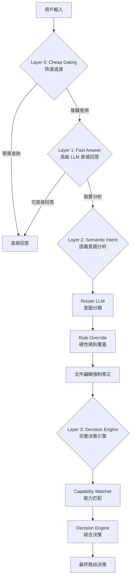
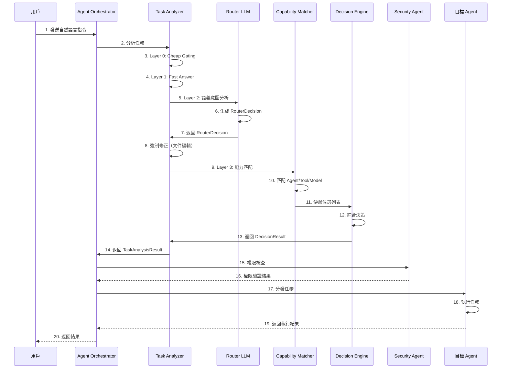

# Agent Platform 架構文檔

**創建日期**: 2025-12-25
**創建人**: Daniel Chung
**最後修改日期**: 2026-01-11
**版本**: v3

---

## 📋 概述

Agent Platform 是 AI-Box 系統的核心協調中心，採用**三層分離架構**，結合 **GraphRAG-Orchestrator (GRO)** 理論框架，實現職責清晰、易於擴展、可審計、可回放的 Multi-Agent 協作平台。

> **📋 本文檔整合了以下文檔的精華內容**：
>
> - [AI-Box-Agent-架構規格書-v3.md](./AI-Box-Agent-架構規格書-v3.md) - 完整架構規格
> - [Orchestrator-協調層規格書.md](./Orchestrator-協調層規格書.md) - 協調層完整規格
> - [Router-LLM-Prompt-和模型信息.md](./Router-LLM-Prompt-和模型信息.md) - Router LLM 詳細說明
> - [Agent_Orchestration_White_Paper.md](./Agent_Orchestration_White_Paper.md) - GRO 技術白皮書
> - [System-Agent-Registry-實施總結.md](./System-Agent-Registry-實施總結.md) - System Agent Registry 實施總結
>
> **📋 相關工作流詳細說明**：
>
> - [GenAI 工作流指令-語義-工具-模型-Agent 等調用.md](./GenAI 工作流指令-語義-工具-模型-Agent 等調用.md) - 完整工作流程詳細說明（實現細節、代碼位置、數據流、實際案例）

---

## 🏗️ 架構設計

### 三層架構概述

AI-Box Agent Platform 採用**三層分離架構**，從上層到下層分別是：

```
┌─────────────────────────────────────────────────────────┐
│  第一層：協調層（AI-Box Orchestration Agent）          │
│  - Task Analyzer（任務分析器）                          │
│  - Agent Registry（Agent 註冊表）                       │
│  - Agent Orchestrator（Agent 協調器）                   │
│  - Task Tracker（任務追蹤器）                           │
│  - Policy Engine（政策引擎）                            │
│  - State Store（狀態存儲）                              │
└─────────────────────────────────────────────────────────┘
                        ↓ 統一調用接口（Task Contract）
┌─────────────────────────────────────────────────────────┐
│  第二層：專屬服務層（Dedicated Service Agents）        │
│  - Security Agent（安全代理）                           │
│  - Reports Agent（報告代理）                            │
│  - System Config Agent（系統配置代理）                  │
│  - MoE Agent（模型路由代理）                            │
│  - Knowledge Ontology Agent（知識圖譜代理）              │
│  - Data Agent（數據代理）                                │
└─────────────────────────────────────────────────────────┘
                        ↓ 服務調用
┌─────────────────────────────────────────────────────────┐
│  第三層：業務執行層（Business Process Agents）          │
│  - Planning Agent（規劃代理）                            │
│  - Execution Agent（執行代理）                           │
│  - Review Agent（審查代理）                              │
│  - HR Recruiting Agent（人力資源代理）                   │
│  - Finance Auditing Agent（財務審計代理）               │
└─────────────────────────────────────────────────────────┘
```

### 核心設計原則

1. **統一協調**：所有 Agent 調用都通過 Orchestrator
2. **服務共享**：專屬服務 Agent 提供共享能力，避免重複開發
3. **業務隔離**：業務 Agent 專注於業務邏輯，不直接訪問基礎設施
4. **異步支持**：支持異步任務執行和狀態追蹤
5. **指令澄清**：當指令不明確時，主動澄清而非降級處理
6. **ReAct FSM**：將 ReAct 循環工程化為有限狀態機，每一步可序列化、可回放、可中斷、可重試
7. **Policy-as-Code**：將決策準則抽象為政策即代碼，支持動態熱加載
8. **本地優先**：控制平面本地化，確保數據隱私和安全

---

## 🧠 核心組件：意圖與任務分析

### Task Analyzer（任務分析器）

Task Analyzer 是 Agent Platform 的「大腦」，負責理解用戶意圖、分析任務需求、匹配 Agent 能力，並做出路由決策。

#### 4 層漸進式路由架構

Task Analyzer 採用**4 層漸進式路由架構**，從快速過濾到深度分析，逐步提升分析精度：



#### Layer 0: Cheap Gating（快速過濾）

**目的**：快速識別極簡單的查詢，直接處理，無需進入後續分析層。

**判斷邏輯**：

```python
def _is_simple_query(self, task: str) -> bool:
    """判斷是否為簡單查詢"""
    simple_keywords = ["你好", "hello", "hi", "謝謝", "thanks"]
    task_lower = task.lower().strip()

    # 檢查是否是簡單關鍵詞（完全匹配）
    if task_lower in simple_keywords:
        return True

    # 檢查長度（但必須排除需要工具的查詢）
    if len(task_lower) < 10:
        tool_indicators = ["股價", "天氣", "時間", "stock price", "weather", "time"]
        if any(keyword in task_lower for keyword in tool_indicators):
            return False  # 需要工具，不是簡單查詢
        return True

    return False
```

**處理方式**：直接返回友好回應，不進入後續分析。

#### Layer 1: Fast Answer Layer（高級 LLM 直接回答）

**目的**：對於知識性問題，使用高級 LLM（如 `gpt-4o` 或 `gemini-1.5-pro`）直接回答，無需調用 Agent。

**判斷邏輯**：

```python
def _is_direct_answer_candidate(self, task: str) -> bool:
    """判斷是否為 Direct Answer Candidate"""
    # 1. 檢查是否有明顯的副作用關鍵詞（需要系統行動）
    action_keywords = ["幫我", "執行", "運行", "查詢", "獲取"]
    if any(keyword in task_lower for keyword in action_keywords):
        return False  # 需要系統行動，進入 Layer 2/3

    # 2. 檢查是否涉及內部狀態/工具（需要工具）
    tool_indicators = ["股價", "天氣", "時間", "stock price", "weather", "time"]
    if any(keyword in task_lower for keyword in tool_indicators):
        return False  # 需要工具，進入 Layer 2/3

    # 3. 其他情況視為知識性問題，可以嘗試直接回答
    return True
```

**處理方式**：使用高級 LLM 直接生成回答，無需 Agent 介入。

#### Layer 2: Semantic Intent Analysis（語義意圖分析）

**目的**：使用 Router LLM 進行深度語義分析，理解用戶真實意圖。

##### Router LLM 核心機制

**固定 System Prompt**：

```
You are a routing and classification engine inside an enterprise GenAI system.

Your ONLY responsibility is to classify the user's query and system context into a routing decision object.

STRICT RULES:
- You must NOT answer the user's question.
- You must NOT perform reasoning, planning, or step-by-step thinking.
- You must NOT select specific tools, agents, or models.
- You must NOT include explanations, markdown, or extra text.

CRITICAL RULE: File editing tasks MUST have:
- intent_type=execution
- needs_tools=true
- needs_agent=true
```

**RouterDecision Schema**：

```python
class RouterDecision(BaseModel):
    """Router 決策結果"""
    intent_type: Literal["conversation", "retrieval", "analysis", "execution"]
    complexity: Literal["low", "mid", "high"]
    needs_agent: bool
    needs_tools: bool
    determinism_required: bool
    risk_level: Literal["low", "mid", "high"]
    confidence: float  # 0.0 - 1.0
```

**模型選擇策略**：

1. **優先使用本地模型（低成本）**：

   - Provider: `ollama`
   - 默認模型：`gpt-oss:120b-cloud`（根據測試結果選擇最優模型）
   - 使用緩存以降低成本和延遲
2. **備選方案**：

   - 如果 Ollama 不可用，回退到 `openai` (ChatGPT)
   - 如果所有模型初始化失敗，使用 `openai` 作為最後選擇

**關鍵改進：隱含編輯意圖識別**

Router LLM 的 User Prompt 包含隱含編輯意圖的明確說明：

```
CRITICAL: File editing tasks (creating, editing, generating documents) MUST be classified as execution
  * Explicit examples: "編輯文件", "產生文件", "生成報告", "創建文檔" → intent_type=execution
  * Implicit examples (MUST also be execution):
    - "幫我在文件中加入..." → intent_type=execution (adding content to file)
    - "在文件裡添加..." → intent_type=execution (adding content to file)
    - "把這個改成..." → intent_type=execution (modifying file content)
    - "整理一下這個文件" → intent_type=execution (organizing file)
    - "優化這個代碼文件" → intent_type=execution (optimizing file)
    - "格式化整個文件" → intent_type=execution (formatting file)
    - "在文件中添加註釋" → intent_type=execution (adding comments to file)
```

##### 文件編輯任務強制修正邏輯

即使 Router LLM 識別錯誤，系統也會通過**強制修正邏輯**確保文件編輯任務正確路由：

**代碼位置**：`agents/task_analyzer/analyzer.py` 第 158-220 行

**修正邏輯**：

```python
# 文件編輯關鍵詞
file_editing_keywords = [
    "編輯", "修改", "更新", "刪除", "添加", "替換", "重寫", "格式化",
    "產生", "創建", "寫", "生成", "建立", "製作",
    "文件", "檔案", "文檔", "document", "file",
]

# 隱含編輯意圖關鍵詞
implicit_editing_keywords = [
    "幫我在文件中加入", "在文件裡添加", "在文件中添加",
    "把這個改成", "幫我整理一下這個文件", "優化這個代碼文件",
    "格式化整個文件", "在文件裡添加註釋", "幫我整理一下",
    "加入安裝說明", "添加註釋", "改成新的實現",
]

# 如果是文件編輯任務（明確或隱含），強制修正
if (router_output.intent_type == "execution" and is_file_editing) or is_implicit_editing:
    if is_implicit_editing and router_output.intent_type != "execution":
        # 隱含編輯意圖但 intent_type 不是 execution，修正為 execution
        router_output = RouterDecision(
            intent_type="execution",  # 強制設置為 execution
            needs_agent=True,  # 隱含編輯意圖也需要 agent
            needs_tools=True,  # 隱含編輯意圖也需要工具
            # ... 其他字段保持不變
        )
    elif router_output.intent_type == "execution" and is_file_editing:
        # 明確編輯意圖，但 needs_agent 可能是 False，需要強制設置為 True
        if not router_output.needs_agent:
            router_output = RouterDecision(
                intent_type=router_output.intent_type,
                needs_agent=True,  # 強制設置為 True
                # ... 其他字段保持不變
            )
```

**修正效果**：

- ✅ 確保文件編輯任務的 `intent_type` 為 `execution`
- ✅ 確保文件編輯任務的 `needs_agent` 為 `True`
- ✅ 確保文件編輯任務的 `needs_tools` 為 `True`
- ✅ 即使 Router LLM 識別錯誤，也能通過關鍵詞匹配強制修正

> **📋 詳細實現說明**：請參考 [GenAI 工作流指令-語義-工具-模型-Agent 等調用.md](./GenAI 工作流指令-語義-工具-模型-Agent 等調用.md) 第 2.2 節，包含完整的代碼位置和實現細節。

##### Routing Memory（路由記憶）

**目的**：通過向量化存儲歷史決策與結果模式，提供 Context Bias，提升 Router LLM 的決策準確性。

**功能**：

- **Recall（召回）**：根據當前查詢召回相似的歷史決策
- **Record（記錄）**：記錄決策結果和執行結果，用於後續學習
- **Pruning（裁剪）**：根據使用頻率和 TTL 自動清理低價值數據

**使用方式**：

```python
# 在 Router LLM 調用前，召回相似的歷史決策
similar_decisions = await self.routing_memory.recall_similar_decisions(
    request.task, top_k=3, filters={"success": True}
)

# 將歷史決策作為 Context Bias 傳遞給 Router LLM
router_output = await self.router_llm.route(router_input, similar_decisions)
```

#### Layer 3: Decision Engine（完整決策引擎）

**目的**：綜合 Router Decision、Agent 候選、Tool 候選、Model 候選，做出最終的路由決策。

> **📋 詳細實現說明**：請參考 [GenAI 工作流指令-語義-工具-模型-Agent 等調用.md](./GenAI 工作流指令-語義-工具-模型-Agent 等調用.md) 第 3-5 章，包含完整的工具調用、模型選擇和 Agent 調用流程。

##### Capability Matcher（能力匹配器）

**職責**：根據 Router Decision 匹配合適的 Agent、Tool、Model。

**匹配邏輯**：

1. **Agent 匹配**：

   - 提取所需能力（從 Router Decision 和查詢文本）
   - 查詢 Agent Registry，發現匹配的 Agent
   - **特殊處理**：文件編輯任務優先匹配 `document-editing-agent`
   - 計算匹配度評分（能力匹配、成本、延遲、歷史成功率、穩定度）
2. **Tool 匹配**：

   - 提取所需能力
   - 查詢 Tool Registry
   - **特殊處理**：文件編輯任務優先匹配 `document_editing` 工具
   - 計算匹配度評分
3. **Model 匹配**：

   - 根據任務複雜度和所需能力匹配合適的 LLM 模型
   - 考慮成本、延遲、歷史成功率、穩定度

**文件編輯任務特殊處理**：

```python
# 如果是文件編輯任務，優先匹配 document-editing-agent
if is_file_editing and agent.agent_id == "document-editing-agent":
    # 文件編輯任務 + document-editing-agent = 完美匹配
    capability_match = 1.0
    success_history = 0.95
    stability = 0.95
```

##### Decision Engine（決策引擎）

**職責**：綜合所有候選，做出最終決策。

**決策流程**：

1. **Rule Filter（硬性規則過濾）**：

   - 風險等級過濾：過濾掉風險等級不匹配的候選
   - 成本限制：過濾掉成本超標的候選
2. **Agent 選擇**：

   - 如果是文件編輯任務，優先選擇 `document-editing-agent`
   - 否則，選擇評分最高的 Agent（最低可接受評分：0.5）
3. **Tool 選擇**：

   - 選擇評分最高的工具（最多 3 個，最低可接受評分：0.5）
4. **Model 選擇**：

   - 根據任務複雜度和成本要求選擇合適的模型

**決策結果**：

```python
class DecisionResult(BaseModel):
    """決策結果"""
    chosen_agent: Optional[str]  # 選擇的 Agent ID
    chosen_tools: List[str]  # 選擇的工具列表
    chosen_model: Optional[str]  # 選擇的模型 ID
    score: float  # 總體評分
    reasoning: str  # 決策理由
    fallback_used: bool  # 是否使用了 Fallback
```

---

## 🔄 參數調用與決策流程

### 完整任務處理流程



### 參數傳遞與調用

#### 1. Task Analysis Request（任務分析請求）

**數據模型**：

```python
class TaskAnalysisRequest(BaseModel):
    """任務分析請求"""
    task: str  # 自然語言指令
    context: Optional[Dict[str, Any]] = None  # 上下文信息
    user_id: Optional[str] = None  # 用戶 ID
    session_id: Optional[str] = None  # 會話 ID
    specified_agent_id: Optional[str] = None  # 前端指定的 Agent ID
```

#### 2. Router Input（Router 輸入）

**數據模型**：

```python
class RouterInput(BaseModel):
    """Router 輸入"""
    user_query: str  # 用戶查詢
    session_context: Dict[str, Any]  # 會話上下文
    system_constraints: Dict[str, Any]  # 系統約束
```

**構建邏輯**：

```python
router_input = RouterInput(
    user_query=request.task,
    session_context=request.context or {},
    system_constraints=self.rule_override.get_system_constraints(request.task),
)
```

#### 3. Router Decision（Router 決策）

**數據模型**：

```python
class RouterDecision(BaseModel):
    """Router 決策結果"""
    intent_type: Literal["conversation", "retrieval", "analysis", "execution"]
    complexity: Literal["low", "mid", "high"]
    needs_agent: bool
    needs_tools: bool
    determinism_required: bool
    risk_level: Literal["low", "mid", "high"]
    confidence: float  # 0.0 - 1.0
```

**生成方式**：

1. Router LLM 根據 System Prompt 和 User Prompt 生成 JSON
2. 解析 JSON 並驗證 Schema
3. 如果解析失敗或 Confidence < 0.6，使用 Safe Fallback

**Safe Fallback**：

```python
SAFE_FALLBACK = RouterDecision(
    intent_type="conversation",
    complexity="low",
    needs_agent=False,
    needs_tools=False,
    determinism_required=False,
    risk_level="low",
    confidence=0.0,
)
```

#### 4. Capability Match（能力匹配結果）

**數據模型**：

```python
class CapabilityMatch(BaseModel):
    """能力匹配結果"""
    candidate_id: str  # 候選 ID（Agent ID / Tool ID / Model ID）
    candidate_type: Literal["agent", "tool", "model"]
    capability_match: float  # 能力匹配度（0.0 - 1.0）
    cost_score: float  # 成本評分（0.0 - 1.0）
    latency_score: float  # 延遲評分（0.0 - 1.0）
    success_history: float  # 歷史成功率（0.0 - 1.0）
    stability: float  # 穩定度（0.0 - 1.0）
    total_score: float  # 總體評分（0.0 - 1.0）
    metadata: Dict[str, Any]  # 元數據
```

**評分計算**：

```python
# Agent 評分計算
total_score = (
    0.35 * capability_match +  # 能力匹配度（權重最高）
    0.20 * cost_score +        # 成本評分
    0.15 * latency_score +     # 延遲評分
    0.20 * success_history +   # 歷史成功率
    0.10 * stability            # 穩定度
)
```

#### 5. Decision Result（決策結果）

**數據模型**：

```python
class DecisionResult(BaseModel):
    """決策結果"""
    chosen_agent: Optional[str]  # 選擇的 Agent ID
    chosen_tools: List[str]  # 選擇的工具列表
    chosen_model: Optional[str]  # 選擇的模型 ID
    score: float  # 總體評分
    reasoning: str  # 決策理由
    fallback_used: bool  # 是否使用了 Fallback
```

**決策邏輯**：

1. **Agent 選擇**：

   - 文件編輯任務：優先選擇 `document-editing-agent`（完美匹配，評分 1.0）
   - 其他任務：選擇評分最高的 Agent（最低可接受評分：0.5）
2. **Tool 選擇**：

   - 選擇評分最高的工具（最多 3 個，最低可接受評分：0.5）
3. **Model 選擇**：

   - 根據任務複雜度和成本要求選擇合適的模型

#### 6. Task Analysis Result（任務分析結果）

**數據模型**：

```python
class TaskAnalysisResult(BaseModel):
    """任務分析結果"""
    task_id: str  # 任務 ID
    task_type: TaskType  # 任務類型
    workflow_type: WorkflowType  # 工作流類型
    llm_provider: LLMProvider  # LLM 提供商
    confidence: float  # 分析置信度
    requires_agent: bool  # 是否需要 Agent
    suggested_agents: List[str]  # 建議的 Agent 列表
    suggested_tools: List[str]  # 建議的工具列表
    router_decision: RouterDecision  # Router 決策
    decision_result: DecisionResult  # 決策結果
    analysis_details: Dict[str, Any]  # 分析詳情
```

---

## 🎯 決策與行為判斷

### 決策層級

Agent Platform 的決策分為三個層級：

1. **Router LLM 層級**：語義意圖分析，生成 RouterDecision
2. **Capability Matcher 層級**：能力匹配，生成候選列表
3. **Decision Engine 層級**：綜合決策，生成最終路由決策

### 決策判斷邏輯

#### 1. 意圖類型判斷（Intent Type）

**判斷依據**：

- **conversation**：一般聊天、問候、解釋、討論（無需行動）
- **retrieval**：查找、獲取、搜索、查詢現有數據
- **analysis**：推理、比較、評估、推斷
- **execution**：行動、命令、操作、系統變更

**關鍵規則**：

- ✅ 文件編輯任務（創建、編輯、生成文檔）**必須**分類為 `execution`
- ✅ 隱含編輯意圖（如"在文件裡添加..."）**必須**分類為 `execution`
- ✅ 即使 Router LLM 識別錯誤，系統也會通過強制修正邏輯確保正確分類

#### 2. Agent 需求判斷（Needs Agent）

**判斷依據**：

- **needs_agent=true** 如果任務需要：

  - 多步驟規劃、協調或複雜工作流
  - 文件/文檔操作（創建、編輯、生成文檔）- **必須**調用 `document-editing-agent`
  - Agent 特定能力，無法通過簡單工具處理
- **needs_agent=false** 如果任務可以：

  - 直接回答（知識性問題）
  - 使用單個工具完成（如查詢時間、天氣）

**關鍵規則**：

- ✅ 文件編輯任務（創建、編輯、生成文檔）**必須**設置 `needs_agent=true`
- ✅ 即使 Router LLM 識別錯誤，系統也會通過強制修正邏輯確保 `needs_agent=true`

#### 3. Tool 需求判斷（Needs Tools）

**判斷依據**：

- **needs_tools=true** 如果查詢需要：

  - 實時數據（當前時間、股價、天氣、匯率）
  - 外部 API 調用（網絡搜索、位置服務、地圖）
  - 系統操作（文件 I/O、數據庫查詢、系統信息）
  - 確定性計算（單位轉換、貨幣兌換）
  - 文檔創建或編輯（創建文件、生成文檔、編輯文件）
- **needs_tools=false** 如果查詢只需要：

  - 知識/解釋（LLM 可以從訓練數據中回答）

**關鍵規則**：

- ✅ 文件編輯任務（創建、編輯、生成文檔）**必須**設置 `needs_tools=true`
- ✅ 即使 Router LLM 識別錯誤，系統也會通過強制修正邏輯確保 `needs_tools=true`

#### 4. 風險等級判斷（Risk Level）

**判斷依據**：

- **low**：信息查詢、一般聊天
- **mid**：數據檢索、分析
- **high**：金融操作、法律事務、生產系統、不可逆操作

**應用**：

- 高風險操作需要二次確認
- 高風險操作需要更高權限
- 高風險操作需要更詳細的審計日誌

#### 5. 複雜度判斷（Complexity）

**判斷依據**：

- **low**：單步驟、明顯、直接（如"現在幾點"）
- **mid**：結構化推理、需要一些邏輯（如"比較 X 和 Y"）
- **high**：多步驟、編排、需要規劃（如"分析上個月的銷售並創建報告"）

**應用**：

- 高複雜度任務可能需要混合工作流（Hybrid Workflow）
- 高複雜度任務可能需要多個 Agent 協作
- 高複雜度任務可能需要更長的執行時間

### 行為判斷流程

#### 1. 前端指定 Agent 驗證

**場景**：用戶在前端明確指定了目標 Agent

**驗證邏輯**：

```python
if request.specified_agent_id:
    validation_result = await self._validate_specified_agent(
        request.specified_agent_id, request.task, request.context
    )
    if not validation_result["valid"]:
        # 驗證失敗，返回錯誤結果
        return self._create_error_result(
            task_id,
            error_message=validation_result["error"],
            suggested_agents=[request.specified_agent_id],
        )
```

**驗證內容**：

- Agent 是否存在
- Agent 是否在線
- Agent 是否有權限處理此任務
- Agent 的能力是否匹配任務需求

#### 2. 指令澄清判斷

**場景**：指令不完整或模糊，需要用戶澄清

**判斷邏輯**：

```python
# 檢查是否為配置操作
if self._is_config_operation(classification, request.task):
    intent = await self._extract_config_intent(
        request.task, classification, request.context
    )
    if intent.clarification_needed:
        return TaskAnalysisResult(
            clarification_needed=True,
            clarification_question=intent.clarification_question,
            missing_slots=intent.missing_slots,
        )
```

**常見缺失的槽位**：

- **level**：未明確指定是系統級、租戶級還是用戶級
- **scope**：未明確指定配置範圍
- **config_data**：更新操作時未明確指定要修改的具體配置項
- **tenant_id**：租戶級操作時未指定租戶 ID
- **user_id**：用戶級操作時未指定用戶 ID

#### 3. 權限檢查判斷

**場景**：執行任務前，檢查用戶是否有權限

**判斷邏輯**：

```python
security_result = await self._check_permission(
    user_id=user_id,
    intent=analysis_result.intent,
    target_agents=analysis_result.suggested_agents,
    context=context,
)

if not security_result.allowed:
    return TaskResult(
        status="permission_denied",
        result={"error": security_result.reason}
    )

# 高風險操作需要二次確認
if security_result.requires_double_check:
    return TaskResult(
        status="confirmation_required",
        result={
            "confirmation_message": self._generate_confirmation_message(
                analysis_result.intent,
                security_result.risk_level
            ),
            "audit_context": security_result.audit_context
        }
    )
```

**檢查內容**：

- 用戶角色是否擁有對應權限
- 操作層級是否匹配（系統級/租戶級/用戶級）
- 租戶隔離是否正確
- 風險等級是否需要二次確認

#### 4. 配置操作合規驗證

**場景**：配置更新操作，檢查是否符合收斂規則

**判斷邏輯**：

```python
# 如果是配置更新操作，檢查收斂規則
if analysis_result.intent and analysis_result.intent.get("action") == "update":
    compliance_result = await self._validate_config_compliance(
        intent=analysis_result.intent,
        user_id=user_id
    )
    if not compliance_result.valid:
        return TaskResult(
            status="compliance_check_failed",
            result={"error": compliance_result.reason}
        )
```

**驗證內容**：

- 配置值是否符合收斂規則
- 配置變更是否會導致衝突
- 配置變更是否符合安全策略

#### 5. 第一層預檢（格式與邊界驗證）

**場景**：配置操作前，快速檢查格式和邊界

**判斷邏輯**：

```python
pre_check_result = await self._pre_check_config_intent(
    intent=analysis_result.intent,
    agent_id=target_agent_id
)

if not pre_check_result.valid:
    return TaskResult(
        status="validation_failed",
        result={"error": pre_check_result.reason}
    )
```

**檢查內容**：

- 類型是否正確（integer/number/string/boolean/array/object）
- 數值是否在 min/max 內
- 選項是否在 options 列表中
- 必填字段是否存在

---

## 🔧 核心組件詳解

### 第一層：協調層（AI-Box Orchestration Agent）

#### 1. Task Analyzer（任務分析器）✅

**實現位置**：`agents/task_analyzer/analyzer.py`

**核心功能**：

- ✅ 4 層漸進式路由架構
- ✅ Router LLM 語義意圖分析
- ✅ 文件編輯任務強制修正邏輯
- ✅ Capability Matcher 能力匹配
- ✅ Decision Engine 綜合決策
- ✅ Routing Memory 路由記憶
- ✅ 指令澄清機制
- ✅ 配置操作專用解析（生成 `ConfigIntent`）

**相關文檔**：

- [Router-LLM-Prompt-和模型信息.md](./Router-LLM-Prompt-和模型信息.md) - Router LLM 詳細說明
- [Orchestrator-協調層規格書.md](./Orchestrator-協調層規格書.md) 第 3.1 節

#### 2. Agent Registry（Agent 註冊表）✅

**實現位置**：`agents/services/registry/registry.py`

**核心功能**：

- ✅ Agent 註冊機制
- ✅ Agent 發現機制（`agents/services/registry/discovery.py`）
- ✅ 健康監控（`agents/services/registry/health_monitor.py`）
- ✅ 權限管理（`agents/services/registry/models.py`）
- ✅ System Agent Registry（存儲在 ArangoDB）

**數據模型**：

```python
class AgentRegistryInfo(BaseModel):
    """Agent 註冊信息"""
    agent_id: str
    agent_type: str  # "dedicated_service" | "business_process"
    name: str
    status: AgentStatus  # REGISTERING | ONLINE | MAINTENANCE | DEPRECATED | OFFLINE
    endpoints: AgentEndpoints
    capabilities: List[str]
    metadata: AgentMetadata
    permissions: AgentPermissionConfig
    registered_at: datetime
    last_heartbeat: Optional[datetime]
    load: int
    is_system_agent: bool  # 是否為 System Agent
```

**相關文檔**：

- [Agent-註冊-規格書.md](./Agent-註冊-規格書.md)
- [System-Agent-Registry-實施總結.md](./System-Agent-Registry-實施總結.md)

#### 3. Agent Orchestrator（Agent 協調器）✅

**實現位置**：`agents/services/orchestrator/orchestrator.py`

**核心功能**：

- ✅ 任務路由與分發
- ✅ 結果聚合（`agents/services/processing/aggregator.py`）
- ✅ 負載均衡
- ✅ 統一服務調用接口（ATC）
- ✅ 第一層預檢（格式與邊界驗證）
- ✅ 結果修飾（使用 LLM 轉換為自然語言）
- ✅ 異步任務追蹤（持久化到 ArangoDB）

**完整流程**：

```
自然語言指令
    ↓
Orchestrator 接收
    ↓
Task Analyzer 解析意圖
    ├── 任務分類
    ├── 槽位提取
    ├── 指令澄清檢查
    └── 生成結構化意圖
    ↓
第一層預檢（格式與邊界驗證）
    ↓
Security Agent 權限檢查
    ↓
Agent Registry 發現合適的 Agent
    ↓
Task Tracker 創建任務記錄
    ↓
Orchestrator 分發任務給目標 Agent
    ↓
Agent 執行任務
    ↓
Orchestrator 收集結果
    ↓
結果修飾（使用 LLM 轉換為自然語言）
    ↓
返回給前端
```

**相關文檔**：

- [Orchestrator-協調層規格書.md](./Orchestrator-協調層規格書.md)

#### 4. Task Tracker（任務追蹤器）🔄

**實現位置**：`agents/services/orchestrator/task_tracker.py`

**核心功能**：

- 🔄 任務記錄與狀態追蹤（部分實現）
- 🔄 異步任務支持（需完善）
- 🔄 任務狀態查詢 API（需完善）

**數據模型**：

```python
class TaskRecord(BaseModel):
    """任務記錄"""
    task_id: str
    instruction: str
    intent: Optional[Dict[str, Any]] = None
    target_agent_id: str
    user_id: str
    status: TaskStatus  # pending/running/completed/failed
    created_at: datetime
    updated_at: datetime
    result: Optional[Dict[str, Any]] = None
    error: Optional[str] = None
```

---

### 第二層：專屬服務層（Dedicated Service Agents）

#### 1. Security Agent ✅

**實現位置**：`agents/builtin/security_manager/agent.py`

**核心功能**：

- ⭐ **權限驗證**：檢查「這件事誰能做」（RBAC、層級權限、租戶隔離）
- ⭐ **風險評估**：判斷「這件事危不危險」（高/中/低風險，二次確認機制）
- ⭐ **審計上下文**：為審計日誌提供安全相關的上下文信息
- 安全審計與日誌記錄

**詳細文檔**：

- [Security-Agent-規格書.md](./Security-Agent-規格書.md)

#### 2. System Config Agent ✅

**實現位置**：`agents/builtin/system_config_agent/`

**核心功能**：

- ⭐ **自然語言交互**：通過 AI 聊天方式進行系統設置
- ⭐ **配置管理**：系統級/租戶級/用戶級三層配置管理
- ⭐ **配置驗證**：雙層驗證機制（第一層預檢 + 第二層深檢）
- ⭐ **配置預覽**：先預覽後執行，影響分析與成本預估
- ⭐ **時光機功能**：基於審計日誌的配置回滾
- ⭐ **主動巡檢**：主動檢測配置衝突並提供修復建議

**詳細文檔**：

- [System-Config-Agent-規格書.md](./System-Config-Agent-規格書.md)

#### 3. Reports Agent 🔄

**實現位置**：`agents/services/processing/report_generator.py`

**已實現功能**：

- ✅ HTML 報告生成
- ✅ Markdown 報告生成

**需要增強**：

- ❌ 結構化 JSON 輸出（`displayType: inline/link`）
- ❌ PDF 報告生成
- ❌ 內嵌圖表數據（`inlineData`）
- ❌ 報告存儲服務

#### 4. MoE Agent 🔄

**實現位置**：`llm/moe/moe_manager.py`

**已實現功能**：

- ✅ MoE 路由系統
- ✅ 多種路由策略
- ✅ 負載均衡
- ✅ 故障轉移

**需要增強**：

- ❌ 封裝為專屬服務 Agent
- ❌ 統一調用接口

#### 5. Knowledge Ontology Agent 🔄

**實現位置**：

- `genai/api/services/kg_builder_service.py`
- `kag/kag_schema_manager.py`

**已實現功能**：

- ✅ 知識圖譜構建
- ✅ Ontology 管理
- ✅ 圖譜查詢

**需要增強**：

- ❌ 封裝為專屬服務 Agent
- 🔄 GraphRAG 支持增強

---

### 第三層：業務執行層（Business Process Agents）

#### 已實現的業務 Agent

1. **Planning Agent** ✅

   - 任務規劃
   - 計劃生成
2. **Execution Agent** ✅

   - 任務執行
   - 工具調用
3. **Review Agent** ✅

   - 結果審查
   - 質量檢查

#### 規劃中的業務 Agent

- **HR Recruiting Agent**：招聘流程 Agent
- **Finance Auditing Agent**：財務審計 Agent
- **Quotation Agent**：報價 Agent
- **Purchase Inquiry Agent**：採購詢價 Agent
- **QC Analyzer Agent**：質量控制分析 Agent

---

## 📡 通信協議與接口

### 統一調用接口（ATC）

所有 Agent 通過統一的接口協議進行通信：

**HTTP REST API**：

- 同步調用接口
- 標準化的請求/響應格式
- 支持超時與重試機制

**MCP Protocol**：

- 異步調用支持
- 流式響應
- 工具調用與函數調用

**接口規範**：

```python
class AgentServiceRequest:
    agent_id: str
    task: str
    context: Dict[str, Any]
    user_id: str
    session_id: Optional[str]

class AgentServiceResponse:
    success: bool
    result: Any
    error: Optional[str]
    metadata: Dict[str, Any]
```

**詳細說明**：

- [Agent-開發規範.md](./Agent-開發規範.md) - Agent 開發指南（包含架構分離設計）

---

## 📊 實現狀態

### 協調層實現狀態

| 組件               | 功能                  | 狀態        | 備註                                          |
| ------------------ | --------------------- | ----------- | --------------------------------------------- |
| Task Analyzer      | 4 層漸進式路由        | ✅ 已實現   | 包含 Router LLM、強制修正、能力匹配、決策引擎 |
| Task Analyzer      | 指令澄清機制          | ✅ 已實現   | 支持配置操作澄清                              |
| Task Analyzer      | 配置操作解析          | ✅ 已實現   | 生成 ConfigIntent                             |
| Agent Registry     | Agent 註冊            | ✅ 已實現   | 支持 HTTP/MCP 協議                            |
| Agent Registry     | Agent 發現            | ✅ 已實現   | 支持能力匹配                                  |
| Agent Registry     | 健康監控              | ✅ 已實現   | 支持心跳檢測                                  |
| Agent Registry     | System Agent Registry | ✅ 已實現   | 存儲在 ArangoDB                               |
| Agent Orchestrator | 任務路由              | ✅ 已實現   | 支持統一調用接口                              |
| Agent Orchestrator | 結果聚合              | ✅ 已實現   | 支持結果修飾                                  |
| Agent Orchestrator | 第一層預檢            | ✅ 已實現   | 格式與邊界驗證                                |
| Task Tracker       | 任務追蹤              | 🔄 部分實現 | 需完善異步任務支持                            |

### 專屬服務層實現狀態

| Agent                    | 功能     | 狀態        | 備註                           |
| ------------------------ | -------- | ----------- | ------------------------------ |
| Security Agent           | 權限檢查 | ✅ 已實現   | 完整的權限檢查流程             |
| Security Agent           | 風險評估 | ✅ 已實現   | 支持多種風險檢測               |
| System Config Agent      | 配置管理 | ✅ 已實現   | 支持配置驗證                   |
| Reports Agent            | 報告生成 | 🔄 部分實現 | 需完善 HTML 格式輸出           |
| MoE Agent                | 模型路由 | 🔄 需封裝   | MoE 功能已實現，需封裝為 Agent |
| Knowledge Ontology Agent | 知識圖譜 | 🔄 需封裝   | 功能已實現，需封裝為 Agent     |
| Data Agent               | 數據查詢 | ❌ 規劃中   | 下一階段開發重點               |

### 業務執行層實現狀態

| Agent                | 功能     | 狀態      | 備註                    |
| -------------------- | -------- | --------- | ----------------------- |
| Planning Agent       | 任務規劃 | ✅ 已實現 | 支持多步驟規劃          |
| Execution Agent      | 任務執行 | ✅ 已實現 | 支持步驟執行追蹤        |
| Review Agent         | 結果審查 | ✅ 已實現 | 支持質量評估            |
| HR/FIN/其他業務Agent | 業務邏輯 | ❌ 規劃中 | 待 PoC 階段實際導入劇本 |

---

## 🗺️ 開發進度

### 已完成（階段二）

根據 [項目控制表](../../../../AI-Box/開發過程文件/項目控制表.md)，**階段二：Agent 核心階段**已完成（100%）：

- ✅ **子階段2.1：基礎組件實現**（100%）

  - Task Analyzer 核心邏輯
  - Agent Process 核心組件（Memory Manager、Tool Registry、Prompt Manager 等）
- ✅ **子階段2.2：協調層實現**（100%）

  - Agent Registry
  - Agent Orchestrator
  - 任務路由與協調
- ✅ **子階段2.3：核心Agent實現**（100%）

  - Planning Agent
  - Execution Agent
  - Review Agent

### 進行中

- 🔄 **Task Tracker**：異步任務追蹤功能需完善
- 🔄 **Reports Agent**：報告生成功能需完善
- 🔄 **MoE Agent 封裝**：將 MoE 功能封裝為 Agent

### 規劃中

- ❌ **Data Agent**：DataLake Agent，下一階段開發重點
- ❌ **商業邏輯層 Agent**：HR、Finance 等業務 Agent，待 PoC 階段實際導入

---

## 🎯 下一步計劃

### 短期目標（1-2個月）

1. **完善 Task Tracker**：完善異步任務追蹤功能
2. **完善 Reports Agent**：完善報告生成功能
3. **MoE Agent 封裝**：將 MoE 功能封裝為 Agent 形式

### 中期目標（3-6個月）

1. **Data Agent 開發**：開發 DataLake Agent，支持企業數據系統集成
2. **商業邏輯層擴展**：根據 PoC 需求開發業務 Agent
3. **性能優化**：優化 Agent 路由與調用性能

### 長期目標（6-12個月）

1. **Agent 生態建設**：構建 Agent 開發與分發生態
2. **智能路由優化**：基於歷史數據優化 Agent 路由策略
3. **多租戶支持**：完善多租戶 Agent 隔離與管理

---

## 📚 參考資料

### 架構文檔

- [AI-Box-Agent-架構規格書-v3.md](./AI-Box-Agent-架構規格書-v3.md)
- [Orchestrator-協調層規格書.md](./Orchestrator-協調層規格書.md)
- [Agent-開發規範.md](./Agent-開發規範.md) - Agent 開發指南（包含架構分離設計）
- [archive/ARCHITECTURE_DIAGRAM_EXPLANATION.md](./archive/ARCHITECTURE_DIAGRAM_EXPLANATION.md)（已歸檔，內容已整合到主文件）
- [Agent_Orchestration_White_Paper.md](./Agent_Orchestration_White_Paper.md)

### Agent 規格文檔

- [Security-Agent-規格書.md](./Security-Agent-規格書.md)
- [System-Config-Agent-規格書.md](./System-Config-Agent-規格書.md)
- [Agent-註冊-規格書.md](./Agent-註冊-規格書.md)

### 開發文檔

- [Agent-開發規範.md](./Agent-開發規範.md)
- [AGENT_LIFECYCLE.md](./AGENT_LIFECYCLE.md)

### 工具文檔

- [Router-LLM-Prompt-和模型信息.md](./Router-LLM-Prompt-和模型信息.md)
- [System-Agent-Registry-實施總結.md](./System-Agent-Registry-實施總結.md)

### 工作流詳細說明文檔

- [GenAI 工作流指令-語義-工具-模型-Agent 等調用.md](./GenAI 工作流指令-語義-工具-模型-Agent 等調用.md) - 完整工作流程詳細說明（實現細節、代碼位置、數據流、實際案例）

---

**最後更新日期**: 2026-01-11
**版本**: v3
