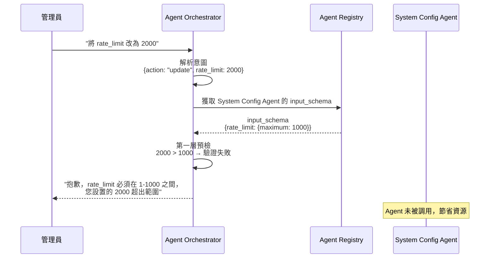

# Agent 註冊規格書

**版本**：2.2
**創建日期**：2025-01-27
**創建人**：Daniel Chung
**最後修改日期**：2026-01-15 09:16 UTC+8

> **📋 相關文檔**：
>
> - [ConfigMetadata-配置元數據機制規格書.md](./Tools/ConfigMetadata-配置元數據機制規格書.md) - 配置元數據機制規格（**必讀**：了解 Schema 驗證機制）
> - [Orchestrator-協調層規格書.md](./Orchestrator-協調層規格書.md) - Orchestrator 協調層完整規格（**必讀**：了解前置檢查機制）
> - [AI-Box-Agent-架構規格書-v2.md](./AI-Box-Agent-架構規格書-v2.md) - Agent 架構總體設計
> - [Agent-工具-CloudflareMCP註冊指南.md](../MCP工具/Agent-工具-CloudflareMCP註冊指南.md) - Cloudflare MCP Gateway 註冊指南

---

## 概述

✅ **前端 Agent 註冊頁面已提供以下功能**：

1. ✅ Secret ID/Key 輸入（身份驗證）
2. ✅ 端點配置（HTTP/MCP）
3. ⭐ **新增**：輸入 Schema 定義（前置檢查約束）

**核心價值**：通過在註冊時定義 `input_schema`，讓 Orchestrator 能夠在調用前攔截非法指令，實現「註冊即防護」。

---

## 🔐 AI-Box 與 Cloudflare MCP Gateway 認證機制（2026-01-15）

### 架構概述

AI-Box 使用 **Cloudflare MCP Gateway** 作為統一的 MCP 服務入口，所有外部 Agent 的調用都通過 Gateway 進行。

```
AI-Box Backend (FastAPI)
    ↓ JSON-RPC 2.0
    ↓ Headers: X-Gateway-Secret, X-User-ID, X-Tenant-ID, X-Tool-Name
Cloudflare MCP Gateway (Workers)
    ↓ Gateway 驗證 + 權限檢查 + 路由
    ↓ HTTP/HTTPS
External Agent/MCP Server
```

### Gateway 端點配置

**正式端點**（2026-01-15）：

- ⭐ **Workers.dev URL**（推薦）: `https://mcp-gateway.896445070.workers.dev`
- 自定義域名: `https://mcp.k84.org`

**存儲位置**：

- Collection: `system_configs` (ArangoDB)
- Scope: `mcp_gateway`
- Key: `system_mcp_gateway`
- Data:

  ```json
  {
    "default_endpoint": "https://mcp-gateway.896445070.workers.dev"
  }
  ```

### 認證機制

#### 1. Gateway Secret 認證

**用途**: AI-Box 作為客戶端訪問 Gateway 的身份憑證

**配置**:

- **Header Name**: `X-Gateway-Secret`
- **Secret Value**: `0d28bdb881c5aeea501bf535b45c153ea78bf6f28b4856a41e36068dfbf7410e`
- **環境變數**: `MCP_GATEWAY_SECRET`（AI-Box `.env` 文件）
- **驗證位置**: Cloudflare Workers Gateway 代碼

**代碼實現**（`api/routers/chat.py`）:

```python
headers = {
    "Content-Type": "application/json",
    "X-User-ID": current_user.user_id,
    "X-Tenant-ID": tenant_id or "default",
    "X-Tool-Name": tool_name,
}
gateway_secret = os.getenv("MCP_GATEWAY_SECRET")
if gateway_secret:
    headers["X-Gateway-Secret"] = gateway_secret
```

#### 2. 權限管理

**權限檢查流程**:

1. Gateway 接收請求，提取 `X-User-ID`, `X-Tenant-ID`, `X-Tool-Name`
2. 查詢 Cloudflare KV Store (`PERMISSIONS_STORE`)
3. Key 格式: `permissions:{tenant_id}:{user_id}` 或 `permissions:{tenant_id}:default`
4. 檢查用戶是否有權訪問該工具

**權限配置示例**:

```bash
# 配置租戶默認權限（允許所有用戶訪問 warehouse_* 工具）
wrangler kv key put "permissions:default:default" \
  '{"tools":["warehouse_*"]}' \
  --binding=PERMISSIONS_STORE --preview=false --remote

# 配置特定用戶權限
wrangler kv key put "permissions:tenant1:user123" \
  '{"tools":["warehouse_*","finance_*"],"rate_limits":{"default":100}}' \
  --binding=PERMISSIONS_STORE --preview=false --remote
```

**權限檢查失敗**:

- 返回 `403 Forbidden` 或 `Unauthorized: No permission`

#### 3. JSON-RPC 2.0 協議

**請求格式**:

```json
{
  "jsonrpc": "2.0",
  "id": 1,
  "method": "tools/call",
  "params": {
    "name": "warehouse_execute_task",
    "arguments": {
      "task_data": {
        "instruction": "用戶指令"
      },
      "metadata": {
        "user_id": "user-123",
        "tenant_id": "default"
      }
    }
  }
}
```

**響應格式**:

```json
{
  "jsonrpc": "2.0",
  "id": 1,
  "result": {
    "content": [
      {
        "type": "text",
        "text": "{\"task_id\":\"...\",\"status\":\"success\",\"result\":{...}}"
      }
    ]
  }
}
```

**錯誤響應**:

```json
{
  "jsonrpc": "2.0",
  "id": 1,
  "error": {
    "code": -32600,
    "message": "Invalid Request",
    "data": {...}
  }
}
```

### 路由規則

**配置文件**: `mcp/gateway/wrangler.toml`

**路由配置示例**:

```toml
MCP_ROUTES = '''
[
  {
    "pattern": "warehouse_*",
    "target": "https://xxxxx.ngrok-free.app"
  },
  {
    "pattern": "finance_*",
    "target": "https://finance-agent.example.com"
  }
]
'''
```

**路由匹配規則**:

- Gateway 根據 `X-Tool-Name` header 匹配 pattern
- 使用通配符 `*` 匹配工具名稱前綴
- 將請求轉發到對應的 `target` URL

### 安全考量

1. **Gateway Secret 管理**:
   - ✅ Secret 存儲在環境變數中，不提交到代碼庫
   - ✅ 生產環境使用強隨機生成的 Secret
   - ✅ 定期輪換 Secret

2. **權限最小化**:
   - ✅ 默認拒絕所有訪問
   - ✅ 需要明確配置權限才能訪問特定工具
   - ✅ 支持租戶級和用戶級細粒度權限

3. **速率限制**:
   - ✅ Gateway 支持配置速率限制
   - ✅ 防止 API 濫用

4. **審計日誌**:
   - ✅ Gateway 記錄所有請求日誌
   - ✅ 可通過 `wrangler tail` 查看實時日誌

---

## UI 位置和結構

### 標籤頁：端點配置（Endpoints Configuration）

當用戶選擇「外部 Agent」時，會在端點配置標籤頁的最上方顯示 Secret 驗證區塊。

### UI 層級結構

```
Agent 註冊 Modal
├── 基本資訊標籤頁
│   ├── Agent ID
│   ├── Agent 名稱
│   ├── Agent 類型
│   └── 描述
├── 端點配置標籤頁
│   ├── 內部 Agent 選項（勾選框）
│   └── 外部 Agent 配置區塊（取消勾選「內部 Agent」後顯示）
│       ├── Secret 驗證區塊 ⭐
│       │   ├── 標題：「外部 Agent 身份驗證」*
│       │   ├── 提示文字
│       │   ├── Secret ID 輸入框
│       │   ├── Secret Key 輸入框（密碼類型）
│       │   ├── 「驗證 Secret」按鈕
│       │   ├── 錯誤提示區域
│       │   └── 「還沒有 Secret ID？點擊這裡申請」鏈接
│       ├── 協議類型選擇（HTTP/MCP）
│       └── 端點 URL 輸入框
└── 執行約束標籤頁 ⭐ [新增]
    ├── 標題：「Agent 輸入 Schema 定義」
    ├── 提示文字：「請定義此 Agent 接受的參數範圍，Orchestrator 將據此執行前置攔截。」
    ├── JSON Schema 編輯器（Monaco Editor）
    ├── 「驗證 Schema 格式」按鈕
    └── Schema 驗證結果顯示區域
```

---

## Secret 輸入框詳細說明

### 1. Secret ID 輸入框

**位置**：端點配置標籤頁，Secret 驗證區塊內

**屬性**：

- **類型**：`text`（文本輸入框）
- **標籤**：`Secret ID（由 AI-Box 簽發）`
- **佔位符**：`例如：aibox-example-1234567890-abc123`
- **必填**：是（外部 Agent 必需）
- **禁用條件**：提交中或正在驗證 Secret

**代碼位置**：`ai-bot/src/components/AgentRegistrationModal.tsx` 第 525-536 行

### 2. Secret Key 輸入框

**位置**：端點配置標籤頁，Secret 驗證區塊內

**屬性**：

- **類型**：`password`（密碼輸入框，隱藏輸入）
- **標籤**：`Secret Key（由 AI-Box 簽發）`
- **佔位符**：`輸入 Secret Key`
- **必填**：是（外部 Agent 必需）
- **禁用條件**：提交中或正在驗證 Secret

**代碼位置**：`ai-bot/src/components/AgentRegistrationModal.tsx` 第 542-553 行

### 3. 驗證按鈕

**位置**：Secret Key 輸入框下方

**功能**：

- 調用 `verifySecret` API 驗證 Secret ID/Key
- 驗證中顯示載入狀態
- 驗證成功後顯示綠色成功提示
- 驗證失敗顯示錯誤信息

**代碼位置**：`ai-bot/src/components/AgentRegistrationModal.tsx` 第 561-577 行

---

## 完整 UI 流程

### 步驟 1：打開註冊頁面

用戶點擊「管理」按鈕，打開 Agent 註冊 Modal。

### 步驟 2：填寫基本資訊

在「基本資訊」標籤頁填寫 Agent 信息。

### 步驟 3：切換到端點配置

點擊「端點配置」標籤頁。

### 步驟 4：選擇外部 Agent

取消勾選「內部 Agent（運行在同一系統中）」。

### 步驟 5：輸入 Secret（新增的區塊）

立即顯示 Secret 驗證區塊：

```
┌─────────────────────────────────────────┐
│ 外部 Agent 身份驗證 *                   │
├─────────────────────────────────────────┤
│ ℹ️ 請使用由 AI-Box 簽發的 Secret...     │
│                                         │
│ Secret ID（由 AI-Box 簽發）            │
│ ┌─────────────────────────────────┐   │
│ │                                 │   │
│ └─────────────────────────────────┘   │
│                                         │
│ Secret Key（由 AI-Box 簽發）           │
│ ┌─────────────────────────────────┐   │
│ │ ••••••••••••••••••••••••••••••  │   │
│ └─────────────────────────────────┘   │
│                                         │
│ [ 驗證 Secret ]                        │
│                                         │
│ ℹ️ 還沒有 Secret ID？[點擊這裡申請]    │
└─────────────────────────────────────────┘
```

### 步驟 6：驗證 Secret

1. 輸入 Secret ID
2. 輸入 Secret Key（隱藏顯示）
3. 點擊「驗證 Secret」按鈕
4. 等待驗證結果

### 步驟 7：驗證成功

顯示綠色成功提示框：

```
┌─────────────────────────────────────────┐
│ ✅ Secret 驗證成功                      │
│ Secret ID: aibox-test-...              │
└─────────────────────────────────────────┘
```

### 步驟 8：繼續配置

驗證成功後，繼續配置協議類型和端點 URL。

### 步驟 9：定義前置檢查約束（Pre-check Constraints）⭐ **新增**

**目的**：為了確保 Orchestrator 能在調用前攔截非法指令，註冊時需提供該 Agent 的 `input_schema`。

**操作流程**：

1. 點擊「執行約束」標籤頁
2. 在 JSON Schema 編輯器中輸入 Schema 定義
3. 點擊「驗證 Schema 格式」按鈕
4. 驗證通過後，Schema 將與 Agent 一起註冊

**UI 界面**：

```
┌─────────────────────────────────────────┐
│ Agent 輸入 Schema 定義                   │
├─────────────────────────────────────────┤
│ ℹ️ 請定義此 Agent 接受的參數範圍，       │
│    Orchestrator 將據此執行前置攔截。    │
│                                         │
│ ┌───────────────────────────────────┐ │
│ │ {                                 │ │
│ │   "type": "object",               │ │
│ │   "properties": {                 │ │
│ │     "level": {                    │ │
│ │       "enum": ["system",          │ │
│ │                 "tenant",          │ │
│ │                 "user"]           │ │
│ │     },                            │ │
│ │     "rate_limit": {               │ │
│ │       "type": "integer",          │ │
│ │       "minimum": 1,               │ │
│ │       "maximum": 1000             │ │
│ │     }                             │ │
│ │   },                              │ │
│ │   "required": ["action", "level"] │ │
│ │ }                                 │ │
│ └───────────────────────────────────┘ │
│                                         │
│ [ 驗證 Schema 格式 ]                   │
│                                         │
│ ✅ Schema 格式驗證通過                │
└─────────────────────────────────────────┘
```

**配置項目說明**：

1. **Schema 類型**：採用標準 JSON Schema 格式
2. **硬性約束定義**：
   - `minimum` / `maximum`：限制數值範圍（如 API 限流 1-1000）
   - `enum`：限制固定選項（如模型清單、配置級別）
   - `required`：定義哪些參數是執行任務必備的「槽位 (Slots)」

**範例 Schema（System Config Agent 用）**：

```json
{
  "type": "object",
  "properties": {
    "scope": {
      "type": "string",
      "description": "配置範圍（如 genai.policy, llm.provider_config）"
    },
    "level": {
      "enum": ["system", "tenant", "user"],
      "description": "配置層級"
    },
    "action": {
      "enum": ["query", "create", "update", "delete", "list"],
      "description": "操作類型"
    },
    "rate_limit": {
      "type": "integer",
      "minimum": 1,
      "maximum": 1000,
      "description": "每分鐘請求數限制"
    },
    "allowed_models": {
      "type": "array",
      "items": {
        "type": "string",
        "enum": ["gpt-4o", "gpt-3.5-turbo", "claude-3-5-sonnet", "gemini-1.5-pro"]
      },
      "description": "允許使用的模型清單"
    }
  },
  "required": ["action", "level", "scope"]
}
```

**驗證功能**：

- ✅ JSON 格式驗證：確保 Schema 是有效的 JSON
- ✅ JSON Schema 規範驗證：確保符合 JSON Schema 標準
- ✅ 語法高亮：使用 Monaco Editor 提供代碼編輯體驗
- ✅ 實時驗證：輸入時自動檢查格式

---

## 代碼實現位置

### 組件文件

- **文件**：`ai-bot/src/components/AgentRegistrationModal.tsx`
- **標籤頁**：
  - `activeTab === 'endpoints'`：端點配置標籤頁
  - `activeTab === 'constraints'`：執行約束標籤頁 ⭐ **新增**

### Secret 輸入框

- **Secret ID**：第 525-536 行
- **Secret Key**：第 542-553 行
- **驗證按鈕**：第 561-577 行
- **驗證函數**：第 118-148 行（`handleVerifySecret`）

### Schema 輸入框 ⭐ **新增**

- **JSON Schema 編輯器**：使用 Monaco Editor
- **驗證按鈕**：調用 `validateSchema` 函數
- **驗證函數**：`handleValidateSchema()`

### 狀態管理

**Secret 相關**：

- `secretId`：Secret ID 輸入值
- `secretKey`：Secret Key 輸入值
- `secretVerified`：驗證狀態
- `isVerifyingSecret`：正在驗證標誌
- `secretVerificationError`：驗證錯誤信息

**Schema 相關** ⭐ **新增**：

- `inputSchema`：JSON Schema 字符串
- `schemaValidated`：Schema 驗證狀態
- `isValidatingSchema`：正在驗證標誌
- `schemaValidationError`：驗證錯誤信息

---

## 測試用 Secret

可以使用以下測試用 Secret 進行驗證：

**Secret ID**: `aibox-test-1764743150-1fc4e7ed`
**Secret Key**: `JpPMAnB655E9rW50sKW4PaGVciRP4vpvUEzRnJ6i9y0`

（需要先在 `.env` 文件中配置 `AGENT_SECRET_ID` 和 `AGENT_SECRET_KEY`）

---

## 架構邏輯說明

### 💡 前置檢查退回機制說明

#### 1. 註冊即防護

當此 Agent 註冊成功後，其 `input_schema` 會同步存入 ArangoDB 的 `AgentRegistry`。

**存儲位置**：

- Collection：`agent_registry`
- 字段：`metadata.capabilities.input_schema`

**數據結構**：

```json
{
  "agent_id": "system_config_agent",
  "metadata": {
    "capabilities": {
      "input_schema": {
        "type": "object",
        "properties": {
          "level": { "enum": ["system", "tenant", "user"] },
          "rate_limit": { "type": "integer", "minimum": 1, "maximum": 1000 }
        },
        "required": ["action", "level"]
      }
    }
  }
}
```

#### 2. Orchestrator 攔截

Orchestrator 在解析用戶意圖後，會先與此 Schema 比對。若管理員要求的數值與此硬性約束衝突，Orchestrator 將直接退回指令，不調用專屬服務 Agent，以節省資源並確保安全。

**攔截流程**：



**詳細說明請參考**：

- [ConfigMetadata-配置元數據機制規格書.md](./Tools/ConfigMetadata-配置元數據機制規格書.md) - 了解雙層驗證機制
- [Orchestrator-協調層規格書.md](./Orchestrator-協調層規格書.md) - 了解前置檢查實現

#### 3. 優勢說明

**解決 Agent 負擔問題**：

- ✅ 若未來 Agent 數量增加，Orchestrator 只要讀取這份註冊時填好的 Schema 就能做「通用驗證」
- ✅ 不需要為每個新 Agent 寫死代碼
- ✅ Orchestrator 只是一個「Schema 驗證引擎」，極致簡單

**明確前置條件**：

- ✅ 這份文件從單純的「身份驗證 (Secret)」升級到了「行為定義 (Schema)」
- ✅ Agent 在註冊時就明確聲明自己的硬性限制
- ✅ 管理員和開發者都能清楚了解 Agent 的約束條件

**UI 完備性**：

- ✅ 讓前端開發者知道除了 ID/Key 之外，還需要提供一個 JSON 編輯區域
- ✅ 供進階 Agent 開發者定義約束
- ✅ 提供 Monaco Editor 提供專業的代碼編輯體驗

---

## 總結

✅ **前端已完整實現 Agent 註冊功能**：

### 已實現功能

1. ✅ **身份驗證**：
   - 在「端點配置」標籤頁提供 Secret 輸入區塊
   - Secret ID 文本輸入框
   - Secret Key 密碼輸入框（隱藏顯示）
   - 驗證按鈕和狀態顯示
   - 錯誤提示和成功提示
   - 驗證通過後才能繼續註冊

2. ⭐ **前置檢查約束（新增）**：
   - 在「執行約束」標籤頁提供 JSON Schema 編輯器
   - Schema 格式驗證功能
   - 實時語法高亮和錯誤提示
   - Schema 驗證通過後與 Agent 一起註冊

### 功能位置

- **Secret 驗證**：端點配置標籤頁 → 外部 Agent 配置區塊 → Secret 驗證區塊
- **Schema 定義**：執行約束標籤頁 → JSON Schema 編輯器

### 核心價值

**「註冊即防護」**：通過在註冊時定義 `input_schema`，讓 Orchestrator 能夠在調用前攔截非法指令，實現：

- ✅ 節省資源：不需要調用 Agent 就能發現錯誤
- ✅ 確保安全：硬性約束防止 AI 設置非法值
- ✅ 高擴展性：未來新增 Agent 只需提供 Schema，無需修改 Orchestrator 代碼

---

## ⚙️ AI-Box 系統參數配置（2026-01-15）

### MCP Gateway 配置

**存儲位置**: ArangoDB `system_configs` Collection

**配置結構**:

```json
{
  "_key": "system_mcp_gateway",
  "tenant_id": null,
  "scope": "mcp_gateway",
  "sub_scope": null,
  "config_data": {
    "default_endpoint": "https://mcp-gateway.896445070.workers.dev",
    "fallback_endpoint": "https://mcp.k84.org",
    "timeout": 30,
    "retry_times": 3
  },
  "is_active": true,
  "created_at": "2026-01-15T01:00:00Z",
  "updated_at": "2026-01-15T01:00:00Z"
}
```

**配置字段說明**:

| 字段 | 類型 | 說明 |
|------|------|------|
| `default_endpoint` | String | 默認 Gateway 端點 URL（推薦 Workers.dev URL） |
| `fallback_endpoint` | String | 備用 Gateway 端點 URL（自定義域名） |
| `timeout` | Integer | 請求超時時間（秒） |
| `retry_times` | Integer | 失敗重試次數 |

**讀取配置**（Python 代碼示例）:

```python
from services.api.services.config_store_service import get_config_store_service

# 獲取 MCP Gateway 配置
config_store = get_config_store_service()
mcp_config = config_store.get_config(
    scope="mcp_gateway",
    tenant_id=None  # 系統級配置
)

if mcp_config:
    default_endpoint = mcp_config.config_data.get("default_endpoint")
    print(f"MCP Gateway Endpoint: {default_endpoint}")
```

**初始化腳本**: `scripts/init_mcp_config.py`

```python
#!/usr/bin/env python3
"""初始化 MCP Gateway 系統配置"""

from pathlib import Path
from dotenv import load_dotenv
from database.arangodb_client import ArangoDBClient

# 加載環境變數
project_root = Path(__file__).resolve().parent.parent
load_dotenv(dotenv_path=project_root / ".env")

# 連接 ArangoDB
client = ArangoDBClient()
client.connect()

# 獲取 system_configs collection
collection = client.db.collection("system_configs")

# 創建 MCP Gateway 配置
config_doc = {
    "_key": "system_mcp_gateway",
    "tenant_id": None,
    "scope": "mcp_gateway",
    "sub_scope": None,
    "config_data": {
        "default_endpoint": "https://mcp-gateway.896445070.workers.dev",
        "fallback_endpoint": "https://mcp.k84.org",
        "timeout": 30,
        "retry_times": 3
    },
    "is_active": True,
    "created_at": "2026-01-15T01:00:00Z",
    "updated_at": "2026-01-15T01:00:00Z"
}

# 插入或更新配置
try:
    collection.insert(config_doc)
    print("✅ MCP Gateway 配置初始化成功")
except Exception as e:
    if "unique constraint" in str(e):
        collection.update(config_doc)
        print("✅ MCP Gateway 配置更新成功")
    else:
        print(f"❌ 配置初始化失敗: {e}")
```

### Agent 端點配置

**外部 Agent 配置** (存儲在 `agent_display_configs`):

```json
{
  "_key": "-ovxtk4",
  "agent_config": {
    "id": "-ovxtk4",
    "names": {
      "en": "Warehouse Manager",
      "zh_CN": "物料管理员",
      "zh_TW": "物料管理員"
    },
    "agent_type": "execution",
    "protocol": "mcp",
    "endpoint_url": "https://mcp-gateway.896445070.workers.dev",
    "secret_id": "aibox-1768374372-b7fd8d2d",
    "secret_key": "9TWhmQ5vrlIM7z25MYQwezXYyvEXE_N5zL1kvj_GHic",
    "capabilities": ["warehouse_execute_task"],
    "is_enabled": true
  },
  "tenant_id": null,
  "created_at": "2026-01-15T01:00:00Z",
  "updated_at": "2026-01-15T01:00:00Z"
}
```

**關鍵配置說明**:

- **endpoint_url**: 必須指向 Gateway，不是 Agent 的實際端點
- **protocol**: `mcp` 表示使用 MCP 協議
- **secret_id/secret_key**: 用於外部 Agent 身份驗證

### 環境變數配置

**AI-Box `.env` 文件**:

```bash
# MCP Gateway 配置
MCP_GATEWAY_SECRET=0d28bdb881c5aeea501bf535b45c153ea78bf6f28b4856a41e36068dfbf7410e

# Cloudflare Workers 配置（如需要部署 Gateway）
CLOUDFLARE_ACCOUNT_ID=896445070
CLOUDFLARE_API_TOKEN=your_api_token_here
```

**Cloudflare Workers 環境變數** (`mcp/gateway/wrangler.toml`):

```toml
# Gateway Secret（通過 wrangler secret 設置）
# wrangler secret put GATEWAY_SECRET

# KV Bindings
[[kv_namespaces]]
binding = "PERMISSIONS_STORE"
id = "your_kv_namespace_id"

[[kv_namespaces]]
binding = "AUTH_STORE"
id = "your_kv_namespace_id"

# MCP 路由配置
[vars]
MCP_ROUTES = '''
[
  {
    "pattern": "warehouse_*",
    "target": "https://xxxxx.ngrok-free.app"
  }
]
'''
```

---

## 🔄 數據模型與 API 更新（2026-01-15）

### 重大更新：雙存儲架構

**問題**：之前的 Agent 註冊只保存到 `agent_display_configs`（展示配置），沒有同步到 `Agent Registry`（技術配置），導致 API 重啟後無法正確調用 Agent。

**解決方案**：實現雙存儲架構，註冊時同時保存到兩個系統：

1. **展示配置**（`agent_display_configs` in ArangoDB）
   - 用於前端展示
   - 包含多語言名稱、描述、圖標、顯示順序等

2. **技術配置**（`system_agent_registry` in ArangoDB + Agent Registry in Memory）
   - 用於 Agent 調用
   - 包含 endpoint、protocol、secret、capabilities 等

### AgentConfig 模型擴展

**文件位置**：`services/api/models/agent_display_config.py`

新增字段（2026-01-15）：

```python
class AgentConfig(BaseModel):
    # ... 原有展示配置字段 ...

    # ============================================
    # 技術配置字段（用於 Agent Registry 註冊）
    # ============================================
    agent_type: Optional[str] = Field(
        default="execution",
        pattern="^(execution|planning|review)$",
        description="Agent 類型：execution（執行）/planning（規劃）/review（審查）",
    )
    protocol: Optional[str] = Field(
        default="http",
        pattern="^(http|mcp)$",
        description="通信協議：http/mcp",
    )
    endpoint_url: Optional[str] = Field(
        default=None,
        description="Agent 端點 URL（HTTP 或 MCP endpoint）",
    )
    secret_id: Optional[str] = Field(
        default=None,
        description="Secret ID（由 AI-Box 簽發，用於外部 Agent 身份驗證）",
    )
    secret_key: Optional[str] = Field(
        default=None,
        description="Secret Key（用於外部 Agent 認證）",
    )

    # ============================================
    # 預留字段（下個迭代使用）
    # ============================================
    capabilities: Optional[list[str]] = Field(
        default=None,
        description="能力列表（預留，下個迭代使用）",
    )
    permission_groups: Optional[list[str]] = Field(
        default=None,
        description="權限組列表（預留，下個迭代使用）",
    )
    tool_calls: Optional[list[str]] = Field(
        default=None,
        description="工具調用列表（預留，下個迭代使用）",
    )
```

### API 更新

#### 1. 創建 Agent API（`POST /api/v1/agent-display-configs/agents`）

**文件位置**：`api/routers/agent_display_config.py`

**更新內容**：

```python
async def create_agent(agent_config: AgentConfig, ...):
    # 1. 保存展示配置到 agent_display_configs
    config_key = store.create_agent(agent_config, tenant_id, created_by)

    # 2. 如果有技術配置，同時註冊到 Agent Registry
    if agent_config.endpoint_url:
        from agents.services.registry.registry import get_agent_registry
        from agents.services.registry.models import (
            AgentRegistryInfo, AgentEndpoints, AgentPermissionConfig, ...
        )

        registry = get_agent_registry()

        # 構建 Agent Registry 註冊信息
        agent_info = AgentRegistryInfo(
            agent_id=agent_config.id,
            agent_type=agent_config.agent_type,
            endpoints=AgentEndpoints(
                http=agent_config.endpoint_url if agent_config.protocol == "http" else None,
                mcp=agent_config.endpoint_url if agent_config.protocol == "mcp" else None,
                protocol=AgentServiceProtocolType.MCP if agent_config.protocol == "mcp" else HTTP,
                is_internal=False,
            ),
            permissions=AgentPermissionConfig(
                secret_id=agent_config.secret_id,
                api_key=agent_config.secret_key,
            ),
            capabilities=agent_config.capabilities or [],
            ...
        )

        # 註冊到 Agent Registry
        registry.register_agent(agent_info)
```

#### 2. 更新 Agent API（`PUT /api/v1/agent-display-configs/agents/{agent_id}`）

**更新內容**：同樣實現雙更新邏輯

- 更新 `agent_display_configs`
- 同時更新 `Agent Registry`

### Agent 調用邏輯更新

**文件位置**：`api/routers/chat.py`

**更新內容**：從 Agent Registry 讀取正確的 endpoint 和 protocol

```python
# 從 Agent Registry 獲取 endpoint 配置
agent_endpoint_url = None
agent_protocol = "http"  # 默認

if agent_info.endpoints:
    if agent_info.endpoints.mcp:
        agent_endpoint_url = agent_info.endpoints.mcp
        agent_protocol = "mcp"
    elif agent_info.endpoints.http:
        agent_endpoint_url = agent_info.endpoints.http
        agent_protocol = "http"

# 使用正確的 endpoint 調用 Agent
logger.info(
    f"Calling Agent: agent_id={chosen_agent_id}, "
    f"protocol={agent_protocol}, endpoint={agent_endpoint_url}"
)
```

### 驗證結果

使用 Agent `-ovxtk4`（物料管理員）進行驗證：

**配置信息**：

- Agent Type: `execution`
- Protocol: `mcp`
- Endpoint URL: `https://mcp.k84.com`
- Secret ID: `aibox-1768374372-b7fd8d2d`
- Secret Key: `9TWhmQ5vrlIM7z25MYQwezXYyvEXE_N5zL1kvj_GHic`

**驗證結果**：

```bash
# Agent Registry 中的配置
{
  "agent_id": "-ovxtk4",
  "endpoints": {
    "mcp": "https://mcp.k84.com",
    "protocol": "mcp",
    "is_internal": false
  },
  "status": "online",
  "permissions": {
    "secret_id": "aibox-1768374372-b7fd8d2d"
  }
}
```

✅ **配置已成功保存到 Agent Registry**
✅ **API 重啟後配置依然存在**
✅ **Agent 調用能正確讀取 endpoint**

### Bug 修復

**Bug 1**：Store Service 的 `update_agent` 方法調用 `collection.update()` 時參數錯誤

**文件位置**：`services/api/services/agent_display_config_store_service.py`

**修復前**：

```python
self._collection.update(config_key, update_data)  # ❌ 錯誤：兩個參數
```

**修復後**：

```python
update_data = {
    "_key": config_key,
    "agent_config": agent_config.model_dump(),
    "updated_at": now,
    "updated_by": updated_by,
}
self._collection.update(update_data)  # ✅ 正確：一個參數（包含 _key）
```

---

## 📝 更新日誌

### 版本 2.2（2026-01-15 09:16 UTC+8）

**新增**：

- ✅ **AI-Box 與 Cloudflare MCP Gateway 認證機制** 完整說明
  - Gateway 端點配置
  - Gateway Secret 認證流程
  - 權限管理機制
  - JSON-RPC 2.0 協議要求
  - 路由規則配置
  - 安全考量

- ✅ **AI-Box 系統參數配置** 詳細說明
  - MCP Gateway 配置（system_configs）
  - Agent 端點配置（agent_display_configs）
  - 環境變數配置（.env + wrangler.toml）
  - 初始化腳本示例

**更新**：

- ✅ 更新 Gateway 端點為正式 URL: `https://mcp-gateway.896445070.workers.dev`
- ✅ 添加完整的認證 Headers 說明（X-Gateway-Secret, X-User-ID 等）
- ✅ 添加權限配置示例（Cloudflare KV Store）
- ✅ 添加相關文檔鏈接（Agent-工具-CloudflareMCP註冊指南.md）

### 版本 2.1（2026-01-15）

- 雙存儲架構實現
- AgentConfig 模型擴展
- API 更新（create_agent/update_agent）
- Bug 修復

### 版本 2.0（2025-12-30）

- 初始版本
- Secret ID/Key 驗證
- Schema 定義（前置檢查約束）

---

**文檔版本**：2.2
**最後更新**：2026-01-15 09:16 UTC+8
**維護者**：Daniel Chung
