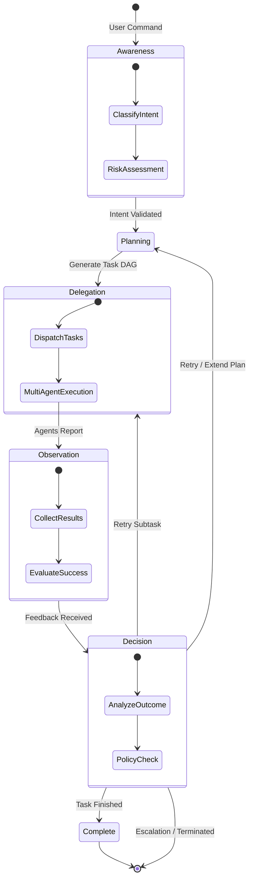

# GraphRAG-Orchestrator (GRO) 技術白皮書

## 本地化多代理協作系統架構：結合 ReAct 與 GraphRAG 的自適應決策框架

> **文件定位**：本文件同時扮演「白皮書」與「工程規格書」：除了敘述理念，也提供可直接實作的合約（Contracts）、資料結構（Schemas）與控制流（FSM）描述，支援審計、回放與測試。
>
> **核心原則（收斂自討論稿）**
>
> - **Orchestrator 不直接 Tool Call**：只能發出結構化任務合約（Task Contract），並依 Observations 做有限決策。
> - **ReAct = FSM**：每一步可序列化、可回放、可中斷、可重試（deterministic & auditable）。
> - **Async by default**：多發（fan-out）/多收（fan-in）是原生能力。
> - **本地優先，雲端可選且無控制權**：Cloud LLM 僅能產生「Observation」，不得掌握控制面或狀態面。

### 1. 摘要 (Abstract)

本白皮書提出 **GraphRAG-Orchestrator (GRO)**，這是一個專為複雜任務環境設計的全本地化多代理（Multi-Agent）協作框架。GRO 核心整合了 **ReAct 循環 (Observe-Think-Act)** 與基於 **GraphRAG** 的結構化知識檢索技術，使系統能在保障數據隱私的前提下，實現高效的代理調度與自適應決策。

GRO 採用「政策即代碼 (Policy-as-Code)」模式，支援動態任務執行、錯誤回退與重試機制。此外，系統內嵌模擬與測試環境，能自動生成高品質的訓練樣本，用於微調本地小型模型（如 Qwen, Mistral），進而降低對雲端大模型的依賴，大幅提升企業級應用的安全性與穩定性。

---

### 2. 引言 (Introduction)

隨著生成式 AI 的普及，企業對於具備高度自主性與協作能力的 AI Agent 需求日益增加。然而，傳統基於雲端的 Agent 框架在數據隱私、執行延遲、決策可觀測性以及安全性方面面臨嚴重挑戰。

**GRO 框架** 的設計初衷即是建立一個「本地化 AI 操作系統」，將控制平面（Orchestrator）與執行平面（Agents）分離，並透過結構化的記憶層與嚴格的政策引擎，確保所有 AI 行為皆處於可審計、可控制的狀態。

---

O 系統由六大核心模組組成，共同構建了一個閉環的決策與執行體系：

#### 3.1 觀察 / 回饋 / ReAct 循環 (Observe / Feedback / ReAct Loop)

這是系統的「大腦」，執行「感知-思考-行動」的循環。GRO 將 ReAct 視為一個**有限狀態機 (FSM)**，而非自由的文字生成。

- **命令感知 (Command Awareness)**: 判斷指令是否具備可操作性 (Actionable)，並進行初步風險評估。
- **規劃 (Planning)**: 將任務拆解為結構化的 **任務依賴圖 (Task DAG)**。
- **回饋評估 (Evaluation)**: 觀察代理回報的結果，並根據 **決策預期 (Success Criteria)** 決定下一步。
- **有限決策**: 決策輸出僅限於 `Complete` (封閉任務)、`Retry` (重試)、`Extend Plan` (擴展計畫) 或 `Escalate` (權限升級/人工介入)。

GRO 將 ReAct 循環工程化為一個可觀測、可回溯的流程引擎。其核心是 **State Store (狀態存儲)**，確保每一次思考與行動路徑皆可序列化持久化。

###### 1. 全域狀態容器 (Global State Envelope)

所有 ReAct 迭代共享同一個狀態包，用於追蹤任務生命週期：

```json
{
  "react_id": "uuid",
  "current_state": "PLANNING | DELEGATION | OBSERVATION | DECISION | ...",
  "iteration": 2,
  "command": {
    "raw_input": "string",
    "metadata": { "urgency": "high", "risk": "safe" }
  },
  "context": {
    "working_memory": {},
    "constraints": ["local_only"]
  },
  "timestamps": { "created_at": "...", "updated_at": "..." }
}
```

###### 2. 各階段合約 (State Contracts)

| 狀態 (State)          | 核心目標            | 輸出合約 (Output Schema) 關鍵欄位                                  |
| :-------------------- | :------------------ | :----------------------------------------------------------------- |
| **AWARENESS**   | 感知意圖與風險      | `{"actionable": bool, "requires_planning": bool}`                |
| **PLANNING**    | 任務拆解 (DAG)      | `{"plan": {"steps": [{"step_id": "...", "agent_role": "..."}]}}` |
| **DELEGATION**  | 任務派發 (Dispatch) | `{"delegations": [{"task_id": "...", "delegate_to": "..."}]}`    |
| **OBSERVATION** | 觀察回傳 (Collect)  | `{"observations": [{"task_id": "...", "status": "success"}]}`    |
| **DECISION**    | 策略性判斷 (Act)    | `{"decision": {"action": "complete                                 |

###### 3. State Store 與持久化

為了實現 **Agent Replay (行為回放)** 與 **Offline Fine-tuning**，系統必須將 `state_history` 外掛儲存在本地（如 SQLite 或 DuckDB）。這種設計允許系統在失敗後「精準從斷點重啟」，並為模型訓練提供結構化的決策樣本。

##### ReAct 決策狀態機 (ReAct Decision State Machine)



#### 3.2 代理協作規則 (Agent Collaboration Rules)

GRO 強調「能力與權力的分離」，代理不呼叫工具，而是透過**任務合約 (Task Contract)** 運作。

- **支援代理 (Support Agents)**: 唯讀、無副作用。負責 RAG 檢索、長文總結、數據分析。可接入雲端 LLM 進行非控制性推理。
- **執行代理 (Execution Agents)**: 具備核心系統修改權限（如資料庫操作、API 呼叫）。必須全本地化運行，且受限於「能力適配器 (Capability Adapter)」。
- **沙箱隔離 (Sandbox)**: 代理間無共享記憶體，僅能透過程式訊息總線 (Message Bus) 進行非同步通訊 (Async by default)。

#### 3.3 模擬與測試環境 (Simulator / Test Environment)

為了解決小模型在複雜場景下決策穩定度的問題，GRO 引入了模擬層：

- **異常注入**: 模擬代理超時、回報部分成功 (Partial Success) 或失敗。
- **數據生成 (Dataset Engine)**: 自動將每一次真實或模擬的決策路徑 (Decision Path) 轉化為 JSON 訓練樣本。
- **閉環微調**: 利用模擬生成的數據，針對 **Router / Orchestrator** 專用模型進行微調，使其具備不輸大模型的任務路由能力。

###### 1. 測試層級（由近到遠）(Testing Pyramid)

- **Contract Tests（合約測試）**：驗證 `TASK_DISPATCH` / `TASK_RESULT` / `react_state` 是否符合 JSON schema（任何不符合者一律拒絕進入系統主循環）。
- **Policy Tests（策略測試）**：給定相同輸入（context + observations），Policy Engine 必須輸出相同決策（deterministic），並具備可追溯的 rule hit 記錄。
- **DAG Execution Tests（執行測試）**：驗證依賴關係、fan-out/fan-in、超時、重試、取消（cancel）等行為符合規格。
- **Fault Injection（故障注入）**：系統性覆蓋 timeout、partial、permission denied、資料缺失、agent crash、重複 task_id 等情境。

###### 2. 評估指標（建議）(Evaluation Metrics)

- **有效性**：Task Success Rate、Partial-to-Success Conversion Rate、Escalation Rate。
- **效率**：p50/p95 端到端延遲、每輪 iteration 的 dispatch 數、fan-in 等待時間。
- **穩定性**：Retry Success Rate、重試後副作用數（應趨近 0）、重複 task_id 去重命中率。
- **安全性**：越權阻擋率（blocked attempts / total attempts）、policy 違規率（應趨近 0）。

#### 3.4 政策引擎 (Policy Engine)

取代硬編碼的邏輯，將決策準則抽象為 **政策即代碼 (Policy-as-Code)**：

- **多代理調度策略**: 定義 Fan-out (多發同步) 與 Fan-in (匯整觀察) 的觸發條件。
- **動態熱加載**: 可針對對不同專案、不同風險等級即時更換調度政策。
- **衝突處理**: 確保並行 (Parallel) 執行時不會發生死鎖或數據競爭。

###### 1. 最小可行策略格式（YAML 示意）

以下是一個「可熱更新」的最小策略示意（可映射到 YAML/JSON/OPA/Rego）。重點是：**策略輸出必須能映射到 DECISION 四選一**，且要能限制能力白名單。

```yaml
spec_version: "1.0"
defaults:
  max_parallel_agents: 3
  retry:
    max_retry: 2
    backoff_sec: 30
  fan_in:
    mode: all

rules:
  - name: "local_only_guard"
    when:
      constraints.local_only: true
    then:
      forbid:
        capabilities:
          - "capability.cloud_call"

  - name: "restricted_requires_escalation"
    when:
      command.risk_level: "critical"
    then:
      decision:
        action: "escalate"
        next_state: "COMPLETE"

  - name: "retry_on_timeout"
    when:
      observation_summary.blocking_issues: true
      observations.any_issue_type_in: ["timeout"]
      retry_count.lt: 2
    then:
      decision:
        action: "retry"
        next_state: "DELEGATION"
```

###### 2. 並行衝突處理（建議落點）

- **DAG Validator**：阻止循環依賴、缺失依賴、非法 fan-in rule。
- **Lock / Token**：對共享資源（同一路徑、同一資料列、同一 workflow）上鎖，避免 race condition。
- **Idempotency**：以 `task_id` 去重，避免重試造成副作用膨脹。

#### 3.5 多層記憶策略 (Multi-layer Memory Strategy)

記憶體並非單一的向量庫，而是具備生命週期的管理系統：

- **短期工作記憶 (Working Memory)**: 存放當前 session 的 Scratchpad (草稿紙)、中間變數與臨時上下文。
- **長期決策記憶 (Routing Memory)**: 透過向量化存儲歷史決策與結果模式。
- **記憶裁剪 (Pruning)**: 根據使用頻率 (Frequency-based) 與 TTL (Time-to-Live) 自動清理低價值數據，保持匹配效率。

###### 1. Decision Log（建議最小結構）

Decision Log 是 GRO 的「黃金資料」：用於審計、回放、GraphRAG 回饋與微調資料產生。

```json
{
  "react_id": "uuid",
  "iteration": 2,
  "state": "DECISION",
  "input_signature": {
    "command_type": "TASK",
    "scope": "multi_step",
    "risk_level": "safe"
  },
  "observations": {
    "success_rate": 0.8,
    "blocking_issues": false
  },
  "decision": {
    "action": "extend_plan|retry|complete|escalate",
    "next_state": "PLANNING|DELEGATION|COMPLETE"
  },
  "outcome": "success|failure|partial",
  "timestamp": "iso8601"
}
```

###### 2. Routing Memory（經驗壓縮）建議欄位

Routing Memory 不是全文保存，而是把「在什麼條件下做過什麼決策、結果如何」做壓縮，利於檢索與模型訓練：

```json
{
  "routing_key": {
    "command_type": "TASK",
    "scope": "multi_step",
    "risk_level": "safe",
    "agent_count": 3
  },
  "decision": "retry",
  "confidence": 0.85,
  "success_rate": 0.92,
  "embedding_ref": "vector_id"
}
```

#### 3.6 安全 / 合規 / 可觀察性 (Security / Compliance / Observability)

- **Adapter 層**: 所有工具呼叫必須經過適配器，禁止代理直接調用系統 Shell。
- **數據脫敏**: Decision Log 進入訓練集前會自動過濾敏感字串。
- **全景監控**: 提供 Dashboard 觀察每一輪 FSM 的狀態變遷，並對 Task 成功率進行量化統計。

###### 1. 威脅模型（精簡）(Threat Model)

- **Prompt / Tool Injection**：輸入誘導 agent 執行未授權能力。
- **Lateral Movement**：agent 互相呼叫或共享 context 造成越權擴散。
- **Data Exfiltration**：敏感資料經由 logs/模型輸出/雲端外掛外送。
- **Policy Bypass**：繞過 adapter 直接觸達工具或系統 API。

###### 2. 對應控制點（Control Points）

- **Schema Validator**：所有 dispatch/result/state 必須符合 schema；拒絕自由文字作為控制訊息。
- **RBAC（角色權限）**：以 role（orchestrator/support/execution）限制可讀寫的 store、可用 capabilities。
- **Allowlist Adapter**：唯一通往工具的門；所有副作用需落審計紀錄（append-only）。
- **Air-gap Policy**：Execution Agents 禁止雲端；Cloud 僅能產生 Observation。
- **Audit Trail**：每次 dispatch/result/decision 都能用 correlation_id 回溯到源頭輸入。

#### 3.7 系統架構圖 (System Architecture Diagram)

以下展示 GRO 在 AI Box 中的完整部署拓撲，強調了 Control Plane (控制平面) 的本地化與 Cloud (雲端) 的「分析外包」定位：


### 4. 數據與決策流 (Data & Decision Flow)

本章補齊 GRO 的「工程落地合約」：你可以把它視為 Control Plane 的規格，目的在於讓多次多發（multi-dispatch）、審計（audit）與回放（replay）可被系統化驗證，而非只停留在概念層。

#### 4.0 名詞與邊界 (Terms & Boundaries)

- **Control Plane（控制平面）**：Orchestrator + Policy Engine + State Store + Observation Collector。負責決策、調度、審計，不直接做具副作用的行為。
- **Data Plane（資料平面）**：Support Agents（唯讀分析/檢索）與其檢索資源（RAG、GraphRAG、文件庫）。
- **System / Action Plane（系統/動作平面）**：Execution Agents + Capability Adapters + 真正工具/OS/API（具副作用）。
- **Cloud（可選外掛）**：只允許作為 Support Agent 的「分析外包」，其輸出必須以 Observation 形式回流，不得注入控制決策。

#### 4.0.1 全域 Envelope 與版本化 (Global Envelope & Versioning)

為避免 schema drift 與難以回放，GRO 建議所有核心訊息都攜帶最小 Envelope：

```json
{
  "spec_version": "1.0",
  "react_id": "uuid",
  "iteration": 0,
  "trace": {
    "correlation_id": "uuid",
    "parent_task_id": "uuid|null"
  },
  "timestamps": {
    "created_at": "iso8601",
    "sent_at": "iso8601"
  }
}
```

建議規則：

- `spec_version`：白皮書版本與程式驗證器一致，用於回放與向後相容治理。
- `react_id`：一次 ReAct session 的主鍵。
- `correlation_id`：跨系統追蹤（log/metric/trace）一致鍵。

#### 4.1 通訊協議規範 (Communication Protocol Specification)

GRO 採用異步訊息總線 (Async Message Bus) 作為代理間的通訊基礎，遵循 **Task Contract (任務合約)** 模式。

###### 1. 任務派發 (Task Dispatch - JSON)

由 Orchestrator 發送至特定代理：

```json
{
  "message_type": "TASK_DISPATCH",
  "react_id": "uuid",
  "task_id": "uuid",
  "delegate_to": "execution_agent",
  "objective": "寫入日報檔案",
  "context": { "file_path": "/logs/daily.txt", "content": "..." },
  "policy": { "max_retry": 2, "timeout_sec": 300 },
  "success_criteria": ["file_exists", "content_match"]
}
```

###### 2. 任務成果回報 (Task Result - JSON)

代理完成任務後回傳至總線：

```json
{
  "message_type": "TASK_RESULT",
  "task_id": "uuid",
  "status": "success | partial | failed",
  "result": { "summary": "文件已寫入", "details": {} },
  "confidence": 0.95,
  "issues": []
}
```

#### 4.2 調度邏輯：多發與匯整 (Fan-out / Fan-in)

為了支援「多次多發」，Orchestrator 具備並行調度能力：

- **Fan-out**: 在單次迭代中，Orchestrator 可將不同子任務同時派發給多個代理（如同步查詢資料庫與掃描本地文件）。
- **Fan-in (Observation Summary)**: 當所有並行任務回傳或超時後，由 **Observation Collector** 匯整，並根據 `quorum` 或 `all_pass` 規則產出綜合評估，交由 Decision 階段處理。

#### 4.3 Observation 合約：結果不是文字，是狀態 (Result as State)

討論稿的核心觀點是：Orchestrator 不應「讀文字推理」，而是「讀回報狀態」做有限決策。建議將 `TASK_RESULT` 明確擴充為可審計、可評分、可重試的觀測紀錄：

```json
{
  "message_type": "TASK_RESULT",
  "react_id": "uuid",
  "task_id": "uuid",
  "agent_id": "support_agent|execution_agent",
  "status": "success|partial|failed",
  "result": {
    "summary": "string",
    "data": {}
  },
  "issues": [
    { "type": "permission|missing_data|timeout|execution_error|unknown", "message": "string" }
  ],
  "confidence": 0.0,
  "execution_meta": {
    "started_at": "iso8601",
    "ended_at": "iso8601"
  }
}
```

補充：**Observation Summary（fan-in 彙整）**（供 DECISION/Policy 使用）

```json
{
  "observation_summary": {
    "all_completed": false,
    "blocking_issues": true,
    "success_rate": 0.66,
    "lowest_confidence": 0.41
  }
}
```

#### 4.4 Decision 合約：只能做 4 件事 (Finite Decisions)

為確保 deterministic & auditable，DECISION 不允許自由生成「任意下一步」。建議固定為：

```json
{
  "decision": {
    "action": "complete|retry|extend_plan|escalate",
    "reason": "string",
    "next_state": "COMPLETE|DELEGATION|PLANNING"
  }
}
```

決策規則（摘要）：

- `complete`：滿足 `success_criteria` 且風險政策允許。
- `retry`：錯誤可修正且符合 retry policy（例如 timeout、可重試依賴）。
- `extend_plan`：需要新增/拆分 subtasks（常見於 partial_success）。
- `escalate`：超出權限/風險（restricted/critical）或低信心且反覆失敗。

#### 4.5 Timeout / Retry / Idempotency（工程必備約束）

- **Timeout**：每個 task 都必須有 `timeout_sec`；超時應生成虛擬 Observation（failed）回流，避免 orchestrator 等待鎖死。
- **Retry**：由 Policy Engine 控制最大次數與 backoff；重試也必須可審計。
- **Idempotency**：`task_id` 必須唯一；Agent 收到重複 `task_id` → 回傳既有結果，避免副作用爆炸。

---

### 5. 核心技術價值與 IP 競爭力 (Core Value & IP Competitiveness)

本章結合 AI-Box 專屬場景，闡述 GRO 區別於通用 Agent 框架的核心技術優勢，這些亮點亦為專利佈局的核心：

#### 5.1 「Agent OS」內核化概念 (Agent OS Kernel Philosophy)

不同於傳統將 Agent 視為一個「會聊天的小程序」，GRO 將 Orchestrator 定義為系統的 **Kernel (內核)**。

- **控制與執行分離**: 內核僅負責「思考、感應、分配與觀察」，絕不直接執行 Tool Call。這確保了系統具備審核、回溯與重放 (Replay) 的能力。
- **本地化內核的必然性**: 考量到 ReAct 循環的「高頻率、短上下文、狀態密集」特性，將內核置於雲端將導致成本爆炸與不可控的延遲。GRO 堅持內核本地化，以實現極速響應與 root 等級的安全控管。

#### 5.2 令行禁止：機器手冊式政策 (Machine Manual Policy)

Orchestrator 的 Prompt 設計不再是「聊天指令」，而是 **Operating Manual (機器操作法規)**：

- **DSL 驅動**: 透過結構化的 JSON/DSL 定義權限與行為邊界，而非依賴語言模型的自由發揮。
- **命令感知 (Command Awareness)**: 系統第一優先不是規劃，而是「感知環境與權限」。命令被分類為 QUERY、TASK、CONTROL 或 META，若非法定任務則絕不進入 ReAct 循環。

#### 5.3 反覆觀測的 ReAct FSM 專利機制

GRO 鎖定了 ReAct 過程中的 **狀態外掛化**。Think/Observe 的路徑不儲存在 Prompt 記憶中，而是儲存在獨立的 **Decision Log**。

- **決策回放 (Decision Replay)**: 這種結構化記錄允許系統在失敗後「精準從斷點重啟」，或用於訓練專屬的本地小模型，形成數據資產。

---

### 6. 代理協作層與安全性 (Execution Layer & Security)

#### 6.1 任務合約 (Task Contract)

所有代理協作皆受限於明確的合約邊界。代理不具備通用決策權，僅能在合約範圍內執行特定操作：

- **Correlation ID**: 透過 `react_id` 確保所有非同步訊息皆能追蹤至最初的用戶請求。
- **Idempotency (冪等性)**: 代理收到重複的 `task_id` 時，必須直接回傳已儲存的結果，防止重試導致的副作用爆炸。

#### 6.2 支援代理 (Support Agents)

- **職責**: 執行查詢、分析、總結等「唯讀」任務。
- **優勢**: 可動態調用雲端最強模型（如 GPT-4o）進行深度推理，因為其不掌握系統控制權。

#### 6.3 執行代理 (Execution Agents)

- **職責**: 執行具備副作用的操作（如讀寫文件、發送郵件、調用 API）。
- **管控**: 必須透過 `Capability Adapter` 進行權限校驗，且其操作過程會被 `Security Agent` 即時掃描。
- **Air-gap Policy**: 執行層優先採用本地工具鏈，確保敏感數據不出站。

#### 6.4 Capability Adapter（能力適配器）介面與白名單（深度補充）

Execution Agent 的「可做什麼」必須被能力白名單限制；其落點是 Capability Adapter，而非 prompt 或口頭約定。

**Adapter 必須提供**

- **參數驗證**：型別、範圍、格式、白名單（例如檔案路徑、DB 表名、API endpoint）。
- **作用域限制**：限制可觸達的資源範圍（scope）。
- **副作用審計**：所有具副作用的操作寫入審計軌跡。
- **結果正規化**：把工具輸出統一成 `TASK_RESULT` 可用的 `result.data` 結構。

**Sandbox 隔離建議（漸進式）**

- MVP：獨立 process + 最小權限帳號
- 成熟：Docker（唯讀檔案系統、限制網路、限制能力）
- 企業：K8s + seccomp + AppArmor（細粒度 syscall 限制）

---

### 7. 模型訓練與自進化閉環 (Model Training & Self-Evolution)

GRO 的核心競爭力在於其**「越用越準」**的進化能力。透過將 Orchestrator 從通用的語言理解轉向系統專屬的決策邏輯，實現本地模型對大模型的逐步替代。

#### 7.1 微調目標：穩定性優於創意 (Stability over Creativity)

針對本地模型（如 Qwen-7B/14B, Mistral-12B）的微調不追求通才能力，而是專注於以下三個維度：

- **Router Model**: 提高指令分類 (Awareness) 與初步權限邊界偵測的準確度。
- **Orchestrator Model**: 強化從意圖生成結構化 Task DAG (Planning) 的邏輯一致性。
- **Decision Model**: 專注於根據「觀察結果 + 政策限制」做出正確的重試或回退決策。

#### 7.2 數據集 Schema 設計 (Dataset Specification)

GRO 利用 **Decision Log** 自動生成的訓練樣本具備嚴格的 JSON 結構：

```json
{
  "input": {
    "command_text": "分析 AAPL 並產出投資建議報告",
    "context": {
      "available_agents": ["data_agent", "report_agent"],
      "user_risk_level": "medium"
    },
    "constraints": { "local_only": true }
  },
  "output": {
    "task_graph": [
      { "task_id": "t1", "action": "fetch_market_data", "agent_type": "executor" },
      { "task_id": "t2", "action": "report_generation", "depends_on": ["t1"] }
    ],
    "agent_dispatch": [
      { "task_id": "t1", "agent": "data_agent" }
    ],
    "policy_action": { "parallel": true, "max_retry": 1 }
  }
}
```

#### 7.3 訓練與進化流水線 (Evolution Pipeline)

1. **數據採集 (Collection)**: 每次 ReAct 循環後的 `Decision Log` 被保存為「黃金觀測樣本」。
2. **模擬擴增 (Simulation)**: 透過 **Simulator** 針對邊界情境（如網路失敗、數據缺失）生成負樣本與校正樣本。
3. **離線微調 (Offline Fine-tuning)**: 定期將採集的樣本透過 LoRA 或全參數微調注入本地模型。
4. **安全插槽部署 (Slot Strategy)**: 在 FSM 中採用「雙軌制」，當本地模型置信度 (Confidence) > 0.8 時使用本地推理，否則回退 (Fallback) 至雲端大模型。

#### 7.4 協同進化：GraphRAG + Fine-tuning

- **GraphRAG 引導**: 透過外部知識圖譜提供決策的「邊界約束」，避免模型產生幻覺。
- **反饋回填**: 成功的決策路徑回填至圖譜，成為新的決策模式 (Patterns)。

###### 7.4.1 GraphRAG 本體（Ontology）建議（可直接落地）

為了讓 GraphRAG 真的服務「路由/調度/策略」，GRO 建議最少要有以下節點/關係（可用 Neo4j、RDF、或任何可查詢圖存儲實作）：

- **核心節點（Nodes）**

  - `Task`：任務類型（例如 `stock_analysis`、`write_daily_report`）
  - `Agent`：可調度的代理（support/execution）
  - `Capability`：能力白名單（例如 `capability.search_docs`、`capability.write_db`）
  - `PolicyRule`：策略規則（與 risk/constraints 綁定）
  - `Outcome`：結果（success/partial/failure + 指標）
- **核心關係（Edges）**

  - `(Task)-[:REQUIRES]->(Capability)`
  - `(Agent)-[:PROVIDES]->(Capability)`
  - `(PolicyRule)-[:GOVERNS]->(Task)`
  - `(Task)-[:RESULTED_IN]->(Outcome)`
  - `(Agent)-[:EXECUTED]->(Task)`（可加上 `task_signature`/`timestamp` 做歷史索引）

###### 7.4.2 三種 Query Patterns（讓圖譜直接提升可控性）

- **能力匹配（Capability Matching）**：給定 `Task` → 找可提供所需 `Capability` 的 `Agent`（替代「靠 prompt 猜誰能做」）。
- **依賴補全（DAG Completion）**：給定 `Task`/`Plan` → 檢查缺失依賴與循環（降低 race condition）。
- **經驗檢索（Outcome Retrieval）**：給定 `routing_key`（scope/risk/agent_count/constraint）→ 找歷史成功率最高的策略/派發模式（支援 Router/Decision 的少樣本穩定性）。

---

### 8. 現狀差距分析與演進路線 (Gap Analysis & Roadmap)

針對 AI-Box 現有系統（`Agent-Platform` 與 `Orchestrator 規格書`）的現狀，若要全面實施 GRO 架構，需進行以下關鍵調整：

#### 8.1 現狀差距分析 (Gap Analysis)

| 維度               | 現有架構 (Current)                  | GRO 架構 (Target)                    | 調整需求                                                     |
| :----------------- | :---------------------------------- | :----------------------------------- | :----------------------------------------------------------- |
| **調度邏輯** | 線性流程 (Analyze -> Route -> Exec) | **ReAct FSM** (基於狀態的循環) | 重構 Orchestrator 核心為狀態機模式，支援多次判斷與計畫擴展。 |
| **政策控制** | 硬編碼於協作器中                    | **Policy-as-Code** (Rego/YAML) | 將重試、回退、並行邏輯抽離至獨立政策文件，支援熱加載。       |
| **記憶管理** | 基本任務追蹤 (Task Tracker)         | **多層記憶 + Pruning**         | 實作路由記憶 (Routing Memory) 向量庫，並建立數據裁剪機制。   |
| **進化機制** | 無主動學習閉環                      | **Simulator + Fine-tuning**    | 建立模擬環境，從決策日誌自動生成本地模型微調樣本。           |
| **安全模式** | 服務直接調用                        | **Capability Adapter**         | 在代理與工具間加入適配器層，強制執行權限與參數驗證。         |

#### 8.2 演進路線圖 (Implementation Roadmap)

為了平穩過渡，建議分三階段進行調整：

**第一階段：架構轉型與政策解耦 (Architecture Shift)**

- [ ] **FSM 重構**: 將 `AgentOrchestrator` 改寫為支持 ReAct 狀態轉移的流程引擎。
- [ ] **政策引擎導入**: 定義第一版本 YAML 政策文件，接管任務分發決策。
- [ ] **適配器中介**: 為 Execution Agents 建立初步的 `Capability Adapter`。

**第二階段：記憶優化與數據採集 (Memory & Data)**

- [ ] **Routing Memory 實作**: 導入向量資料庫存儲關鍵決策模式。
- [ ] **結構化日誌**: 升級 `LogService` 以支持符合 GRO 規範的 `Decision Log` 格式。
- [ ] **記憶裁剪任務**: 開發背景程序，定期進行數據清理與 Embedding 更新。

**第三階段：自適應進化 (Adaptive Evolution)**

- [ ] **模擬器開發**: 建立基於 DAG 的隨機模擬環境，產生異常情境數據。
- [ ] **本地模型微調**: 利用採集的數據對本地 `Router/Orchestrator` 模型進行微調。
- [ ] **自動化測評**: 建立評估機制，對比微調前後的決策成功率。

#### 8.3 品質要求與驗證（ISO/IEC 25010 對應）

本小節用 ISO/IEC 25010 把 GRO 的品質要求量測化，建議在落地時轉為「驗收條件」與「儀表板指標」。

| 品質特性   | GRO 對應設計                                      | 建議量測指標（示例）                 |
| ---------- | ------------------------------------------------- | ------------------------------------ |
| 功能適合性 | Contracts + FSM + Policy                          | 任務成功率、合約覆蓋率、錯誤類型分佈 |
| 性能效率   | Async bus、fan-out/fan-in、短期/長期記憶分層      | p95 延遲、吞吐、資源使用             |
| 相容性     | `spec_version`、schema 相容治理                 | 向後相容比例、升級失敗率             |
| 可用性     | 可觀測儀表板、錯誤分類                            | MTTR、操作步驟數、可理解性回饋       |
| 可靠性     | timeout/retry、idempotency、fault injection       | MTBF、重試成功率、故障注入通過率     |
| 安全性     | RBAC、Adapter allowlist、審計、air-gap            | 越權阻擋率、敏感外洩掃描結果         |
| 可維護性   | 模組化（bus/store/policy/agents）、contract tests | 變更影響面、測試覆蓋率、熱更新時間   |
| 可攜性     | bus/LLM/DB 可替換介面                             | 替換成本（人日）、部署環境數         |

---

### 9. 結論與展望 (Conclusion & Future Work)

GRO 為企業提供了一套成熟的 AI 代理作業系統藍圖。未來研究將聚焦於：

- **GraphRAG 性能優化**: 提升動態子圖檢索效率。
- **自動化微調流水線**: 實現更高效的經驗提取。
- **跨平台協作**: 在保持安全的前提下，探索本地-雲端混合調控模式。

---

### 10. 附錄 (Appendices)

本附錄的目標是把 GRO 從「設計描述」補到「可直接實作與驗證」：提供 schema、策略規格、權限矩陣與端到端範例。為控制文件長度，以下 schema 以「Draft 等級」呈現：**足以約束系統行為、支援 validator 落地**，但不追求覆蓋 JSON Schema 全細節（可在工程 repo 內再機械化生成）。

#### 10.1 Appendix A：Message Contracts JSON Schema（Draft）

###### A.1 Global Envelope（建議所有核心訊息共用）

```json
{
  "$schema": "https://json-schema.org/draft/2020-12/schema",
  "$id": "gro.schema.global_envelope.v1",
  "type": "object",
  "required": ["spec_version", "react_id", "iteration", "trace", "timestamps"],
  "properties": {
    "spec_version": { "type": "string", "enum": ["1.0"] },
    "react_id": { "type": "string", "minLength": 8 },
    "iteration": { "type": "integer", "minimum": 0 },
    "trace": {
      "type": "object",
      "required": ["correlation_id"],
      "properties": {
        "correlation_id": { "type": "string", "minLength": 8 },
        "parent_task_id": { "type": ["string", "null"], "minLength": 8 }
      },
      "additionalProperties": true
    },
    "timestamps": {
      "type": "object",
      "required": ["created_at"],
      "properties": {
        "created_at": { "type": "string" },
        "sent_at": { "type": "string" }
      },
      "additionalProperties": true
    }
  },
  "additionalProperties": true
}
```

###### A.2 TASK_DISPATCH（Task Contract / Dispatch）

```json
{
  "$schema": "https://json-schema.org/draft/2020-12/schema",
  "$id": "gro.schema.task_dispatch.v1",
  "type": "object",
  "required": [
    "message_type",
    "react_id",
    "iteration",
    "task_id",
    "delegate_to",
    "objective",
    "context",
    "success_criteria",
    "timeout_sec",
    "policy"
  ],
  "properties": {
    "message_type": { "type": "string", "const": "TASK_DISPATCH" },
    "react_id": { "type": "string", "minLength": 8 },
    "iteration": { "type": "integer", "minimum": 0 },
    "task_id": { "type": "string", "minLength": 8 },
    "delegate_to": { "type": "string", "enum": ["support_agent", "execution_agent"] },
    "objective": { "type": "string", "minLength": 1 },
    "context": {
      "type": "object",
      "properties": {
        "background": { "type": "string" },
        "constraints": { "type": "array", "items": { "type": "string" } },
        "inputs": { "type": "object" }
      },
      "additionalProperties": true
    },
    "success_criteria": { "type": "array", "minItems": 1, "items": { "type": "string" } },
    "timeout_sec": { "type": "integer", "minimum": 1, "maximum": 86400 },
    "policy": {
      "type": "object",
      "required": ["allowed_actions", "forbidden_actions"],
      "properties": {
        "allowed_actions": { "type": "array", "items": { "type": "string" } },
        "forbidden_actions": { "type": "array", "items": { "type": "string" } }
      },
      "additionalProperties": true
    }
  },
  "additionalProperties": true
}
```

###### A.3 TASK_RESULT（Observation）

```json
{
  "$schema": "https://json-schema.org/draft/2020-12/schema",
  "$id": "gro.schema.task_result.v1",
  "type": "object",
  "required": ["message_type", "react_id", "task_id", "agent_id", "status", "result", "confidence"],
  "properties": {
    "message_type": { "type": "string", "const": "TASK_RESULT" },
    "react_id": { "type": "string", "minLength": 8 },
    "task_id": { "type": "string", "minLength": 8 },
    "agent_id": { "type": "string", "minLength": 1 },
    "status": { "type": "string", "enum": ["success", "partial", "failed"] },
    "result": {
      "type": "object",
      "required": ["summary"],
      "properties": {
        "summary": { "type": "string" },
        "data": { "type": "object" }
      },
      "additionalProperties": true
    },
    "issues": {
      "type": "array",
      "items": {
        "type": "object",
        "required": ["type", "message"],
        "properties": {
          "type": {
            "type": "string",
            "enum": ["permission", "missing_data", "timeout", "execution_error", "unknown"]
          },
          "message": { "type": "string" }
        },
        "additionalProperties": true
      }
    },
    "confidence": { "type": "number", "minimum": 0.0, "maximum": 1.0 },
    "execution_meta": { "type": "object" }
  },
  "additionalProperties": true
}
```

###### A.4 DECISION（Finite Decision）

```json
{
  "$schema": "https://json-schema.org/draft/2020-12/schema",
  "$id": "gro.schema.decision.v1",
  "type": "object",
  "required": ["decision"],
  "properties": {
    "decision": {
      "type": "object",
      "required": ["action", "reason", "next_state"],
      "properties": {
        "action": { "type": "string", "enum": ["complete", "retry", "extend_plan", "escalate"] },
        "reason": { "type": "string" },
        "next_state": { "type": "string", "enum": ["COMPLETE", "DELEGATION", "PLANNING"] }
      },
      "additionalProperties": false
    }
  },
  "additionalProperties": false
}
```

###### A.5 DECISION_LOG（可審計/可回放/可訓練）

```json
{
  "$schema": "https://json-schema.org/draft/2020-12/schema",
  "$id": "gro.schema.decision_log.v1",
  "type": "object",
  "required": ["react_id", "iteration", "state", "input_signature", "decision", "outcome", "timestamp"],
  "properties": {
    "react_id": { "type": "string", "minLength": 8 },
    "iteration": { "type": "integer", "minimum": 0 },
    "state": { "type": "string", "enum": ["AWARENESS", "PLANNING", "DELEGATION", "OBSERVATION", "DECISION"] },
    "input_signature": { "type": "object" },
    "observations": { "type": "object" },
    "decision": {
      "type": "object",
      "required": ["action", "next_state"],
      "properties": {
        "action": { "type": "string", "enum": ["complete", "retry", "extend_plan", "escalate"] },
        "next_state": { "type": "string", "enum": ["PLANNING", "DELEGATION", "COMPLETE"] }
      },
      "additionalProperties": true
    },
    "outcome": { "type": "string", "enum": ["success", "failure", "partial"] },
    "timestamp": { "type": "string" }
  },
  "additionalProperties": true
}
```

---

#### 10.2 Appendix B：Policy-as-Code（正式欄位與語意）

本節定義 Policy Engine 的「輸入模型」「規則語法」「輸出模型」；其關鍵約束是：

- **Policy Engine 的輸出必須能映射到 DECISION 四選一**（不可輸出自由文字或任意 action）。
- **Policy 必須 deterministic**：同輸入得到同輸出，且能記錄 rule hit（可審計）。

###### B.1 Policy Input Model（Policy Engine 讀入的上下文）

- `command`：命令分類（type/scope/risk/urgency）
- `constraints`：如 `local_only`、`max_parallel_agents`、`timeout_budget`
- `plan`：DAG metadata（step/dep/fan_in_rule）
- `observations`：本輪 observation 清單（含 issues/confidence）
- `observation_summary`：fan-in 彙整（blocking/success_rate/lowest_confidence）
- `retry_count`：針對 task 或 iteration 的重試次數
- `capability_registry`：白名單能力與 side_effect 屬性

###### B.2 Policy Rule Schema（YAML/JSON 結構）

```yaml
spec_version: "1.0"
defaults:
  retry:
    max_retry: 2
    backoff_sec: 30
  fan_in:
    mode: all          # all|any|quorum
    threshold: 0.7     # only for quorum
  allow:
    capabilities: []   # baseline allowlist
  forbid:
    capabilities: []   # baseline denylist

rules:
  - name: "string"
    priority: 100              # 數字越大越優先（建議必填）
    when: {}                   # 條件式（見 B.3）
    then:
      allow:
        capabilities: []
      forbid:
        capabilities: []
      decision:                # 可選；若給定，必須是 DECISION 四選一
        action: "complete|retry|extend_plan|escalate"
        next_state: "COMPLETE|DELEGATION|PLANNING"
      fan_in:                  # 可選；覆寫本輪 fan-in 行為
        mode: "all|any|quorum"
        threshold: 0.7
      retry:                   # 可選；覆寫重試策略
        max_retry: 2
        backoff_sec: 30
```

###### B.3 When 條件語意（建議最小集合）

為維持可讀性與可審計性，建議先支援「可枚舉」條件運算：

- 等值：`command.risk_level == "critical"`
- 數值比較：`retry_count < 2`
- 集合包含：`observations.any_issue_type_in: ["timeout"]`
- 旗標：`constraints.local_only: true`

###### B.4 Rule Evaluation（決策流程）

1. 收集 input（含 observation_summary、retry_count、constraints）。
2. 依 `priority` 由高到低選出符合的 rules（可多個）。
3. 合併 allow/forbid（deny 優先於 allow）。
4. 若有任何 rule 產生 `decision`：選擇最高 priority 的 decision（或採「第一個命中即停」；需明確定義並固定）。
5. 最終輸出：`decision`（四選一）+ `effective_policy`（合併後 allow/forbid）+ `rule_hits`（審計）。

---

#### 10.3 Appendix C：RBAC 權限矩陣（角色 × 資源 × 操作）

本矩陣是「能力與權力分離」的落地點：哪些元件可以讀寫哪些資源，必須白紙黑字寫清楚，避免實作階段暗藏越權通道。

| 角色                       | Message Bus                          | State Store                   | Decision Log       | Routing Memory(Vector)                    | Graph Store        | Policy Store        | Capability Registry | Tool/Adapter       | Cloud Gateway                        |
| -------------------------- | ------------------------------------ | ----------------------------- | ------------------ | ----------------------------------------- | ------------------ | ------------------- | ------------------- | ------------------ | ------------------------------------ |
| Orchestrator               | pub/sub（dispatch/result/heartbeat） | R/W                           | R/W（append-only） | R（查詢）/W（寫入由 Memory Updater 代理） | R（查詢）          | R                   | R                   | ❌                 | ❌                                   |
| Policy Engine              | ❌                                   | R                             | R                  | R                                         | R                  | R/W（hot-reload）   | R                   | ❌                 | ❌                                   |
| Observation Collector      | sub(result/heartbeat) / pub(summary) | W（observation）              | W（append-only）   | ❌                                        | ❌                 | R                   | R                   | ❌                 | ❌                                   |
| Support Agent              | sub(dispatch) / pub(result)          | R（只讀、必要的 context_ref） | ❌                 | ❌                                        | R（查詢）          | R（必要時讀取約束） | R                   | ❌（禁止副作用）   | ✅（僅文字分析，結果回 Observation） |
| Execution Agent            | sub(dispatch) / pub(result)          | R（必要的 context_ref）       | ❌                 | ❌                                        | ❌                 | R                   | R                   | ✅（僅 allowlist） | ❌                                   |
| Memory Updater / Indexer   | ❌                                   | R                             | R                  | W（寫入/更新 embedding）                  | W（回填 patterns） | R                   | R                   | ❌                 | ❌                                   |
| Human Operator（人工介入） | ❌                                   | R                             | R                  | R                                         | R                  | R/W（批准/調整）    | R/W（審核）         | ✅（受控操作）     | ✅（可選）                           |

註：

- `Decision Log` 建議採 **append-only**（避免事後竄改影響審計與訓練）。
- `Execution Agent` 的一切副作用只能走 `Tool/Adapter`，且需寫入 side-effect audit。

---

#### 10.4 Appendix D：端到端範例（含 fan-out/fan-in、timeout、idempotency）

本範例展示：同一輪 iteration 多發給兩個 Support Agents + 一個 Execution Agent，並處理一個 timeout 後的 retry（同 task_id 去重）。

###### D.1 使用者輸入（Command）

```json
{
  "raw_input": "請彙整本週專案進度：整理資料來源摘要，並將週報寫入指定檔案"
}
```

###### D.2 AWARENESS（命令分類/風險）

```json
{
  "command": {
    "raw_input": "請彙整本週專案進度：整理資料來源摘要，並將週報寫入指定檔案",
    "classified": {
      "command_type": "TASK",
      "urgency": "normal",
      "scope": "multi_step",
      "risk_level": "restricted"
    }
  },
  "awareness": {
    "actionable": true,
    "reason": "需要資料彙整與產出文件，屬多步驟任務",
    "requires_planning": true,
    "delegation_required": true
  }
}
```

###### D.3 PLANNING（Task DAG）

```json
{
  "plan": {
    "strategy": "先並行蒐集/摘要，再彙整後寫入",
    "steps": [
      {
        "step_id": "step-1",
        "objective": "蒐集資料來源摘要 A",
        "agent_role": "support_agent",
        "dependencies": [],
        "risk_level": "safe",
        "fan_in_rule": { "mode": "all", "threshold": 0.0 }
      },
      {
        "step_id": "step-2",
        "objective": "蒐集資料來源摘要 B",
        "agent_role": "support_agent",
        "dependencies": [],
        "risk_level": "safe",
        "fan_in_rule": { "mode": "all", "threshold": 0.0 }
      },
      {
        "step_id": "step-3",
        "objective": "彙整並寫入週報（具副作用）",
        "agent_role": "execution_agent",
        "dependencies": ["step-1", "step-2"],
        "risk_level": "restricted",
        "fan_in_rule": { "mode": "all", "threshold": 0.0 }
      }
    ]
  }
}
```

###### D.4 DELEGATION（fan-out：兩個 support 並行）

```json
[
  {
    "message_type": "TASK_DISPATCH",
    "react_id": "r-001",
    "iteration": 0,
    "task_id": "t-001",
    "delegate_to": "support_agent",
    "objective": "蒐集資料來源摘要 A",
    "context": { "constraints": ["local_only"], "inputs": { "source": "A" } },
    "success_criteria": ["summary_present"],
    "timeout_sec": 60,
    "policy": { "allowed_actions": ["capability.search_docs"], "forbidden_actions": ["capability.write_file"] }
  },
  {
    "message_type": "TASK_DISPATCH",
    "react_id": "r-001",
    "iteration": 0,
    "task_id": "t-002",
    "delegate_to": "support_agent",
    "objective": "蒐集資料來源摘要 B",
    "context": { "constraints": ["local_only"], "inputs": { "source": "B" } },
    "success_criteria": ["summary_present"],
    "timeout_sec": 10,
    "policy": { "allowed_actions": ["capability.search_docs"], "forbidden_actions": ["capability.write_file"] }
  }
]
```

###### D.5 OBSERVATION（fan-in：其中一個 timeout）

```json
[
  {
    "message_type": "TASK_RESULT",
    "react_id": "r-001",
    "task_id": "t-001",
    "agent_id": "support_agent",
    "status": "success",
    "result": { "summary": "摘要 A 已完成", "data": { "summary": "..." } },
    "issues": [],
    "confidence": 0.9
  },
  {
    "message_type": "TASK_RESULT",
    "react_id": "r-001",
    "task_id": "t-002",
    "agent_id": "support_agent",
    "status": "failed",
    "result": { "summary": "摘要 B 逾時", "data": {} },
    "issues": [{ "type": "timeout", "message": "deadline exceeded" }],
    "confidence": 0.2
  }
]
```

###### D.6 DECISION（retry：仍在同一規格四選一）

```json
{
  "decision": {
    "action": "retry",
    "reason": "摘要 B timeout，符合 retry policy，先重試後再進行寫入",
    "next_state": "DELEGATION"
  }
}
```

###### D.7 冪等性（Idempotency）示意

重試時 **可選擇沿用同一 `task_id`（t-002）** 或產生新 `task_id` 並用 `parent_task_id` 串起來。若沿用同一 `task_id`，Agent 端必須去重：若先前其實已完成但回報延遲，應回傳既有結果而不是再次執行副作用。

###### D.8 寫入週報（Execution Agent + allowlist adapter）

當兩份摘要都 success 後，才派發 `execution_agent` 寫入（其 policy 必須允許 `capability.write_file`，且 adapter 會限制可寫入路徑與內容大小）。

#### 10.5 整體概覽


---

**版本**: 1.0.0
**作者**: Daniel Chung & Antigravity AI Team
**日期**: 2026-01-07
**版權**: © 2026 Daniel Chung. All Rights Reserved.
