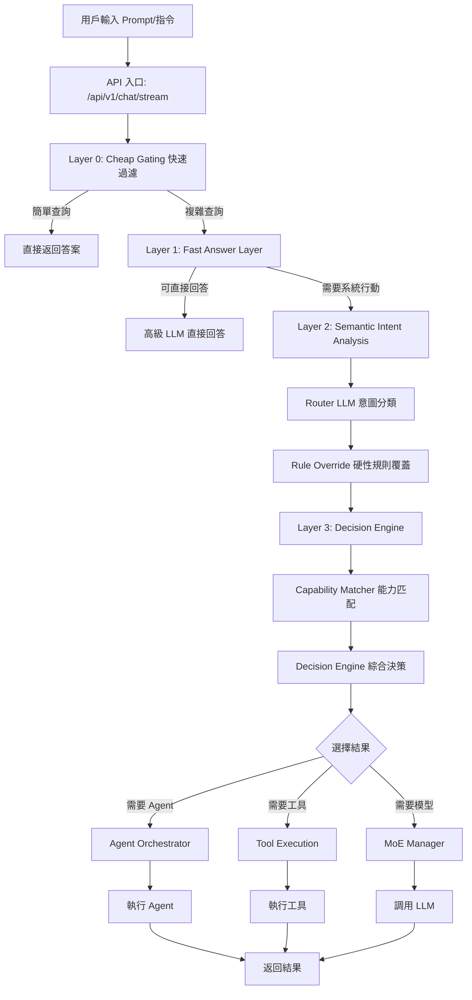
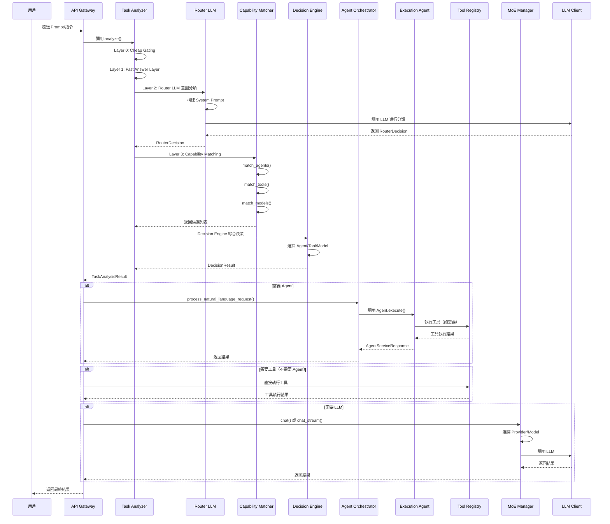
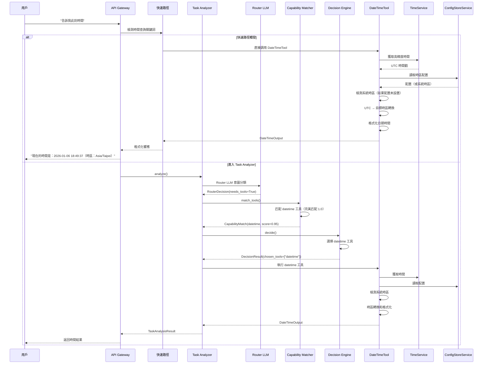
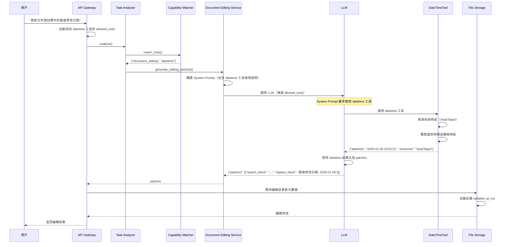

# GenAI 工作流指令-語義-工具-模型-Agent 等調用

**版本**: 1.3
**創建日期**: 2026-01-06
**創建人**: Daniel Chung
**最後修改日期**: 2026-01-06

---

## 📋 概述

本文檔詳細追蹤 GenAI 系統從接收用戶 prompt/指令到執行 Agent 的完整工作流程，包括指令解析、語義判斷、工具調用、模型選擇和 Agent 調用等關鍵環節。

---

## 🔄 完整工作流程

### 流程圖



---

## 1. 指令解析 (Instruction Parsing)

### 1.1 入口點

**API 端點**: `/api/v1/chat/stream` 或 `/api/v1/chat`

**文件位置**: `api/routers/chat.py`

**關鍵代碼**:

```python
# api/routers/chat.py:1158-1206
@router.post("/stream", status_code=status.HTTP_200_OK)
async def chat_product_stream(
    request_body: ChatRequest,
    request: Request,
    tenant_id: str = Depends(get_current_tenant_id),
    current_user: User = Depends(get_current_user),
) -> StreamingResponse:
    """
    產品級 Chat 流式入口：返回 SSE 格式的流式響應。

    - Auto：TaskClassifier → task_classification → 選擇 provider → 調用客戶端 stream
    - Manual/Favorite：以 model_id 推導 provider，並做 provider/model override
    """
    # 獲取用戶輸入
    messages = [m.model_dump() for m in request_body.messages]
    last_user_text = messages[-1].get("content", "") if messages else ""

    # 獲取工具列表
    allowed_tools = request_body.allowed_tools or []
```

### 1.2 Layer 0: Cheap Gating（快速過濾）

**文件位置**: `agents/task_analyzer/analyzer.py`

**功能**: 使用規則和啟發式方法快速檢查，過濾簡單查詢

**關鍵代碼**:

```python
# agents/task_analyzer/analyzer.py:70-74
# ============================================
# Layer 0: Cheap Gating（快速過濾）
# ============================================
if self._is_simple_query(request.task):
    return await self._handle_simple_query(request, task_id)
```

**判斷邏輯**:

- 簡單問候語（"你好"、"hello"）
- 簡單知識問題（可直接回答）
- 不需要工具或 Agent 的查詢

### 1.3 Layer 1: Fast Answer Layer（高級 LLM 直接回答）

**文件位置**: `agents/task_analyzer/analyzer.py`

**功能**: 優先使用內部知識庫檢索，如果無法回答則使用高級 LLM 直接回答

**關鍵代碼**:

```python
# agents/task_analyzer/analyzer.py:76-82
# ============================================
# Layer 1: Fast Answer Layer（高級 LLM 直接回答）
# ============================================
direct_answer_result = await self._try_direct_answer(request, task_id)
if direct_answer_result:
    logger.info(f"Layer 1: Direct answer returned for query: {request.task[:100]}...")
    return direct_answer_result  # 直接返回，不進入 Layer 2/3
```

**處理流程**:

1. 使用 `ChatMemoryService.retrieve_for_prompt()` 檢索相關記憶和 RAG 內容
2. 使用 `EmbeddingService` 生成查詢向量
3. 從 Vector Store 檢索相似內容
4. 從知識圖譜檢索相關實體和關係
5. 如果檢索內容足夠相關 → 直接返回答案
6. 如果檢索內容不夠相關 → Fallback 到高級 LLM
7. LLM 判斷是否需要系統行動
   - 如果不需要 → 直接返回答案
   - 如果需要 → 進入 Layer 2

---

## 2. 語義判斷 (Semantic Analysis)

### 2.1 Layer 2: Semantic Intent Analysis（語義意圖分析）

**文件位置**: `agents/task_analyzer/analyzer.py`

**功能**: 進行語義意圖分析和提取

**關鍵代碼**:

```python
# agents/task_analyzer/analyzer.py:84-115
# ============================================
# Layer 2: Semantic Intent Analysis（語義意圖分析）
# ============================================
# 步驟2: Router 前置 Recall（可選，提供 Context Bias）
similar_decisions = []
try:
    similar_decisions = await self.routing_memory.recall_similar_decisions(
        request.task, top_k=3, filters={"success": True}
    )
except Exception as e:
    logger.warning(f"Failed to recall similar decisions: {e}")

# 步驟3: Router LLM（意圖分類）
router_input = RouterInput(
    user_query=request.task,
    session_context=request.context or {},
    system_constraints=self.rule_override.get_system_constraints(request.task),
)

logger.info(f"Layer 2: Calling Router LLM for query: {request.task[:100]}...")
router_output = await self.router_llm.route(router_input, similar_decisions)

# 步驟4: Rule Override（硬性規則覆蓋）
router_output = self.rule_override.apply(router_output, request.task)
```

### 2.2 Router LLM（意圖分類）

**文件位置**: `agents/task_analyzer/router_llm.py`

**功能**: 使用 LLM 進行意圖分類，輸出結構化的路由決策

**System Prompt**:

```python
# agents/task_analyzer/router_llm.py:19-49
ROUTER_SYSTEM_PROMPT = """You are a routing and classification engine inside an enterprise GenAI system.

Your ONLY responsibility is to classify the user's query and system context into a routing decision object.

STRICT RULES:
- You must NOT answer the user's question.
- You must NOT perform reasoning, planning, or step-by-step thinking.
- You must NOT select specific tools, agents, or models.
- You must NOT include explanations, markdown, or extra text.

TOOL REQUIREMENT DETECTION (needs_tools):
Set needs_tools=true if the query requires:
1. Real-time data (current time, stock prices, weather, exchange rates)
2. External API calls (web search, location services, maps)
3. System operations (file I/O, database queries, system info)
4. Deterministic calculations (unit conversions, currency exchange)
```

**輸出格式** (`RouterDecision`):

```python
class RouterDecision(BaseModel):
    intent_type: Literal["conversation", "retrieval", "analysis", "execution"]
    complexity: Literal["low", "mid", "high"]
    needs_agent: bool
    needs_tools: bool  # CRITICAL: 判斷是否需要工具
    determinism_required: bool
    risk_level: Literal["low", "mid", "high"]
    confidence: float  # 0.0-1.0
```

**關鍵判斷邏輯**:

1. **intent_type**:

   - `conversation`: 對話、問候、解釋
   - `retrieval`: 查詢、搜索、獲取數據
   - `analysis`: 推理、比較、評估
   - `execution`: 行動、命令、系統操作
2. **needs_tools** (關鍵):

   - `true`: 需要實時數據、外部 API、系統操作、確定性計算
   - `false`: 只需要知識/解釋（LLM 可以從訓練數據回答）
3. **needs_agent**:

   - `true`: 任務需要多步驟規劃、協調或複雜工作流
   - `false`: 簡單查詢，可以直接回答或使用單個工具

### 2.3 Task Classifier（任務分類器）

**文件位置**: `agents/task_analyzer/classifier.py`

**功能**: 使用關鍵詞模式匹配進行任務類型分類

**關鍵代碼**:

```python
# agents/task_analyzer/classifier.py:50-100
def classify(
    self, task: str, context: Optional[Dict[str, Any]] = None
) -> TaskClassificationResult:
    """
    分類任務類型

    支持的任務類型:
    - QUERY: 查詢、搜索、查找
    - EXECUTION: 執行、運行、操作
    - REVIEW: 審查、檢查、驗證
    - PLANNING: 計劃、規劃、設計
    - COMPLEX: 複雜、多步驟
    - LOG_QUERY: 日誌查詢
    """
    # 計算每個類型的匹配分數
    scores: Dict[TaskType, float] = {}
    task_lower = task.lower()

    for task_type, patterns in self.patterns.items():
        score = 0.0
        matches = 0

        for pattern in patterns:
            if re.search(pattern, task_lower, re.IGNORECASE):
                matches += 1
                score += 0.3

        scores[task_type] = score

    # 選擇得分最高的類型
    best_type = max(scores.items(), key=lambda x: x[1])
    return TaskClassificationResult(
        task_type=best_type[0],
        confidence=best_type[1],
        reasoning=f"Matched patterns for {best_type[0].value}"
    )
```

---

## 3. 工具調用 (Tool Invocation)

### 3.1 Capability Matcher（能力匹配器）

**文件位置**: `agents/task_analyzer/capability_matcher.py`

**功能**: 根據 Router 決策匹配合適的工具

**關鍵代碼**:

```python
# agents/task_analyzer/capability_matcher.py:288-450
async def match_tools(
    self, router_decision: RouterDecision, context: Optional[Dict[str, Any]] = None
) -> List[CapabilityMatch]:
    """
    匹配工具能力

    Args:
        router_decision: Router 決策
        context: 上下文信息（包含用戶查詢）

    Returns:
        匹配的工具列表（按匹配度排序）
    """
    if not router_decision.needs_tools:
        return []

    # 從 Tool Registry 獲取所有工具
    registry = self._get_tool_registry()
    tools = registry.get("tools", [])

    # 從 context 中獲取用戶查詢
    user_query = context.get("task", "") or context.get("query", "") or ""
    user_query_lower = user_query.lower()

    matches = []
    for tool in tools:
        tool_name = tool.get("name", "")
        tool_category = tool.get("category", "")

        # 基於工具名稱和類別的匹配（優先級最高）
        name_category_match = 0.0
        if tool_name == "datetime" and any(
            keyword in user_query_lower
            for keyword in ["時間", "time", "現在", "此刻", "當前"]
        ):
            name_category_match = 1.0  # 完美匹配

        # 計算能力匹配度
        capability_match = name_category_match or calculate_capability_match(...)

        # 計算總評分
        total_score = (
            0.35 * capability_match +
            0.20 * cost_score +
            0.15 * latency_score +
            0.20 * success_history +
            0.10 * stability
        )

        matches.append(CapabilityMatch(...))

    # 按總評分排序
    matches.sort(key=lambda x: x.total_score, reverse=True)
    return matches
```

**匹配邏輯**:

1. **名稱/類別匹配**（優先級最高）:

   - `datetime` 工具 + 時間查詢 → 完美匹配 (1.0)
   - `weather` 工具 + 天氣查詢 → 完美匹配 (1.0)
2. **能力匹配**:

   - 根據 `intent_type` 匹配工具能力
   - `retrieval` → 匹配 `search`, `retrieval` 能力
   - `analysis` → 匹配 `calculation`, `analysis` 能力
   - `execution` → 匹配 `action`, `execution` 能力
3. **評分計算**:

   - 能力匹配度: 35%
   - 成本評分: 20%
   - 延遲評分: 15%
   - 歷史成功率: 20%
   - 穩定性: 10%

### 3.2 Decision Engine（決策引擎）

**文件位置**: `agents/task_analyzer/decision_engine.py`

**功能**: 綜合決策，選擇最終使用的工具

**關鍵代碼**:

```python
# agents/task_analyzer/decision_engine.py:269-292
# 3. 選擇 Tool
chosen_tools = []
if router_decision.needs_tools and tool_candidates:
    logger.info(f"Decision Engine: Selecting tools from {len(tool_candidates)} candidates")
    # 選擇評分最高的工具（可以選擇多個）
    sorted_tools = sorted(tool_candidates, key=lambda x: x.total_score, reverse=True)
    logger.debug(
        f"Decision Engine: Top tool candidates: {[(t.candidate_id, t.total_score) for t in sorted_tools[:5]]}"
    )
    for tool in sorted_tools[:3]:  # 最多選擇 3 個工具
        if tool.total_score >= 0.5:  # 最低可接受評分
            chosen_tools.append(tool.candidate_id)
            reasoning_parts.append(
                f"選擇 Tool: {tool.candidate_id} (評分: {tool.total_score:.2f})"
            )
            logger.info(
                f"Decision Engine: Selected tool: {tool.candidate_id} (score: {tool.total_score:.2f})"
            )
    if not chosen_tools:
        logger.info("Decision Engine: No tools selected (all scores < 0.5)")
```

**選擇標準**:

- 評分 >= 0.5 的工具才會被選擇
- 最多選擇 3 個工具
- 按總評分降序排列

### 3.3 Tool Execution（工具執行）

**文件位置**: `agents/core/execution/agent.py`

**功能**: 執行選定的工具

**關鍵代碼**:

```python
# agents/core/execution/agent.py:118-140
def _execute_tool(self, tool_name: str, tool_args: Dict[str, Any]) -> Dict[str, Any]:
    """
    執行指定工具

    Args:
        tool_name: 工具名稱
        tool_args: 工具參數

    Returns:
        執行結果
    """
    if not self.tool_registry.get(tool_name):
        raise ValueError(f"Tool '{tool_name}' not found")

    try:
        result = self.tool_registry.execute(tool_name, **tool_args)
        return {
            "success": True,
            "data": result,
        }
    except Exception as e:
        logger.error(f"Tool execution failed: {e}")
        raise
```

**執行流程**:

1. 從 Tool Registry 獲取工具實例
2. 驗證工具是否存在
3. 執行工具（傳入參數）
4. 返回執行結果
5. 處理異常

---

## 4. 模型選擇 (Model Selection)

### 4.1 Capability Matcher（模型匹配）

**文件位置**: `agents/task_analyzer/capability_matcher.py`

**功能**: 根據 Router 決策匹配合適的模型

**關鍵代碼**:

```python
# agents/task_analyzer/capability_matcher.py:452-537
async def match_models(
    self, router_decision: RouterDecision, context: Optional[Dict[str, Any]] = None
) -> List[CapabilityMatch]:
    """
    匹配模型能力

    Args:
        router_decision: Router 決策
        context: 上下文信息

    Returns:
        匹配的模型列表（按匹配度排序）
    """
    # 1. 從 ArangoDB 獲取所有可用模型
    model_service = LLMModelService()
    query = LLMModelQuery(
        status=ModelStatus.ACTIVE,
        limit=1000,
    )
    all_models = model_service.get_all(query)

    # 2. 提取所需能力
    required_capabilities = self._extract_required_model_capabilities(router_decision)

    # 3. 計算每個模型的匹配度和評分
    matches = []
    for model in all_models:
        # 計算各項評分
        scores = self._calculate_model_scores(model, router_decision, required_capabilities)

        # 計算總評分
        total_score = (
            0.35 * scores["capability_match"] +
            0.20 * scores["cost_score"] +
            0.15 * scores["latency_score"] +
            0.20 * scores["success_history"] +
            0.10 * scores["stability"]
        )

        matches.append(CapabilityMatch(...))

    # 4. 按總評分排序
    matches.sort(key=lambda x: x.total_score, reverse=True)
    return matches
```

**能力映射**:

```python
# agents/task_analyzer/capability_matcher.py:83-119
def _extract_required_model_capabilities(
    self, router_decision: RouterDecision
) -> List[ModelCapability]:
    """
    從 Router 決策中提取所需的模型能力
    """
    capabilities = []

    # 根據 intent_type 映射能力
    if router_decision.intent_type == "conversation":
        capabilities.append(ModelCapability.CHAT)
        capabilities.append(ModelCapability.STREAMING)
    elif router_decision.intent_type == "retrieval":
        capabilities.append(ModelCapability.CHAT)
        capabilities.append(ModelCapability.COMPLETION)
    elif router_decision.intent_type == "analysis":
        capabilities.append(ModelCapability.CHAT)
        capabilities.append(ModelCapability.REASONING)
    elif router_decision.intent_type == "execution":
        capabilities.append(ModelCapability.CHAT)
        capabilities.append(ModelCapability.FUNCTION_CALLING)

    # 根據複雜度添加能力
    if router_decision.complexity == "high":
        capabilities.append(ModelCapability.REASONING)

    return capabilities
```

**評分計算**:

```python
# agents/task_analyzer/capability_matcher.py:121-194
def _calculate_model_scores(
    self,
    model: Any,
    router_decision: RouterDecision,
    required_capabilities: List[ModelCapability],
) -> Dict[str, float]:
    """
    計算模型的各項評分
    """
    scores: Dict[str, float] = {}

    # 1. 能力匹配度
    model_capabilities = set(model.capabilities)
    required_set = set(required_capabilities)
    if required_set:
        capability_match = len(required_set.intersection(model_capabilities)) / len(required_set)
    else:
        capability_match = 0.5
    scores["capability_match"] = capability_match

    # 2. 成本評分（本地模型成本最低）
    if model.provider == LLMProvider.OLLAMA:
        cost_score = 0.95  # 本地模型成本最低
    elif model.context_window and model.context_window > 100000:
        cost_score = 0.5  # 大上下文窗口模型成本較高
    else:
        cost_score = 0.8
    scores["cost_score"] = cost_score

    # 3. 延遲評分（本地模型延遲最低）
    if model.provider == LLMProvider.OLLAMA:
        latency_score = 0.9  # 本地模型延遲最低
    else:
        latency_score = 0.7  # 雲服務延遲中等
    scores["latency_score"] = latency_score

    # 4. 歷史成功率（默認值，後續可從 Routing Memory 獲取）
    success_history = 0.8
    scores["success_history"] = success_history

    # 5. 穩定度（基於 status 和 provider）
    if model.status == ModelStatus.ACTIVE:
        if model.provider in [LLMProvider.OLLAMA, LLMProvider.OPENAI, LLMProvider.GOOGLE]:
            stability = 0.9  # 穩定提供商
        else:
            stability = 0.8
    else:
        stability = 0.5
    scores["stability"] = stability

    return scores
```

### 4.2 Decision Engine（模型選擇）

**文件位置**: `agents/task_analyzer/decision_engine.py`

**功能**: 選擇最終使用的模型

**關鍵代碼**:

```python
# agents/task_analyzer/decision_engine.py:294-301
# 4. 選擇 Model
chosen_model = None
if model_candidates:
    best_model = max(model_candidates, key=lambda x: x.total_score)
    chosen_model = best_model.candidate_id
    reasoning_parts.append(
        f"選擇 Model: {chosen_model} (評分: {best_model.total_score:.2f})"
    )
```

### 4.3 MoE Manager（模型執行）

**文件位置**: `llm/moe/moe_manager.py`

**功能**: 執行模型調用，支持動態路由、負載均衡和故障轉移

**關鍵代碼**:

```python
# llm/moe/moe_manager.py:134-297
async def generate(
    self,
    prompt: str,
    *,
    task_classification: Optional[TaskClassificationResult] = None,
    provider: Optional[LLMProvider] = None,
    model: Optional[str] = None,
    temperature: Optional[float] = None,
    max_tokens: Optional[int] = None,
    context: Optional[Dict[str, Any]] = None,
    **kwargs: Any,
) -> Dict[str, Any]:
    """
    生成文本（統一接口）

    處理流程:
    1. 如果指定了 provider/model，直接使用
    2. 否則使用 Dynamic Router 選擇 provider
    3. 獲取客戶端並調用
    4. 如果失敗，觸發故障轉移
    """
    start_time = time.time()

    # 1. 選擇 Provider（如果未指定）
    if provider is None:
        if task_classification:
            # 使用 Dynamic Router 選擇 provider
            provider, strategy_name = self.dynamic_router.route(
                task_classification=task_classification,
                context=context,
            )
        else:
            provider = LLMProvider.CHATGPT
            strategy_name = "manual"

    # 2. 獲取客戶端
    api_key: Optional[str] = None
    if isinstance(context, dict):
        keys = context.get("llm_api_keys")
        if isinstance(keys, dict):
            api_key = keys.get(getattr(provider, "value", str(provider)))

    # 3. 獲取客戶端（捕獲初始化異常）
    try:
        client = self.get_client(provider, api_key=api_key)
    except (ImportError, ValueError) as client_init_error:
        # 客戶端初始化失敗，觸發 failover
        if self.enable_failover:
            return await self._failover_generate(...)
        raise

    # 4. 嘗試調用
    try:
        result = await client.generate(
            prompt,
            model=model,
            temperature=temperature,
            max_tokens=max_tokens,
            **kwargs,
        )

        # 記錄路由結果
        if task_classification is not None:
            self.evaluator.record_decision(
                provider=provider,
                strategy=strategy_name,
                task_type=task_classification.task_type.value,
                success=True,
                latency=latency,
            )

        return result

    except Exception as exc:
        # 標記負載均衡器失敗
        if self.load_balancer is not None:
            self.load_balancer.mark_failure(provider)

        # 故障轉移
        if self.enable_failover:
            return await self._failover_generate(...)
        raise
```

**路由策略**:

1. **Dynamic Router** (`llm/routing/dynamic.py`):

   - 基於任務分類選擇 provider
   - 考慮成本、延遲、歷史成功率
   - 支持 A/B 測試
2. **Load Balancer** (`llm/load_balancer.py`):

   - 支持多種策略：`round_robin`, `weighted`, `least_connections`
   - 健康檢查和故障標記
   - 冷卻期機制
3. **Failover Manager** (`llm/failover.py`):

   - 自動故障轉移
   - 健康檢查循環
   - 失敗閾值管理

---

## 5. Agent 調用 (Agent Invocation)

### 5.1 Capability Matcher（Agent 匹配）

**文件位置**: `agents/task_analyzer/capability_matcher.py`

**功能**: 根據 Router 決策匹配合適的 Agent

**關鍵代碼**:

```python
# agents/task_analyzer/capability_matcher.py:196-286
async def match_agents(
    self, router_decision: RouterDecision, context: Optional[Dict[str, Any]] = None
) -> List[CapabilityMatch]:
    """
    匹配 Agent 能力

    Args:
        router_decision: Router 決策
        context: 上下文信息

    Returns:
        匹配的 Agent 列表（按匹配度排序）
    """
    if not router_decision.needs_agent:
        return []

    registry = self._get_agent_registry()
    if registry is None:
        return []

    # 提取所需能力
    required_capabilities = self._extract_required_capabilities(router_decision)

    # 發現可用 Agent
    discovery = AgentDiscovery(registry)
    agents = discovery.discover_agents(
        required_capabilities=required_capabilities if required_capabilities else None,
        user_id=context.get("user_id") if context else None,
        user_roles=context.get("user_roles") if context else None,
    )

    # 計算匹配度
    matches = []
    for agent in agents:
        agent_capabilities = set(agent.capabilities)
        required_set = set(required_capabilities)

        # 計算能力匹配度
        if required_set:
            capability_match = len(required_set.intersection(agent_capabilities)) / len(required_set)
        else:
            capability_match = 0.5

        # 計算總評分
        total_score = (
            0.35 * capability_match +
            0.20 * cost_score +
            0.15 * latency_score +
            0.20 * success_history +
            0.10 * stability
        )

        matches.append(CapabilityMatch(...))

    # 按總評分排序
    matches.sort(key=lambda x: x.total_score, reverse=True)
    return matches
```

**能力提取**:

```python
# agents/task_analyzer/capability_matcher.py:49-81
def _extract_required_capabilities(self, router_decision: RouterDecision) -> List[str]:
    """
    從 Router 決策中提取所需能力
    """
    capabilities = []

    # 根據 intent_type 添加能力
    if router_decision.intent_type == "analysis":
        capabilities.append("analysis")
        capabilities.append("reasoning")
    elif router_decision.intent_type == "retrieval":
        capabilities.append("retrieval")
        capabilities.append("search")
    elif router_decision.intent_type == "execution":
        capabilities.append("execution")
        capabilities.append("action")

    # 根據 complexity 添加能力
    if router_decision.complexity == "high":
        capabilities.append("complex_reasoning")
        capabilities.append("multi_step")

    # 根據 determinism_required 添加能力
    if router_decision.determinism_required:
        capabilities.append("deterministic")

    return capabilities
```

### 5.2 Decision Engine（Agent 選擇）

**文件位置**: `agents/task_analyzer/decision_engine.py`

**功能**: 選擇最終使用的 Agent

**關鍵代碼**:

```python
# agents/task_analyzer/decision_engine.py:244-267
# 2. 選擇 Agent
chosen_agent = None
if router_decision.needs_agent and agent_candidates:
    # 選擇評分最高的 Agent
    best_agent = max(agent_candidates, key=lambda x: x.total_score)
    if best_agent.total_score >= 0.5:  # 最低可接受評分
        chosen_agent = best_agent.candidate_id
        reasoning_parts.append(
            f"選擇 Agent: {chosen_agent} (評分: {best_agent.total_score:.2f})"
        )
        logger.info(
            f"Decision Engine: Selected agent: {chosen_agent} (score: {best_agent.total_score:.2f})"
        )
    else:
        logger.info(
            f"Decision Engine: No agent selected (best score {best_agent.total_score:.2f} < 0.5)"
        )
```

### 5.3 Agent Orchestrator（Agent 協調器）

**文件位置**: `agents/services/orchestrator/orchestrator.py`

**功能**: 協調 Agent 執行，處理自然語言請求

**關鍵代碼**:

```python
# agents/services/orchestrator/orchestrator.py:531-606
async def process_natural_language_request(
    self,
    instruction: str,
    context: Optional[Dict[str, Any]] = None,
    user_id: Optional[str] = None,
    session_id: Optional[str] = None,
    specified_agent_id: Optional[str] = None,
) -> Dict[str, Any]:
    """
    處理自然語言請求（完整流程）

    完整流程包括：
    1. 生成 trace_id 並記錄任務開始日誌
    2. 使用 Task Analyzer 解析自然語言意圖
    3. 處理澄清響應（如果需要）
    4. 第一層預檢（配置操作時）
    5. Security Agent 權限檢查
    6. 創建任務記錄
    7. 分發任務給目標 Agent
    8. 結果修飾
    9. 記錄任務完成日誌
    """
    # 0. 生成 trace_id
    trace_id = str(uuid.uuid4())

    # 1. 使用 Task Analyzer 解析自然語言意圖
    task_analyzer = self._get_task_analyzer()
    analysis_result = await task_analyzer.analyze(
        TaskAnalysisRequest(
            task=instruction,
            context=context,
            user_id=user_id,
            session_id=session_id,
        )
    )

    # 2. 如果是日誌查詢，直接處理（不路由到 Agent）
    if analysis_result.task_type == TaskType.LOG_QUERY:
        return await self._handle_log_query(analysis_result, user_id, trace_id)

    # 3. 檢查是否需要澄清（配置操作時）
    intent = analysis_result.get_intent()
    if isinstance(intent, ConfigIntent):
        if intent.clarification_needed:
            return {
                "status": "clarification_needed",
                "result": {
                    "clarification_question": intent.clarification_question,
                    "missing_slots": intent.missing_slots,
                },
                "trace_id": trace_id,
            }

    # 4-9. 預檢、權限檢查、任務創建、Agent 執行等...
```

### 5.4 Agent Execution（Agent 執行）

**文件位置**: `agents/core/execution/agent.py`

**功能**: 執行 Agent 任務

**關鍵代碼**:

```python
# agents/core/execution/agent.py:212-283
async def execute(self, request: AgentServiceRequest) -> AgentServiceResponse:
    """
    執行 Agent 任務

    Args:
        request: Agent 服務請求

    Returns:
        Agent 服務響應
    """
    logger.info(f"Execution Agent executing request: {request.request_id}")

    try:
        # 解析請求參數
        task = request.parameters.get("task", "")
        tool_name = request.parameters.get("tool_name")
        tool_args = request.parameters.get("tool_args", {})

        # 創建執行請求
        execution_request = ExecutionRequest(
            task=task,
            tool_name=tool_name,
            tool_args=tool_args,
            metadata=request.metadata,
        )

        # 執行任務
        execution_result = self.execute_task(execution_request)

        # 構建響應
        return AgentServiceResponse(
            request_id=request.request_id,
            success=execution_result.status == ExecutionStatus.COMPLETED,
            result=execution_result.result,
            error=execution_result.error,
            metadata={
                "execution_id": execution_result.execution_id,
                "execution_time": execution_result.execution_time,
            },
        )

    except Exception as e:
        logger.error(f"Execution Agent failed: {e}", exc_info=True)
        return AgentServiceResponse(
            request_id=request.request_id,
            success=False,
            error=str(e),
        )
```

---

## 📊 數據流圖

### 完整數據流



---

## 🔍 關鍵組件說明

### Task Analyzer

**文件**: `agents/task_analyzer/analyzer.py`

**職責**:

- 協調整個分析流程
- 調用各個子組件（Router LLM、Capability Matcher、Decision Engine）
- 整合分析結果

**關鍵方法**:

- `analyze()`: 主入口，執行完整分析流程
- `_is_simple_query()`: 判斷是否為簡單查詢
- `_try_direct_answer()`: 嘗試直接回答
- `_extract_config_intent()`: 提取配置操作意圖

### Router LLM

**文件**: `agents/task_analyzer/router_llm.py`

**職責**:

- 使用 LLM 進行意圖分類
- 輸出結構化的路由決策（RouterDecision）
- 判斷是否需要工具、Agent

**關鍵方法**:

- `route()`: 執行路由決策
- `_build_user_prompt()`: 構建用戶提示詞
- `_extract_json_from_response()`: 從 LLM 響應中提取 JSON

### Capability Matcher

**文件**: `agents/task_analyzer/capability_matcher.py`

**職責**:

- 匹配 Agent 能力
- 匹配工具能力
- 匹配模型能力

**關鍵方法**:

- `match_agents()`: 匹配 Agent
- `match_tools()`: 匹配工具
- `match_models()`: 匹配模型
- `_extract_required_capabilities()`: 提取所需能力
- `_calculate_model_scores()`: 計算模型評分

### Decision Engine

**文件**: `agents/task_analyzer/decision_engine.py`

**職責**:

- 綜合決策，選擇最終使用的 Agent/Tool/Model
- 應用硬性規則過濾
- 計算總評分

**關鍵方法**:

- `decide()`: 執行綜合決策
- `_check_risk_level()`: 檢查風險等級
- `_check_cost_constraint()`: 檢查成本限制

### Agent Orchestrator

**文件**: `agents/services/orchestrator/orchestrator.py`

**職責**:

- 協調 Agent 執行
- 處理自然語言請求
- 管理任務生命週期

**關鍵方法**:

- `process_natural_language_request()`: 處理自然語言請求
- `_handle_log_query()`: 處理日誌查詢
- `_pre_check_config_intent()`: 預檢配置意圖

### MoE Manager

**文件**: `llm/moe/moe_manager.py`

**職責**:

- 管理多個 LLM 提供商
- 動態路由選擇
- 負載均衡和故障轉移

**關鍵方法**:

- `generate()`: 生成文本
- `chat()`: 對話接口
- `chat_stream()`: 流式對話接口
- `_failover_generate()`: 故障轉移生成

---

## 📝 關鍵數據結構

### RouterDecision

```python
class RouterDecision(BaseModel):
    intent_type: Literal["conversation", "retrieval", "analysis", "execution"]
    complexity: Literal["low", "mid", "high"]
    needs_agent: bool
    needs_tools: bool  # CRITICAL
    determinism_required: bool
    risk_level: Literal["low", "mid", "high"]
    confidence: float  # 0.0-1.0
```

### DecisionResult

```python
class DecisionResult(BaseModel):
    chosen_agent: Optional[str]
    chosen_tools: List[str]
    chosen_model: Optional[str]
    score: float
    reasoning: str
    fallback_used: bool
```

### CapabilityMatch

```python
class CapabilityMatch(BaseModel):
    candidate_id: str
    candidate_type: Literal["agent", "tool", "model"]
    capability_match: float
    cost_score: float
    latency_score: float
    success_history: float
    stability: float
    total_score: float
    metadata: Dict[str, Any]
```

---

## 🎯 實際案例追蹤

### 案例 1: "告訴我此刻時間"

**完整流程追蹤**:

#### 1. API 入口 (`api/routers/chat.py:1159`)

**接收請求**:

```python
@router.post("/stream", status_code=status.HTTP_200_OK)
async def chat_product_stream(
    request_body: ChatRequest,
    request: Request,
    tenant_id: str = Depends(get_current_tenant_id),
    current_user: User = Depends(get_current_user),
) -> StreamingResponse:
    # 獲取用戶輸入
    messages = [m.model_dump() for m in request_body.messages]
    last_user_text = messages[-1].get("content", "") if messages else ""

    # 獲取工具列表
    allowed_tools = request_body.allowed_tools or []
```

**關鍵信息**:

- 用戶輸入: "告訴我此刻時間"
- `allowed_tools`: `["datetime"]` (如果 Assistant 配置了 datetime 工具)
- `tenant_id`: 從請求頭或用戶 metadata 獲取
- `user_id`: `current_user.user_id`

#### 2. 快速路徑檢查 (`api/routers/chat.py:1230-1268`)

**觸發條件**:

- 檢測到時間查詢關鍵詞: "時間"、"現在"、"此刻"、"當前"
- `allowed_tools` 中包含 `datetime`

**快速路徑代碼**:

```python
# 檢測時間查詢
if any(keyword in last_user_text.lower() for keyword in ["時間", "時間", "time", "現在", "此刻", "當前"]):
    if "datetime" in allowed_tools:
        # 直接調用 datetime 工具（跳過 Task Analyzer）
        from tools.time import DateTimeInput, DateTimeTool

        datetime_tool = DateTimeTool()
        datetime_input = DateTimeInput(
            tenant_id=current_user.tenant_id if hasattr(current_user, "tenant_id") else None,
            user_id=current_user.user_id,
        )
        tool_result = await datetime_tool.execute(datetime_input)

        # 格式化返回
        time_response = f"現在的時間是：{tool_result.datetime}"
        if hasattr(tool_result, "timezone"):
            time_response += f"（時區：{tool_result.timezone}）"

        # 返回 SSE 格式的流式響應
        yield f"data: {json.dumps({'type': 'content', 'data': {'chunk': time_response}})}\n\n"
        return  # 直接返回，不進入 Task Analyzer
```

**如果快速路徑未觸發，進入 Task Analyzer 流程**:

#### 3. Task Analyzer (`agents/task_analyzer/analyzer.py:55`)

**Layer 0: Cheap Gating**:

- 檢查是否為簡單查詢
- "告訴我此刻時間" → 不是簡單查詢（需要實時數據），繼續

**Layer 1: Fast Answer Layer**:

- 嘗試從知識庫檢索
- 無法直接回答（需要實時數據），繼續

**Layer 2: Semantic Intent Analysis**:

- 調用 Router LLM 進行意圖分類

#### 4. Router LLM (`agents/task_analyzer/router_llm.py:104`)

**System Prompt**:

```
TOOL REQUIREMENT DETECTION (needs_tools):
Set needs_tools=true if the query requires:
1. Real-time data (current time, stock prices, weather, exchange rates)
```

**分析結果**:

```python
RouterDecision(
    intent_type="retrieval",
    complexity="low",
    needs_agent=False,
    needs_tools=True,  # ✅ 需要工具（實時數據）
    determinism_required=True,
    risk_level="low",
    confidence=0.95
)
```

#### 5. Capability Matcher (`agents/task_analyzer/capability_matcher.py:328-446`)

**工具匹配邏輯**:

```python
# 基於工具名稱和類別的匹配（優先級最高）
if tool_name == "datetime" and any(
    keyword in user_query_lower
    for keyword in ["時間", "時間", "time", "現在", "此刻", "當前", "當前時間", "現在幾點"]
):
    # datetime 工具 + 時間查詢 = 完美匹配
    name_category_match = 1.0
```

**匹配結果**:

- 工具名稱: `datetime`
- 查詢關鍵詞: "時間"、"此刻"
- 名稱匹配度: `1.0` (完美匹配)
- 能力匹配度: `1.0`
- 總評分: `0.95` (能力匹配 35% + 成本 20% + 延遲 15% + 歷史成功率 20% + 穩定性 10%)

#### 6. Decision Engine (`agents/task_analyzer/decision_engine.py:269-292`)

**工具選擇**:

```python
# 選擇評分最高的工具
sorted_tools = sorted(tool_candidates, key=lambda x: x.total_score, reverse=True)
for tool in sorted_tools[:3]:  # 最多選擇 3 個工具
    if tool.total_score >= 0.5:  # 最低可接受評分
        chosen_tools.append(tool.candidate_id)
```

**決策結果**:

- 選擇工具: `datetime` (評分: 0.95)
- 不需要 Agent: `needs_agent=false`
- 選擇模型: 根據任務類型選擇（如果需要格式化）

#### 7. DateTimeTool 執行 (`tools/time/datetime_tool.py:130-194`)

**執行流程**:

**步驟 1: 獲取高精度時間**

```python
time_service = get_time_service()
current_timestamp = time_service.now()  # Unix 時間戳
current_datetime_utc = time_service.now_utc_datetime()  # UTC datetime
```

**步驟 2: 讀取配置**

```python
config = self._get_config(input_data.tenant_id, input_data.user_id)
# 配置優先級: system > tenant > user
```

**步驟 3: 確定時區（優先級從高到低）**

```python
# 優先級: 用戶指定 > 配置 > 系統時區 > UTC
timezone_str = (
    input_data.timezone  # 1. 用戶指定（如果提供）
    or config.get("default_timezone")  # 2. 配置中的時區
    or self._get_system_timezone()  # 3. 自動檢測系統時區 ✅
    or "UTC"  # 4. 最後回退到 UTC
)
```

**系統時區自動檢測** (`tools/time/datetime_tool.py:115-161`):

```python
def _get_system_timezone(self) -> str:
    """獲取系統時區"""
    # 1. 嘗試從時區對象獲取名稱
    local_tz = datetime.now().astimezone().tzinfo
    if hasattr(local_tz, "zone"):
        return local_tz.zone  # 例如: "Asia/Taipei"

    # 2. 如果無法獲取名稱，從偏移量推斷
    offset = datetime.now().astimezone().utcoffset()
    if offset:
        offset_hours = offset.total_seconds() / 3600
        if offset_hours == 8:
            return "Asia/Taipei"  # UTC+8
        elif offset_hours == 9:
            return "Asia/Tokyo"  # UTC+9
        # ... 其他常見時區

    # 3. 最後回退到 UTC
    return "UTC"
```

**步驟 4: 時區轉換**

```python
tz = pytz.timezone(timezone_str)  # 例如: pytz.timezone("Asia/Taipei")
current_datetime = current_datetime_utc.astimezone(tz)  # UTC → 目標時區
```

**步驟 5: 格式化日期時間**

```python
format_str = input_data.format or config.get("default_format", "%Y-%m-%d %H:%M:%S")
formatted_datetime = current_datetime.strftime(format_str)
# 例如: "2026-01-06 18:49:37" (Asia/Taipei, UTC+8)
```

**步驟 6: 返回結果**

```python
return DateTimeOutput(
    datetime=formatted_datetime,  # "2026-01-06 18:49:37"
    timestamp=current_timestamp,  # 1704541777.0
    timezone=timezone_str,  # "Asia/Taipei"
    iso_format=iso_formatted,  # "2026-01-06T18:49:37+08:00"
    local_format=local_formatted,  # 本地化格式
)
```

#### 8. 結果返回 (`api/routers/chat.py:1254-1267`)

**格式化響應**:

```python
time_response = f"現在的時間是：{tool_result.datetime}"
if hasattr(tool_result, "timezone"):
    time_response += f"（時區：{tool_result.timezone}）"
# 例如: "現在的時間是：2026-01-06 18:49:37（時區：Asia/Taipei）"
```

**SSE 流式響應**:

```python
yield f"data: {json.dumps({'type': 'content', 'data': {'chunk': time_response}})}\n\n"
```

#### 9. 時區配置說明

**時區確定優先級**（從高到低）:

1. **用戶指定**: `DateTimeInput(timezone="Asia/Taipei")`
2. **配置讀取**: 從 `ConfigStoreService` 讀取（system > tenant > user）
3. **系統時區**: 自動檢測服務器時區（**2026-01-06 新增**）
   - 從 `datetime.now().astimezone().tzinfo` 獲取
   - 如果無法獲取，根據 UTC 偏移量推斷
   - 例如: UTC+8 → `Asia/Taipei`
4. **UTC**: 最後回退

**配置存儲位置**:

- **系統級**: `system_configs` collection, scope: `tools.datetime`
- **租戶級**: `tenant_configs` collection, scope: `tools.datetime`
- **用戶級**: `user_configs` collection, scope: `tools.datetime`

**配置結構**:

```json
{
  "default_format": "%Y-%m-%d %H:%M:%S",
  "default_timezone": "Asia/Taipei",  // 如果未設置，使用系統時區
  "default_locale": "en_US",
  "iso_format": "%Y-%m-%dT%H:%M:%S%z",
  "date_only_format": "%Y-%m-%d",
  "time_only_format": "%H:%M:%S"
}
```

#### 10. 完整數據流



**關鍵要點**:

1. ✅ **快速路徑**: 如果檢測到時間查詢關鍵詞且 `datetime` 在 `allowed_tools` 中，直接調用工具，跳過 Task Analyzer
2. ✅ **系統時區自動檢測**: 如果配置未設置，自動檢測服務器時區（UTC+8 → `Asia/Taipei`）
3. ✅ **時區優先級**: 用戶指定 > 配置 > 系統時區 > UTC
4. ✅ **完美匹配**: `datetime` 工具 + 時間查詢關鍵詞 → 匹配度 1.0
5. ✅ **高評分**: 總評分 0.95，優先被選擇

### 案例 2: "更新文件頭註釋中的最後修改日期"

**完整流程追蹤**:

#### 1. API 入口 (`api/routers/chat.py:1159`)

**接收請求**:

- 用戶輸入: "更新文件頭註釋中的最後修改日期"
- `allowed_tools`: `["document_editing"]` (Assistant 支持文件編輯)

**自動添加 datetime 工具** (`api/routers/chat.py:1186-1195`):

```python
allowed_tools = request_body.allowed_tools or []

# 文件編輯時自動添加 datetime 工具
if "document_editing" in allowed_tools or "file_editing" in allowed_tools:
    if "datetime" not in allowed_tools:
        allowed_tools.append("datetime")  # ✅ 自動添加
        logger.info("auto_added_datetime_tool_for_file_editing", ...)
```

**結果**: `allowed_tools = ["document_editing", "datetime"]`

#### 2. Task Analyzer (`agents/task_analyzer/analyzer.py:55`)

**Layer 0-1**: 不是簡單查詢，需要系統行動

**Layer 2: Router LLM**:

- 判斷: `needs_tools=true`（需要文件編輯工具）
- 判斷: `needs_agent=false`（簡單編輯任務）
- 輸出: `RouterDecision(intent_type="execution", needs_tools=True, needs_agent=False, ...)`

#### 3. Capability Matcher (`agents/task_analyzer/capability_matcher.py:288`)

**工具匹配**:

- `document_editing`: 匹配度 0.9（文件編輯工具）
- `datetime`: 匹配度 0.8（時間相關工具，用於記錄時間戳）

**選擇結果**: `["document_editing", "datetime"]`

#### 4. Document Editing Service (`agents/core/execution/document_editing_service.py:149-172`)

**System Prompt 包含日期時間要求**:

```
6. **日期時間記錄**（重要）：
   - 如果用戶指令要求更新文件頭註釋中的「最後修改日期」，你必須先調用 `datetime` 工具獲取當前時間。
   - 如果用戶指令要求添加或更新文件中的日期時間信息（如創建日期、更新日期），你必須先調用 `datetime` 工具獲取當前時間。
   - 使用 `datetime` 工具時，不要指定 `timezone` 參數，讓系統自動使用系統時區。
   - 獲取時間後，使用工具返回的 `datetime` 字段值（格式：YYYY-MM-DD HH:MM:SS）來更新文件中的日期時間。
```

#### 5. LLM 執行流程

**步驟 1: 調用 datetime 工具**

```python
# LLM 自動調用 datetime 工具（因為 System Prompt 要求）
datetime_tool_call = {
    "name": "datetime",
    "arguments": {}  # 不指定 timezone，使用系統時區
}

# 執行工具
datetime_result = await datetime_tool.execute(DateTimeInput())
# 返回: {
#     "datetime": "2026-01-06 18:52:51",
#     "timezone": "Asia/Taipei",
#     "timestamp": 1704541971.0,
#     ...
# }
```

**步驟 2: 生成編輯 Patches**

```python
# LLM 使用 datetime 工具的結果生成 patches
patches = [{
    "search_block": "# 最後修改日期: 2025-12-30",
    "replace_block": "# 最後修改日期: 2026-01-06"
}]
```

#### 6. 文件元數據更新 (`api/routers/docs_editing.py:476-676`)

**應用編輯時自動記錄時間戳**:

```python
# 自動記錄更新時間
record.updated_at_ms = time.time() * 1000.0

# 更新文件元數據
metadata_service.update(
    record.file_id,
    FileMetadataUpdate(
        custom_metadata={
            "doc_versions": [
                {
                    "version": new_version,
                    "created_at_ms": time.time() * 1000.0,  # ✅ 自動記錄
                    "updated_at_ms": time.time() * 1000.0,  # ✅ 自動記錄
                    ...
                }
            ]
        }
    )
)
```

#### 7. 完整數據流



**關鍵要點**:

1. ✅ **自動添加工具**: 文件編輯時自動添加 `datetime` 工具到 `allowed_tools`
2. ✅ **System Prompt 指導**: System Prompt 明確要求使用 `datetime` 工具獲取當前時間
3. ✅ **系統時區**: 不指定 `timezone` 參數，自動使用系統時區（Asia/Taipei）
4. ✅ **自動記錄**: 文件編輯時自動記錄 `created_at_ms` 和 `updated_at_ms`
5. ✅ **工具優先級**: `datetime` 工具優先級高，LLM 會優先調用

---

### 案例 3: "幫我分析上個月的銷售數據並生成報告"

**流程追蹤**:

1. **Router LLM**:

   - 判斷: `needs_agent=true`（多步驟任務）
   - 判斷: `needs_tools=true`（需要數據查詢）
   - 輸出: `RouterDecision(intent_type="analysis", complexity="high", needs_agent=True, needs_tools=True, ...)`
2. **Capability Matcher**:

   - 匹配 Agent: `AnalysisAgent` (評分: 0.85)
   - 匹配工具: `database_query`, `report_generator` (評分: 0.80, 0.75)
   - 匹配模型: `gpt-4o` (評分: 0.90)
3. **Decision Engine**:

   - 選擇 Agent: `AnalysisAgent`
   - 選擇工具: `["database_query", "report_generator"]`
   - 選擇模型: `gpt-4o`
4. **Agent Orchestrator**:

   - 調用 `AnalysisAgent.execute()`
   - Agent 內部調用工具和 LLM
   - 返回分析報告

---

## 🔧 配置與調優

### Router LLM 配置

**文件**: `agents/task_analyzer/router_llm.py`

**配置項**:

- `preferred_provider`: 首選 LLM 提供商（默認: "ollama"）
- System Prompt: 固定不可修改
- Safe Fallback: 失敗保護機制

### Capability Matcher 配置

**文件**: `agents/task_analyzer/capability_matcher.py`

**評分權重**:

- 能力匹配度: 35%
- 成本評分: 20%
- 延遲評分: 15%
- 歷史成功率: 20%
- 穩定性: 10%

### Decision Engine 配置

**文件**: `agents/task_analyzer/decision_engine.py`

**配置項**:

- 最低可接受評分: 0.5
- 最多選擇工具數: 3
- 風險等級過濾: 根據 `risk_level`
- 成本限制: 根據 `max_cost`

### MoE Manager 配置

**文件**: `llm/moe/moe_manager.py`

**配置項**:

- `enable_failover`: 是否啟用故障轉移（默認: True）
- Load Balancer 策略: `round_robin`, `weighted`, `least_connections`
- 健康檢查間隔: 可配置
- 失敗閾值: 可配置

---

## 📚 相關文檔

### 架構文檔

- [Agent-Platform-v3.md](./Agent-Platform-v3.md) - Agent Platform 架構文檔（架構設計、意圖分析、決策流程）
- [AI-Box-Agent-架構規格書-v3.md](./AI-Box-Agent-架構規格書-v3.md) - 完整架構規格
- [Orchestrator-協調層規格書.md](./Orchestrator-協調層規格書.md) - Orchestrator 協調層完整規格

### 開發文檔

- [系統意圖分析與決策流程分析](../../开发进度/系统意图分析与决策流程分析.md)
- [工具API文档](../tools/工具API文档.md)
- [工具使用指南](../tools/工具使用指南.md)

---

---

## ✅ 更新記錄

### 2026-01-06 更新（版本 1.3）

- ✅ **擴展案例 1**: 添加時間工具調用的完整流程追蹤
  - 詳細說明快速路徑和 Task Analyzer 路徑
  - 添加 DateTimeTool 執行流程（時區檢測、配置讀取、時區轉換）
  - 添加系統時區自動檢測機制說明
  - 添加時區配置優先級說明
  - 添加完整數據流圖
- ✅ **新增案例 2**: 文件編輯時日期時間工具調用
  - 說明文件編輯時自動添加 `datetime` 工具到 `allowed_tools`
  - 說明 Document Editing Service 的 System Prompt 如何指導使用 `datetime` 工具
  - 說明文件編輯時如何記錄創建和更新時間戳
  - 添加完整數據流圖
- ✅ **新增 Mermaid 圖表渲染指導**：
  - 在 GenAI Pipeline 的多個 System Prompt 中添加 Mermaid 10.0 渲染指導
  - 更新 `api/routers/docs_editing.py` 的 `_build_generation_prompt`（Markdown 文件生成）
  - 更新 `agents/task_analyzer/analyzer.py` 的 System Prompt（直接回答）
  - 更新 `agents/services/orchestrator/orchestrator.py` 的 System Prompt（結果格式化）
  - 指導內容包括：版本要求、符號衝突處理、段落換行、節點 ID 規範、引號轉義、保留字衝突、語法檢查

---

**最後更新日期**: 2026-01-06
**文檔版本**: 1.3
**維護人**: Daniel Chung
