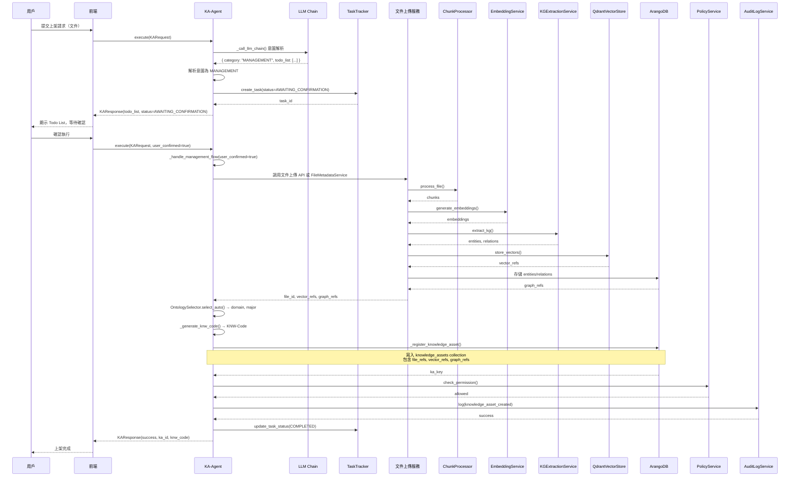
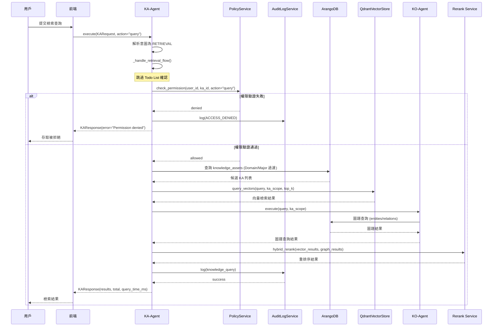

# KA-Agent (Knowledge Architect Agent) 工程級規格書

> **文件狀態**: 工程開發實施指南  
> **文檔版本**: v1.5.8  
> **最後更新**: 2026-01-25 19:19 UTC+8  
> **維護人**: Daniel Chung  
> **對齊系統**: AI-Box File Upload v4.3, LangGraph Engine v2.3, KSLS v1.0

---

## 1. 系統定位與架構對齊

### 1.1 核心定位
KA-Agent（Knowledge Architect Agent）是 **Knowledge Service Layer (KSL)** 的核心執行體，負責將「物理存儲（SeaweedFS/Qdrant/ArangoDB）」與「邏輯知識（Knowledge Assets, KA）」進行解耦與封裝。

### 1.2 設計原則
- **Knowledge is not memory**：知識是平台級資產，不屬於任何單一 Agent。
- **Assets over documents**：以 Knowledge Asset 為治理單位，而非原始文件。
- **Governance before retrieval**：所有檢索操作必須先通過安全審計。
- **Contracts over coupling**：透過 MCP 契約介面，而非直接耦合。

### 1.3 與 v4.3 上傳架構的整合方式
**重要**：**圖譜與向量處理的核心代碼一致**。文件上傳與 KA-Agent 上架共用同一套 `ChunkProcessor`、`EmbeddingService`、`KGExtractionService`、`QdrantVectorStoreService`、ArangoDB 圖譜存儲；差異在於**調用場景**與**意圖/任務是否明確**。

**場景區分**：
- **一般用戶上傳**：`user_id` 為普通用戶，`task_id` 為用戶任務（如 `user_123_task_001`）
- **KA-Agent 上架**：`user_id` 為 `systemAdmin`，`task_id` 為 `KA-Agent-Tasks`（或類似專屬任務）

**整合架構**：詳見 [文件上傳功能架構說明 v4.0](../文件上傳向量圖譜/上傳的功能架構說明-v4.0.md)

#### 1.3.1 核心代碼一致、調用路徑不同

| 維度 | 文件上傳 | KA-Agent 管理（上架/更版） | 檢索（含 BPA 調用） |
|------|----------|---------------------------|---------------------|
| **意圖與任務** | 明確：用戶上傳文件 | 需解析：意圖識別 → Todo List → 用戶確認 | 明確：查詢/檢索 |
| **調用方式** | **直接調用**核心代碼（分塊、向量化、圖譜提取） | 經 **KA-Agent 協調**：確認後再調用文件上傳服務 → 同核心代碼 | **BPA 等可調用** `knowledge.query` / `ka.retrieve` |
| **核心代碼** | `ChunkProcessor`、`EmbeddingService`、`KGExtractionService`、`QdrantVectorStoreService`、ArangoDB 圖譜 | **同上**（同一套實現） | 向量檢索 + 圖譜查詢 + Domain/Major 過濾 |
| **額外邏輯** | **知識資產編碼**：Ontology 對齊 + KNW-Code 生成 + 寫入 `file_metadata` 的 KA 屬性（**與 KA-Agent 共用**） | Todo List、確認後調用上傳；**編碼邏輯同上** | 安全審計、Audit Log；無 Todo 確認 |

**結論**：文件上傳與 KA-Agent 上架在**物理層共用同一套圖譜/向量核心**；文件上傳意圖與任務明確故直接調用，KA-Agent 負責**管理**（意圖解析、Todo、確認、資產化）與**檢索**。檢索能力**開放給其他 BPA（Business Process Agent）調用**，透過 MCP 契約（如 `knowledge.query`、`ka.retrieve`）存取。

| 服務 | 代碼路徑 | 主要類 / 方法 | 說明 |
|------|----------|----------------|------|
| **文件上傳 API** | `api/routers/file_upload.py` 等 | `POST /api/v1/files/v2/upload` | 文件上傳端點，**直接調用**核心 pipeline |
| **文件元數據服務** | `services/api/services/file_metadata_service.py` | `FileMetadataService` | 管理 `file_metadata` collection |
| **共用核心：分塊** | `services/api/processors/chunk_processor.py` | `ChunkProcessor.process_file()` | 文件分塊；**文件上傳與 KA-Agent 共用** |
| **共用核心：向量化** | `services/api/services/embedding_service.py` | `EmbeddingService.generate_embeddings()` | 向量生成；**同上** |
| **共用核心：圖譜提取** | `services/api/services/kg_extraction_service.py` | `KGExtractionService.extract_kg()` | 知識圖譜提取；**同上** |
| **共用核心：向量存儲** | `services/api/services/qdrant_vector_store_service.py` | `QdrantVectorStoreService` | Qdrant 向量存儲；**同上** |
| **共用核心：圖譜存儲** | `database/arangodb/client.py` | `ArangoDBClient`（entities / relations） | ArangoDB 圖譜存儲；**同上** |
| Ontology 選擇 | `kag/ontology_selector.py` | `OntologySelector.select_auto()` / `select_auto_async()` | Ontology 自動選擇（**僅 KA-Agent 管理流程**調用） |

**整合流程**：
1. **文件上傳階段**：**所有上傳**（前端用戶、KA-Agent）均經 `POST /api/v1/files/v2/upload` 或 `FileMetadataService` 創建 `file_metadata` 記錄，觸發分塊、向量化、圖譜提取（共用核心）。
2. **知識資產編碼階段**：**每一份文件**處理完成後，**統一**進行 Ontology 對齊、生成 **檔案編碼（KNW-Code）**，並寫入 `file_metadata` 的 KA 核心屬性（`knw_code`、`ka_id`、`domain`、`major`、`lifecycle_state`、`version` 等）。**前端上傳與 KA-Agent 上架均適用**，未來前端上傳文件也對知識資產進行編碼。
3. **數據模型**：**一個文件 = 一個 KA**；`file_metadata` 擴展後**所有新上傳**皆帶 KA 屬性與檔案編碼。通過 `task_id` / `user_id` 區分所屬（用戶任務 vs `KA-Agent-Tasks`），不影響編碼與欄位寫入。

### 1.4 獨立微服務配置 (Independent Configuration)
KA-Agent 擁有獨立配置檔，存放於其代碼目錄下，便於獨立於全局系統調整模型路由與特徵開關。

**配置文件路徑**：`agents/builtin/ka_agent/config.json`

---

## 2. 設計動機與核心問題

### 2.1 傳統 Agent 架構的限制
傳統設計中每個 Agent 被視為全功能單元，導致向量數據庫與圖譜重複部署，資源浪費。

### 2.2 核心問題定義
本架構透過 **Knowledge Asset（KA）模型**，將知識封裝為企業級、跨 Agent 的共享資產。

---

## 3. 架構總覽
本系統由三個主要平面構成：
1. **AI-Box (Agent Runtime & Governance Core)**：Agent 執行環境與能力發現中心。
2. **Knowledge Service (Knowledge Plane)**：由 KA-Agent 負責**管理**（上架、更版、生命週期）與**檢索**（查詢、混合檢索）；檢索能力**開放給 BPA 調用**。
3. **Business Process Agent (BPA)**：透過 MCP 契約存取 Knowledge Service；**檢索**時調用 `knowledge.query`、`ka.retrieve` 等介面，無需經 Todo 確認。

---

## 4. Storage Layer Specification

### 4.1 Vector Store（Qdrant）
**用途**：非結構化知識的語意表示、經驗性內容向量化、語意相似度檢索。

**服務介面**：`services/api/services/qdrant_vector_store_service.py`  
- `QdrantVectorStoreService.store_vectors()`：存儲向量  
- `QdrantVectorStoreService.query_vectors()`：查詢向量  

**概念 Schema**：`vector_id`、`embedding`、`ka_id`、`file_id`、`chunk_id`、`entity_refs`、`created_at`、`version`。

### 4.2 Graph Store（ArangoDB）
**用途**：Entity / Process / Asset 節點、關係與依賴存儲。

**服務介面**：`database/arangodb/client.py` → `ArangoDBClient`  
**Collections**：`entities_{file_id}`、`relations_{file_id}`；`knowledge_assets`（KA 註冊）。

**核心節點類型**：`Entity`、`Relation`、`Process`、`KnowledgeAsset`。

---

## 5. Knowledge Assets（KA）模型

### 5.1 KA 定義
Knowledge Asset 為具治理屬性的知識封裝單位，可被 Agent 作為可信知識來源使用。

### 5.2 KA 核心屬性（9 大屬性 + file_metadata 整合）
| 屬性 | 類型 | 說明 | 範例 | 與 file_metadata 關聯 |
|------|------|------|------|---------------------|
| `ka_id` | string | 資產邏輯唯一標識 | `KA-PRODUCT-MANUAL-001` | - |
| `domain` | string | 知識領域；對標 Ontology Domain 層 | `domain-enterprise` | - |
| `major` | string | 專業層；對標 Ontology Major 層 | `major-manufacture` | - |
| `description` | string | 資產說明 | 產品安裝與維護手冊 | - |
| `owner` | string | 擁有者（user_id / org_id） | `user_123` | 對應 `file_metadata.user_id` |
| `provenance` | object | 知識來源與建立方式 | `{ source, file_id, created_by }` | **`file_id` 關聯 `file_metadata._key`** |
| `license` | string | 授權類型 | `INTERNAL` / `PROPRIETARY` / `PUBLIC` | - |
| `lifecycle_state` | string | 生命週期狀態 | `Draft` / `Active` / `Deprecated` / `Archived` | - |
| `version` | string | SemVer 版本號 | `1.0.0` | - |
| `validity_scope` | object | 有效性範圍（租戶、時效等） | `{ tenant_id, expires_at }` | - |
| `file_refs` | array[string] | 關聯的文件 ID 列表 | `["file_id_1", "file_id_2"]` | **直接關聯 `file_metadata._key`** |

**與 `file_metadata` 整合說明**：
- **`file_refs`**：存儲一個或多個 `file_id`，對應 `file_metadata` collection 的 `_key` 欄位。
- **`provenance.file_id`**：主要來源文件的 `file_id`，用於追溯。
- **查詢關聯**：可通過 `file_refs` 或 `provenance.file_id` 查詢 `file_metadata` 獲取文件元數據（如 `filename`、`file_type`、`storage_path`、`task_id`、`folder_id` 等）。
- **數據一致性**：KA 註冊時應驗證 `file_id` 在 `file_metadata` 中存在；刪除文件時需檢查是否有 KA 引用該文件。

### 5.3 KA 與底層資料的關係
**整合後**：一個 KA = 一個文件，使用同一條 `file_metadata` 記錄。  
一個 KA 可對應：**多個向量片段**（`vector_refs` 關聯 Qdrant）、**多個圖譜節點與關係**（`graph_refs` 關聯 ArangoDB）。

**注意**：如果未來需要支援「一個 KA 對應多個文件」的場景，可考慮保留 `knowledge_assets` collection 作為聚合層，但當前建議採用「一個文件 = 一個 KA」的簡化模型。

### 5.4 `knowledge_assets` 與 `file_metadata` 整合方案

**設計原則**：**每一份上傳文件**均視為知識資產，寫入 KA 核心屬性與**檔案編碼**；前端上傳與 KA-Agent 上架**行為一致**，僅場景（`user_id` / `task_id`）不同。

**整合策略**：**擴展 ArangoDB `file_metadata` collection**，**新增** KA 治理欄位與檔案編碼；**所有新上傳**（含前端）完成分塊／向量／圖譜後，**統一**進行知識資產編碼並寫入。詳見 [KA-Agent 作業規範](知識庫/KA-Agent作業規範.md) 編碼規則。

#### 5.4.0 檔案編碼（File / Knowledge Asset Encoding）

**定義**：**檔案編碼** = 知識資產唯一識別碼，採用 **KNW-Code** 格式，對每一份文件進行編碼，支援檢索、版本與 Ontology 對齊。

**格式**：`KNW-{DOMAIN}-{TYPE}-{SUBDOMAIN}-{OBJECT}-{SCOPE}-v{MAJOR.MINOR}`  
**範例**：`KNW-ENERGY-SPEC-PYROLYSIS-REACTOR-SYSTEM-v1.0`、`KNW-MANAGEMENT-PROCESS-RawMaterial-StockTransaction-v1.0`

**生成時機**：文件上傳處理流程完成（分塊、向量化、圖譜提取）後，由 **編碼服務**（可掛載於上傳 pipeline 或 `FileMetadataService` 擴展）調用 `OntologySelector.select_auto()` / `select_auto_async()` 取得 `domain`、`major`，再依作業規範生成 `knw_code`，寫入 `file_metadata`。

**適用範圍**：**所有上傳** — 前端用戶上傳、KA-Agent 上架、未來任何經 `POST /api/v1/files/v2/upload` 或 `FileMetadataService` 創建的檔案，**皆對知識資產進行編碼**。

#### 5.4.1 `file_metadata` 新增欄位屬性（ArangoDB）

**原有欄位**（維持不變）：`_key`（`file_id`）、`file_id`、`filename`、`file_type`、`file_size`、`storage_path`、`user_id`、`task_id`、`folder_id`、`status`、`processing_status`、`access_control`、`data_classification`、`sensitivity_labels`、`created_at`、`updated_at` 等。

**新增欄位**（KA 核心屬性與檔案編碼；**所有新上傳必填**，既有資料遷移時可補填）：

| 欄位 | 類型 | 必填 | 說明 | 範例 |
|------|------|:----:|------|------|
| `knw_code` | string | ✅ | **檔案編碼**（KNW-Code） | `KNW-ENERGY-SPEC-PYROLYSIS-REACTOR-SYSTEM-v1.0` |
| `ka_id` | string | ✅ | 資產邏輯唯一標識 | `KA-PRODUCT-MANUAL-001` |
| `domain` | string | ✅ | 知識領域；對標 Ontology Domain | `domain-enterprise` |
| `major` | string | ○ | 專業層；對標 Ontology Major | `major-manufacture` |
| `lifecycle_state` | string | ✅ | 生命週期 | `Draft` / `Active` / `Deprecated` / `Archived`，預設 `Draft` |
| `version` | string | ✅ | SemVer 版本號 | `1.0.0`，預設 `1.0.0` |
| `license` | string | ○ | 授權類型 | `INTERNAL` / `PROPRIETARY` / `PUBLIC` |
| `validity_scope` | object | ○ | 有效性範圍 | `{ tenant_id, expires_at }` |
| `vector_refs` | array | ○ | 向量引用（Qdrant） | `["coll_name", …]` 或 vector IDs |
| `graph_refs` | object | ○ | 圖譜引用 | `{ entities_collection, relations_collection }` |
| `supersedes` | array[string] | ○ | 此版本取代的舊版 | `["ka_id-v1.0.0"]` |
| `superseded_by` | string | ○ | 被哪個新版本取代 | `ka_id-v2.0.0` |
| `version_history` | array[object] | ○ | 版本歷史 | `[{ version, at, by }]` |

**實作建議**：  
- 將上述欄位作為 **`file_metadata` 頂層屬性**（擴展 `FileMetadata`、`FileMetadataCreate`、`FileMetadataUpdate` 與 `FileMetadataService`），利於索引與查詢。  
- 若暫不擴展模型，可沿用 `custom_metadata` 存放，但須在 `create_schema` / 遷移腳本中為 `custom_metadata.knw_code`、`custom_metadata.domain` 等建索引。

**判斷邏輯**：
- **所有新上傳**（前端、KA-Agent）皆寫入 KA 屬性與 `knw_code`。
- `task_id` / `user_id` 僅用於區分所屬（用戶任務 vs `KA-Agent-Tasks`），**不影響**是否編碼或寫入欄位。
- 查詢 KA：`FILTER doc.knw_code != null`（或 `doc.custom_metadata.knw_code != null` 若仍用 `custom_metadata`）。

#### 5.4.2 整合優勢

1. **簡化查詢**：無需 JOIN，單一 collection 即可完成文件與 KA 的查詢。
2. **統一數據模型**：文件與 KA 使用同一條記錄，減少數據重複。
3. **統一檔案編碼**：**所有上傳**（含前端）皆對知識資產編碼（`knw_code`），檢索、版本、Ontology 對齊一致。
4. **前端與 KA-Agent 一致**：未來前端上傳文件同樣寫入 KA 屬性與編碼，僅 `task_id` / `user_id` 區分所屬。
5. **向後兼容**：既有 `file_metadata` 可暫不補欄位；新上傳必填，遷移時可分批補編碼。

#### 5.4.3 索引配置

**新增索引**（針對 KA 查詢與檔案編碼；欄位以頂層為準，若仍用 `custom_metadata` 則改為對應嵌套路徑）：

- `idx_knw_code`：`["knw_code"]` — **檔案編碼** 唯一 / 查詢
- `idx_ka_id`：`["ka_id"]`
- `idx_domain`：`["domain"]`
- `idx_major`：`["major"]`
- `idx_lifecycle_state`：`["lifecycle_state"]`
- `idx_version`：`["version"]`
- `idx_task_user`：`["task_id", "user_id"]` — 區分用戶任務 vs `KA-Agent-Tasks`

**查詢範例**（頂層欄位；若使用 `custom_metadata` 則改為 `doc.custom_metadata.*`）：
```aql
// 所有具檔案編碼的知識資產
FOR doc IN file_metadata
  FILTER doc.knw_code != null
  RETURN doc

// 按 Domain / Major 過濾（檢索流程）
FOR doc IN file_metadata
  FILTER doc.knw_code != null
  FILTER doc.domain == "domain-enterprise"
  FILTER doc.major == "major-manufacture"
  FILTER doc.lifecycle_state == "Active"
  RETURN doc.file_id

// 依 KNW-Code 查詢
FOR doc IN file_metadata
  FILTER doc.knw_code == "KNW-ENERGY-SPEC-PYROLYSIS-REACTOR-SYSTEM-v1.0"
  RETURN doc

// 區分 KA-Agent 任務 vs 一般用戶任務（可選）
FOR doc IN file_metadata
  FILTER doc.knw_code != null
  FILTER doc.task_id == "KA-Agent-Tasks"  // 或 doc.user_id == "systemAdmin"
  RETURN doc
```

#### 5.4.4 遷移與兼容性

**遷移策略**：
1. **現有 `file_metadata` 記錄**：舊資料可不改；必要時可**分批補編碼**（離線跑 Ontology 對齊 + KNW-Code 生成，更新 `knw_code`、`ka_id`、`domain`、`major` 等）。
2. **所有新上傳**（含前端、KA-Agent）：完成分塊／向量／圖譜後，**一律**執行知識資產編碼並寫入 `file_metadata` 新增欄位。
3. **查詢兼容**：檢索時 `FILTER doc.knw_code != null` 即為具編碼之 KA；既有以 `file_id` / `task_id` 的查詢邏輯可保留。

**向後兼容**：
- 未補編碼的舊記錄：`knw_code` 等為 `null`，不影響既有文件列表、文件樹。
- 新上傳：**必填** KA 屬性與檔案編碼，前端上傳與 KA-Agent 上架**一致**。

#### 5.4.5 替代方案：保留 `knowledge_assets`（不推薦）

如果未來需要支援「一個 KA 對應多個文件」的場景，可保留 `knowledge_assets` collection，但：
- `knowledge_assets.file_refs` 存儲多個 `file_id`
- `file_metadata` 中的 KA 欄位僅用於「單文件 = 單 KA」場景
- 查詢時需要 JOIN 兩個 collection

**建議**：優先採用整合方案（擴展 `file_metadata`），簡化架構與查詢。

---

## 6. KA-Agent 核心職責（6 大職責）

1. **Knowledge Ingestion & Assetization**：接收知識來源、向量化、Ontology 對齊、Entity/Relation 抽取、封裝為 KA；調用 `ChunkProcessor`、`EmbeddingService`、`KGExtractionService`、`QdrantVectorStoreService`。
2. **Versioned Knowledge Update**：不覆寫既有 KA；更新時建立新版本、維護 `supersedes` / `superseded_by`、舊版 `Active` → `Deprecated`。
3. **Retrieval Enablement**：定義 KA-scoped retrieval view；支援 semantic query、graph constraint、metadata filter；結果可追溯至 KA 與版本。
4. **Security Enforcement & Audit**：驗證呼叫者身份與 MCP capability；驗證 KA 存取權限與 domain 隔離；記錄審計軌跡。調用 `PolicyService`、`AuditLogService`。
5. **Knowledge Provenance & Trust Hints**：維護每個 KA 的來源與可信度提示（`trust_hint`、`freshness`）。
6. **Lifecycle State Enforcement**：唯一可變更 KA 生命週期狀態的元件；狀態轉換須審計可回溯。

---

## 7. KA-Agent 行為邏輯

### 7.1 意圖解析路徑
KA-Agent 首先解析用戶意圖，區分「管理類」與「檢索類」操作。

### 7.2 管理類流程實施 (Ingest/Update/Lifecycle)
1. **意圖識別**：涉及資產結構變更、上架、更版。
2. **Todo List 生成**：自動產生 JSON 格式的執行步驟。
3. **任務掛起 (Pending)**：狀態標記為 `AWAITING_CONFIRMATION`，並通知前端。
4. **前端確認**：接收到用戶「執行」指令後，才開始調用底層服務。

### 7.3 檢索類流程實施 (Retrieval)
1. **意圖識別**：僅涉及數據讀取與語義查詢。
2. **安全審計**：直接進行 Policy 驗證與權限檢查。
3. **執行檢索**：跳過 Todo List 確認階段，直接回傳混合檢索結果。

### 7.4 雙路徑執行策略矩陣
| 操作類型 | 需要 Todo 確認 | 需要安全審計 | 產出提交 SeaweedFS |
| :--- | :---: | :---: | :---: |
| **管理指令 (Ingest/Move)** | ✅ 是 | ✅ 是 | ✅ 是 |
| **狀態指令 (Lifecycle)** | ✅ 是 | ✅ 是 | ❌ 否 |
| **檢索指令 (Query)** | ❌ 否 | ✅ 是 | ❌ 否 |

### 7.5 管理流程序列圖（Management Flow Sequence）



### 7.6 檢索流程序列圖（Retrieval Flow Sequence）



---

## 8. 作業規範（Standard Operating Procedure）

**完整作業規範**：見 [KA-Agent 作業規範](知識庫/KA-Agent作業規範.md)（含 7 步驟上架、Metadata、KNW-Code、檢索策略、版本管理、Ontology 演化、審計與安全、實施指南、檢查清單）。

### 8.1 知識上架作業流程（7 步驟）
**重要**：步驟 1-2 調用現有文件上傳服務；**步驟 3-6 的編碼與 KA 屬性寫入**適用於**所有上傳**（前端、KA-Agent），上傳 pipeline 需整合。詳見 [文件上傳功能架構說明 v4.0](../文件上傳向量圖譜/上傳的功能架構說明-v4.0.md)。

1. **收集來源**：調用 `/api/v1/files/v2/upload` 或 `FileMetadataService` 創建 `file_metadata` 記錄，觸發上傳處理流程。  
2. **向量化 & Base 抽取**：`ChunkProcessor.process_file()`、`EmbeddingService.generate_embeddings()`、圖譜提取，存儲至 Qdrant / ArangoDB。  
3. **Domain 對齊**：調用 `OntologySelector.select_auto()` / `select_auto_async()` 對標 Ontology Domain 層（**前端上傳亦同**）。  
4. **Major 對齊**：在 Domain 基礎上選擇兼容 Major Ontology。  
5. **生成 Metadata & 檔案編碼（KNW-Code）**：產出 KA 屬性與 `knw_code`，寫入 `file_metadata`（**所有上傳**皆執行）。  
6. **上架存儲**：向量與圖譜已存；更新 `file_metadata` 的 `vector_refs`、`graph_refs` 及 KA 欄位（**一個文件 = 一個 KA**）。  
7. **安全檢查**：審計日誌、權限驗證（管理流程）；檢索時另做安全審計。

### 8.2 KNW-Code 編碼規則
**格式**：`KNW-{DOMAIN}-{TYPE}-{SUBDOMAIN}-{OBJECT}-{SCOPE}-v{MAJOR.MINOR}`  
**範例**：`KNW-MANUFACTURE-SPEC-ERP-TIPTOP-v1.0`、`KNW-MANAGEMENT-PROCESS-RawMaterial-StockTransaction-v1.0`

### 8.3 檢索策略（Domain → Major → Base）
檢索時：**Domain 過濾** → **Major 過濾** → **Base 向量檢索 + Graph 查詢** → **RAG / Re-rank** → 回傳結果。詳見作業規範第 4 章。

---

## 9. 知識生命週期管理

### 9.1 狀態模型
- **Draft**：尚未完成治理審核，可編輯。
- **Active**：活躍狀態，可供業務 Agent 檢索。
- **Deprecated**：舊版本已棄用，僅供歷史回溯。
- **Archived**：已歸檔，不再提供即時查詢。

### 9.2 版本管理 (SemVer)
KA 版本遵循 `MAJOR.MINOR.PATCH` 規範。
- **MAJOR**：不兼容的結構變更或領域遷移。
- **MINOR**：內容擴充。
- **PATCH**：修正錯誤。

---

## 10. MCP 能力介面 (Contract Layer)

**檢索介面開放 BPA 調用**：`knowledge.query`、`ka.retrieve`、`ka.list` 供 **Business Process Agent (BPA)** 及其他 Agent 調用，用於查詢與檢索 Knowledge Assets；調用方無需經 Todo 確認，惟須通過安全審計。

### 10.1 `knowledge.query` (混合檢索) — **BPA 可調用**
**參數**：`query`, `ka_scope`, `top_k`, `query_type` (semantic/graph/hybrid)。
**邏輯**：執行安全審計 -> 併發檢索向量與圖譜 -> Rerank 合併。
**調用方**：KA-Agent 自身、**BPA**、其他經 MCP 註冊的 Agent。

### 10.2 `ka.lifecycle` (狀態管理)
**參數**：`ka_id`, `target_state`, `reason`。  
**限制**：僅限 `KA_ADMIN` 權限執行；屬**管理**流程，非檢索。

### 10.3 `ka.list` (資產列表) — **BPA 可調用**
**參數**：`domain`、`major`、`lifecycle_state`、`owner`、`tenant_id`、`limit`、`offset`。用於列出符合條件的 KA。

### 10.4 `ka.retrieve` (資產檢索) — **BPA 可調用**
**參數**：`ka_id`、`version`（可選；未指定則回傳最新 `Active` 版本）。回傳完整 KA 元數據（含 `vector_refs`、`graph_refs`）。  
**調用方**：BPA 等可透過此介面取得單一 KA 詳情，再結合 `knowledge.query` 做混合檢索。

---

## 11. 編排模型與代碼結構

### 11.1 模型編排鏈路 (Model Chain)
場景：`knowledge_architect`  
1. **`qwen3-next:latest`**（首選：Todo 生成與決策）  
2. **`gpt-oss:20b`**（備選）  
3. **`gpt-oss:120b-cloud`**（最終）

### 11.2 核心類架構
**代碼路徑**：`agents/builtin/ka_agent/agent.py`  

實作 `KnowledgeArchitectAgent` 繼承 `AgentServiceProtocol`，具備 `execute`、`health_check`、`get_capabilities`；內部調用 `TaskTracker`、`KAStorageAdapter`、LLM 模型鏈，並實作 `_handle_management_flow`、`_handle_retrieval_flow`、`_execute_management_steps` 等。通訊模型見 `agents/builtin/ka_agent/models.py`（`KARequest`、`KAResponse`）。

---

## 12. 整合檢查清單 (Definition of Done)
- [ ] `file_metadata` collection 已**新增** KA 屬性與**檔案編碼**欄位（`knw_code`、`ka_id`、`domain`、`major`、`lifecycle_state`、`version` 等），並配置索引（見 5.4.1、5.4.3）。
- [ ] **所有上傳**（含前端、KA-Agent）完成處理後，**統一**進行知識資產編碼並寫入 `file_metadata`；上傳 pipeline 或 `FileMetadataService` 已整合編碼邏輯（Ontology 對齊 + KNW-Code 生成）。
- [ ] KA-Agent 上架時設置 `task_id = "KA-Agent-Tasks"` 或 `user_id = "systemAdmin"`；前端上傳使用各自 `task_id` / `user_id`，**皆寫入** KA 屬性與編碼。
- [ ] 檢索 API 強制包含 `PolicyAgent` 與 `AuditLogService` 調用。
- [ ] 管理流程成功實現「前端 Todo 確認」握手機制。
- [ ] 查詢邏輯支援依 `knw_code`、`domain`、`major`、`lifecycle_state` 過濾 Knowledge Assets。
- [ ] **編碼服務**：已創建 `KnowledgeAssetEncodingService`，封裝 Ontology 對齊與 KNW-Code 生成（見 13.6.1）。
- [ ] **上傳 pipeline 整合**：`process_file_chunking_and_vectorization()` 完成後異步調用編碼服務（見 13.6.2）。
- [ ] **錯誤處理**：編碼失敗時使用默認值，不影響文件上傳成功狀態（見 13.6.3）。
- [ ] **FileMetadata 模型擴展**：`FileMetadata`、`FileMetadataCreate`、`FileMetadataUpdate` 已新增 KA 欄位（頂層或 `custom_metadata`）。
- [ ] **遷移腳本**：已創建 `migrate_file_metadata_encoding.py` 為舊文件補編碼（見 13.6.5）。
- [ ] **測試覆蓋**：編碼邏輯、前端上傳編碼、KA-Agent 上架編碼、錯誤回退已通過測試（見 13.6.8）。
- [ ] **監控與日誌**：編碼成功/失敗指標、日誌記錄已配置（見 13.6.9）。
- [ ] **API 文檔更新**：`file_metadata` 相關 API 文檔已更新，包含 KA 屬性說明（見 13.6.11）。
- [ ] **上傳架構說明對齊**：文件上傳功能架構說明文檔已補充知識資產編碼階段（見 13.6.13）。

---

## 13. 實施指南：任務契約化管理

### 13.1 任務握手協議 (Task Handshake)
管理任務時回傳 `AWAITING_CONFIRMATION` 狀態，並附帶 `todo_list` JSON。代碼路徑：`agents/builtin/ka_agent/agent.py` → `_handle_management_flow`。

### 13.2 完工標記 (Completion Signaling)
使用 `TaskTracker` 進行各個物理階段的完工標記。  
**代碼路徑**：`agents/services/orchestrator/task_tracker.py` → `TaskTracker.create_task`、`update_task_status`。

### 13.3 產出提交
自動將 KA-Spec 提交至 SeaweedFS 端口 `8334`。**代碼路徑**：`agents/builtin/ka_agent/storage_adapter.py` → `KAStorageAdapter`；配置見 `config.json` → `storage.seaweedfs_endpoint`。

### 13.4 ArangoDB `file_metadata` 擴展與索引
**整合方案**：於 `file_metadata` **新增** KA 核心屬性與**檔案編碼**欄位（`knw_code`、`ka_id`、`domain`、`major`、`lifecycle_state`、`version` 等）；**所有新上傳**（含前端）皆寫入。見規格 **5.4**、**5.4.0**、**5.4.1**。

**索引**（`scripts/migration/create_schema.py` 或專用腳本）：
- 現有：`idx_file_id`、`idx_task_id`、`idx_user_id`、`idx_folder_id`、`idx_status` 等
- **新增**：`idx_knw_code`、`idx_ka_id`、`idx_domain`、`idx_major`、`idx_lifecycle_state`、`idx_version`、`idx_task_user`（見 5.4.3）

**實作**：擴展 `FileMetadata` / `FileMetadataCreate` / `FileMetadataUpdate` 及 `FileMetadataService`；上傳 pipeline 完成分塊／向量／圖譜後，呼叫編碼邏輯（`OntologySelector` + KNW-Code 生成）並寫入 `file_metadata`。

詳見 [作業規範](知識庫/KA-Agent作業規範.md) 實施指南與編碼規則。

### 13.6 編碼服務整合與實作細節

#### 13.6.1 編碼服務封裝
**建議**：創建獨立的 **`KnowledgeAssetEncodingService`**（`services/api/services/knowledge_asset_encoding_service.py`），封裝 Ontology 對齊與 KNW-Code 生成邏輯，供上傳 pipeline 與 KA-Agent 共用。

**服務介面**：
```python
class KnowledgeAssetEncodingService:
    async def encode_file(
        self,
        file_id: str,
        filename: str,
        file_content_preview: Optional[str] = None,
        file_metadata: Optional[Dict[str, Any]] = None,
    ) -> Dict[str, Any]:
        """
        對文件進行知識資產編碼
        
        Returns:
            {
                "knw_code": "KNW-...",
                "ka_id": "KA-...",
                "domain": "domain-enterprise",
                "major": "major-manufacture",
                "lifecycle_state": "Draft",
                "version": "1.0.0"
            }
        """
```

#### 13.6.2 上傳 Pipeline 整合點
**代碼路徑**：`api/routers/file_upload.py` → `process_file_chunking_and_vectorization()`

**整合時機**：在 `overall_status = "completed"` 或 `partial_completed` 更新後（約 1178-1183 行），**異步**調用編碼服務，避免阻塞上傳響應。

**實作範例**：
```python
# 在 process_file_chunking_and_vectorization() 中，處理完成後
if overall_status in ("completed", "partial_completed"):
    # 異步執行編碼（不阻塞響應）
    asyncio.create_task(
        _encode_knowledge_asset_async(
            file_id=file_id,
            filename=filename,
            file_content_preview=chunks[0]["text"][:2000] if chunks else None,
            file_metadata={"file_type": file_type, "user_id": user_id, "task_id": task_id}
        )
    )
```

#### 13.6.3 錯誤處理與回退策略
- **OntologySelector 失敗**：使用默認值（`domain = "domain-enterprise"`，`major = None`，`lifecycle_state = "Draft"`，`version = "1.0.0"`），仍生成 `knw_code` 並寫入。
- **編碼失敗不影響上傳**：編碼邏輯應有獨立錯誤處理，失敗時記錄日誌但不拋出異常，避免影響文件上傳成功狀態。
- **重試機制**：編碼失敗時可標記 `file_metadata.encoding_status = "pending"`，由背景任務重試。

#### 13.6.4 性能優化
- **異步處理**：編碼邏輯異步執行，不阻塞上傳響應。
- **緩存**：`OntologySelector` 結果可緩存（基於 `filename` + `file_type` 的 hash），避免重複調用。
- **批量處理**：舊文件遷移時可批量調用編碼服務。

#### 13.6.5 舊文件遷移腳本
**代碼路徑**：`scripts/migration/migrate_file_metadata_encoding.py`（待創建）

**功能**：
1. 查詢所有 `knw_code == null` 的 `file_metadata` 記錄。
2. 批量調用 `KnowledgeAssetEncodingService.encode_file()` 補編碼。
3. 更新 `file_metadata` 記錄，寫入 `knw_code`、`ka_id`、`domain`、`major` 等。
4. 記錄遷移進度與失敗記錄。

**執行方式**：
```bash
python scripts/migration/migrate_file_metadata_encoding.py --batch-size 100 --dry-run
```

#### 13.6.6 可配置性（Feature Flag）
**配置項**（`config/config.json` 或環境變數）：
- `knowledge_asset.encoding.enabled`：是否啟用編碼（預設 `true`）
- `knowledge_asset.encoding.async`：是否異步執行（預設 `true`）
- `knowledge_asset.encoding.fallback_on_error`：錯誤時是否使用默認值（預設 `true`）

#### 13.6.7 前端 UI 顯示（可選）
**建議**：前端文件列表／詳情頁可顯示：
- `knw_code`（檔案編碼）
- `domain`、`major`（知識領域／專業層）
- `lifecycle_state`（生命週期狀態）
- `version`（版本號）

**API 擴展**：`GET /api/v1/files/{file_id}` 響應包含上述 KA 屬性。

#### 13.6.8 測試計劃
**單元測試**：
- `KnowledgeAssetEncodingService.encode_file()` 測試
- `OntologySelector` 調用與回退邏輯測試
- KNW-Code 生成邏輯測試

**集成測試**：
- 前端上傳 → 編碼寫入 `file_metadata` 端到端測試
- KA-Agent 上架 → 編碼寫入 `file_metadata` 端到端測試
- 編碼失敗回退策略測試

**性能測試**：
- 編碼服務響應時間（P95 < 5s）
- 異步編碼不阻塞上傳響應驗證

#### 13.6.9 監控與日誌
**監控指標**（建議）：
- 編碼成功率（`encoding_success_rate`）
- 編碼平均耗時（`encoding_duration_avg`）
- 編碼失敗率（`encoding_failure_rate`）
- 使用默認值回退次數（`encoding_fallback_count`）

**日誌記錄**：
- 編碼開始：`logger.info(f"開始知識資產編碼: file_id={file_id}")`
- 編碼成功：`logger.info(f"知識資產編碼完成: file_id={file_id}, knw_code={knw_code}")`
- 編碼失敗：`logger.warning(f"知識資產編碼失敗，使用默認值: file_id={file_id}, error={str(e)}")`

#### 13.6.10 編碼狀態追蹤（可選）
**建議欄位**：`file_metadata.encoding_status`（`pending` / `completed` / `failed` / `skipped`）

**用途**：
- 追蹤編碼進度（異步編碼時）
- 識別需要重試的記錄
- 批量遷移時標記處理狀態

#### 13.6.11 API 文檔更新
**需要更新的 API 端點**：
- `GET /api/v1/files/{file_id}`：響應新增 KA 屬性（`knw_code`、`domain`、`major`、`lifecycle_state`、`version` 等）
- `GET /api/v1/files`（列表）：可選過濾參數 `domain`、`major`、`lifecycle_state`、`knw_code`
- `POST /api/v1/files/v2/upload`：文檔說明上傳完成後會自動進行知識資產編碼

**文檔位置**：`api/routers/file_metadata.py`、`api/routers/file_upload.py` 的 OpenAPI 註釋。

#### 13.6.12 批量遷移的並發控制
**遷移腳本建議**：
- 使用 `asyncio.Semaphore` 限制並發數（如 `max_concurrent=10`）
- 批次大小可配置（如 `--batch-size 100`）
- 支援 `--dry-run` 模式（僅查詢，不更新）
- 記錄遷移進度到文件或數據庫，支援斷點續傳

#### 13.6.13 上傳架構說明文檔對齊
**需要更新**：[文件上傳功能架構說明 v4.0](../文件上傳向量圖譜/上傳的功能架構說明-v4.0.md) 應補充：
- 處理完成後的**知識資產編碼階段**（Ontology 對齊 + KNW-Code 生成）
- `file_metadata` 新增 KA 屬性欄位說明
- 編碼服務整合點（`process_file_chunking_and_vectorization()` 完成後）

### 13.5 安全審計與 Policy 配置
- **檢索前**：呼叫 `PolicyService.check_permission()` 驗證對 KA 的存取權限；未通過則記錄 `AuditLogService.log(ACCESS_DENIED)` 並拒絕。  
- **上架 / 更新 / 狀態變更**：記錄對應審計日誌（如 `knowledge_asset_created`、`knowledge_query`、`KA_VERSION_DEPRECATED`）。  
**代碼路徑**：`agents/task_analyzer/policy_service.py`、`services/api/services/audit_log_service.py`。  
**Policy 配置**：於 `PolicyAgent` / `PolicyService` 新增 `knowledge_asset` 資源類型與 `KA_ADMIN` 等規則。詳見 [作業規範](知識庫/KA-Agent作業規範.md) 第 7 章。

---

## 14. 更新記錄

| 日期 | 更新內容 | 更新人 |
|------|----------|--------|
| 2026-01-25 | v1.5.1：精簡版規格（1–3, 7–13）。 | — |
| 2026-01-25 | v1.5.2：還原被覆蓋章節。新增 4. Storage Layer、5. Knowledge Assets 模型、6. KA-Agent 核心職責；1.3 補充服務與代碼路徑對照表；8 引用作業規範並補 7 步驟、KNW-Code、檢索策略；10 補 `ka.list`、`ka.retrieve`；13 補 13.4 ArangoDB 集合與索引、13.5 安全審計與 Policy；新增 14. 更新記錄。 | Daniel Chung |
| 2026-01-25 | v1.5.3：整合文件上傳架構。1.3 補充文件上傳服務整合說明與流程；5.2 補充 `file_refs` 與 `file_metadata` 關聯；5.4 補充 `file_metadata` 整合說明與數據一致性；7.5 新增管理流程序列圖；7.6 新增檢索流程序列圖；8.1 更新為調用文件上傳服務。 | Daniel Chung |
| 2026-01-25 | v1.5.4：補充 `knowledge_assets` 與 `file_metadata` 功能差異對比。5.4 新增功能差異對比表格（系統定位、數據層級、主要用途、核心欄位、關聯關係、創建時機、版本管理、生命週期、Ontology 對齊、檢索用途），明確兩者的物理層 vs 邏輯層定位。 | Daniel Chung |
| 2026-01-25 | v1.5.5：整合 `knowledge_assets` 與 `file_metadata`。採用「一個文件 = 一個 KA」的簡化模型，擴展 `file_metadata` collection 添加可選 KA 治理欄位（`ka_id`、`knw_code`、`domain`、`major`、`lifecycle_state`、`version` 等），通過 `task_id == "KA-Agent-Tasks"` 或 `user_id == "systemAdmin"` 區分 KA 與普通文件。1.3 補充場景區分說明；5.3 更新為整合模型；5.4 重寫為整合方案（含結構、優勢、索引、查詢範例、遷移策略）；13.4 更新為擴展 `file_metadata` 索引配置。 | Daniel Chung |
| 2026-01-25 | v1.5.6：核心代碼一致、檢索開放 BPA 調用。1.3 明確圖譜/向量**核心代碼一致**，文件上傳**直接調用**、KA-Agent **管理+檢索**，檢索**開放 BPA 調用**；新增 1.3.1 調用路徑對照表（意圖/任務、調用方式、核心代碼、額外邏輯）；服務表標註共用核心；§3 補充 BPA 調用檢索；§10 標註 `knowledge.query`、`ka.list`、`ka.retrieve` 為 **BPA 可調用**。 | Daniel Chung |
| 2026-01-25 | v1.5.7：**所有上傳**皆寫入 KA 屬性與**檔案編碼**。`file_metadata` 新增欄位與檔案編碼（5.4.0、5.4.1）；前端上傳與 KA-Agent 上架**統一**對知識資產編碼；1.3 整合流程、1.3.1 表、8.1 七步驟、5.4.2–5.4.4、12 DoD、13.4 更新。 | Daniel Chung |
| 2026-01-25 | v1.5.8：補充編碼服務實作細節。新增 13.6 編碼服務整合與實作細節（編碼服務封裝、上傳 pipeline 整合點、錯誤處理與回退、性能優化、舊文件遷移腳本、可配置性、前端 UI 顯示、測試計劃、監控與日誌、編碼狀態追蹤、API 文檔更新、批量遷移並發控制、上傳架構說明對齊）；12 DoD 補充編碼服務、pipeline 整合、錯誤處理、模型擴展、遷移腳本、測試覆蓋、監控日誌、API 文檔、上傳架構對齊檢查項。 | Daniel Chung |

---

**文件版本**: v1.5.8  
**最後更新**: 2026-01-25 19:19 UTC+8  
**維護人**: Daniel Chung
