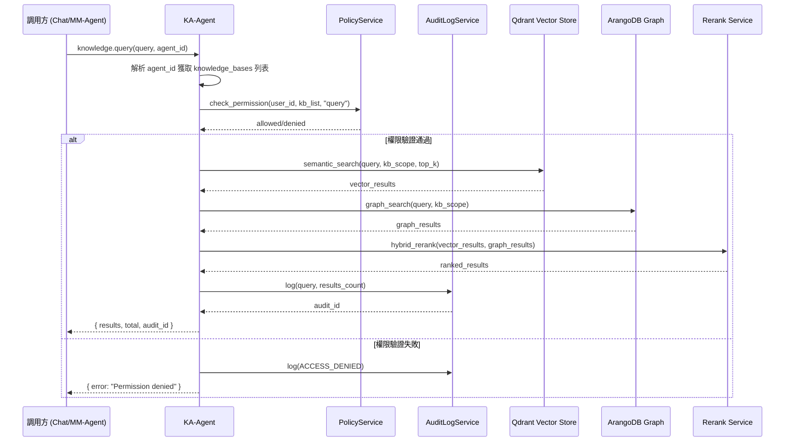

# KA-Agent (Knowledge Architect Agent) 工程級規格書 v2.0

> **文件狀態**: 工程開發實施指南  
> **文檔版本**: v2.0.0  
> **最後更新**: 2026-02-13 10:00 UTC+8  
> **維護人**: Daniel Chung  
> **對齊系統**: AI-Box Knowledge Base Management v2.0

---

## 1. 系統定位與架構對齊

### 1.1 核心定位

KA-Agent（Knowledge Architect Agent）是 **AI-Box 知識服務層（Knowledge Service Layer）** 的核心執行體，負責將「物理存儲（SeaweedFS/Qdrant/ArangoDB）」與「邏輯知識（Knowledge Base）」進行解耦與封裝。

### 1.2 設計原則

- **Knowledge is not memory**：知識是平台級資產，不屬於任何單一 Agent。
- **Assets over documents**：以 Knowledge Base 為治理單位，而非原始文件。
- **Governance before retrieval**：所有檢索操作必須先通過安全審計。
- **Contracts over coupling**：透過 MCP 契約介面，而非直接耦合。
- **Unified Retrieval**：所有 Agent（Chat、MM-Agent 等）統一通過 KA-Agent 進行知識檢索。

### 1.3 與 Knowledge Base v2.0 的整合方式

**架構變更**：
- **v1.x**：Knowledge Asset（KA）+ KNW-Code 編碼 + 獨立 collection
- **v2.0**：Knowledge Base → Folder → File，使用現有 `file_metadata` 結構

| 維度 | v1.x 架構 | v2.0 架構 |
|------|-----------|-----------|
| **知識單位** | KA（Knowledge Asset） | Knowledge Base → Folder → File |
| **分類方式** | Domain / Major / Ontology | Knowledge Base（用戶創建）+ Domain / Major |
| **狀態管理** | lifecycle_state | hasS3 / vectorCount / kgStatus |
| **Agent 關聯** | 無直接關聯 | Agent 配置關聯 `knowledge_bases` |

### 1.4 數據模型映射

| 新架構（v2.0） | KA-Agent 內部映射 |
|----------------|-------------------|
| Knowledge Base | 知識域（Knowledge Domain） |
| Folder | 文件分組 |
| File | 知識載體（替代原 KA） |
| hasS3 + vectorCount > 0 | 相當於 `Active` 狀態 |
| Domain / Major | 沿用 Ontology 對齊 |

---

## 2. KA-Agent 核心職責（v2.0）

### 2.1 職責範圍

| 職責 | 說明 | 實作狀態 |
|------|------|----------|
| **Knowledge Retrieval** | 統一知識檢索入口，供所有 Agent 調用 | 待開發 |
| **Security Enforcement & Audit** | 安全審計、Policy 驗證、存取控制 | 沿用 |
| **Knowledge Provenance** | 來源追溯、可信度提示 | 沿用 |
| **Ontology Alignment** | Domain / Major 對齊 | 沿用 |
| **Ingestion** | 改由 Knowledge Base 管理，前端直接上傳 | 已變更 |

### 2.2 職責說明

#### 2.2.1 Knowledge Retrieval（知識檢索）

**核心功能**：
- 作為統一入口，接受所有 Agent（Chat、MM-Agent 等）的檢索請求
- 根據 Agent 配置的 `knowledge_bases` 列表進行範圍限定
- 執行混合檢索（向量 + 圖譜）
- 返回結構化檢索結果

**接口**：`ka.retrieve`、`knowledge.query`

#### 2.2.2 Security Enforcement & Audit（安全審計）

**核心功能**：
- 驗證呼叫者身份與 MCP capability
- 驗證 Knowledge Base 存取權限與 domain 隔離
- 記錄審計軌跡（查詢時間、來源、結果數量）

**接口**：`PolicyService`、`AuditLogService`

#### 2.2.3 Knowledge Provenance（來源追溯）

**核心功能**：
- 維護檢索結果的來源文件資訊
- 提供可信度提示（freshness、confidence）

#### 2.2.4 Ontology Alignment（Ontology 對齊）

**核心功能**：
- 沿用現有 `OntologySelector` 進行 Domain / Major 對齊
- 支援文件上傳時的自動 Ontology 選擇

---

## 3. 知識庫數據模型（v2.0）

### 3.1 核心結構

```
Knowledge Base（頂層容器）
├── Folder（分類資料夾）
│   └── File（知識載體）
│       ├── file_metadata（核心元數據）
│       ├── vector_storage（Qdrant）
│       └── knowledge_graph（ArangoDB）
```

### 3.2 file_metadata 關鍵欄位（v2.0）

```python
class FileMetadata:
    _key: str                      # file_id
    filename: str
    file_type: str
    storage_path: str              # SeaweedFS S3 路徑
    user_id: str
    task_id: str                   # kb_{folder_id}
    folder_id: str                 # 關聯 Knowledge Base Folder
    status: str                   # uploading/processing/completed/failed/deleted

    # v2.0 新增欄位
    hasS3: bool                   # 是否已存儲到 S3
    vectorCount: int              # 向量數量
    kgStatus: str                # pending/processing/completed/failed

    # Ontology 對齊欄位（沿用）
    domain: Optional[str]         # 知識領域
    major: Optional[str]         # 專業層
    knw_code: Optional[str]      # 檔案編碼（KNW-Code）

    # 生命週期欄位
    lifecycle_state: str         # Draft / Active / Deprecated / Archived
```

### 3.3 Knowledge Base API 端點

| 端點 | 方法 | 功能 |
|------|------|------|
| `/api/v1/knowledge-bases` | GET | 列出所有 Knowledge Base |
| `/api/v1/knowledge-bases` | POST | 創建 Knowledge Base |
| `/api/v1/knowledge-bases/{kb_id}` | GET | 獲取 Knowledge Base 詳情 |
| `/api/v1/knowledge-bases/{kb_id}/folders` | GET | 列出 Folder |
| `/api/v1/knowledge-bases/folders/{folder_id}/files` | GET | 列出 File |
| `/api/v1/files/v2/upload` | POST | 上傳文件（自動關聯 Folder） |

---

## 4. Agent 配置整合

### 4.1 Agent 配置結構

```python
class AgentConfig:
    id: str                       # agent_id（如 "mm-agent"）
    knowledge_bases: list[str]    # 關聯的 Knowledge Base ID 列表
    # ... 其他欄位
```

### 4.2 配置示例

```json
{
  "id": "mm-agent",
  "name": { "zh_TW": "經寶物料管理代理" },
  "knowledge_bases": [
    "kb_material_001",
    "kb_inventory_002"
  ],
  "domain": "domain-manufacture",
  "major": "major-inventory"
}
```

### 4.3 查詢 Agent 配置的 Knowledge Base

```python
async def get_agent_knowledge_bases(agent_id: str) -> list[str]:
    """
    獲取 Agent 配置的 Knowledge Base 列表
    """
    store = AgentDisplayConfigStoreService()
    agent_config = store.get_agent_config(agent_id)
    return agent_config.knowledge_bases or []
```

---

## 5. KA-Agent MCP 接口規範（v2.0）

### 5.1 接口總覽

| 接口 | 方法 | 調用方 | 說明 |
|------|------|--------|------|
| `knowledge.query` | POST | Chat, MM-Agent | 混合檢索 |
| `ka.list` | GET | Chat, MM-Agent | 列出知識庫 |
| `ka.stats` | GET | Chat, MM-Agent | 統計文件數量 |
| `ka.retrieve` | POST | Chat, MM-Agent | 從指定 KB 檢索 |

### 5.2 `knowledge.query` 接口

**功能**：執行混合檢索（向量 + 圖譜）

**請求格式**：
```json
{
  "request_id": "req_xxx",
  "query": "物料庫存數量",
  "agent_id": "mm-agent",
  "user_id": "user_123",
  "session_id": "sess_xxx",
  "options": {
    "kb_scope": ["kb_material_001"],     // 可選，默認使用 agent 配置
    "top_k": 10,
    "query_type": "hybrid",              // semantic / graph / hybrid
    "include_graph": true
  }
}
```

**響應格式**：
```json
{
  "request_id": "req_xxx",
  "success": true,
  "results": [
    {
      "file_id": "file_xxx",
      "filename": "庫存管理手冊.pdf",
      "chunk_id": "chunk_001",
      "content": "...",
      "confidence": 0.85,
      "source": "vector",
      "metadata": {
        "domain": "domain-manufacture",
        "major": "major-inventory"
      }
    }
  ],
  "total": 5,
  "query_time_ms": 120,
  "audit_log_id": "audit_xxx"
}
```

### 5.3 `ka.stats` 接口

**功能**：統計 Agent 關聯的 Knowledge Base 文件數量

**請求格式**：
```json
{
  "request_id": "req_xxx",
  "agent_id": "mm-agent",
  "user_id": "user_123"
}
```

**響應格式**：
```json
{
  "request_id": "req_xxx",
  "success": true,
  "knowledge_bases": [
    {
      "kb_id": "kb_material_001",
      "name": "物料管理知識庫",
      "total_files": 15,
      "vectorized_files": 12
    }
  ],
  "total_files": 15,
  "total_vectorized": 12,
  "audit_log_id": "audit_xxx"
}
```

---

## 6. 檢索流程設計

### 6.1 統一檢索流程



### 6.2 檢索流程步驟

| 步驟 | 說明 | 負責元件 |
|------|------|----------|
| 1 | 解析 Agent 配置，獲取 `knowledge_bases` | KA-Agent |
| 2 | Policy 權限驗證 | PolicyService |
| 3 | 轉換 `kb_ids` 為 `folder_ids` | KA-Agent |
| 4 | 向量檢索 | Qdrant |
| 5 | 圖譜檢索 | ArangoDB |
| 6 | 混合排序 | Rerank Service |
| 7 | 審計日誌 | AuditLogService |
| 8 | 返回結果 | KA-Agent |

### 6.3 KB 到存儲的映射

```python
async def resolve_kb_to_storage(
    kb_ids: list[str],
    user_id: str
) -> dict:
    """
    將 Knowledge Base ID 列表解析為存儲查詢範圍

    Returns:
        {
            "folder_ids": ["folder_1", "folder_2"],
            "file_ids": ["file_a", "file_b"],
            "task_ids": ["kb_folder_1", "kb_folder_2"]
        }
    """
    folders = []
    for kb_id in kb_ids:
        kb_response = await client.get(f"/api/v1/knowledge-bases/{kb_id}/folders")
        if kb_response.ok:
            folders.extend(kb_response.data.items)

    folder_ids = [f.id for f in folders]
    task_ids = [f"kb_{fid}" for fid in folder_ids]

    return {
        "folder_ids": folder_ids,
        "task_ids": task_ids,
        "kb_info": [
            {"kb_id": kb_id, "folders": [f.id for f in folders]}
            for kb_id in kb_ids
        ]
    }
```

---

## 7. 安全審計設計

### 7.1 審計事件類型

| 事件類型 | 說明 | 記錄欄位 |
|----------|------|----------|
| `KNOWLEDGE_QUERY` | 知識庫查詢 | request_id, user_id, agent_id, query, result_count |
| `KNOWLEDGE_ACCESS_DENIED` | 權限拒絕 | request_id, user_id, agent_id, kb_ids, reason |
| `KNOWLEDGE_STATS_REQUESTED` | 統計請求 | request_id, user_id, agent_id |

### 7.2 Policy 檢查

```python
async def check_kb_permission(
    user_id: str,
    kb_ids: list[str],
    action: str
) -> dict:
    """
    檢查用戶對 Knowledge Base 的存取權限

    Returns:
        {
            "allowed": bool,
            "denied_kbs": list[str],  # 被拒絕的 KB
            "reason": str
        }
    """
    # 1. 檢查用戶是否為 KB 擁有者
    # 2. 檢查組織/租戶權限
    # 3. 檢查 Agent 是否有權限使用該 KB
    pass
```

---

## 8. 與其他 Agent 的整合

### 8.1 Chat 整合

```python
# api/routers/chat.py

async def handle_chat_with_knowledge(
    request: ChatRequest,
    selected_agent_id: str
) -> ChatResponse:
    """
    Chat 調用知識庫的入口點
    """
    # 1. 檢測是否為知識庫查詢
    if _is_knowledge_base_query(request.message):
        # 2. 獲取 Agent 配置的 Knowledge Base
        kb_ids = await get_agent_knowledge_bases(selected_agent_id)

        # 3. 調用 KA-Agent
        result = await ka_agent_client.query(
            query=request.message,
            agent_id=selected_agent_id,
            user_id=request.user_id,
            kb_scope=kb_ids
        )

        # 4. 返回結果
        return format_kb_response(result)

    # 5. 非知識庫查詢，繼續正常流程
    return await handle_normal_chat(request)
```

### 8.2 MM-Agent 整合

```python
# datalake-system/mm_agent/agent.py

async def execute(
    self,
    request: AgentServiceRequest,
) -> AgentServiceResponse:
    """
    MM-Agent 執行入口
    """
    user_instruction = request.task_data.get("instruction", "")

    # 1. 檢測是否為知識庫查詢
    if _is_knowledge_base_query(user_instruction):
        # 2. 獲取 Agent 配置的 Knowledge Base
        kb_ids = await get_agent_knowledge_bases("mm-agent")

        # 3. 調用 KA-Agent 進行檢索
        result = await ka_agent_client.query(
            query=user_instruction,
            agent_id="mm-agent",
            user_id=request.metadata.get("user_id"),
            kb_scope=kb_ids
        )

        return format_kb_response(result)

    # 4. 非知識庫查詢，執行正常 MM-Agent 邏輯
    return await self._execute_normal_flow(request)
```

---

## 9. 開發路線圖（v2.0）

### Phase 1: 基礎設施（2 天）

| 項次 | 任務 | 負責 | 狀態 | 預估工時 |
|------|------|------|------|----------|
| 1.1 | Agent 配置添加 `knowledge_bases` 欄位 | Backend | 待開發 | 4h |
| 1.2 | 知識庫列表 API（`GET /api/v1/knowledge-bases`） | Backend | 待開發 | 4h |
| 1.3 | 文件列表 API（`GET /api/v1/knowledge-bases/folders/{id}/files`） | Backend | 已開發 | 0h |
| 1.4 | 前端 Agent 編輯 Modal 知識庫選擇 UI | Frontend | 已開發 | 0h |

### Phase 2: KA-Agent 檢索接口（3 天）

| 項次 | 任務 | 負責 | 狀態 | 預估工時 |
|------|------|------|------|----------|
| 2.1 | `knowledge.query` 接口開發 | Backend | 待開發 | 8h |
| 2.2 | `ka.stats` 接口開發 | Backend | 待開發 | 4h |
| 2.3 | Policy 權限檢查整合 | Backend | 待開發 | 4h |
| 2.4 | Audit Log 整合 | Backend | 待開發 | 2h |

### Phase 3: Chat 整合（2 天）

| 項次 | 任務 | 負責 | 狀態 | 預估工時 |
|------|------|------|------|----------|
| 3.1 | Chat 知識庫查詢檢測 | Backend | 待開發 | 4h |
| 3.2 | Chat 調用 KA-Agent | Backend | 待開發 | 4h |
| 3.3 | 前端響應格式化 | Frontend | 待開發 | 4h |

### Phase 4: MM-Agent 整合（2 天）

| 項次 | 任務 | 負責 | 狀態 | 預估工時 |
|------|------|------|------|----------|
| 4.1 | MM-Agent 知識庫查詢檢測 | Backend | 待開發 | 4h |
| 4.2 | MM-Agent 調用 KA-Agent | Backend | 待開發 | 4h |

### Phase 5: 測試與優化（2 天）

| 項次 | 任務 | 負責 | 狀態 | 預估工時 |
|------|------|------|------|----------|
| 5.1 | 單元測試 | QA | 待開發 | 8h |
| 5.2 | 集成測試 | QA | 待開發 | 8h |
| 5.3 | 性能優化 | Backend | 待開發 | 4h |

---

## 10. API 端點完整列表

### 10.1 Knowledge Base API

| 端點 | 方法 | 功能 |
|------|------|------|
| `/api/v1/knowledge-bases` | GET | 列出所有 Knowledge Base |
| `/api/v1/knowledge-bases` | POST | 創建 Knowledge Base |
| `/api/v1/knowledge-bases/{kb_id}` | GET | 獲取 Knowledge Base 詳情 |
| `/api/v1/knowledge-bases/{kb_id}` | PUT | 更新 Knowledge Base |
| `/api/v1/knowledge-bases/{kb_id}` | DELETE | 刪除 Knowledge Base |
| `/api/v1/knowledge-bases/{kb_id}/folders` | GET | 列出 Folder |
| `/api/v1/knowledge-bases/folders/{folder_id}` | GET | 獲取 Folder 詳情 |
| `/api/v1/knowledge-bases/folders/{folder_id}` | PUT | 更新 Folder |
| `/api/v1/knowledge-bases/folders/{folder_id}` | DELETE | 刪除 Folder |
| `/api/v1/knowledge-bases/folders/{folder_id}/files` | GET | 列出 File |

### 10.2 KA-Agent MCP 接口

| 接口 | 方法 | 功能 |
|------|------|------|
| `/mcp/knowledge/query` | POST | 混合檢索 |
| `/mcp/ka/list` | GET | 列出 Agent 關聯的 Knowledge Base |
| `/mcp/ka/stats` | GET | 統計 Knowledge Base 文件數量 |

---

## 11. 更新記錄

| 日期 | 版本 | 更新內容 | 更新人 |
|------|------|----------|--------|
| 2026-02-13 | v2.0.0 | 新版架構：整合 Knowledge Base v2.0、Agent 配置關聯、統一檢索入口 | Daniel Chung |
| 2026-01-25 | v1.5.8 | 補充編碼服務實作細節 | Daniel Chung |

---

## 附錄 A：術語表

| 術語 | 說明 |
|------|------|
| Knowledge Base | 知識庫（v2.0 頂層容器） |
| Folder | 知識庫中的分類資料夾 |
| File | 知識載體，對應 file_metadata |
| KA | Knowledge Asset（v1.x 術語，v2.0 中 File 替代） |
| KNW-Code | 檔案編碼，格式：`KNW-{DOMAIN}-{TYPE}-...` |
| MCP | Model Context Protocol |
| BPA | Business Process Agent |

---

**文件版本**: v2.0.0  
**最後更新**: 2026-02-13 10:00 UTC+8  
**維護人**: Daniel Chung
