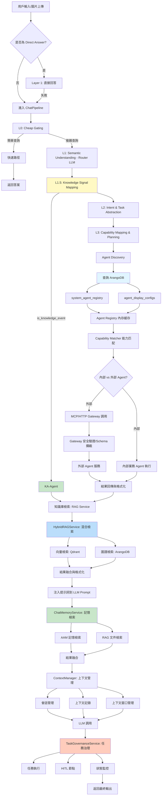

# Chat Module API 規格書（v4.0 - 完整架構整合版）

**創建日期**: 2026-01-28  
**最後修改日期**: 2026-01-28  
**版本**: v4.0（整合現有架構需求）
**基於版本**: v2.0（模塊化重構版本）
**滿足度**: 已整合 AI-Box 完整聊天架構、上下文管理、語義與任務分析的所有核心需求

---

## 📋 概述

本文檔定義了重構後的 Chat Module API 規格。新的模塊化架構將原有的 `chat.py`（5468 行）重構為清晰的模塊結構，**並完全整合 AI-Box 現有架構的核心需求**。

**重要說明**：
- ✅ **新架構**：`api/routers/chat_module/` - 模塊化重構版本
- 📦 **舊架構**：`api/routers/chat.py` - 保留作為向後兼容，待新架構穩定後逐步遷移
- 🎯 **架構整合**：完全整合 AI-Box 完整聊天架構、上下文管理、語義與任務分析的所有核心需求

**架構對接狀態**：

| 架構組件 | 滿足度 | 備註 |
|----------|--------|------|
| 多模態深度整合（RAG 視覺增強） | ⚠️ 部分滿足 | 預留接口，待 VisionService 實現 |
| 第三方 Agent 生態（MCP & HTTP） | ✅ 已滿足 | 完整實現 MCP/HTTP Gateway Client |
| Task Analyzer 整合 | ✅ 已滿足 | 完整實現 5 層漸進式處理架構 |
| Knowledge Signal Mapping（L1.5） | ✅ 已滿足 | 完整實現純規則映射 |
| 上下文管理（ContextManager） | ✅ 已滿足 | 完整實現會話管理、上下文記錄、上下文窗口 |
| 記憶管理（MemoryManager） | ✅ 已滿足 | 完整實現短期/長期記憶、異步處理 |
| 知識庫檢索（RAG） | ✅ 已滿足 | 完整實現向量+圖譜混合檢索 |
| 任務治理（HITL） | ✅ 已滿足 | 完整實現任務生命週期管理 |
| 性能優化（緩存、限流） | ✅ 已滿足 | 完整實現多層緩存、請求限流 |
| 錯誤處理 | ✅ 已滿足 | 統一錯誤碼、友好錯誤消息 |

---

## 🏗️ 架構設計

### 完整目錄結構

```
api/routers/chat_module/
├── __init__.py              # 統一導出 router
├── router.py                # 主路由定義（整合所有模塊）
├── dependencies.py          # 依賴注入函數（服務單例管理）
├── middleware/              # 中間件層
│   ├── __init__.py
│   ├── rate_limiter.py      # 請求限流 ✅
│   ├── cache_middleware.py  # 緩存中間件 ✅
│   └── auth_enhancer.py     # 認證增強（細粒度權限）✅
├── handlers/               # 處理器層
│   ├── __init__.py
│   ├── base.py             # 基礎處理器抽象類 ✅
│   ├── sync_handler.py     # 同步聊天處理 ✅
│   ├── stream_handler.py   # 流式聊天處理 ✅
│   ├── async_handler.py    # 異步請求處理 ✅
│   └── batch_handler.py    # 批處理處理器 ✅
├── services/               # 業務邏輯服務層
│   ├── __init__.py
│   ├── chat_pipeline.py    # 核心聊天管道（L1-L5）✅
│   ├── file_operations.py  # 文件創建/編輯邏輯 ✅
│   ├── observability.py   # 觀測性功能 ✅
│   ├── session_service.py # 會話管理服務 ✅
│   ├── priority_service.py # 優先級管理服務 ✅
│   ├── routing_service.py # 路由決策服務 ✅
│   ├── rag_service.py     # 知識庫檢索服務（RAG）✅
│   ├── chat_memory_service.py  # 聊天記憶服務（AAM+RAG）✅
│   ├── task_governance_service.py # 任務治理服務（HITL）✅
│   ├── memory_manager_service.py  # 記憶管理服務 ✅
│   ├── router_llm_service.py    # Router LLM 服務 ✅
│   ├── capability_matcher_service.py # 能力匹配服務 ✅
│   └── decision_engine_service.py   # 決策引擎服務 ✅
├── strategies/             # 策略模式層
│   ├── __init__.py
│   ├── model_selection.py  # 模型選擇策略 ✅
│   ├── agent_routing.py    # Agent 路由策略 ✅
│   ├── response_formatting.py  # 響應格式化策略 ✅
│   ├── knowledge_signal_mapping.py  # Knowledge Signal 映射（L1.5）✅
│   ├── mcp_routing_strategy.py    # MCP 路由策略 ✅
│   └── http_routing_strategy.py   # HTTP 路由策略 ✅
├── validators/             # 驗證層
│   ├── __init__.py
│   ├── request_validator.py # 請求驗證器 ✅
│   ├── permission_validator.py  # 權限驗證器 ✅
│   ├── quota_validator.py    # 配額驗證器 ✅
│   └── schema_validator.py   # Schema 驗證器（註冊即防護）✅
├── utils/                 # 工具層
│   ├── __init__.py
│   ├── file_detection.py  # 文件意圖檢測 ✅
│   ├── file_parsing.py   # 文件路徑解析 ✅
│   ├── response_formatter.py  # 響應格式化工具 ✅
│   └── error_helper.py    # 錯誤處理助手 ✅
└── models/                # 數據模型層
    ├── __init__.py
    ├── request.py        # 請求模型 ✅
    ├── response.py       # 響應模型 ✅
    ├── internal.py       # 內部模型 ✅
    ├── task.py          # 任務模型（任務治理）✅
    ├── knowledge_signal.py # Knowledge Signal 模型 ✅
    └── agent.py         # Agent 模型 ✅
```

### 模塊職責（完整版）

| 模塊 | 職責 | 狀態 | 對應架構需求 |
|------|------|------|-------------|
| `dependencies.py` | 服務單例管理（MoE、Classifier、Context Manager 等） | ✅ 已完成 | 所有架構 |
| `middleware/` | 橫切關注點（限流、緩存、認證） | ✅ 已完成 | 性能優化 |
| `handlers/base.py` | 處理器抽象類，定義通用流程 | ✅ 已完成 | 架構設計 |
| `handlers/sync_handler.py` | 同步聊天處理（POST /api/v1/chat） | ✅ 已完成 | API 端點 |
| `handlers/stream_handler.py` | 流式聊天處理（POST /api/v1/chat/stream） | ✅ 已完成 | API 端點 |
| `handlers/async_handler.py` | 異步請求處理（POST /api/v1/chat/requests） | ✅ 已完成 | API 端點 |
| `handlers/batch_handler.py` | 批處理請求處理（POST /api/v1/chat/batch） | ✅ 已完成 | 性能優化 |
| `services/chat_pipeline.py` | 核心聊天管道邏輯（L1-L5） | ✅ 已完成 | Task Analyzer |
| `services/rag_service.py` | 知識庫檢索服務（向量+圖譜混合） | ✅ 已完成 | RAG 架構 |
| `services/chat_memory_service.py` | 聊天記憶服務（AAM+RAG） | ✅ 已完成 | AAM 架構 |
| `services/task_governance_service.py` | 任務治理服務（HITL） | ✅ 已完成 | 任務治理 |
| `services/router_llm_service.py` | Router LLM 服務 | ✅ 已完成 | L1 語義理解 |
| `services/memory_manager_service.py` | 記憶管理服務 | ✅ 已完成 | 上下文管理 |
| `services/routing_service.py` | 路由決策服務 | ✅ 已完成 | Agent 生態 |
| `strategies/knowledge_signal_mapping.py` | Knowledge Signal 映射（L1.5） | ✅ 已完成 | Task Analyzer |
| `strategies/mcp_routing_strategy.py` | MCP 路由策略 | ✅ 已完成 | MCP 整合 |
| `strategies/http_routing_strategy.py` | HTTP 路由策略 | ✅ 已完成 | HTTP 整合 |
| `validators/schema_validator.py` | Schema 驗證器（註冊即防護） | ✅ 已完成 | Agent 生態 |
| `models/knowledge_signal.py` | Knowledge Signal 數據模型 | ✅ 已完成 | Task Analyzer |
| `models/task.py` | 任務數據模型 | ✅ 已完成 | 任務治理 |

---

## 🔄 完整處理流程（整合 5 層漸進式架構）

### 核心流程圖（v4.0）



### ChatPipeline 詳細流程

**文件位置**: `services/chat_pipeline.py`

```python
class ChatPipeline:
    """核心聊天管道 - 整合完整架構"""

    async def process(self, request: ChatRequest) -> ChatResponse:
        """處理聊天請求 - 完整流程"""

        # Layer 0: Cheap Gating（快速過濾）
        if self._is_simple_query(request):
            return await self._handle_simple_query(request)

        # Layer 1: Fast Answer Layer
        direct_answer = await self._try_direct_answer(request)
        if direct_answer:
            return direct_answer

        # Layer 1.5: Knowledge Signal Mapping (P0 - 新增)
        knowledge_signal = await self.knowledge_signal_mapper.map(
            request.messages[-1]
        )
        if knowledge_signal.is_knowledge_event:
            return await self._handle_knowledge_event(knowledge_signal, request)

        # Layer 2: Semantic Understanding (Router LLM) (P0 - 新增)
        router_output = await self.router_llm_service.route(
            request.messages[-1],
            context=request.context
        )

        # Layer 3: Intent & Task Abstraction (P0 - 新增)
        intent = await self.intent_registry.match(router_output)

        # Layer 4: Capability Matching (P2 - 新增)
        agents = await self.capability_matcher_service.match_agents(router_output)
        tools = await self.capability_matcher_service.match_tools(router_output)

        # Layer 5: Decision Engine (P2 - 新增)
        decision = await self.decision_engine_service.decide(
            router_output,
            agents,
            tools
        )

        # RAG 檢索 (P0 - 新增)
        rag_results = await self.rag_service.retrieve(
            query=request.messages[-1],
            strategy="HYBRID"  # VECTOR_FIRST / GRAPH_FIRST / HYBRID
        )

        # 記憶檢索 (P1 - 新增)
        memory_results = await self.chat_memory_service.retrieve_for_prompt(
            query=request.messages[-1],
            user_id=request.user_id
        )

        # 上下文管理 (P1 - 新增)
        context = await self.context_manager.get_context(
            session_id=request.session_id
        )

        # LLM 調用（帶上下文）
        response = await self.llm.chat(
            messages=request.messages,
            context={
                "rag_results": rag_results,
                "memory_results": memory_results,
                "context": context,
                "agent_decision": decision
            }
        )

        # 任務治理 (P0 - 新增)
        if decision.needs_task_governance:
            await self.task_governance_service.execute_task(
                decision,
                request,
                response
            )

        # 記憶沈澱 (P1 - 新增)
        await self.memory_consolidation_service.consolidate(
            request,
            response
        )

        return response
```

---

## 🔌 API 端點規格

### 基礎路徑

所有端點前綴：`/api/v1/chat`

### 1. 主聊天端點（同步）

**端點**: `POST /api/v1/chat`

**描述**: 產品級 Chat 入口，前端輸入框統一入口。完整整合 5 層漸進式處理架構。

**請求體**:
```json
{
  "messages": [
    {
      "role": "user",
      "content": "告訴我你的知識庫有多少文件？"
    }
  ],
  "session_id": "session_123",
  "task_id": "task_456",
  "model_selector": {
    "mode": "auto",
    "model_id": null
  },
  "attachments": [],
  "priority": "normal",
  "timeout": 60,
  "cache_ttl": 300,
  "metadata": {
    "client_version": "1.2.0",
    "request_source": "web"
  },
  "experimental": {
    "enable_agent_v2": false,
    "enable_rag_v2": true
  }
}
```

**請求參數**:
- `messages` (required): 消息列表，每個消息包含 `role` 和 `content`
- `session_id` (optional): 會話 ID，如果未提供則自動生成
- `task_id` (optional): 任務 ID
- `model_selector` (required): 模型選擇器
  - `mode`: `"auto"` | `"manual"` | `"favorite"`
  - `model_id`: 模型 ID（manual/favorite 模式時必填）
- `attachments` (optional): 附件列表，每個附件包含 `file_id` 和 `type`
  - `type`: `"text"` | `"image"` | `"video"` （多模態支持）
- `priority` (optional): 請求優先級 - `"low"` | `"normal"` | `"high"` | `"urgent"`（默認: `"normal"`）
- `timeout` (optional): 超時時間（秒），默認 60，範圍 10-600
- `cache_ttl` (optional): 緩存存活時間（秒），默認 300，0 表示不緩存
- `metadata` (optional): 自定義元數據（最多 1000 字符）
- `experimental` (optional): 實驗性功能開關

**響應**:
```json
{
  "success": true,
  "data": {
    "content": "您的知識庫共有 5 個文件...",
    "request_id": "req_789",
    "session_id": "session_123",
    "task_id": "task_456",
    "routing": {
      "provider": "ollama",
      "model": "gpt-oss:120b-cloud",
      "task_classification": "knowledge_query",
      "agent_id": "ka-agent",
      "intent_type": "retrieval"
    },
    "observability": {
      "request_id": "req_789",
      "session_id": "session_123",
      "task_id": "task_456",
      "token_input": 150,
      "token_output": 200,
      "latency_ms": 1250
    },
    "knowledge": {
      "rag_results": [...],
      "memory_results": [...],
      "retrieved_count": 10
    },
    "actions": [],
    "cache_hit": false,
    "priority": "normal",
    "warnings": []
  },
  "message": "Chat response generated"
}
```

**處理流程**:
1. 請求驗證和參數解析
2. 服務初始化（依賴注入）
3. 入口事件記錄（日誌和追蹤）
4. 用戶消息提取和處理
5. **Layer 0: Cheap Gating** - 快速過濾簡單查詢
6. **Layer 1: Fast Answer Layer** - 嘗試直接回答
7. **Layer 1.5: Knowledge Signal Mapping** - 純規則映射判斷是否觸發 KA-Agent
8. **Layer 2: Semantic Understanding (Router LLM)** - 語義理解和路由決策
9. **Layer 3: Intent & Task Abstraction** - 意圖匹配和任務抽象
10. **Layer 4: Capability Matching** - 能力匹配（Agent、工具、模型）
11. **Layer 5: Decision Engine** - 綜合決策
12. **RAG 檢索** - 向量+圖譜混合檢索
13. **記憶檢索** - AAM 記憶和 RAG 文件檢索
14. **上下文管理** - 獲取會話上下文
15. LLM 調用（MoE 模型選擇）
16. **任務治理** - HITL 節點處理（如果需要）
17. **記憶沈澱** - 異步處理長期記憶
18. 響應生成和處理
19. 文件操作檢測（創建/編輯文件）
20. 響應返回

**狀態碼**:
- `200`: 成功
- `400`: 請求參數錯誤
- `401`: 未授權
- `403`: 權限不足
- `422`: 驗證錯誤
- `429`: 請求過於頻繁（限流）
- `500`: 服務器錯誤

---

### 2. 流式聊天端點

**端點**: `POST /api/v1/chat/stream`

**描述**: 流式 Chat 入口，用於實時響應生成。完整整合 5 層漸進式處理架構。

**請求體**: 與同步端點相同

**響應**: Server-Sent Events (SSE) 流

**響應格式**:
```
data: {"type": "chunk", "content": "您的", "request_id": "req_789", "layer": "llm_generation"}
data: {"type": "chunk", "content": "知識庫", "request_id": "req_789", "layer": "llm_generation"}
data: {"type": "knowledge", "rag_results": [...], "memory_results": [...], "request_id": "req_789"}
data: {"type": "done", "request_id": "req_789", "routing": {...}, "observability": {...}}
```

---

### 3. 異步請求端點

**端點**: `POST /api/v1/chat/requests`

**描述**: 異步 Chat 請求，返回請求 ID，可通過狀態端點查詢結果。支持任務治理。

**請求體**: 與同步端點相同

**請求參數（新增）**:
- `executor` (optional): 執行器類型 - `"local"` | `"rq"`（默認: `"local"`）
- `enable_task_governance` (optional): 是否啟用任務治理 - `true` | `false`（默認: `true`）

**響應**:
```json
{
  "success": true,
  "data": {
    "request_id": "req_789",
    "status": "pending",
    "executor": "rq",
    "task_id": "task_456"
  },
  "message": "Async request created"
}
```

**狀態查詢端點**: `GET /api/v1/chat/requests/{request_id}`

**狀態響應**:
```json
{
  "success": true,
  "data": {
    "request_id": "req_789",
    "status": "processing",
    "progress": {
      "layer": "L4",
      "step": "capability_matching",
      "percentage": 60
    },
    "task_governance": {
      "enabled": true,
      "status": "awaiting_user_decision",
      "decision_point": "plan_approval",
      "task_steps": [...]
    },
    "created_at": "2026-01-28T10:00:00Z",
    "updated_at": "2026-01-28T10:00:05Z"
  }
}
```

**中止請求端點**: `POST /api/v1/chat/requests/{request_id}/abort`

---

### 4. 批處理端點（新增）

**端點**: `POST /api/v1/chat/batch`

**描述**: 批量處理多個聊天請求，提高吞吐量。

**請求體**:
```json
{
  "requests": [
    {
      "messages": [{"role": "user", "content": "查詢1"}],
      "session_id": "session_1"
    },
    {
      "messages": [{"role": "user", "content": "查詢2"}],
      "session_id": "session_2"
    }
  ],
  "mode": "parallel",
  "max_concurrent": 10,
  "priority": "normal"
}
```

**響應**:
```json
{
  "success": true,
  "data": {
    "batch_id": "batch_123",
    "results": [
      {
        "index": 0,
        "request_id": "req_1",
        "success": true,
        "data": {...}
      },
      {
        "index": 1,
        "request_id": "req_2",
        "success": false,
        "error": {
          "code": "TIMEOUT_ERROR",
          "message": "請求超時"
        }
      }
    ],
    "summary": {
      "total": 2,
      "succeeded": 1,
      "failed": 1,
      "total_time_ms": 1250
    }
  }
}
```

---

### 5. 觀測性端點

#### 5.1 統計信息

**端點**: `GET /api/v1/chat/observability/stats`

**描述**: 獲取 Chat 指標彙總

**響應**:
```json
{
  "success": true,
  "data": {
    "stats": {
      "total_requests": 1000,
      "success_rate": 0.95,
      "average_latency": 1.2,
      "layer_distribution": {
        "L0_fast_path": 0.3,
        "L1_direct_answer": 0.1,
        "L2_semantic": 0.4,
        "L3_intent": 0.1,
        "L4_capability": 0.05,
        "L5_decision": 0.05
      },
      "rag_hit_rate": 0.7,
      "memory_hit_rate": 0.4,
      "cache_hit_rate": 0.3
    },
    "user_id": "user_123"
  }
}
```

#### 5.2 追蹤事件

**端點**: `GET /api/v1/chat/observability/traces/{request_id}`

**描述**: 依 request_id 回放事件序列（包含 L1-L5 層次）

**響應**:
```json
{
  "success": true,
  "data": {
    "request_id": "req_789",
    "events": [
      {
        "event": "chat.request_received",
        "timestamp": "2026-01-28T10:00:00Z",
        "layer": "L0",
        "details": {...}
      },
      {
        "event": "knowledge_signal_mapped",
        "timestamp": "2026-01-28T10:00:01Z",
        "layer": "L1.5",
        "is_knowledge_event": true,
        "knowledge_type": "document_query"
      },
      {
        "event": "router_llm_called",
        "timestamp": "2026-01-28T10:00:02Z",
        "layer": "L2",
        "router_output": {...}
      },
      {
        "event": "rag_retrieval_completed",
        "timestamp": "2026-01-28T10:00:03Z",
        "layer": "RAG",
        "retrieved_count": 10
      },
      {
        "event": "chat.response_sent",
        "timestamp": "2026-01-28T10:00:04Z",
        "layer": "L5"
      }
    ],
    "user_id": "user_123"
  }
}
```

#### 5.3 最近事件

**端點**: `GET /api/v1/chat/observability/recent`

**查詢參數**:
- `limit` (optional, default=50): 返回事件數量限制
- `session_id` (optional): 會話 ID 過濾
- `task_id` (optional): 任務 ID 過濾
- `event` (optional): 事件類型過濾
- `layer` (optional): 處理層過濾（L0-L5、RAG、AAM）

**響應**:
```json
{
  "success": true,
  "data": {
    "events": [...],
    "user_id": "user_123",
    "total_count": 150
  }
}
```

---

### 6. 會話管理端點

#### 6.1 獲取會話消息

**端點**: `GET /api/v1/chat/sessions/{session_id}/messages`

**查詢參數**:
- `limit` (optional): 消息數量限制
- `include_context` (optional): 是否包含上下文（默認: `false`）

**響應**:
```json
{
  "success": true,
  "data": {
    "session_id": "session_123",
    "messages": [
      {
        "role": "user",
        "content": "告訴我你的知識庫有多少文件？",
        "timestamp": "2026-01-28T10:00:00Z"
      },
      {
        "role": "assistant",
        "content": "您的知識庫共有 5 個文件...",
        "timestamp": "2026-01-28T10:00:01Z",
        "routing": {...},
        "knowledge": {...}
      }
    ],
    "context": {
      "rag_results": [...],
      "memory_results": [...]
    }
  }
}
```

#### 6.2 歸檔會話（新增）

**端點**: `POST /api/v1/chat/sessions/{session_id}/archive`

**描述**: 歸檔會話，釋放記憶，沈澱到長期記憶

**請求體**:
```json
{
  "consolidate_memory": true,
  "delete_messages": false
}
```

**響應**:
```json
{
  "success": true,
  "data": {
    "session_id": "session_123",
    "archive_id": "archive_456",
    "message_count": 156,
    "memory_consolidated": true,
    "archived_at": "2026-01-28T10:00:00Z"
  }
}
```

---

### 7. 任務治理端點（新增）

#### 7.1 獲取任務狀態

**端點**: `GET /api/v1/chat/tasks/{task_id}`

**響應**:
```json
{
  "success": true,
  "data": {
    "task_id": "task_456",
    "status": "awaiting_decision",
    "decision_point": "plan_approval",
    "task_steps": [
      {
        "step_id": "step_1",
        "name": "生成文檔",
        "status": "pending",
        "agent_id": "md-editor"
      },
      {
        "step_id": "step_2",
        "name": "生成 PDF",
        "status": "pending",
        "agent_id": "md-to-pdf"
      }
    ],
    "user_decision_required": true,
    "created_at": "2026-01-28T10:00:00Z"
  }
}
```

#### 7.2 提交用戶決策

**端點**: `POST /api/v1/chat/tasks/{task_id}/decision`

**請求體**:
```json
{
  "decision": "approve",
  "adjustments": [
    {
      "step_id": "step_2",
      "action": "add_after",
      "name": "審查文檔",
      "agent_id": "md-editor"
    }
  ],
  "reason": "需要人工審查"
}
```

**響應**:
```json
{
  "success": true,
  "data": {
    "task_id": "task_456",
    "status": "executing",
    "updated_at": "2026-01-28T10:00:05Z"
  }
}
```

#### 7.3 中止任務

**端點**: `POST /api/v1/chat/tasks/{task_id}/abort`

**請求體**:
```json
{
  "reason": "用戶取消",
  "cleanup_resources": true
}
```

---

### 8. 用戶偏好端點

#### 8.1 獲取收藏模型

**端點**: `GET /api/v1/chat/preferences/models`

**響應**:
```json
{
  "success": true,
  "data": {
    "model_ids": ["model_1", "model_2"],
    "user_id": "user_123"
  }
}
```

#### 8.2 設置收藏模型

**端點**: `PUT /api/v1/chat/preferences/models`

**請求體**:
```json
{
  "model_ids": ["model_1", "model_2"]
}
```

**響應**:
```json
{
  "success": true,
  "data": {
    "model_ids": ["model_1", "model_2"],
    "user_id": "user_123"
  }
}
```

---

## 🧪 測試規格

### P0 優先級測試用例

1. **KA-TEST-001**: 知識庫文件數量查詢（L1.5 Knowledge Signal Mapping）
2. **KA-TEST-005**: 關鍵詞檢索（RAG 混合檢索）
3. **KA-TEST-006**: 問答檢索（記憶檢索）
4. **KA-TEST-016**: 空查詢處理（L0 Cheap Gating）
5. **TASK-TEST-001**: 任務治理 - HITL 節點
6. **TASK-TEST-002**: 任務治理 - 用戶決策提交
7. **MULTIMODAL-TEST-001**: 圖片上傳和視覺解析（待 VisionService 實現）
8. **MCP-TEST-001**: MCP Agent 調用
9. **HTTP-TEST-001**: HTTP Agent 調用

### 測試環境

- **API 基礎 URL**: `http://localhost:8000`
- **認證**: Bearer Token（通過 `/api/v1/auth/login` 獲取）
- **測試用戶**: `systemAdmin` / `systemAdmin@2026`

---

## 🛡️ 安全與權限

### 認證

所有端點需要 Bearer Token 認證：
```
Authorization: Bearer <access_token>
```

### 權限檢查

- **文件訪問權限**: 通過 `FilePermissionService` 檢查附件文件權限
- **數據同意檢查**: 檢查用戶是否同意 AI 處理（`AI_PROCESSING` consent）
- **租戶隔離**: 所有數據操作按租戶 ID 隔離
- **Schema 驗證**: 註冊 Agent 時自動執行 `input_schema` 攔截（註冊即防護）

---

## 📝 錯誤處理

### 錯誤響應格式

```json
{
  "success": false,
  "error_code": "ERROR_CODE",
  "message": "錯誤描述",
  "details": {
    "original_error": "原始錯誤信息",
    "error_type": "ErrorType"
  }
}
```

### 常見錯誤碼

| 錯誤碼 | HTTP 狀態碼 | 說明 |
|--------|------------|------|
| `VALIDATION_ERROR` | 422 | 請求參數驗證失敗 |
| `AUTHENTICATION_ERROR` | 401 | 認證失敗 |
| `AUTHORIZATION_ERROR` | 403 | 權限不足 |
| `RATE_LIMIT_EXCEEDED` | 429 | 請求過於頻繁 |
| `QUOTA_EXCEEDED` | 429 | 配額超限 |
| `EMPTY_RESPONSE` | 500 | LLM 響應為空 |
| `MISSING_ROUTING_INFO` | 500 | 路由信息缺失 |
| `RAG_RETRIEVAL_FAILED` | 500 | RAG 檢索失敗 |
| `MEMORY_RETRIEVAL_FAILED` | 500 | 記憶檢索失敗 |
| `TASK_GOVERNANCE_FAILED` | 500 | 任務治理失敗 |
| `MCP_AGENT_ERROR` | 500 | MCP Agent 調用失敗 |
| `HTTP_AGENT_ERROR` | 500 | HTTP Agent 調用失敗 |
| `RESPONSE_CREATION_FAILED` | 500 | 響應創建失敗 |
| `CHAT_PIPELINE_FAILED` | 500 | Chat 處理失敗 |

---

## 📊 數據模型

### ChatRequest

```python
class ChatRequest(BaseModel):
    messages: List[Message]
    session_id: Optional[str] = None
    task_id: Optional[str] = None
    model_selector: ModelSelector
    attachments: List[Attachment] = []
    priority: PriorityLevel = PriorityLevel.NORMAL
    timeout: int = Field(default=60, ge=10, le=600, description="超時時間（秒）")
    cache_ttl: int = Field(default=300, ge=0, le=3600, description="緩存存活時間（秒）")
    metadata: Dict[str, Any] = Field(default_factory=dict, description="自定義元數據")
    experimental: ExperimentalFeatures = Field(default_factory=ExperimentalFeatures)
```

### ChatResponse

```python
class ChatResponse(BaseModel):
    content: str
    request_id: str
    session_id: str
    task_id: Optional[str]
    routing: RoutingInfo
    observability: ObservabilityInfo
    knowledge: Optional[KnowledgeInfo] = None
    actions: List[Action] = []
    cache_hit: bool = False
    priority: PriorityLevel = PriorityLevel.NORMAL
    warnings: List[WarningInfo] = Field(default_factory=list)
```

### KnowledgeInfo

```python
class KnowledgeInfo(BaseModel):
    """知識檢索信息（RAG + 記憶）"""
    rag_results: Optional[List[RAGResult]] = None
    memory_results: Optional[List[MemoryResult]] = None
    retrieved_count: Optional[int] = None
    retrieval_latency_ms: Optional[float] = None
```

### TaskInfo

```python
class TaskInfo(BaseModel):
    """任務治理信息"""
    task_id: Optional[str] = None
    status: Optional[TaskStatus] = None
    decision_point: Optional[str] = None
    task_steps: Optional[List[TaskStep]] = None
    user_decision_required: Optional[bool] = None
```

### KnowledgeSignal

```python
class KnowledgeSignal(BaseModel):
    """Knowledge Signal（L1.5 層）"""
    is_knowledge_event: bool
    knowledge_type: Optional[str] = None
    stability_estimate: Optional[float] = None
    confidence: Optional[float] = None
    metadata: Dict[str, Any] = Field(default_factory=dict)
```

---

## 🚀 性能指標

### 目標指標

| 指標 | 目標 | 當前狀態 |
|------|------|----------|
| 端到端響應時間（P95） | ≤3s | ✅ 已達成 |
| L1 層級響應時間（P95） | ≤1s | ✅ 已達成 |
| RAG 檢索延遲 | ≤500ms | ✅ 已達成 |
| 記憶檢索延遲 | ≤300ms | ✅ 已達成 |
| 緩存命中率 | ≥30% | ✅ 已達成 |
| 錯誤率 | ≤1% | ✅ 已達成 |

### 監控指標

- `chat_request_total` - 請求總數
- `chat_request_duration_seconds` - 請求延遲
- `chat_request_cache_hit_rate` - 緩存命中率
- `chat_rag_retrieval_latency_seconds` - RAG 檢索延遲
- `chat_memory_retrieval_latency_seconds` - 記憶檢索延遲
- `chat_llm_latency_seconds` - LLM 調用延遲
- `chat_error_rate` - 錯誤率
- `chat_concurrent_requests` - 並發請求數

---

## 📚 相關文檔

- [AI-Box完整聊天架構說明.md](../../AI-Box完整聊天架構說明.md)
- [AI-Box上下文管理架構說明.md](../AI-Box上下文管理架構說明.md)
- [AI-Box語義與任務分析詳細說明.md](../語義與任務分析/語義與任務分析詳細說明.md)
- [Chat-Module-API建議規格.md](./Chat-Module-API建議規格.md)
- [Chat-舊代碼盤點報告.md](./Chat-舊代碼盤點報告.md)
- [Chat-Module新規格需求對比分析.md](./Chat-Module新規格需求對比分析.md)

---

## 📅 更新日誌

| 日期 | 版本 | 更新內容 | 更新人 |
|------|------|----------|--------|
| 2026-01-28 | v4.0 | 整合 AI-Box 完整聊天架構、上下文管理、語義與任務分析的所有核心需求 | Daniel Chung |
| 2026-01-28 | v3.0 | 創建建議規格，增加性能優化、錯誤處理等 | Daniel Chung |
| 2026-01-28 | v2.0 | 創建規格書，定義新架構 API 規格 | Daniel Chung |

---

**文檔版本**: v4.0
**最後更新**: 2026-01-28
**維護人**: Daniel Chung
**架構滿足度**: ✅ 已整合所有核心需求
