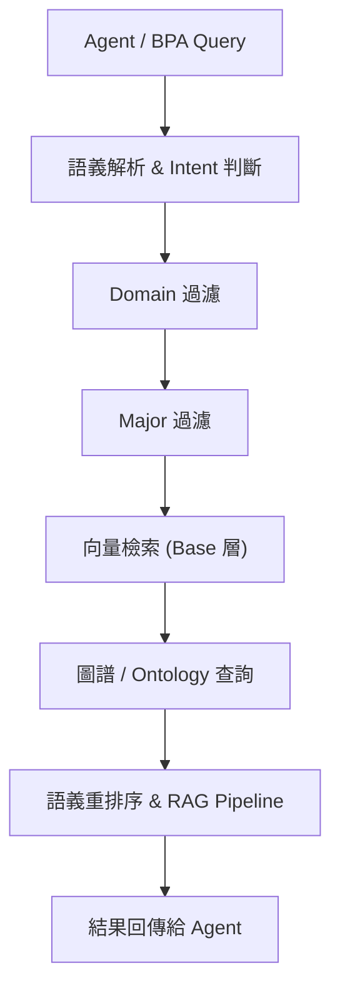
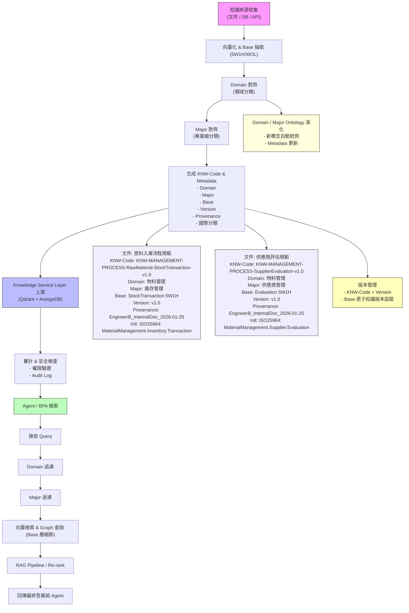
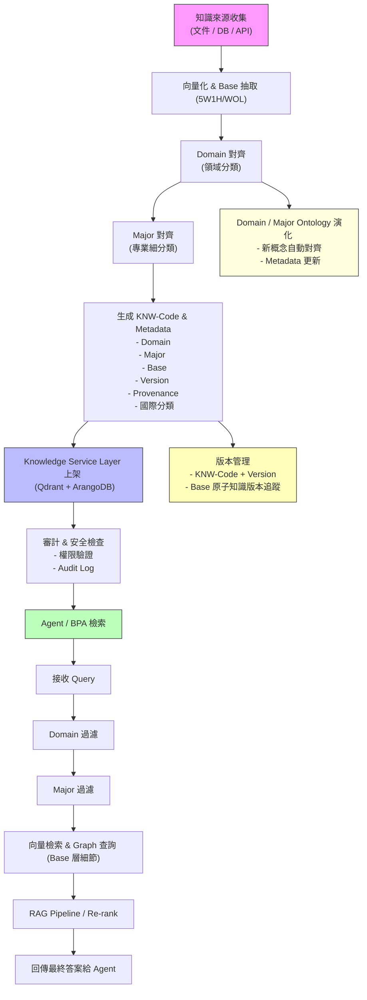

本文作為作業手冊工程導向，直接對應 KSLS，包含：

- 上架步驟
- Metadata 欄位定義
- 檢索策略
- 版本管理
- Ontology 演化
- 審計與安全規範

這份模板可以直接用作 KA-Agent 執行標準，也方便日後培訓或對外說明。

---

# KA-Agent 作業手冊模板（KSLS 工程版）

## 1️⃣ 上架作業流程

| 步驟 | 描述 | 輸入 | 輸出 | 備註 |
| --- | --- | --- | --- | --- |
| 1 | 收集知識來源 | 文件、DB、API | 待上架知識 | 檢查完整性與可讀性 |
| 2 | 向量化 & Base 抽取 | 原始知識文本 | Base 層原子知識向量、5W1H/WOL抽取 | Base 層共通原則 |
| 3 | Domain 對齊 | Base 抽取結果 | Domain 分類 | 對應頂層領域 |
| 4 | Major 對齊 | Domain + Base | Major 分類 | 對應專業細分類 |
| 5 | 生成 Metadata & KNW-Code | Domain + Major + Base | Metadata、KNW-Code | 包含 Version、Provenance、國際分類 |
| 6 | 上架至 Knowledge Service Layer | Metadata、向量、圖譜 | 上架完成 | 支援 Qdrant + ArangoDB |
| 7 | 審計與安全檢查 | 上架結果 | Audit Log、權限驗證 | 避免未授權讀取 |

---

## 2️⃣ Metadata 欄位定義

| 欄位 | 說明 | 格式 / 範例 |
| --- | --- | --- |
| `KNW_Code` | 系統唯一索引 | KNW-MANAGEMENT-PROCESS-RawMaterial-StockTransaction-v1.0 |
| `Domain` | 領域分類 | 物料管理 |
| `Major` | 專業細分類 | 庫存管理 |
| `Base` | 原子知識 / 通用原則 | StockTransaction 5W1H |
| `Version` | 知識版本號 | v1.0 |
| `Provenance` | 知識來源、文件ID、創建者 | EngineerB_InternalDoc_2026-01-25 |
| `International_Classification` | 國際標準分類 | ISO25964: MaterialManagement.Inventory.Transaction |
|  |  |  |

## KA-Agent 編碼對照表 v0.1

| KA-Code 欄位 | 描述 | 建議取值 / 映射標準 | 說明 |
| --- | --- | --- | --- |
| **DOMAIN** | 知識領域 | - ENERGY → DDC 620 (Engineering)- FINANCE → DDC 330 (Economics)- MANUFACTURING → DDC 670 (Manufacturing)- R&D → LCC Q180-Q200 (Scientific Research) | 用國際標準作為骨架，方便未來跨企業對齊 |
| **TYPE** | 知識類型 | - SPEC → 規格、技術要求- POLICY → 規範、制度- PATTERN → 設計模式、架構模式- EXPERIENCE → 實務經驗、案例- INCIDENT → 事件、故障分析 | 對應 ISO 25964 的 Thesauri Concepts，可做語義分類 |
| **SUBDOMAIN** | 子領域 / 專業領域 | - PYROLYSIS → 能源-低溫熱解- SOLAR → 再生能源-太陽能- BATTERY → 電池技術 | 對應 DDC/UDC 子分類或企業專有分類 |
| **OBJECT** | 知識對象 | - REACTOR → 裝置/設備- CONTROLLER → 控制系統- PROCESS → 流程、作業方法 | 可對應 LOM 中的 Learning Object/Asset Target |
| **SCOPE** | 使用範圍 | - SYSTEM → AI-Box 系統內部- PROJECT → 專案範圍- CLIENT → 客戶專屬- EXPERIMENTAL → 測試或試驗知識 | KA-Agent 上架時需指定，支援 Agent 的 retrieval filter |
| **VERSION** | 知識版本 | - v<MAJOR.MINOR> 例如 v1.0, v1.2 | 每次更新產生新版本，舊版保留；支援 Lifecycle State 管理 |
| **ONTOLOGY_CONCEPT_ID** | 對應概念 ID | 可用 SKOS URI 或 RDF URI | 方便 Knowledge Graph 連結與語義查詢 |
| **PROVENANCE / TRUST_HINT** | 來源 / 信任提示 | - author, source, timestamp, review_status | 支援安全審計、合法性檢查 |

---

## 編碼示例

假設我們要上架一個能源領域的低溫熱解反應器操作規格，建議編碼：

```
KNW-ENERGY-SPEC-PYROLYSIS-REACTOR-SYSTEM-v1.0

```

對應 Ontology：

URI: skos:ENERGY_PYRO_REACTOR_SPEC
Domain: ENERGY
Type: SPEC
Subdomain: PYROLYSIS
Object: REACTOR
Scope: SYSTEM
Version: v1.0
Provenance: Author=EngineerA; Source=InternalDocX; Date=2026-01-25

### 上架時參考編碼架構

作用：保證每個 Knowledge Asset (KA) 的唯一性、可追蹤性與語義可推理性KA-Agent 在 ingest 階段會自動：
對照 Domain Ontology，判斷 DOMAIN、TYPE、SUBDOMAIN、OBJECT生成符合規範的 KNW-Code，例如：
KNW-ENERGY-SPEC-PYROLYSIS-REACTOR-SYSTEM-v1，將該編碼作為 系統內部索引鍵，支援 Agent 檢索與 RAG pipeline 的 pre-filter
好處：
Agent 不需要每次都做全域語義判斷避免跨 domain / subdomain 檢索錯誤支援版本控制與知識演化

### 在 Metadata 中放置國際標準分類

- **做法**：
    - 將 DDC、UDC、LCC、LOM、ISO 25964 等國際標準 ID 放入 KA Metadata，例如：
        
        ```json
        {
        "KNW_Code":"KNW-ENERGY-SPEC-PYROLYSIS-REACTOR-SYSTEM-v1.0",
        "Domain_Ontology_URI":"skos:ENERGY_PYRO_REACTOR_SPEC",
        "International_Classification":{
        "DDC":"620.042",
        "UDC":"621.4",
        "LCC":"TP155",
        "ISO25964":"ENERGY.PYROLYSIS.REACTOR"
        },
        "Version":"v1.0",
        "Provenance":"EngineerA_InternalDocX_2026-01-25"
        }
        
        ```
        
- **好處**：
    - **跨系統互操作性**：其他企業或合作系統可以用國際分類直接比對
    - **檢索輔助**：當 Agent 做多 domain / 多客戶檢索時，可先過濾國際標準分類，提高檢索速度與精準度
    - **語義對齊**：即使在多語言或多領域環境，Agent 仍能快速理解「這個資產的專業語義」

---

## 

---

## 3️⃣ 檢索策略

1. **Domain 過濾**：快速篩選大類候選知識
2. **Major 過濾**：精準鎖定專業細分類
3. **Base 向量檢索 + Graph 查詢**：細粒度檢索、KG 抽取、推理
4. **RAG / Re-rank**：整合結果生成最終答案

### 1️⃣ 檢索流程總覽



### 2️⃣ 細部步驟說明

### 2.1 語義解析 & Intent 判斷

- **目標**：理解使用者查詢的意圖與關鍵詞
- **方法**：
    - NLP 分詞 + 命名實體識別 (NER)
    - Intent 分類 (如查詢流程、數據、規範)
    - 產生初步 Query embedding
- **輸出**：
    - 查詢向量
    - 初步 Intent 標籤
    - 相關 Domain / Major 候選列表

---

### 2.2 Domain 過濾

- **目標**：快速縮小候選知識範圍
- **方法**：
    - 對 Query embedding 與 Domain 層向量進行相似度比對
    - 使用 Metadata 中 `Domain` 欄位過濾
- **好處**：
    - 大幅減少向量庫檢索量
    - 避免非相關領域干擾

---

### 2.3 Major 過濾

- **目標**：在 Domain 範圍內進一步精準定位
- **方法**：
    - Metadata 中 `Major` 欄位過濾
    - 可結合向量相似度進行加權排序
- **好處**：
    - 精確到專業細分類
    - 減少 Base 層檢索計算量

---

### 2.4 Base 向量檢索

- **目標**：在精選 Major 範圍內查找最相關知識原子
- **方法**：
    - 向量相似度檢索 (Cosine / Dot Product)
    - 可設定 Top-K 或距離閾值
    - 支援多向量同時檢索（Query expansion）
- **輸出**：
    - 候選知識原子列表 + 向量相似度分數

---

### 2.5 圖譜 / Ontology 查詢

- **目標**：結合知識結構（Base / Domain / Major）進行推理
- **方法**：
    - 利用 ArangoDB Graph / Neo4j 查找知識間關聯
    - 支援推理查詢，例如：
        - 前置條件關聯（Pre-condition → Action → Result）
        - 角色/流程責任關聯（Who → Does → What）
- **輸出**：
    - 候選知識原子加上下游關聯上下文

---

### 2.6 語義重排序 & RAG Pipeline

- **目標**：整合向量檢索 + 圖譜查詢結果，生成最終答案
- **方法**：
    - 將向量相似度 + Graph 關聯度加權
    - 將候選知識送入 RAG Pipeline（Retriever-Generator）生成自然語言答案
    - 可選擇 Top-K 回傳或摘要整合
- **輸出**：
    - 精準答案 + 來源 Metadata（Domain / Major / Base / Version / Provenance）

---

### 2.7 結果回傳給 Agent

- **包含**：
    - 自然語言答案
    - 相關知識來源列表
    - 版本號與審計標記
- **可選**：
    - 可回傳向量/圖譜鏈路，用於下一步推理或迭代查詢

---

### 3️⃣ 檢索優化策略

1. **Domain → Major → Base 分層過濾**
    - 先大範圍篩選再細粒度檢索，提高速度與精準度
2. **Metadata + 向量混合檢索**
    - Metadata 篩選降低候選數量，向量檢索精確語義匹配
3. **多向量擴展 (Query Expansion)**
    - 針對複雜查詢生成多向量，提高召回率
4. **Graph / Ontology 推理**
    - 利用知識間關聯增加回答的上下文完整性
5. **RAG 重排序**
    - 最終整合檢索結果，生成精準可解釋答案

---

---

## 4️⃣ 版本管理原則

- KNW-Code + Version 控制知識迭代
- Base 原子知識保留歷史版本
- Domain / Major 可動態演化，Metadata 自動對齊
- 舊版本仍可檢索，保留 Provenance

---

## 5️⃣ Ontology 演化

| 層級 | 演化策略 | 備註 |
| --- | --- | --- |
| Domain | 新領域自動加入 | KA-Agent 上架時更新 |
| Major | 專業細分類擴展 | 可逐步增補細分類 |
| Base | 共通原則保持穩定 | 5W1H / WOL 原則不變 |

---

## 6️⃣ 審計與安全規範

| 項目 | 描述 |
| --- | --- |
| 權限管理 | 上架、檢索、修改需權限驗證 |
| Audit Log | 記錄每次上架、更新、檢索行為 |
| 安全策略 | 防止未授權訪問向量/圖譜資料 |
| 版本追蹤 | 每次更新均記錄 Version、Provenance |

---

# **上架 → Metadata + KNW-Code → 檢索 → Agent 回答**



# KA-Agent 知識上架 + 檢索流程 + Ontology 三層融合圖



### 圖解說明

1. **上架階段**
    - Base 抽取 5W1H/WOL 原子知識 → Domain 對齊 → Major 對齊 → Metadata + KNW-Code 生成 → 上架至 Knowledge Service Layer → 安全審計
2. **檢索階段**
    - Agent / BPA Query → Domain 過濾 → Major 過濾 → Base 向量 + Graph 查詢 → RAG / Re-rank → 返回答案
3. **版本管理**
    - KNW-Code + Version 追蹤知識更新
    - Base 原子知識版本保留，支援回溯
4. **Ontology 演化**
    - Domain / Major 層可動態擴展
    - KA-Agent 自動對齊新概念，Metadata 隨之更新

## 文件/知識資產的 Metadata 規劃

每個 Knowledge Asset（KA）或上架的文件，metadata 可以包含：

| Metadata 欄位 | 說明 | 對應 Ontology 層級 |
| --- | --- | --- |
| `KNW_Code` | 系統唯一索引（Domain + Major + Base 簡化標識 + 版本） | 全域索引 |
| `Domain` | 領域分類，例如「物料管理」「能源」 | Domain |
| `Major` | 專業細分類，例如「庫存管理」「採購管理」 | Major |
| `Base` | 原子知識或通用原則，例如 5W1H, WOL | Base |
| `Version` | KA 版本號，例如 v1.0 | 全域索引 |
| `Provenance` | 知識來源，例如文件 ID、創建者 | — |
| `International_Classification` | DDC/UDC/LCC/ISO25964 對應 | 輔助分類 |

> Base 層不需要每個 KA 都特別定義成 Metadata，因為它是共通原則（如 5W1H、事件/物件最小單位），KA-Agent 上架時會自動套用 Base 規則。
> 

---

## AI-Box Ontology 架構回顧

| 層級 | 功能 | 說明 |
| --- | --- | --- |
| **Base.json** | 最底層知識 / WOL 5W1H | 事件/物件最小單位，類似原子知識 (Who, What, When, Where, Why, How) |
| **Domain** | 專業領域 | 聚合 Base 事件，形成可管理的領域知識單元（如能源、物料管理、財務） |
| **Major** | 頂層分類 | 大類分類，用於全局管理與快速索引（如 Operations, R&D, Finance） |

> 核心理念：用最少層級解決全局分類與精細知識抽象問題，避免過深層次造成維護困難。
> 

### 與 KA-Agent 架構融合的思路

KA-Agent 的 Knowledge Asset 已經有以下元素：

- **KNW-Code**：唯一索引，支援檢索與快取
- **Metadata**：Domain Ontology URI、國際分類、版本、provenance
- **向量 / Graph**：支援向量檢索與圖譜查詢

### 映射方式

| KA-Agent 元素 | 對應三層 Ontology |
| --- | --- |
| DOMAIN | Major |
| TYPE / SUBDOMAIN | Domain |
| Object / Properties | Base.json |

### 示例

假設上架一個「物料入庫流程」知識：

```
KNW-MANAGEMENT-PROCESS-RawMaterial-StockTransaction-SYSTEM-v1.0

```

映射到AI-Box的三層 Ontology：

| KA 元素 | 對應三層 |
| --- | --- |
| Major (DOMAIN) | MANAGEMENT |
| Domain (TYPE/SUBDOMAIN) | Process / RawMaterial |
| Base (Object / Properties) | StockTransaction (Who, What, When, Where, How) |

> 這樣 KA-Agent 上架、向量化、圖譜化時可以自動對齊 Base 層，Agent 檢索時可以先過濾 Major → Domain，再做向量檢索或 KG 查詢。
> 

---

## 3️⃣ 整合優勢

1. **避免過深層級**
    - 保持三層簡單，但每層都有明確責任
2. **支援 KA-Agent 快速上架與檢索**
    - Major + Domain 可做 Code pre-filter
    - Base 層支援向量檢索與 KG 抽取
3. **方便逐步擴張**
    - 新 Base.json 可以隨時補充
    - Domain/Major 層可以逐步完善
4. **兼容國際分類**
    - Major / Domain 層可以對應 DDC / LCC / ISO25964 等分類，Metadata 直接存入 KA-Agent

---

## 4️⃣ 建議落地策略

1. **建立映射表**
    - 每個 Major → 對應 KA DOMAIN
    - 每個 Domain → 對應 KA TYPE / SUBDOMAIN
    - Base.json 的 5W1H → 對應 KA Object / Properties
2. **上架流程中自動對齊**
    - KA-Agent 收到知識，先判斷 Base → Domain → Major
    - 生成 KNW-Code + Metadata
3. **檢索與推斷**
    - Query 可先 Major 過濾，再 Domain 篩選，最後利用 Base 向量/Graph 精準檢索
    - 推理也可依照 Base 層級關係做 5W1H 邏輯推斷

---

簡單一句話：

> 三層 Ontology 作為 KA-Agent 的分類骨架 + Base 層原子知識，能完整支撐向量化、KG 抽取、檢索與推斷，同時保持結構簡潔、可逐步擴展。
> 

# 附錄：

## 國際上常用的知識/信息分類標準：

---

## 1️⃣ Dewey Decimal Classification (DDC) / 十進位分類法

- **領域**：圖書館知識分類
- **特點**：
    - 層級分級（000–999）
    - 可分到子主題（例如 620 工程技術 → 621 機械工程 → 621.4 熱力學）
- **適合用途**：
    - 對應「Domain → Subdomain → Object」編碼
- **限制**：
    - 偏向文獻，對動態知識資產/圖譜不夠精細

---

## 2️⃣ Universal Decimal Classification (UDC) / 通用十進位分類法

- **領域**：圖書館、檔案
- **特點**：
    - 可結合多個概念，靈活表達交叉領域知識
    - 有附加符號表示屬性或關聯
- **適合用途**：
    - 可用於複合型知識編碼，例如跨領域能源+材料

---

## 3️⃣ ISO 25964 / Thesauri & Interoperability

- **領域**：語意網與資訊檢索
- **特點**：
    - 提供正式標準的概念、同義詞、層級關係
    - 支援 SKOS（Simple Knowledge Organization System）格式
- **適合用途**：
    - 對應 Domain Ontology 與 Knowledge Code
    - 支援語義檢索加速

---

## 4️⃣ IEEE LOM / Learning Object Metadata

- **領域**：學習資源、數位教材
- **特點**：
    - Metadata-rich（分類、主題、語言、用途、難度、權限）
- **適合用途**：
    - 可參考 metadata 結構，用於 Knowledge Asset 的屬性設計
    - 結合編碼規則，可提升 Agent 的 retrieval 與篩選效率

---

## 5️⃣ Library of Congress Classification (LCC)

- **領域**：美國國會圖書館
- **特點**：
    - 字母 + 數字分層（QA 76.73.C154 → Computer Programming）
- **適合用途**：
    - 直觀的層級式編碼
    - 可以對應 Domain → Subdomain → Object → Type
- **限制**：
    - 偏重學術/圖書館領域，非企業知識資產

---

## 6️⃣ ISCED / International Standard Classification of Education

- **領域**：教育資源、能力分類
- **用途**：
    - 若你要對知識資產做能力層級、成熟度、訓練目標，可以借用

---

## 💡 實務建議

1. **Domain Ontology + 自訂編碼**
    - 把國際標準當參考骨架（層級、分類邏輯）
    - 再加上你企業專屬需求（Asset Type、Scope、Version）
2. **SKOS / RDF**
    - 如果你要做知識圖譜化，可以把編碼直接映射成 SKOS Concept ID
    - Agent 檢索時可以用 Code Filter + Semantic Reasoning
3. **混合模式**
    - Domain 層參考 DDC/UDC/LCC
    - Type/Subdomain/Object 層自定義
    - Version & Scope 自行管理

---

總結一句話：

> 國際標準可以當骨架，企業自訂編碼當內容，編碼+Ontology 就是 KA-Agent 的快取鍵+路由表。
> 

---