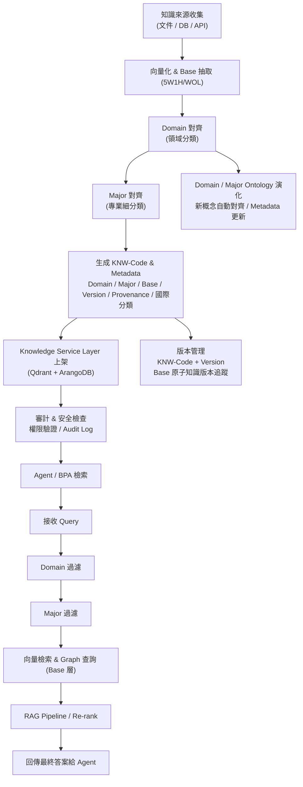
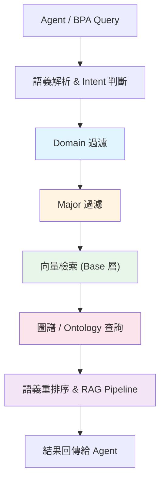
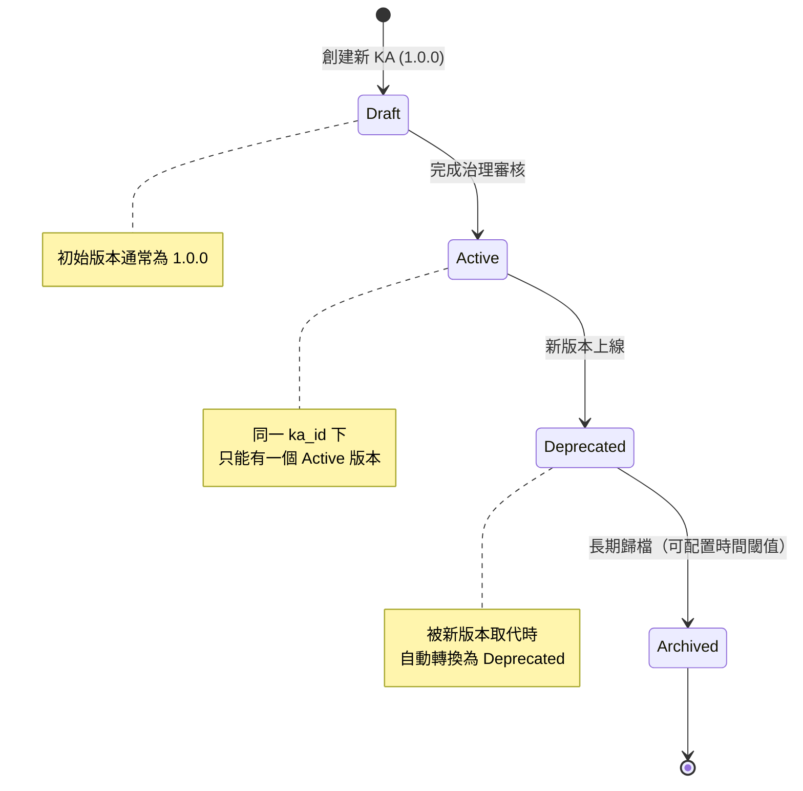

# KA-Agent 作業規範（Standard Operating Procedure）

> **文件狀態**: 工程開發實施指南  
> **文檔版本**: v1.3  
> **最後更新**: 2026-01-25 19:13 UTC+8  
> **維護人**: Daniel Chung  
> **對齊系統**: KA-Agent 規格書 v1.5.x, KSLS v1.0

本文作為作業手冊工程導向，直接對應 KSLS，包含：上架步驟、Metadata 欄位定義、檢索策略、版本管理、Ontology 演化、審計與安全規範。**本規範可直接用作 KA-Agent 執行標準，也方便日後培訓或對外說明。**

---

## 1. 規範目的與範圍

本作業規範定義 **KA-Agent** 的標準作業程序（SOP），包含：

- 知識上架作業流程（7 步驟）
- Metadata 欄位定義與 KNW-Code 編碼規則
- 檢索策略（Domain → Major → Base 分層過濾）
- 版本管理規範（SemVer 格式、版本關聯、狀態轉換）
- Ontology 演化與對齊機制
- 審計與安全規範

**適用範圍**：
- KA-Agent 的日常作業操作
- 知識資產上架與更新流程
- **所有文件上傳**（含**前端上傳**）：皆對知識資產進行編碼，寫入 `file_metadata` 的 KA 屬性與 `knw_code`
- 知識檢索與查詢操作
- 版本管理與狀態轉換
- 培訓與對外說明

**參考文檔**：
- [KA-Agent 規格書](../KA-Agent-規格書.md)
- [Knowledge Asset 版本號規範](./Knowledge-Asset-版本號規範.md)
- [Knowledge Service Layer Specification (KSLS)](./Knowledge%20Service%20Layer%20Specification%20(KSLS).md)
- [KA-Agent 作業模版](./KA-Agent作業模版.md)

---

## 2. 知識上架作業流程

### 2.1 上架流程總覽（7 步驟）

| 步驟 | 描述 | 輸入 | 輸出 | 代碼路徑 / 服務 | 備註 |
| --- | --- | --- | --- | --- | --- |
| **1** | 收集知識來源 | 文件、DB、API | 待上架知識 | - | 檢查完整性與可讀性 |
| **2** | 向量化 & Base 抽取 | 原始知識文本 | Base 層原子知識向量、5W1H/WOL 抽取 | `ChunkProcessor.process_file()`<br>`EmbeddingService.generate_embeddings()` | Base 層共通原則 |
| **3** | Domain 對齊 | Base 抽取結果 | Domain 分類 | `OntologySelector.select_auto()`<br>`kag/ontology_selector.py` | 對應頂層領域（對標 Ontology Domain 層） |
| **4** | Major 對齊 | Domain + Base | Major 分類 | `OntologySelector.select_auto()`<br>`kag/ontology_selector.py` | 對應專業細分類（對標 Ontology Major 層） |
| **5** | 生成 Metadata & KNW-Code | Domain + Major + Base | Metadata、KNW-Code | KA-Agent 內部邏輯 | 包含 Version、Provenance、國際分類 |
| **6** | 上架至 Knowledge Service Layer | Metadata、向量、圖譜 | 上架完成 | `QdrantVectorStoreService.store_vectors()`<br>`ArangoDBClient` | 支援 Qdrant + ArangoDB |
| **7** | 審計與安全檢查 | 上架結果 | Audit Log、權限驗證 | `AuditLogService.log()`<br>`PolicyService.check_permission()` | 避免未授權讀取 |

### 2.2 詳細作業步驟

#### 步驟 1：收集知識來源

**輸入**：
- 文件（PDF、DOCX、MD、TXT 等）
- 資料庫記錄
- API 響應
- 第三方知識庫

**檢查項目**：
- 文件完整性（文件大小、格式）
- 可讀性（編碼、語言）
- 權限驗證（是否有權限上架）

**代碼路徑**：
- 文件上傳：`api/routers/chat.py`（文件上傳端點）
- 文件元數據：`services/api/services/file_metadata_service.py`

#### 步驟 2：向量化 & Base 抽取

**輸入**：原始知識文本

**處理流程**：
1. **分塊處理**：
   - 代碼路徑：`services/api/processors/chunk_processor.py` → `ChunkProcessor.process_file()`
   - 策略：根據文件類型選擇分塊策略（固定大小、語義分塊、AST 驅動）
2. **向量化**：
   - 代碼路徑：`services/api/services/embedding_service.py` → `EmbeddingService.generate_embeddings()`
   - 模型：根據語言自動選擇（中文：`quentinz/bge-large-zh-v1.5:latest`，英文：`nomic-embed-text:latest`）
3. **Base 層抽取**：
   - 5W1H 原子知識抽取（Who, What, When, Where, Why, How）
   - WOL（Work Object Language）抽取

**輸出**：
- Base 層原子知識向量
- 5W1H/WOL 抽取結果

#### 步驟 3：Domain 對齊

**輸入**：Base 抽取結果

**處理流程**：
1. **Ontology 自動選擇**：
   - 代碼路徑：`kag/ontology_selector.py` → `OntologySelector.select_auto()`
   - 方法：根據文件名、文件內容、文件元數據自動選擇 Domain Ontology
2. **Domain 分類**：
   - 對標 `ontologies` collection 中 `type == "domain"` 的 Ontology
   - 範例：`domain-enterprise`、`domain-administration`、`domain-renewable-energy`

**輸出**：Domain 分類（對應 KA 的 `domain` 欄位）

**代碼路徑**：
- OntologySelector：`kag/ontology_selector.py`
- OntologyStoreService：`services/api/services/ontology_store_service.py`

#### 步驟 4：Major 對齊

**輸入**：Domain + Base

**處理流程**：
1. **Major Ontology 選擇**：
   - 代碼路徑：`kag/ontology_selector.py` → `OntologySelector.select_auto()`
   - 方法：在已選 Domain 的基礎上，選擇兼容的 Major Ontology
2. **兼容性檢查**：
   - 檢查 Major Ontology 的 `compatible_domains` 是否包含選定的 Domain
   - 範例：`major-manufacture` 兼容 `domain-enterprise`

**輸出**：Major 分類（對應 KA 的 `major` 欄位，可選）

**代碼路徑**：
- OntologySelector：`kag/ontology_selector.py`
- 兼容性檢查：`services/api/services/ontology_store_service.py` → `get_ontology_with_priority()`

#### 步驟 5：生成 Metadata & KNW-Code

**輸入**：Domain + Major + Base + Version + Provenance

**處理流程**：

1. **生成 KNW-Code**：
   - 格式：`KNW-{DOMAIN}-{TYPE}-{SUBDOMAIN}-{OBJECT}-{SCOPE}-v{MAJOR.MINOR}`
   - 範例：`KNW-ENERGY-SPEC-PYROLYSIS-REACTOR-SYSTEM-v1.0`
   - 作用：**檔案編碼**，系統唯一索引，支援檢索與快取；**所有上傳**（含前端）皆須生成並寫入 `file_metadata`

2. **生成 Metadata**：
   - 包含：`KNW_Code`、`Domain`、`Major`、`Base`、`Version`、`Provenance`、`International_Classification`
   - 詳見 [3. Metadata 欄位定義](#3-metadata-欄位定義)

**輸出**：
- KNW-Code（系統唯一索引）
- Metadata（完整元數據）

#### 步驟 6：上架至 Knowledge Service Layer

**輸入**：Metadata、向量、圖譜

**處理流程**：

1. **存儲向量**：
   - 代碼路徑：`services/api/services/qdrant_vector_store_service.py` → `QdrantVectorStoreService.store_vectors()`
   - Collection 命名：`file_{file_id}`（或 `user_{user_id}`，根據配置）

2. **存儲圖譜**：
   - 代碼路徑：`database/arangodb/client.py` → `ArangoDBClient`
   - Collections：`entities_{file_id}`、`relations_{file_id}`

3. **註冊 Knowledge Asset / 寫入檔案編碼**：
   - **整合方案**：更新同一條 `file_metadata` 記錄，添加 KA 核心屬性與**檔案編碼**（`knw_code`、`ka_id`、`domain`、`major`、`lifecycle_state`、`version` 等）
   - **適用對象**：**所有上傳**（前端用戶上傳、KA-Agent 上架）均須執行；上傳 pipeline 完成分塊／向量／圖譜後，**統一**進行 Ontology 對齊、KNW-Code 生成並寫入 `file_metadata`
   - KA-Agent 路徑：`agents/builtin/ka_agent/agent.py` → `_register_knowledge_asset()`（實作見 `agents/builtin/ka_agent/`）
   - 前端上傳：由文件上傳服務／`FileMetadataService` 擴展或上傳 pipeline 整合編碼邏輯（`OntologySelector` + KNW-Code 生成）
   - **任務標識**：KA-Agent 上架時 `task_id = "KA-Agent-Tasks"` 或 `user_id = "systemAdmin"`；前端上傳使用各自 `task_id` / `user_id`。**皆寫入** KA 屬性與 `knw_code`
   - 初始狀態：`lifecycle_state = "Draft"`

**輸出**：上架完成，返回 `ka_id`、`knw_code`（及 `file_id`）

#### 步驟 7：審計與安全檢查

**輸入**：上架結果

**處理流程**：

1. **權限驗證**：
   - 代碼路徑：`agents/task_analyzer/policy_service.py` → `PolicyService.check_permission()`
   - 檢查：用戶是否有權限上架該知識資產

2. **審計日誌記錄**：
   - 代碼路徑：`services/api/services/audit_log_service.py` → `AuditLogService.log()`
   - 記錄：`action = "knowledge_asset_created"`，包含 `ka_id`、`user_id`、`timestamp`

**輸出**：Audit Log、權限驗證結果

### 2.3 上架→檢索融合流程圖與圖解說明

**上架 → Metadata + KNW-Code → 檢索 → Agent 回答**



**Metadata 實例**（對應步驟 5 輸出）：

| 案例 | KNW-Code | Domain | Major | Base | Version | Provenance | Intl |
|------|----------|--------|-------|------|---------|------------|------|
| 原料入庫流程規範 | KNW-MANAGEMENT-PROCESS-RawMaterial-StockTransaction-v1.0 | 物料管理 | 庫存管理 | StockTransaction 5W1H | v1.0 | EngineerB_InternalDoc_2026-01-25 | ISO25964: MaterialManagement.Inventory.Transaction |
| 供應商評估規範 | KNW-MANAGEMENT-PROCESS-SupplierEvaluation-v1.0 | 物料管理 | 供應商管理 | Evaluation 5W1H | v1.0 | EngineerB_InternalDoc_2026-01-25 | ISO25964: MaterialManagement.Supplier.Evaluation |

**圖解說明**：
1. **上架階段**：Base 抽取 5W1H/WOL → Domain 對齊 → Major 對齊 → Metadata + KNW-Code 生成 → 上架至 KSL → 安全審計。
2. **檢索階段**：Agent / BPA Query → Domain 過濾 → Major 過濾 → Base 向量 + Graph 查詢 → RAG / Re-rank → 返回答案。
3. **版本管理**：KNW-Code + Version 追蹤知識更新；Base 原子知識版本保留，支援回溯。
4. **Ontology 演化**：Domain / Major 層可動態擴展；KA-Agent 自動對齊新概念，Metadata 隨之更新。

---

## 3. Metadata 欄位定義

### 3.1 核心 Metadata 欄位

| 欄位 | 說明 | 格式 / 範例 | 對應 ArangoDB 欄位 | 對標 Ontology |
| --- | --- | --- | --- | --- |
| `KNW_Code` | 系統唯一索引 | `KNW-MANAGEMENT-PROCESS-RawMaterial-StockTransaction-v1.0` | - | 全域索引 |
| `Domain` | 領域分類 | `domain-enterprise` | `domain` | **Domain 層** |
| `Major` | 專業細分類 | `major-manufacture` | `major` | **Major 層** |
| `Base` | 原子知識 / 通用原則 | `StockTransaction 5W1H` | - | **Base 層** |
| `Version` | 知識版本號 | `1.0.0`（SemVer） | `version` | 全域索引 |
| `Provenance` | 知識來源、文件ID、創建者 | `EngineerB_InternalDoc_2026-01-25` | `provenance` | - |
| `International_Classification` | 國際標準分類 | `ISO25964: MaterialManagement.Inventory.Transaction` | `metadata.international_classification` | 輔助分類 |

**Base 層說明**：Base 層不需要每個 KA 都特別定義成 Metadata，因為它是共通原則（如 5W1H、事件/物件最小單位）；KA-Agent 上架時會自動套用 Base 規則。

### 3.2 KA-Agent 編碼對照表（KNW-Code）

| KA-Code 欄位 | 描述 | 建議取值 / 映射標準 | 說明 |
| --- | --- | --- | --- |
| **DOMAIN** | 知識領域 | ENERGY→DDC 620；FINANCE→DDC 330；MANUFACTURING→DDC 670；R&D→LCC Q180–Q200 | 用國際標準作骨架，方便跨企業對齊 |
| **TYPE** | 知識類型 | SPEC（規格）、POLICY（規範）、PATTERN（設計模式）、EXPERIENCE（實務）、INCIDENT（事件） | 對應 ISO 25964 Thesauri Concepts |
| **SUBDOMAIN** | 子領域 | PYROLYSIS、SOLAR、BATTERY 等 | 對應 DDC/UDC 子分類或企業專有分類 |
| **OBJECT** | 知識對象 | REACTOR、CONTROLLER、PROCESS 等 | 可對應 LOM Learning Object / Asset Target |
| **SCOPE** | 使用範圍 | SYSTEM、PROJECT、CLIENT、EXPERIMENTAL | 上架時指定，支援 retrieval filter |
| **VERSION** | 知識版本 | v&lt;MAJOR.MINOR&gt; 如 v1.0, v1.2 | 每次更新產生新版本，舊版保留 |
| **ONTOLOGY_CONCEPT_ID** | 對應概念 ID | SKOS URI 或 RDF URI | 方便 Knowledge Graph 連結與語義查詢 |
| **PROVENANCE / TRUST_HINT** | 來源 / 信任提示 | author, source, timestamp, review_status | 支援安全審計、合法性檢查 |

### 3.3 上架時參考編碼架構

**作用**：保證每個 Knowledge Asset (KA) 的唯一性、可追蹤性與語義可推理性。

KA-Agent 在 ingest 階段會自動：
- 對照 Domain Ontology，判斷 DOMAIN、TYPE、SUBDOMAIN、OBJECT；
- 生成符合規範的 KNW-Code（如 `KNW-ENERGY-SPEC-PYROLYSIS-REACTOR-SYSTEM-v1`）；
- 將該編碼作為系統內部索引鍵，支援 Agent 檢索與 RAG pipeline 的 pre-filter。

**好處**：Agent 不需要每次都做全域語義判斷；可避免跨 domain / subdomain 檢索錯誤；支援版本控制與知識演化。

### 3.4 KNW-Code 編碼規則

**編碼格式**：

```
KNW-{DOMAIN}-{TYPE}-{SUBDOMAIN}-{OBJECT}-{SCOPE}-v{MAJOR.MINOR}
```

**編碼組成部分**：

| 部分 | 說明 | 範例 | 對應 Ontology |
|------|------|------|-------------|
| `DOMAIN` | 知識領域 | `ENERGY`、`MANAGEMENT`、`FINANCE` | Major 層（頂層分類） |
| `TYPE` | 知識類型 | `SPEC`、`POLICY`、`PATTERN`、`EXPERIENCE`、`INCIDENT` | - |
| `SUBDOMAIN` | 子領域 / 專業領域 | `PYROLYSIS`、`SOLAR`、`BATTERY` | Domain 層（專業領域） |
| `OBJECT` | 知識對象 | `REACTOR`、`CONTROLLER`、`PROCESS` | Base 層（Object / Properties） |
| `SCOPE` | 使用範圍 | `SYSTEM`、`PROJECT`、`CLIENT`、`EXPERIMENTAL` | - |
| `VERSION` | 知識版本 | `v1.0`、`v1.2`（簡化 SemVer，僅 MAJOR.MINOR） | - |

**編碼範例**：

```
KNW-ENERGY-SPEC-PYROLYSIS-REACTOR-SYSTEM-v1.0
```

**對應 Ontology**：
- URI: `skos:ENERGY_PYRO_REACTOR_SPEC`
- Domain: `ENERGY`
- Type: `SPEC`
- Subdomain: `PYROLYSIS`
- Object: `REACTOR`
- Scope: `SYSTEM`
- Version: `v1.0`
- Provenance: `Author=EngineerA; Source=InternalDocX; Date=2026-01-25`

### 3.5 國際標準分類（International_Classification）

**支援的國際分類標準**：

| 標準 | 全稱 | 領域 | 特點 | 適合用途 |
|------|------|------|------|---------|
| **DDC** | Dewey Decimal Classification | 圖書館知識分類 | 層級分級（000–999） | 對應「Domain → Subdomain → Object」編碼 |
| **UDC** | Universal Decimal Classification | 圖書館、檔案 | 可結合多個概念，靈活表達交叉領域 | 複合型知識編碼（跨領域能源+材料） |
| **ISO 25964** | Thesauri & Interoperability | 語意網與資訊檢索 | 正式標準的概念、同義詞、層級關係，支援 SKOS | 對應 Domain Ontology 與 Knowledge Code |
| **LOM** | IEEE Learning Object Metadata | 學習資源、數位教材 | Metadata-rich（分類、主題、語言、用途、難度、權限） | 參考 metadata 結構，用於 Knowledge Asset 屬性設計 |
| **LCC** | Library of Congress Classification | 美國國會圖書館 | 字母 + 數字分層（QA 76.73.C154） | 直觀的層級式編碼 |
| **ISCED** | International Standard Classification of Education | 教育資源、能力分類 | 能力層級、成熟度、訓練目標 | 知識資產的能力層級、成熟度分類 |

**Metadata 中的國際分類結構**：

```json
{
    "KNW_Code": "KNW-ENERGY-SPEC-PYROLYSIS-REACTOR-SYSTEM-v1.0",
    "Domain_Ontology_URI": "skos:ENERGY_PYRO_REACTOR_SPEC",
    "International_Classification": {
        "DDC": "620.042",
        "UDC": "621.4",
        "LCC": "TP155",
        "ISO25964": "ENERGY.PYROLYSIS.REACTOR"
    },
    "Version": "1.0.0",
    "Provenance": "EngineerA_InternalDocX_2026-01-25"
}
```

**好處**：
- **跨系統互操作性**：其他企業或合作系統可以用國際分類直接比對
- **檢索輔助**：當 Agent 做多 domain / 多客戶檢索時，可先過濾國際標準分類，提高檢索速度與精準度
- **語義對齊**：即使在多語言或多領域環境，Agent 仍能快速理解「這個資產的專業語義」

---

## 4. 檢索策略

### 4.1 檢索流程總覽

**分層過濾策略**：Domain → Major → Base 向量檢索 + Graph 查詢 → RAG / Re-rank



### 4.2 細部步驟說明

#### 4.2.1 語義解析 & Intent 判斷

**目標**：理解使用者查詢的意圖與關鍵詞

**方法**：
- NLP 分詞 + 命名實體識別 (NER)
- Intent 分類（如查詢流程、數據、規範）
- 產生初步 Query embedding

**輸出**：
- 查詢向量
- 初步 Intent 標籤
- 相關 Domain / Major 候選列表

**代碼路徑**：
- Intent 解析：`agents/task_analyzer/router_llm.py` → `RouterLLM.analyze()`
- 語義理解：`agents/task_analyzer/analyzer.py` → `TaskAnalyzer.analyze()`

#### 4.2.2 Domain 過濾

**目標**：快速縮小候選知識範圍

**方法**：
- 對 Query embedding 與 Domain 層向量進行相似度比對
- 使用 Metadata 中 `domain` 欄位過濾（對標 Ontology Domain 層）
- 使用 ArangoDB 索引 `idx_domain` 優化查詢

**好處**：
- 大幅減少向量庫檢索量
- 避免非相關領域干擾

**代碼路徑**：
- ArangoDB 查詢：`database/arangodb/client.py` → `ArangoDBClient.db.aql.execute()`
- 索引：`idx_domain`（見 KA-Agent 規格書 12.1 節）

#### 4.2.3 Major 過濾

**目標**：在 Domain 範圍內進一步精準定位

**方法**：
- Metadata 中 `major` 欄位過濾（對標 Ontology Major 層）
- 可結合向量相似度進行加權排序
- 使用 ArangoDB 索引 `idx_major` 優化查詢

**好處**：
- 精確到專業細分類
- 減少 Base 層檢索計算量

**代碼路徑**：
- ArangoDB 查詢：`database/arangodb/client.py` → `ArangoDBClient.db.aql.execute()`
- 索引：`idx_major`（見 KA-Agent 規格書 12.1 節）

#### 4.2.4 Base 向量檢索

**目標**：在精選 Major 範圍內查找最相關知識原子

**方法**：
- 向量相似度檢索（Cosine / Dot Product）
- 可設定 Top-K 或距離閾值
- 支援多向量同時檢索（Query expansion）

**輸出**：
- 候選知識原子列表 + 向量相似度分數

**代碼路徑**：
- Qdrant 查詢：`services/api/services/qdrant_vector_store_service.py` → `QdrantVectorStoreService.query_vectors()`

#### 4.2.5 圖譜 / Ontology 查詢

**目標**：結合知識結構（Base / Domain / Major）進行推理

**方法**：
- 利用 ArangoDB Graph 查找知識間關聯
- 支援推理查詢，例如：
  - 前置條件關聯（Pre-condition → Action → Result）
  - 角色/流程責任關聯（Who → Does → What）

**輸出**：
- 候選知識原子加上下游關聯上下文

**代碼路徑**：
- ArangoDB Graph 查詢：`database/arangodb/client.py` → `ArangoDBClient.db.aql.execute()`
- Collections：`entities_{file_id}`、`relations_{file_id}`

#### 4.2.6 語義重排序 & RAG Pipeline

**目標**：整合向量檢索 + 圖譜查詢結果，生成最終答案

**方法**：
- 將向量相似度 + Graph 關聯度加權
- 將候選知識送入 RAG Pipeline（Retriever-Generator）生成自然語言答案
- 可選擇 Top-K 回傳或摘要整合

**輸出**：
- 精準答案 + 來源 Metadata（Domain / Major / Base / Version / Provenance）

**代碼路徑**：
- Hybrid RAG：`genai/workflows/langgraph/agents/hybrid_rag_agent.py`（如已實現）

#### 4.2.7 結果回傳給 Agent

**包含**：
- 自然語言答案
- 相關知識來源列表
- 版本號與審計標記

**可選**：
- 可回傳向量/圖譜鏈路，用於下一步推理或迭代查詢

### 4.3 檢索優化策略

1. **Domain → Major → Base 分層過濾**
   - 先大範圍篩選再細粒度檢索，提高速度與精準度

2. **Metadata + 向量混合檢索**
   - Metadata 篩選降低候選數量，向量檢索精確語義匹配

3. **多向量擴展 (Query Expansion)**
   - 針對複雜查詢生成多向量，提高召回率

4. **Graph / Ontology 推理**
   - 利用知識間關聯增加回答的上下文完整性

5. **RAG 重排序**
   - 最終整合檢索結果，生成精準可解釋答案

---

## 5. 版本管理規範

### 5.1 版本號格式（SemVer）

KA 版本號必須遵循 **Semantic Versioning (SemVer) 2.0.0** 規範：

```
MAJOR.MINOR.PATCH
```

**格式說明**：

| 部分 | 說明 | 範例 | 遞增條件 |
|------|------|------|---------|
| `MAJOR` | 主版本號 | `1`, `2`, `3` | 不兼容的結構變更、domain/major 變更 |
| `MINOR` | 次版本號 | `0`, `1`, `2` | 向下兼容的功能新增、內容擴充 |
| `PATCH` | 修補版本號 | `0`, `1`, `2` | 向下兼容的問題修復、內容修正 |

**有效範例**：
- `1.0.0` ✅
- `2.1.5` ✅
- `0.1.0` ✅

**無效範例**：
- `1.0` ❌（缺少 PATCH）
- `v1.0.0` ❌（不允許前綴）
- `01.0.0` ❌（前導零）

**詳細規範**：見 [Knowledge Asset 版本號規範](./Knowledge-Asset-版本號規範.md) 第 2 章。

### 5.2 版本號遞增規則

#### MAJOR 版本遞增

**觸發條件**（滿足任一即可）：

1. **不兼容的結構變更**：
   - `vector_refs` 結構重大調整
   - `graph_refs` 結構重大調整
   - `domain` 或 `major` 變更（對標 Ontology 層級變更）

2. **知識內容的重大重構**：
   - 知識領域（domain）變更
   - 專業層（major）變更
   - 知識架構的根本性調整

3. **授權或治理變更**：
   - `license` 從 `PUBLIC` 變更為 `PROPRIETARY`
   - `security_group` 變更導致存取控制規則根本性改變

**範例**：
- `1.0.0` → `2.0.0`：domain 從 `domain-enterprise` 變更為 `domain-administration`

#### MINOR 版本遞增

**觸發條件**（滿足任一即可）：

1. **向下兼容的功能新增**：
   - 新增 `file_refs` 中的文件（不刪除舊文件）
   - 擴充 `vector_refs` 的 partitions
   - 擴充 `graph_refs` 的 entities

2. **知識內容擴充**：
   - 新增章節或內容（不修改既有內容）
   - 新增實體或關係（不刪除既有實體/關係）

3. **元數據擴充**：
   - 更新 `description`（更詳細的說明）
   - 新增 `sensitivity_labels`

**範例**：
- `1.0.0` → `1.1.0`：新增文件到 `file_refs`，擴充知識內容

#### PATCH 版本遞增

**觸發條件**（滿足任一即可）：

1. **問題修復**：
   - 修正向量化錯誤（重新生成 embeddings）
   - 修正圖譜提取錯誤（重新提取 entities/relations）
   - 修正元數據錯誤（如 `description` 拼寫錯誤）

2. **內容修正**：
   - 修正文件內容錯誤（不改變結構）
   - 修正實體/關係的屬性值

**範例**：
- `1.0.0` → `1.0.1`：修正向量化錯誤，重新生成 embeddings

**詳細規範**：見 [Knowledge Asset 版本號規範](./Knowledge-Asset-版本號規範.md) 第 3 章。

### 5.3 版本關聯規則

每個 KA 版本必須維護以下版本關聯欄位：

| 欄位 | 類型 | 說明 | 範例 |
|------|------|------|------|
| `supersedes` | array[string] | 此版本取代的舊版本列表 | `["1.0.0", "1.1.0"]` |
| `superseded_by` | string \| null | 被哪個新版本取代（如果已棄用） | `"2.0.0"` 或 `null` |
| `version_history` | array[object] | 版本歷史記錄 | 見下方結構 |

**版本歷史記錄結構**：

```python
{
    "version_history": [
        {
            "version": "1.0.0",
            "state": "Deprecated",
            "deprecated_at": "2026-01-20T10:00:00Z",
            "deprecated_reason": "Superseded by 2.0.0",
            "superseded_by": "2.0.0"
        },
        {
            "version": "2.0.0",
            "state": "Active",
            "activated_at": "2026-01-25T10:00:00Z",
            "activated_by": "user_123"
        }
    ]
}
```

**版本關聯建立規則**：

1. **新版本建立時**：
   - 查詢所有 `lifecycle_state == "Active"` 且 `ka_id` 相同的舊版本
   - 將這些舊版本的 `version` 加入新版本的 `supersedes` 陣列
   - 將這些舊版本的 `superseded_by` 設為新版本的 `version`
   - 將這些舊版本的 `lifecycle_state` 更新為 `Deprecated`

2. **版本關聯不可循環**：
   - `supersedes` 中的版本不能包含自己
   - `superseded_by` 不能指向自己

**詳細規範**：見 [Knowledge Asset 版本號規範](./Knowledge-Asset-版本號規範.md) 第 4 章。

### 5.4 版本狀態轉換規則

**版本狀態與版本號的關係**：

| 狀態 | 版本號特徵 | 說明 |
|------|-----------|------|
| `Draft` | 初始版本（通常為 `1.0.0`） | 草稿狀態，尚未完成治理審核 |
| `Active` | 最新版本或指定版本 | 活躍狀態，可供 Agent 使用 |
| `Deprecated` | 被新版本取代的舊版本 | 已棄用，僅可檢索（歷史查詢） |
| `Archived` | 長期歸檔的版本 | 已歸檔，僅可檢索（歷史查詢） |

**狀態轉換流程**：



**約束**：
- 同一 `ka_id` 下只能有一個 `Active` 版本
- 版本號必須遞增（新版本號必須大於所有舊版本）
- 狀態轉換必須記錄審計日誌

**詳細規範**：見 [Knowledge Asset 版本號規範](./Knowledge-Asset-版本號規範.md) 第 5 章。

### 5.5 版本查詢與檢索

**`ka.retrieve` 版本參數**：

- `version`：指定版本號（string，可選）
  - 如果提供：返回指定版本的 KA
  - 如果不提供：返回最新 `Active` 版本的 KA

**`ka.list` 版本過濾**：

- `version`：版本號過濾（string，可選）
- `lifecycle_state`：生命週期狀態過濾（string，可選）

**詳細規範**：見 [Knowledge Asset 版本號規範](./Knowledge-Asset-版本號規範.md) 第 6 章。

---

## 6. Ontology 演化與對齊機制

### 6.1 Ontology 三層架構

| 層級 | 功能 | 說明 | 演化策略 |
| --- | --- | --- | --- |
| **Base** | 最底層知識 / WOL 5W1H | 事件/物件最小單位，類似原子知識 (Who, What, When, Where, Why, How) | 共通原則保持穩定 |
| **Domain** | 專業領域 | 聚合 Base 事件，形成可管理的領域知識單元（如能源、物料管理、財務） | 新領域自動加入 |
| **Major** | 頂層分類 | 大類分類，用於全局管理與快速索引（如 Operations, R&D, Finance） | 專業細分類擴展 |

**核心理念**：用最少層級解決全局分類與精細知識抽象問題，避免過深層次造成維護困難。

### 6.2 KA-Agent 與 Ontology 的對標關係

| KA-Agent 元素 | 對應三層 Ontology | 說明 |
| --- | --- | --- |
| `domain` | **Domain** | 領域 Ontology，擴展 Base |
| `major` | **Major** | 專業 Ontology，擴展 Domain |
| Base 層抽取 | **Base** | 5W1H/WOL 原子知識，自動套用 Base 規則 |

**對標與查詢**：
- Ontology 存儲於 `ontologies` collection（`services/api/services/ontology_store_service.py`）
- `domain`、`major` 對應 `ontologies` 的 `name`（`type` 為 `"domain"` 或 `"major"`）
- 圖譜提取時，`KGExtractionService` 依 KA 的 `domain`、`major` 載入對應 Ontology
- 服務：`OntologyStoreService`、`OntologySelector`（`kag/ontology_selector.py`）

**約束**：`major` 須與 `domain` 兼容；`ontologies` 中 Major 的 `compatible_domains` 需包含該 `domain`。

**映射方式**（對應 AI-Box 三層 Ontology）：

| KA-Agent 元素 | 對應三層 Ontology | 說明 |
| --- | --- | --- |
| DOMAIN（如 MANAGEMENT） | Major | 頂層分類 |
| TYPE / SUBDOMAIN（如 Process / RawMaterial） | Domain | 專業領域 |
| Object / Properties（如 StockTransaction 5W1H） | Base | 原子知識 |

**示例：物料入庫流程**

- KNW-Code：`KNW-MANAGEMENT-PROCESS-RawMaterial-StockTransaction-SYSTEM-v1.0`
- Major (DOMAIN)：MANAGEMENT  
- Domain (TYPE/SUBDOMAIN)：Process / RawMaterial  
- Base (Object/Properties)：StockTransaction (Who, What, When, Where, How)

上架、向量化、圖譜化時自動對齊 Base 層；檢索時先 Major → Domain 過濾，再做向量檢索或 KG 查詢。

### 6.3 Ontology 自動選擇機制

**代碼路徑**：`kag/ontology_selector.py` → `OntologySelector.select_auto()`

**選擇策略**：

1. **語義匹配**（優先）：
   - 使用 LLM 分析文件內容，匹配最相關的 Domain/Major Ontology
   - 方法：`select_by_semantic_match()`

2. **關鍵字匹配**（降級）：
   - 從文件名、文件內容提取關鍵字
   - 匹配 Ontology 的 `tags`、`use_cases` 等元數據
   - 方法：`select_by_keywords()`

3. **文件類型匹配**（降級）：
   - 根據文件類型（如 "生產報告" → `domain-enterprise` + `major-manufacture`）
   - 方法：`select_by_document_type()`

**詳細規範**：見 [KA-Agent 規格書](../KA-Agent-規格書.md) 第 5.2.1 節。

### 6.4 整合優勢

1. **避免過深層級**：保持 Base / Domain / Major 三層簡單，每層責任明確。
2. **支援 KA-Agent 快速上架與檢索**：Major + Domain 可做 Code pre-filter；Base 層支援向量檢索與 KG 抽取。
3. **方便逐步擴張**：新 Base 可隨時補充；Domain / Major 可逐步完善。
4. **兼容國際分類**：Major / Domain 可對應 DDC / LCC / ISO25964 等，Metadata 直接存入 KA。

### 6.5 建議落地策略

1. **建立映射表**：每個 Major → 對應 KA DOMAIN；每個 Domain → 對應 KA TYPE / SUBDOMAIN；Base 的 5W1H → 對應 KA Object / Properties。
2. **上架流程中自動對齊**：KA-Agent 收到知識後，先判斷 Base → Domain → Major，再生成 KNW-Code + Metadata。
3. **檢索與推斷**：Query 先 Major 過濾、再 Domain 篩選，最後用 Base 向量/Graph 精準檢索；推理可依 Base 層級關係做 5W1H 邏輯推斷。

> **一句話總結**：三層 Ontology 作為 KA-Agent 的分類骨架 + Base 層原子知識，能完整支撐向量化、KG 抽取、檢索與推斷，同時保持結構簡潔、可逐步擴展。

---

## 7. 審計與安全規範

### 7.1 權限管理

**上架權限**：
- 驗證用戶是否有權限上架知識資產
- 代碼路徑：`agents/task_analyzer/policy_service.py` → `PolicyService.check_permission()`

**檢索權限**：
- 驗證用戶是否有權限檢索指定 KA
- 透過 `security_group`（Security_Group）欄位進行權限隔離
- 代碼路徑：`genai/workflows/langgraph/agents/policy_agent.py` → `PolicyAgent.execute()`

**修改權限**：
- 驗證用戶是否有權限修改 KA 的生命週期狀態
- 僅限具備 `KA_ADMIN` 權限的身份觸發 `ka.lifecycle`

### 7.2 Audit Log

**記錄項目**：

| 操作 | Action | 記錄欄位 |
|------|--------|---------|
| 知識資產創建 | `knowledge_asset_created` | `ka_id`、`user_id`、`timestamp`、`file_id` |
| 知識資產更新 | `knowledge_asset_updated` | `ka_id`、`version`、`user_id`、`timestamp`、`change_type` |
| 知識查詢 | `knowledge_query` | `ka_id`、`user_id`、`query`、`results_count`、`timestamp` |
| 存取拒絕 | `ACCESS_DENIED` | `ka_id`、`user_id`、`reason`、`timestamp` |
| 版本狀態轉換 | `KA_VERSION_DEPRECATED` | `ka_id`、`from_version`、`to_version`、`user_id`、`timestamp` |

**代碼路徑**：`services/api/services/audit_log_service.py` → `AuditLogService.log()`

### 7.3 安全策略

**防止未授權訪問**：
- 所有檢索操作必須先通過 `PolicyService.check_permission()`
- 所有上架操作必須記錄審計日誌
- 所有版本狀態轉換必須記錄審計日誌

**安全群組（Security_Group）**：
- 透過 `security_group` 欄位進行權限隔離
- 查詢與檢索時須依此過濾
- 代碼路徑：`agents/task_analyzer/policy_service.py`

---

## 8. 實施指南

### 8.1 上架作業實施代碼

**代碼路徑**：`agents/builtin/ka_agent/agent.py`

**完整上架流程代碼**：

```python
async def handle_management_flow(self, intent: Intent) -> Dict[str, Any]:
    """
    處理管理類流程（上架），包含完整的 7 步驟作業流程
    
    代碼路徑參考：
    - TaskTracker: agents/services/orchestrator/task_tracker.py
    - ChunkProcessor: services/api/processors/chunk_processor.py
    - EmbeddingService: services/api/services/embedding_service.py
    - KGExtractionService: services/api/services/kg_extraction_service.py
    - QdrantVectorStoreService: services/api/services/qdrant_vector_store_service.py
    - OntologySelector: kag/ontology_selector.py
    """
    tracker = TaskTracker(use_arangodb=True)
    
    # 步驟 1：收集知識來源（已在 intent 中包含 file_id）
    file_id = intent.file_id
    
    # 步驟 2：向量化 & Base 抽取
    chunks = await self.chunk_processor.process_file(
        file_id=file_id,
        file_type=intent.file_type
    )
    embeddings = await self.embedding_service.generate_embeddings(
        texts=[chunk["text"] for chunk in chunks]
    )
    
    # 步驟 3 & 4：Domain & Major 對齊（Ontology 自動選擇）
    ontology_selector = OntologySelector()
    ontology_selection = await ontology_selector.select_auto_async(
        file_name=intent.file_name,
        file_content=chunks[0]["text"][:2000] if chunks else None,
        file_metadata={"file_id": file_id, "file_type": intent.file_type}
    )
    domain = ontology_selection.get("domain", ["domain-enterprise"])[0] if ontology_selection.get("domain") else "domain-enterprise"
    major = ontology_selection.get("major", [None])[0] if ontology_selection.get("major") else None
    
    # 步驟 5：生成 Metadata & KNW-Code
    knw_code = self._generate_knw_code(
        domain=domain,
        major=major,
        file_metadata=intent.file_metadata
    )
    
    # 步驟 6：上架至 Knowledge Service Layer
    vector_refs = await self.vector_store_service.store_vectors(
        file_id=file_id,
        chunks=chunks,
        embeddings=embeddings,
        user_id=intent.user_id
    )
    kg_result = await self.kg_extraction_service.extract_kg(
        chunks=chunks,
        file_id=file_id,
        manual_ontology={"domain": [domain], "major": major} if major else {"domain": [domain]}
    )
    
    # 生成 ka_id
    ka_id = self._generate_ka_id(domain=domain, major=major, file_metadata=intent.file_metadata)
    
    # 更新 file_metadata 記錄，添加 KA 治理欄位（整合方案）
    from services.api.services.file_metadata_service import FileMetadataService
    from services.api.models.file_metadata import FileMetadataUpdate
    
    file_metadata_service = FileMetadataService()
    
    # 獲取現有 file_metadata 記錄
    file_metadata = await file_metadata_service.get(file_id)
    if file_metadata is None:
        raise ValueError(f"File not found: {file_id}")
    
    # 方法 1：使用 custom_metadata 存儲 KA 欄位（向後兼容）
    ka_metadata = {
        "ka_id": ka_id,
        "knw_code": knw_code,
        "domain": domain,
        "major": major,
        "lifecycle_state": "Draft",
        "version": "1.0.0",
        "vector_refs": vector_refs,
        "graph_refs": kg_result
    }
    
    # 合併到現有的 custom_metadata
    existing_metadata = file_metadata.custom_metadata.copy() if file_metadata.custom_metadata else {}
    existing_metadata.update(ka_metadata)
    
    await file_metadata_service.update(
        file_id=file_id,
        update=FileMetadataUpdate(
            task_id="KA-Agent-Tasks",  # 設置為 KA-Agent 專屬任務
            custom_metadata=existing_metadata  # 將 KA 欄位存入 custom_metadata
        )
    )
    
    # 方法 2（未來擴展）：直接擴展 FileMetadataUpdate 模型，添加 ka_id、knw_code 等欄位
    # 此時可直接使用：
    # await file_metadata_service.update(
    #     file_id=file_id,
    #     update=FileMetadataUpdate(
    #         task_id="KA-Agent-Tasks",
    #         ka_id=ka_id,
    #         knw_code=knw_code,
    #         domain=domain,
    #         major=major,
    #         lifecycle_state="Draft",
    #         version="1.0.0",
    #         vector_refs=vector_refs,
    #         graph_refs=kg_result
    #     )
    # )
    
    # 步驟 7：審計與安全檢查
    await self.audit_log_service.log(
        AuditLogCreate(
            user_id=intent.user_id,
            action=AuditAction.KNOWLEDGE_ASSET_CREATED,
            resource_type="knowledge_asset",
            resource_id=file_id,  # 使用 file_id 作為 resource_id（整合後）
            details={
                "file_id": file_id,
                "ka_id": ka_id,
                "domain": domain,
                "major": major,
                "knw_code": knw_code
            }
        )
    )
    
    return {"ka_id": ka_id, "file_id": file_id, "knw_code": knw_code}
```

### 8.2 KNW-Code 生成邏輯

**代碼路徑**：`agents/builtin/ka_agent/agent.py`

**KNW-Code 生成函數**：

```python
def _generate_knw_code(
    self,
    domain: str,
    major: Optional[str],
    file_metadata: Dict[str, Any],
    version: str = "1.0.0"
) -> str:
    """
    生成 KNW-Code
    
    格式：KNW-{DOMAIN}-{TYPE}-{SUBDOMAIN}-{OBJECT}-{SCOPE}-v{MAJOR.MINOR}
    
    Args:
        domain: Domain 分類（例如：domain-enterprise → ENERGY）
        major: Major 分類（例如：major-manufacture → MANUFACTURING）
        file_metadata: 文件元數據（包含 type、subdomain、object、scope 等信息）
        version: 版本號（SemVer，例如：1.0.0 → v1.0）
    
    Returns:
        KNW-Code（例如：KNW-ENERGY-SPEC-PYROLYSIS-REACTOR-SYSTEM-v1.0）
    """
    # 提取 DOMAIN（從 domain-enterprise → ENERGY）
    domain_part = domain.replace("domain-", "").upper() if domain.startswith("domain-") else domain.upper()
    
    # 提取 TYPE（從 file_metadata 或根據文件類型推斷）
    type_part = file_metadata.get("type", "SPEC").upper()
    
    # 提取 SUBDOMAIN（從 file_metadata 或 major）
    if major:
        subdomain_part = major.replace("major-", "").upper() if major.startswith("major-") else major.upper()
    else:
        subdomain_part = file_metadata.get("subdomain", "").upper()
    
    # 提取 OBJECT（從 file_metadata）
    object_part = file_metadata.get("object", "PROCESS").upper()
    
    # 提取 SCOPE（從 file_metadata，默認 SYSTEM）
    scope_part = file_metadata.get("scope", "SYSTEM").upper()
    
    # 簡化版本號（1.0.0 → v1.0）
    major_minor = ".".join(version.split(".")[:2])
    version_part = f"v{major_minor}"
    
    # 組合 KNW-Code
    knw_code = f"KNW-{domain_part}-{type_part}-{subdomain_part}-{object_part}-{scope_part}-{version_part}"
    
    return knw_code
```

### 8.3 檢索作業實施代碼

**代碼路徑**：`agents/builtin/ka_agent/agent.py`

**完整檢索流程代碼**：

```python
async def handle_retrieval_flow(self, intent: Intent) -> Dict[str, Any]:
    """
    處理檢索類流程，包含 Domain → Major → Base 分層過濾
    
    代碼路徑參考：
    - PolicyAgent: genai/workflows/langgraph/agents/policy_agent.py
    - PolicyService: agents/task_analyzer/policy_service.py
    - QdrantVectorStoreService: services/api/services/qdrant_vector_store_service.py
    - ArangoDBClient: database/arangodb/client.py
    - AuditLogService: services/api/services/audit_log_service.py
    """
    # 1. 安全審計 (Mandatory)
    is_allowed = await self.policy_service.check_permission(
        user_id=intent.user_id,
        action="query",
        resource={"resource_type": "knowledge_asset", "ka_id": intent.ka_id}
    )
    
    if not is_allowed:
        await self.audit_log_service.log(
            AuditLogCreate(
                user_id=intent.user_id,
                action=AuditAction.ACCESS_DENIED,
                resource_type="knowledge_asset",
                resource_id=intent.ka_id,
                details={"reason": "Permission denied"}
            )
        )
        raise AccessDeniedException("您不具備存取此知識資產的權限")
    
    # 2. Domain 過濾（如果指定）
    domain_filter = intent.domain if hasattr(intent, "domain") else None
    
    # 3. Major 過濾（如果指定）
    major_filter = intent.major if hasattr(intent, "major") else None
    
    # 4. 查詢 Knowledge Assets（從 file_metadata，過濾具檔案編碼 knw_code 的記錄）
    from services.api.services.file_metadata_service import FileMetadataService
    file_metadata_service = FileMetadataService()
    
    # 構建過濾條件：所有具 knw_code 的記錄皆為 KA（前端上傳、KA-Agent 上架均寫入）
    # 若需限定 KA-Agent 任務：task_id == "KA-Agent-Tasks" 或 user_id == "systemAdmin"
    ka_files = await file_metadata_service.list(limit=1000)  # 或其他 list 介面
    ka_files = [f for f in ka_files if (f.custom_metadata or {}).get("knw_code")]  # 或頂層 f.knw_code
    
    # 進一步過濾 domain/major（如果指定）
    if domain_filter:
        ka_files = [f for f in ka_files if f.custom_metadata.get("domain") == domain_filter]
    if major_filter:
        ka_files = [f for f in ka_files if f.custom_metadata.get("major") == major_filter]
    
    # 提取 file_id 列表
    ka_file_ids = [f.file_id for f in ka_files]
    
    # 5. Base 向量檢索（在過濾後的範圍內）
    vector_results = await self.vector_store_service.query_vectors(
        query=intent.query,
        file_ids=ka_file_ids,  # 僅在 KA 文件的向量中檢索
        top_k=intent.top_k or 10
    )
    
    # 6. 圖譜查詢（在過濾後的 file_id 範圍內）
    graph_results = []
    if ka_file_ids:
        graph_results = await self._query_graph(
            query=intent.query,
            file_ids=ka_file_ids,  # 僅在 KA 文件的圖譜中查詢
            domain_filter=domain_filter,
            major_filter=major_filter
        )
    
    # 7. 混合 Rerank
    hybrid_results = await self._hybrid_rerank(
        vector_results=vector_results,
        graph_results=graph_results
    )
    
    # 8. 記錄審計日誌
    await self.audit_log_service.log(
        AuditLogCreate(
            user_id=intent.user_id,
            action=AuditAction.KNOWLEDGE_QUERY,
            resource_type="knowledge_asset",
            resource_id=intent.ka_id or "multiple",  # 如果未指定特定 ka_id，標記為 "multiple"
            details={
                "query": intent.query,
                "domain_filter": domain_filter,
                "major_filter": major_filter,
                "ka_file_count": len(ka_file_ids),
                "results_count": len(hybrid_results)
            }
        )
    )
    
    return {"results": hybrid_results, "ka_files": ka_files}
```

---

## 9. 作業規範檢查清單

在執行 KA-Agent 作業前，必須確保：

### 上架作業檢查清單

- [ ] 知識來源已收集並驗證完整性
- [ ] 分塊處理已完成（`ChunkProcessor.process_file()`）
- [ ] 向量化已完成（`EmbeddingService.generate_embeddings()`）
- [ ] Domain 對齊已完成（`OntologySelector.select_auto()`）
- [ ] Major 對齊已完成（如適用，`OntologySelector.select_auto()`）
- [ ] KNW-Code 已生成（符合編碼規則）
- [ ] Metadata 已生成（包含所有必要欄位）
- [ ] 向量已存儲到 Qdrant（`QdrantVectorStoreService.store_vectors()`）
- [ ] 圖譜已存儲到 ArangoDB（`entities_{file_id}`、`relations_{file_id}`）
- [ ] Knowledge Asset 已更新到 `file_metadata` collection（**所有上傳**皆添加 KA 屬性與**檔案編碼** `knw_code`；KA-Agent 時 `task_id = "KA-Agent-Tasks"` 或 `user_id = "systemAdmin"`）
- [ ] 審計日誌已記錄（`AuditLogService.log()`）

### 檢索作業檢查清單

- [ ] 權限驗證已完成（`PolicyService.check_permission()`）
- [ ] Domain 過濾已執行（如指定）
- [ ] Major 過濾已執行（如指定）
- [ ] 向量檢索已完成（`QdrantVectorStoreService.query_vectors()`）
- [ ] 圖譜查詢已完成（如適用）
- [ ] 混合 Rerank 已完成
- [ ] 審計日誌已記錄（`AuditLogService.log()`）

### 版本管理檢查清單

- [ ] 版本號格式已驗證（SemVer 格式）
- [ ] 版本號唯一性已驗證（同一 `ka_id` 下唯一）
- [ ] 版本號遞增已驗證（新版本號大於所有舊版本）
- [ ] 版本關聯已建立（`supersedes`、`superseded_by`、`version_history`）
- [ ] 舊版本狀態已更新（`Active` → `Deprecated`）
- [ ] 審計日誌已記錄（版本狀態轉換）

---

## 10. 常見問題與解答

### Q1: KNW-Code 與 `ka_id` 的關係是什麼？

**A**: 
- `ka_id`：資產邏輯唯一標識（例如：`KA-PRODUCT-MANUAL-001`）
- `KNW-Code`：系統唯一索引，包含 Domain、Type、Subdomain、Object、Scope、Version 等完整信息（例如：`KNW-ENERGY-SPEC-PYROLYSIS-REACTOR-SYSTEM-v1.0`）
- `_key`：ArangoDB 主鍵，**整合後使用 `file_id`**（例如：`uuid`），而非 `KA-{ka_id}-{version}`

### Q2: 如何選擇 Domain 和 Major Ontology？

**A**: 
- 使用 `OntologySelector.select_auto()` 自動選擇
- 優先使用語義匹配（LLM 分析文件內容）
- 降級到關鍵字匹配或文件類型匹配
- 代碼路徑：`kag/ontology_selector.py`

### Q3: 版本號與 KNW-Code 中的版本格式不一致怎麼辦？

**A**: 
- `version` 欄位：使用完整 SemVer 格式（`1.0.0`）
- `KNW-Code` 中的版本：使用簡化格式（`v1.0`，僅 MAJOR.MINOR）
- 這是設計選擇，KNW-Code 用於人類可讀的索引，version 用於系統版本管理

### Q4: 國際分類標準是必填的嗎？

**A**: 
- 不是必填，但強烈建議填寫
- 國際分類有助於跨系統互操作性和檢索輔助
- 可以逐步完善，不需要一次性填寫所有標準

---

## 11. 附錄 A：實務建議與總結

**國際標準與自訂編碼**：
- **Domain Ontology + 自訂編碼**：以國際標準當參考骨架（層級、分類邏輯），再結合企業專屬需求（Asset Type、Scope、Version）。
- **SKOS / RDF**：若要做知識圖譜化，可將編碼映射成 SKOS Concept ID；檢索時用 Code Filter + Semantic Reasoning。
- **混合模式**：Domain 層參考 DDC/UDC/LCC；Type / Subdomain / Object 層自定義；Version 與 Scope 自行管理。

> **總結**：國際標準可以當骨架，企業自訂編碼當內容；**編碼 + Ontology 就是 KA-Agent 的快取鍵 + 路由表**。

---

## 12. 更新記錄

| 日期 | 更新內容 | 更新人 |
|------|----------|--------|
| 2026-01-25 | v1.0：初始版本，融合作業模版與版本號規範，定義 7 步驟上架流程、Metadata、檢索策略、版本管理、Ontology 演化、審計與安全規範。 | Daniel Chung |
| 2026-01-25 | v1.1：對照作業模版補充。新增前言與用途說明；Base 層說明；編碼對照表（3.2）、上架時參考編碼架構（3.3）；2.3 上架→檢索融合流程圖與 Metadata 實例；6.4 整合優勢、6.5 建議落地策略；6.2 映射方式與物料入庫示例；附錄 A 實務建議與總結。新增參考 [KA-Agent 作業模版](./KA-Agent作業模版.md)。 | Daniel Chung |
| 2026-01-25 | v1.2：整合 `knowledge_assets` 與 `file_metadata`。採用「一個文件 = 一個 KA」模型，更新步驟 6 說明為更新 `file_metadata` 而非註冊到 `knowledge_assets`；更新檢查清單；Q1 更新 `_key` 說明為使用 `file_id`；補充 `task_id = "KA-Agent-Tasks"` 或 `user_id = "systemAdmin"` 的任務標識說明。 | Daniel Chung |
| 2026-01-25 | v1.3：**所有上傳**皆進行知識資產編碼。適用範圍加入前端上傳；步驟 6 改為「註冊 KA / 寫入檔案編碼」，明確**所有上傳**（前端、KA-Agent）均須寫入 `file_metadata` 的 KA 屬性與 `knw_code`；檢索改為依 `knw_code` 過濾；KNW-Code 標註為檔案編碼。 | Daniel Chung |

---

## 13. 參考文檔

- [KA-Agent 規格書](../KA-Agent-規格書.md)
- [Knowledge Asset 版本號規範](./Knowledge-Asset-版本號規範.md)
- [Knowledge Service Layer Specification (KSLS)](./Knowledge%20Service%20Layer%20Specification%20(KSLS).md)
- [KA-Agent 作業模版](./KA-Agent作業模版.md)
- [架構白皮書：以 Agent 為核心、以知識為資產的企業級 AI 系統](./架構白皮書：以%20Agent%20為核心、以知識為資產的企業級%20AI%20系統.md)

---

**文件版本**: v1.3  
**最後更新日期**: 2026-01-25 19:13 UTC+8  
**維護人**: Daniel Chung
