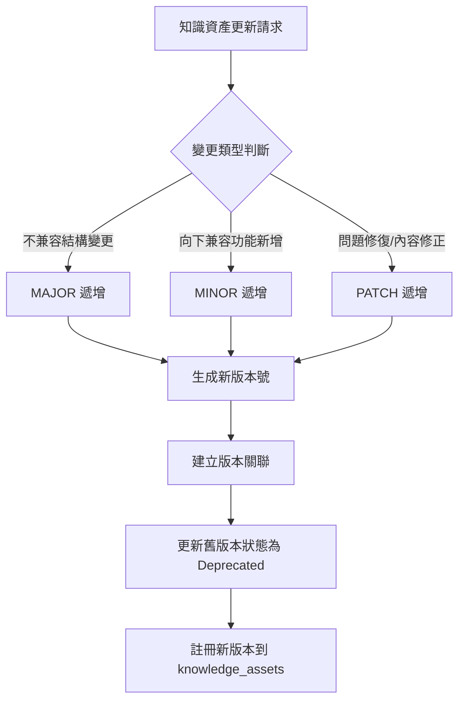
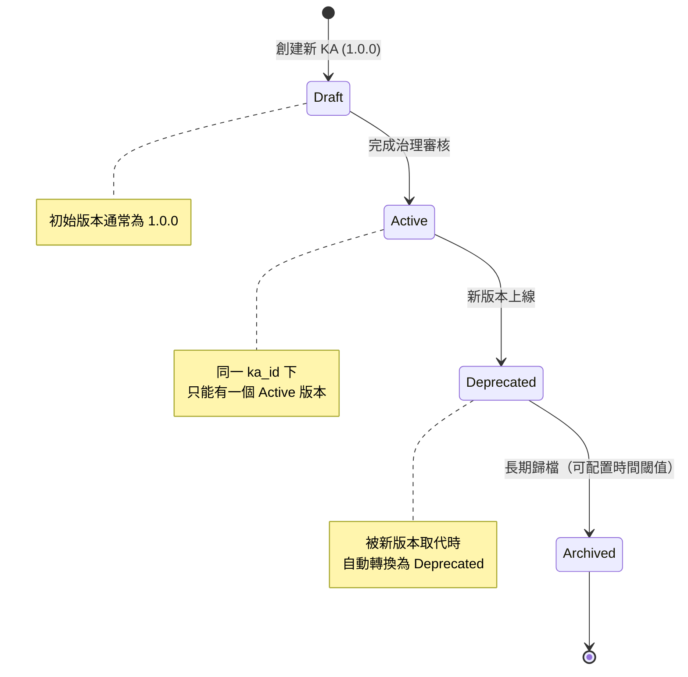

# Knowledge Asset 版本號規範

> **文件狀態**: 工程開發實施指南  
> **文檔版本**: v1.0  
> **最後更新**: 2026-01-25 10:30 UTC+8  
> **維護人**: Daniel Chung  
> **對齊系統**: KA-Agent 規格書 v1.4.1

---

## 1. 規範目的與範圍

本規範定義 **Knowledge Asset (KA)** 的版本號管理規則，確保：

- 版本號的唯一性與可追溯性
- 版本關聯關係的正確維護
- 版本狀態轉換的合法性
- 多版本並存與檢索的支援

**適用範圍**：
- `knowledge_assets` collection 中的所有文檔
- KA-Agent 的版本管理邏輯
- `ka.retrieve` 與 `ka.list` MCP 介面

---

## 2. 版本號格式規範

### 2.1 SemVer 格式

KA 版本號必須遵循 **Semantic Versioning (SemVer) 2.0.0** 規範：

```
MAJOR.MINOR.PATCH
```

**格式說明**：

| 部分 | 說明 | 範例 | 遞增條件 |
|------|------|------|---------|
| `MAJOR` | 主版本號 | `1`, `2`, `3` | 不兼容的 API 變更、重大架構調整 |
| `MINOR` | 次版本號 | `0`, `1`, `2` | 向下兼容的功能新增、內容擴充 |
| `PATCH` | 修補版本號 | `0`, `1`, `2` | 向下兼容的問題修復、內容修正 |

**格式約束**：
- 必須為非負整數
- 不允許前導零（例如：`01.0.0` 無效）
- 不允許預發布標識（例如：`1.0.0-alpha` 暫不支持）
- 不允許構建元數據（例如：`1.0.0+20260125` 暫不支持）

**有效範例**：
- `1.0.0` ✅
- `2.1.5` ✅
- `0.1.0` ✅

**無效範例**：
- `1.0` ❌（缺少 PATCH）
- `v1.0.0` ❌（不允許前綴）
- `1.0.0-alpha` ❌（暫不支持預發布）
- `01.0.0` ❌（前導零）

### 2.2 版本號與 `_key` 的關係

`knowledge_assets` collection 的 `_key` 格式為：

```
KA-{ka_id}-{version}
```

**範例**：
- `KA-PRODUCT-MANUAL-001-1.0.0`
- `KA-PRODUCT-MANUAL-001-2.0.0`
- `KA-PRODUCT-MANUAL-001-2.1.0`

**唯一性約束**：
- `_key` 在 ArangoDB 中必須唯一
- 複合索引 `["ka_id", "version"]` 確保同一 `ka_id` 下 `version` 唯一

---

## 3. 版本號遞增規則

### 3.1 MAJOR 版本遞增

**觸發條件**（滿足任一即可）：

1. **不兼容的結構變更**：
   - `vector_refs` 結構重大調整
   - `graph_refs` 結構重大調整
   - `domain` 或 `major` 變更（對標 Ontology 層級變更）

2. **知識內容的重大重構**：
   - 知識領域（domain）變更
   - 專業層（major）變更
   - 知識架構的根本性調整

3. **授權或治理變更**：
   - `license` 從 `PUBLIC` 變更為 `PROPRIETARY`
   - `security_group` 變更導致存取控制規則根本性改變

**範例**：
- `1.0.0` → `2.0.0`：domain 從 `domain-enterprise` 變更為 `domain-administration`

### 3.2 MINOR 版本遞增

**觸發條件**（滿足任一即可）：

1. **向下兼容的功能新增**：
   - 新增 `file_refs` 中的文件（不刪除舊文件）
   - 擴充 `vector_refs` 的 partitions
   - 擴充 `graph_refs` 的 entities

2. **知識內容擴充**：
   - 新增章節或內容（不修改既有內容）
   - 新增實體或關係（不刪除既有實體/關係）

3. **元數據擴充**：
   - 更新 `description`（更詳細的說明）
   - 新增 `sensitivity_labels`

**範例**：
- `1.0.0` → `1.1.0`：新增文件到 `file_refs`，擴充知識內容
- `2.0.0` → `2.1.0`：新增實體類型到圖譜

### 3.3 PATCH 版本遞增

**觸發條件**（滿足任一即可）：

1. **問題修復**：
   - 修正向量化錯誤（重新生成 embeddings）
   - 修正圖譜提取錯誤（重新提取 entities/relations）
   - 修正元數據錯誤（如 `description` 拼寫錯誤）

2. **內容修正**：
   - 修正文件內容錯誤（不改變結構）
   - 修正實體/關係的屬性值

3. **元數據修正**：
   - 修正 `owner`、`tenant_id` 等欄位錯誤
   - 修正 `validity_scope` 的配置錯誤

**範例**：
- `1.0.0` → `1.0.1`：修正向量化錯誤，重新生成 embeddings
- `2.1.0` → `2.1.1`：修正圖譜中實體屬性的錯誤

### 3.4 版本號遞增決策流程



---

## 4. 版本關聯規則

### 4.1 版本關聯欄位

每個 KA 版本必須維護以下版本關聯欄位：

| 欄位 | 類型 | 說明 | 範例 |
|------|------|------|------|
| `supersedes` | array[string] | 此版本取代的舊版本列表 | `["1.0.0", "1.1.0"]` |
| `superseded_by` | string \| null | 被哪個新版本取代（如果已棄用） | `"2.0.0"` 或 `null` |
| `version_history` | array[object] | 版本歷史記錄 | 見 4.2 節 |

### 4.2 版本歷史記錄結構

`version_history` 欄位記錄所有版本的狀態變更歷史：

```python
{
    "version_history": [
        {
            "version": "1.0.0",
            "state": "Deprecated",
            "deprecated_at": "2026-01-20T10:00:00Z",
            "deprecated_reason": "Superseded by 2.0.0",
            "superseded_by": "2.0.0"
        },
        {
            "version": "2.0.0",
            "state": "Active",
            "activated_at": "2026-01-25T10:00:00Z",
            "activated_by": "user_123"
        }
    ]
}
```

### 4.3 版本關聯建立規則

**規則 1：新版本建立時**：

1. 查詢所有 `lifecycle_state == "Active"` 且 `ka_id` 相同的舊版本
2. 將這些舊版本的 `version` 加入新版本的 `supersedes` 陣列
3. 將這些舊版本的 `superseded_by` 設為新版本的 `version`
4. 將這些舊版本的 `lifecycle_state` 更新為 `Deprecated`
5. 在新版本的 `version_history` 中記錄所有版本的狀態變更

**規則 2：版本關聯不可循環**：

- `supersedes` 中的版本不能包含自己
- `superseded_by` 不能指向自己
- 不能形成循環引用（例如：A → B → C → A）

**規則 3：版本關聯不可斷裂**：

- 如果版本 A 被版本 B 取代，版本 B 被版本 C 取代，則版本 A 的 `superseded_by` 應更新為版本 C（或保留為 B，視業務需求而定）

---

## 5. 版本狀態轉換規則

### 5.1 版本狀態與版本號的關係

版本狀態（`lifecycle_state`）與版本號的關係：

| 狀態 | 版本號特徵 | 說明 |
|------|-----------|------|
| `Draft` | 初始版本（通常為 `1.0.0`） | 草稿狀態，尚未完成治理審核 |
| `Active` | 最新版本或指定版本 | 活躍狀態，可供 Agent 使用 |
| `Deprecated` | 被新版本取代的舊版本 | 已棄用，僅可檢索（歷史查詢） |
| `Archived` | 長期歸檔的版本 | 已歸檔，僅可檢索（歷史查詢） |

### 5.2 版本狀態轉換流程



### 5.3 版本狀態轉換約束

**約束 1：同一 `ka_id` 下只能有一個 `Active` 版本**

- 當新版本建立並設為 `Active` 時，所有舊的 `Active` 版本必須轉為 `Deprecated`

**約束 2：版本號必須遞增**

- 新版本的版本號必須大於所有舊版本的版本號
- 使用 SemVer 比較規則：`2.0.0 > 1.9.9 > 1.0.0`

**約束 3：狀態轉換必須記錄審計日誌**

- 所有狀態轉換必須記錄到 `audit_logs` collection
- 必須包含：`user_id`、`action`、`resource_id`、`from_state`、`to_state`、`reason`

---

## 6. 版本查詢與檢索規則

### 6.1 `ka.retrieve` 版本參數

**MCP Capability**：`capability:ka.retrieve`

**版本參數**：
- `version`：指定版本號（string，可選）
  - 如果提供：返回指定版本的 KA
  - 如果不提供：返回最新 `Active` 版本的 KA

**查詢邏輯**：

```python
# 偽代碼
if version is provided:
    # 查詢指定版本
    ka = query_ka(ka_id=ka_id, version=version)
else:
    # 查詢最新 Active 版本
    ka = query_ka(
        ka_id=ka_id,
        lifecycle_state="Active",
        sort_by="version",
        order="DESC",
        limit=1
    )
```

**代碼路徑**：
- ArangoDB 查詢：`database/arangodb/client.py` → `ArangoDBClient.db.aql.execute()`
- 索引：使用 `idx_ka_id_version` 複合索引優化查詢

### 6.2 `ka.list` 版本過濾

**MCP Capability**：`capability:ka.list`

**版本相關參數**：
- `version`：版本號過濾（string，可選）
- `lifecycle_state`：生命週期狀態過濾（string，可選）
  - 可選值：`Draft`、`Active`、`Deprecated`、`Archived`

**查詢邏輯**：

```python
# 偽代碼
filters = {"is_active": True}  # 軟刪除過濾

if version:
    filters["version"] = version

if lifecycle_state:
    filters["lifecycle_state"] = lifecycle_state

# 查詢並排序（按版本號降序）
results = query_kas(filters, sort_by="version", order="DESC")
```

### 6.3 版本比較與排序

**SemVer 比較規則**：

1. 先比較 `MAJOR`，較大者版本號更大
2. 如果 `MAJOR` 相同，比較 `MINOR`，較大者版本號更大
3. 如果 `MINOR` 相同，比較 `PATCH`，較大者版本號更大

**範例**：
- `2.0.0 > 1.9.9 > 1.1.0 > 1.0.1 > 1.0.0`

**排序規則**：
- 預設按版本號降序（`DESC`）：最新版本在前
- 可選按版本號升序（`ASC`）：最舊版本在前

---

## 7. 實施指南

### 7.1 版本號生成邏輯

**代碼路徑**：`agents/builtin/knowledge_asset_agent/agent.py`（待創建）

**版本號生成函數**：

```python
from typing import Optional, List
import re

def generate_next_version(
    ka_id: str,
    change_type: str,  # "major" | "minor" | "patch"
    existing_versions: List[str]
) -> str:
    """
    生成下一個版本號
    
    Args:
        ka_id: Knowledge Asset ID
        change_type: 變更類型（major / minor / patch）
        existing_versions: 現有版本號列表（例如：["1.0.0", "1.1.0"]）
    
    Returns:
        下一個版本號（例如："1.2.0"）
    
    代碼路徑參考：
    - ArangoDB 查詢: database/arangodb/client.py
    """
    if not existing_versions:
        # 第一個版本
        return "1.0.0"
    
    # 找到最新版本
    latest_version = max(existing_versions, key=lambda v: _parse_semver(v))
    major, minor, patch = _parse_semver(latest_version)
    
    # 根據變更類型遞增
    if change_type == "major":
        return f"{major + 1}.0.0"
    elif change_type == "minor":
        return f"{major}.{minor + 1}.0"
    elif change_type == "patch":
        return f"{major}.{minor}.{patch + 1}"
    else:
        raise ValueError(f"Invalid change_type: {change_type}")

def _parse_semver(version: str) -> tuple[int, int, int]:
    """
    解析 SemVer 版本號
    
    Args:
        version: SemVer 版本號（例如："1.2.3"）
    
    Returns:
        (major, minor, patch) 元組
    """
    pattern = r"^(\d+)\.(\d+)\.(\d+)$"
    match = re.match(pattern, version)
    if not match:
        raise ValueError(f"Invalid SemVer format: {version}")
    return (int(match.group(1)), int(match.group(2)), int(match.group(3)))
```

### 7.2 版本關聯建立邏輯

**代碼路徑**：`agents/builtin/knowledge_asset_agent/agent.py`（待創建）

**版本關聯建立函數**：

```python
from typing import Dict, Any, List
from datetime import datetime

async def establish_version_relationships(
    db_client: ArangoDBClient,
    ka_id: str,
    new_version: str,
    user_id: str
) -> None:
    """
    建立版本關聯關係
    
    代碼路徑參考：
    - ArangoDBClient: database/arangodb/client.py
    - AuditLogService: services/api/services/audit_log_service.py
    """
    if db_client.db is None:
        raise RuntimeError("ArangoDB client is not connected")
    
    collection = db_client.db.collection("knowledge_assets")
    
    # 1. 查詢所有 Active 版本的舊版本
    aql = """
        FOR doc IN knowledge_assets
        FILTER doc.ka_id == @ka_id
        AND doc.lifecycle_state == "Active"
        AND doc.version != @new_version
        RETURN doc
    """
    cursor = db_client.db.aql.execute(
        aql,
        bind_vars={"ka_id": ka_id, "new_version": new_version}
    )
    old_active_versions = list(cursor)
    
    # 2. 收集舊版本號
    supersedes = [doc["version"] for doc in old_active_versions]
    
    # 3. 更新舊版本：設為 Deprecated，記錄 superseded_by
    now_iso = datetime.utcnow().isoformat() + "Z"
    for old_doc in old_active_versions:
        collection.update(
            {"_key": old_doc["_key"]},
            {
                "lifecycle_state": "Deprecated",
                "superseded_by": new_version,
                "updated_at": now_iso,
                "updated_by": user_id
            }
        )
        
        # 記錄審計日誌
        await audit_log_service.log(
            AuditLogCreate(
                user_id=user_id,
                action=AuditAction.KA_VERSION_DEPRECATED,
                resource_type="knowledge_asset",
                resource_id=old_doc["_key"],
                details={
                    "from_version": old_doc["version"],
                    "to_version": new_version,
                    "reason": "Superseded by new version"
                }
            )
        )
    
    # 4. 更新新版本：記錄 supersedes 和 version_history
    new_doc = collection.get(f"{ka_id}-{new_version}")
    if new_doc:
        version_history = new_doc.get("version_history", [])
        
        # 添加舊版本的歷史記錄
        for old_doc in old_active_versions:
            version_history.append({
                "version": old_doc["version"],
                "state": "Deprecated",
                "deprecated_at": now_iso,
                "deprecated_reason": f"Superseded by {new_version}",
                "superseded_by": new_version
            })
        
        # 添加新版本的歷史記錄
        version_history.append({
            "version": new_version,
            "state": "Active",
            "activated_at": now_iso,
            "activated_by": user_id
        })
        
        collection.update(
            {"_key": new_doc["_key"]},
            {
                "supersedes": supersedes,
                "version_history": version_history,
                "updated_at": now_iso
            }
        )
```

### 7.3 版本查詢邏輯

**代碼路徑**：`agents/builtin/knowledge_asset_agent/agent.py`（待創建）

**版本查詢函數**：

```python
from typing import Optional, Dict, Any

async def retrieve_ka_version(
    db_client: ArangoDBClient,
    ka_id: str,
    version: Optional[str] = None
) -> Optional[Dict[str, Any]]:
    """
    檢索指定版本的 KA，如果不提供版本則返回最新 Active 版本
    
    代碼路徑參考：
    - ArangoDBClient: database/arangodb/client.py
    """
    if db_client.db is None:
        raise RuntimeError("ArangoDB client is not connected")
    
    collection = db_client.db.collection("knowledge_assets")
    
    if version:
        # 查詢指定版本
        ka_key = f"{ka_id}-{version}"
        doc = collection.get(ka_key)
        if doc and doc.get("is_active", True):
            return doc
        return None
    else:
        # 查詢最新 Active 版本
        aql = """
            FOR doc IN knowledge_assets
            FILTER doc.ka_id == @ka_id
            AND doc.lifecycle_state == "Active"
            AND doc.is_active == true
            SORT doc.version DESC
            LIMIT 1
            RETURN doc
        """
        cursor = db_client.db.aql.execute(
            aql,
            bind_vars={"ka_id": ka_id}
        )
        results = list(cursor)
        return results[0] if results else None
```

---

## 8. 版本號驗證規則

### 8.1 格式驗證

**驗證規則**：

1. **格式檢查**：必須符合 `MAJOR.MINOR.PATCH` 格式
2. **數值檢查**：`MAJOR`、`MINOR`、`PATCH` 必須為非負整數
3. **前導零檢查**：不允許前導零

**驗證函數**：

```python
import re

def validate_version_format(version: str) -> bool:
    """
    驗證版本號格式
    
    Args:
        version: 版本號字符串
    
    Returns:
        是否有效
    """
    pattern = r"^(0|[1-9]\d*)\.(0|[1-9]\d*)\.(0|[1-9]\d*)$"
    return bool(re.match(pattern, version))

# 測試
assert validate_version_format("1.0.0") == True
assert validate_version_format("2.1.5") == True
assert validate_version_format("01.0.0") == False  # 前導零
assert validate_version_format("1.0") == False  # 格式不完整
```

### 8.2 唯一性驗證

**驗證規則**：

1. 同一 `ka_id` 下，`version` 必須唯一
2. 使用複合索引 `["ka_id", "version"]` 確保唯一性

**驗證邏輯**：

```python
async def validate_version_uniqueness(
    db_client: ArangoDBClient,
    ka_id: str,
    version: str
) -> bool:
    """
    驗證版本號唯一性
    
    代碼路徑參考：
    - ArangoDBClient: database/arangodb/client.py
    """
    if db_client.db is None:
        raise RuntimeError("ArangoDB client is not connected")
    
    collection = db_client.db.collection("knowledge_assets")
    
    # 查詢是否已存在
    ka_key = f"{ka_id}-{version}"
    existing = collection.get(ka_key)
    
    return existing is None  # 如果不存在則唯一
```

### 8.3 遞增驗證

**驗證規則**：

1. 新版本的版本號必須大於所有舊版本的版本號
2. 使用 SemVer 比較規則

**驗證函數**：

```python
def validate_version_increment(
    new_version: str,
    existing_versions: List[str]
) -> bool:
    """
    驗證版本號遞增
    
    Args:
        new_version: 新版本號
        existing_versions: 現有版本號列表
    
    Returns:
        是否有效遞增
    """
    if not existing_versions:
        return True  # 第一個版本，無需驗證
    
    new_major, new_minor, new_patch = _parse_semver(new_version)
    
    for existing_version in existing_versions:
        existing_major, existing_minor, existing_patch = _parse_semver(existing_version)
        
        # 比較版本號
        if (new_major, new_minor, new_patch) <= (existing_major, existing_minor, existing_patch):
            return False  # 新版本號必須大於所有舊版本
    
    return True
```

---

## 9. 版本號查詢索引

### 9.1 必要索引

在 `knowledge_assets` collection 中，版本號相關的索引包括：

| 索引名稱 | 欄位 | 類型 | 說明 |
|---------|------|------|------|
| `idx_ka_id_version` | `["ka_id", "version"]` | persistent, unique | 確保同一 ka_id 下 version 唯一 |
| `idx_lifecycle_state` | `["lifecycle_state"]` | persistent | 用於過濾 Active 版本 |
| `idx_version` | `["version"]` | persistent | 用於版本排序 |

**代碼路徑**：`scripts/migration/create_schema.py`

**索引建立代碼**（已在 KA-Agent 規格書 12.1 節定義）：

```python
# 1. KA_ID + Version 唯一索引
collection.add_index({
    "type": "persistent",
    "fields": ["ka_id", "version"],
    "unique": True,
    "name": "idx_ka_id_version"
})

# 2. 生命週期狀態索引
collection.add_index({
    "type": "persistent",
    "fields": ["lifecycle_state"],
    "name": "idx_lifecycle_state"
})

# 3. 版本號索引（用於排序）
collection.add_index({
    "type": "persistent",
    "fields": ["version"],
    "name": "idx_version"
})
```

---

## 10. 版本號使用範例

### 10.1 創建初始版本

**場景**：創建新的 Knowledge Asset

```python
ka_id = "KA-PRODUCT-MANUAL-001"
version = "1.0.0"  # 初始版本
ka_key = f"{ka_id}-{version}"

ka_doc = {
    "_key": ka_key,
    "ka_id": ka_id,
    "version": version,
    "lifecycle_state": "Draft",
    "supersedes": [],  # 初始版本無舊版本
    "superseded_by": None,
    "version_history": [
        {
            "version": "1.0.0",
            "state": "Draft",
            "created_at": "2026-01-25T10:00:00Z"
        }
    ],
    # ... 其他欄位
}
```

### 10.2 建立新版本（MINOR 遞增）

**場景**：新增內容，向下兼容

```python
# 1. 查詢現有版本
existing_versions = ["1.0.0"]  # 假設只有一個版本

# 2. 生成新版本號
new_version = generate_next_version(
    ka_id="KA-PRODUCT-MANUAL-001",
    change_type="minor",  # 新增內容
    existing_versions=existing_versions
)
# 結果：new_version = "1.1.0"

# 3. 建立版本關聯
await establish_version_relationships(
    db_client=db_client,
    ka_id="KA-PRODUCT-MANUAL-001",
    new_version="1.1.0",
    user_id="user_123"
)

# 4. 註冊新版本
ka_doc = {
    "_key": "KA-PRODUCT-MANUAL-001-1.1.0",
    "ka_id": "KA-PRODUCT-MANUAL-001",
    "version": "1.1.0",
    "lifecycle_state": "Active",
    "supersedes": ["1.0.0"],  # 取代 1.0.0
    "superseded_by": None,
    "version_history": [
        {
            "version": "1.0.0",
            "state": "Deprecated",
            "deprecated_at": "2026-01-25T10:30:00Z",
            "superseded_by": "1.1.0"
        },
        {
            "version": "1.1.0",
            "state": "Active",
            "activated_at": "2026-01-25T10:30:00Z"
        }
    ],
    # ... 其他欄位
}
```

### 10.3 檢索指定版本

**場景**：檢索特定版本的 KA

```python
# 檢索版本 1.0.0
ka = await retrieve_ka_version(
    db_client=db_client,
    ka_id="KA-PRODUCT-MANUAL-001",
    version="1.0.0"
)

# 檢索最新 Active 版本（不指定 version）
ka = await retrieve_ka_version(
    db_client=db_client,
    ka_id="KA-PRODUCT-MANUAL-001",
    version=None  # 或不提供 version 參數
)
```

---

## 11. 版本號規範檢查清單

在實施版本號管理功能前，必須確保：

- [ ] 版本號格式驗證函數已實現（`validate_version_format`）
- [ ] 版本號唯一性驗證已實現（`validate_version_uniqueness`）
- [ ] 版本號遞增驗證已實現（`validate_version_increment`）
- [ ] 版本號生成邏輯已實現（`generate_next_version`）
- [ ] 版本關聯建立邏輯已實現（`establish_version_relationships`）
- [ ] 版本查詢邏輯已實現（`retrieve_ka_version`）
- [ ] ArangoDB 索引已建立（`idx_ka_id_version`、`idx_lifecycle_state`、`idx_version`）
- [ ] 審計日誌記錄已實現（版本狀態轉換時記錄）
- [ ] `ka.retrieve` MCP 介面支援 `version` 參數
- [ ] `ka.list` MCP 介面支援 `lifecycle_state` 過濾

---

## 12. 常見問題與解答

### Q1: 可以跳過版本號嗎？（例如：從 1.0.0 直接跳到 1.2.0）

**A**: 不建議。雖然技術上可行，但會導致版本歷史不連續，不利於追溯與審計。建議按順序遞增。

### Q2: 可以回退版本嗎？（例如：從 2.0.0 回退到 1.0.0）

**A**: 不允許。版本號必須單向遞增。如果需要回退內容，應建立新版本（例如：`2.0.1`）並在 `description` 中說明回退原因。

### Q3: 多個版本可以同時為 `Active` 嗎？

**A**: 不可以。同一 `ka_id` 下只能有一個 `Active` 版本。當新版本設為 `Active` 時，所有舊的 `Active` 版本必須轉為 `Deprecated`。

### Q4: 如何處理版本衝突？（例如：兩個用戶同時建立新版本）

**A**: 使用 ArangoDB 的唯一索引（`idx_ka_id_version`）防止衝突。如果兩個用戶同時建立相同版本號，後續操作會失敗並返回錯誤，需要重新生成版本號。

---

## 13. 更新記錄

| 日期 | 更新內容 | 更新人 |
|------|----------|--------|
| 2026-01-25 | v1.0：初始版本，定義 SemVer 格式、版本關聯規則、狀態轉換規則、實施指南。 | Daniel Chung |

---

## 14. 參考文檔

- [Semantic Versioning 2.0.0](https://semver.org/)
- [KA-Agent 規格書 v1.4.1](../KA-Agent-規格書.md)
- [Knowledge Service Layer Specification (KSLS)](./Knowledge%20Service%20Layer%20Specification%20(KSLS).md)

---

**文件版本**: v1.0  
**最後更新日期**: 2026-01-25 10:30 UTC+8  
**維護人**: Daniel Chung
