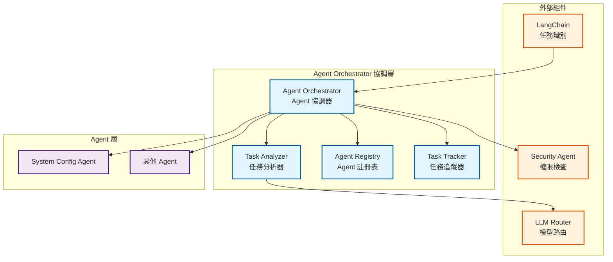
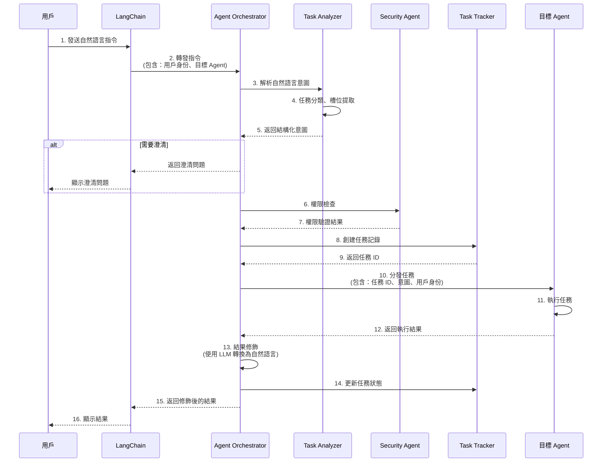
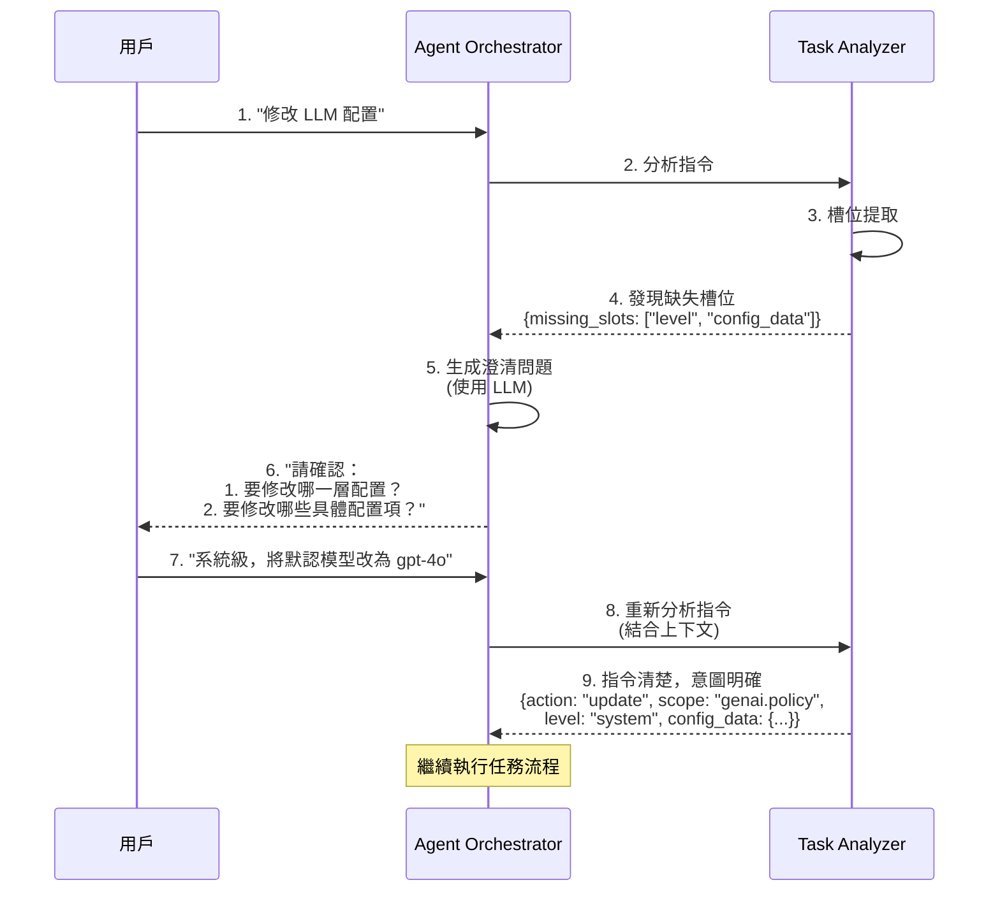
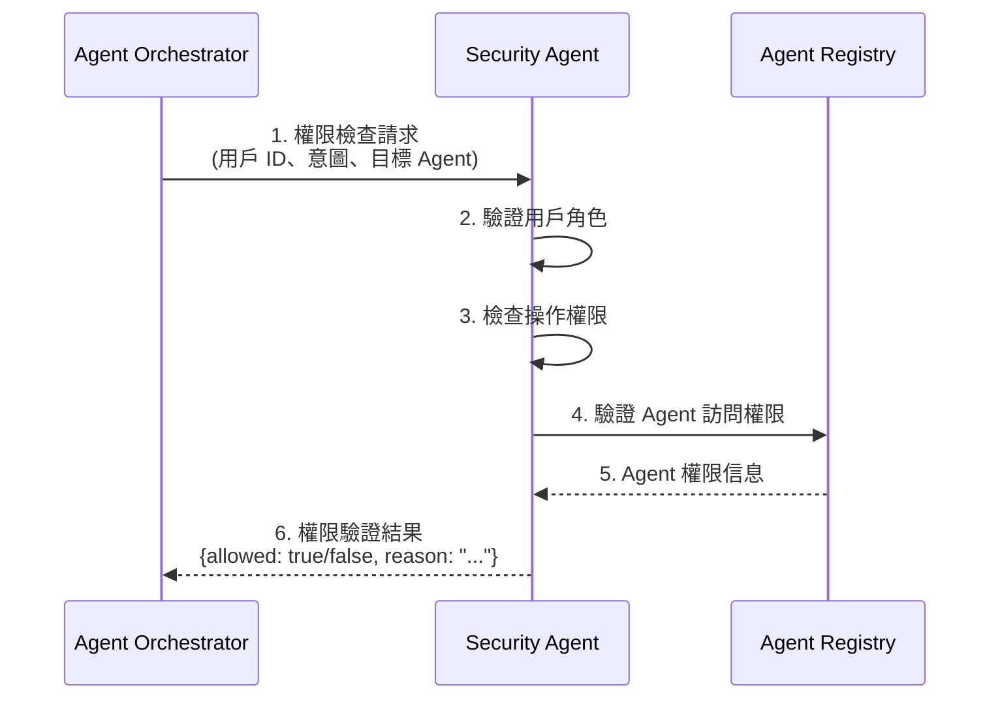
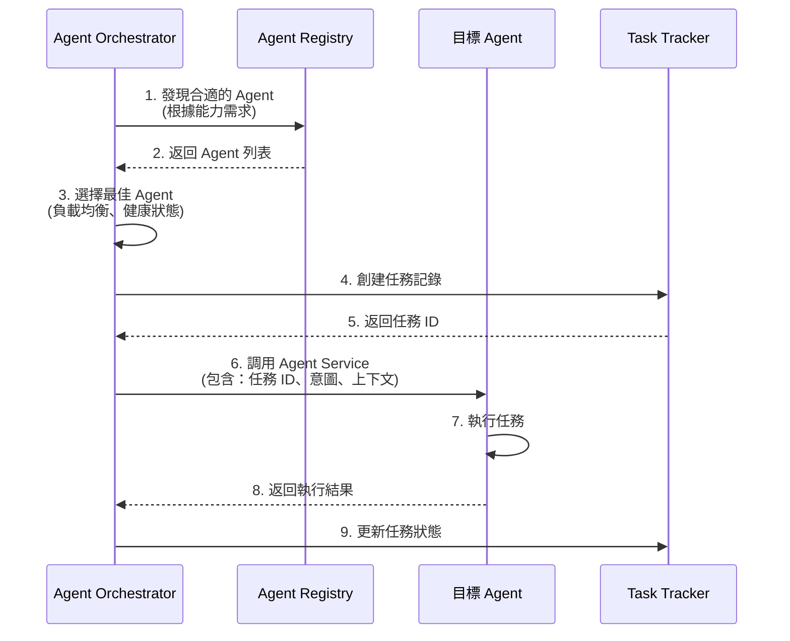
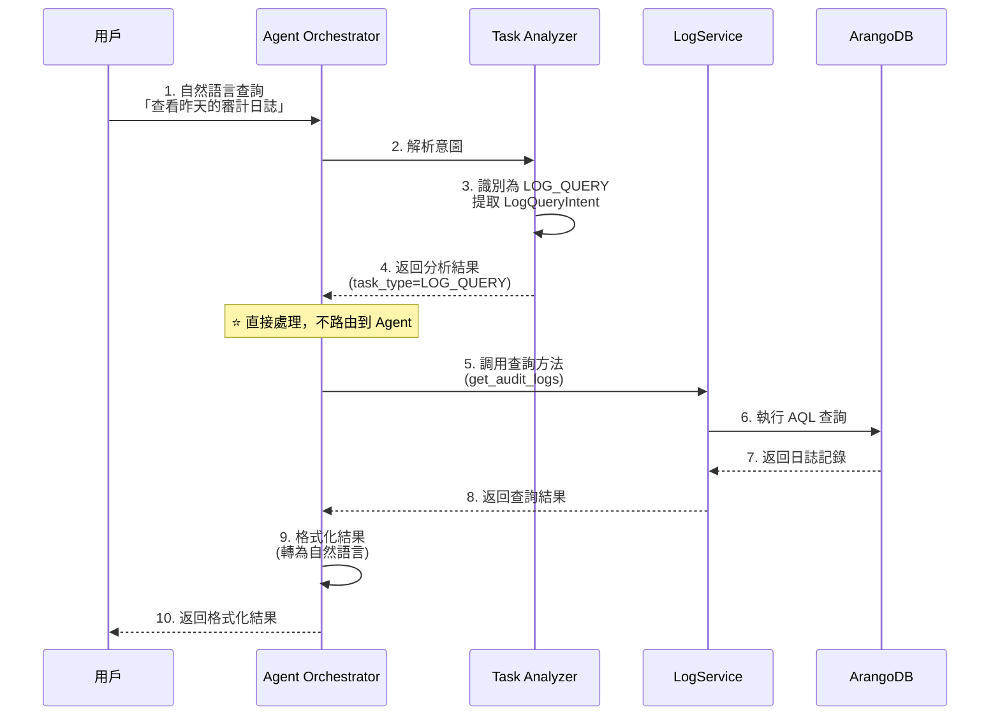
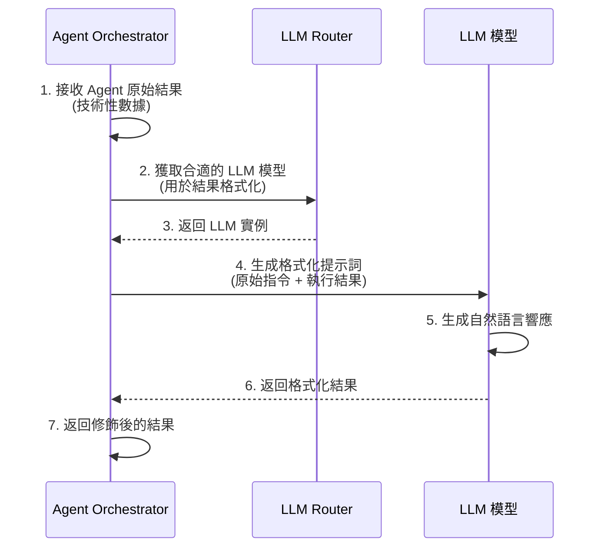
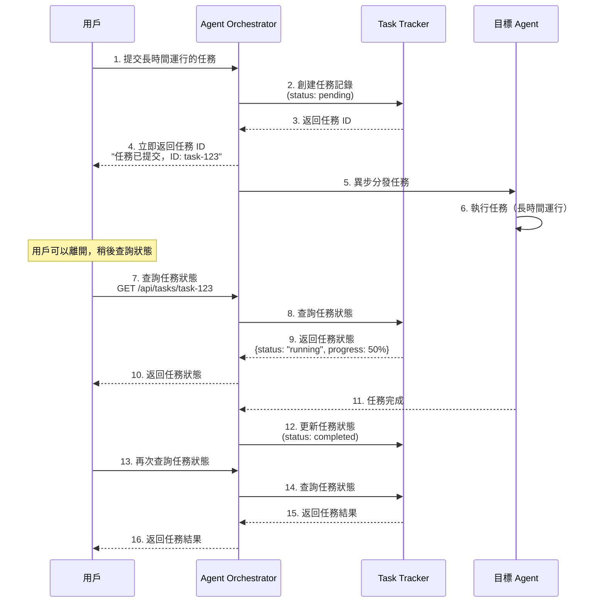

# Agent Orchestrator 協調層規格書

**版本**：1.1 → 1.2（v4 架構適配）
**創建日期**：2025-12-20
**創建人**：Daniel Chung
**最後修改日期**：2026-01-28 10:30:00 UTC+8

> **📋 相關文檔**：
>
> - [AI-Box-Agent-架構規格書.md](./AI-Box-Agent-架構規格書.md) - Agent 架構總體設計（內部版本 v4.0）
> - **[AI-Box 語義與任務工程-設計說明書-v4.md](../語義與任務分析/AI-Box 語義與任務工程-設計說明書-v4.md)** ⭐ **新增** - v4 架構完整設計說明（**必讀**：了解 v4 架構的 5 層處理流程）
> - [Security-Agent-規格書.md](./Security-Agent-規格書.md) - Security Agent 詳細規格（**必讀**：了解權限檢查流程）
> - [System-Config-Agent-規格書.md](./System-Config-Agent-規格書.md) - System Config Agent 詳細規格
> - [LogService-規格書.md](./Tools/LogService-規格書.md) - LogService 統一日誌服務規格（**必讀**：了解日誌記錄機制）
> - [ConfigMetadata-配置元數據機制規格書.md](./Tools/ConfigMetadata-配置元數據機制規格書.md) - 配置元數據機制規格（**必讀**：了解配置驗證機制）
>
> **⚠️ 架構升級說明**：
>
> - 本文檔正在適配 **v4 架構（5層處理流程）**
> - v4 架構詳細說明請參考：[AI-Box 語義與任務工程-設計說明書-v4.md](../語義與任務分析/AI-Box 語義與任務工程-設計說明書-v4.md)
> - 當前狀態：v3 架構已實現，v4 架構正在實施中

---

## 目錄

1. [概述](#1-概述)
2. [架構設計](#2-架構設計)
3. [核心組件](#3-核心組件)
4. [功能設計](#4-功能設計)
5. [系統流程](#5-系統流程)
6. [接口設計](#6-接口設計)
7. [實現計劃](#7-實現計劃)

---

## 1. 概述

### 1.1 定位

**Agent Orchestrator（協調層）**是 AI-Box Agent 系統的核心協調中心，位於三層架構的第一層，負責：

- **任務分析與意圖理解**：解析自然語言指令，理解用戶意圖（v4: L1-L2）
- **能力映射與任務規劃**：匹配 Agent 能力，生成任務執行計劃（v4: L3）
- **策略檢查與約束驗證**：執行前的權限、風險、策略檢查（v4: L4）
- **Agent 管理與發現**：管理 Agent 註冊、發現、健康監控
- **任務路由與分發**：根據任務需求選擇合適的 Agent 並分發任務
- **執行與觀察**：任務執行和結果觀察（v4: L5）
- **結果聚合與修飾**：收集 Agent 執行結果，轉換為友好的自然語言響應
- **異步任務追蹤**：支持長時間運行的任務，提供狀態查詢

**v4 架構對應**：

| v4 層級 | Orchestrator 職責 | 狀態 |
|---------|------------------|------|
| **L1: Semantic Understanding** | 語義理解（Task Analyzer） | ✅ 已實現基礎 |
| **L2: Intent & Task Abstraction** | 意圖抽象（Task Analyzer） | ⚠️ 需擴展 |
| **L3: Capability Mapping & Planning** | 能力映射與任務規劃（Decision Engine） | ✅ 已實現基礎 |
| **L4: Policy & Constraint** | 策略檢查與約束驗證（Policy Service） | ❌ 需新建 |
| **L5: Execution + Observation** | 任務執行與觀察（Orchestrator） | ✅ 已實現基礎 |

### 1.2 設計原則

1. **統一協調**：所有 Agent 調用都通過 Orchestrator
2. **智能理解**：通過 Task Analyzer 理解自然語言指令
3. **職責分離**：協調層專注於協調，不執行具體業務邏輯
4. **異步支持**：支持異步任務執行和狀態追蹤
5. **無縫銜接**：與專屬服務層和業務執行層無縫集成

### 1.3 架構位置

```
┌─────────────────────────────────────────────────────────┐
│  第一層：協調層（Agent Orchestrator）                    │
│  ┌──────────────────────────────────────────────────┐   │
│  │  Task Analyzer（任務分析器）                     │   │
│  │  - L1: 語義理解（Semantic Understanding）        │   │
│  │  - L2: 意圖抽象（Intent & Task Abstraction）     │   │
│  │  - L3: 能力映射與任務規劃（Capability Mapping）  │   │
│  │  - L4: 策略檢查（Policy & Constraint）           │   │
│  └──────────────────────────────────────────────────┘   │
│  ┌──────────────────────────────────────────────────┐   │
│  │  Agent Registry（Agent 註冊表）                  │   │
│  │  - Agent 註冊與發現、健康監控                     │   │
│  └──────────────────────────────────────────────────┘   │
│  ┌──────────────────────────────────────────────────┐   │
│  │  Agent Orchestrator（Agent 協調器）              │   │
│  │  - L5: 任務執行與觀察（Execution + Observation）│   │
│  │  - 任務路由、分發、結果聚合                       │   │
│  └──────────────────────────────────────────────────┘   │
└─────────────────────────────────────────────────────────┘
                        ↓ 統一調用接口
┌─────────────────────────────────────────────────────────┐
│  第二層：專屬服務層（Dedicated Service Agents）        │
│  - Security Agent、Reports Agent、System Config Agent │
└─────────────────────────────────────────────────────────┘
                        ↓ 服務調用
┌─────────────────────────────────────────────────────────┐
│  第三層：業務執行層（Business Process Agents）          │
│  - HR Recruiting Agent、Finance Agent 等                │
└─────────────────────────────────────────────────────────┘
```

---

## 2. 架構設計

### 2.1 核心組件架構



### 2.2 數據流設計

```
自然語言指令
    ↓
Orchestrator 接收
    ↓
Task Analyzer 解析意圖
    ├── 任務分類
    ├── 槽位提取
    ├── 指令澄清檢查
    └── 生成結構化意圖
    ↓
Security Agent 權限檢查
    ↓
Agent Registry 發現合適的 Agent
    ↓
Task Tracker 創建任務記錄
    ↓
Orchestrator 分發任務給目標 Agent
    ↓
Agent 執行任務
    ↓
Orchestrator 收集結果
    ↓
結果修飾（使用 LLM 轉換為自然語言）
    ↓
返回給前端
```

---

## 3. 核心組件

### 3.1 Task Analyzer（任務分析器）

#### 3.1.1 職責

Task Analyzer 是 Orchestrator 的核心組件，負責：

1. **任務分類**：識別任務類型（配置操作、數據查詢、報告生成等）
2. **意圖識別**：理解用戶意圖（查詢、創建、更新、刪除等）
3. **槽位提取**：從自然語言中提取結構化參數
4. **指令澄清**：當指令不明確時，生成澄清問題
5. **Agent 匹配**：根據任務需求匹配合適的 Agent

#### 3.1.2 核心功能

**✅ 已實現**：

- 任務分類（`agents/task_analyzer/classifier.py`）
- 工作流選擇（`agents/task_analyzer/workflow_selector.py`）
- LLM 路由選擇（`agents/task_analyzer/llm_router.py`）

**❌ 需要新增**：

- 指令澄清機制（槽位提取、澄清問題生成）
- 意圖識別增強（支持配置操作、系統設置等）
- 前端指定 Agent 的驗證邏輯
- 配置操作專用解析（生成 `ConfigIntent`）

#### 3.1.3 數據模型

```python
from typing import Literal, Optional, Dict, Any, List
from pydantic import BaseModel

class TaskAnalysisRequest(BaseModel):
    """任務分析請求"""
    task: str  # 自然語言指令
    context: Optional[Dict[str, Any]] = None
    user_id: Optional[str] = None
    session_id: Optional[str] = None
    specified_agent_id: Optional[str] = None  # 前端指定的 Agent ID

class TaskAnalysisResult(BaseModel):
    """任務分析結果"""
    task_type: str  # 任務類型
    workflow_type: str  # 工作流類型（langchain/crewai/autogen/hybrid）
    suggested_agents: List[str]  # 建議的 Agent 列表
    intent: Optional[Dict[str, Any]] = None  # 結構化意圖（如 ConfigIntent）
    clarification_needed: bool = False
    clarification_question: Optional[str] = None
    missing_slots: List[str] = []
    confidence: float  # 分析置信度

class ConfigIntent(BaseModel):
    """配置操作意圖（由 Task Analyzer 生成）"""
    action: Literal["query", "create", "update", "delete", "list", "rollback"]
    scope: str  # 配置範圍，如 "genai.policy"
    level: Literal["system", "tenant", "user"]
    tenant_id: Optional[str] = None
    user_id: Optional[str] = None
    config_data: Optional[Dict[str, Any]] = None
    clarification_needed: bool = False
    clarification_question: Optional[str] = None
    missing_slots: List[str] = []
    original_instruction: str  # 保留原始指令
```

#### 3.1.4 Prompt 範本設計

**System Prompt 範本**：

這是提供給 LLM 的 System Prompt，用於實現配置操作意圖解析：

```
Role: 你是 AI-Box 的 Task Analyzer。
Objective: 分析管理員指令，提取系統設置所需的參數。

1. 識別動作 (Action):
   - query: 查詢配置、查看狀態、讀取設置
   - update: 修改、調整、變更、設定、改為
   - list: 列出、清單、有哪些

2. 提取層級 (Level):
   - system: 涉及「全系統」、「默認」、「全域」
   - tenant: 涉及「租戶」、「公司」、「Tenant ID」
   - user: 涉及「個人」、「特定用戶」

3. 定義範圍 (Scope):
   根據關鍵字歸類：
   - genai.policy (模型、限流)
   - llm.provider_config (API Key、端點)
   - ontology.base (知識架構)

輸出格式 (JSON): 必須嚴格遵守 ConfigIntent 格式。
若資訊不足，請標註 clarification_needed: true 並生成詢問。
```

**關鍵字歸類規則**：

| Scope | 關鍵字識別 |
|-------|-----------|
| `genai.policy` | 模型、限流、API 限流、rate_limit、allowed_providers、allowed_models、default_model、GenAI 策略 |
| `genai.model_registry` | 模型註冊表、模型列表、model registry |
| `genai.tenant_secrets` | API Key、密鑰、tenant secrets |
| `llm.provider_config` | LLM 提供商、API 端點、provider config、endpoint |
| `llm.moe_routing` | MoE 路由、模型路由、routing strategy |
| `ontology.base` | Base Ontology、基礎知識架構 |
| `ontology.domain` | Domain Ontology、領域知識架構 |
| `ontology.major` | Major Ontology、主要知識架構 |
| `system.security` | 安全配置、安全策略 |
| `system.storage` | 存儲配置、存儲路徑 |
| `system.logging` | 日誌配置、日誌級別 |

**實務運作範例**：

**輸入**：「幫我把租戶 A 的限流改為 500」

**輸出**：

```json
{
  "action": "update",
  "scope": "genai.policy",
  "level": "tenant",
  "tenant_id": "tenant_a",
  "config_data": {
    "rate_limit": 500
  },
  "clarification_needed": false,
  "original_instruction": "幫我把租戶 A 的限流改為 500"
}
```

#### 3.1.5 實現設計

```python
class TaskAnalyzer:
    """任務分析器"""

    def __init__(self):
        self._classifier = TaskClassifier()
        self._workflow_selector = WorkflowSelector()
        self._llm_router = LLMRouter()
        self._intent_extractor = IntentExtractor()

    def analyze(self, request: TaskAnalysisRequest) -> TaskAnalysisResult:
        """
        分析任務並生成結構化意圖

        Args:
            request: 任務分析請求

        Returns:
            TaskAnalysisResult: 任務分析結果
        """
        # 1. 任務分類
        classification = self._classifier.classify(request.task)

        # 2. 工作流選擇
        workflow_type = self._workflow_selector.select_workflow(classification)

        # 3. 意圖提取
        intent = self._extract_intent(request, classification)

        # 4. 指令澄清檢查
        clarification_result = self._check_clarification(intent)

        # 5. Agent 匹配
        suggested_agents = self._match_agents(intent, classification)

        return TaskAnalysisResult(
            task_type=classification.task_type,
            workflow_type=workflow_type,
            suggested_agents=suggested_agents,
            intent=intent.dict() if intent else None,
            clarification_needed=clarification_result.needs_clarification,
            clarification_question=clarification_result.question,
            missing_slots=clarification_result.missing_slots,
            confidence=classification.confidence
        )

    def _extract_intent(
        self,
        request: TaskAnalysisRequest,
        classification: TaskClassificationResult
    ) -> Optional[BaseModel]:
        """提取結構化意圖"""
        # 如果是配置操作，生成 ConfigIntent
        if self._is_config_operation(classification):
            return self._extract_config_intent(request.task, classification)

        # 其他類型的意圖提取...
        return None

    def _is_config_operation(self, classification: TaskClassificationResult) -> bool:
        """判斷是否為配置操作"""
        config_keywords = ["配置", "設置", "系統設置", "config", "setting"]
        task_lower = classification.task.lower()
        return any(keyword in task_lower for keyword in config_keywords)

    def _extract_config_intent(
        self,
        instruction: str,
        classification: TaskClassificationResult
    ) -> ConfigIntent:
        """提取配置操作意圖（使用 LLM）"""
        # 使用 LLM Router 調用合適的模型
        llm = self._llm_router.get_model("intent_extraction")

        # 構建 System Prompt（詳細版本）
        system_prompt = """
Role: 你是 AI-Box 的 Task Analyzer。
Objective: 分析管理員指令，提取系統設置所需的參數。

## 1. 識別動作 (Action)

- **query**: 查詢配置、查看狀態、讀取設置、顯示、查看、查詢
- **create**: 創建、新增、建立
- **update**: 修改、調整、變更、設定、改為、更新、設置
- **delete**: 刪除、移除、清除
- **list**: 列出、清單、有哪些、顯示所有
- **rollback**: 復原、回滾、撤銷、取消、恢復

## 2. 提取層級 (Level)

- **system**: 涉及「全系統」、「默認」、「全域」、「系統級」、「系統默認」
- **tenant**: 涉及「租戶」、「公司」、「Tenant ID」、「租戶級」、「tenant_xxx」
- **user**: 涉及「個人」、「特定用戶」、「用戶級」、「user_xxx」

## 3. 定義範圍 (Scope)

根據關鍵字歸類到對應的 scope：

- **genai.policy**: 模型、限流、API 限流、rate_limit、allowed_providers、allowed_models、default_model、GenAI 策略
- **genai.model_registry**: 模型註冊表、模型列表、model registry
- **genai.tenant_secrets**: API Key、密鑰、tenant secrets
- **llm.provider_config**: LLM 提供商、API 端點、provider config、endpoint
- **llm.moe_routing**: MoE 路由、模型路由、routing strategy
- **ontology.base**: Base Ontology、基礎知識架構、base ontology
- **ontology.domain**: Domain Ontology、領域知識架構、domain ontology
- **ontology.major**: Major Ontology、主要知識架構、major ontology
- **system.security**: 安全配置、安全策略、security policy
- **system.storage**: 存儲配置、存儲路徑、storage config
- **system.logging**: 日誌配置、日誌級別、logging config

## 4. 輸出格式要求

必須嚴格遵守 ConfigIntent 格式，返回 JSON：

```json
{
  "action": "query|create|update|delete|list|rollback",
  "scope": "genai.policy|llm.provider_config|ontology.base|...",
  "level": "system|tenant|user",
  "tenant_id": "tenant_xxx" | null,
  "user_id": "user_xxx" | null,
  "config_data": {...} | null,
  "clarification_needed": true|false,
  "clarification_question": "..." | null,
  "missing_slots": ["level", "config_data"] | [],
  "original_instruction": "原始指令"
}
```

## 5. 澄清機制

若資訊不足，請標註 `clarification_needed: true` 並生成 `clarification_question`。

常見缺失的槽位：

- **level**: 未明確指定是系統級、租戶級還是用戶級
- **scope**: 未明確指定配置範圍
- **config_data**: 更新操作時未明確指定要修改的具體配置項
- **tenant_id**: 租戶級操作時未指定租戶 ID
- **user_id**: 用戶級操作時未指定用戶 ID

## 6. 實務範例

**範例 1**：
指令：「幫我把租戶 A 的限流改為 500」
輸出：

```json
{
  "action": "update",
  "scope": "genai.policy",
  "level": "tenant",
  "tenant_id": "tenant_a",
  "config_data": {
    "rate_limit": 500
  },
  "clarification_needed": false,
  "original_instruction": "幫我把租戶 A 的限流改為 500"
}
```

**範例 2**：
指令：「查看系統的 LLM 配置」
輸出：

```json
{
  "action": "query",
  "scope": "genai.policy",
  "level": "system",
  "tenant_id": null,
  "user_id": null,
  "config_data": null,
  "clarification_needed": false,
  "original_instruction": "查看系統的 LLM 配置"
}
```

**範例 3**：
指令：「修改 LLM 配置」
輸出：

```json
{
  "action": "update",
  "scope": "genai.policy",
  "level": null,
  "tenant_id": null,
  "user_id": null,
  "config_data": null,
  "clarification_needed": true,
  "clarification_question": "請確認：1. 要修改哪一層配置？(系統級/租戶級/用戶級) 2. 要修改哪些具體配置項？",
  "missing_slots": ["level", "config_data"],
  "original_instruction": "修改 LLM 配置"
}
```

"""

        # 構建用戶提示詞
        user_prompt = f"""
分析以下配置操作指令，提取結構化意圖：

指令：{instruction}

請嚴格按照 System Prompt 的要求，返回符合 ConfigIntent 格式的 JSON。
"""

        # 調用 LLM（使用 System Prompt + User Prompt）
        response = llm.generate(
            system_prompt=system_prompt,
            user_prompt=user_prompt
        )

        # 解析並返回 ConfigIntent
        return ConfigIntent.parse_raw(response)

```

### 3.2 Agent Registry（Agent 註冊表）

#### 3.2.1 職責

Agent Registry 負責：

1. **Agent 註冊**：管理 Agent 的註冊信息
2. **Agent 發現**：根據能力需求發現合適的 Agent
3. **健康監控**：監控 Agent 的健康狀態
4. **負載均衡**：追蹤 Agent 負載，支持負載均衡

#### 3.2.2 核心功能

**✅ 已實現**：
- Agent 註冊機制（`agents/services/registry/registry.py`）
- Agent 發現機制（`agents/services/registry/discovery.py`）
- 健康監控（`agents/services/registry/health_monitor.py`）
- 權限管理（`agents/services/registry/models.py`）

**🔄 需要增強**：
- 安全審計與測試機制
- 負載均衡策略優化

### 3.3 Agent Orchestrator（Agent 協調器）

#### 3.3.1 職責

Agent Orchestrator 是協調層的核心，負責：

1. **任務規劃與 Todo 編排**：全面了解任務，分解為 todo 列表，處理重複任務並排定先後順序（⭐ **新增**，詳見 3.3.3 節）
2. **任務路由**：根據 Task Analyzer 的分析結果選擇合適的 Agent
3. **任務分發**：將任務分發給目標 Agent
4. **結果聚合**：收集 Agent 執行結果
5. **結果修飾**：使用 LLM 將技術性結果轉換為友好的自然語言
6. **異步任務管理**：管理長時間運行的任務
7. **⭐ 日誌查詢處理**：當識別為 LOG_QUERY 類型時，直接調用 LogService 執行查詢，不路由到 Agent（詳見 4.2 節）

#### 3.3.2 核心方法

```python
class AgentOrchestrator:
    """Agent 協調器"""

    def __init__(self, registry: Optional[Any] = None):
        self._registry = registry or get_agent_registry()
        self._discovery = AgentDiscovery(registry=self._registry)
        self._task_analyzer = TaskAnalyzer()  # ⭐ 集成 Task Analyzer
        self._task_tracker = TaskTracker()
        self._llm_router = get_llm_router()
        self._log_service = get_log_service()  # ⭐ 集成 LogService（詳見 LogService 規格書）

    async def process_natural_language_request(
        self,
        instruction: str,
        context: Optional[Dict[str, Any]] = None,
        user_id: Optional[str] = None,
        session_id: Optional[str] = None,
        specified_agent_id: Optional[str] = None
    ) -> TaskResult:
        """
        處理自然語言請求（完整流程）

        1. 使用 Task Analyzer 解析意圖
        2. 通過 Security Agent 檢查權限
        3. 發現合適的 Agent
        4. 創建任務記錄
        5. 分發任務給目標 Agent
        6. 收集結果並修飾
        7. 返回結果
        """
        # 0. 生成 trace_id（用於串聯整個請求的生命週期）
        trace_id = str(uuid.uuid4())

        # 記錄任務開始
        await self._log_service.log_task(
            trace_id=trace_id,
            actor=user_id,
            action="task_start",
            content={
                "instruction": instruction,
                "context": context,
                "specified_agent_id": specified_agent_id
            }
        )

        # 1. 解析自然語言意圖
        analysis_result = await self._task_analyzer.analyze(
            TaskAnalysisRequest(
                task=instruction,
                context=context,
                user_id=user_id,
                session_id=session_id,
                specified_agent_id=specified_agent_id
            )
        )

        # 記錄任務路由決策
        await self._log_service.log_task(
            trace_id=trace_id,
            actor=user_id,
            action="task_routing",
            content={
                "intent": analysis_result.intent,
                "suggested_agents": analysis_result.suggested_agents,
                "workflow_type": analysis_result.workflow_type,
                "confidence": analysis_result.confidence
            }
        )

        # 2.1 第一層預檢：格式與邊界驗證 ⭐ **新增**
        # 詳細說明請參考：[ConfigMetadata-配置元數據機制規格書.md](./Tools/ConfigMetadata-配置元數據機制規格書.md)
        if analysis_result.intent and analysis_result.suggested_agents:
            target_agent_id = analysis_result.suggested_agents[0]
            pre_check_result = await self._pre_check_config_intent(
                intent=analysis_result.intent,
                agent_id=target_agent_id
            )

            if not pre_check_result.valid:
                await self._log_service.log_task(
                    trace_id=trace_id,
                    actor=user_id,
                    action="pre_check_failed",
                    content={
                        "reason": pre_check_result.reason,
                        "intent": analysis_result.intent
                    }
                )
                return TaskResult(
                    status="validation_failed",
                    result={"error": pre_check_result.reason}
                )

        # 2.2 如果需要澄清，返回澄清問題
        if analysis_result.clarification_needed:
            return TaskResult(
                status="clarification_needed",
                result={
                    "clarification_question": analysis_result.clarification_question,
                    "missing_slots": analysis_result.missing_slots
                }
            )

        # 3. 權限檢查（通過 Security Agent）
        # ⭐ 關鍵判斷：安全過濾
        # 檢查該管理員是否擁有對應層級和租戶的修改權限
        # 詳細說明請參考：[Security-Agent-規格書.md](./Security-Agent-規格書.md)
        security_result = await self._check_permission(
            user_id=user_id,
            intent=analysis_result.intent,
            target_agents=analysis_result.suggested_agents,
            context={**(context or {}), "trace_id": trace_id}  # ⭐ 傳遞 trace_id
        )

        # 記錄權限檢查結果
        await self._log_service.log_task(
            trace_id=trace_id,
            actor=user_id,
            action="permission_check",
            content={
                "security_result": {
                    "allowed": security_result.allowed,
                    "risk_level": security_result.risk_level,
                    "requires_double_check": security_result.requires_double_check
                }
            }
        )

        if not security_result.allowed:
            return TaskResult(
                status="permission_denied",
                result={"error": security_result.reason}
            )

        # ⭐ 關鍵判斷：高風險操作需要二次確認
        if security_result.requires_double_check:
            return TaskResult(
                status="confirmation_required",
                result={
                    "confirmation_message": self._generate_confirmation_message(
                        analysis_result.intent,
                        security_result.risk_level
                    ),
                    "audit_context": security_result.audit_context
                }
            )

        # ⭐ 關鍵判斷：合規驗證（針對配置操作）
        # 如果是配置更新操作，檢查收斂規則
        if analysis_result.intent and analysis_result.intent.get("action") == "update":
            compliance_result = await self._validate_config_compliance(
                intent=analysis_result.intent,
                user_id=user_id
            )
            if not compliance_result.valid:
                return TaskResult(
                    status="compliance_check_failed",
                    result={"error": compliance_result.reason}
                )

        # 4. 發現合適的 Agent
        if specified_agent_id:
            target_agent_id = specified_agent_id
        else:
            target_agent_id = self._select_best_agent(analysis_result.suggested_agents)

        # 5. 創建任務記錄
        # ⭐ 關鍵判斷：異步執行
        # 在 Task Tracker 中創建任務，並準備在 ArangoDB 寫入審計日誌
        task_id = self._task_tracker.create_task(
            instruction=instruction,
            intent=analysis_result.intent,
            target_agent_id=target_agent_id,
            user_id=user_id
        )

        # 6. 分發任務給目標 Agent
        # ⭐ 關鍵：傳遞 audit_context 和 trace_id 給目標 Agent
        # 目標 Agent 可以使用 audit_context 和 trace_id 記錄審計日誌
        agent_result = await self._dispatch_task(
            task_id=task_id,
            agent_id=target_agent_id,
            intent=analysis_result.intent,
            context={
                **(context or {}),
                "audit_context": security_result.audit_context,  # ⭐ 傳遞審計上下文
                "trace_id": trace_id  # ⭐ 傳遞 trace_id
            }
        )

        # 7. 結果修飾（使用 LLM 轉換為自然語言）
        formatted_result = await self._format_result(
            agent_result=agent_result,
            original_instruction=instruction,
            intent=analysis_result.intent
        )

        # 8. 更新任務狀態
        self._task_tracker.update_task_status(task_id, "completed")

        # 9. 記錄任務完成
        await self._log_service.log_task(
            trace_id=trace_id,
            actor=user_id,
            action="task_completed",
            content={
                "final_status": "completed",
                "task_id": task_id,
                "target_agent_id": target_agent_id,
                "total_duration_ms": (datetime.utcnow() - start_time).total_seconds() * 1000
            }
        )

        return TaskResult(
            task_id=task_id,
            status="completed",
            result=formatted_result,
            trace_id=trace_id  # ⭐ 返回 trace_id，用於後續查詢
        )

    async def _format_result(
        self,
        agent_result: Dict[str, Any],
        original_instruction: str,
        intent: Optional[Dict[str, Any]] = None
    ) -> str:
        """使用 LLM 將技術性結果轉換為友好的自然語言"""
        llm = self._llm_router.get_model("result_formatting")

        prompt = f"""
        將以下技術性結果轉換為友好的自然語言響應：

        原始指令：{original_instruction}
        執行結果：{agent_result}

        請生成一個清晰、友好的自然語言響應，說明執行結果。
        """

        formatted = llm.generate(prompt)
        return formatted
```

#### 3.3.3 任務規劃與 Todo 編排 ⭐ **新增**

**功能概述**：

Orchestrator 提供完整的任務規劃與 todo 編排功能，能夠：
1. **全面了解任務**：使用 Task Analyzer 深度分析任務意圖、複雜度、風險等
2. **任務分解**：使用 Task Planner 將複雜任務分解為多個子任務（TaskDAG）
3. **Todo 編排**：將 TaskDAG 轉換為結構化的 TodoItem 列表
4. **去重處理**：自動識別重複滿足條件的任務，只保留優先級最高的
5. **優先級排序**：根據依賴關係、優先級、風險等級等因素排定執行順序

**核心方法**：

```python
async def plan_task(
    self,
    instruction: str,
    context: Optional[Dict[str, Any]] = None,
    user_id: Optional[str] = None,
) -> TaskPlan:
    """
    任務規劃：全面了解任務並編排 todo 列表

    流程：
    1. 使用 Task Analyzer 全面分析任務
    2. 使用 Task Planner 生成任務分解計劃（TaskDAG）
    3. 將 TaskDAG 轉換為 TodoItem 列表
    4. 去重和排序（處理重複滿足條件的任務）
    5. 生成完整的 TaskPlan

    Returns:
        TaskPlan 對象，包含排序後的 todo 列表
    """
```

**數據模型**：

```python
class TodoItem(BaseModel):
    """Todo 項目模型"""
    todo_id: str
    description: str
    agent_id: Optional[str]
    capability: Optional[str]
    priority: int  # 優先級（數字越大優先級越高）
    depends_on: List[str]  # 依賴的 Todo ID 列表
    estimated_duration: Optional[int]  # 預估執行時間（秒）
    status: str  # pending, in_progress, completed, failed
    metadata: Dict[str, Any]

class TaskPlan(BaseModel):
    """任務計劃模型"""
    plan_id: str
    instruction: str
    todos: List[TodoItem]  # Todo 列表（已排序）
    total_estimated_duration: Optional[int]
    reasoning: Optional[str]
    created_at: datetime
    metadata: Dict[str, Any]
```

**去重和排序規則**：

1. **去重規則**：
   - 如果多個 todo 滿足相同條件（相同的 `agent_id` + `capability`），只保留優先級最高的
   - 優先級計算：基礎優先級（根據複雜度）+ 風險加成 - 依賴懲罰

2. **排序規則**：
   - **拓撲排序**：考慮依賴關係，確保依賴項先執行
   - **優先級排序**：在相同層級內，按優先級排序（優先級高的先執行）
   - **層級計算**：根據依賴關係計算每個 todo 的層級（距離根節點的距離）

3. **優先級計算公式**：
   ```
   優先級 = 基礎優先級（high=10, mid=5, low=0）
          - 依賴數量 × 2（有依賴的優先級降低）
          + 風險加成（高風險任務 +5）
   ```

4. **執行時間估算**：
   ```
   預估時間 = 基礎時間（high=300s, mid=60s, low=10s）
           + 依賴數量 × 30s
   ```

**使用範例**：

```python
# 規劃任務
orchestrator = AgentOrchestrator()
task_plan = await orchestrator.plan_task(
    instruction="幫我創建一個新的知識資產，並更新相關配置",
    context={"user_id": "user_123"},
    user_id="user_123"
)

# 查看 todo 列表
for todo in task_plan.todos:
    print(f"Todo {todo.todo_id}: {todo.description}")
    print(f"  - Agent: {todo.agent_id}")
    print(f"  - 優先級: {todo.priority}")
    print(f"  - 依賴: {todo.depends_on}")
    print(f"  - 預估時間: {todo.estimated_duration}s")

# 執行 todo（按順序）
for todo in task_plan.todos:
    if todo.status == "pending":
        result = await orchestrator.execute_task(
            task_id=todo.todo_id,
            agent_id=todo.agent_id
        )
```

**日誌記錄**：

所有規劃過程都會記錄詳細日誌：
- 任務分析完成
- 任務計劃生成
- Todo 列表生成
- 去重和排序完成
- 最終規劃結果

    async def _check_permission(
        self,
        user_id: str,
        intent: Optional[Dict[str, Any]],
        target_agents: List[str],
        context: Optional[Dict[str, Any]] = None
    ) -> SecurityCheckResult:
        """
        權限檢查（通過 Security Agent）

        ⭐ 關鍵判斷：安全過濾
        - 檢查該管理員是否擁有對應層級和租戶的修改權限
        - 例如：租戶級操作時，檢查是否擁有該租戶的權限

        詳細說明請參考：[Security-Agent-規格書.md](./Security-Agent-規格書.md)
        """
        # 調用 Security Agent 進行權限檢查
        security_result = await self._security_agent.verify_access(
            admin_id=user_id,
            intent=intent,
            context=context or {}
        )
        return security_result

    async def _pre_check_config_intent(
        self,
        intent: Dict[str, Any],
        agent_id: str
    ) -> ValidationResult:
        """
        第一層預檢：格式與邊界驗證

        ⭐ 關鍵判斷：快速止損
        - 檢查型別是否正確
        - 檢查數值是否在 min/max 內
        - 檢查選項是否在 options 列表中

        詳細說明請參考：[ConfigMetadata-配置元數據機制規格書.md](./Tools/ConfigMetadata-配置元數據機制規格書.md)

        Args:
            intent: ConfigIntent
            agent_id: 目標 Agent ID

        Returns:
            ValidationResult: 驗證結果
        """
        # 1. 獲取配置定義（從內存緩存，JSON 文件是唯一數據源）
        scope = intent.get("scope")
        if not scope:
            return ValidationResult(valid=False, reason="scope is required")

        definition = await self._get_config_definition(scope)
        if not definition:
            return ValidationResult(
                valid=False,
                reason=f"Config definition not found for scope: {scope}。請檢查 JSON 文件是否存在。"
            )

        # 2. 驗證每個配置字段
        config_data = intent.get("config_data", {})
        for field_name, field_value in config_data.items():
            if field_name not in definition.get("fields", {}):
                return ValidationResult(
                    valid=False,
                    reason=f"未知的配置字段：{field_name}"
                )

            field_def = definition["fields"][field_name]
            validation_result = self._validate_field(field_name, field_value, field_def)

            if not validation_result.valid:
                return validation_result

        return ValidationResult(valid=True)

    def _validate_field(
        self,
        field_name: str,
        field_value: Any,
        field_def: Dict[str, Any]
    ) -> ValidationResult:
        """驗證單個字段"""
        # 1. 類型檢查
        expected_type = field_def["type"]
        if not self._check_type(field_value, expected_type):
            return ValidationResult(
                valid=False,
                reason=f"{field_name} 的類型錯誤：期望 {expected_type}，實際 {type(field_value).__name__}"
            )

        # 2. 數值邊界檢查
        if expected_type == "integer" or expected_type == "number":
            if "min" in field_def and field_value < field_def["min"]:
                return ValidationResult(
                    valid=False,
                    reason=f"{field_name} ({field_value}) 小於最小值 {field_def['min']}"
                )
            if "max" in field_def and field_value > field_def["max"]:
                return ValidationResult(
                    valid=False,
                    reason=f"{field_name} ({field_value}) 大於最大值 {field_def['max']}"
                )

        # 3. 枚舉值檢查
        if "options" in field_def:
            if isinstance(field_value, list):
                # 數組類型：檢查每個元素
                invalid_values = [v for v in field_value if v not in field_def["options"]]
                if invalid_values:
                    return ValidationResult(
                        valid=False,
                        reason=f"{field_name} 包含無效值：{invalid_values}。允許的值：{field_def['options']}"
                    )
            else:
                # 單值類型：檢查值本身
                if field_value not in field_def["options"]:
                    return ValidationResult(
                        valid=False,
                        reason=f"{field_name} ({field_value}) 不在允許列表中。允許的值：{field_def['options']}"
                    )

        return ValidationResult(valid=True)

    def _check_type(self, value: Any, expected_type: str) -> bool:
        """檢查類型是否匹配"""
        type_map = {
            "integer": int,
            "number": (int, float),
            "string": str,
            "boolean": bool,
            "array": list,
            "object": dict
        }
        expected = type_map.get(expected_type)
        if expected is None:
            return True  # 未知類型，跳過檢查

        if isinstance(expected, tuple):
            return isinstance(value, expected)
        return isinstance(value, expected)

    async def _get_config_definition(self, scope: str) -> Optional[Dict[str, Any]]:
        """
        獲取配置定義（只從內存緩存讀取）

        JSON 文件是唯一數據源，啟動時已加載到內存緩存。
        不再從 ArangoDB 讀取備用，避免讀到舊數據。

        實現詳見 ConfigMetadata 規格書
        """
        # 從內存緩存讀取（JSON 文件是唯一數據源）
        definition = self._definition_loader.get_definition(scope)

        if not definition:
            logger.error(
                f"配置定義缺失: {scope}，請檢查 JSON 文件是否存在",
                scope=scope
            )

        return definition
```

### 3.4 Task Tracker（任務追蹤器）

#### 3.4.1 職責

Task Tracker 負責：

1. **任務記錄**：創建和管理任務記錄
2. **狀態追蹤**：追蹤任務執行狀態
3. **異步支持**：支持長時間運行的任務
4. **狀態查詢**：提供任務狀態查詢 API

#### 3.4.2 數據模型

```python
class TaskRecord(BaseModel):
    """任務記錄"""
    task_id: str
    instruction: str
    intent: Optional[Dict[str, Any]] = None
    target_agent_id: str
    user_id: str
    status: TaskStatus  # pending/running/completed/failed
    created_at: datetime
    updated_at: datetime
    result: Optional[Dict[str, Any]] = None
    error: Optional[str] = None
```

---

## 4. 功能設計

### 4.1 自然語言處理流程

#### 4.1.1 完整流程



#### 4.1.2 指令澄清流程



### 4.2 權限檢查流程



### 4.3 任務分發流程



### 4.2 日誌查詢功能設計

#### 4.2.1 設計原則

**⭐ 為什麼使用 Function/Tool 模式而不是獨立 Agent？**

日誌查詢功能採用 **Function/Tool 模式**，在 Orchestrator 中直接處理，而不創建獨立的 Log Query Agent。原因如下：

1. **職責定位**：日誌查詢是查詢操作，不是業務邏輯執行，不需要 Agent 的複雜處理能力
2. **架構簡化**：避免重複解析（Task Analyzer 已經解析了一次，不需要 Agent 再次解析）
3. **性能優化**：減少一層調用開銷（直接調用 LogService，不需要經過 Agent 層）
4. **符合設計原則**：符合 Function/Tool 模式的設計原則（查詢類操作應該作為工具函數）

#### 4.2.2 實現架構



#### 4.2.3 核心流程

1. **Task Analyzer 識別**：
   - 識別任務類型為 `LOG_QUERY`
   - 提取 `LogQueryIntent`（包含 log_type、actor、時間範圍等）

2. **Orchestrator 直接處理**：
   - 檢查 `task_type == LOG_QUERY`
   - 調用 `_handle_log_query()` 方法
   - 根據 `LogQueryIntent` 調用對應的 LogService 查詢方法

3. **LogService 執行查詢**：
   - `get_logs_by_trace_id()` - 根據 trace_id 查詢
   - `get_audit_logs()` - 查詢審計日誌
   - `get_security_logs()` - 查詢安全日誌

4. **結果格式化**：
   - 使用 `_format_log_query_result()` 將結構化結果轉換為自然語言

#### 4.2.4 支持的查詢類型

| 查詢類型 | 自然語言示例 | LogService 方法 |
|---------|-------------|----------------|
| **trace_id 查詢** | 「查看 trace_id 為 xxx 的所有日誌」 | `get_logs_by_trace_id()` |
| **審計日誌** | 「查看昨天的審計日誌」、「顯示用戶 admin 的所有配置變更」 | `get_audit_logs()` |
| **安全日誌** | 「查看最近一週的安全日誌」、「顯示所有被攔截的操作」 | `get_security_logs()` |
| **任務日誌** | 「查看 trace_id 為 xxx 的任務流程」（通過 trace_id） | `get_logs_by_trace_id()` |

#### 4.2.5 時間範圍識別

Task Analyzer 支持以下時間表達的識別：

- **相對時間**：昨天、今天、最近 N 天/週/月
- **絕對時間**：上週、本月、本週（需要擴展）
- **時間範圍**：從 X 到 Y（需要擴展）

#### 4.2.6 實現位置

- **Task Analyzer 擴展**：`agents/task_analyzer/analyzer.py` - `_extract_log_query_intent()` 方法
- **Orchestrator 處理**：`agents/services/orchestrator/orchestrator.py` - `process_natural_language_request()` 和 `_handle_log_query()` 方法
- **數據模型**：`agents/task_analyzer/models.py` - `LogQueryIntent` 類

### 4.3 任務路由流程

### 4.4 結果修飾流程



---

## 5. 系統流程

### 5.1 System Config Agent 協作流程

**詳細流程請參考**：[System-Config-Agent-規格書.md](./System-Config-Agent-規格書.md) 第 2 章「系統流程」

**關鍵要點**：

1. **Orchestrator 接收指令**：從 LangChain 接收自然語言指令
2. **Task Analyzer 解析意圖**：使用詳細的 System Prompt 生成結構化的 `ConfigIntent`
3. **Security Agent 權限檢查**：⭐ **安全過濾** - 驗證用戶是否有配置操作權限
4. **合規驗證**：⭐ **合規驗證** - 檢查配置值是否違反收斂規則（如租戶配置不能超過系統級限制）
5. **任務分發**：將 `ConfigIntent` 傳遞給 System Config Agent
6. **異步執行**：⭐ **異步執行** - 在 Task Tracker 中創建任務，並在 ArangoDB 寫入審計日誌
7. **結果修飾**：將 System Config Agent 的技術性結果轉換為友好的自然語言

**設計理念**：

這樣的流程設計，讓系統既保持了「簡單對話」的外在，又擁有「極度嚴謹」的內在：

- ✅ **簡單對話**：管理員只需用自然語言描述需求
- ✅ **極度嚴謹**：內部的安全過濾、合規驗證、審計追蹤確保系統安全

### 5.2 異步任務支持



---

### 4.2 日誌查詢功能設計

#### 4.2.1 設計原則

**⭐ 為什麼使用 Function/Tool 模式而不是獨立 Agent？**

日誌查詢功能採用 **Function/Tool 模式**，在 Orchestrator 中直接處理，而不創建獨立的 Log Query Agent。原因如下：

1. **職責定位**：日誌查詢是查詢操作，不是業務邏輯執行，不需要 Agent 的複雜處理能力
2. **架構簡化**：避免重複解析（Task Analyzer 已經解析了一次，不需要 Agent 再次解析）
3. **性能優化**：減少一層調用開銷（直接調用 LogService，不需要經過 Agent 層）
4. **符合設計原則**：符合 Function/Tool 模式的設計原則（查詢類操作應該作為工具函數）

#### 4.2.2 實現架構


#### 4.2.3 核心流程

1. **Task Analyzer 識別**：
   - 識別任務類型為 `LOG_QUERY`
   - 提取 `LogQueryIntent`（包含 log_type、actor、時間範圍等）

2. **Orchestrator 直接處理**：
   - 檢查 `task_type == LOG_QUERY`
   - 調用 `_handle_log_query()` 方法
   - 根據 `LogQueryIntent` 調用對應的 LogService 查詢方法

3. **LogService 執行查詢**：
   - `get_logs_by_trace_id()` - 根據 trace_id 查詢
   - `get_audit_logs()` - 查詢審計日誌
   - `get_security_logs()` - 查詢安全日誌

4. **結果格式化**：
   - 使用 `_format_log_query_result()` 將結構化結果轉換為自然語言

#### 4.2.4 支持的查詢類型

| 查詢類型 | 自然語言示例 | LogService 方法 |
|---------|-------------|----------------|
| **trace_id 查詢** | 「查看 trace_id 為 xxx 的所有日誌」 | `get_logs_by_trace_id()` |
| **審計日誌** | 「查看昨天的審計日誌」、「顯示用戶 admin 的所有配置變更」 | `get_audit_logs()` |
| **安全日誌** | 「查看最近一週的安全日誌」、「顯示所有被攔截的操作」 | `get_security_logs()` |
| **任務日誌** | 「查看 trace_id 為 xxx 的任務流程」（通過 trace_id） | `get_logs_by_trace_id()` |

#### 4.2.5 時間範圍識別

Task Analyzer 支持以下時間表達的識別：

- **相對時間**：昨天、今天、最近 N 天/週/月
- **絕對時間**：上週、本月、本週（需要擴展）
- **時間範圍**：從 X 到 Y（需要擴展）

#### 4.2.6 實現位置

- **Task Analyzer 擴展**：`agents/task_analyzer/analyzer.py` - `_extract_log_query_intent()` 方法
- **Orchestrator 處理**：`agents/services/orchestrator/orchestrator.py` - `process_natural_language_request()` 和 `_handle_log_query()` 方法
- **數據模型**：`agents/task_analyzer/models.py` - `LogQueryIntent` 類

---

## 6. 接口設計

### 6.1 自然語言處理接口

**`POST /api/v1/orchestrator/process`**

**請求**：

```json
{
  "instruction": "查看系統的 LLM 配置",
  "user_id": "admin_123",
  "session_id": "session-456",
  "context": {
    "tenant_id": null,
    "specified_agent_id": "system_config_agent"
  }
}
```

**響應**：

```json
{
  "task_id": "task-uuid-123",
  "status": "completed",
  "result": {
    "formatted_response": "系統的 GenAI 策略配置：\n- 允許的提供商：OpenAI、Anthropic\n- 默認模型：gpt-4o\n...",
    "raw_result": {
      "action": "query",
      "scope": "genai.policy",
      "level": "system",
      "config": {...}
    }
  }
}
```

### 6.2 任務狀態查詢接口

**`GET /api/v1/orchestrator/tasks/{task_id}`**

**響應**：

```json
{
  "task_id": "task-uuid-123",
  "status": "running",
  "progress": 50,
  "instruction": "查看系統的 LLM 配置",
  "target_agent_id": "system_config_agent",
  "created_at": "2025-12-20T10:00:00Z",
  "updated_at": "2025-12-20T10:05:00Z",
  "result": null
}
```

### 6.3 指令澄清響應

**響應**（當需要澄清時）：

```json
{
  "status": "clarification_needed",
  "clarification_question": "請確認：\n1. 要修改哪一層配置？(系統級/租戶級/用戶級)\n2. 要修改哪些具體配置項？",
  "missing_slots": ["level", "config_data"]
}
```

---

## 7. 實現計劃

### 7.1 第一階段：Task Analyzer 集成（1-2週）

**目標**：在 Orchestrator 中集成 Task Analyzer

**任務**：

1. ✅ 修改 `agents/services/orchestrator/orchestrator.py`
   - 添加 `TaskAnalyzer` 實例
   - 實現 `process_natural_language_request()` 方法
   - 實現 `execute_with_intent()` 方法

2. ✅ 擴展 Task Analyzer 支持配置操作解析
   - 添加 `_is_config_operation()` 方法
   - 實現 `_extract_config_intent()` 方法
   - 生成 `ConfigIntent` 對象

3. ✅ 實現指令澄清機制
   - 槽位提取
   - 澄清問題生成
   - 上下文管理

**優先級**：高（System Config Agent 的前置條件）

### 7.2 第二階段：權限檢查集成（1週）

**目標**：集成 Security Agent 進行權限檢查

**任務**：

1. ✅ 實現 `_check_permission()` 方法
2. ✅ 集成 Security Agent 調用
3. ✅ 實現權限驗證結果處理

**優先級**：高

### 7.3 第三階段：結果修飾功能（1週）

**目標**：實現結果修飾功能

**任務**：

1. ✅ 實現 `_format_result()` 方法
2. ✅ 集成 LLM Router
3. ✅ 實現自然語言響應生成

**優先級**：中

### 7.4 第四階段：異步任務支持（1週）

**目標**：實現異步任務追蹤

**任務**：

1. ✅ 實現 Task Tracker
2. ✅ 實現任務狀態查詢 API
3. ✅ 實現任務狀態更新機制

**優先級**：中

### 7.5 第五階段：測試與優化（1週）

**目標**：完善測試和優化

**任務**：

1. ✅ 編寫單元測試
2. ✅ 編寫集成測試
3. ✅ 性能優化
4. ✅ 文檔完善

**優先級**：中

---

## 8. 與 System Config Agent 的無縫銜接

### 8.1 數據流銜接

**Orchestrator 負責**：

1. 接收自然語言指令
2. 使用 Task Analyzer 解析為 `ConfigIntent`
3. 權限檢查
4. 任務分發

**System Config Agent 負責**：

1. 接收已解析的 `ConfigIntent`
2. 執行配置操作（CRUD）
3. 返回原始結果

**Orchestrator 再次負責**：

1. 接收 System Config Agent 的原始結果
2. 使用 LLM 修飾為自然語言
3. 返回給前端

### 8.2 接口銜接

**Orchestrator → System Config Agent**：

```python
# Orchestrator 調用 System Config Agent
agent_result = await self._dispatch_task(
    task_id=task_id,
    agent_id="system_config_agent",
    intent=config_intent.dict(),  # ConfigIntent 轉為字典
    context={
        "admin_user_id": user_id,
        "original_instruction": instruction
    }
)
```

**System Config Agent 接收**：

```python
# System Config Agent 接收
intent: ConfigIntent = ConfigIntent.parse_obj(request.task_data.get("intent"))
admin_user_id = request.task_data.get("admin_user_id")
```

### 8.3 文檔銜接

**在 System Config Agent 規格書中**：

- 明確說明意圖解析由 Orchestrator 完成
- 說明 System Config Agent 接收已解析的 `ConfigIntent`
- 引用 Orchestrator 規格書了解完整的協調流程

**在 Orchestrator 規格書中**：

- 詳細說明 Task Analyzer 如何解析配置操作
- 說明如何生成 `ConfigIntent`
- 說明如何與 System Config Agent 協作

---

## 9. 總結

### 9.1 核心優勢

1. **統一協調**：所有 Agent 調用都通過 Orchestrator
2. **智能理解**：通過 Task Analyzer 理解自然語言指令
3. **無縫銜接**：與專屬服務層和業務執行層無縫集成
4. **異步支持**：支持長時間運行的任務
5. **結果修飾**：自動將技術性結果轉換為友好的自然語言

### 9.2 技術亮點

- ✅ 自然語言理解與意圖解析
- ✅ 智能任務路由與分發
- ✅ 權限檢查與安全控制
- ✅ 異步任務追蹤
- ✅ 結果自動格式化

### 9.3 下一步行動

**立即開始**：

1. 在 Orchestrator 中集成 Task Analyzer
2. 實現配置操作專用解析
3. 實現指令澄清機制

**短期目標（1-2週）**：

1. 完成 Task Analyzer 集成
2. 實現權限檢查集成
3. 實現結果修飾功能

**中期目標（2-4週）**：

1. 實現異步任務支持
2. 完善測試和文檔
3. 性能優化

---

**文檔版本**：1.1
**最後更新**：2025-12-21
**維護者**：Daniel Chung

---

## 更新記錄

| 版本 | 日期 | 更新人 | 更新內容 |
|------|------|--------|---------|
| 1.1 | 2025-12-21 | Daniel Chung | 添加日誌查詢功能設計（4.2 節），實現 Function/Tool 模式的自然語言日誌查詢 |
| 1.0 | 2025-12-20 | Daniel Chung | 初始版本 |
