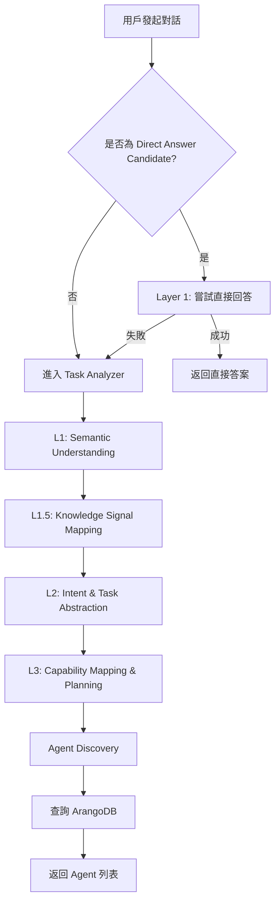
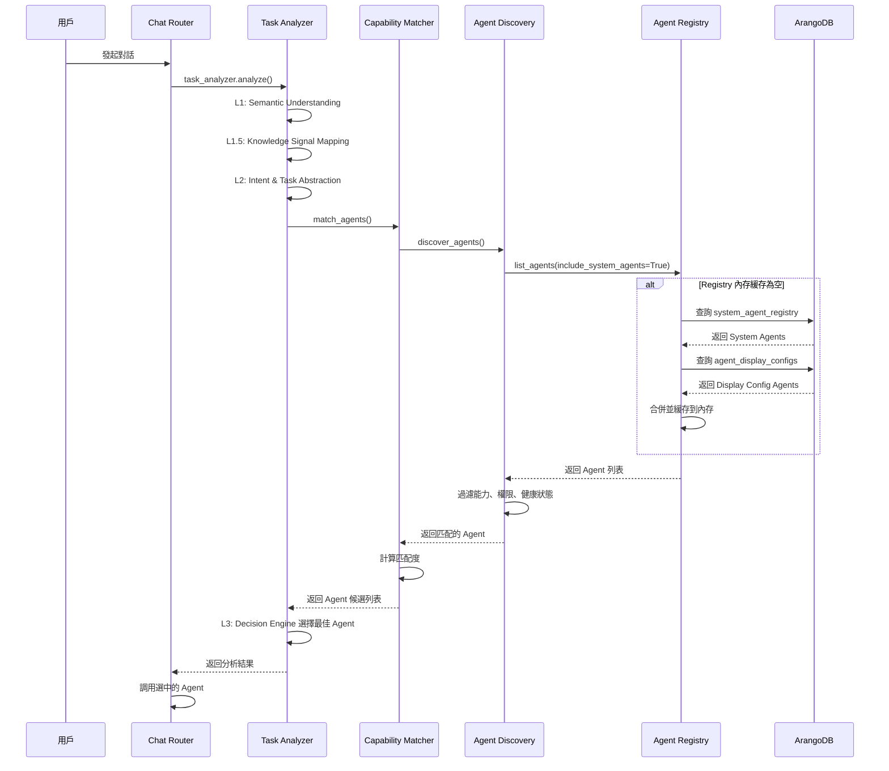

# Agent Registry 查詢流程說明

**創建日期**: 2026-01-28
**創建人**: Daniel Chung
**最後修改日期**: 2026-01-28

---

## 📋 概述

本文檔說明 AI-Box 系統中 Agent Registry 的查詢流程，包括：
- 每次對話是否觸發 Orchestrator
- system_agent_registry 的查詢機制
- agent_display_configs 的查詢機制
- 能力發現的完整流程

---

## 🔄 完整查詢流程

### 1. 對話入口流程



### 2. 是否每次對話都觸發 Orchestrator？

**答案：幾乎每次都會，但有例外**

#### 觸發 Orchestrator 的情況

1. **正常對話流程**：
   - 用戶發起對話 → `chat_product_stream()` 或 `chat_product()`
   - 調用 `task_analyzer.analyze()`
   - Task Analyzer 執行 L1-L5 處理
   - L3 層級調用 `capability_matcher.match_agents()`
   - Capability Matcher 使用 `AgentDiscovery.discover_agents()`
   - Agent Discovery 從 Registry 獲取 Agent 列表
   - **Registry 查詢 ArangoDB**

2. **快速路徑（用戶明確選擇 Agent）**：
   - 用戶在前端選擇了特定 Agent
   - Task Analyzer 走快速路徑，跳過部分分析
   - 但仍會查詢 Registry 驗證 Agent 是否存在

#### 不觸發 Orchestrator 的情況

1. **Direct Answer（直接回答）**：
   - 如果 `_is_direct_answer_candidate()` 返回 `True`
   - 系統嘗試直接回答（使用內部知識庫）
   - **跳過 Task Analyzer 和 Agent Discovery**
   - 但如果直接回答失敗，仍會進入 Task Analyzer

2. **簡單查詢**：
   - 例如：「什麼是 DevSecOps？」
   - 系統判斷可以從訓練數據直接回答
   - 不觸發 Agent Discovery

---

## 🗄️ ArangoDB 查詢機制

### 1. system_agent_registry 查詢

**Collection**: `system_agent_registry`

**查詢時機**：
- 當 `registry.list_agents(include_system_agents=True)` 被調用時
- 在 `CapabilityMatcher.match_agents()` 中
- 在 `AgentDiscovery.discover_agents()` 中

**查詢邏輯**（`agents/services/registry/registry.py`）：

```python
# 在 list_agents() 方法中
if include_system_agents:
    system_agent_store = get_system_agent_registry_store_service()
    system_agents = system_agent_store.list_system_agents(
        agent_type=agent_type,
        status=status,
        is_active=True,
    )
    # 轉換為 AgentRegistryInfo 並添加到列表
```

**查詢頻率**：
- ⚠️ **每次對話都會查詢**（動態查詢，非常駐內存）
- 查詢結果會緩存在 `AgentRegistry._agents` 字典中（內存緩存）
- 但如果 Registry 為空，會自動加載

**查詢內容**：
- Agent ID
- Agent 類型
- Agent 名稱
- 能力列表（capabilities）
- 狀態（status）
- 端點配置（endpoints）
- 元數據（metadata）

### 2. agent_display_configs 查詢

**Collection**: `agent_display_configs`

**查詢時機**：
- 當 `registry.get_all_agents()` 被調用時
- 在 `AgentRegistry` 初始化時（自動加載）
- 當 `registry.get_agent_info(agent_id)` 查詢外部 Agent 時

**查詢邏輯**（`agents/services/registry/registry.py`）：

```python
# 在 get_all_agents() 方法中
display_store = AgentDisplayConfigStoreService()
all_display_configs = display_store.list_all_agent_configs()

for config in all_display_configs:
    agent_id = config.agent_id or config.agent_config.agent_id
    if agent_id not in self._agents:
        # 創建 AgentRegistryInfo（用於前端顯示）
        agent_info = AgentRegistryInfo(...)
        self._agents[agent_id] = agent_info
```

**查詢頻率**：
- ⚠️ **每次對話都會查詢**（動態查詢，非常駐內存）
- 查詢結果會緩存在 `AgentRegistry._agents` 字典中（內存緩存）

**查詢內容**：
- Agent ID
- Agent 名稱（多語言）
- Agent 描述（多語言）
- 顯示配置（is_visible, status）
- 端點配置（endpoint_url）

**注意**：
- 外部 Agent（僅在 `agent_display_configs` 中）可能沒有完整的能力列表
- 這些 Agent 主要用於前端顯示，實際調用可能需要額外的配置

---

## 🔍 能力發現流程

### 完整流程圖



### 關鍵代碼位置

1. **Task Analyzer 調用**：
   - `api/routers/chat.py:1367` - `task_analyzer.analyze()`

2. **Capability Matcher**：
   - `agents/task_analyzer/capability_matcher.py:375` - `match_agents()`

3. **Agent Discovery**：
   - `agents/services/registry/discovery.py:31` - `discover_agents()`

4. **Agent Registry 查詢**：
   - `agents/services/registry/registry.py:450` - `list_agents()`
   - `agents/services/registry/registry.py:614` - `get_all_agents()`

5. **ArangoDB 查詢**：
   - `services/api/services/system_agent_registry_store_service.py` - System Agents
   - `services/api/services/agent_display_config_store_service.py` - Display Configs

---

## ⚠️ 性能考慮

### 當前實現的問題

1. **每次對話都查詢 ArangoDB**：
   - 即使有內存緩存，如果 Registry 為空或需要刷新，仍會查詢
   - 可能導致不必要的數據庫負載

2. **沒有查詢結果緩存**：
   - 內存緩存（`_agents` 字典）只在 Registry 實例存在時有效
   - 如果 Registry 實例被重置，需要重新查詢

3. **並發查詢**：
   - 多個對話同時進行時，可能同時查詢 ArangoDB
   - 沒有查詢去重機制

### 優化建議

1. **實現查詢結果緩存**：
   - 使用 Redis 或內存緩存（TTL 5-10 分鐘）
   - 減少 ArangoDB 查詢頻率

2. **預加載機制**：
   - 系統啟動時預加載所有 System Agents
   - 定期刷新（每 5-10 分鐘）

3. **查詢去重**：
   - 使用鎖機制避免並發重複查詢
   - 或使用查詢隊列

4. **增量更新**：
   - 監聽 ArangoDB 變更事件
   - 只在 Agent 配置變更時刷新緩存

---

## 📊 查詢統計

### 典型對話的查詢次數

| 場景 | system_agent_registry | agent_display_configs | 總計 |
|------|----------------------|----------------------|------|
| 正常對話（首次） | 1 | 1 | 2 |
| 正常對話（緩存命中） | 0 | 0 | 0 |
| 快速路徑（用戶選擇 Agent） | 1 | 0 | 1 |
| Direct Answer | 0 | 0 | 0 |

### 查詢時機總結

| 查詢時機 | 觸發條件 | 查詢內容 |
|---------|---------|---------|
| `list_agents(include_system_agents=True)` | 能力發現時 | system_agent_registry |
| `get_all_agents()` | Registry 初始化或刷新時 | system_agent_registry + agent_display_configs |
| `get_agent_info(agent_id)` | 查詢特定 Agent 時 | system_agent_registry → agent_display_configs（fallback） |

---

## ✅ 總結

### 回答您的問題

1. **每次對話是否觸發 Orchestrator？**
   - ✅ **是的**，幾乎每次對話都會觸發 Task Analyzer（Orchestrator 的一部分）
   - ⚠️ **例外**：Direct Answer 場景會跳過

2. **是否從 ArangoDB 的 system_agent_registry 進行常駐？**
   - ❌ **不是常駐**，是動態查詢
   - ✅ 查詢結果會緩存在內存中（`AgentRegistry._agents`）
   - ⚠️ 每次對話都可能觸發查詢（如果緩存為空或需要刷新）

3. **是否從 agent_display_configs 進行能力發現？**
   - ✅ **是的**，`get_all_agents()` 會查詢 `agent_display_configs`
   - ✅ 外部 Agent（僅在 display_configs 中）也會被加載到 Registry
   - ⚠️ 但這些 Agent 可能沒有完整的能力列表

### 建議

1. **實現查詢緩存**：減少 ArangoDB 查詢頻率
2. **預加載機制**：系統啟動時預加載所有 Agents
3. **監控查詢性能**：追蹤每次對話的數據庫查詢次數和延遲
