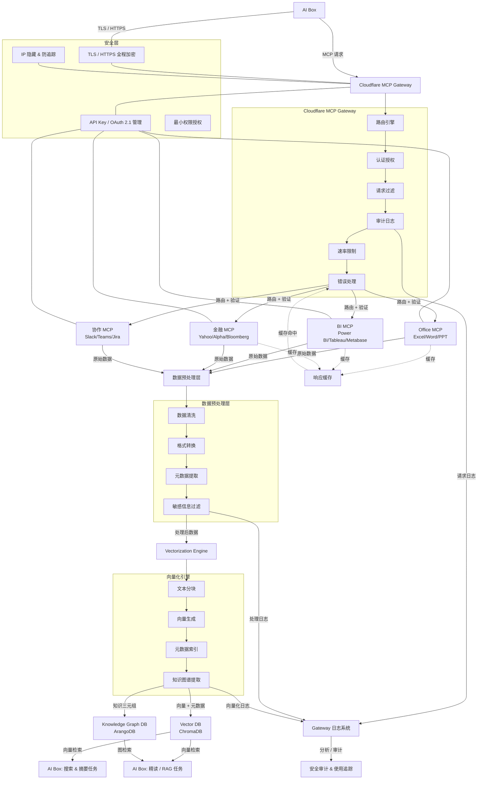

# MCP 工具系统规格

**创建日期**: 2025-12-30
**创建人**: Daniel Chung
**最后修改日期**: 2025-12-31

---

## 📋 概述

MCP (Model Context Protocol) 工具系统是 AI-Box 的核心组件，提供统一的工具注册、发现和调用机制。系统支持**内部工具**和**外部 MCP Server 工具**两种类型，可以无缝集成第三方 MCP 服务。

---

## 🏗️ 架构设计

### 工具类型分类

#### 1. 内部工具（Internal Tools）

**定义**: 直接实现在 AI-Box 系统中的工具

**特点**:

- 直接继承 `BaseTool` 类
- 工具逻辑在本地执行
- 无需网络调用
- 性能最优，延迟最低

**示例**:

- `TaskAnalyzerTool`: 任务分析工具
- `FileTool`: 文件操作工具

#### 2. 外部 MCP 工具（External MCP Tools）

**定义**: 通过 MCP Protocol 调用外部 MCP Server 提供的工具

**特点**:

- 通过 `ExternalMCPTool` 代理类封装
- 工具逻辑在外部 MCP Server 执行
- 需要网络调用和认证
- 支持动态发现和注册

**分类**: 外部 MCP 工具分为两个路径

##### 2.1 第三方 MCP Server（Third-Party MCP Server）

**定义**: 由第三方服务提供商或公开社区提供的 MCP Server

**特点**:

- 位于公共互联网或第三方云服务
- 需要通过 Cloudflare Gateway 代理访问（推荐）
- 需要 API Key、OAuth 等认证
- 需要审计和监控
- 需要隐藏真实 IP，防止追踪

**安全要求**:

- ✅ 必须通过 Cloudflare Gateway 代理
- ✅ 启用审计日志
- ✅ 隐藏真实 IP
- ✅ 速率限制和访问控制
- ✅ 数据脱敏和过滤

**示例**:

- Glama Office MCP Server（第三方服务）
- Yahoo Finance MCP（公开 API）
- Slack MCP（第三方 SaaS）
- Confluence MCP（Atlassian 云服务）
- Notion MCP（Notion API）

**配置示例**:

```yaml
external_tools:
  - name: "yahoo_finance_quote"
    description: "Yahoo Finance 股票报价工具"
    mcp_endpoint: "https://finance.yahoo.com/mcp"  # 真实端点
    proxy_endpoint: "https://mcp-gateway.your-domain.workers.dev"  # Gateway 代理（必须）
    proxy_config:
      enabled: true  # 必须启用
      audit_enabled: true  # 启用审计
      hide_ip: true  # 隐藏 IP
    tool_name_on_server: "get_quote"
    auth_type: "api_key"
    auth_config:
      api_key: "${YAHOO_API_KEY}"
    network_type: "third_party"  # 标记为第三方
```

##### 2.2 内部信任网络 MCP Server（Internal Trusted Network MCP Server）

**定义**: 位于内部信任网络（内网、VPN、私有云）的 MCP Server

**特点**:

- 位于内部网络或私有云环境
- 可以直接访问（无需 Gateway 代理）
- 使用内部认证机制（如 mTLS、内部证书）
- 信任度更高，安全要求相对较低
- 延迟更低，性能更好

**安全要求**:

- ✅ 网络隔离（内网/VPN/私有云）
- ✅ 内部认证（mTLS、内部证书）
- ✅ 基础审计日志（可选）
- ⚠️ 不需要 IP 隐藏（内部网络）
- ⚠️ 不需要 Gateway 代理（直接访问）

**示例**:

- 企业内部 MCP Server（内网部署）
- 私有云 MCP Server（AWS VPC、Azure VNet）
- VPN 网络 MCP Server
- 本地数据中心 MCP Server

**配置示例**:

```yaml
external_tools:
  - name: "internal_office_mcp"
    description: "企业内部 Office MCP Server"
    mcp_endpoint: "https://internal-office-mcp.company.local/mcp"  # 内网端点
    # proxy_endpoint: 不需要 Gateway 代理
    proxy_config:
      enabled: false  # 内部网络不需要代理
      audit_enabled: true  # 可选：启用基础审计
      hide_ip: false  # 内部网络不需要隐藏 IP
    tool_name_on_server: "office_processor"
    auth_type: "mtls"  # 使用 mTLS 认证
    auth_config:
      cert_path: "/etc/certs/client.crt"
      key_path: "/etc/certs/client.key"
      ca_cert_path: "/etc/certs/ca.crt"
    network_type: "internal_trusted"  # 标记为内部信任网络
```

**路径选择决策树**:

```
外部 MCP Server
├── 位于公共互联网？
│   ├── 是 → 第三方 MCP Server
│   │   ├── 必须使用 Cloudflare Gateway
│   │   ├── 启用审计和 IP 隐藏
│   │   └── 需要 API Key/OAuth 认证
│   │
│   └── 否 → 内部信任网络 MCP Server
│       ├── 位于内网/VPN/私有云？
│       ├── 是 → 直接访问（无需 Gateway）
│       ├── 使用内部认证（mTLS/内部证书）
│       └── 可选基础审计
```

---

## 🔧 内部工具实现

### BaseTool 基类

**文件**: `mcp/server/tools/base.py`

**接口定义**:

```python
class BaseTool(ABC):
    """工具基类"""

    def __init__(
        self,
        name: str,
        description: str,
        input_schema: Dict[str, Any],
    ):
        ...

    @abstractmethod
    async def execute(self, arguments: Dict[str, Any]) -> Dict[str, Any]:
        """执行工具（异步方法）"""
        pass

    def validate_input(self, arguments: Dict[str, Any]) -> bool:
        """验证输入参数"""
        ...

    def get_info(self) -> Dict[str, Any]:
        """获取工具信息"""
        ...
```

### 工具注册流程

1. **创建工具实例**: 继承 `BaseTool` 并实现 `execute` 方法
2. **注册到注册表**: 使用 `ToolRegistry.register()` 注册
3. **注册到 MCP Server**: 使用 `MCPServer.register_tool()` 注册

**示例**:

```python
from mcp.server.tools.base import BaseTool
from mcp.server.tools.registry import get_registry
from mcp.server.server import MCPServer

# 1. 创建工具
class MyCustomTool(BaseTool):
    def __init__(self):
        super().__init__(
            name="my_custom_tool",
            description="我的自定义工具",
            input_schema={
                "type": "object",
                "properties": {
                    "input": {"type": "string"}
                },
                "required": ["input"]
            }
        )

    async def execute(self, arguments: Dict[str, Any]) -> Dict[str, Any]:
        input_text = arguments.get("input")
        return {"result": f"Processed: {input_text}"}

# 2. 注册工具
tool = MyCustomTool()
registry = get_registry()
registry.register(tool)

# 3. 注册到 MCP Server
server.register_tool(
    name=tool.name,
    description=tool.description,
    input_schema=tool.input_schema,
    handler=tool.execute,
)
```

---

## 🌐 外部 MCP 工具集成

### MCP Server 路径分类

系统将外部 MCP Server 分为两个路径，采用不同的安全策略和访问方式：

#### 路径 1: 第三方 MCP Server

**网络位置**: 公共互联网、第三方云服务

**访问方式**: 通过 Cloudflare Gateway 代理（必须）

**安全策略**:

- 统一通过 Gateway 路由
- 启用完整审计日志
- 隐藏真实 IP 地址
- 数据脱敏和过滤
- 速率限制和访问控制

**适用场景**:

- 公开的第三方服务（Yahoo Finance、Slack、Confluence）
- SaaS 平台的 MCP Server
- 社区提供的公开 MCP Server

#### 路径 2: 内部信任网络 MCP Server

**网络位置**: 内网、VPN、私有云（AWS VPC、Azure VNet）

**访问方式**: 直接访问（无需 Gateway）

**安全策略**:

- 网络隔离保护
- 内部认证（mTLS、内部证书）
- 基础审计日志（可选）
- 无需 IP 隐藏
- 简化访问控制

**适用场景**:

- 企业内部部署的 MCP Server
- 私有云环境中的 MCP Server
- VPN 网络中的 MCP Server
- 本地数据中心的 MCP Server

**路径选择决策树**:

```
外部 MCP Server
├── 位于公共互联网？
│   ├── 是 → 第三方 MCP Server
│   │   ├── 必须使用 Cloudflare Gateway
│   │   ├── 启用审计和 IP 隐藏
│   │   └── 需要 API Key/OAuth 认证
│   │
│   └── 否 → 内部信任网络 MCP Server
│       ├── 位于内网/VPN/私有云？
│       ├── 是 → 直接访问（无需 Gateway）
│       ├── 使用内部认证（mTLS/内部证书）
│       └── 可选基础审计
```

### ExternalMCPTool 代理类

**文件**: `mcp/server/tools/external_tool.py`

**设计目标**:

- 封装外部 MCP Server 调用
- 支持动态工具发现
- 处理认证和授权
- 提供统一的工具接口
- 根据网络类型选择访问路径

**实现架构**:

```python
class ExternalMCPTool(BaseTool):
    """外部 MCP 工具代理类"""

    def __init__(
        self,
        name: str,
        description: str,
        input_schema: Dict[str, Any],
        mcp_endpoint: str,
        mcp_client: Optional[MCPClient] = None,
        auth_config: Optional[Dict[str, Any]] = None,
        proxy_endpoint: Optional[str] = None,
        proxy_config: Optional[Dict[str, Any]] = None,
        network_type: str = "third_party",  # "third_party" 或 "internal_trusted"
    ):
        """
        初始化外部 MCP 工具

        Args:
            name: 工具名称（本地别名）
            description: 工具描述
            input_schema: 输入 Schema
            mcp_endpoint: 外部 MCP Server 端点（真实端点）
            mcp_client: MCP Client 实例（可选，自动创建）
            auth_config: 认证配置（API Key、OAuth、mTLS 等）
            proxy_endpoint: 代理端点（Cloudflare Gateway，仅第三方需要）
            proxy_config: 代理配置（审计、IP 隐藏等，仅第三方需要）
            network_type: 网络类型（"third_party" 或 "internal_trusted"）
        """
        super().__init__(name, description, input_schema)
        self.mcp_endpoint = mcp_endpoint  # 真实端点（用于日志和追踪）
        self.network_type = network_type  # 网络类型

        # 根据网络类型决定是否使用代理
        if network_type == "third_party":
            # 第三方 MCP Server：必须使用 Gateway 代理
            if not proxy_endpoint:
                raise ValueError(
                    "Third-party MCP Server must use Cloudflare Gateway proxy"
                )
            self.proxy_endpoint = proxy_endpoint
            self.proxy_config = proxy_config or {
                "enabled": True,
                "audit_enabled": True,
                "hide_ip": True,
            }
            self.actual_endpoint = proxy_endpoint
        else:
            # 内部信任网络：直接访问，不使用代理
            self.proxy_endpoint = None
            self.proxy_config = {"enabled": False}
            self.actual_endpoint = mcp_endpoint

        self.auth_config = auth_config or {}
        self._mcp_client = mcp_client
        self._tool_name_on_server = tool_name_on_server or name

    async def execute(self, arguments: Dict[str, Any]) -> Dict[str, Any]:
        """
        执行外部工具（通过 MCP Protocol）

        Args:
            arguments: 工具参数

        Returns:
            Dict[str, Any]: 执行结果
        """
        # 1. 获取或创建 MCP Client（使用代理端点或真实端点）
        client = await self._get_client()

        # 2. 调用外部工具
        result = await client.call_tool(
            name=self._tool_name_on_server,
            arguments=arguments
        )

        return result
```

### 外部工具配置

**配置结构**:

#### 第三方 MCP Server 配置示例

```yaml
# external_mcp_tools.yaml
external_tools:
  # 第三方 MCP Server（必须使用 Gateway）
  - name: "glama_office_word"
    description: "Glama Office Word 操作工具"
    mcp_endpoint: "https://api.glama.office/mcp"  # 真实端点
    proxy_endpoint: "https://mcp-gateway.your-domain.workers.dev"  # Gateway（必须）
    proxy_config:
      enabled: true  # 必须启用
      audit_enabled: true  # 启用审计日志
      hide_ip: true  # 隐藏真实 IP
    network_type: "third_party"  # 标记为第三方
    tool_name_on_server: "word_processor"
    auth_type: "api_key"
    auth_config:
      api_key: "${GLAMA_API_KEY}"
    input_schema:
      type: object
      properties:
        operation:
          type: string
          enum: ["create", "edit", "read"]
        file_path:
          type: string
        content:
          type: string
      required: ["operation"]

  - name: "yahoo_finance_quote"
    description: "Yahoo Finance 股票报价工具"
    mcp_endpoint: "https://finance.yahoo.com/mcp"  # 真实端点
    proxy_endpoint: "https://mcp-gateway.your-domain.workers.dev"  # Gateway（必须）
    proxy_config:
      enabled: true  # 必须启用
      audit_enabled: true
      hide_ip: true
    network_type: "third_party"  # 标记为第三方
    tool_name_on_server: "get_quote"
    auth_type: "none"  # 公开 API
    input_schema:
      type: object
      properties:
        symbol:
          type: string
          description: "股票代码"
      required: ["symbol"]
```

#### 内部信任网络 MCP Server 配置示例

```yaml
external_tools:
  # 内部信任网络 MCP Server（直接访问，无需 Gateway）
  - name: "internal_office_mcp"
    description: "企业内部 Office MCP Server"
    mcp_endpoint: "https://internal-office-mcp.company.local/mcp"  # 内网端点
    # proxy_endpoint: 不需要配置（内部网络直接访问）
    proxy_config:
      enabled: false  # 内部网络不需要代理
      audit_enabled: true  # 可选：启用基础审计
      hide_ip: false  # 内部网络不需要隐藏 IP
    network_type: "internal_trusted"  # 标记为内部信任网络
    tool_name_on_server: "office_processor"
    auth_type: "mtls"  # 使用 mTLS 认证
    auth_config:
      cert_path: "/etc/certs/client.crt"
      key_path: "/etc/certs/client.key"
      ca_cert_path: "/etc/certs/ca.crt"
    input_schema:
      type: object
      properties:
        operation:
          type: string
          enum: ["create", "edit", "read"]
        file_path:
          type: string
      required: ["operation"]

  - name: "internal_bi_mcp"
    description: "私有云 BI MCP Server"
    mcp_endpoint: "https://bi-mcp.internal.aws.vpc/mcp"  # VPC 内网端点
    proxy_config:
      enabled: false  # 内部网络不需要代理
    network_type: "internal_trusted"
    tool_name_on_server: "bi_query"
    auth_type: "bearer"
    auth_config:
      token: "${INTERNAL_BI_TOKEN}"  # 内部 Token
    input_schema:
      type: object
      properties:
        query:
          type: string
        database:
          type: string
      required: ["query"]

  # Confluence MCP 工具示例（使用 Gateway 代理）
  - name: "confluence_create_page"
    description: "Confluence 创建页面工具"
    mcp_endpoint: "https://your-domain.atlassian.net/wiki/rest/api/mcp"  # 真实端点
    proxy_endpoint: "https://mcp-gateway.your-domain.workers.dev"  # Cloudflare Gateway
    proxy_config:
      enabled: true
      audit_enabled: true
      hide_ip: true
    tool_name_on_server: "create_page"
    auth_type: "bearer"
    auth_config:
      token: "${CONFLUENCE_API_TOKEN}"
    input_schema:
      type: object
      properties:
        space_key:
          type: string
          description: "空间键（Space Key）"
        title:
          type: string
          description: "页面标题"
        content:
          type: string
          description: "页面内容（Confluence Storage Format 或 Markdown）"
        parent_id:
          type: string
          description: "父页面 ID（可选）"
      required: ["space_key", "title", "content"]

  # Notion MCP 工具示例（使用 Gateway 代理）
  - name: "notion_create_page"
    description: "Notion 创建页面工具"
    mcp_endpoint: "https://api.notion.com/v1/mcp"  # 真实端点
    proxy_endpoint: "https://mcp-gateway.your-domain.workers.dev"  # Cloudflare Gateway
    proxy_config:
      enabled: true
      audit_enabled: true
      hide_ip: true
    tool_name_on_server: "pages.create"
    auth_type: "bearer"
    auth_config:
      token: "${NOTION_API_KEY}"
    input_schema:
      type: object
      properties:
        parent:
          type: object
          description: "父页面信息"
          properties:
            database_id:
              type: string
              description: "数据库 ID（如果父级是数据库）"
            page_id:
              type: string
              description: "页面 ID（如果父级是页面）"
        properties:
          type: object
          description: "页面属性"
          additionalProperties: true
        children:
          type: array
          description: "页面子块内容（可选）"
          items:
            type: object
      required: ["parent", "properties"]
```

### 外部工具注册流程

1. **加载配置**: 从配置文件或数据库加载外部工具配置
2. **创建代理实例**: 为每个外部工具创建 `ExternalMCPTool` 实例
3. **验证连接**: 测试外部 MCP Server 连接和工具可用性
4. **注册工具**: 将外部工具注册到本地工具注册表

**实现示例**:

```python
async def register_external_tools(
    server: MCPServer,
    config_path: str = "external_mcp_tools.yaml"
):
    """
    注册外部 MCP 工具

    Args:
        server: MCP Server 实例
        config_path: 配置文件路径
    """
    # 1. 加载配置
    config = load_yaml_config(config_path)

    # 2. 创建并注册外部工具
    for tool_config in config.get("external_tools", []):
        try:
            # 获取网络类型
            network_type = tool_config.get("network_type", "third_party")

            # 创建外部工具代理
            external_tool = ExternalMCPTool(
                name=tool_config["name"],
                description=tool_config["description"],
                input_schema=tool_config["input_schema"],
                mcp_endpoint=tool_config["mcp_endpoint"],
                tool_name_on_server=tool_config.get("tool_name_on_server"),
                auth_config=tool_config.get("auth_config", {}),
                proxy_endpoint=tool_config.get("proxy_endpoint"),  # Gateway 代理端点（仅第三方需要）
                proxy_config=tool_config.get("proxy_config", {}),  # 代理配置（仅第三方需要）
                network_type=network_type,  # 网络类型
            )

            # 验证连接
            if await external_tool.verify_connection():
                # 注册工具
                registry = get_registry()
                registry.register(external_tool)
                server.register_tool(
                    name=external_tool.name,
                    description=external_tool.description,
                    input_schema=external_tool.input_schema,
                    handler=external_tool.execute,
                )
                logger.info(f"Registered external tool: {external_tool.name}")
            else:
                logger.warning(
                    f"Failed to verify connection for external tool: {tool_config['name']}"
                )
        except Exception as e:
            logger.error(f"Failed to register external tool {tool_config['name']}: {e}")
```

---

## 🛡️ Cloudflare MCP Gateway 架构设计

### 概述

为了增强安全性、隐私保护和可观测性，系统采用 **Cloudflare MCP Gateway** 作为 AI-Box 与外部 MCP Server 之间的隔离层。所有外部 MCP 流量都通过统一的 Gateway 进行路由、认证、审计和监控。

### 架构设计



### 核心设计原则

1. **统一网关**: 所有外部 MCP 流量必须通过 Gateway
2. **零信任架构**: 每个请求都需要认证和授权
3. **隐私保护**: 隐藏真实 IP，防止外部追踪
4. **完整审计**: 所有请求/响应都有审计日志
5. **数据隔离**: 外部数据经过预处理和向量化后存储

### Gateway 核心功能

#### 1. 路由引擎

**功能**:

- 根据工具名称路由到对应的外部 MCP Server
- 支持多后端负载均衡
- 支持故障转移
- 支持 A/B 测试

**实现**:

```yaml
# Gateway 路由配置
routing:
  rules:
    - tool_pattern: "office_*"
      target: "https://office-mcp.example.com/mcp"
      weight: 100
    - tool_pattern: "finance_*"
      target: "https://finance-mcp.example.com/mcp"
      weight: 100
      fallback: "https://finance-mcp-backup.example.com/mcp"
```

#### 2. 认证授权

**功能**:

- 统一管理所有外部 MCP 的认证信息
- 支持 API Key、OAuth 2.0、Bearer Token
- 实现最小权限授权（基于用户、工具、操作）
- 支持动态 Token 刷新

**实现**:

```yaml
# Gateway 认证配置
authentication:
  providers:
    - name: "office_mcp"
      type: "oauth2"
      client_id: "${OFFICE_CLIENT_ID}"
      client_secret: "${OFFICE_CLIENT_SECRET}"
      token_url: "https://office.example.com/oauth/token"
    - name: "finance_mcp"
      type: "api_key"
      api_key: "${FINANCE_API_KEY}"
      header_name: "X-API-Key"

  authorization:
    policies:
      - user: "admin"
        tools: ["*"]
        operations: ["*"]
      - user: "analyst"
        tools: ["finance_*", "bi_*"]
        operations: ["read", "query"]
```

#### 3. 请求过滤

**功能**:

- 移除敏感信息（IP、User-Agent、追踪 Cookie）
- 数据脱敏（PII、敏感字段）
- 请求参数验证
- 请求大小限制

**实现**:

```javascript
// Cloudflare Worker 示例
function filterRequest(request) {
  const filteredHeaders = new Headers(request.headers);

  // 移除追踪信息
  filteredHeaders.delete('X-Real-IP');
  filteredHeaders.delete('X-Forwarded-For');
  filteredHeaders.delete('User-Agent');
  filteredHeaders.delete('Cookie');

  // 添加 Cloudflare 标识
  filteredHeaders.set('X-Forwarded-For', 'Cloudflare-IP');
  filteredHeaders.set('X-Request-Source', 'AI-Box-Gateway');

  return new Request(request.url, {
    method: request.method,
    headers: filteredHeaders,
    body: request.body,
  });
}
```

#### 4. 审计日志

**功能**:

- 记录所有请求/响应
- 记录性能指标（延迟、错误率）
- 记录安全事件（异常访问、权限拒绝）
- 支持日志查询和分析

**日志结构**:

```json
{
  "timestamp": "2025-12-30T10:00:00Z",
  "request_id": "req-123456",
  "user_id": "user-789",
  "tool_name": "yahoo_finance_quote",
  "mcp_endpoint": "https://finance.yahoo.com/mcp",
  "request": {
    "method": "POST",
    "arguments": {"symbol": "AAPL"},
    "size_bytes": 1024
  },
  "response": {
    "status": 200,
    "size_bytes": 2048,
    "latency_ms": 150
  },
  "security": {
    "ip_address": "Cloudflare-IP",
    "auth_method": "api_key",
    "authorized": true
  }
}
```

#### 5. 速率限制

**功能**:

- 基于用户、工具、IP 的速率限制
- 防止滥用和 DDoS 攻击
- 支持突发流量处理

**配置**:

```yaml
rate_limiting:
  rules:
    - user: "*"
      tool: "*"
      limit: 100  # 每分钟请求数
      burst: 20   # 突发允许数
    - user: "premium"
      tool: "*"
      limit: 1000
      burst: 100
```

#### 6. 错误处理

**功能**:

- 统一错误格式
- 错误重试策略
- 故障降级处理
- 错误告警

**错误处理流程**:

```
请求失败 → 重试（最多 3 次）→ 仍失败 → 降级策略 → 返回错误
```

### 数据流处理

#### 数据预处理层

**功能**:

- 数据清洗（移除无效数据、格式化）
- 格式转换（统一数据格式）
- 元数据提取（来源、时间戳、工具信息）
- 敏感信息过滤（PII、敏感字段）

**实现**:

```python
class DataPreprocessor:
    """数据预处理器"""

    async def process(self, raw_data: Dict[str, Any], source: str) -> Dict[str, Any]:
        """
        处理外部 MCP 返回的原始数据

        Args:
            raw_data: 原始数据
            source: 数据来源（工具名称）

        Returns:
            处理后的数据
        """
        # 1. 数据清洗
        cleaned = self._clean_data(raw_data)

        # 2. 格式转换
        converted = self._convert_format(cleaned)

        # 3. 元数据提取
        metadata = self._extract_metadata(converted, source)

        # 4. 敏感信息过滤
        filtered = self._filter_sensitive_info(converted)

        return {
            "data": filtered,
            "metadata": metadata,
            "processed_at": datetime.now().isoformat(),
        }
```

#### 向量化引擎集成

**功能**:

- 将外部 MCP 数据向量化并存储到 Vector DB
- 支持实时向量化和批量向量化
- 提取知识图谱三元组
- 支持概略搜索和精读/RAG

**向量化策略**:

| 数据类型 | 向量化策略 | 更新频率 |
|---------|-----------|---------|
| 实时数据（股价、汇率） | 不向量化，直接使用 | - |
| 历史数据（报告、文档） | 实时向量化 | 每次调用 |
| 批量数据（数据库导出） | 批量向量化 | 定期批量处理 |
| 结构化数据（表格） | 按行向量化 | 每次调用 |

**实现**:

```python
class ExternalMCPVectorizer:
    """外部 MCP 数据向量化器"""

    async def vectorize(
        self,
        tool_name: str,
        data: Dict[str, Any],
        strategy: str = "realtime",
    ) -> None:
        """
        向量化外部 MCP 数据

        Args:
            tool_name: 工具名称
            data: 数据内容
            strategy: 向量化策略（realtime/batch/skip）
        """
        if strategy == "skip":
            return  # 实时数据不向量化

        # 提取文本内容
        text_content = self._extract_text(data)

        # 分块
        chunks = self._chunk_text(text_content)

        # 向量化
        from genai.api.routers.chunk_processing import get_chunk_processor
        processor = get_chunk_processor()

        for chunk in chunks:
            await processor.process_text(
                text=chunk,
                metadata={
                    "source": "external_mcp",
                    "tool_name": tool_name,
                    "chunk_index": chunk.index,
                }
            )
```

### 缓存策略

**缓存规则**:

- 实时数据：不缓存（股价、汇率、实时指标）
- 历史数据：缓存 1 小时（报告、文档、分析结果）
- 静态数据：缓存 24 小时（配置、元数据）

**缓存实现**:

```yaml
cache_strategy:
  enabled: true
  rules:
    - tool_pattern: "realtime_*"
      ttl: 0  # 不缓存
    - tool_pattern: "historical_*"
      ttl: 3600  # 1 小时
    - tool_pattern: "static_*"
      ttl: 86400  # 24 小时
  cache_key:
    - tool_name
    - arguments_hash
```

### 安全增强

#### 1. IP 隐藏

**实现**:

- 所有请求通过 Cloudflare 网络转发
- 外部 MCP Server 只能看到 Cloudflare IP
- 移除所有真实 IP 相关的请求头

#### 2. 防追踪

**实现**:

- 移除 User-Agent
- 移除追踪 Cookie
- 移除 Referer（如果包含敏感信息）
- 统一请求特征

#### 3. TLS/HTTPS 全程加密

**实现**:

- Gateway 到外部 MCP Server 全程 HTTPS
- 使用 Cloudflare 的 SSL/TLS 管理
- 支持 TLS 1.3

### 监控和告警

#### 监控指标

- **请求量**: 总请求数、成功数、失败数
- **延迟**: 平均延迟、P95、P99 延迟
- **错误率**: 按工具、按错误类型统计
- **安全事件**: 异常访问、权限拒绝、攻击尝试

#### 告警规则

```yaml
alerts:
  - name: "high_error_rate"
    condition: "error_rate > 0.1"
    action: "notify_admin"
  - name: "high_latency"
    condition: "p95_latency > 1000"
    action: "notify_ops"
  - name: "security_breach"
    condition: "unauthorized_attempts > 10"
    action: "block_ip + notify_security"
```

### 实施计划

#### 阶段 1: Gateway 基础功能（1-2 周）

**目标**: 实现基本的 Gateway 功能

**任务**:

1. 创建 Cloudflare Worker
2. 实现路由引擎
3. 实现认证授权
4. 实现请求过滤
5. 实现基础审计日志

**验收标准**:

- 所有外部 MCP 请求通过 Gateway
- 认证授权正常工作
- 审计日志完整记录

#### 阶段 2: 数据向量化集成（1-2 周）

**目标**: 集成数据向量化功能

**任务**:

1. 实现数据预处理层
2. 集成向量化引擎
3. 实现向量化策略配置
4. 实现知识图谱提取

**验收标准**:

- 外部数据可以向量化
- 支持实时和批量向量化
- 向量数据可以用于 RAG

#### 阶段 3: 高级功能（1-2 周）

**目标**: 实现缓存、监控、告警

**任务**:

1. 实现响应缓存
2. 实现监控指标收集
3. 实现告警系统
4. 性能优化

**验收标准**:

- 缓存策略正常工作
- 监控指标完整
- 告警及时触发

### 配置示例

```yaml
# cloudflare_gateway_config.yaml
gateway:
  endpoint: "https://mcp-gateway.your-domain.workers.dev"

  routing:
    default_timeout: 30
    max_retries: 3
    retry_delay: 1.0

  authentication:
    providers:
      - name: "office_mcp"
        type: "oauth2"
        config:
          client_id: "${OFFICE_CLIENT_ID}"
          client_secret: "${OFFICE_CLIENT_SECRET}"
          token_url: "https://office.example.com/oauth/token"

  rate_limiting:
    default_limit: 100
    default_burst: 20

  cache:
    enabled: true
    default_ttl: 3600

  vectorization:
    enabled: true
    strategy: "realtime"  # realtime/batch/skip
    tools:
      - pattern: "realtime_*"
        strategy: "skip"
      - pattern: "historical_*"
        strategy: "realtime"
      - pattern: "batch_*"
        strategy: "batch"

  monitoring:
    enabled: true
    log_level: "info"
    metrics_endpoint: "/metrics"
```

### 优势总结

1. **安全性**: 统一安全策略，防止外部追踪
2. **可观测性**: 完整的审计日志和监控
3. **可扩展性**: 易于添加新的外部 MCP
4. **性能**: 缓存和负载均衡优化
5. **合规性**: 满足审计和合规要求

---

## 🔐 认证和授权

### 支持的认证类型

#### 1. API Key 认证

```yaml
auth_type: "api_key"
auth_config:
  api_key: "${API_KEY_ENV_VAR}"
  header_name: "X-API-Key"  # 可选，默认 "Authorization"
```

#### 2. OAuth 2.0 认证

```yaml
auth_type: "oauth2"
auth_config:
  client_id: "${CLIENT_ID}"
  client_secret: "${CLIENT_SECRET}"
  token_url: "https://api.example.com/oauth/token"
  scope: "read write"
```

#### 3. Bearer Token 认证

```yaml
auth_type: "bearer"
auth_config:
  token: "${BEARER_TOKEN}"
```

#### 4. 无认证（公开 API）

```yaml
auth_type: "none"
```

### 认证实现

**文件**: `mcp/server/tools/auth.py`

```python
class AuthHandler:
    """认证处理器"""

    @staticmethod
    async def get_auth_headers(auth_config: Dict[str, Any]) -> Dict[str, str]:
        """
        获取认证头

        Args:
            auth_config: 认证配置

        Returns:
            Dict[str, str]: HTTP 请求头
        """
        auth_type = auth_config.get("auth_type", "none")

        if auth_type == "api_key":
            api_key = os.getenv(
                auth_config.get("api_key", "").strip("${}"),
                auth_config.get("api_key", "")
            )
            header_name = auth_config.get("header_name", "Authorization")
            return {header_name: f"Bearer {api_key}"}

        elif auth_type == "oauth2":
            # OAuth 2.0 流程
            token = await get_oauth_token(auth_config)
            return {"Authorization": f"Bearer {token}"}

        elif auth_type == "bearer":
            token = os.getenv(
                auth_config.get("token", "").strip("${}"),
                auth_config.get("token", "")
            )
            return {"Authorization": f"Bearer {token}"}

        else:
            return {}
```

---

## 📊 外部 MCP 工具列表

### 文档处理

| 工具名称                               | MCP Server       | 认证方式        | 状态   |
| -------------------------------------- | ---------------- | --------------- | ------ |
| Glama Office MCP                       | ✅ 官方/社群版本 | API Key         | 待集成 |
| Microsoft Graph API MCP                | ⚠️ 需自建      | OAuth 2.0       | 待集成 |
| Python SDK MCP (openpyxl, python-docx) | ❌ 无公开        | 本地部署        | 待集成 |
| Gamma MCP Server                       | ✅ 官方          | API Key / OAuth | 待集成 |
| Confluence MCP                         | ✅ 官方 API      | API Token / OAuth | 待集成 |
| Notion MCP                             | ✅ 官方 API      | API Key / OAuth | 待集成 |

### 金融数据

| 工具名称          | MCP Server       | 认证方式           | 状态   |
| ----------------- | ---------------- | ------------------ | ------ |
| Yahoo Finance MCP | ✅ 社群/第三方   | 免费注册 / API Key | 待集成 |
| Alpha Vantage MCP | ✅ 官方 API 封装 | 免费/收费 API Key  | 待集成 |
| IEX Cloud MCP     | ✅ 官方 API 封装 | API Key            | 待集成 |
| Bloomberg MCP     | ❌ 需企业授权    | 企业授权           | 待集成 |

### 协作工具

| 工具名称                  | MCP Server        | 认证方式   | 状态   |
| ------------------------- | ----------------- | ---------- | ------ |
| Slack MCP                 | ✅ 官方 MCP / App | OAuth 授权 | 待集成 |
| Teams MCP                 | ✅ 官方 MCP / App | OAuth 授权 | 待集成 |
| Email MCP (Gmail/Outlook) | ✅ 官方 API       | OAuth 授权 | 待集成 |
| Jira MCP                  | ✅ 官方 MCP / App | OAuth 授权 | 待集成 |
| Trello MCP                | ✅ 官方 MCP / App | OAuth 授权 | 待集成 |
| Asana MCP                 | ✅ 官方 MCP / App | OAuth 授权 | 待集成 |

### 数据可视化

| 工具名称          | MCP Server     | 认证方式        | 状态   |
| ----------------- | -------------- | --------------- | ------ |
| Power BI MCP      | ⚠️ 需自建    | Azure App 注册  | 待集成 |
| Tableau MCP       | ⚠️ 需自建    | API Token       | 待集成 |
| Google Looker MCP | ✅ 官方/第三方 | OAuth           | 待集成 |
| Metabase MCP      | ✅ 社群 MCP    | 本地部署        | 待集成 |
| Plotly/Dash MCP   | ❌ 无公开      | 自建 MCP Server | 待集成 |
| Grafana MCP       | ❌ 无公开      | 自建 MCP Server | 待集成 |

---

## 🔄 工具发现和刷新

### 动态工具发现

外部 MCP Server 可能动态添加或删除工具，系统需要支持：

1. **定期刷新**: 定期从外部 MCP Server 获取最新工具列表
2. **工具变更通知**: 监听外部 MCP Server 的工具变更事件
3. **自动注册**: 自动注册新发现的工具
4. **自动注销**: 自动注销已删除的工具

**实现**:

```python
class ExternalToolManager:
    """外部工具管理器"""

    async def discover_tools(self, mcp_endpoint: str) -> List[Dict[str, Any]]:
        """
        从外部 MCP Server 发现工具

        Args:
            mcp_endpoint: MCP Server 端点

        Returns:
            List[Dict[str, Any]]: 工具列表
        """
        client = MCPClient(mcp_endpoint)
        await client.initialize()
        tools = await client.list_tools()
        return [tool.model_dump() for tool in tools]

    async def refresh_external_tools(self):
        """刷新所有外部工具"""
        for tool_config in self.external_tool_configs:
            try:
                # 发现新工具
                discovered_tools = await self.discover_tools(
                    tool_config["mcp_endpoint"]
                )

                # 更新工具注册
                await self._update_tool_registry(
                    tool_config,
                    discovered_tools
                )
            except Exception as e:
                logger.error(f"Failed to refresh tools from {tool_config['mcp_endpoint']}: {e}")
```

---

## 📝 工具注册表扩展

### 扩展 ToolRegistry

**文件**: `mcp/server/tools/registry.py`

**新增功能**:

1. **工具分类**: 区分内部工具和外部工具
2. **工具来源追踪**: 记录工具的来源（内部/外部 MCP Server）
3. **工具健康检查**: 定期检查外部工具的可用性
4. **工具统计**: 统计工具调用次数、成功率等

**扩展实现**:

```python
class ToolRegistry:
    """工具注册表（扩展版）"""

    def __init__(self):
        self.tools: Dict[str, BaseTool] = {}
        self.tool_metadata: Dict[str, Dict[str, Any]] = {}  # 工具元数据

    def register(
        self,
        tool: BaseTool,
        tool_type: str = "internal",  # "internal" 或 "external"
        source: Optional[str] = None,  # 外部工具来源
    ) -> None:
        """
        注册工具（扩展版）

        Args:
            tool: 工具实例
            tool_type: 工具类型
            source: 工具来源（外部工具需要）
        """
        self.tools[tool.name] = tool
        self.tool_metadata[tool.name] = {
            "type": tool_type,
            "source": source,
            "registered_at": datetime.now().isoformat(),
            "call_count": 0,
            "success_count": 0,
            "failure_count": 0,
        }
        logger.info(f"Registered {tool_type} tool: {tool.name}")

    def get_tool_stats(self, name: str) -> Optional[Dict[str, Any]]:
        """获取工具统计信息"""
        return self.tool_metadata.get(name)

    def record_tool_call(self, name: str, success: bool):
        """记录工具调用"""
        if name in self.tool_metadata:
            self.tool_metadata[name]["call_count"] += 1
            if success:
                self.tool_metadata[name]["success_count"] += 1
            else:
                self.tool_metadata[name]["failure_count"] += 1
```

---

## 🚀 使用示例

### 1. 注册内部工具

```python
from mcp.server.tools.base import BaseTool
from mcp.server.tools.registry import get_registry

class MyInternalTool(BaseTool):
    async def execute(self, arguments: Dict[str, Any]) -> Dict[str, Any]:
        return {"result": "Internal tool executed"}

tool = MyInternalTool()
registry = get_registry()
registry.register(tool, tool_type="internal")
```

### 2. 注册外部工具

```python
from mcp.server.tools.external_tool import ExternalMCPTool

external_tool = ExternalMCPTool(
    name="yahoo_finance_quote",
    description="Yahoo Finance 股票报价",
    input_schema={
        "type": "object",
        "properties": {
            "symbol": {"type": "string"}
        },
        "required": ["symbol"]
    },
    mcp_endpoint="https://finance.yahoo.com/mcp",
    auth_config={"auth_type": "none"}
)

registry = get_registry()
registry.register(
    external_tool,
    tool_type="external",
    source="https://finance.yahoo.com/mcp"
)
```

### 3. 调用工具（统一接口）

```python
# 内部工具和外部工具使用相同的接口
result = await tool.execute({"symbol": "AAPL"})
```

---

## 🔍 工具健康检查

### 健康检查机制

1. **连接检查**: 检查外部 MCP Server 是否可达
2. **工具可用性检查**: 检查工具是否在外部服务器上存在
3. **认证有效性检查**: 检查认证配置是否有效
4. **性能检查**: 检查工具调用延迟和成功率

**实现**:

```python
class ToolHealthChecker:
    """工具健康检查器"""

    async def check_tool_health(self, tool: BaseTool) -> Dict[str, Any]:
        """
        检查工具健康状态

        Returns:
            Dict[str, Any]: 健康状态信息
        """
        if isinstance(tool, ExternalMCPTool):
            # 外部工具健康检查
            return await self._check_external_tool_health(tool)
        else:
            # 内部工具总是健康的
            return {
                "status": "healthy",
                "type": "internal",
                "latency_ms": 0,
            }

    async def _check_external_tool_health(
        self,
        tool: ExternalMCPTool
    ) -> Dict[str, Any]:
        """检查外部工具健康状态"""
        try:
            start_time = time.time()
            client = await tool._get_client()
            await client.list_tools()  # 测试连接
            latency_ms = (time.time() - start_time) * 1000

            return {
                "status": "healthy",
                "type": "external",
                "latency_ms": latency_ms,
                "endpoint": tool.mcp_endpoint,
            }
        except Exception as e:
            return {
                "status": "unhealthy",
                "type": "external",
                "error": str(e),
                "endpoint": tool.mcp_endpoint,
            }
```

---

## 📊 工具调用统计

### 统计指标

- **调用次数**: 总调用次数
- **成功率**: 成功调用 / 总调用次数
- **平均延迟**: 平均响应时间
- **错误类型分布**: 按错误类型统计

### 统计实现

```python
class ToolMetrics:
    """工具指标收集"""

    def __init__(self):
        self.metrics: Dict[str, Dict[str, Any]] = {}

    def record_call(
        self,
        tool_name: str,
        success: bool,
        latency_ms: float,
        error_type: Optional[str] = None,
    ):
        """记录工具调用"""
        if tool_name not in self.metrics:
            self.metrics[tool_name] = {
                "total_calls": 0,
                "success_calls": 0,
                "failure_calls": 0,
                "total_latency_ms": 0,
                "error_types": {},
            }

        metrics = self.metrics[tool_name]
        metrics["total_calls"] += 1
        metrics["total_latency_ms"] += latency_ms

        if success:
            metrics["success_calls"] += 1
        else:
            metrics["failure_calls"] += 1
            if error_type:
                metrics["error_types"][error_type] = (
                    metrics["error_types"].get(error_type, 0) + 1
                )

    def get_stats(self, tool_name: str) -> Dict[str, Any]:
        """获取工具统计信息"""
        if tool_name not in self.metrics:
            return {}

        metrics = self.metrics[tool_name]
        return {
            "total_calls": metrics["total_calls"],
            "success_rate": (
                metrics["success_calls"] / metrics["total_calls"]
                if metrics["total_calls"] > 0
                else 0
            ),
            "average_latency_ms": (
                metrics["total_latency_ms"] / metrics["total_calls"]
                if metrics["total_calls"] > 0
                else 0
            ),
            "error_types": metrics["error_types"],
        }
```

---

## 🔮 未来扩展方向

### 1. 工具市场（Tool Marketplace）

- 工具发现和搜索
- 工具评分和评论
- 工具版本管理
- 工具使用统计

### 2. 工具组合（Tool Composition）

- 工具链（Tool Chain）
- 工具编排（Tool Orchestration）
- 工具依赖管理

### 3. 工具安全

- 工具权限控制
- 工具调用审计
- 工具数据加密
- 工具沙箱执行

### 4. 工具性能优化

- 工具调用缓存
- 工具调用批处理
- 工具调用并发控制
- 工具调用限流

---

## 📚 相关文档

- [MCP 系统概况](../../开发进度/MCP系统概况.md)
- [工具组开发规格](../../tools/工具組開發規格.md)
- [Task Analyzer 细化开发规格](../Task-Analyzer-细化开发规格.md)

---

---

## 📝 Confluence 和 Notion 集成说明

### Confluence MCP 集成

**概述**: Confluence 是 Atlassian 的团队协作和知识管理平台，支持通过 REST API 进行集成。

**认证方式**:

- **API Token**: 使用 Atlassian API Token（推荐）
- **OAuth 2.0**: 使用 OAuth 2.0 授权流程

**主要功能**:

- 创建和编辑页面
- 搜索页面和内容
- 管理空间和权限
- 上传附件
- 评论和协作

**配置示例**:

```yaml
- name: "confluence_search"
  description: "Confluence 搜索页面工具"
  mcp_endpoint: "https://your-domain.atlassian.net/wiki/rest/api/mcp"
  tool_name_on_server: "search"
  auth_type: "bearer"
  auth_config:
    token: "${CONFLUENCE_API_TOKEN}"
  input_schema:
    type: object
    properties:
      query:
        type: string
        description: "搜索查询"
      space_key:
        type: string
        description: "限制搜索的空间（可选）"
      limit:
        type: integer
        description: "返回结果数量限制"
        default: 10
    required: ["query"]
```

**API 文档**: <https://developer.atlassian.com/cloud/confluence/rest/>

### Notion MCP 集成

**概述**: Notion 是一个集成的笔记、数据库和协作工具，提供强大的 API 支持。

**认证方式**:

- **API Key**: 使用 Notion Integration Token
- **OAuth 2.0**: 使用 OAuth 2.0 授权流程（企业版）

**主要功能**:

- 创建和更新页面
- 查询数据库
- 管理块（Blocks）内容
- 搜索内容
- 管理用户和权限

**配置示例**:

```yaml
- name: "notion_query_database"
  description: "Notion 查询数据库工具"
  mcp_endpoint: "https://api.notion.com/v1/mcp"
  tool_name_on_server: "databases.query"
  auth_type: "bearer"
  auth_config:
    token: "${NOTION_API_KEY}"
  input_schema:
    type: object
    properties:
      database_id:
        type: string
        description: "数据库 ID"
      filter:
        type: object
        description: "过滤条件（可选）"
        additionalProperties: true
      sorts:
        type: array
        description: "排序规则（可选）"
        items:
          type: object
      page_size:
        type: integer
        description: "每页结果数量"
        default: 100
    required: ["database_id"]
```

**API 文档**: <https://developers.notion.com/reference/intro>

### 使用场景

**Confluence 适用场景**:

- 企业知识库管理
- 技术文档编写和维护
- 团队协作和文档共享
- 项目文档和规范管理

**Notion 适用场景**:

- 个人和团队笔记管理
- 数据库和项目管理
- 内容创作和发布
- 知识库和文档库

---

---

## 🛡️ Cloudflare MCP Gateway 实施指南

### 快速开始

#### 1. 创建 Cloudflare Worker

```bash
# 安装 Wrangler CLI
npm install -g wrangler

# 创建 Worker 项目
wrangler init mcp-gateway

# 部署 Worker
wrangler deploy
```

#### 2. 配置 Gateway

详细配置步骤请参阅：[Cloudflare MCP Gateway 设置指南](./Cloudflare-MCP-Gateway-设置指南.md)

#### 3. 更新 ExternalMCPTool 配置

```yaml
external_tools:
  - name: "yahoo_finance_quote"
    mcp_endpoint: "https://finance.yahoo.com/mcp"  # 真实端点
    proxy_endpoint: "https://mcp-gateway.your-domain.workers.dev"  # Gateway
    proxy_config:
      enabled: true
      audit_enabled: true
      hide_ip: true
```

### 最佳实践

1. **安全配置**
   - 使用环境变量存储敏感信息
   - 定期轮换 API Key
   - 启用 WAF 规则

2. **性能优化**
   - 启用响应缓存
   - 使用连接池
   - 实现请求批处理

3. **监控告警**
   - 设置关键指标告警
   - 定期审查审计日志
   - 监控异常访问模式

### 详细设置文档

完整的 Cloudflare 设置步骤、代码示例和配置说明，请参阅：

- [Cloudflare MCP Gateway 设置指南](./Cloudflare-MCP-Gateway-设置指南.md) - 完整的设置指南和状态追踪
- [開發環境部署狀態報告](./開發環境部署狀態報告.md) - 当前开发环境部署状态和配置信息
- [Cloudflare 手动操作清单](./Cloudflare-手动操作清单.md) - 必须手动执行的操作清单

---

**最后更新日期**: 2025-12-31
**维护人**: Daniel Chung
