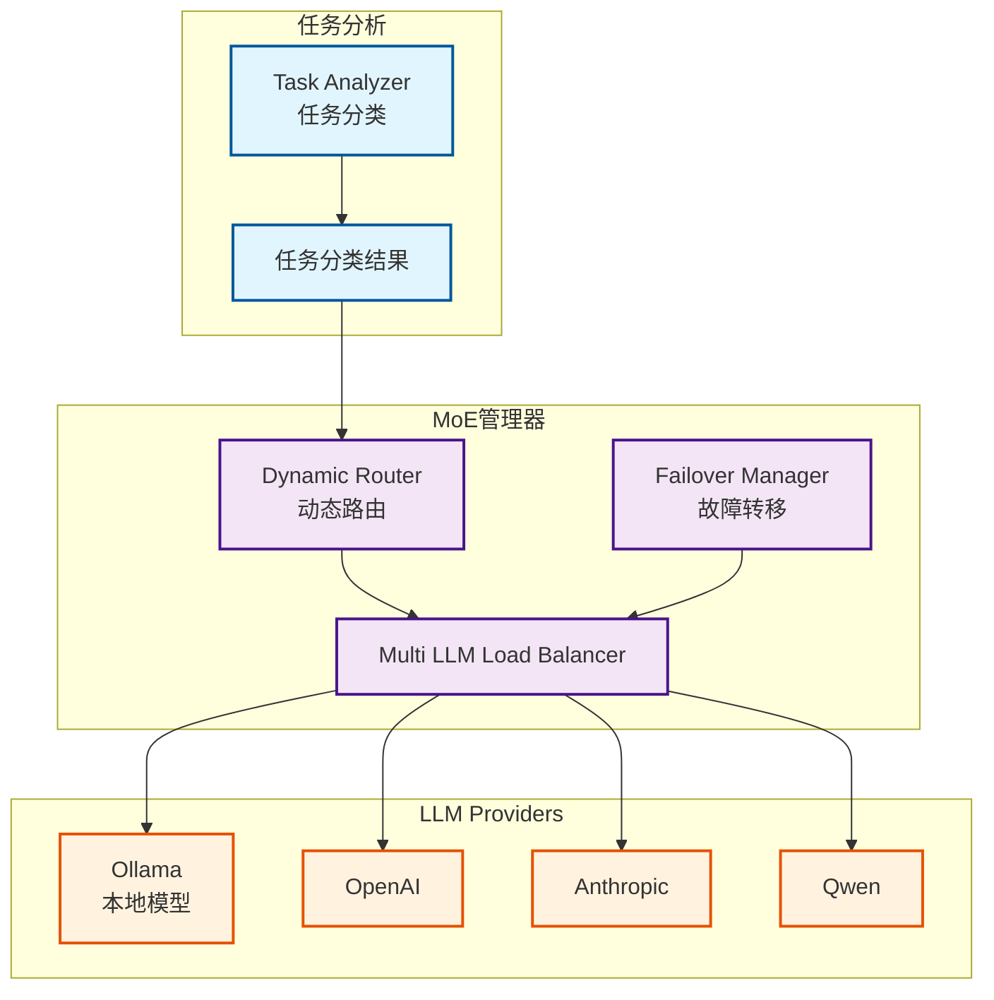

# MoE系统（Mixture of Experts）架构文档

**创建日期**: 2025-12-25
**创建人**: Daniel Chung
**最后修改日期**: 2025-12-25

---

## 📋 概述

MoE（Mixture of Experts，专家模型混合）系统是 AI-Box 的多模型路由架构，根据任务类型和特性动态选择最适合的专家模型。系统支持多个 LLM Provider，通过任务分类与路由策略，实现最优的模型选择与成本控制。

> **相关文档**：
>
> - [LLM路由架构文档](../../architecture/llm-routing-architecture.md)
> - [GenAI主计划](../../plans/genai/GENAI_MASTER_PLAN.md)

---

## 🏗️ 架构设计

### Multi-model 架构

系统支持多个 LLM Provider（Ollama、OpenAI、Anthropic、Qwen等），通过动态路由选择最适合的模型。

### 架构图

---

## 🔧 核心组件

### 1. 任务分类

**功能**：分析任务类型（QUERY、EXECUTION、REVIEW、PLANNING、COMPLEX）

**实现位置**：`agents/task_analyzer/classifier.py`

### 2. 动态路由

**功能**：根据任务分类结果选择最适合的 Provider 和模型

**路由策略**：

- TaskTypeBased：基于任务类型
- ComplexityBased：基于任务复杂度
- CostBased：基于成本考虑
- LatencyBased：基于延迟要求
- Hybrid：混合策略

**实现位置**：`llm/routing/dynamic.py`

### 3. 负载均衡

**功能**：在多个 Provider 和模型间分配负载

**策略**：

- 轮询（Round Robin）
- 加权轮询（Weighted Round Robin）
- 最少连接（Least Connections）

**实现位置**：`llm/load_balancer.py`

### 4. 故障转移

**功能**：Provider 故障时自动切换到备用 Provider

**实现位置**：`llm/failover.py`

---

## 📊 实现状态

### 已完成功能

| 功能模块 | 状态 | 说明 |
|---------|------|------|
| MoE 管理器 | ✅ 已实现 | `llm/moe/moe_manager.py` |
| 动态路由 | ✅ 已实现 | 多种路由策略 |
| 负载均衡 | ✅ 已实现 | 多 Provider 负载均衡 |
| 故障转移 | ✅ 已实现 | 自动故障转移 |
| 任务分类集成 | ✅ 已实现 | 与 Task Analyzer 集成 |

---

## 📚 参考资料

### 相关文档

- [LLM路由架构文档](../../architecture/llm-routing-architecture.md)
- [GenAI主计划](../../plans/genai/GENAI_MASTER_PLAN.md)

### 代码位置

- MoE 管理器：`llm/moe/moe_manager.py`
- 动态路由：`llm/routing/dynamic.py`
- 负载均衡：`llm/load_balancer.py`
- 故障转移：`llm/failover.py`

---

**最后更新日期**: 2025-12-25
