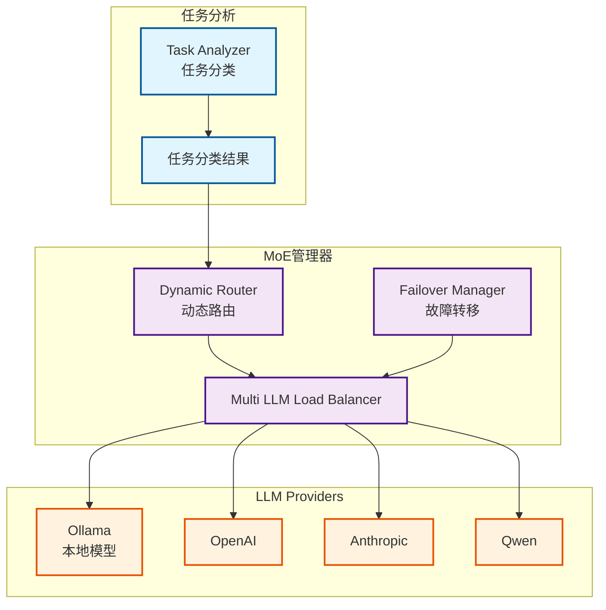

# MoE系统（Mixture of Experts）架构文档

**创建日期**: 2025-12-25
**创建人**: Daniel Chung
**最后修改日期**: 2026-01-21

---

## 📋 概述

MoE（Mixture of Experts，专家模型混合）系统是 AI-Box 的多模型路由架构，根据任务类型和特性动态选择最适合的专家模型。系统支持多个 LLM Provider，通过任务分类与路由策略，实现最优的模型选择与成本控制。

> **相关文档**：
>
> - [LLM路由架构文档](../../備份與歸檔/architecture/llm-routing-architecture.md)
> - [GenAI主计划](../../開發過程文件/plans/genai/GENAI_MASTER_PLAN.md)
> - [AI-Box双轨 RAG 解析规格书](../文件上傳向量圖譜/AI-Box雙軌RAG解析規格書.md)

---

## 🏗️ 架构设计

### Multi-model 架构

系统支持多个 LLM Provider（Ollama、OpenAI、Anthropic、Qwen等），通过动态路由选择最适合的模型。

### 多模型架构核心原则

**重要**：系统采用多模型架构，不同的工作使用不同的模型。

1. **任务分析和语义理解（L1-L2层）**：
   - ✅ **始终使用本地模型（Ollama）**，不受前端选择的模型影响
   - ✅ 用于内部处理：语义理解、意图分析、任务分类
   - ✅ 实现位置：`agents/task_analyzer/router_llm.py`
   - ✅ 默认模型：`gpt-oss:120b-cloud`（可通过 `ROUTER_LLM_MODEL` 环境变量配置）

2. **前端聊天框选择的模型**：
   - ✅ 只用于最终任务执行和补全
   - ✅ 用于交付任务（任务描述的最終補全）
   - ✅ 用于上网和内部信息无关的模型调用（需要外部API的模型）
   - ✅ 用于最终输出生成

**设计原因**：

- 任务分析和语义理解是内部处理，不需要外部API，使用本地模型更快速、成本更低
- 前端选择的模型用于最终输出，可以根据任务需求选择最适合的模型（如需要联网搜索时使用支持工具的模型）

### 架构图



---

## 🎯 场景配置

### 支持的任务场景

MoE 系统支持以下任务场景，根据场景自动选择最适合的模型：

| 场景 | 用途 | 默认模型 | 前端可编辑 |
|------|------|----------|-----------|
| **chat** | 通用聊天对话 | gpt-oss:120b-cloud | ✅ |
| **semantic_understanding** | 语义理解和摘要生成 | gpt-oss:120b-cloud | ❌ |
| **task_analysis** | 任务分析和规划 | gpt-oss:120b-cloud | ❌ |
| **orchestrator** | 协调和编排 | gpt-oss:120b-cloud | ❌ |
| **embedding** | 文本向量化 | nomic-embed-text:latest | ❌ |
| **knowledge_graph_extraction** | 知识图谱提取 | mistral-nemo:12b | ❌ |
| **vision** | 视觉理解（图片/表格/图表） | qwen3-vl:latest | ❌ |

### Vision 场景配置（2026-01-21）

**用途**：处理视觉元素识别和描述，应用于双轨 RAG 解析的 Stage 2 - Prompt B（视觉解析员）

**配置示例**（`config/config.json`）：

```json
{
  "services": {
    "moe": {
      "model_priority": {
        "vision": {
          "frontend_editable": false,
          "priority": [
            {
              "model": "qwen3-vl:latest",
              "context_size": 32768,
              "max_tokens": 4096,
              "temperature": 0.3,
              "timeout": 120,
              "retries": 3,
              "rpm": 20,
              "concurrency": 3
            },
            {
              "model": "qwen3-vl:8b",
              "context_size": 16384,
              "max_tokens": 4096,
              "temperature": 0.3,
              "timeout": 90,
              "retries": 2,
              "rpm": 30,
              "concurrency": 5
            }
          ]
        }
      }
    }
  }
}
```

**环境变量**：`MOE_VISION_MODEL`（可覆盖默认模型）

---

## 🔧 核心组件

### 1. 任务分类

**功能**：分析任务类型（QUERY、EXECUTION、REVIEW、PLANNING、COMPLEX）

**实现位置**：`agents/task_analyzer/classifier.py`

### 2. 动态路由

**功能**：根据任务分类结果选择最适合的 Provider 和模型

**路由策略**：

- TaskTypeBased：基于任务类型
- ComplexityBased：基于任务复杂度
- CostBased：基于成本考虑
- LatencyBased：基于延迟要求
- Hybrid：混合策略

**实现位置**：`llm/routing/dynamic.py`

### 3. 负载均衡

**功能**：在多个 Provider 和模型间分配负载

**策略**：

- 轮询（Round Robin）
- 加权轮询（Weighted Round Robin）
- 最少连接（Least Connections）

**实现位置**：`llm/load_balancer.py`

### 4. 故障转移

**功能**：Provider 故障时自动切换到备用 Provider

**实现位置**：`llm/failover.py`

---

## 📊 实现状态

### 已完成功能

| 功能模块 | 状态 | 说明 |
|---------|------|------|
| MoE 管理器 | ✅ 已实现 | `llm/moe/moe_manager.py` |
| 动态路由 | ✅ 已实现 | 多种路由策略 |
| 负载均衡 | ✅ 已实现 | 多 Provider 负载均衡 |
| 故障转移 | ✅ 已实现 | 自动故障转移 |
| 任务分类集成 | ✅ 已实现 | 与 Task Analyzer 集成 |
| Vision 场景 | ✅ 已实现 | qwen3-vl:latest 用于视觉理解 |
| 双轨 RAG 集成 | ✅ 已实现 | Prompt A/B/C 场景支持 |

---

## 📚 参考资料

### 相关文档

- [LLM路由架构文档](../../備份與歸檔/architecture/llm-routing-architecture.md)
- [GenAI主计划](../../開發過程文件/plans/genai/GENAI_MASTER_PLAN.md)

### 代码位置

- MoE 管理器：`llm/moe/moe_manager.py`
- 动态路由：`llm/routing/dynamic.py`
- 负载均衡：`llm/load_balancer.py`
- 故障转移：`llm/failover.py`

---

**最后更新日期**: 2025-12-25
