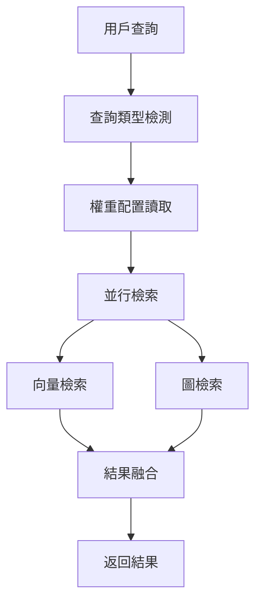

# Hybrid RAG 完整配置與使用指南

**代碼功能說明**: AI-Box Hybrid RAG 檢索查詢系統完整配置與使用指南
**創建日期**: 2026-01-23
**創建人**: Daniel Chung
**最後修改日期**: 2026-01-23

**整合來源**:
- HybridRAG問題定位與解決方案.md
- HybridRAG权重配置CRUD示例.md
- HybridRAG权重配置使用说明.md
- HybridRAG权重配置测试说明.md
- HybridRAG查询处理示例.md
- HybridRAG查询测试说明.md

---

## 📋 文檔概述

本文檔是 AI-Box 文件上傳後聊天過程文件詢問比對的核心檢索系統 - **Hybrid RAG** 的完整配置與使用指南。

Hybrid RAG 實現了向量檢索 + 圖檢索的混合檢索架構，支持動態權重配置和多層級查詢處理。

---

## 🏗️ 系統架構

### 核心組件

1. **HybridRAGService**: 主要的檢索服務
   - 位置: `genai/workflows/rag/hybrid_rag.py`
   - 功能: 向量檢索 + 圖檢索融合

2. **HybridRAGConfigService**: 權重配置服務
   - 位置: `genai/workflows/rag/hybrid_rag_config.py`
   - 功能: 動態權重配置管理

3. **AAMManager**: 長期記憶管理器
   - 位置: `agents/infra/memory/aam/aam_core.py`
   - 功能: 整合向量和圖檢索

### 檢索流程



---

## ⚙️ 權重配置系統

### 配置架構

支持三層級配置：**系統級 → 租戶級 → 用戶級**

#### 配置數據結構

```json
{
  "default": {
    "vector_weight": 0.6,
    "graph_weight": 0.4
  },
  "structure_query": {
    "vector_weight": 0.4,
    "graph_weight": 0.6
  },
  "semantic_query": {
    "vector_weight": 0.7,
    "graph_weight": 0.3
  },
  "entity_query": {
    "vector_weight": 0.3,
    "graph_weight": 0.7
  }
}
```

#### 查詢類型自動檢測

| 類型 | 關鍵詞 | 權重策略 | 示例 |
|------|--------|----------|------|
| `structure_query` | 框架、步驟、流程、階段、順序、架構、設計 | 向量 0.4，圖 0.6 | "AI需求分析框架步驟" |
| `entity_query` | 是什麼、關係、連接、包含、屬於 | 向量 0.3，圖 0.7 | "X與Y的關係是什麼" |
| `semantic_query` | 其他查詢 | 向量 0.7，圖 0.3 | "解釋一下AI需求分析" |

---

## 🔧 配置管理

### 1. 初始化默認配置

```python
from genai.workflows.rag.hybrid_rag_config import HybridRAGConfigService

# 創建配置服務
config_service = HybridRAGConfigService()

# 初始化默認配置
config_id = config_service.initialize_default_config(
    force=False,  # False=如果存在則跳過，True=強制覆蓋
    changed_by="system"
)
```

### 2. 獲取權重配置

#### 根據查詢動態獲取

```python
# 系統級權重（結構化查詢）
weights = config_service.get_weights(query="結構化的AI需求分析框架步驟")
# 返回: {"vector_weight": 0.4, "graph_weight": 0.6}

# 租戶級權重
weights = config_service.get_weights(
    query="AI需求分析框架",
    tenant_id="tenant_001"
)

# 用戶級權重
weights = config_service.get_weights(
    query="AI需求分析框架",
    tenant_id="tenant_001",
    user_id="user_001"
)
```

#### 獲取完整配置

```python
# 獲取系統級配置模型
config = config_service.get_config_model()
if config:
    print(f"Scope: {config.scope}")
    print(f"數據: {config.config_data}")
    print(f"啟用: {config.is_active}")
```

### 3. 保存權重配置

#### 保存系統級配置

```python
weights = {
    "default": {"vector_weight": 0.6, "graph_weight": 0.4},
    "structure_query": {"vector_weight": 0.4, "graph_weight": 0.6},
    "semantic_query": {"vector_weight": 0.7, "graph_weight": 0.3},
    "entity_query": {"vector_weight": 0.3, "graph_weight": 0.7},
}

config_id = config_service.save_weights(
    weights=weights,
    changed_by="admin_user"
)
```

#### 保存租戶級配置

```python
tenant_weights = {
    "default": {"vector_weight": 0.5, "graph_weight": 0.5},
    "structure_query": {"vector_weight": 0.3, "graph_weight": 0.7},
}

config_id = config_service.save_weights(
    weights=tenant_weights,
    tenant_id="tenant_001",
    changed_by="tenant_admin"
)
```

### 4. 更新權重配置

```python
# 部分更新
updated_weights = {
    "structure_query": {"vector_weight": 0.5, "graph_weight": 0.5}
}

config_id = config_service.update_weights(
    weights=updated_weights,
    changed_by="admin_user"
)
```

---

## 🚀 Hybrid RAG 服務使用

### 初始化服務

```python
from genai.workflows.rag.hybrid_rag import HybridRAGService
from agents.infra.memory.aam.aam_core import AAMManager

# 創建 AAM 管理器
aam_manager = AAMManager(...)

# 創建 Hybrid RAG 服務（自動從配置讀取權重）
hybrid_rag_service = HybridRAGService(
    aam_manager=aam_manager,
    tenant_id="tenant_001",  # 可選
    user_id="user_001",      # 可選
)
```

### 執行檢索

```python
# 基本檢索
results = hybrid_rag_service.retrieve(
    query="AI需求分析框架步驟",
    top_k=10
)

# 指定檢索策略
results = hybrid_rag_service.retrieve(
    query="AI需求分析框架步驟",
    top_k=10,
    strategy="vector_first"  # "vector_first", "graph_first", "hybrid"
)

# 自定義最小相關度
results = hybrid_rag_service.retrieve(
    query="AI需求分析框架步驟",
    top_k=10,
    min_relevance=0.5
)
```

### 結果格式

```python
# 返回格式
[
    {
        "content": "文檔內容片段...",
        "metadata": {
            "memory_id": "mem_123",
            "memory_type": "long_term",
            "priority": "medium",
            "source": "vector",  # 或 "graph"
            "file_id": "file_123",
            # ... 其他元數據
        },
        "score": 0.85
    },
    # ... 更多結果
]
```

---

## 🔍 查詢處理流程

### 1. 查詢類型檢測

系統自動根據查詢內容檢測類型：

```python
# 結構化查詢檢測
def _detect_query_type(self, query: str) -> str:
    if any(keyword in query for keyword in STRUCTURE_KEYWORDS):
        return "structure_query"
    if any(keyword in query for keyword in ENTITY_KEYWORDS):
        return "entity_query"
    return "semantic_query"
```

### 2. 權重動態調整

```python
# 根據查詢類型獲取對應權重
weights = config_service.get_weights(query=query)
vector_weight = weights["vector_weight"]
graph_weight = weights["graph_weight"]
```

### 3. 並行檢索執行

```python
# 並行執行向量和圖檢索
with ThreadPoolExecutor(max_workers=max_workers) as executor:
    vector_future = executor.submit(
        self.retrieval_service.retrieve,
        query, limit=top_k * 2, min_relevance=min_relevance
    )
    graph_future = executor.submit(self._graph_retrieval, query, top_k * 2)

    vector_results = vector_future.result(timeout=5.0)
    graph_results = graph_future.result(timeout=5.0)
```

### 4. 結果融合

```python
# 應用權重並合併結果
for memory in vector_results:
    memory.relevance_score *= vector_weight

for memory in graph_results:
    memory.relevance_score *= graph_weight

# 去重、排序、返回 Top-K
merged = self._merge_results(vector_results, graph_results, top_k)
```

---

## 🧪 測試說明

### 單元測試

#### 配置服務測試

```python
import pytest
from genai.workflows.rag.hybrid_rag_config import HybridRAGConfigService

def test_weight_validation():
    """測試權重驗證"""
    config_service = HybridRAGConfigService()

    # 有效權重
    assert config_service._validate_weights({"vector_weight": 0.6, "graph_weight": 0.4})

    # 無效權重 - 和不等於 1
    assert not config_service._validate_weights({"vector_weight": 0.5, "graph_weight": 0.4})

    # 無效權重 - 超出範圍
    assert not config_service._validate_weights({"vector_weight": 1.5, "graph_weight": 0.4})

def test_query_type_detection():
    """測試查詢類型檢測"""
    config_service = HybridRAGConfigService()

    # 結構化查詢
    assert config_service._detect_query_type("AI需求分析框架步驟") == "structure_query"

    # 實體查詢
    assert config_service._detect_query_type("X與Y的關係是什麼") == "entity_query"

    # 語義查詢
    assert config_service._detect_query_type("解釋一下AI") == "semantic_query"
```

#### Hybrid RAG 服務測試

```python
def test_hybrid_retrieval():
    """測試混合檢索"""
    aam_manager = Mock()
    service = HybridRAGService(aam_manager=aam_manager)

    results = service.retrieve("測試查詢", top_k=5)

    assert len(results) <= 5
    assert all("content" in r and "score" in r for r in results)
```

### 集成測試

#### 端到端測試

```python
def test_end_to_end_retrieval():
    """端到端檢索測試"""
    # 1. 設置測試數據
    # 2. 初始化服務
    # 3. 執行查詢
    # 4. 驗證結果

    config_service = HybridRAGConfigService()
    aam_manager = AAMManager(...)
    hybrid_service = HybridRAGService(aam_manager=aam_manager)

    # 測試不同類型的查詢
    queries = [
        "結構化的AI需求分析框架步驟",  # 應使用 structure_query 權重
        "X與Y的關係是什麼",              # 應使用 entity_query 權重
        "解釋一下AI需求分析",             # 應使用 semantic_query 權重
    ]

    for query in queries:
        results = hybrid_service.retrieve(query, top_k=10)
        assert len(results) > 0
        assert all(isinstance(r["score"], (int, float)) for r in results)
```

### 性能測試

```python
import time

def test_retrieval_performance():
    """檢索性能測試"""
    service = HybridRAGService(...)

    start_time = time.time()
    results = service.retrieve("測試查詢", top_k=10)
    elapsed = time.time() - start_time

    assert elapsed < 2.0  # 應在 2 秒內完成
    assert len(results) <= 10
```

---

## 🔧 問題定位與解決方案

### 常見問題

#### 1. 向量維度不匹配

**問題**: `Collection expecting embedding with dimension of 768, got 384`

**解決方案**:
```python
# 檢查向量維度
from services.api.services.vector_store_service import VectorStoreService
vector_store = VectorStoreService()
dimension = vector_store.get_collection_embedding_dimension("collection_name")

# 設置正確的模型
os.environ["OLLAMA_EMBEDDING_MODEL"] = "bge-large-zh-v1.5"  # 768維
```

#### 2. 圖檢索返回空結果

**檢查步驟**:
```python
# 1. 檢查 ArangoDB 連接
kg_service = KGBuilderService()
assert kg_service.client.db is not None

# 2. 檢查實體提取
entities = ner_service.extract_entities(query)
assert len(entities) > 0

# 3. 檢查圖譜匹配
matched = kg_service.find_matching_entities(entities)
assert len(matched) > 0
```

#### 3. 權重配置無效

**驗證權重**:
```python
weights = config_service.get_weights(query="測試查詢")
assert weights["vector_weight"] + weights["graph_weight"] == pytest.approx(1.0, abs=0.01)
assert 0.0 <= weights["vector_weight"] <= 1.0
assert 0.0 <= weights["graph_weight"] <= 1.0
```

### 調試工具

#### 圖檢索調試腳本

```bash
# 運行圖檢索調試
python scripts/debug_graph_retrieval.py
```

#### 綜合測試腳本

```bash
# 運行完整測試
python scripts/test_hybrid_rag_fixes.py
```

---

## 📊 配置示例

### 默認配置

```json
{
  "default": {"vector_weight": 0.6, "graph_weight": 0.4},
  "structure_query": {"vector_weight": 0.4, "graph_weight": 0.6},
  "semantic_query": {"vector_weight": 0.7, "graph_weight": 0.3},
  "entity_query": {"vector_weight": 0.3, "graph_weight": 0.7}
}
```

### 自定義配置

```json
{
  "default": {"vector_weight": 0.5, "graph_weight": 0.5},
  "structure_query": {"vector_weight": 0.3, "graph_weight": 0.7},
  "semantic_query": {"vector_weight": 0.8, "graph_weight": 0.2},
  "entity_query": {"vector_weight": 0.2, "graph_weight": 0.8}
}
```

---

## 🚀 部署建議

### 生產環境配置

```bash
# 設置權重配置
export HYBRID_RAG_VECTOR_WEIGHT_DEFAULT=0.6
export HYBRID_RAG_GRAPH_WEIGHT_DEFAULT=0.4

# 啟用配置緩存
export HYBRID_RAG_CONFIG_CACHE_ENABLED=true
export HYBRID_RAG_CONFIG_CACHE_TTL=300
```

### 監控指標

- 檢索響應時間
- 向量 vs 圖檢索命中率
- 配置加載成功率
- 權重動態調整效果

---

## 📚 相關文檔

- [AI-Box 雙軌 RAG 解析規格書](./AI-Box雙軌RAG解析規格書.md)
- [向量與圖檢索混合查詢邏輯](./向量與圖檢索混合查詢邏輯.md)
- [强化RAG系统](./强化RAG系统.md)

---

**整合完成日期**: 2026-01-23
**維護人**: Daniel Chung