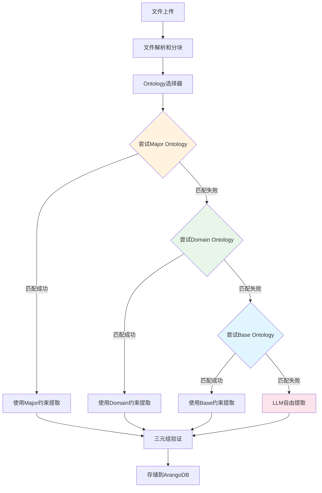

# Ontology选择策略 - 优先级降级Fallback实现说明

**创建日期**: 2026-01-01
**创建人**: Daniel Chung
**最后修改日期**: 2026-01-01

---

## 📋 概述

本文档说明AI-Box系统中Ontology选择策略的实现，采用**优先级降级fallback**机制，从最精确的Major Ontology逐步降级到Domain、Base，最终允许LLM自由发挥。

---

## 🎯 设计理念

### 优先级策略（降级Fallback）

**核心思想**：逐步降级，从最精确到最通用

1. **Tier 1: Major Ontology（优先尝试）**
   - 最精确的专业层Ontology
   - 如果匹配成功，使用major ontology进行提取

2. **Tier 2: Domain Ontology（如果major无法匹配）**
   - 领域层Ontology
   - 如果major找不到或匹配失败，降级到domain

3. **Tier 3: Base 5W1H Ontology（如果domain找不到）**
   - 基础层Ontology（5W1H通用本体）
   - 如果domain找不到，降级到base

4. **Tier 4: LLM自由发挥（如果都没有）**
   - 如果所有Ontology都找不到或匹配失败
   - 允许LLM自由提取，不施加Ontology约束

---

## 🔧 实现细节

### 1. KGExtractionService._load_ontology_for_extraction()

**位置**: `services/api/services/kg_extraction_service.py`

**主要修改**：

```python
def _load_ontology_for_extraction(
    self,
    file_name: Optional[str] = None,
    file_content: Optional[str] = None,
    file_metadata: Optional[Dict[str, Any]] = None,
    manual_ontology: Optional[Dict[str, Any]] = None,
) -> Optional[Dict[str, Any]]:
    """
    為提取任務載入合適的 Ontology（帶優先級降級fallback策略）

    優先級策略：
    1. Tier 1: Major Ontology（優先嘗試）
    2. Tier 2: Domain Ontology（如果major無法匹配）
    3. Tier 3: Base Ontology（如果domain找不到）
    4. Tier 4: None（如果都找不到，允許LLM自由發揮）

    Returns:
        合併後的 Ontology 規則，如果所有層級都找不到則返回 None（允許LLM自由發揮）
    """
    # Tier 1: 嘗試 Major Ontology（優先）
    if major_candidates:
        try:
            rules = self.ontology_manager.merge_ontologies(
                domain_files=[], task_file=major_file
            )
            return rules
        except Exception:
            # 降级到Tier 2
    
    # Tier 2: 嘗試 Domain Ontology
    if domain_candidates:
        try:
            rules = self.ontology_manager.merge_ontologies(
                domain_files=[domain_file], task_file=None
            )
            return rules
        except Exception:
            continue  # 尝试下一个domain
    
    # Tier 3: 嘗試 Base Ontology
    base_rules = self._try_load_base_ontology()
    if base_rules:
        return base_rules
    
    # Tier 4: 所有Ontology都找不到，允許LLM自由發揮
    return None
```

**关键点**：
- ✅ 按优先级顺序尝试加载Ontology
- ✅ 每个tier失败后自动降级到下一级
- ✅ 如果所有tier都失败，返回`None`表示允许LLM自由提取

### 2. TripleExtractionService.extract_triples()

**位置**: `genai/api/services/triple_extraction_service.py`

**主要修改**：

```python
async def extract_triples(
    self,
    text: str,
    entities: Optional[List[Entity]] = None,
    enable_ner: bool = True,
    ontology_rules: Optional[Dict[str, Any]] = None,  # 新增
) -> List[Triple]:
    """
    提取三元組

    Args:
        ontology_rules: Ontology規則（可選，如果為None則允許LLM自由提取）

    Returns:
        提取的三元組列表
    """
    # 如果ontology_rules為None，使用自由提取模式（不施加Ontology約束）
    if ontology_rules is None:
        logger.debug("Extracting triples without ontology constraints (LLM free mode)")
    
    # 原有的NER/RE/RT提取逻辑
    # ...
```

**关键点**：
- ✅ 新增`ontology_rules`参数（可选）
- ✅ 如果`ontology_rules`为`None`，允许LLM自由提取
- ✅ 所有调用`extract_triples`的地方都传递`ontology_rules`参数

### 3. 所有调用点的修改

**修改的位置**：

1. `extract_triples_from_chunks()` - `mode="entire_file"`分支
2. `_extract_from_chunks_batch()` - 批量提取
3. `extract_and_build_incremental()` - 增量提取
4. `extract_triples_from_file()` - 从文件提取（新增Ontology加载逻辑）

**修改模式**：

```python
# 修改前
triples = await self.triple_service.extract_triples(
    text=text, entities=None, enable_ner=True
)

# 修改后
triples = await self.triple_service.extract_triples(
    text=text, entities=None, enable_ner=True, ontology_rules=ontology_rules
)
```

---

## 📊 工作流程

### 完整流程图



### 详细步骤

1. **文件上传和解析**
   - 文件上传后，进行解析和分块

2. **Ontology选择（自动选择模式）**
   - 调用`OntologySelector.select_auto()`获取候选Ontology
   - 返回可能的major和domain候选列表

3. **优先级降级加载**
   - **Tier 1**: 尝试加载Major Ontology
     - 如果成功，使用Major Ontology进行提取
     - 如果失败（找不到或加载错误），继续下一级
   - **Tier 2**: 尝试加载Domain Ontology
     - 遍历所有domain候选，尝试加载
     - 如果成功，使用Domain Ontology进行提取
     - 如果都失败，继续下一级
   - **Tier 3**: 尝试加载Base Ontology
     - 调用`_try_load_base_ontology()`
     - 如果成功，使用Base Ontology进行提取
     - 如果失败，继续下一级
   - **Tier 4**: LLM自由发挥
     - 返回`None`表示不使用Ontology约束
     - LLM可以自由提取实体和关系

4. **三元组提取**
   - 调用`TripleExtractionService.extract_triples()`
   - 传递`ontology_rules`参数（可能为`None`）
   - 如果`ontology_rules`为`None`，使用自由提取模式

5. **存储到ArangoDB**
   - 提取的三元组存储到图数据库
   - 即使是无约束提取，结果仍然可以存储

---

## 🔄 与GraphRAG的整合

### GraphRAG三元组抓取逻辑

**GraphRAG（Graph-based Retrieval-Augmented Generation）**的核心思想：
- 基于知识图谱的检索增强生成
- 从文档中提取结构化知识（三元组）
- 存储到图数据库中，用于后续检索和推理

### 约束策略

**实现的逻辑**：

1. **优先使用精确约束**（Major Ontology）
   - 如果文档匹配major ontology，使用major的实体类和关系类型
   - 提供最精确的提取约束

2. **降级到通用约束**（Domain → Base）
   - 如果major匹配失败，降级到domain
   - 如果domain匹配失败，降级到base
   - 逐步放宽约束，但仍保持结构化

3. **最后允许自由提取**（LLM自由发挥）
   - 如果所有Ontology都找不到或匹配失败
   - 允许LLM自由提取，不施加Ontology约束
   - 提取结果仍然可以存储到图数据库

### 优势

- ✅ **灵活性**：根据文档特征自动选择最合适的约束策略
- ✅ **鲁棒性**：即使Ontology匹配失败，仍能进行提取
- ✅ **结构化**：即使自由提取，结果仍然可以存储到图数据库
- ✅ **符合GraphRAG理念**：从精确约束逐步降级到自由提取

---

## 📝 代码变更总结

### 修改的文件

1. **`services/api/services/kg_extraction_service.py`**
   - 修改`_load_ontology_for_extraction()`实现优先级降级策略
   - 新增`_try_load_base_ontology()`辅助方法
   - 修改所有`extract_triples()`调用点，传递`ontology_rules`参数
   - 更新文件头注释日期

2. **`genai/api/services/triple_extraction_service.py`**
   - 修改`extract_triples()`方法签名，新增`ontology_rules`参数
   - 添加Dict和Any类型导入
   - 更新文件头注释日期

3. **`kag/ontology_selector.py`**
   - 更新文件头注释日期（保持向后兼容，未修改逻辑）

### 新增功能

1. ✅ **优先级降级策略**：Major → Domain → Base → None
2. ✅ **LLM自由发挥支持**：如果所有Ontology都找不到，允许自由提取
3. ✅ **详细的日志记录**：记录每个tier的尝试结果和降级原因

### 向后兼容性

- ✅ **保持现有接口**：`select_auto()`方法保持不变
- ✅ **可选参数**：`ontology_rules`参数为可选，不影响现有调用
- ✅ **手动指定模式**：如果手动指定Ontology，不进行降级（保持原有行为）

---

## 🧪 测试建议

### 测试场景

1. **Major Ontology匹配成功**
   - 上传匹配major ontology的文件
   - 验证使用Major Ontology进行提取

2. **Major失败，Domain成功**
   - 上传匹配domain但无major的文件
   - 验证降级到Domain Ontology

3. **Major和Domain都失败，Base成功**
   - 上传无匹配domain/major的文件
   - 验证降级到Base Ontology

4. **所有Ontology都失败**
   - 上传无法匹配任何Ontology的文件
   - 验证返回`None`，允许LLM自由提取

5. **手动指定Ontology**
   - 手动指定major或domain
   - 验证不进行降级，直接使用指定的Ontology

---

## 📚 参考资料

1. `services/api/services/kg_extraction_service.py` - KG提取服务实现
2. `genai/api/services/triple_extraction_service.py` - 三元组提取服务实现
3. `kag/ontology_selector.py` - Ontology选择器
4. `docs/系统设计文档/核心组件/文件上傳向量圖譜/NER_RE_RT_Ontology集成问题分析.md` - Ontology集成问题分析
5. `docs/系统设计文档/核心组件/文件上傳向量圖譜/歸檔/圖譜化流程NER-RE-RT標簽化工作流程.md` - 工作流程文档

---

**最后更新日期**: 2026-01-01

