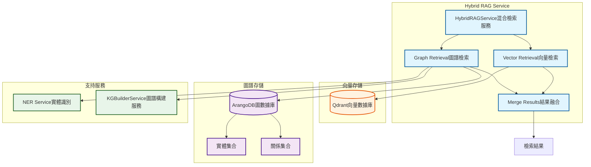
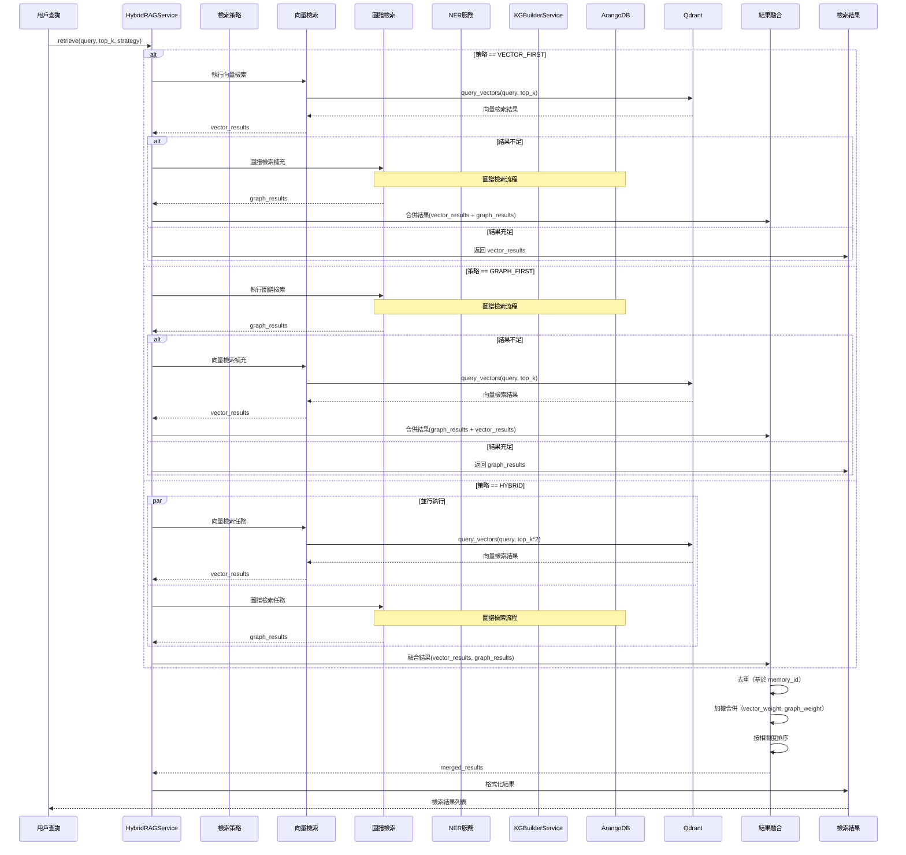
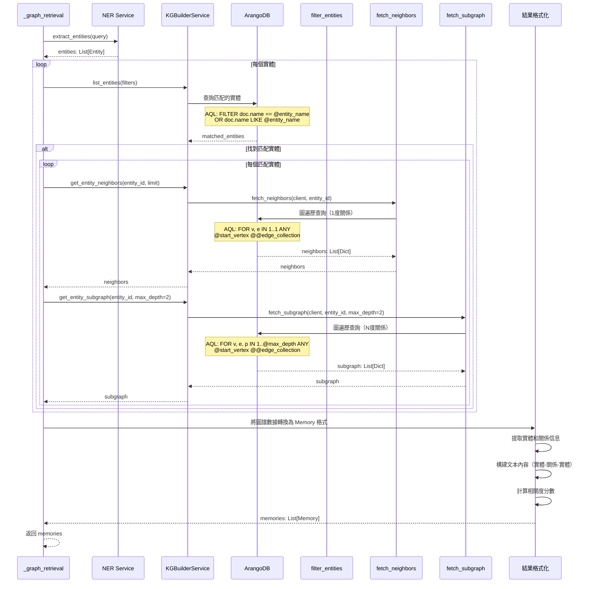
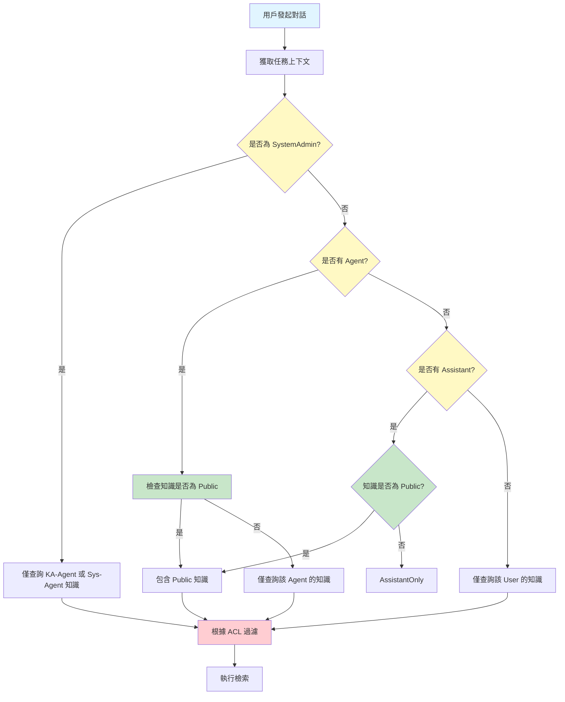

# 向量與圖檢索混合查詢邏輯

**創建日期**: 2026-01-05
**創建人**: Daniel Chung
**最後修改日期**: 2026-01-21

---

## 📋 概述

本文檔詳細說明基於 `HybridRAGService._graph_retrieval()` 方法的向量與圖檢索混合查詢邏輯，描述如何結合向量檢索（**Qdrant**）和圖譜檢索（ArangoDB）實現 Hybrid RAG（混合檢索增強生成）系統。

**重要更新** (2026-01-20):

- ✅ 向量數據庫從 ChromaDB 遷移到 **Qdrant**
- ✅ 雙軌 RAG 架構的 Contextual Header 提升檢索相關性

### 核心設計理念

**問題**：傳統的向量檢索只能找到語義相似的文檔片段，無法利用知識圖譜中的邏輯關係進行推理檢索。

**解決方案**：

1. **向量檢索**：快速找到語義相似的文檔片段（**Qdrant**）
2. **圖譜檢索**：通過知識圖譜的邏輯關係進行推理檢索（ArangoDB）
3. **混合檢索**：結合兩種檢索結果，提供更全面的知識檢索能力
4. **雙軌 RAG 增強**：Stage 2 的 Contextual Header 提供更多上下文，提升檢索精度

### 設計目標

- ✅ **全面性**：結合向量檢索的語義匹配和圖譜檢索的邏輯推理
- ✅ **性能**：支持並行檢索，提高檢索效率
- ✅ **靈活性**：支持多種檢索策略（向量優先、圖優先、混合模式）
- ✅ **可擴展性**：易於擴展新的檢索策略和結果融合方法

---

## 📊 實現狀態總覽

本文檔描述的功能架構與實際代碼實現的對比分析，幫助讀者了解系統的實際狀態和待改進點。

### 功能實現狀態總覽

| 功能模塊 | 實現狀態 | 完成度 | 備註 |
|---------|---------|--------|------|
| **HybridRAGService 框架** | ✅ 已實現 | 100% | 支持三種檢索策略，結果融合機制已實現 |
| **_graph_retrieval() 方法** | ✅ 已實現 | 100% | 完整實現實體識別、匹配、圖遍歷和結果格式化 |
| **結果融合機制** | ✅ 已實現 | 100% | 去重、加權合併、排序已實現 |
| **RetrievalManager 整合** | ✅ 已實現 | 100% | 已支持 HybridRAGService 作為可選策略 |
| **ChatMemoryService 整合** | ✗ 未實現 | 0% | 當前只使用向量檢索，未整合 HybridRAGService |
| **基礎設施（NER/KG服務）** | ✅ 已具備 | 100% | NER 服務、圖譜查詢服務和工具函數已可用 |

### 核心功能實現詳情

#### ✅ 已完全實現的功能

##### 1. HybridRAGService 框架

**實現位置**: `genai/workflows/rag/hybrid_rag.py`

**實現狀態**:

- ✅ 類定義完整（第 32-246 行）
- ✅ 支持三種檢索策略（VECTOR_FIRST, GRAPH_FIRST, HYBRID）
- ✅ 向量優先檢索（`_vector_first_retrieval`）已實現
- ✅ 圖優先檢索（`_graph_first_retrieval`）框架已實現
- ✅ 混合檢索（`_hybrid_retrieval`）已實現，支持並行執行
- ✅ 結果融合機制（`_merge_results`）已實現
- ✅ 結果格式化（`_format_for_llm`）已實現

**依賴服務**:

- ✅ `AAMManager`：AAM 管理器（已實現）
- ✅ `RealtimeRetrievalService`：實時檢索服務，用於向量檢索（已實現）
- ✅ `QdrantVectorStoreService`：Qdrant 向量存儲服務（已實現）
- ⚠️ **注意**：當前實現依賴 AAM 系統，AAM 系統底層使用 Qdrant 進行向量存儲

##### 2. 結果融合機制

**實現位置**: `genai/workflows/rag/hybrid_rag.py` 第 178-210 行

**實現狀態**:

- ✅ 去重機制（基於 `memory_id`）
- ✅ 加權合併（`vector_weight`, `graph_weight`）
- ✅ 排序機制（按 `relevance_score` 降序）
- ✅ 支持同一結果在兩種檢索中出現時的融合

##### 3. RetrievalManager 整合

**實現位置**: `genai/workflows/rag/manager.py` 第 82-90 行

**實現狀態**:

- ✅ 已支持 HybridRAGService 作為可選策略
- ✅ 如果提供了 `aam_hybrid_rag` 參數，優先使用 HybridRAGService
- ✅ 如果 HybridRAGService 失敗，降級到標準檢索邏輯

#### ✗ 未實現的功能

##### 1. _graph_retrieval() 方法

**實現位置**: `genai/workflows/rag/hybrid_rag.py` 第 176-240 行

**實現狀態**: ✅ **已實現**（2026-01-05）

**實現說明**:
該方法已完整實現，包括實體識別、實體匹配、圖遍歷和結果格式化四個步驟。

**已使用的基礎設施**:

- ✅ `NERService.extract_entities()` - 實體識別服務（`genai/api/services/ner_service.py`）
- ✅ `KGBuilderService.get_entity_neighbors()` - 獲取鄰居節點（`kg_builder_service.py` 第 712-723 行）
- ✅ `KGBuilderService.get_entity_subgraph()` - 獲取子圖（`kg_builder_service.py` 第 725-732 行）
- ✅ AQL 查詢 - 實體匹配查詢（使用 ArangoDB AQL 進行名稱模糊匹配）

**實現的功能**:

1. ✅ 實體識別：使用 NER 服務從查詢中提取實體（`_extract_entities_from_query()`）
2. ✅ 實體匹配：在 ArangoDB 中查找匹配的實體（`_find_matching_entities()`）
3. ✅ 圖遍歷：獲取實體的鄰居節點和子圖（使用 `KGBuilderService`）
4. ✅ 結果格式化：將圖譜數據轉換為 Memory 格式（`_format_graph_results()`）

**輔助方法**:

- `_get_ner_service()` - 獲取 NER 服務實例（懶加載）
- `_get_kg_service()` - 獲取圖譜構建服務實例（懶加載）
- `_extract_entities_from_query(query)` - 從查詢中提取實體（第 251-282 行）
- `_find_matching_entities(entities, limit)` - 在 ArangoDB 中查找匹配的實體（第 284-346 行）
- `_format_graph_results(graph_results, query, limit)` - 將圖譜數據轉換為 Memory 格式（第 351-463 行）

##### 2. ChatMemoryService 整合

**實現位置**: `services/api/services/chat_memory_service.py` 第 158-420 行

**當前實現**:

- ✅ 只使用向量檢索（`query_vectors` 或 `query_vectors_with_acl`）
- ✅ 支持 AAM 長期記憶檢索
- ✗ 未使用 HybridRAGService

**改進計劃**:

- 未來可以整合 HybridRAGService 以支持圖譜檢索
- 需要考慮如何與現有的向量檢索和 AAM 記憶整合

### 實現差異點總結

#### 1. 功能完整性差異

| 功能 | 文檔描述 | 實際實現 | 差異 |
|------|---------|---------|------|
| HybridRAGService 框架 | 完整設計 | ✅ 完全實現 | 無差異 |
| 檢索策略 | 三種策略 | ✅ 完全實現 | 無差異 |
| 結果融合 | 完整設計 | ✅ 完全實現 | 無差異 |
| 圖檢索 | 詳細設計 | ✗ 未實現 | 設計與實現不一致 |
| RetrievalManager 整合 | 已設計 | ✅ 已實現 | 無差異 |
| ChatMemoryService 整合 | 已設計 | ✗ 未實現 | 設計與實現不一致 |

#### 2. 技術實現差異

**向量檢索實現**:

- **文檔**: 描述使用 Qdrant 進行向量檢索
- **實現**: 實際使用 AAM 系統的 `RealtimeRetrievalService`，底層使用 Qdrant
- **差異**: 實現依賴 AAM 系統，AAM 系統底層使用 Qdrant 進行向量存儲

**圖檢索實現**:

- **文檔**: [向量與圖檢索混合查詢邏輯](./向量與圖檢索混合查詢邏輯.md) 提供完整實現設計
- **實現**: `_graph_retrieval()` 方法僅有框架，返回空列表
- **差異**: 設計完整但未實現，相關基礎設施已具備

### 建議改進優先級

#### 高優先級（影響核心功能）

1. **實現 _graph_retrieval() 方法**
   - 基礎設施已具備，只需整合實現
   - 參考：本文檔的「圖譜檢索實現設計」章節
   - 預計工作量：1-2 週

#### 中優先級（功能增強）

2. **ChatMemoryService 整合**
   - 整合 HybridRAGService 到 ChatMemoryService
   - 考慮如何與現有的向量檢索和 AAM 記憶整合
   - 預計工作量：1-2 週

---

## 🏗️ 架構設計

### 核心組件



---

## 🔄 檢索流程

### 完整檢索流程（Sequence Diagram）



### 圖譜檢索詳細流程（Sequence Diagram）



---

## 🔧 核心組件詳解

### 1. HybridRAGService

**位置**: `genai/workflows/rag/hybrid_rag.py`

**實現狀態**: ✅ **已實現**（框架完整，`_graph_retrieval()` 方法已實現）

**依賴服務**:

- `AAMManager`：AAM 管理器（用於長期記憶管理）
- `RealtimeRetrievalService`：實時檢索服務（用於向量檢索）
- ⚠️ **注意**：當前實現依賴 AAM 系統，不是直接使用 Qdrant。向量檢索通過 `RealtimeRetrievalService` 進行，該服務內部使用 Qdrant 進行向量存儲。

**核心方法**:

#### `retrieve(query, top_k, strategy, min_relevance)`

執行混合 RAG 檢索，根據策略調用對應的檢索方法。

**實現狀態**: ✅ **已實現**

**參數**:

- `query`: 查詢文本
- `top_k`: 返回結果數量
- `strategy`: 檢索策略（VECTOR_FIRST, GRAPH_FIRST, HYBRID）
- `min_relevance`: 最小相關度閾值

**返回**: `List[Dict[str, Any]]` - 格式化後的檢索結果

**實現位置**: `genai/workflows/rag/hybrid_rag.py` 第 66-112 行

#### `_graph_retrieval(query, limit)`

圖譜檢索核心方法。

**實現狀態**: ✅ **已實現**（2026-01-05）

**實現位置**: `genai/workflows/rag/hybrid_rag.py` 第 176-237 行

**實現說明**:

該方法已完整實現，包括以下步驟：

1. ✅ **實體識別**：使用 `_extract_entities_from_query()` 從查詢中提取實體
2. ✅ **實體匹配**：使用 `_find_matching_entities()` 在 ArangoDB 中查找匹配的實體
3. ✅ **圖遍歷**：使用 `KGBuilderService.get_entity_neighbors()` 和 `get_entity_subgraph()` 獲取實體的鄰居節點和子圖
4. ✅ **結果格式化**：使用 `_format_graph_results()` 將圖譜數據轉換為 Memory 格式

**已使用的基礎設施**:

- ✅ `NERService.extract_entities()` - 實體識別服務
- ✅ `KGBuilderService.get_entity_neighbors()` - 獲取鄰居節點
- ✅ `KGBuilderService.get_entity_subgraph()` - 獲取子圖
- ✅ AQL 查詢 - 實體匹配查詢（使用 ArangoDB AQL 進行名稱模糊匹配）

**輔助方法**:

- `_get_ner_service()` - 獲取 NER 服務實例（懶加載）
- `_get_kg_service()` - 獲取圖譜構建服務實例（懶加載）
- `_extract_entities_from_query(query)` - 從查詢中提取實體
- `_find_matching_entities(entities, limit)` - 在 ArangoDB 中查找匹配的實體
- `_format_graph_results(graph_results, query, limit)` - 將圖譜數據轉換為 Memory 格式

詳細說明見「圖譜檢索實現設計」章節。

### 2. 檢索策略

#### VECTOR_FIRST（向量優先）

1. 先執行向量檢索
2. 如果結果不足，使用圖譜檢索補充
3. 適用場景：需要快速響應、查詢語義明確

#### GRAPH_FIRST（圖優先）

1. 先執行圖譜檢索
2. 如果結果不足，使用向量檢索補充
3. 適用場景：需要邏輯推理、查詢包含明確實體

#### HYBRID（混合模式）

1. 並行執行向量檢索和圖譜檢索
2. 融合結果（加權合併、去重、排序）
3. 適用場景：需要最全面的檢索結果

### 3. 結果融合策略

#### 去重機制

- 基於 `memory_id` 去重
- 優先保留向量檢索結果（相關度通常更高）

#### 加權合併

- `vector_weight`: 向量檢索權重（默認 0.6）
- `graph_weight`: 圖譜檢索權重（默認 0.4）
- 如果同一結果同時出現在兩種檢索中，增加相關度分數

#### 排序機制

- 按 `relevance_score` 降序排序
- 返回前 `top_k` 個結果

---

## 📝 圖譜檢索實現設計

### 實現狀態

**當前狀態**: ✅ **已實現**

**實現位置**: `genai/workflows/rag/hybrid_rag.py` 第 176-240 行

**實現日期**: 2026-01-05

**已具備的基礎設施**: ✅ **已具備**

實現 `_graph_retrieval()` 方法所需的所有基礎設施都已具備：

- **NER 服務**: `NERService.extract_entities()` - 實體識別服務（`genai/api/services/ner_service.py`）
- **圖譜查詢服務**:
  - `KGBuilderService.list_entities()` - 實體查詢服務（`genai/api/services/kg_builder_service.py` 第 686-711 行）
  - `KGBuilderService.get_entity_neighbors()` - 獲取鄰居節點（`kg_builder_service.py` 第 712-723 行）
  - `KGBuilderService.get_entity_subgraph()` - 獲取子圖（`kg_builder_service.py` 第 725-732 行）
- **圖譜查詢工具函數**:
  - `fetch_neighbors()` - 圖查詢工具函數（`database/arangodb/queries.py` 第 25-62 行）
  - `fetch_subgraph()` - 子圖查詢工具函數（`database/arangodb/queries.py` 第 65-103 行）

### _graph_retrieval() 實現方案（已實現）

**實現位置**: `genai/workflows/rag/hybrid_rag.py` 第 176-240 行

**實現說明**: 該方法已完整實現，包括以下步驟：

1. **實體識別**：使用 `_extract_entities_from_query()` 從查詢中提取實體
2. **實體匹配**：使用 `_find_matching_entities()` 在 ArangoDB 中查找匹配的實體
3. **圖遍歷**：使用 `KGBuilderService.get_entity_neighbors()` 和 `get_entity_subgraph()` 獲取實體的鄰居節點和子圖
4. **結果格式化**：使用 `_format_graph_results()` 將圖譜數據轉換為 Memory 格式

**實現細節**:

- **懶加載服務**：使用 `_get_ner_service()` 和 `_get_kg_service()` 實現服務的懶加載
- **異步處理**：`_extract_entities_from_query()` 處理 NER 服務的異步調用，支持事件循環檢測
- **實體匹配**：使用 AQL 查詢進行名稱模糊匹配（精確匹配、LIKE 匹配、CONTAINS 匹配）
- **結果去重**：基於三元組唯一標識進行去重
- **相關度計算**：根據實體匹配度計算相關度分數（0.6-0.9）

**輔助方法**:

- `_get_ner_service()` - 獲取 NER 服務實例（懶加載）
- `_get_kg_service()` - 獲取圖譜構建服務實例（懶加載）
- `_extract_entities_from_query(query)` - 從查詢中提取實體（第 251-282 行）
- `_find_matching_entities(entities, limit)` - 在 ArangoDB 中查找匹配的實體（第 284-346 行）
- `_format_graph_results(graph_results, query, limit)` - 將圖譜數據轉換為 Memory 格式（第 351-463 行）

### 關鍵步驟詳解

#### 步驟 1: 實體識別

**服務**: `NERService`

**方法**: `extract_entities(text, ontology_rules)`

**功能**:

- 從查詢文本中提取命名實體
- 支持 Ontology 約束（實體類型列表）
- 返回 `List[Entity]`

**實現位置**: `genai/api/services/ner_service.py`

#### 步驟 2: 實體匹配

**服務**: `KGBuilderService`

**方法**: `list_entities(filters)`

**功能**:

- 在 ArangoDB 中查找匹配的實體
- 支持名稱模糊匹配（LIKE 查詢）
- 支持實體類型過濾

**AQL 查詢示例**:

```aql
FOR doc IN entities
    FILTER doc.name == @entity_name
       OR doc.name LIKE CONCAT("%", @entity_name, "%")
    LIMIT @limit
    RETURN doc
```

#### 步驟 3: 圖遍歷

**工具函數**: `database/arangodb/queries.py`

**方法**:

- `fetch_neighbors()`: 獲取 1 度關係鄰居
- `fetch_subgraph()`: 獲取 N 度關係子圖

**AQL 查詢示例**:

```aql
# 鄰居節點
FOR v, e IN 1..1 ANY @start_vertex @@edge_collection
    LIMIT @limit
    RETURN {vertex: v, edge: e}

# 子圖
FOR v, e, p IN 1..@max_depth ANY @start_vertex @@edge_collection
    LIMIT @limit
    RETURN {path: p, vertex: v, edge: e}
```

#### 步驟 4: 結果格式化

**功能**:

- 將圖譜數據（實體和關係）轉換為 `Memory` 格式
- 構建文本內容（實體-關係-實體三元組文本）
- 計算相關度分數（基於實體匹配度和關係重要性）

**格式示例**:

```python
Memory(
    content="中央廚房 - 生產 - 預製菜產品",
    metadata={
        "source": "graph",
        "entity_id": "entity_123",
        "relation_type": "produces",
        "file_id": "file_456"
    },
    relevance_score=0.85
)
```

---

## 🎯 使用場景

### 場景 1: 簡單查詢（向量優先）

**查詢**: "如何生產預製菜？"

**流程**:

1. 向量檢索找到相關文檔片段
2. 如果結果不足，圖譜檢索補充相關實體和關係

**適用策略**: `VECTOR_FIRST`

### 場景 2: 實體查詢（圖優先）

**查詢**: "東方伊廚公司生產哪些產品？"

**流程**:

1. 識別實體："東方伊廚"（Organization）
2. 圖譜檢索找到該實體的關係和相關實體
3. 如果結果不足，向量檢索補充

**適用策略**: `GRAPH_FIRST`

### 場景 3: 複雜查詢（混合模式）

**查詢**: "預製菜產品的生產流程和質量標準"

**流程**:

1. 並行執行向量檢索和圖譜檢索
2. 向量檢索找到相關文檔片段
3. 圖譜檢索找到相關實體（預製菜、生產流程、質量標準）和關係
4. 融合兩種檢索結果

**適用策略**: `HYBRID`

---

## 📊 性能優化

### 並行檢索

**實現**: 使用 `ThreadPoolExecutor` 並行執行向量和圖檢索

**優勢**:

- 減少總檢索時間
- 提高系統吞吐量

**配置**:

- `max_workers`: 並行工作線程數（默認 4）

### 結果緩存

**實現**: 使用 `_cache` 字典緩存檢索結果

**緩存鍵**: `f"{query}:{top_k}:{strategy}"`

**優勢**:

- 避免重複檢索
- 提高響應速度

**注意**: 需要實現緩存過期機制

### 圖查詢優化

**索引**: 確保 ArangoDB 中的實體和關係有適當的索引

**建議索引**:

- `entities.name`: 全文索引或普通索引
- `entities.type`: 普通索引
- `relations.type`: 普通索引
- `relations._from`, `relations._to`: 邊索引（自動創建）

---

## 🔄 與現有系統的整合

### RetrievalManager 整合

**實現狀態**: ✅ **已實現**

**位置**: `genai/workflows/rag/manager.py`

**實現位置**: 第 82-90 行

**整合方式**:

- ✅ 在 `RetrievalManager` 中已支持 `HybridRAGService`
- ✅ 作為可選的檢索策略
- ✅ 如果提供了 `aam_hybrid_rag` 參數，優先使用 HybridRAGService
- ✅ 如果 HybridRAGService 失敗，降級到標準檢索邏輯

**當前實現**:

```python
# 當前實現（已支持）
if self.aam_hybrid_rag is not None and AAM_AVAILABLE:
    try:
        aam_results = self.aam_hybrid_rag.retrieve(query, top_k=n_results)
        if aam_results:
            logger.debug(f"AAM Hybrid RAG returned {len(aam_results)} results")
            return aam_results
    except Exception as e:
        logger.warning(f"AAM Hybrid RAG failed, falling back to standard retrieval: {e}")

# 標準檢索邏輯（fallback）
# ...
```

**使用方式**:

```python
# 初始化 RetrievalManager 時提供 HybridRAGService
hybrid_rag = HybridRAGService(aam_manager, ...)
retrieval_manager = RetrievalManager(
    aam_hybrid_rag=hybrid_rag  # 可選參數，使用 AAM 系統（底層使用 Qdrant）
)

# 檢索時會自動使用 HybridRAGService
results = retrieval_manager.retrieve(query, n_results=10)
```

### ChatMemoryService 整合

**實現狀態**: ✗ **未整合**

**位置**: `services/api/services/chat_memory_service.py`

**方法**: `retrieve_for_prompt()`

**實現位置**: 第 158-420 行

**當前實現**:

- ✅ 只使用向量檢索（`query_vectors` 或 `query_vectors_with_acl`）
- ✅ 支持 AAM 長期記憶檢索
- ✗ 未使用 HybridRAGService
- ✗ 不支持圖譜檢索

**當前實現示例**:

```python
# 當前實現（僅向量檢索）
embedding = await self._embedding_service.generate_embedding(normalized_query, ...)

# 向量檢索
rag_results = await asyncio.to_thread(
    self._vector_store_service.query_vectors_with_acl,
    user=user,
    query_embedding=embedding,
    file_id=fid,
    user_id=user_id,
    n_results=self._rag_top_k,
)

# AAM 長期記憶檢索
aam_results = await self._aam_manager.retrieve(...)
```

**改進計劃**:

未來可以整合 `HybridRAGService` 以支持圖譜檢索：

```python
# 未來實現（混合檢索）
# 1. 初始化 HybridRAGService（需要 AAMManager）
hybrid_rag = HybridRAGService(
    aam_manager=self._aam_manager,
    retrieval_service=RealtimeRetrievalService(self._aam_manager),
    strategy=RetrievalStrategy.HYBRID
)

# 2. 在 retrieve_for_prompt() 中使用
hybrid_results = hybrid_rag.retrieve(
    query=normalized_query,
    top_k=self._rag_top_k,
    strategy=RetrievalStrategy.HYBRID
)

# 3. 與 AAM 長期記憶合併
# ...
```

**整合考慮**:

- 需要考慮如何與現有的向量檢索和 AAM 記憶整合
- 需要處理權限檢查（ACL）與圖檢索的整合
- 需要考慮性能影響（圖檢索可能比向量檢索慢）

---

## 🔒 權限控制邏輯

### 概述

AI-Box 主要服務於 **Agent** 和 **Assistant**，檢索系統需要根據當前對話上下文實施精確的權限控制，確保：
1. **上下文感知**：檢索範圍與當前任務對應的 Agent/Assistant 綁定
2. **多層權限**：支持 User、Assistant、Agent 三層級的訪問控制
3. **系統管理員特殊處理**：SystemAdmin 僅能訪問特定知識源
4. **知識類型區分**：區分 KA-Agent 知識、Sys-Agent 知識、Public 知識

### 對話上下文識別

在每次對話開始時，系統需要確定以下信息：

#### 1. 當前任務的執行上下文

```python
# 在 chat.py:_process_chat_request() 中獲取
task_id = request_body.task_id

# 查詢任務元數據（ArangoDB: task_metadata）
task = await get_task_metadata(task_id)

# 確定當前上下文
context = {
    "user_id": current_user.user_id,
    "task_id": task_id,
    "assistant_id": task.execution_config.get("assistant_id"),  # 如果有的話
    "agent_id": task.execution_config.get("agent_id"),  # 如果有的話
    "is_system_admin": is_system_admin(current_user),
}
```

#### 2. 權限決策流程圖



### 權限決策邏輯

#### 1. SystemAdmin 權限控制

```python
async def get_retrieval_context(
    task_id: str,
    current_user: User,
) -> RetrievalContext:
    """
    獲取檢索上下文，包含權限決策
    
    Returns:
        RetrievalContext: 檢索上下文對象
    """
    # 獲取任務元數據
    task = await get_task_metadata(task_id)
    
    # 獲取當前用戶角色
    is_system_admin = is_system_admin(current_user)
    
    # 獲取 Agent 和 Assistant 信息
    agent_id = task.execution_config.get("agent_id")
    assistant_id = task.execution_config.get("assistant_id")
    
    # 構建檢索上下文
    context = RetrievalContext(
        user_id=current_user.user_id,
        task_id=task_id,
        agent_id=agent_id,
        assistant_id=assistant_id,
        is_system_admin=is_system_admin,
    )
    
    # 決策檢索策略
    if is_system_admin:
        # SystemAdmin 只能查詢 KA-Agent 或 Sys-Agent 知識
        context.retrieval_strategy = SystemAdminStrategy()
    elif agent_id:
        # 有 Agent：檢查知識是否為 Public，否則僅查詢該 Agent
        context.retrieval_strategy = AgentScopedStrategy(agent_id)
    elif assistant_id:
        # 有 Assistant：檢查知識是否為 Public，否則僅查詢該 Assistant
        context.retrieval_strategy = AssistantScopedStrategy(assistant_id)
    else:
        # 都沒有：僅查詢該 User 的知識
        context.retrieval_strategy = UserScopedStrategy(current_user.user_id)
    
    return context
```

#### 2. 權限決策策略

```python
from abc import ABC, abstractmethod
from typing import List, Any

class RetrievalStrategy(ABC):
    """檢索策略基類"""
    
    @abstractmethod
    async def apply_filters(
        self,
        query: str,
        vector_store: QdrantVectorStoreService,
        kg_service: KGBuilderService,
        **kwargs
    ) -> List[Any]:
        """
        應用權限過濾並返回檢索結果
        
        Args:
            query: 查詢文本
            vector_store: Qdrant 向量存儲服務
            kg_service: 知識圖譜構建服務
            **kwargs: 其他參數
        
        Returns:
            檢索結果列表
        """
        pass


class SystemAdminStrategy(RetrievalStrategy):
    """SystemAdmin 檢索策略：僅查詢 KA-Agent 或 Sys-Agent 知識"""
    
    async def apply_filters(
        self,
        query: str,
        vector_store: QdrantVectorStoreService,
        kg_service: KGBuilderService,
        **kwargs
    ) -> List[Any]:
        # SystemAdmin 只能查詢以下知識：
        # 1. KA-Agent 的知識（agent_id="KA-Agent"）
        # 2. Sys-Agent 的知識（agent_id 開頭為 "sys-" 或未來新增的 Sys-Agent）
        # 3. Public 知識（access_control.visibility="PUBLIC"）
        
        # 向量檢索：過濾 collection 和 payload
        vector_results = await vector_store.query_vectors(
            query_embedding=query_embedding,
            collections=["ka_agent", "sys_agent"],  # 僅查詢這些 collection
            payload_filter={
                "OR": [
                    {"agent_id": "KA-Agent"},
                    {"agent_id": {"STARTSWITH": "sys-"}},
                ]
            },
            n_results=10,
        )
        
        # 圖譜檢索：過濾實體和關係
        graph_results = await kg_service.query_entities(
            query=query,
            filters={
                "OR": [
                    {"agent_id": "KA-Agent"},
                    {"agent_id": {"STARTSWITH": "sys-"}},
                ]
            },
        )
        
        # 合併結果
        results = self._merge_results(vector_results, graph_results)
        return results
    
    def _merge_results(self, vector_results, graph_results):
        # 合併並去重
        pass


class AgentScopedStrategy(RetrievalStrategy):
    """Agent 範圍檢索策略：檢查知識是否為 Public，否則僅查詢該 Agent"""
    
    def __init__(self, agent_id: str):
        self.agent_id = agent_id
    
    async def apply_filters(
        self,
        query: str,
        vector_store: QdrantVectorStoreService,
        kg_service: KGBuilderService,
        **kwargs
    ) -> List[Any]:
        # 檢查知識是否為 Public
        public_results = await vector_store.query_vectors(
            query_embedding=query_embedding,
            payload_filter={
                "visibility": "PUBLIC",  # Public 知識
            },
            n_results=5,
        )
        
        # 檢索該 Agent 的知識
        agent_results = await vector_store.query_vectors(
            query_embedding=query_embedding,
            payload_filter={
                "agent_id": self.agent_id,
                "visibility": {"$ne": "PUBLIC"},  # 非 Public 的該 Agent 知識
            },
            n_results=5,
        )
        
        # 圖譜檢索：類似的過濾邏輯
        # ...
        
        # 合併 Public 和 Agent 結果
        results = public_results + agent_results
        return results


class AssistantScopedStrategy(RetrievalStrategy):
    """Assistant 範圍檢索策略：檢查知識是否為 Public，否則僅查詢該 Assistant"""
    
    def __init__(self, assistant_id: str):
        self.assistant_id = assistant_id
    
    async def apply_filters(
        self,
        query: str,
        vector_store: QdrantVectorStoreService,
        kg_service: KGBuilderService,
        **kwargs
    ) -> List[Any]:
        # 與 AgentScopedStrategy 類似，但是針對 Assistant
        pass


class UserScopedStrategy(RetrievalStrategy):
    """User 範圍檢索策略：僅查詢該 User 的知識"""
    
    def __init__(self, user_id: str):
        self.user_id = user_id
    
    async def apply_filters(
        self,
        query: str,
        vector_store: QdrantVectorStoreService,
        kg_service: KGBuilderService,
        **kwargs
    ) -> List[Any]:
        # 僅查詢該 User 的知識
        user_results = await vector_store.query_vectors(
            query_embedding=query_embedding,
            payload_filter={
                "user_id": self.user_id,
            },
            n_results=10,
        )
        
        return user_results
```

### File Metadata 的 ACL 過濾

根據 `file_metadata.access_control` 進行權限檢查：

```python
class FileAccessControl(BaseModel):
    """文件訪問控制"""
    
    visibility: str = Field(..., description="可見性：PUBLIC / PRIVATE / AGENT_ONLY / ASSISTANT_ONLY")
    allowed_users: List[str] = Field(default_factory=list, description="允許訪問的用戶 ID 列表")
    allowed_assistants: List[str] = Field(default_factory=list, description="允許訪問的 Assistant ID 列表")
    allowed_agents: List[str] = Field(default_factory=list, description="允許訪問的 Agent ID 列表")
    allowed_roles: List[str] = Field(default_factory=list, description="允許訪問的角色列表（如 system_admin）")
    data_classification: str = Field(default="INTERNAL", description="數據分類級別")
    sensitivity_labels: List[str] = Field(default_factory=list, description="敏感性標籤")
```

#### ACL 檢查邏輯

```python
async def check_file_access(
    file_metadata: FileMetadata,
    context: RetrievalContext,
) -> bool:
    """
    檢查文件訪問權限
    
    Args:
        file_metadata: 文件元數據
        context: 檢索上下文
    
    Returns:
        是否允許訪問
    """
    access_control = file_metadata.access_control
    if not access_control:
        return True  # 沒有 ACL，默認允許訪問
    
    # 1. SystemAdmin 特殊處理
    if context.is_system_admin:
        # SystemAdmin 只能訪問特定知識
        if file_metadata.agent_id == "KA-Agent":
            return True
        if file_metadata.agent_id and file_metadata.agent_id.startswith("sys-"):
            return True
        if access_control.visibility == "PUBLIC":
            return True
        return False
    
    # 2. Public 知識
    if access_control.visibility == "PUBLIC":
        return True
    
    # 3. Private 知識：檢查具體權限
    if access_control.visibility == "PRIVATE":
        # 檢查用戶
        if context.user_id in access_control.allowed_users:
            return True
        
        # 檢查 Assistant
        if context.assistant_id and context.assistant_id in access_control.allowed_assistants:
            return True
        
        # 檢查 Agent
        if context.agent_id and context.agent_id in access_control.allowed_agents:
            return True
        
        # 檢查角色
        if "system_admin" in access_control.allowed_roles:
            return True
        
        return False
    
    # 4. Agent-Only 知識
    if access_control.visibility == "AGENT_ONLY":
        if context.agent_id and context.agent_id in access_control.allowed_agents:
            return True
        return False
    
    # 5. Assistant-Only 知識
    if access_control.visibility == "ASSISTANT_ONLY":
        if context.assistant_id and context.assistant_id in access_control.allowed_assistants:
            return True
        return False
    
    # 默認拒絕
    return False
```

### 整合到 ChatMemoryService

修改 `ChatMemoryService.retrieve_for_prompt()` 方法，使用權限決策：

```python
async def retrieve_for_prompt(
    self,
    *,
    user_id: str,
    session_id: str,
    task_id: Optional[str],
    request_id: Optional[str],
    query: str,
    attachments: Optional[List[ChatAttachment]] = None,
    user: Optional[User] = None,  # 新增：用於權限檢查
) -> MemoryRetrievalResult:
    start = time.perf_counter()
    
    # 新增：獲取檢索上下文
    retrieval_context = await self._get_retrieval_context(task_id, user)
    
    # 新增：應用權限策略
    if self._use_hybrid_rag:
        hybrid_rag = self._get_hybrid_rag_service()
        if hybrid_rag is not None:
            # 使用權限策略進行檢索
            hybrid_results = await hybrid_rag.retrieve_with_acl(
                query=normalized_query,
                context=retrieval_context,
                top_k=self._rag_top_k
            )
    else:
        # 傳統向量檢索，使用 ACL 過濾
        rag_results = await asyncio.to_thread(
            self._vector_store_service.query_vectors_with_acl,
            user=user,
            query_embedding=embedding,
            context=retrieval_context,  # 傳遞上下文
            n_results=self._rag_top_k,
        )
```

### 實現建議

#### 優先級 1（高）：檢索上下文獲取

1. **實現 `_get_retrieval_context()` 方法**
   - 在 `ChatMemoryService` 中添加該方法
   - 從任務元數據中獲取 agent_id、assistant_id
   - 檢查用戶是否為 SystemAdmin
   - 返回 `RetrievalContext` 對象

2. **修改 `retrieve_for_prompt()` 方法**
   - 調用 `_get_retrieval_context()` 獲取上下文
   - 將上下文傳遞給檢索服務

#### 優先級 2（高）：權限策略實現

1. **實現四大策略類**
   - `SystemAdminStrategy`
   - `AgentScopedStrategy`
   - `AssistantScopedStrategy`
   - `UserScopedStrategy`

2. **實現 ACL 檢查**
   - 實現 `check_file_access()` 方法
   - 整合到檢索結果的過濾邏輯中

#### 優先級 3（中）：HybridRAGService 整合

1. **添加 `retrieve_with_acl()` 方法**
   - 在 `HybridRAGService` 中添加該方法
   - 支持傳遞 `RetrievalContext` 參數
   - 在向量檢索和圖譜檢索中應用權限過濾

#### 優先級 4（低）：緩存優化

1. **實現檢索上下文緩存**
   - 緩存任務元數據
   - 緩存 Agent 和 Assistant 配置
   - 減少數據庫查詢次數

---

## 📚 相關文檔

### 核心架構文檔

- [強化 RAG 系統](./强化RAG系统.md) - RAG 系統架構詳解
- [知識圖譜系統](./知识图谱系统.md) - 知識圖譜系統架構詳解
- [上傳的功能架構說明](./上傳的功能架構說明-v3.0.md) - 文件上傳和處理流程

### 技術實現文檔

- `HybridRAGService`: `genai/workflows/rag/hybrid_rag.py` - 混合 RAG 服務實現
- `KGBuilderService`: `genai/api/services/kg_builder_service.py` - 圖譜構建服務
- `NERService`: `genai/api/services/ner_service.py` - 實體識別服務
- 圖譜查詢工具: `database/arangodb/queries.py` - 圖譜查詢工具函數
- `RetrievalManager`: `genai/workflows/rag/manager.py` - 檢索管理器（已支持 HybridRAGService）
- `ChatMemoryService`: `services/api/services/chat_memory_service.py` - 聊天記憶服務（未整合 HybridRAGService）
- `RealtimeRetrievalService`: `agents/infra/memory/aam/realtime_retrieval.py` - 實時檢索服務（向量檢索）

---

## 🔮 未來改進方向

### 短期改進（1-2 週）

#### 1. 實現 _graph_retrieval() 方法（已完成）

**狀態**: ✅ **已完成**（2026-01-05）

**實現內容**:

- ✅ 整合 NER 服務和圖譜查詢工具
- ✅ 實現實體識別和匹配邏輯
- ✅ 實現圖遍歷邏輯（鄰居節點和子圖）
- ✅ 實現結果格式化邏輯（將圖譜數據轉換為 Memory 格式）

**待完成任務**:

- ⏸️ 添加單元測試和集成測試（建議優先級：中）

**相關文檔**: 本文檔的「圖譜檢索實現設計」章節

#### 2. 結果融合優化（中優先級）

**目標**: 改進相關度分數計算方法

**任務**:

- 改進相關度分數計算方法
- 支持自適應權重調整
- 優化去重邏輯

**預計工作量**: 3-5 天

#### 3. ChatMemoryService 整合（中優先級）

**目標**: 整合 HybridRAGService 到 ChatMemoryService

**任務**:

- 在 ChatMemoryService 中整合 HybridRAGService
- 考慮如何與現有的向量檢索和 AAM 記憶整合
- 處理權限檢查（ACL）與圖檢索的整合
- 優化性能（考慮圖檢索的延遲）

**預計工作量**: 1-2 週

### 中期改進（1-2 個月）

1. **圖譜檢索優化**

   - 支持更複雜的圖查詢模式（路徑查詢、模式匹配）
   - 實現圖譜索引優化
2. **緩存機制**

   - 實現結果緩存
   - 支持緩存過期和更新策略

### 長期改進（3-6 個月）

1. **智能策略選擇**

   - 根據查詢類型自動選擇檢索策略
   - 使用機器學習優化權重參數
2. **圖譜推理增強**

   - 支持更複雜的圖推理模式
   - 實現知識圖譜嵌入（Knowledge Graph Embedding）

---

## 📊 實現狀態對比表

### 設計與實際實現對比

| 功能模塊 | 設計狀態 | 實際實現狀態 | 完成度 | 備註 |
|---------|---------|------------|--------|------|
| **HybridRAGService 框架** | 已設計 | ✅ 已實現 | 100% | 支持三種檢索策略，結果融合機制已實現 |
| **_graph_retrieval() 方法** | 已設計 | ✅ 已實現 | 100% | 完整實現實體識別、匹配、圖遍歷和結果格式化 |
| **結果融合機制** | 已設計 | ✅ 已實現 | 100% | 去重、加權合併、排序已實現 |
| **RetrievalManager 整合** | 已設計 | ✅ 已實現 | 100% | 已支持 HybridRAGService 作為可選策略 |
| **ChatMemoryService 整合** | 已設計 | ✗ 未實現 | 0% | 當前只使用向量檢索，未整合 HybridRAGService |
| **基礎設施（NER/KG服務）** | 已設計 | ✅ 已具備 | 100% | NER 服務、圖譜查詢服務和工具函數已可用 |

### 技術實現差異

#### 向量檢索實現差異

| 方面 | 文檔描述 | 實際實現 | 差異 |
|------|---------|---------|------|
| **數據庫** | Qdrant | AAM 系統（RealtimeRetrievalService，底層使用 Qdrant） | 實現依賴 AAM 系統，而非直接訪問 Qdrant |
| **檢索方式** | 直接查詢 Qdrant | 通過 RealtimeRetrievalService | 抽象層不同 |

#### 圖檢索實現差異

| 方面 | 文檔描述 | 實際實現 | 差異 |
|------|---------|---------|------|
| **實現狀態** | 完整設計方案 | 僅有框架，返回空列表 | 設計完整但未實現 |
| **基礎設施** | 需要 NER/KG 服務 | ✅ 已具備 | 基礎設施已準備就緒 |

---

## 更新記錄

- **2026-01-05**: 初始版本，描述基於 `HybridRAGService._graph_retrieval()` 的向量與圖檢索混合查詢邏輯
- **2026-01-05**: 添加實現狀態總覽章節，說明 HybridRAGService 框架已實現、_graph_retrieval() 未實現、以及依賴服務狀態；更新核心組件詳解，說明實際依賴（AAM 系統）；更新與現有系統的整合狀態，說明 RetrievalManager 已支持、ChatMemoryService 未整合；更新圖譜檢索實現設計，標註實現狀態和已具備的基礎設施；更新未來改進方向，調整優先級並添加 ChatMemoryService 整合計劃
- **2026-01-05**: 實現 `_graph_retrieval()` 方法，包括實體識別、實體匹配、圖遍歷和結果格式化；添加輔助方法 `_extract_entities_from_query()`, `_find_matching_entities()`, `_format_graph_results()`, `_get_ner_service()`, `_get_kg_service()`；更新實現狀態為「已實現」
