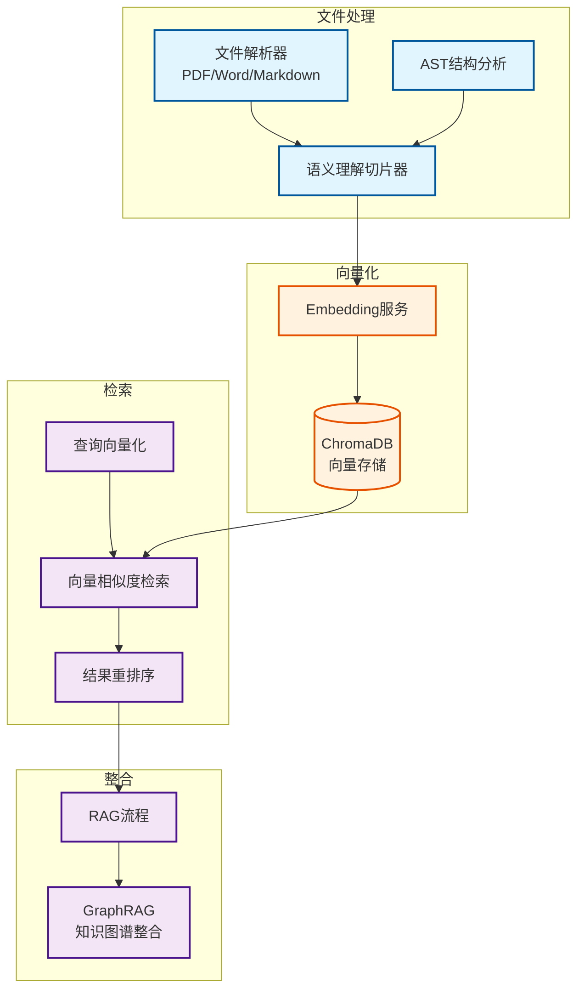

# 强化RAG系统架构文档

**创建日期**: 2025-12-25
**创建人**: Daniel Chung
**最后修改日期**: 2025-12-25

---

## 📋 概述

强化RAG系统是 AI-Box 的核心知识检索架构，通过语义理解切片技术与 ChromaDB 向量存储，实现精准的文档检索与知识增强。系统避免了传统RAG系统中完整段落被切割的问题，提供了更高质量的知识检索能力。

> **相关文档**：
>
> - [文件上传架构说明](./上傳的功能架構說明-v2.0.md) - RAG 系统详解
> - [AAM系统](../AAM系统.md) - AAM 与 RAG 的整合
> - [知识图谱系统](./知识图谱系统.md) - 图检索与向量检索的协同

---

## 🏗️ 架构设计

### 核心设计理念

**问题**：传统RAG系统在文档切片时，可能会将完整的段落、句子切割，导致语义不完整，影响检索质量。

**解决方案**：

1. **语义理解切片**：通过大模型理解文意，识别语义边界
2. **AST驱动切片**：基于文档结构（标题层级）进行切片
3. **智能分块策略**：结合语义与结构，避免切割完整段落

### 架构图

---

## 🔧 核心组件

### 1. 语义理解切片

**技术方案**：

- 使用大模型理解文档语义
- 识别段落边界、句子边界
- 避免切割完整的语义单元

**实现位置**：`services/api/processors/chunk_processor.py`

**切片策略**：

1. **结构优先**：优先基于文档结构（标题层级）切片
2. **语义边界**：在结构基础上，识别语义边界
3. **大小控制**：控制切片大小，避免过大或过小

### 2. ChromaDB 向量存储

**存储架构**：

- **Collection**：按文件或任务组织的向量集合
- **Metadata**：存储文档元数据（文件ID、任务ID、用户ID等）
- **索引**：向量索引用于快速相似度检索

**实现位置**：

- 存储服务：`database/chromadb/`
- 向量存储服务：`services/api/services/vector_store_service.py`

**核心功能**：

- 向量存储与检索
- Metadata 过滤
- 批量操作优化

### 3. 检索流程

**检索步骤**：

1. **查询向量化**：将用户查询转换为向量
2. **向量相似度检索**：在 ChromaDB 中检索相似向量
3. **Metadata 过滤**：根据文件ID、任务ID等过滤结果
4. **结果重排序**：根据相关性、时间等因素重排序
5. **Top-K 返回**：返回最相关的 K 个结果

**实现位置**：

- 检索服务：`services/api/services/chat_memory_service.py`
- RAG 管理器：`genai/workflows/rag/manager.py`

---

## 🔄 与知识图谱的协同

### 混合检索架构

**向量检索 + 图检索**：

- **向量检索**：快速找到语义相似的文档片段
- **图检索**：通过知识图谱的逻辑关系进行推理检索
- **结果融合**：合并两种检索结果，提升检索精度

**实现状态**：🔄 **部分实现**（向量检索已实现，图检索整合进行中）

---

## 📊 实现状态

### 已完成功能

| 功能模块 | 状态 | 说明 |
|---------|------|------|
| 文件解析 | ✅ 已实现 | PDF、Word、Markdown 等格式解析 |
| 语义切片 | ✅ 已实现 | ChunkProcessor 实现语义理解切片 |
| ChromaDB 存储 | ✅ 已实现 | 向量存储与检索 |
| 向量检索 | ✅ 已实现 | 相似度检索与 Metadata 过滤 |
| RAG 流程 | ✅ 已实现 | 基础的 RAG 检索流程 |

### 进行中功能

| 功能模块 | 状态 | 说明 |
|---------|------|------|
| 图检索整合 | 🔄 进行中 | 与知识图谱系统的整合 |
| 结果重排序 | 🔄 进行中 | 基于相关性的重排序优化 |
| 混合检索优化 | 🔄 进行中 | 向量检索与图检索的融合策略 |

---

## 🗺️ 开发进度

### 阶段四完成情况

根据 [项目控制表](../../../開發過程文件/項目控制表.md)，**阶段四：数据处理阶段**已完成：

- ✅ **文件解析与切片**（已完成）
- ✅ **向量化与存储**（已完成）
- ✅ **基础 RAG 检索**（已完成）

### 下一阶段计划

1. **图检索整合**：与知识图谱系统深度整合
2. **混合检索优化**：优化向量检索与图检索的融合策略
3. **检索性能优化**：提升检索速度与精度

---

## 📚 参考资料

### 相关文档

- [文件上传架构说明](./上傳的功能架構說明-v2.0.md)
- [AAM系统](../AAM系统.md)
- [知识图谱系统](./知识图谱系统.md)

### 代码位置

- 文件解析：`services/api/processors/parsers/`
- 切片处理：`services/api/processors/chunk_processor.py`
- 向量存储：`database/chromadb/`
- 检索服务：`services/api/services/vector_store_service.py`
- RAG 管理器：`genai/workflows/rag/manager.py`

---

**最后更新日期**: 2025-12-25
