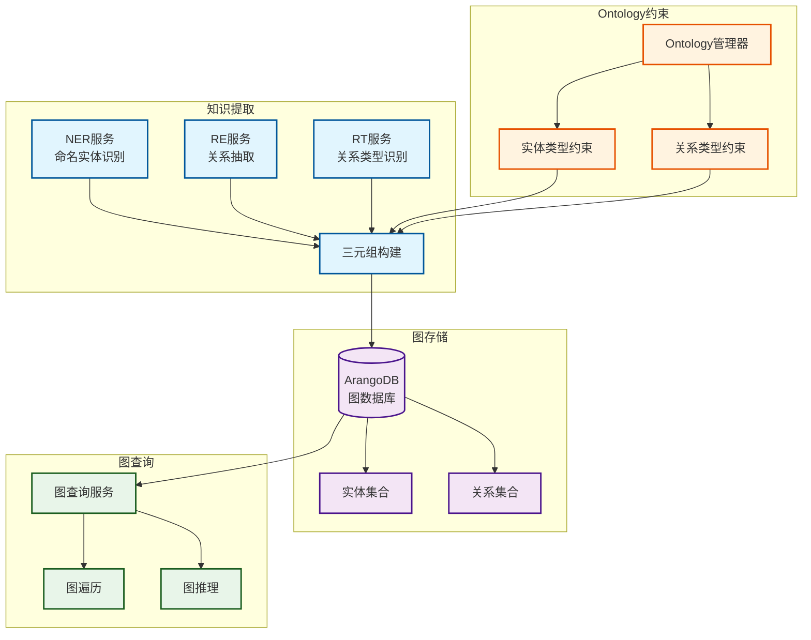

# 知识图谱系统架构文档

**创建日期**: 2025-12-25
**创建人**: Daniel Chung
**最后修改日期**: 2025-12-25

---

## 📋 概述

知识图谱系统是 AI-Box 的核心知识表示架构，通过 NER/RE/RT 三元组提取技术，从文档中提取结构化知识，存储到 ArangoDB 图数据库中。系统支持图查询与推理，与向量检索协同工作，提供深度的知识理解与关联能力。

> **相关文档**：
>
> - [文件上传架构说明](../../文件上傳向量圖譜/上傳的功能架構說明-v2.0.md) - 知识图谱提取流程
> - [Ontology系统](./Ontology系统.md) - Ontology 在知识图谱中的应用
> - [强化RAG系统](./强化RAG系统.md) - 图检索与向量检索的协同

---

## 🏗️ 架构设计

### 核心设计理念

**三元组提取**：

- **NER（Named Entity Recognition）**：命名实体识别
- **RE（Relation Extraction）**：关系抽取
- **RT（Relation Type）**：关系类型识别

**图存储**：ArangoDB 图数据库存储实体与关系

**图推理**：利用图的逻辑关系进行多跳推理

### 架构图



---

## 🔧 核心组件

### 1. 三元组提取服务

#### NER（命名实体识别）

**功能**：从文本中识别实体（Person、Organization、Location等）

**实现位置**：`services/api/services/text_analysis_service.py`

**Ontology约束**：基于 Ontology 定义的实体类型

#### RE（关系抽取）

**功能**：识别实体之间的关系

**实现位置**：`services/api/services/text_analysis_service.py`

**Ontology约束**：基于 Ontology 定义的关系类型

#### RT（关系类型识别）

**功能**：识别关系的类型（works_for、located_in等）

**实现位置**：`services/api/services/text_analysis_service.py`

**Ontology约束**：基于 Ontology 定义的关系类型

### 2. ArangoDB 图存储

**存储架构**：

- **实体集合**：存储实体（Vertex）
- **关系集合**：存储关系（Edge）
- **图结构**：实体与关系形成有向图

**实现位置**：

- 数据库客户端：`database/arangodb/`
- 知识图谱服务：`services/api/services/kg_extraction_service.py`

**核心功能**：

- 实体存储与查询
- 关系存储与查询
- 图遍历与查询

### 3. 图查询与推理

**查询能力**：

- **图遍历**：从某个实体开始，遍历相关实体
- **路径查询**：查找两个实体之间的路径
- **多跳推理**：通过多个关系进行推理

**实现位置**：`kag/kg_extraction_service.py`

---

## 🔄 与 Ontology 的整合

### Ontology 约束

**实体类型约束**：基于 Ontology 的实体类型定义

**关系类型约束**：基于 Ontology 的关系类型定义

**属性范围约束**：基于 Ontology 的属性范围定义

### 应用流程

```
文档输入
    ↓
Ontology 选择与合并
    ↓
三元组提取（NER/RE/RT）
    ├── 实体类型约束（Ontology）
    ├── 关系类型约束（Ontology）
    └── 属性范围约束（Ontology）
    ↓
三元组构建
    ↓
图存储（ArangoDB）
    ├── 实体存储
    └── 关系存储
```

---

## 📊 实现状态

### 已完成功能

| 功能模块 | 状态 | 说明 |
|---------|------|------|
| NER 服务 | ✅ 已实现 | 命名实体识别 |
| RE 服务 | ✅ 已实现 | 关系抽取 |
| RT 服务 | ✅ 已实现 | 关系类型识别 |
| 三元组构建 | ✅ 已实现 | 实体-关系-实体三元组 |
| ArangoDB 存储 | ✅ 已实现 | 图存储与查询 |
| Ontology 约束 | ✅ 已实现 | 基于 Ontology 的提取约束 |

### 进行中功能

| 功能模块 | 状态 | 说明 |
|---------|------|------|
| 图推理 | 🔄 进行中 | 多跳推理能力增强 |
| 图查询优化 | 🔄 进行中 | 查询性能优化 |

---

## 🗺️ 开发进度

### 阶段四完成情况

根据 [项目控制表](../../../開發過程文件/項目控制表.md)，**阶段四：数据处理阶段**已完成：

- ✅ **三元组提取服务**（已完成）
- ✅ **ArangoDB 图存储**（已完成）
- ✅ **Ontology 约束集成**（已完成）

---

## 📚 参考资料

### 相关文档

- [文件上传架构说明](../../文件上傳向量圖譜/上傳的功能架構說明-v2.0.md)
- [Ontology系统](./Ontology系统.md)
- [强化RAG系统](./强化RAG系统.md)

### 代码位置

- 文本分析服务：`services/api/services/text_analysis_service.py`
- 知识图谱提取：`services/api/services/kg_extraction_service.py`
- ArangoDB 客户端：`database/arangodb/`
- 知识图谱服务：`kag/kg_extraction_service.py`

---

**最后更新日期**: 2025-12-25
