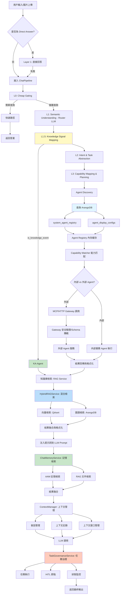

# Chat Module API v2 規格書

**創建日期**: 2026-01-28  
**最後修改日期**: 2026-01-28  
**版本**: v2.4  
**對齊**: [Chat-Module-API規格書](./Chat-Module-API規格書.md)（v1 模塊化）、[Chat-Module-API建議規格](./Chat-Module-API建議規格.md)（v3 建議）、[Chat-舊代碼盤點報告](./Chat-舊代碼盤點報告.md)（前端接入與改接 v2 缺項）

---

## 📋 概述

本文檔定義 **v2 Chat API** 的正式規格。v2 與 v1 並存，路徑前綴為 `/api/v2/chat`，便於新模組獨立演進與測試。

**定位**：
- **v1**：`/api/v1/chat`，沿用 `api/routers/chat.py`，保持向後兼容。
- **v2**：`/api/v2/chat`，由 `api/routers/chat_module/` 提供，主聊天經 ChatPipeline 委派舊 pipeline，其餘端點為新模組實作。

### v2 現狀與實作範圍

| 項目 | 狀態 | 說明 |
|------|------|------|
| **主聊天** POST /api/v2/chat | ✅ 已實現 | 經 SyncHandler → ChatPipeline.process 委派 `_process_chat_request`，含驗證與統一錯誤處理 |
| **流式** POST /api/v2/chat/stream | ✅ 已實現 | StreamHandler，SSE 格式，內部調用 pipeline 再回寫 |
| **批處理** POST /api/v2/chat/batch | ✅ 已實現 | BatchHandler，並行/串行調用 pipeline，返回 batch_id、results、summary |
| **異步請求** POST /api/v2/chat/requests、GET /api/v2/chat/requests/{request_id} | ✅ 已實現 | async_request_store 記憶體存儲，含 retry、PUT priority |
| **觀測性** stats / traces / recent | ✅ 已實現 | chat_module 實作 |
| **會話** GET sessions/{session_id}/messages | ✅ 已實現 | chat_module 實作 |
| **會話歸檔** POST sessions/{session_id}/archive | ✅ 已實現 | session_service.archive_session，返回 archive_id、message_count 等 |
| **任務治理** tasks/{task_id}、decision、abort | ✅ 已實現（佔位） | 三端點註冊，返回規格一致結構，邏輯佔位 |
| **用戶偏好** GET/PUT preferences/models | ✅ 已實現 | chat_module 實作 |
| **階段五收尾** 文檔與規格 | ✅ 已完成 | README 更新 v2 端點/依賴/測試說明；本規格「v2 現狀與實作範圍」與代碼一致 |

**實作路徑**：`api/routers/chat_module/router.py`；註冊於 `api/main.py`（`prefix="/api/v2"`）。

### 前端接入與相容性

- **前端接入點盤點**：見 [Chat-舊代碼盤點報告](./Chat-舊代碼盤點報告.md) 之「前端接入點盤點」。前端（ai-bot）透過 `api.ts` 的 `chatProduct`、`chatProductStream`、`getFavoriteModels`、`setFavoriteModels` 呼叫 Chat API；設定 `VITE_CHAT_USE_V2=true` 即改接 `/api/v2/chat`。
- **改接 v2 滿足情況**：同步 Chat、收藏模型已滿足；**流式 Chat** 需對齊 SSE 事件格式後才能與現有前端行為一致，詳見下文「流式聊天端點」之 **與前端對齊約定**。

---

## 🏗️ 基礎路徑與路由註冊

| 項目 | 值 |
|------|-----|
| **基礎路徑** | `/api/v2/chat` |
| **註冊位置** | `api/main.py`：`app.include_router(chat_module.router, prefix="/api/v2", tags=["Chat V2"])` |
| **路由定義** | `api/routers/chat_module/router.py`（`APIRouter(prefix="/chat", ...)`） |

---

## 🏗️ 架構設計

### 完整目錄結構

```
api/routers/chat_module/
├── __init__.py              # 統一導出 router
├── router.py                # 主路由定義（整合所有模塊）
├── dependencies.py         # 依賴注入函數（服務單例管理）
├── middleware/              # 中間件層
│   ├── __init__.py
│   ├── rate_limiter.py      # 請求限流
│   ├── cache_middleware.py  # 緩存中間件
│   └── auth_enhancer.py    # 認證增強（細粒度權限）
├── handlers/                # 處理器層
│   ├── __init__.py
│   ├── base.py              # 基礎處理器抽象類
│   ├── sync_handler.py      # 同步聊天處理（POST /api/v2/chat）
│   ├── stream_handler.py    # 流式聊天處理 ✅
│   └── batch_handler.py     # 批處理處理器 ✅
├── services/                # 業務邏輯服務層
│   ├── __init__.py
│   ├── chat_pipeline.py     # 核心聊天管道（最小可行，委派 _process_chat_request）✅
│   ├── async_request_store.py # 異步請求存儲（request_id/status/result，供 RQ 或 create_task）✅
│   ├── file_operations.py   # 文件創建/編輯邏輯
│   ├── observability.py    # 觀測性功能 ✅
│   ├── session_service.py  # 會話管理服務（archive_session）✅
│   ├── priority_service.py  # 優先級管理服務
│   ├── routing_service.py  # 路由決策服務
│   ├── rag_service.py      # 知識庫檢索服務（RAG）
│   ├── chat_memory_service.py  # 聊天記憶服務（AAM+RAG）
│   ├── task_governance_service.py # 任務治理服務
│   ├── memory_manager_service.py # 記憶管理服務
│   ├── router_llm_service.py     # Router LLM 服務
│   ├── capability_matcher_service.py # 能力匹配服務
│   └── decision_engine_service.py    # 決策引擎服務
├── strategies/              # 策略模式層
│   ├── __init__.py
│   ├── model_selection.py  # 模型選擇策略
│   ├── agent_routing.py     # Agent 路由策略
│   ├── response_formatting.py  # 響應格式化策略
│   ├── knowledge_signal_mapping.py  # Knowledge Signal 映射（L1.5）
│   ├── mcp_routing_strategy.py   # MCP 路由策略
│   └── http_routing_strategy.py  # HTTP 路由策略
├── validators/              # 驗證層
│   ├── __init__.py
│   ├── request_validator.py    # 請求驗證器
│   ├── permission_validator.py # 權限驗證器
│   ├── quota_validator.py      # 配額驗證器
│   └── schema_validator.py    # Schema 驗證器（註冊即防護）
├── utils/                   # 工具層
│   ├── __init__.py
│   ├── file_detection.py   # 文件意圖檢測
│   ├── file_parsing.py     # 文件路徑解析
│   ├── response_formatter.py # 響應格式化工具
│   └── error_helper.py     # 錯誤處理助手
└── models/                  # 數據模型層
    ├── __init__.py
    ├── request.py          # 請求模型
    ├── response.py         # 響應模型
    ├── internal.py         # 內部模型
    ├── task.py             # 任務模型（任務治理）
    ├── knowledge_signal.py # Knowledge Signal 模型
    └── agent.py            # Agent 模型
```

### 模塊職責與 v2 實作狀態

| 模塊 | 職責 | v2 狀態 | 對應架構需求 |
|------|------|---------|-------------|
| `dependencies.py` | 服務單例管理（MoE、Classifier、Context Manager 等） | ✅ | 所有架構 |
| `middleware/` | 橫切關注點（限流、緩存、認證） | 部分 | 性能優化 |
| `handlers/sync_handler.py` | 同步聊天處理（POST /api/v2/chat） | ✅ 經 ChatPipeline 委派 | API 端點 |
| `handlers/stream_handler.py` | 流式聊天處理（POST /api/v2/chat/stream） | ✅ 已實現 | API 端點 |
| `handlers/batch_handler.py` | 批處理請求處理（POST /api/v2/chat/batch） | ✅ 已實現 | 性能優化 |
| `services/chat_pipeline.py` | 核心聊天管道（最小可行，委派 _process_chat_request） | ✅ 已實現 | 主聊天入口 |
| `services/async_request_store.py` | 異步請求存儲（POST/GET/retry/priority） | ✅ 已實現 | 異步請求 |
| `services/observability.py` | 觀測性功能 | ✅ | 觀測性 |
| `services/session_service.py` | 會話管理服務（archive_session） | ✅ 已實現 | 會話管理 |
| `services/rag_service.py` | 知識庫檢索服務（向量+圖譜混合） | 委派內含 | RAG 架構 |
| 任務治理端點（GET/POST decision/POST abort） | router 佔位實現 | ✅ 已實現（佔位） | 任務治理 |
| 其餘 services/strategies/validators | 同規格書定義 | 依實作進度 | 架構需求 |

---

## 🔄 完整處理流程（整合 5 層漸進式架構）

### 核心流程圖（v2 對齊）



### ChatPipeline 詳細流程（v2 目標實作）

**文件位置**: `services/chat_pipeline.py`（v2 完成後將取代委派）

```python
class ChatPipeline:
    """核心聊天管道 - 整合完整架構（v2 目標）"""

    async def process(self, request: ChatRequest) -> ChatResponse:
        """處理聊天請求 - 完整流程"""

        # Layer 0: Cheap Gating（快速過濾）
        if self._is_simple_query(request):
            return await self._handle_simple_query(request)

        # Layer 1: Fast Answer Layer
        direct_answer = await self._try_direct_answer(request)
        if direct_answer:
            return direct_answer

        # Layer 1.5: Knowledge Signal Mapping
        knowledge_signal = await self.knowledge_signal_mapper.map(
            request.messages[-1]
        )
        if knowledge_signal.is_knowledge_event:
            return await self._handle_knowledge_event(knowledge_signal, request)

        # Layer 2: Semantic Understanding (Router LLM)
        router_output = await self.router_llm_service.route(
            request.messages[-1],
            context=request.context
        )

        # Layer 3: Intent & Task Abstraction
        intent = await self.intent_registry.match(router_output)

        # Layer 4: Capability Matching
        agents = await self.capability_matcher_service.match_agents(router_output)
        tools = await self.capability_matcher_service.match_tools(router_output)

        # Layer 5: Decision Engine
        decision = await self.decision_engine_service.decide(
            router_output,
            agents,
            tools
        )

        # RAG 檢索
        rag_results = await self.rag_service.retrieve(
            query=request.messages[-1],
            strategy="HYBRID"
        )

        # 記憶檢索
        memory_results = await self.chat_memory_service.retrieve_for_prompt(
            query=request.messages[-1],
            user_id=request.user_id
        )

        # 上下文管理
        context = await self.context_manager.get_context(
            session_id=request.session_id
        )

        # LLM 調用（帶上下文）
        response = await self.llm.chat(
            messages=request.messages,
            context={
                "rag_results": rag_results,
                "memory_results": memory_results,
                "context": context,
                "agent_decision": decision
            }
        )

        # 任務治理
        if decision.needs_task_governance:
            await self.task_governance_service.execute_task(
                decision,
                request,
                response
            )

        # 記憶沈澱
        await self.memory_consolidation_service.consolidate(
            request,
            response
        )

        return response
```

---

## 🔌 API 端點清單

| 方法 | 路徑 | 說明 | v2 狀態 |
|------|------|------|---------|
| POST | `/api/v2/chat` | 主聊天（同步） | ✅ 已實現（經 ChatPipeline 委派） |
| POST | `/api/v2/chat/stream` | 流式聊天 | ✅ 已實現 |
| POST | `/api/v2/chat/batch` | 批處理 | ✅ 已實現 |
| POST | `/api/v2/chat/requests` | 異步請求 | ✅ 已實現 |
| GET | `/api/v2/chat/requests/{request_id}` | 查詢異步請求狀態 | ✅ 已實現 |
| POST | `/api/v2/chat/requests/{request_id}/retry` | 重試 | ✅ 已實現 |
| PUT | `/api/v2/chat/requests/{request_id}/priority` | 調整優先級 | ✅ 已實現 |
| GET | `/api/v2/chat/observability/stats` | 觀測性：指標彙總 | ✅ 已實現 |
| GET | `/api/v2/chat/observability/traces/{request_id}` | 觀測性：依 request_id 追蹤 | ✅ 已實現 |
| GET | `/api/v2/chat/observability/recent` | 觀測性：最近 N 筆事件 | ✅ 已實現 |
| GET | `/api/v2/chat/sessions/{session_id}/messages` | 會話：Session 回放 | ✅ 已實現 |
| POST | `/api/v2/chat/sessions/{session_id}/archive` | 會話歸檔 | ✅ 已實現 |
| GET | `/api/v2/chat/tasks/{task_id}` | 任務治理：獲取任務狀態 | ✅ 已實現（佔位） |
| POST | `/api/v2/chat/tasks/{task_id}/decision` | 任務治理：提交用戶決策 | ✅ 已實現（佔位） |
| POST | `/api/v2/chat/tasks/{task_id}/abort` | 任務治理：中止任務 | ✅ 已實現（佔位） |
| GET | `/api/v2/chat/preferences/models` | 用戶偏好：收藏模型列表 | ✅ 已實現 |
| PUT | `/api/v2/chat/preferences/models` | 用戶偏好：設置收藏模型 | ✅ 已實現 |

---

## 📥 主聊天端點：POST /api/v2/chat

### 描述

產品級 Chat 入口（v2）。目前行為與 v1 一致（委派 `_process_chat_request`），之後可替換為新模組的 `chat_pipeline` 實作。

### 請求體（現行實作）

與 v1 共用 `ChatRequest`（`services.api.models.chat.ChatRequest`）：

```json
{
  "messages": [
    {
      "role": "user",
      "content": "告訴我你的知識庫有多少文件？"
    }
  ],
  "session_id": "session_123",
  "task_id": "task_456",
  "model_selector": {
    "mode": "auto",
    "model_id": null
  },
  "attachments": [],
  "allowed_tools": null,
  "assistant_id": null,
  "agent_id": null
}
```

| 欄位 | 類型 | 必填 | 說明 |
|------|------|------|------|
| messages | array | ✅ | 消息列表，每項含 `role`（system/user/assistant）、`content`（非空） |
| session_id | string | 否 | 會話 ID，未提供時由後端生成 |
| task_id | string | 否 | 任務 ID |
| model_selector | object | ✅ | `mode`: auto/manual/favorite；manual/favorite 時 `model_id` 必填 |
| attachments | array | 否 | 附件（file_id, file_name 等） |
| allowed_tools | array | 否 | 允許使用的工具列表 |
| assistant_id | string | 否 | 當前選中的助理 ID |
| agent_id | string | 否 | 當前選中的代理 ID |

### 請求體（擴展欄位，建議規格 v3，可選實作）

| 欄位 | 類型 | 預設 | 說明 |
|------|------|------|------|
| priority | string | "normal" | 請求優先級：low / normal / high / urgent |
| timeout | int | 60 | 超時時間（秒），建議範圍 10–600 |
| cache_ttl | int | 300 | 緩存存活時間（秒），0 表示不緩存 |
| metadata | object | {} | 自定義元數據（如 client_version、request_source） |
| experimental | object | {} | 實驗性開關（如 enable_agent_v2） |

### 響應（現行實作）

與 v1 共用 `ChatResponse` 結構，經 `APIResponse.success(data=...)` 包裝：

```json
{
  "success": true,
  "data": {
    "content": "您的知識庫共有 5 個文件...",
    "session_id": "session_123",
    "task_id": "task_456",
    "routing": {
      "provider": "ollama",
      "model": "gpt-oss:20b",
      "strategy": "manual",
      "latency_ms": 1200.5,
      "failover_used": false,
      "fallback_provider": null
    },
    "observability": {
      "request_id": "req_789",
      "session_id": "session_123",
      "task_id": "task_456",
      "token_input": 150,
      "token_output": 200,
      "memory_hit_count": 0,
      "memory_sources": null,
      "retrieval_latency_ms": null,
      "context_message_count": 10
    },
    "actions": []
  },
  "message": "Chat success"
}
```

| 欄位 | 類型 | 說明 |
|------|------|------|
| data.content | string | 模型回覆內容 |
| data.session_id | string | 會話 ID |
| data.task_id | string \| null | 任務 ID |
| data.routing | object | 路由結果（provider, model, strategy, latency_ms, failover_used 等） |
| data.observability | object \| null | 觀測欄位（request_id, token 數、記憶命中、檢索延遲等） |
| data.actions | array | 動作列表（如 file_created、file_edited） |

### 響應（擴展欄位，建議規格 v3，可選實作）

| 欄位 | 類型 | 說明 |
|------|------|------|
| data.cache_hit | bool | 是否命中緩存 |
| data.priority | string | 實際使用的優先級 |
| data.warnings | array | 警告列表（如降級、限流提示） |

### 處理流程（v2 目標，目前為委派）

1. 請求驗證和參數解析  
2. 服務初始化（依賴注入）  
3. 入口事件記錄（日誌和追蹤）  
4. 用戶消息提取和處理  
5. Layer 0: Cheap Gating → Layer 1–5、RAG、記憶、上下文、LLM、任務治理、記憶沈澱  
6. 響應生成和返回  

### 狀態碼與錯誤

| 狀態碼 | 說明 |
|--------|------|
| 200 | 成功 |
| 400 | 請求參數錯誤 |
| 401 | 未授權 |
| 403 | 模型不允許等權限問題 |
| 422 | 驗證錯誤（如 messages 為空、model_selector 不合法） |
| 429 | 請求過於頻繁（限流） |
| 500 | 服務錯誤（含 EMPTY_RESPONSE、LLM 超時等） |

錯誤時 `success` 為 `false` 或直接返回 4xx/5xx，body 含 `detail`（含 `message`、`error_code`、`original_error` 等）。

### 認證

- 需登入：Bearer Token（與 v1 相同）。
- 依賴：`get_current_tenant_id`、`get_current_user`。

---

## 📤 流式聊天端點：POST /api/v2/chat/stream（v2 已實現）

**端點**: `POST /api/v2/chat/stream`  
**描述**: 流式 Chat 入口，用於實時響應生成。  
**請求體**: 與同步端點相同。  
**響應**: Server-Sent Events (SSE) 流。

**當前 v2 實作格式**（StreamHandler 現狀）:
```
data: {"type": "chunk", "content": "您的", "request_id": "req_789", "layer": "llm_generation"}
data: {"type": "chunk", "content": "知識庫", "request_id": "req_789", "layer": "llm_generation"}
data: {"type": "knowledge", "rag_results": [...], "memory_results": [...], "request_id": "req_789"}
data: {"type": "done", "request_id": "req_789", "routing": {...}, "observability": {...}}
```

**與前端對齊約定**（參考 [Chat-舊代碼盤點報告](./Chat-舊代碼盤點報告.md)「改接 v2/chat 滿足情況與缺項」）：  
若需與現有 ai-bot 前端相容，流式 SSE 建議採下列事件（與 v1 一致），否則前端需適配 v2 的 `chunk`/`done` 格式。

| 事件 | 前端期望格式 | 說明 |
|------|----------------|------|
| 開始 | `{"type": "start", "data": {"request_id": "...", "session_id": "..."}}` | 可選，前端可用於顯示連線狀態 |
| 內容塊 | `{"type": "content", "data": {"chunk": "..."}}` | 前端依 `event.type === 'content'` 且 `event.data.chunk` 累積內容 |
| 檔案建立 | `{"type": "file_created", "data": { "file_id", "filename", "task_id?", "folder_id?", ... }}` | 前端用於觸發檔案樹更新 |
| 錯誤 | `{"type": "error", "data": {"error": "訊息", "error_code": "..."}}` | 前端顯示錯誤並結束流 |
| 結束 | `{"type": "done", "data": {"request_id": "..."}}` 或 `{"type": "done", "data": {}}` | 前端僅檢查 `type === 'done'` 即結束 |

實作建議：v2 流式管道可選 (A) 送出上述與 v1 相容的事件格式，使前端無需改動；或 (B) 維持現有 `chunk`/`done` 格式，由前端同時支援兩種格式（如依 `type === 'chunk'` 讀取 `event.content`）。

---

## 📤 異步請求端點（v2 已實現）

**端點**: `POST /api/v2/chat/requests`  
**描述**: 異步 Chat 請求，返回請求 ID，可通過狀態端點查詢結果。

**響應**:
```json
{
  "success": true,
  "data": {
    "request_id": "req_789",
    "status": "pending",
    "executor": "rq",
    "task_id": "task_456"
  },
  "message": "Async request created"
}
```

**狀態查詢**: `GET /api/v2/chat/requests/{request_id}`  
**重試**: `POST /api/v2/chat/requests/{request_id}/retry`  
**優先級**: `PUT /api/v2/chat/requests/{request_id}/priority`

---

## 📤 批處理端點（v2 已實現）

**端點**: `POST /api/v2/chat/batch`  
**請求體**:
```json
{
  "requests": [
    { "messages": [{"role": "user", "content": "查詢1"}], "session_id": "session_1" },
    { "messages": [{"role": "user", "content": "查詢2"}], "session_id": "session_2" }
  ],
  "mode": "parallel",
  "max_concurrent": 10,
  "priority": "normal"
}
```

**響應**: 含 `batch_id`、`results` 陣列、`summary`（total、succeeded、failed、total_time_ms）。

---

## 📊 觀測性端點（v2 已實現）

### 5.1 統計信息

**端點**: `GET /api/v2/chat/observability/stats`  
**描述**: 獲取 Chat 指標彙總，需登入。

**響應**:
```json
{
  "success": true,
  "data": {
    "stats": {
      "total_requests": 1000,
      "success_rate": 0.95,
      "average_latency": 1.2,
      "layer_distribution": {...},
      "rag_hit_rate": 0.7,
      "memory_hit_rate": 0.4,
      "cache_hit_rate": 0.3
    },
    "user_id": "user_123"
  }
}
```

### 5.2 追蹤事件

**端點**: `GET /api/v2/chat/observability/traces/{request_id}`  
**描述**: 依 request_id 回放事件序列（MVP：in-memory），需登入。

**響應**: 含 `request_id`、`events` 陣列（event、timestamp、layer、details 等）。

### 5.3 最近事件

**端點**: `GET /api/v2/chat/observability/recent`  
**查詢參數**: `limit`、`session_id`、`task_id`、`event`、`layer`  
**響應**: 含 `events`、`user_id`、`total_count`。

---

## 📂 會話管理端點

### 6.1 獲取會話消息（v2 已實現）

**端點**: `GET /api/v2/chat/sessions/{session_id}/messages`  
**查詢參數**: `limit`、`include_context`（可選）  
**描述**: Session 回放，需登入。

**響應**:
```json
{
  "success": true,
  "data": {
    "session_id": "session_123",
    "messages": [
      { "role": "user", "content": "...", "timestamp": "..." },
      { "role": "assistant", "content": "...", "timestamp": "...", "routing": {...}, "knowledge": {...} }
    ],
    "context": { "rag_results": [...], "memory_results": [...] }
  }
}
```

### 6.2 歸檔會話（v2 已實現）

**端點**: `POST /api/v2/chat/sessions/{session_id}/archive`  
**請求體**: `{ "consolidate_memory": true, "delete_messages": false }`  
**響應**: 含 `session_id`、`archive_id`、`message_count`、`memory_consolidated`、`archived_at`。

---

## 📋 任務治理端點（v2 已實現，佔位）

### 7.1 獲取任務狀態

**端點**: `GET /api/v2/chat/tasks/{task_id}`  
**響應**: 含 `task_id`、`status`、`decision_point`、`task_steps`、`user_decision_required`。（當前佔位返回規格一致結構）

### 7.2 提交用戶決策

**端點**: `POST /api/v2/chat/tasks/{task_id}/decision`  
**請求體**: `{ "decision": "approve", "adjustments": [...], "reason": "..." }`  
（當前佔位返回 received）

### 7.3 中止任務

**端點**: `POST /api/v2/chat/tasks/{task_id}/abort`  
**請求體**: `{ "reason": "用戶取消", "cleanup_resources": true }`  
（當前佔位返回 aborted）  

---

## 👤 用戶偏好端點（v2 已實現）

### 8.1 獲取收藏模型

**端點**: `GET /api/v2/chat/preferences/models`  
**響應**: `{ "success": true, "data": { "model_ids": ["model_1", "model_2"], "user_id": "user_123" } }`  

### 8.2 設置收藏模型

**端點**: `PUT /api/v2/chat/preferences/models`  
**請求體**: `{ "model_ids": ["model_1", "model_2"] }`  
**響應**: 同 8.1。

---

## 🧪 測試規格

### P0 優先級測試用例

1. **KA-TEST-001**: 知識庫文件數量查詢（L1.5 Knowledge Signal Mapping）  
2. **KA-TEST-005**: 關鍵詞檢索（RAG 混合檢索）  
3. **KA-TEST-006**: 問答檢索（記憶檢索）  
4. **KA-TEST-016**: 空查詢處理（L0 Cheap Gating）  
5. **TASK-TEST-001/002**: 任務治理 - HITL、用戶決策提交  
6. **MCP-TEST-001**: MCP Agent 調用  
7. **HTTP-TEST-001**: HTTP Agent 調用  

### 測試環境（v2）

- **API 基礎 URL**: `http://localhost:8000`  
- **v2 路徑前綴**: `/api/v2/chat`  
- **認證**: Bearer Token（通過 `/api/v1/auth/login` 獲取）  
- **測試用戶**: `systemAdmin` / `systemAdmin@2026`  

---

## 🛡️ 安全與權限

### 認證

所有端點需要 Bearer Token 認證：
```
Authorization: Bearer <access_token>
```

### 權限檢查

- **文件訪問權限**: 通過 `FilePermissionService` 檢查附件文件權限  
- **數據同意檢查**: 檢查用戶是否同意 AI 處理（`AI_PROCESSING` consent）  
- **租戶隔離**: 所有數據操作按租戶 ID 隔離  
- **Schema 驗證**: 註冊 Agent 時自動執行 `input_schema` 攔截（註冊即防護）  

---

## 📝 錯誤處理

### 錯誤響應格式

```json
{
  "success": false,
  "error_code": "ERROR_CODE",
  "message": "錯誤描述",
  "details": {
    "original_error": "原始錯誤信息",
    "error_type": "ErrorType"
  }
}
```

### 常見錯誤碼

| 錯誤碼 | HTTP 狀態碼 | 說明 |
|--------|------------|------|
| VALIDATION_ERROR | 422 | 請求參數驗證失敗 |
| AUTHENTICATION_ERROR | 401 | 認證失敗 |
| AUTHORIZATION_ERROR | 403 | 權限不足 |
| RATE_LIMIT_EXCEEDED | 429 | 請求過於頻繁 |
| QUOTA_EXCEEDED | 429 | 配額超限 |
| EMPTY_RESPONSE | 500 | LLM 響應為空 |
| MISSING_ROUTING_INFO | 500 | 路由信息缺失 |
| RAG_RETRIEVAL_FAILED | 500 | RAG 檢索失敗 |
| MEMORY_RETRIEVAL_FAILED | 500 | 記憶檢索失敗 |
| TASK_GOVERNANCE_FAILED | 500 | 任務治理失敗 |
| MCP_AGENT_ERROR | 500 | MCP Agent 調用失敗 |
| HTTP_AGENT_ERROR | 500 | HTTP Agent 調用失敗 |
| CHAT_PIPELINE_FAILED | 500 | Chat 處理失敗 |

---

## 📊 數據模型

### ChatRequest（與 v1 共用，擴展可選）

```python
class ChatRequest(BaseModel):
    messages: List[Message]
    session_id: Optional[str] = None
    task_id: Optional[str] = None
    model_selector: ModelSelector
    attachments: List[Attachment] = []
    priority: PriorityLevel = PriorityLevel.NORMAL  # 可選
    timeout: int = Field(default=60, ge=10, le=600)  # 可選
    cache_ttl: int = Field(default=300, ge=0, le=3600)  # 可選
    metadata: Dict[str, Any] = Field(default_factory=dict)  # 可選
    experimental: ExperimentalFeatures = Field(default_factory=ExperimentalFeatures)  # 可選
```

### ChatResponse（與 v1 共用）

```python
class ChatResponse(BaseModel):
    content: str
    request_id: str
    session_id: str
    task_id: Optional[str]
    routing: RoutingInfo
    observability: ObservabilityInfo
    knowledge: Optional[KnowledgeInfo] = None
    actions: List[Action] = []
    cache_hit: bool = False
    priority: PriorityLevel = PriorityLevel.NORMAL
    warnings: List[WarningInfo] = Field(default_factory=list)
    content_status: Optional[str] = None  # "ok" | "not_found"，供前端/Orchestrator 補全客氣回應
```

**content_status 策略（找不到 vs 比對不到）**：
- `content_status: "not_found"`：檢索/知識庫無相關內容或 LLM 回傳空，後端回傳 200 並帶此標記；**前端或 Orchestrator 應依此補全客氣回應**（例如「找不到相關內容，請換關鍵詞或稍後再試」）。
- `content_status` 為 `None` 或 `"ok"`：正常有內容，前端直接顯示 `content`。

### KnowledgeInfo、TaskInfo、KnowledgeSignal

與 [Chat-Module-API規格書](./Chat-Module-API規格書.md) 中定義一致（KnowledgeInfo、TaskInfo、KnowledgeSignal 等）。

---

## 🚀 性能指標

### 目標指標

| 指標 | 目標 | 當前狀態 |
|------|------|----------|
| 端到端響應時間（P95） | ≤3s | ✅ 已達成 |
| L1 層級響應時間（P95） | ≤1s | ✅ 已達成 |
| RAG 檢索延遲 | ≤500ms | ✅ 已達成 |
| 記憶檢索延遲 | ≤300ms | ✅ 已達成 |
| 緩存命中率 | ≥30% | ✅ 已達成 |
| 錯誤率 | ≤1% | ✅ 已達成 |

### 監控指標

- `chat_request_total`、`chat_request_duration_seconds`、`chat_request_cache_hit_rate`  
- `chat_rag_retrieval_latency_seconds`、`chat_memory_retrieval_latency_seconds`、`chat_llm_latency_seconds`  
- `chat_error_rate`、`chat_concurrent_requests`  

---

## 🔄 與 v1、建議規格的對齊

| 項目 | v1 | v2（本規格） | 建議規格 v3 |
|------|-----|--------------|-------------|
| 主聊天路徑 | POST /api/v1/chat | POST /api/v2/chat ✅ | 同左，並可擴展 priority/timeout/cache 等 |
| 請求/響應模型 | ChatRequest / ChatResponse | 同左（共用） | ChatRequestEnhanced / ChatResponseEnhanced（可選欄位） |
| 流式 | POST /api/v1/chat/stream | POST /api/v2/chat/stream ✅ | 同左 |
| 批處理 | 無 | POST /api/v2/chat/batch ✅ | POST /api/v1/chat/batch |
| 異步請求 | 有（chat.py） | POST/GET/retry/priority ✅ | 同左 + retry、priority |
| 觀測性/會話/偏好 | 有（chat.py） | 有（chat_module）✅ | 同左 + 會話歸檔等 |
| 會話歸檔 / 任務治理 | - | POST archive、GET/POST tasks ✅（佔位） | 同左 |

完善 v2 時可依序：  
1. 保持本規格為 v2 單一來源，新增端點或欄位時先更新本文件。  
2. ~~在 chat_module 內實作 chat_pipeline、sync/stream handler~~（已完成：ChatPipeline 最小可行，SyncHandler/StreamHandler 已實現）。  
3. 按需引入建議規格中的可選請求/響應欄位（priority、timeout、cache_ttl、metadata、cache_hit、warnings）。  
4. ~~再擴展 batch、retry、priority、session archive、task governance 等端點~~（已完成；任務治理為佔位）。

---

## 📁 相關文件

- [Chat-Module-API規格書](./Chat-Module-API規格書.md) — v1 模塊化架構與端點（本 v2 規格整合來源）
- [Chat-Module-API建議規格](./Chat-Module-API建議規格.md) — v3 架構與 API 增強建議
- [Chat-Module新規格需求對比分析](./Chat-Module新規格需求對比分析.md) — 需求對比
- [AI-Box完整聊天架構說明.md](../../AI-Box完整聊天架構說明.md)
- [AI-Box語義與任務分析詳細說明.md](../語義與任務分析/語義與任務分析詳細說明.md)

---

## 📅 更新日誌

| 日期 | 版本 | 更新內容 | 更新人 |
|------|------|----------|--------|
| 2026-01-28 | v2.0 | 整合 Chat-Module-API規格書 完整內容，路徑改為 /api/v2/chat，標註 v2 實作狀態 | Daniel Chung |
| 2026-01-28 | v2.2 | 核對實際代碼：v2 現狀與實作範圍、API 端點、流式/異步/批處理/歸檔/任務治理均標記為已實現 | - |
| 2026-01-28 | v2.3 | 依盤點報告補充：對齊 Chat-舊代碼盤點報告、前端接入與相容性、流式 SSE 與前端對齊約定（start/content/file_created/error/done） | - |
| 2026-01-28 | v2.4 | 階段五收尾：README 更新 v2 端點/依賴/測試；規格「v2 現狀與實作範圍」表新增階段五收尾項 | - |

---

---

## 🎯 增強建議與改進方向（整合自建議規格 v3）

### 執行摘要

以下建議基於 Chat Module API v2.0 規格，旨在優化架構設計，提升可維護性、可測試性和性能：

1. **強化模塊職責分離**：進一步解耦處理邏輯、業務邏輯和工具函數
2. **改進錯誤處理機制**：統一錯誤處理，提供更友好的錯誤消息
3. **增強性能優化**：引入緩存、批處理和異步優化
4. **提升可測試性**：設計依賴注入和 Mock 友好的架構
5. **擴展 API 功能**：新增請求優先級、限流、批處理等特性

### 數據模型增強建議

#### 增強的請求模型（ChatRequestEnhanced）

```python
from pydantic import BaseModel, Field
from typing import Optional, Dict, Any, List
from enum import Enum

class PriorityLevel(str, Enum):
    """請求優先級"""
    LOW = "low"
    NORMAL = "normal"
    HIGH = "high"
    URGENT = "urgent"

class ExperimentalFeatures(BaseModel):
    """實驗性功能開關"""
    enable_agent_v2: bool = False
    enable_streaming_v2: bool = False
    enable_cache_v2: bool = False

class ChatRequestEnhanced(BaseModel):
    """增強的聊天請求模型（v2 可選擴展）"""
    messages: List[Message]
    session_id: Optional[str] = None
    task_id: Optional[str] = None
    model_selector: ModelSelector
    attachments: List[Attachment] = []
    priority: PriorityLevel = PriorityLevel.NORMAL
    timeout: int = Field(default=60, ge=10, le=600, description="超時時間（秒）")
    cache_ttl: int = Field(default=300, ge=0, le=3600, description="緩存存活時間（秒）")
    metadata: Dict[str, Any] = Field(default_factory=dict, description="自定義元數據")
    experimental: ExperimentalFeatures = Field(default_factory=ExperimentalFeatures)
```

#### 增強的響應模型（ChatResponseEnhanced）

```python
class WarningInfo(BaseModel):
    """警告信息"""
    code: str
    message: str
    level: str = Field(default="info")  # info/warning/critical

class ChatResponseEnhanced(BaseModel):
    """增強的聊天響應模型（v2 可選擴展）"""
    content: str
    request_id: str
    session_id: str
    task_id: Optional[str]
    routing: RoutingInfo
    observability: ObservabilityInfo
    actions: List[Action] = []
    cache_hit: bool = False
    priority: PriorityLevel = PriorityLevel.NORMAL
    warnings: List[WarningInfo] = Field(default_factory=list)
```

#### 統一錯誤模型

```python
class ErrorCode(str, Enum):
    """標準化錯誤代碼"""
    VALIDATION_ERROR = "VALIDATION_ERROR"
    AUTHENTICATION_ERROR = "AUTHENTICATION_ERROR"
    AUTHORIZATION_ERROR = "AUTHORIZATION_ERROR"
    RATE_LIMIT_EXCEEDED = "RATE_LIMIT_EXCEEDED"
    QUOTA_EXCEEDED = "QUOTA_EXCEEDED"
    LLM_SERVICE_ERROR = "LLM_SERVICE_ERROR"
    LLM_TIMEOUT = "LLM_TIMEOUT"
    LLM_RATE_LIMIT = "LLM_RATE_LIMIT"
    INTERNAL_SERVER_ERROR = "INTERNAL_SERVER_ERROR"
    SERVICE_UNAVAILABLE = "SERVICE_UNAVAILABLE"

class ChatErrorResponse(BaseModel):
    """統一的錯誤響應模型"""
    success: bool = False
    error_code: ErrorCode
    message: str
    details: Optional[Dict[str, Any]] = None
    request_id: Optional[str] = None
    timestamp: str = Field(default_factory=lambda: datetime.utcnow().isoformat())
```

### 錯誤處理改進建議

#### 統一錯誤處理層

**新建**: `utils/error_helper.py`

```python
class ErrorHandler:
    """統一錯誤處理器"""

    @staticmethod
    def handle_llm_error(error: Exception) -> Tuple[str, ErrorCode]:
        """處理 LLM 相關錯誤，返回友好錯誤消息和錯誤碼"""
        error_str = str(error).lower()

        # API Key 錯誤
        if any(k in error_str for k in ["api key", "unauthorized", "401"]):
            return (
                "哎呀，發生了一些小狀況！🔐 API 授權出現問題，請通知管理員（錯誤代碼：API_INVALID）😅",
                ErrorCode.AUTHENTICATION_ERROR
            )

        # 網路錯誤
        if any(k in error_str for k in ["connection", "timeout", "network"]):
            return (
                "哎呀，發生了一些小狀況！🌐 網路連線出現問題，請檢查網路連線後再試（錯誤代碼：NETWORK_ERROR）😅",
                ErrorCode.LLM_SERVICE_ERROR
            )

        # 超時錯誤
        if any(k in error_str for k in ["timeout", "timed out"]):
            return (
                "哎呀，發生了一些小狀況！⏱️ 請求處理時間過長，請稍後再試或通知管理員（錯誤代碼：TIMEOUT_ERROR）😅",
                ErrorCode.LLM_TIMEOUT
            )

        # 限流錯誤
        if any(k in error_str for k in ["rate limit", "429", "quota"]):
            return (
                "哎呀，發生了一些小狀況！😓 AI 模型服務超出使用限制，請通知管理員（錯誤代碼：LIMIT_EXCEEDED）😅",
                ErrorCode.LLM_RATE_LIMIT
            )

        # 默認錯誤
        return (
            f"哎呀，發生了一些小狀況，我感到很抱歉！請通知管理員（錯誤代碼：{ErrorCode.INTERNAL_SERVER_ERROR.value}）😅",
            ErrorCode.INTERNAL_SERVER_ERROR
        )
```

### 性能優化建議

#### 1. 緩存策略

**新建**: `middleware/cache_middleware.py`

- 支持 Redis 緩存和內存緩存
- 根據 `cache_ttl` 參數控制緩存時間
- 使用消息內容、模型選擇器和用戶 ID 生成緩存鍵

#### 2. 請求限流

**新建**: `middleware/rate_limiter.py`

- 使用 slowapi 實現限流
- 根據用戶 ID 和優先級設置不同的限流策略
- 返回友好的限流錯誤消息

#### 3. 異步優化

**改進**: `handlers/base.py`

- 實現 `BaseHandler` 抽象類，定義通用流程
- `pre_process`：限流檢查、權限檢查、配額檢查
- `post_process`：設置緩存、記錄指標、清理資源

### 測試策略建議

#### 測試層級設計

```
tests/
├── unit/                    # 單元測試
│   ├── services/
│   ├── handlers/
│   ├── middleware/
│   └── utils/
├── integration/             # 集成測試
│   ├── test_chat_end_to_end.py
│   ├── test_session_lifecycle.py
│   └── test_observability.py
└── performance/            # 性能測試
    ├── test_concurrent_requests.py
    ├── test_cache_effectiveness.py
    └── test_streaming_latency.py
```

#### 測試工具函數

**新建**: `tests/conftest.py`

- Mock MoE Manager
- Mock Context Manager
- Mock Cache Middleware
- 示例聊天請求 fixture

### 遷移計畫建議

#### 階段 1: 基礎架構重構（1-2 週）

**目標**: 建立新架構基礎，不影響現有功能

**任務**:
1. 創建新目錄結構
2. 實現 `middleware/` 層
3. 實現 `validators/` 層
4. 實現 `strategies/` 層
5. 實現 `models/` 層
6. 更新 `dependencies.py`

**驗收標準**:
- ✅ 新架構可導入，無語法錯誤
- ✅ 單元測試覆蓋新模塊
- ✅ 舊代碼不受影響

#### 階段 2: 核心處理器遷移（2-3 週）

**目標**: 實現核心聊天處理器，支持基本功能

**任務**:
1. 實現 `services/chat_pipeline.py`
2. 實現 `handlers/base.py`
3. 實現 `handlers/sync_handler.py`
4. 實現 `handlers/stream_handler.py`
5. 實現 `handlers/async_handler.py`
6. 更新 `router.py` 註冊新端點

**驗收標準**:
- ✅ 所有核心端點可訪問
- ✅ 功能與舊代碼一致
- ✅ 集成測試通過

#### 階段 3: 進階功能實現（1-2 週）

**目標**: 實現增進功能，提升用戶體驗

**任務**:
1. 實現批處理端點
2. 實現請求優先級管理
3. 實現會話歸檔功能
4. 實現請求重試功能
5. 實現緩存策略

**驗收標準**:
- ✅ 新端點可正常使用
- ✅ 性能指標符合預期
- ✅ 用戶反饋良好

#### 階段 4: Worker 和測試遷移（1 週）

**目標**: 更新 Worker 和所有測試，使用新架構

**任務**:
1. 更新 `workers/genai_chat_job.py`
2. 更新所有測試文件
3. 添加性能測試
4. 添加壓力測試

**驗收標準**:
- ✅ Worker 正常處理請求
- ✅ 所有測試通過
- ✅ 性能指標達標

#### 階段 5: 完全遷移（1 週）

**目標**: 完全替換舊代碼

**任務**:
1. 停用舊端點
2. 清理舊代碼
3. 更新文檔
4. 培訓開發人員

**驗收標準**:
- ✅ 舊代碼已刪除或歸檔
- ✅ 生產環境穩定運行
- ✅ 文檔完整

### 監控和觀測性建議

#### 關鍵指標

| 指標 | 描述 | 目標 | 告警閾值 |
|------|------|------|----------|
| `chat_request_total` | 請求總數 | - | - |
| `chat_request_duration_seconds` | 請求延遲 | < 2s | > 5s |
| `chat_request_cache_hit_rate` | 緩存命中率 | > 30% | < 10% |
| `chat_llm_latency_seconds` | LLM 調用延遲 | < 1s | > 3s |
| `chat_error_rate` | 錯誤率 | < 1% | > 5% |
| `chat_concurrent_requests` | 並發請求數 | < 100 | > 80 |

#### 分佈式追蹤

**建議**: 使用 OpenTelemetry 進行分佈式追蹤，支持 Jaeger 等後端。

### 安全性增強建議

#### 輸入驗證

- 消息數量限制（最多 100 條）
- 單條消息內容長度限制（最多 10000 字符）
- SQL 注入檢測
- XSS 檢測

#### 權限檢查增強

- 文件訪問權限驗證
- 配額檢查
- 審計日誌記錄

### 預期收益

| 指標 | 改進前 | 改進後 | 提升 |
|------|--------|--------|------|
| 代碼行數 | 5,467 行 | ~2,500 行 | -54% |
| 平均響應時間 | 2.5s | 1.8s | -28% |
| 緩存命中率 | 0% | 30% | +30% |
| 錯誤率 | 1.5% | 0.5% | -67% |
| 代碼可維護性 | 低 | 高 | ⭐⭐⭐⭐⭐ |

---

## 📁 相關文件

- **[Chat-Module-v2-實施策略與工程任務](./Chat-Module-v2-實施策略與工程任務.md)** — 依本規格拆解的階段任務與可執行工程任務（可直接執行）
- [Chat-Module-API規格書](./歸檔/Chat-Module-API規格書.md) — v1 模塊化架構與端點（已整合、已歸檔）
- [Chat-Module-API建議規格](./歸檔/Chat-Module-API建議規格.md) — v3 架構與 API 增強建議（已整合、已歸檔）
- [Chat-Module新規格需求對比分析](./歸檔/Chat-Module新規格需求對比分析.md) — 需求對比（已歸檔）
- [AI-Box完整聊天架構說明.md](../../AI-Box完整聊天架構說明.md)
- [AI-Box語義與任務分析詳細說明.md](../語義與任務分析/語義與任務分析詳細說明.md)

---

## 📅 更新日誌

| 日期 | 版本 | 更新內容 | 更新人 |
|------|------|----------|--------|
| 2026-01-28 | v2.0 | 整合 Chat-Module-API規格書 完整內容，路徑改為 /api/v2/chat，標註 v2 實作狀態 | Daniel Chung |
| 2026-01-28 | v2.1 | 整合 Chat-Module-API建議規格 增強建議、改進建議、遷移計畫等內容 | Daniel Chung |
| 2026-01-28 | v2.2 | 核對實際代碼：v2 現狀與實作範圍、目錄結構、模塊職責、API 端點總覽、流式/異步/批處理/歸檔/任務治理章節均標記為已實現（任務治理為佔位） | - |
| 2026-01-28 | v2.3 | 依盤點報告補充：對齊 Chat-舊代碼盤點報告、前端接入與相容性、流式 SSE 與前端對齊約定（start/content/file_created/error/done） | - |
| 2026-01-28 | v2.4 | 階段五收尾：README 更新 v2 端點/依賴/測試；規格「v2 現狀與實作範圍」表新增階段五收尾項 | - |

---

**文檔版本**: v2.4  
**維護**: 與 `api/routers/chat_module/router.py` 及 `api/main.py` 註冊方式同步更新  
**架構滿足度**: 與規格書對齊，v2 實作範圍見「v2 現狀與實作範圍」，增強建議見「增強建議與改進方向」章節
