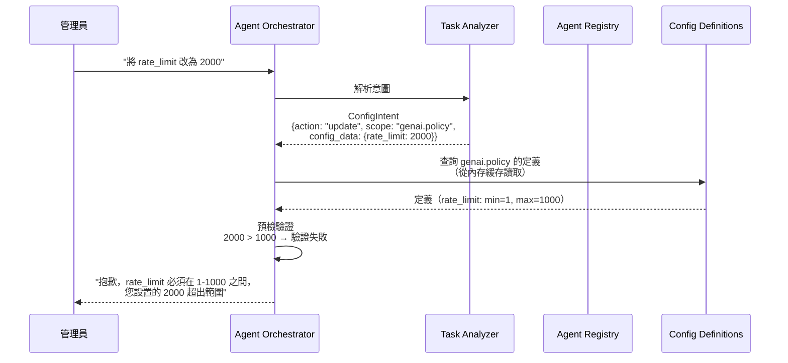
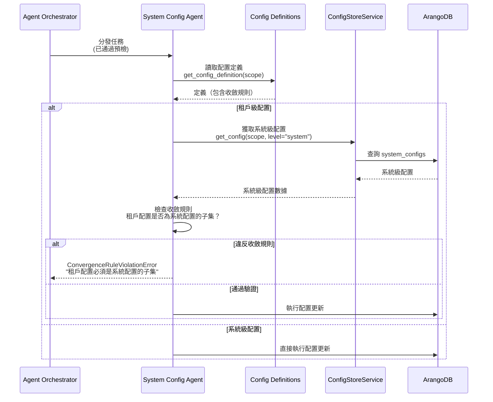
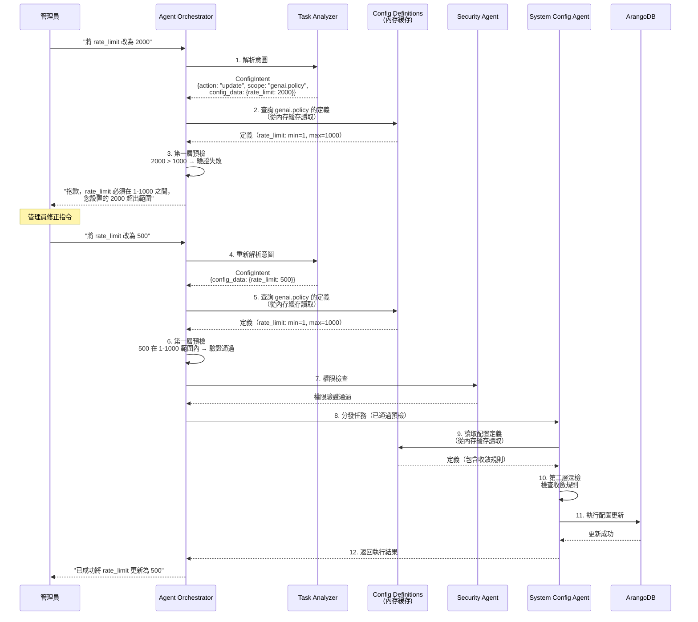

# 配置元數據（Configuration Metadata）機制規格書

**版本**：2.0
**創建日期**：2025-12-20
**創建人**：Daniel Chung
**最後修改日期**：2026-01-20

> **📋 相關文檔**：
>
> - [System-Config-Agent-規格書.md](../System-Config-Agent-規格書.md) - System Config Agent 詳細規格
> - [Orchestrator-協調層規格書.md](../Orchestrator-協調層規格書.md) - Orchestrator 協調層完整規格
> - [Security-Agent-規格書.md](../Security-Agent-規格書.md) - Security Agent 詳細規格
> - [LogService-規格書.md](./LogService-規格書.md) - LogService 統一日誌服務規格

---

## 目錄

1. [概述](#1-概述)
2. [設計理念](#2-設計理念)
3. [核心機制](#3-核心機制)
4. [存儲設計](#4-存儲設計)
   - [4.1 單一存儲機制（JSON 文件）](#41-單一存儲機制json-文件)
   - [4.2 JSON 文件存儲設計（專案目錄）](#42-json-文件存儲設計專案目錄)
   - [4.3 啟動加載機制（Boot Load）](#43-啟動加載機制boot-load)
   - [4.4 Orchestrator 調用機制](#44-orchestrator-調用機制)
   - [4.5 配置定義範例](#45-配置定義範例)
5. [雙層驗證機制](#5-雙層驗證機制)
6. [Agent Registry Schema 設計](#6-agent-registry-schema-設計)
7. [實現流程](#7-實現流程)
8. [實現計劃](#8-實現計劃)

---

## 1. 概述

### 1.1 問題背景

**核心問題**：如何確保 AI 在設置系統配置時「不亂改」？

**傳統方案的問題**：

- ❌ 只靠 Prompt（口頭叮囑）無法防止 AI 幻想（Hallucination）
- ❌ AI 可能設置系統不支持的值（如不存在的模型名稱）
- ❌ AI 可能設置超出範圍的數值（如負數或天文數字）
- ❌ AI 可能違反收斂規則（如租戶配置超過系統限制）

### 1.2 解決方案

**從「信任 AI 的推理」轉向「強制 AI 遵守 Schema」**

建立一套 **「配置元數據（Configuration Metadata）」** 機制，就像是給 AI 一本「標準作業手冊」，告訴它每個欄位的邊界在哪裡。

### 1.3 核心價值

- ✅ **硬性約束（Hard Constraints）**：不能只靠 Prompt，必須給 AI 一套硬性約束
- ✅ **自動化驗證**：程式碼層級的驗證，確保 AI 無法設置非法值
- ✅ **雙層防護**：Orchestrator 預檢 + Agent 深檢，雙重保障
- ✅ **高擴展性**：未來新增任何業務 Agent，只需提供 Schema 即可

---

## 2. 設計理念

### 2.1 核心原則

**「配置即防護」**：管理員只需維護 JSON 文件中的配置定義，AI 就會自動獲得這些邊界知識，徹底杜絕 AI 「亂改」的可能性。

**「配置即代碼」**：配置定義與代碼一起管理，通過 Git 版本控制，確保變更可追溯、可審查。

### 2.2 架構設計

```
┌─────────────────────────────────────────────────────────┐
│  配置元數據層（Configuration Metadata Layer）          │
│  ┌──────────────────────────────────────────────────┐   │
│  │  JSON 文件（唯一數據源）                         │   │
│  │  services/api/core/config/definitions/*.json     │   │
│  │  - 欄位定義（type、min、max、options）           │   │
│  │  - 收斂規則（convergence_rules）                 │   │
│  └──────────────────────────────────────────────────┘   │
└─────────────────────────────────────────────────────────┘
                        ↓ 啟動時加載
┌─────────────────────────────────────────────────────────┐
│  內存緩存（運行時唯一數據源）                            │
│  - DefinitionLoader._cache                             │
└─────────────────────────────────────────────────────────┘
                        ↓ Schema 查詢
┌─────────────────────────────────────────────────────────┐
│  第一層：預檢（Pre-Check）- Orchestrator               │
│  - 格式與邊界驗證（基於 Schema）                      │
│  - 快速止損，秒級回傳錯誤                              │
└─────────────────────────────────────────────────────────┘
                        ↓ 通過預檢
┌─────────────────────────────────────────────────────────┐
│  第二層：深檢（Deep-Check）- System Config Agent       │
│  - 邏輯與收斂驗證                                       │
│  - 業務嚴謹，確保配置在複雜環境下依然合規              │
└─────────────────────────────────────────────────────────┘
                        ↓ 通過深檢
┌─────────────────────────────────────────────────────────┐
│  執行層：寫入 ArangoDB                                  │
│  - 寫入配置數據                                         │
│  - 記錄審計日誌（before/after）                        │
└─────────────────────────────────────────────────────────┘
```

### 2.3 設計目標

1. **極致簡單的 Orchestrator**：它不再需要為每個 Agent 寫 if/else，只是一個「Schema 驗證引擎」
2. **配置即防護**：管理員只需維護 JSON 文件，AI 自動獲得邊界知識
3. **配置即代碼**：配置定義與代碼一起管理，通過 Git 版本控制
4. **高擴展性**：未來新增任何業務 Agent，只需在 JSON 文件中添加定義

---

## 3. 核心機制

### 3.1 配置定義文件（Config Definitions JSON Files）

**目的**：在專案目錄中建立 JSON 文件，定義「約束條件」，告訴 AI 每個欄位的邊界在哪裡。

**存儲位置**：`services/api/core/config/definitions/*.json`

**設計理念**：

- ✅ **單一數據源**：JSON 文件是唯一數據源，避免同步問題
- ✅ **直觀易用**：在 IDE 中直接編輯，語法高亮和自動補全
- ✅ **版本控制**：通過 Git 追蹤所有變更，支持 Code Review
- ✅ **配置即代碼**：配置定義與代碼一起管理，部署時同步更新

**文件結構範例**：

```json
{
  "_key": "genai.policy",
  "scope": "genai.policy",
  "description": "生成式 AI 核心策略設置",
  "fields": {
    "rate_limit": {
      "type": "integer",
      "min": 1,
      "max": 1000,
      "default": 100,
      "unit": "RPM",
      "description": "每分鐘請求數限制",
      "is_modifiable_by_tenant": true,
      "is_modifiable_by_user": false
    },
    "allowed_models": {
      "type": "array",
      "item_type": "string",
      "options": ["gpt-4o", "gpt-3.5-turbo", "claude-3-5-sonnet", "gemini-1.5-pro"],
      "description": "允許使用的模型清單",
      "is_modifiable_by_tenant": true,
      "is_modifiable_by_user": false
    },
    "default_model": {
      "type": "string",
      "options": ["gpt-4o", "gpt-3.5-turbo", "claude-3-5-sonnet", "gemini-1.5-pro"],
      "default": "gpt-4o",
      "description": "默認使用的模型",
      "is_modifiable_by_tenant": true,
      "is_modifiable_by_user": true
    },
    "enable_stream": {
      "type": "boolean",
      "default": true,
      "description": "是否啟用串流輸出",
      "is_modifiable_by_tenant": true,
      "is_modifiable_by_user": false
    }
  },
  "convergence_rules": {
    "tenant_limit_must_be_less_than_system": true,
    "must_subset_of_parent": ["allowed_models", "allowed_providers"],
    "must_not_exceed_system_max": ["rate_limit"]
  },
  "last_updated": "2025-12-20T10:00:00Z"
}
```

### 3.2 三大原則

#### 3.2.1 提供「合法的選擇範圍」(Restricted Options)

**目的**：防止 Agent 幻想（Hallucination）出系統不支持的值。

**範例**：

- 管理員說：「幫我改用 Llama-3」
- System Config Agent 讀取 `fields.allowed_models.options`
- 發現沒有 Llama-3，主動回覆：「抱歉，目前系統僅支援 gpt-4o 等模型，請重新選擇。」

**實現**：

```python
# 在 System Config Agent 中
definition = await self._get_config_definition(intent.scope)
allowed_models = definition.fields["allowed_models"]["options"]

if intent.config_data.get("default_model") not in allowed_models:
    raise ValidationError(
        f"模型 '{intent.config_data['default_model']}' 不在允許列表中。"
        f"允許的模型：{', '.join(allowed_models)}"
    )
```

#### 3.2.2 定義「數值邊界」(Boundary Control)

**目的**：確保數值類型的配置不會導致系統崩潰（例如設為負數或天文數字）。

**範例**：

- 管理員要求將 `rate_limit` 設為 2000
- System Config Agent 讀取定義：`min: 1, max: 1000`
- 攔截此操作，拋出 `ValidationError`：「rate_limit 必須在 1-1000 之間」

**實現**：

```python
# 在 System Config Agent 中
definition = await self._get_config_definition(intent.scope)
field_def = definition.fields["rate_limit"]

if intent.config_data.get("rate_limit"):
    value = intent.config_data["rate_limit"]
    if value < field_def["min"] or value > field_def["max"]:
        raise ValidationError(
            f"rate_limit ({value}) 超出範圍！合法區間為 {field_def['min']}-{field_def['max']}"
        )
```

#### 3.2.3 強制執行「收斂規則」(Convergence Enforcement)

**目的**：確保租戶配置永遠在系統級框架內。

**範例**：

- 系統級設定最大模型數為 5
- AI 試圖幫租戶設為 10
- ConfigAgent 攔截並回報 `ConvergenceRuleViolationError`：「抱歉，系統全域限制最大為 5，我無法設為 10」

**實現**：

```python
# 在 System Config Agent 中
if intent.level == "tenant":
    # 獲取系統級配置
    system_config = await self._config_service.get_config(
        intent.scope, level="system"
    )

    # 檢查收斂規則
    if "must_subset_of_parent" in definition.convergence_rules:
        for field in definition.convergence_rules["must_subset_of_parent"]:
            tenant_value = intent.config_data.get(field)
            system_value = system_config.config_data.get(field)

            if isinstance(tenant_value, list) and isinstance(system_value, list):
                if not set(tenant_value).issubset(set(system_value)):
                    raise ConvergenceRuleViolationError(
                        f"租戶配置的 {field} 必須是系統配置的子集。"
                        f"系統允許：{system_value}，您設置：{tenant_value}"
                    )
```

---

## 4. 存儲設計

### 4.1 單一存儲機制（JSON 文件）

**設計理念**：配置元數據採用「單一存儲」機制，只使用 JSON 文件作為唯一數據源，確保系統的簡單性與可靠性。

**架構設計**：

```
┌─────────────────────────────────────────┐
│  JSON 文件（唯一數據源）                 │
│  services/api/core/config/definitions/   │
│  - genai.policy.json                    │
│  - llm.provider_config.json             │
│  - ...                                   │
└─────────────────────────────────────────┘
              ↓ 啟動時加載（單向）
┌─────────────────────────────────────────┐
│  內存緩存（運行時唯一數據源）            │
│  - DefinitionLoader._cache              │
│  - 快速讀取                              │
└─────────────────────────────────────────┘
              ↓ 運行時讀取
┌─────────────────────────────────────────┐
│  Orchestrator / System Config Agent      │
│  - 從內存緩存讀取定義                    │
│  - 用於第一層預檢和第二層深檢            │
└─────────────────────────────────────────┘
```

**核心優勢**：

- ✅ **極度簡單**：單一數據源，無同步問題
- ✅ **直觀易用**：在 IDE 中直接編輯 JSON，語法高亮和自動補全
- ✅ **版本控制**：通過 Git 追蹤所有變更，支持 Code Review
- ✅ **配置即代碼**：配置定義與代碼一起管理，部署時同步更新
- ✅ **可靠性高**：冷啟動不依賴數據庫，系統更可靠

**注意**：

- 實際配置值（如租戶 A 的 rate_limit=500）仍然存儲在 ArangoDB 的 `system_configs`、`tenant_configs`、`user_configs` Collection 中
- JSON 文件只存儲「定義」（約束條件），不存儲「值」

### 4.2 JSON 文件存儲設計（專案目錄）

#### 4.2.1 目錄結構

**建議目錄結構**：

```
AI-Box/
├── services/
│   └── api/
│       └── core/
│           └── config/
│               └── definitions/          # ⭐ 配置定義目錄
│                   ├── genai.policy.json
│                   ├── llm.provider_config.json
│                   ├── ontology.base.json
│                   └── ... (其他 scope 的定義文件)
```

**文件命名規範**：

- 使用 `{scope}.json` 格式
- 例如：`genai.policy.json`、`llm.provider_config.json`

#### 4.2.2 JSON 文件結構

**文件路徑示例**：`services/api/core/config/definitions/genai.policy.json`

```json
{
  "scope": "genai.policy",
  "description": "GenAI 核心策略約束",
  "version": "1.0.0",
  "last_updated": "2025-12-20T10:00:00Z",
  "fields": {
    "rate_limit": {
      "type": "integer",
      "min": 1,
      "max": 1000,
      "default": 100,
      "unit": "RPM",
      "description": "每分鐘 API 請求上限",
      "is_modifiable_by_tenant": true,
      "is_modifiable_by_user": false
    },
    "allowed_models": {
      "type": "array",
      "item_type": "string",
      "options": ["gpt-4o", "gpt-3.5-turbo", "claude-3-5-sonnet", "gemini-1.5-pro"],
      "convergence": "subset_of_parent",
      "description": "租戶模型必須為系統模型的子集",
      "is_modifiable_by_tenant": true,
      "is_modifiable_by_user": false
    },
    "default_model": {
      "type": "string",
      "options": ["gpt-4o", "gpt-3.5-turbo", "claude-3-5-sonnet", "gemini-1.5-pro"],
      "default": "gpt-4o",
      "description": "默認使用的模型",
      "is_modifiable_by_tenant": true,
      "is_modifiable_by_user": true
    }
  },
  "convergence_rules": {
    "tenant_limit_must_be_less_than_system": true,
    "must_subset_of_parent": ["allowed_models", "allowed_providers"],
    "must_not_exceed_system_max": ["rate_limit"]
  }
}
```

#### 4.2.3 JSON 文件存儲的優勢

**✅ 版本與代碼同步**：

- 當您更版新增了 `gpt-5` 支持時，只需修改目錄下的 JSON
- 代碼與約束條件會同時通過 Git 提交、測試、發布
- 確保「新功能」不會因為「舊資料庫」的限制而失效

**✅ 系統冷啟動（Cold Start）**：

- 在資料庫尚未建立、或是資料庫遷移（Migration）失敗時
- 系統依賴目錄下的 JSON 依然可以進行基本的「指令預檢」
- 確保系統在資料庫不可用時仍能提供基本驗證功能
- **無需同步**：不需要從 JSON 同步到 ArangoDB，系統直接從內存緩存讀取

**✅ 直覺性與可讀性**：

- 開發者直接在 IDE 修改 JSON，比透過後台介面或 SQL/AQL 操作資料庫更直覺
- 方便進行 Code Review
- 版本控制系統可以追蹤配置變更歷史

### 4.3 啟動加載機制（Boot Load）

#### 4.3.1 DefinitionLoader 設計

**目的**：系統啟動時，將所有 JSON 定義文件讀入內存（Memory Cache）。

**實現位置**：`services/api/core/config/definition_loader.py`

```python
from pathlib import Path
from typing import Dict, Any, Optional
import json
import structlog

logger = structlog.get_logger(__name__)

class DefinitionLoader:
    """配置定義加載器"""

    def __init__(self, definitions_dir: Optional[Path] = None):
        """
        初始化定義加載器

        Args:
            definitions_dir: 定義文件目錄（默認：services/api/core/config/definitions）
        """
        if definitions_dir is None:
            # 默認路徑：相對於項目根目錄
            base_dir = Path(__file__).parent.parent.parent.parent.parent
            definitions_dir = base_dir / "services" / "api" / "core" / "config" / "definitions"

        self.definitions_dir = Path(definitions_dir)
        self._cache: Dict[str, Dict[str, Any]] = {}  # 內存緩存

    def load_all(self) -> Dict[str, Dict[str, Any]]:
        """
        加載所有定義文件到內存

        Returns:
            所有配置定義的字典（key: scope, value: 定義內容）
        """
        if not self.definitions_dir.exists():
            logger.warning(
                "定義目錄不存在",
                directory=str(self.definitions_dir)
            )
            return {}

        definitions = {}

        # 遍歷所有 JSON 文件
        for json_file in self.definitions_dir.glob("*.json"):
            try:
                scope = json_file.stem  # 文件名（不含擴展名）作為 scope
                definition = self._load_file(json_file)
                definitions[scope] = definition
                logger.info(
                    "已加載配置定義",
                    scope=scope,
                    file=str(json_file)
                )
            except Exception as e:
                logger.error(
                    "加載定義文件失敗",
                    file=str(json_file),
                    error=str(e)
                )

        # 更新內存緩存
        self._cache = definitions

        return definitions

    def _load_file(self, file_path: Path) -> Dict[str, Any]:
        """加載單個定義文件"""
        with open(file_path, 'r', encoding='utf-8') as f:
            return json.load(f)

    def get_definition(self, scope: str) -> Optional[Dict[str, Any]]:
        """
        從內存緩存獲取定義

        Args:
            scope: 配置範圍

        Returns:
            配置定義（如果存在）
        """
        return self._cache.get(scope)

    def reload(self) -> Dict[str, Dict[str, Any]]:
        """重新加載所有定義文件"""
        return self.load_all()
```

#### 4.3.2 系統啟動時加載

**實現位置**：`services/api/main.py` 或 `services/api/core/config/__init__.py`

```python
from services.api.core.config.definition_loader import DefinitionLoader

# 全局定義加載器實例
_definition_loader: Optional[DefinitionLoader] = None

def get_definition_loader() -> DefinitionLoader:
    """獲取定義加載器實例（單例模式）"""
    global _definition_loader
    if _definition_loader is None:
        _definition_loader = DefinitionLoader()
        _definition_loader.load_all()  # 啟動時加載
    return _definition_loader

# 在 FastAPI 啟動時調用
@app.on_event("startup")
async def startup_event():
    """應用啟動時加載配置定義"""
    loader = get_definition_loader()
    definitions = loader.load_all()
    logger.info(
        "配置定義加載完成",
        count=len(definitions),
        scopes=list(definitions.keys())
    )
```

### 4.4 Orchestrator 調用機制

#### 4.4.1 從內存讀取約束

**實現位置**：`agents/services/orchestrator/orchestrator.py`

```python
class AgentOrchestrator:
    """Agent 協調器"""

    def __init__(self, registry: Optional[Any] = None):
        self._registry = registry or get_agent_registry()
        self._task_analyzer = TaskAnalyzer()
        self._task_tracker = TaskTracker()
        self._llm_router = get_llm_router()
        self._log_service = get_log_service()
        self._definition_loader = get_definition_loader()  # ⭐ 獲取定義加載器

    async def _get_config_definition(self, scope: str) -> Optional[Dict[str, Any]]:
        """
        獲取配置定義（只從內存緩存讀取）

        Args:
            scope: 配置範圍

        Returns:
            配置定義（如果存在）

        注意：
        - JSON 文件是唯一數據源
        - 啟動時應該已經加載所有定義到內存
        - 如果內存緩存沒有，說明 JSON 文件缺失（系統配置錯誤）
        - 不再從 ArangoDB 讀取備用，避免讀到舊數據
        """
        definition = self._definition_loader.get_definition(scope)

        if not definition:
            logger.error(
                f"配置定義缺失: {scope}，請檢查 JSON 文件是否存在",
                scope=scope
            )

        return definition

    async def _pre_check_config_intent(
        self,
        intent: Dict[str, Any],
        agent_id: str
    ) -> ValidationResult:
        """第一層預檢：格式與邊界驗證"""
        scope = intent.get("scope")
        if not scope:
            return ValidationResult(valid=False, reason="scope is required")

        # ⭐ 從內存緩存讀取定義（快速）
        definition = self._definition_loader.get_definition(scope)
        if not definition:
            return ValidationResult(
                valid=False,
                reason=f"Config definition not found for scope: {scope}"
            )

        # 驗證配置字段
        config_data = intent.get("config_data", {})
        for field_name, field_value in config_data.items():
            if field_name not in definition.get("fields", {}):
                return ValidationResult(
                    valid=False,
                    reason=f"未知的配置字段：{field_name}"
                )

            field_def = definition["fields"][field_name]
            validation_result = self._validate_field(field_name, field_value, field_def)

            if not validation_result.valid:
                # ⭐ 使用定義中的 description 生成友好錯誤信息
                error_msg = (
                    f"設置失敗：{field_name} 超出系統定義上限。"
                    f"{field_def.get('description', '')} "
                    f"合法範圍：{field_def.get('min', 'N/A')}-{field_def.get('max', 'N/A')}"
                )
                return ValidationResult(valid=False, reason=error_msg)

        return ValidationResult(valid=True)
```

#### 4.4.2 衝突退回機制

**錯誤信息生成**：

```python
# 當管理員指令超出 JSON 定義的 max 值時
if field_value > field_def["max"]:
    error_msg = (
        f"設置失敗：{field_name} ({field_value}) 超出系統定義上限 ({field_def['max']})。"
        f"{field_def.get('description', '')}"
    )
    return ValidationResult(valid=False, reason=error_msg)
```

**範例錯誤信息**：

```
設置失敗：rate_limit (2000) 超出系統定義上限 (1000)。
每分鐘 API 請求上限 合法範圍：1-1000
```

### 4.5 配置定義範例

#### 4.5.1 genai.policy（JSON 文件）

**文件路徑**：`services/api/core/config/definitions/genai.policy.json`

```json
{
  "scope": "genai.policy",
  "description": "生成式 AI 核心策略設置",
  "version": "1.0.0",
  "last_updated": "2025-12-20T10:00:00Z",
  "fields": {
    "rate_limit": {
      "type": "integer",
      "min": 1,
      "max": 1000,
      "default": 100,
      "unit": "RPM",
      "description": "每分鐘請求數限制",
      "is_modifiable_by_tenant": true,
      "is_modifiable_by_user": false
    },
    "allowed_providers": {
      "type": "array",
      "item_type": "string",
      "options": ["openai", "anthropic", "google", "azure"],
      "description": "允許的 LLM 提供商列表",
      "is_modifiable_by_tenant": true,
      "is_modifiable_by_user": false
    },
    "allowed_models": {
      "type": "object",
      "description": "按提供商分組的允許模型列表",
      "schema": {
        "openai": {
          "type": "array",
          "item_type": "string",
          "options": ["gpt-4o", "gpt-3.5-turbo", "gpt-4-turbo"]
        },
        "anthropic": {
          "type": "array",
          "item_type": "string",
          "options": ["claude-3-5-sonnet", "claude-3-opus", "claude-3-haiku"]
        }
      },
      "is_modifiable_by_tenant": true,
      "is_modifiable_by_user": false
    },
    "default_model": {
      "type": "string",
      "options": ["gpt-4o", "gpt-3.5-turbo", "claude-3-5-sonnet", "gemini-1.5-pro"],
      "default": "gpt-4o",
      "description": "默認使用的模型",
      "is_modifiable_by_tenant": true,
      "is_modifiable_by_user": true
    },
    "enable_stream": {
      "type": "boolean",
      "default": true,
      "description": "是否啟用串流輸出",
      "is_modifiable_by_tenant": true,
      "is_modifiable_by_user": false
    }
  },
  "convergence_rules": {
    "tenant_limit_must_be_less_than_system": true,
    "must_subset_of_parent": ["allowed_providers", "allowed_models"],
    "must_not_exceed_system_max": ["rate_limit"]
  },
  "last_updated": "2025-12-20T10:00:00Z"
}
```

#### 4.5.2 llm.provider_config（JSON 文件）

**文件路徑**：`services/api/core/config/definitions/llm.provider_config.json`

```json
{
  "scope": "llm.provider_config",
  "description": "LLM 提供商配置",
  "version": "1.0.0",
  "last_updated": "2025-12-20T10:00:00Z",
  "fields": {
    "api_endpoint": {
      "type": "string",
      "format": "url",
      "description": "API 端點 URL",
      "is_modifiable_by_tenant": false,
      "is_modifiable_by_user": false
    },
    "timeout": {
      "type": "integer",
      "min": 1,
      "max": 300,
      "default": 30,
      "unit": "seconds",
      "description": "請求超時時間",
      "is_modifiable_by_tenant": true,
      "is_modifiable_by_user": false
    },
    "max_retries": {
      "type": "integer",
      "min": 0,
      "max": 5,
      "default": 3,
      "description": "最大重試次數",
      "is_modifiable_by_tenant": true,
      "is_modifiable_by_user": false
    }
  },
  "convergence_rules": {},
  "last_updated": "2025-12-20T10:00:00Z"
}
```

---

## 5. 雙層驗證機制

### 5.1 第一層：預檢（Pre-Check）- Orchestrator

**負責組件**：Orchestrator

**驗證內容**：

- ✅ 格式與邊界：型別是否正確？數值是否在 min/max 內？
- ✅ 枚舉值檢查：選項是否在 options 列表中？

**目的**：快速止損，不需喚醒 Agent，節省 Token，秒級回傳錯誤。

**實現流程**：



**實現代碼**：

```python
class AgentOrchestrator:
    """Agent 協調器"""

    async def _pre_check_config_intent(
        self,
        intent: Dict[str, Any],
        agent_id: str
    ) -> ValidationResult:
        """
        第一層預檢：格式與邊界驗證

        基於 Agent Registry 的 input_schema 進行驗證
        """
        # 1. 獲取配置定義（從內存緩存，JSON 文件是唯一數據源）
        scope = intent.get("scope")
        if not scope:
            return ValidationResult(valid=False, reason="scope is required")

        definition = await self._get_config_definition(scope)
        if not definition:
            return ValidationResult(
                valid=False,
                reason=f"Config definition not found for scope: {scope}。請檢查 JSON 文件是否存在。"
            )

        # 2. 驗證每個配置字段
        config_data = intent.get("config_data", {})
        for field_name, field_value in config_data.items():
            if field_name not in definition.get("fields", {}):
                return ValidationResult(
                    valid=False,
                    reason=f"未知的配置字段：{field_name}"
                )

            field_def = definition["fields"][field_name]
            validation_result = self._validate_field(field_name, field_value, field_def)

            if not validation_result.valid:
                return validation_result

        return ValidationResult(valid=True)

    def _validate_field(
        self,
        field_name: str,
        field_value: Any,
        field_def: Dict[str, Any]
    ) -> ValidationResult:
        """驗證單個字段"""
        # 1. 類型檢查
        expected_type = field_def["type"]
        if not self._check_type(field_value, expected_type):
            return ValidationResult(
                valid=False,
                reason=f"{field_name} 的類型錯誤：期望 {expected_type}，實際 {type(field_value).__name__}"
            )

        # 2. 數值邊界檢查
        if expected_type == "integer" or expected_type == "number":
            if "min" in field_def and field_value < field_def["min"]:
                return ValidationResult(
                    valid=False,
                    reason=f"{field_name} ({field_value}) 小於最小值 {field_def['min']}"
                )
            if "max" in field_def and field_value > field_def["max"]:
                return ValidationResult(
                    valid=False,
                    reason=f"{field_name} ({field_value}) 大於最大值 {field_def['max']}"
                )

        # 3. 枚舉值檢查
        if "options" in field_def:
            if isinstance(field_value, list):
                # 數組類型：檢查每個元素
                invalid_values = [v for v in field_value if v not in field_def["options"]]
                if invalid_values:
                    return ValidationResult(
                        valid=False,
                        reason=f"{field_name} 包含無效值：{invalid_values}。允許的值：{field_def['options']}"
                    )
            else:
                # 單值類型：檢查值本身
                if field_value not in field_def["options"]:
                    return ValidationResult(
                        valid=False,
                        reason=f"{field_name} ({field_value}) 不在允許列表中。允許的值：{field_def['options']}"
                    )

        return ValidationResult(valid=True)

    def _check_type(self, value: Any, expected_type: str) -> bool:
        """檢查類型是否匹配"""
        type_map = {
            "integer": int,
            "number": (int, float),
            "string": str,
            "boolean": bool,
            "array": list,
            "object": dict
        }
        expected = type_map.get(expected_type)
        if expected is None:
            return True  # 未知類型，跳過檢查

        if isinstance(expected, tuple):
            return isinstance(value, expected)
        return isinstance(value, expected)
```

### 5.2 第二層：深檢（Deep-Check）- System Config Agent

**負責組件**：System Config Agent

**驗證內容**：

- ✅ 邏輯與收斂：是否違反租戶/系統層級關係？
- ✅ 業務規則：是否符合業務邏輯？

**目的**：業務嚴謹，確保配置在複雜環境下依然合規。

**實現流程**：



**實現代碼**：

```python
class SystemConfigAgent(AgentServiceProtocol):
    """負責配置的合規檢查與 ArangoDB 交互"""

    async def _validate_config_compliance(
        self,
        intent: ConfigIntent,
        definition: ConfigDefinition
    ) -> ComplianceCheckResult:
        """
        第二層深檢：邏輯與收斂驗證

        Args:
            intent: 配置操作意圖
            definition: 配置定義（從 JSON 文件加載到內存緩存）

        Returns:
            ComplianceCheckResult: 合規檢查結果
        """
        # 1. 檢查收斂規則（僅租戶級配置需要）
        if intent.level == "tenant":
            convergence_result = await self._check_convergence_rules(
                intent, definition
            )
            if not convergence_result.valid:
                return convergence_result

        # 2. 檢查業務規則
        business_result = await self._check_business_rules(intent, definition)
        if not business_result.valid:
            return business_result

        return ComplianceCheckResult(valid=True)

    async def _check_convergence_rules(
        self,
        intent: ConfigIntent,
        definition: ConfigDefinition
    ) -> ComplianceCheckResult:
        """檢查收斂規則"""
        # 1. 獲取系統級配置
        system_config = await self._config_service.get_config(
            intent.scope, level="system"
        )
        if not system_config:
            return ComplianceCheckResult(
                valid=False,
                reason="系統級配置不存在，無法驗證收斂規則"
            )

        convergence_rules = definition.convergence_rules

        # 2. 檢查 must_subset_of_parent 規則
        if "must_subset_of_parent" in convergence_rules:
            for field in convergence_rules["must_subset_of_parent"]:
                tenant_value = intent.config_data.get(field)
                system_value = system_config.config_data.get(field)

                if tenant_value is None:
                    continue

                if isinstance(tenant_value, list) and isinstance(system_value, list):
                    if not set(tenant_value).issubset(set(system_value)):
                        return ComplianceCheckResult(
                            valid=False,
                            reason=(
                                f"收斂規則違反：租戶配置的 {field} 必須是系統配置的子集。"
                                f"系統允許：{system_value}，您設置：{tenant_value}"
                            )
                        )

        # 3. 檢查 must_not_exceed_system_max 規則
        if "must_not_exceed_system_max" in convergence_rules:
            for field in convergence_rules["must_not_exceed_system_max"]:
                tenant_value = intent.config_data.get(field)
                system_value = system_config.config_data.get(field)

                if tenant_value is None or system_value is None:
                    continue

                if isinstance(tenant_value, (int, float)) and isinstance(system_value, (int, float)):
                    if tenant_value > system_value:
                        return ComplianceCheckResult(
                            valid=False,
                            reason=(
                                f"收斂規則違反：租戶配置的 {field} ({tenant_value}) "
                                f"不能超過系統級最大值 ({system_value})"
                            )
                        )

        return ComplianceCheckResult(valid=True)
```

### 5.3 雙層驗證流程圖

```mermaid
flowchart TD
    Start([管理員輸入指令]) --> Parse[Task Analyzer 解析意圖]
    Parse --> GetDef[查詢配置定義<br/>（從內存緩存讀取）]
    GetDef --> PreCheck{第一層預檢<br/>格式與邊界}

    PreCheck -->|驗證失敗| Reject1[返回錯誤<br/>"數值需在 1-1000 之間"]
    PreCheck -->|驗證通過| Security[Security Agent 權限檢查]

    Security -->|權限通過| DeepCheck{第二層深檢<br/>邏輯與收斂}
    Security -->|權限失敗| Reject2[返回錯誤<br/>"權限不足"]

    DeepCheck -->|驗證失敗| Reject3[返回錯誤<br/>"違反收斂規則"]
    DeepCheck -->|驗證通過| Preview[生成預覽]

    Preview --> Confirm{管理員確認}
    Confirm -->|確認| Execute[執行配置更新]
    Confirm -->|取消| Cancel[取消操作]

    Execute --> Log[記錄審計日誌]
    Log --> End([完成])

    classDef preCheck fill:#fff3e0,stroke:#e65100,stroke-width:2px
    classDef deepCheck fill:#e1f5ff,stroke:#01579b,stroke-width:2px
    classDef execute fill:#e8f5e9,stroke:#2e7d32,stroke-width:2px

    class PreCheck,Reject1 preCheck
    class DeepCheck,Reject3 deepCheck
    class Execute,Log execute
```

---

## 6. Agent Registry Schema 設計

### 6.1 自描述型註冊

**設計理念**：每個 Agent 在登記時，必須定義其 `input_schema`。這份 Schema 包含了硬性約束（如型別、最大/最小值、枚舉選項）。

**Agent Registry 擴展**：

```python
class AgentMetadata(BaseModel):
    """Agent 元數據"""
    version: str = Field("1.0.0", description="Agent 版本")
    description: Optional[str] = Field(None, description="Agent 描述")
    author: Optional[str] = Field(None, description="開發者/團隊")
    tags: List[str] = Field(default_factory=list, description="標籤列表")
    capabilities: Dict[str, Any] = Field(default_factory=dict, description="能力描述")
    input_schema: Optional[Dict[str, Any]] = Field(None, description="輸入 Schema（基於 config_definitions）")  # ⭐ 新增
    icon: Optional[str] = Field(None, description="圖標名稱")
```

### 6.2 System Config Agent 的 input_schema

**設計方式**：`input_schema` 可以從 JSON 文件自動生成（可選），或手動定義。

**注意**：`input_schema` 僅用於 Agent 能力描述（前端顯示、文檔生成），不用於實際驗證。實際驗證時直接使用 JSON 文件中的定義（從內存緩存讀取）。

**自動生成方式**（可選）：

```python
# 在 System Config Agent 註冊時
async def register_system_config_agent():
    """註冊 System Config Agent"""

    # 1. 從 JSON 文件生成 input_schema（可選）
    input_schema = await generate_input_schema_from_definitions()

    # 2. 註冊 Agent
    request = AgentRegistrationRequest(
        agent_id="system_config_agent",
        agent_type="dedicated_service",
        name="System Config Agent",
        endpoints=AgentEndpoints(...),
        capabilities=["config_management", "config_validation"],
        metadata=AgentMetadata(
            description="系統配置管理 Agent",
            input_schema=input_schema  # ⭐ 可選，僅用於能力描述
        )
    )

    await registry.register_agent(request)

async def generate_input_schema_from_definitions() -> Dict[str, Any]:
    """從 JSON 文件生成 input_schema（可選）"""
    # 從內存緩存讀取所有定義（JSON 文件是唯一數據源）
    loader = get_definition_loader()
    definitions = {}
    for scope in loader._cache.keys():
        definitions[scope] = loader.get_definition(scope)

    input_schema = {
        "type": "object",
        "properties": {}
    }

    for scope, definition in definitions.items():
        if definition:
            for field_name, field_def in definition["fields"].items():
            # 生成 JSON Schema
            field_schema = {
                "type": field_def["type"],
                "description": field_def.get("description", "")
            }

            if "min" in field_def:
                field_schema["minimum"] = field_def["min"]
            if "max" in field_def:
                field_schema["maximum"] = field_def["max"]
            if "options" in field_def:
                field_schema["enum"] = field_def["options"]

            input_schema["properties"][f"{scope}.{field_name}"] = field_schema

    return input_schema

# 注意：input_schema 僅用於 Agent 能力描述，不用於實際驗證
# 實際驗證時，Orchestrator 和 System Config Agent 直接使用 JSON 文件中的定義（從內存緩存讀取）
```

### 6.3 Orchestrator 使用 Schema 驗證

```python
class AgentOrchestrator:
    """Agent 協調器"""

    async def process_natural_language_request(
        self,
        instruction: str,
        context: Optional[Dict[str, Any]] = None,
        user_id: Optional[str] = None
    ) -> TaskResult:
        """處理自然語言請求"""
        # 1. 解析意圖
        analysis_result = await self._task_analyzer.analyze(...)

        # 2. 第一層預檢（基於 Schema）
        if analysis_result.intent:
            target_agent_id = analysis_result.suggested_agents[0]
            pre_check_result = await self._pre_check_config_intent(
                intent=analysis_result.intent,
                agent_id=target_agent_id
            )

            if not pre_check_result.valid:
                return TaskResult(
                    status="validation_failed",
                    result={"error": pre_check_result.reason}
                )

        # 3. 繼續後續流程（Security Agent、System Config Agent 等）
        # ...
```

---

## 7. 實現流程

### 7.1 完整任務流轉邏輯



### 7.2 槽位提取與強制驗證

#### 7.2.1 動態提示 (Dynamic Few-shot)

**設計**：當 Agent 識別出要改 `llm.provider` 時，Orchestrator 自動從內存緩存（JSON 文件）抓出目前的 `allowed_values` 餵給 Agent 的 Context。

**實現**：

```python
class TaskAnalyzer:
    """任務分析器"""

    async def analyze(self, request: TaskAnalysisRequest) -> TaskAnalysisResult:
        """分析任務並生成結構化意圖"""
        # 1. 初步分類
        classification = self._classifier.classify(request.task)

        # 2. 如果是配置操作，獲取配置定義並注入 Context
        if self._is_config_operation(classification):
            scope = self._extract_scope(request.task)
            if scope:
                definition = await self._get_config_definition(scope)
                if definition:
                    # ⭐ 動態注入配置定義到 Context
                    request.context = request.context or {}
                    request.context["config_definition"] = definition.dict()
                    request.context["allowed_values"] = self._extract_allowed_values(definition)

        # 3. 使用增強後的 Context 進行意圖提取
        intent = self._extract_intent(request, classification)

        return TaskAnalysisResult(...)

    def _extract_allowed_values(self, definition: ConfigDefinition) -> Dict[str, List[str]]:
        """提取所有允許的值（用於動態提示）"""
        allowed_values = {}
        for field_name, field_def in definition.fields.items():
            if "options" in field_def:
                allowed_values[field_name] = field_def["options"]
        return allowed_values
```

**Prompt 增強**：

```python
# 在 Task Analyzer 的 System Prompt 中
system_prompt = f"""
Role: 你是 AI-Box 的 Task Analyzer。

當前配置定義：
{json.dumps(context.get('config_definition', {}), indent=2, ensure_ascii=False)}

允許的值：
{json.dumps(context.get('allowed_values', {}), indent=2, ensure_ascii=False)}

請根據以上定義提取配置操作意圖。如果用戶要求的值不在允許列表中，請標註 clarification_needed: true。
"""
```

#### 7.2.2 JSON Schema 校驗

**設計**：Agent 輸出的 `config_data` 必須通過程式碼層級的 Pydantic 或 JSON Schema 驗證。

**實現**：

```python
from pydantic import BaseModel, validator
from typing import Literal

class ConfigDataModel(BaseModel):
    """配置數據模型（基於 config_definitions 動態生成）"""
    rate_limit: Optional[int] = None
    allowed_models: Optional[List[str]] = None
    default_model: Optional[str] = None

    @validator('rate_limit')
    def validate_rate_limit(cls, v, values):
        """驗證 rate_limit 範圍（從內存緩存讀取定義）"""
        if v is not None:
            loader = get_definition_loader()
            definition = loader.get_definition("genai.policy")
            if definition:
                field_def = definition["fields"]["rate_limit"]
                if v < field_def["min"] or v > field_def["max"]:
                    raise ValueError(
                        f"rate_limit ({v}) 超出範圍！合法區間為 {field_def['min']}-{field_def['max']}"
                    )
        return v

    @validator('default_model')
    def validate_default_model(cls, v):
        """驗證 default_model 選項（從內存緩存讀取定義）"""
        if v is not None:
            loader = get_definition_loader()
            definition = loader.get_definition("genai.policy")
            if definition:
                field_def = definition["fields"]["default_model"]
                if v not in field_def["options"]:
                    raise ValueError(
                        f"default_model ({v}) 不在允許列表中。允許的值：{field_def['options']}"
                    )
        return v

# 在 System Config Agent 中使用
try:
    config_data = ConfigDataModel(**intent.config_data)
except ValidationError as e:
    raise ValidationError(f"配置數據驗證失敗：{e}")
```

### 7.3 AQL 驗證函數

**設計**：在 ArangoDB 寫入前，先跑一段 AQL 進行「合規性試算」。

**實現**：

```python
async def validate_config_value(
    self,
    scope: str,
    field_name: str,
    proposed_value: Any
) -> ValidationResult:
    """
    使用 AQL 驗證配置值是否符合定義

    Args:
        scope: 配置範圍
        field_name: 字段名稱
        proposed_value: 提議的值

    Returns:
        ValidationResult: 驗證結果
    """
    # 注意：不再使用 AQL 從 ArangoDB 讀取定義
    # 改為從內存緩存（JSON 文件）讀取定義
    definition = self._definition_loader.get_definition(scope)
    if not definition:
        return ValidationResult(
            valid=False,
            reason=f"Config definition not found for scope: {scope}"
        )

    field_def = definition["fields"].get(field_name)
    if not field_def:
        return ValidationResult(
            valid=False,
            reason=f"Field '{field_name}' not found in definition"
        )

    # 使用 Python 邏輯驗證（不再使用 AQL）
    # 原 AQL 驗證邏輯改為 Python 代碼：

    # 類型檢查
    expected_type = field_def.get("type")
    if expected_type == "integer" or expected_type == "number":
        if "min" in field_def and proposed_value < field_def["min"]:
            return ValidationResult(
                valid=False,
                reason=f"超出範圍！合法區間為 {field_def['min']}-{field_def.get('max', 'N/A')}"
            )
        if "max" in field_def and proposed_value > field_def["max"]:
            return ValidationResult(
                valid=False,
                reason=f"超出範圍！合法區間為 {field_def.get('min', 'N/A')}-{field_def['max']}"
            )
    elif expected_type == "string":
        if "options" in field_def and proposed_value not in field_def["options"]:
            return ValidationResult(
                valid=False,
                reason=f"不在允許列表中。允許的值：{field_def['options']}"
            )
    elif expected_type == "boolean":
        if not isinstance(proposed_value, bool):
            return ValidationResult(
                valid=False,
                reason=f"類型錯誤：期望 boolean，實際 {type(proposed_value).__name__}"
            )

    return ValidationResult(valid=True)
```

---

## 8. 實現計劃

### 8.1 第一階段：JSON 定義文件創建（1週）

**目標**：創建 JSON 定義文件並實現加載機制

**任務**：

1. ✅ 創建定義文件目錄
   - 創建 `services/api/core/config/definitions/` 目錄
   - 設置文件命名規範

2. ✅ 創建初始配置定義文件
   - `genai.policy.json` 定義
   - `llm.provider_config.json` 定義
   - `ontology.base.json` 定義
   - 其他現有配置的定義

3. ✅ 實現 DefinitionLoader
   - `load_all()` 方法（啟動時加載所有 JSON 文件）
   - `get_definition(scope)` 方法（從內存緩存讀取）
   - `reload()` 方法（熱重載，用於開發環境）

**優先級**：高

### 8.2 第二階段：第一層預檢實現（1週）

**目標**：在 Orchestrator 中實現第一層預檢

**任務**：

1. ✅ 擴展 Agent Registry 支持 `input_schema`（可選）
   - 更新 `AgentMetadata` 模型
   - 實現 `generate_input_schema_from_definitions()` 方法（從 JSON 文件生成）
   - 注意：`input_schema` 僅用於 Agent 能力描述，不用於驗證

2. ✅ 在 Orchestrator 中實現預檢邏輯
   - `_pre_check_config_intent()` 方法（只從內存緩存讀取定義）
   - `_validate_field()` 方法
   - `_check_type()` 方法
   - 移除從 ArangoDB 讀取備用的邏輯

3. ✅ 集成到任務流程
   - 在 `process_natural_language_request()` 中調用預檢
   - 驗證失敗時返回友好錯誤信息

**優先級**：高

### 8.3 第三階段：第二層深檢實現（1週）

**目標**：在 System Config Agent 中實現第二層深檢

**任務**：

1. ✅ 實現收斂規則檢查
   - `_check_convergence_rules()` 方法
   - `must_subset_of_parent` 規則檢查
   - `must_not_exceed_system_max` 規則檢查

2. ✅ 實現業務規則檢查
   - `_check_business_rules()` 方法

3. ✅ 集成到配置更新流程
   - 在 `_handle_update()` 中調用深檢
   - 驗證失敗時返回詳細錯誤信息

**優先級**：高

### 8.4 第四階段：動態提示與 Schema 驗證（1週）

**目標**：增強 Task Analyzer 和實現 JSON Schema 驗證

**任務**：

1. ✅ 實現動態提示機制
   - 在 Task Analyzer 中注入配置定義到 Context
   - 提取允許的值並注入 Prompt

2. ✅ 實現 JSON Schema 驗證
   - 基於 `config_definitions` 生成 Pydantic 模型
   - 在 System Config Agent 中使用 Pydantic 驗證

3. ✅ 實現 Python 驗證函數（替代 AQL 驗證）
   - `validate_config_value()` 方法（從內存緩存讀取定義）
   - 在寫入前進行 Python 邏輯驗證
   - 不再使用 AQL 從 ArangoDB 讀取定義

**優先級**：中

### 8.5 第五階段：測試與優化（0.5週）

**目標**：完善測試和優化

**任務**：

1. ✅ 編寫單元測試
2. ✅ 編寫集成測試
3. ✅ 性能優化
4. ✅ 文檔完善

**優先級**：中

---

## 9. Phase 10 擴展：ConfigMetadata 完善（2026-01-20）

### 9.1 新增功能

#### 9.1.1 Orchestrator 同步優化

- 將 `_get_config_definition()` 改為同步方法
- 避免不必要的 async/await 開銷

#### 9.1.2 SystemConfigAgent 整合

- 新增 `_definition_loader` 屬性
- 新增 `_get_definition_loader()` 懶加載方法
- 修改 `_check_convergence_rules()` 使用 DefinitionLoader
- 從 JSON 定義讀取 `convergence_rules`

#### 9.1.3 新增 MoE 場景配置定義

- 新增 `moe.scene_config.json` 定義檔
- 定義 6 個 MoE 場景的配置約束：
  - `chat` - 對話場景
  - `semantic_understanding` - 語義理解
  - `task_analysis` - 任務分析
  - `orchestrator` - 協調器
  - `embedding` - 向量化
  - `knowledge_graph_extraction` - 知識圖譜提取

#### 9.1.4 啟動載入機制

- 新增 `initialize_config_system()` 函數
- 在 API 啟動時自動載入所有定義檔

### 9.2 API Endpoints

| Method | Endpoint | 功能 |
|--------|----------|------|
| GET | `/api/v1/config/definitions` | 列出所有配置定義 |
| GET | `/api/v1/config/definitions/{scope}` | 取得特定配置定義 |
| POST | `/api/v1/config/definitions/{scope}/validate` | 驗證配置是否符合定義 |

### 9.3 新增檔案

| 檔案 | 說明 |
|------|------|
| `services/api/core/config/definitions/moe.scene_config.json` | MoE 場景配置定義 |
| `api/routers/config_definitions.py` | Config Definitions API 路由 |

### 9.4 修改檔案

| 檔案 | 修改內容 |
|------|----------|
| `services/api/core/config/__init__.py` | 新增 `initialize_config_system()` |
| `api/main.py` | 註冊 router，調用 `initialize_config_system()` |
| `agents/services/orchestrator/orchestrator.py` | `_get_config_definition()` 改為同步 |
| `agents/builtin/system_config_agent/agent.py` | 整合 DefinitionLoader |

---

## 10. 總結

### 10.1 核心優勢

1. **硬性約束**：不能只靠 Prompt，必須給 AI 一套硬性約束
2. **雙層防護**：Orchestrator 預檢 + Agent 深檢，雙重保障
3. **自動化驗證**：程式碼層級的驗證，確保 AI 無法設置非法值
4. **高擴展性**：未來新增任何業務 Agent，只需提供 Schema 即可

### 10.2 技術亮點

- ✅ 配置元數據機制（JSON 文件作為唯一數據源）
- ✅ 雙層驗證機制（預檢 + 深檢）
- ✅ Agent Registry Schema 設計（可選，從 JSON 文件生成）
- ✅ 動態提示與強制驗證
- ✅ Python 驗證函數（從內存緩存讀取定義）
- ✅ Phase 10 擴展：DefinitionLoader 整合、MoE 場景定義、Config Definitions API

### 10.3 設計理念實現

**「未來系統的面貌」**：

- ✅ **管理員與 AI 輕鬆對話**：通過自然語言即可完成配置操作
- ✅ **AI 根據硬性法律（Schema）與彈性規則（收斂規則）嚴謹執行**：雙層驗證確保配置正確
- ✅ **所有過程被完整記錄與審計**：通過 LogService 記錄所有操作

---

**文檔版本**：2.1
**最後更新**：2026-01-20
**維護者**：Daniel Chung

---

## 附錄 A：簡化方案說明

### A.1 為什麼簡化為單一存儲機制？

**原設計問題**：

- 雙重存儲機制（JSON + ArangoDB）導致同步問題
- 需要維護兩個數據源的一致性
- 增加系統複雜度

**簡化方案優勢**：

- ✅ **極度簡單**：單一數據源（JSON 文件），無同步問題
- ✅ **直觀易用**：在 IDE 中直接編輯，語法高亮和自動補全
- ✅ **版本控制**：通過 Git 追蹤所有變更，支持 Code Review
- ✅ **配置即代碼**：配置定義與代碼一起管理，部署時同步更新
- ✅ **可靠性高**：冷啟動不依賴數據庫，系統更可靠

### A.2 數據流向

```
JSON 文件（唯一數據源）
    ↓ 啟動時加載
內存緩存（運行時唯一數據源）
    ↓ 運行時讀取
Orchestrator / System Config Agent
```

**注意**：

- 實際配置值（如租戶 A 的 rate_limit=500）仍然存儲在 ArangoDB 的 `system_configs`、`tenant_configs`、`user_configs` Collection 中
- JSON 文件只存儲「定義」（約束條件），不存儲「值」

### A.3 更新配置定義的流程

1. **開發環境**：
   - 在 IDE 中編輯 JSON 文件
   - 使用熱重載接口重新加載（開發環境）
   - 測試驗證邏輯

2. **生產環境**：
   - 修改 JSON 文件
   - 提交到 Git
   - 通過 CI/CD 部署
   - 系統重啟時自動加載新定義

3. **優點**：
   - 所有變更可追溯（Git 歷史）
   - 可以進行 Code Review
   - 部署流程統一
   - 避免運行時直接修改導致的問題
