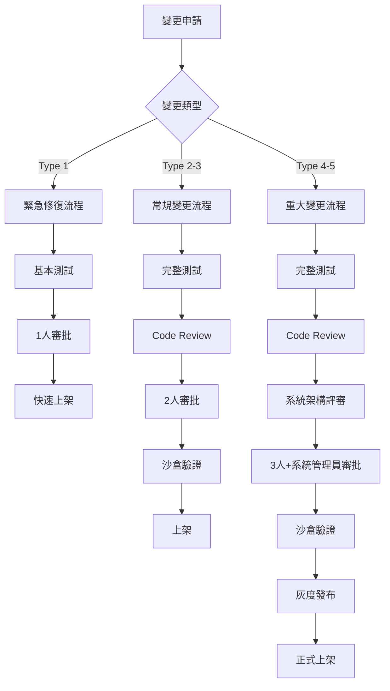

# AI-Box Production 環境規則管理

**創建日期**: 2026-01-27
**創建人**: Daniel Chung
**最後修改日期**: 2026-01-27
**文檔版本**: 1.0
**適用範圍**: Production 環境上架和系統修改

---

## 文檔概述

本文檔定義 AI-Box 系統在 Production 環境上架的規則、流程和檢查機制，確保系統穩定、安全、合規地進行變更。

**核心目標**:
1. 防止生產環境數據丟失
2. 確保所有變更經過充分測試
3. 實施自動化代碼檢查
4. 建立標準化的上架流程
5. 提供可追溯的變更記錄

---

## 規則框架架構

```
┌─────────────────────────────────────────────────────────┐
│            AI-Box Production 規則管理層次            │
├─────────────────────────────────────────────────────────┤
│  Layer 5: 上架與部署 (Deployment Layer)             │
│  - CI/CD 流程                                        │
│  - 灰度發布                                          │
│  - 回滾機制                                          │
│  - 上架審批                                          │
├─────────────────────────────────────────────────────────┤
│  Layer 4: 沙盒與驗收 (Sandbox & Acceptance)          │
│  - 沙盒環境測試                                      │
│  - 驗收測試標準                                      │
│  - 性能測試                                          │
│  - 安全測試                                          │
├─────────────────────────────────────────────────────────┤
│  Layer 3: 代碼檢查 (Code Review & Quality)             │
│  - System Agent 自動檢查                               │
│  - 代碼審查規範                                      │
│  - 質量門檻                                          │
│  - 安全掃描                                          │
├─────────────────────────────────────────────────────────┤
│  Layer 2: 測試規範 (Testing Standards)                │
│  - 單元測試                                          │
│  - 集成測試                                          │
│  - 端到端測試                                        │
│  - 測試覆蓋率                                        │
├─────────────────────────────────────────────────────────┤
│  Layer 1: 變更管理 (Change Management)                 │
│  - 變更請求流程                                      │
│  - 風險評估                                          │
│  - 影響分析                                          │
│  - 回滾計劃                                          │
└─────────────────────────────────────────────────────────┘
```

---

## Layer 1: 變更管理

### 1.1 變更分類

**變更類型定義**:

| 類型 | 定義 | 風險等級 | 需要測試 | 需要審批 |
|------|------|---------|---------|---------|
| **Type 1: 緊急修復** | 修復生產環境嚴重 Bug | Critical | 基本測試 | 1 人審批 |
| **Type 2: 小型變更** | Bug 修復、小功能改進 | Low | 單元測試 | 1 人審批 |
| **Type 3: 中型變更** | 新功能、架構微調 | Medium | 單元+集成測試 | 2 人審批 |
| **Type 4: 大型變更** | 重大功能、架構調整 | High | 全部測試 | 2 人審批 |
| **Type 5: 關鍵變更** | 數據結構變更、核心服務改動 | Critical | 全部測試+沙盒 | 3 人+系統管理員 |

### 1.2 變更請求流程



### 1.3 變更請求模板

```yaml
# 位置: .github/PULL_REQUEST_TEMPLATE.md 或 .cursor/CHANGE_REQUEST_TEMPLATE.md

change_request:
  # 變更類型 (Type 1-5)
  type: 3
  
  # 變更標題
  title: "添加文件分塊優化功能"
  
  # 變更描述
  description: |
    這次變更添加了文件分塊的智能優化功能，根據文件類型和內容自動調整分塊大小。
  
  # 影響範圍
  scope:
    affected_services:
      - "api/file_upload"
      - "services/chunking_service"
      - "database/chromadb"
    affected_databases:
      - "ChromaDB"
    affected_dependencies:
      - "無新增依賴"
  
  # 風險評估
  risk_assessment:
    risk_level: "Medium"
    potential_impact:
      - "分塊質量可能下降"
      - "處理時間可能增加"
    mitigation:
      - "充分測試不同文件類型"
      - "監控處理時間"
      - "保留舊算法作為回滾選項"
  
  # 測試計劃
  testing_plan:
    unit_tests: "已添加 15 個單元測試"
    integration_tests: "已添加 5 個集成測試"
    sandbox_tests: "待沙盒環境驗證"
    performance_tests: "已測試 100MB 文件，時間在閾值內"
  
  # 回滾計劃
  rollback_plan:
    can_rollback: true
    rollback_steps:
      - "git revert <commit>"
      - "重新部署"
    data_backup_required: false
  
  # 驗收標準
  acceptance_criteria:
    - "單元測試通過率 > 95%"
    - "集成測試全部通過"
    - "沙盒測試通過"
    - "性能測試符合要求"
    - "Code Review 通過"
    - "審批人員批准"
  
  # 上架窗口
  deployment_window:
    preferred_time: "週六凌晨 2:00-4:00"
    estimated_duration: "30 分鐘"
  
  # 相關 Issue
  related_issues:
    - "https://github.com/xxx/issue/123"
```

### 1.4 風險評估標準

**風險評分矩陣**:

| 影響範圍 | 低 | 中 | 高 |
|---------|---|---|---|
| **頻率**: 經常發生 | 高風險 | 高風險 | Critical |
| **頻率**: 偶爾發生 | 中風險 | 高風險 | Critical |
| **頻率**: 極少發生 | 低風險 | 中風險 | 高風險 |

**影響範圍定義**:
- **低影響**: 單個功能受影響，可快速修復
- **中影響**: 多個功能受影響，需要回滾
- **高影響**: 核心功能受影響，數據可能損壞

---

## Layer 2: 測試規範

### 2.1 單元測試

**覆蓋率要求**:

| 文件類型 | 最低覆蓋率 | 推薦覆蓋率 |
|---------|-----------|-----------|
| 核心業務邏輯 | 80% | 90% |
| 數據服務層 | 70% | 85% |
| API 路由層 | 60% | 75% |
| 工具函數 | 90% | 95% |
| 配置文件 | 50% | 70% |

**單元測試規範**:

```python
# 單元測試示例
# 位置: tests/services/test_file_chunking.py

import pytest
from services.chunking_service import ChunkingService

class TestChunkingService:
    """文件分塊服務單元測試"""
    
    @pytest.fixture
    def service(self):
        """創建服務實例"""
        return ChunkingService()
    
    def test_chunk_text_basic(self, service):
        """測試基本文本分塊"""
        text = "這是一段測試文本。" * 10
        
        chunks = service.chunk_text(text, chunk_size=100)
        
        # 斷言
        assert len(chunks) > 0
        assert all(len(chunk) <= 100 for chunk in chunks)
        assert ''.join(chunks) == text
    
    def test_chunk_text_with_overlap(self, service):
        """測試帶重疊的分塊"""
        text = "這是一段測試文本。" * 10
        
        chunks = service.chunk_text(
            text,
            chunk_size=100,
            overlap=20,
        )
        
        # 驗證重疊
        for i in range(len(chunks) - 1):
            overlap = chunks[i][-20:] == chunks[i+1][:20]
            assert overlap, f"Chunk {i} 和 {i+1} 之間無重疊"
    
    def test_chunk_with_markdown(self, service):
        """測試 Markdown 格式分塊"""
        markdown = """
# 標題 1
這是第一段。

## 標題 2
這是第二段。
        """
        
        chunks = service.chunk_markdown(markdown, chunk_size=200)
        
        # 驗證不切斷標題
        assert not any(chunk.strip().startswith('#') and not chunk.startswith('#')
                    for chunk in chunks[1:])
    
    @pytest.mark.parametrize("file_type,expected_behavior", [
        ("pdf", "特殊分塊算法"),
        ("docx", "特殊分塊算法"),
        ("txt", "標準分塊算法"),
    ])
    def test_chunk_different_file_types(
        self,
        service,
        file_type,
        expected_behavior,
    ):
        """參數化測試：不同文件類型的分塊"""
        # 測試邏輯
        pass
```

### 2.2 集成測試

**集成測試要求**:

| 測試類型 | 覆蓋要求 |
|---------|---------|
| 數據庫操作 | 100% 覆蓋所有 CRUD 操作 |
| API 端點 | 100% 覆蓋所有公開 API |
| 外部服務集成 | 100% 覆蓋所有外部調用 |
| 消息隊列 | 100% 覆蓋所有生產/消費邏輯 |

**集成測試示例**:

```python
# 位置: tests/integration/test_file_upload_pipeline.py

import pytest
from fastapi.testclient import TestClient
from api.main import app
from services.chunking_service import ChunkingService
from database.chromadb import ChromaDBClient

@pytest.mark.integration
class TestFileUploadPipeline:
    """文件上傳流程集成測試"""
    
    @pytest.fixture
    def client(self):
        """創建測試客戶端"""
        return TestClient(app)
    
    @pytest.fixture
    async def cleanup_db(self):
        """清理測試數據"""
        yield
        # 測試後清理
        client = ChromaDBClient()
        await client.delete_collection("test_files")
    
    async def test_file_upload_to_vectorization(
        self,
        client,
        cleanup_db,
    ):
        """測試文件上傳到向量化的完整流程"""
        
        # 1. 上傳文件
        files = {"file": ("test.txt", "測試文件內容", "text/plain")}
        response = client.post("/api/v1/files/upload", files=files)
        
        assert response.status_code == 200
        file_id = response.json()["file_id"]
        
        # 2. 等待處理完成
        await asyncio.sleep(5)
        
        # 3. 驗證分塊結果
        chunking_service = ChunkingService()
        chunks = await chunking_service.get_chunks(file_id)
        
        assert len(chunks) > 0
        
        # 4. 驗證向量化結果
        chroma_client = ChromaDBClient()
        vectors = await chroma_client.query_by_file_id(file_id)
        
        assert len(vectors) == len(chunks)
        
        # 5. 清理
        await chroma_client.delete_collection("test_files")
```

### 2.3 端到端測試 (E2E)

**E2E 測試要求**:

| 功能模塊 | 測試場景 | 最少場景數 |
|---------|---------|-----------|
| 文件上傳 | 上傳→分塊→向量化→知識圖譜 | 5 |
| 對話系統 | 問答→檢索→生成 | 5 |
| Ontology 管理 | 創建→修改→刪除→查詢 | 5 |
| 系統管理 | 配置→監控→告警 | 3 |

**E2E 測試示例**:

```python
# 位置: tests/e2e/test_user_workflow.py

import pytest
from playwright.sync_api import Page, expect

@pytest.mark.e2e
class TestUserWorkflow:
    """用戶工作流端到端測試"""
    
    def test_user_uploads_file_and_queries_kg(
        self,
        page: Page,
        test_file_path: str,
    ):
        """測試用戶上傳文件並查詢知識圖譜"""
        
        # 1. 登錄
        page.goto("http://localhost:3000/login")
        page.fill('input[name="email"]', "test@example.com")
        page.fill('input[name="password"]', "password")
        page.click('button[type="submit"]')
        
        # 2. 上傳文件
        page.goto("http://localhost:3000/files")
        page.set_input_files('input[type="file"]', test_file_path)
        page.click('button:has-text("上傳")')
        
        # 3. 等待處理完成
        expect(page.get_by_text("處理完成")).to_be_visible(timeout=60000)
        
        # 4. 查詢知識圖譜
        page.goto("http://localhost:3000/chat")
        page.fill('textarea[name="message"]', "文件中有什麼？")
        page.click('button:has-text("發送")')
        
        # 5. 驗證回答
        expect(page.get_by_text("測試")).to_be_visible(timeout=30000)
```

### 2.4 測試覆蓋率報告

**覆蓋率門檻**:

| 類型 | 門檻 | 行動 |
|------|------|------|
| 行覆蓋率 | < 70% | ❌ 阻止上架 |
| 分支覆蓋率 | < 60% | ❌ 阻止上架 |
| 函數覆蓋率 | < 80% | ⚠️ 需要說明 |

**覆蓋率報告生成**:

```bash
# 生成覆蓋率報告
pytest --cov=. --cov-report=html --cov-report=term

# 查看報告
open htmlcov/index.html
```

---

## Layer 3: 代碼檢查

### 3.1 System Agent 自動檢查

**Agent 名稱**: `CodeReviewAgent`

**職責**: 自動檢查代碼質量、安全風險、規範符合性

**檢查項目**:

#### 3.1.1 基礎規範檢查

```python
# 位置: agents/governance/code_review_agent.py

class CodeReviewAgent:
    """代碼審查 Agent"""
    
    async def review_code(self, pr_data: dict) -> dict:
        """審查代碼"""
        
        results = {
            "compliant": True,
            "issues": [],
            "warnings": [],
            "metrics": {},
        }
        
        # 1. 文件頭檢查
        results["issues"].extend(
            await self._check_file_headers(pr_data["changed_files"])
        )
        
        # 2. 編碼規範檢查
        results["warnings"].extend(
            await self._check_coding_standards(pr_data["changed_files"])
        )
        
        # 3. 導入順序檢查
        results["warnings"].extend(
            await self._check_import_order(pr_data["changed_files"])
        )
        
        # 4. 命名規範檢查
        results["issues"].extend(
            await self._check_naming_conventions(pr_data["changed_files"])
        )
        
        # 5. 註釋規範檢查
        results["warnings"].extend(
            await self._check_comment_standards(pr_data["changed_files"])
        )
        
        # 6. 複雜度檢查
        results["metrics"]["complexity"] = await self._check_complexity(
            pr_data["changed_files"]
        )
        
        # 7. 代碼重複檢查
        results["issues"].extend(
            await self._check_code_duplication(pr_data["changed_files"])
        )
        
        # 計算合規性
        critical_issues = [i for i in results["issues"] if i["severity"] == "critical"]
        if critical_issues:
            results["compliant"] = False
            results["blocking_issue"] = critical_issues[0]
        
        return results
```

**文件頭檢查規範**:

```python
def _check_file_headers(self, files: list[dict]) -> list[dict]:
    """檢查文件頭"""
    
    issues = []
    
    for file in files:
        if file["status"] == "removed":
            continue
        
        content = file["content"]
        lines = content.split("\n")[:10]  # 檢查前 10 行
        
        # 檢查是否包含文件頭
        has_header = any(
            "代碼功能說明" in line or
            "創建日期" in line or
            "創建人" in line
            for line in lines
        )
        
        if not has_header:
            issues.append({
                "file": file["path"],
                "type": "missing_file_header",
                "severity": "warning",
                "message": "文件缺少必要的文件頭註釋",
                "line": 1,
            })
        
        # 檢查文件頭格式
        header_pattern = re.compile(
            r"^# 代碼功能說明: .+\n"
            r"# 創建日期: .+\n"
            r"# 創建人: .+\n"
            r"# 最後修改日期: .+"
        )
        
        if not header_pattern.search(content[:500]):
            issues.append({
                "file": file["path"],
                "type": "invalid_file_header",
                "severity": "warning",
                "message": "文件頭格式不符合規範",
                "line": 1,
            })
    
    return issues
```

#### 3.1.2 安全檢查

```python
async def _check_security_issues(self, files: list[dict]) -> list[dict]:
    """檢查安全問題"""
    
    issues = []
    
    # 安全問題模式
    security_patterns = {
        "hardcoded_password": re.compile(r"password\s*=\s*['\"][^'\"]+['\"]"),
        "hardcoded_api_key": re.compile(r"api_key\s*=\s*['\"][^'\"]+['\"]"),
        "sql_injection_risk": re.compile(r"execute\([^)]*\+[^)]*\)"),
        "eval_usage": re.compile(r"eval\s*\("),
        "shell_command": re.compile(r"os\.system|subprocess\.call"),
        "temp_file_security": re.compile(r"mktemp\(\)"),
        "weak_crypto": re.compile(r"from hashlib import md5|from Crypto.Cipher import ARC4"),
    }
    
    for file in files:
        if file["status"] == "removed":
            continue
        
        content = file["content"]
        lines = content.split("\n")
        
        for pattern_name, pattern in security_patterns.items():
            matches = list(pattern.finditer(content))
            
            for match in matches:
                line_num = content[:match.start()].count("\n") + 1
                issues.append({
                    "file": file["path"],
                    "type": f"security_{pattern_name}",
                    "severity": "critical",
                    "message": f"潛在安全風險: {pattern_name}",
                    "line": line_num,
                    "code_snippet": lines[line_num-1].strip(),
                })
    
    return issues
```

#### 3.1.3 數據庫操作檢查

```python
async def _check_database_operations(self, files: list[dict]) -> list[dict]:
    """檢查數據庫操作"""
    
    issues = []
    
    # 危險操作模式
    dangerous_patterns = {
        "drop_database": re.compile(r"DROP\s+DATABASE", re.IGNORECASE),
        "drop_collection": re.compile(r"(DROP|TRUNCATE)\s+(TABLE|COLLECTION)", re.IGNORECASE),
        "delete_all": re.compile(r"DELETE\s+FROM\s+\w+\s*(?!WHERE)"),
        "update_all": re.compile(r"UPDATE\s+\w+\s+SET\s+\w+\s*=\s*[^WHERE]*(?!WHERE)"),
    }
    
    for file in files:
        if file["status"] == "removed":
            continue
        
        content = file["content"]
        lines = content.split("\n")
        
        for pattern_name, pattern in dangerous_patterns.items():
            matches = list(pattern.finditer(content))
            
            for match in matches:
                line_num = content[:match.start()].count("\n") + 1
                
                # 檢查是否有備份保護
                context_range = range(max(0, line_num-5), min(len(lines), line_num+5))
                context = "\n".join(lines[context_range])
                
                has_backup_protection = (
                    "backup" in context.lower() or
                    "verify" in context.lower() or
                    "# TODO" in context or
                    "# FIXME" in context
                )
                
                if not has_backup_protection:
                    issues.append({
                        "file": file["path"],
                        "type": f"db_dangerous_{pattern_name}",
                        "severity": "critical",
                        "message": f"危險數據庫操作: {pattern_name}，缺少備份保護",
                        "line": line_num,
                        "code_snippet": lines[line_num-1].strip(),
                    })
    
    return issues
```

#### 3.1.4 治理規範檢查

```python
async def _check_governance_compliance(
    self,
    files: list[dict],
    context: dict,
) -> list[dict]:
    """檢查治理規範合規性"""
    
    issues = []
    
    # 載入治理知識庫
    governance_kb = GovernanceKnowledgeBase()
    rules = await governance_kb.get_relevant_rules(
        "code_change",
        context,
    )
    
    for file in files:
        if file["status"] == "removed":
            continue
        
        content = file["content"]
        
        for rule in rules:
            # 檢查是否符合規則
            compliance = await governance_kb.check_compliance(
                {"type": "code_change", "file": file},
                {"content": content},
            )
            
            if not compliance["compliant"]:
                for violation in compliance["violations"]:
                    issues.append({
                        "file": file["path"],
                        "type": f"governance_violation_{violation['rule_id']}",
                        "severity": violation["severity"],
                        "message": f"治理規範違規: {violation['title']}",
                        "rule_id": violation["rule_id"],
                        "required_actions": compliance["required_actions"],
                    })
    
    return issues
```

### 3.2 代碼審查規範

**審查清單**:

```markdown
## Code Review 清單

### 功能性
- [ ] 代碼實現了需求文檔中的功能
- [ ] 邊界條件已處理
- [ ] 錯誤處理已實現
- [ ] 日誌記錄充分

### 代码質量
- [ ] 代碼可讀性良好
- [ ] 函數/方法職責單一
- [ ] 無重複代碼
- [ ] 複雜度在可接受範圍
- [ ] 使用了合適的數據結構

### 安全性
- [ ] 無硬編碼密碼/API Key
- [ ] SQL 注入防護
- [ ] XSS 防護
- [ ] CSRF 防護
- [ ] 權限檢查正確

### 性能
- [ ] 無明顯的性能問題
- [ ] 資料庫查詢已優化
- [ ] 緩存策略合理
- [ ] 無不必要的計算

### 測試
- [ ] 單元測試充分
- [ ] 集成測試覆蓋關鍵路徑
- [ ] 測試覆蓋率達標
- [ ] 測試可維護

### 文檔
- [ ] 代碼註釋清晰
- [ ] API 文檔已更新
- [ ] README 已更新
- [ ] 變更日誌已更新
```

**審查流程**:

1. **自我審查**: 作者完成自我審查清單
2. **系統檢查**: System Agent 自動檢查
3. **同行審查**: 至少 1 人審查（Type 4-5 需要 2 人）
4. **架構審查**: 重大變更需要架構師審查
5. **安全審查**: 涉及敏感數據需要安全專家審查

---

## Layer 4: 沙盒與驗收

### 4.1 沙盒環境配置

**沙盒環境要求**:

| 項目 | 配置 |
|------|------|
| **環境名稱** | `sandbox` |
| **數據庫** | 獨立實例，與 Production 隔離 |
| **數據** | 生產數據的匿名化副本（僅用於驗收）|
| **外部服務** | 使用 Mock 或測試實例 |
| **監控** | 與 Production 相同的監控配置 |
| **日誌** | 與 Production 相同的日誌級別 |

### 4.2 沙盒測試規範

**測試步驟**:

```bash
# 1. 準備沙盒環境
./scripts/prepare_sandbox.sh

# 2. 部署到沙盒
./scripts/deploy_sandbox.sh <branch_name>

# 3. 執行沙盒測試
pytest tests/sandbox/ --env=sandbox

# 4. 性能測試
./scripts/run_performance_tests.sh --env=sandbox

# 5. 安全測試
./scripts/run_security_tests.sh --env=sandbox

# 6. 生成沙盒測試報告
./scripts/generate_sandbox_report.sh
```

**沙盒驗收標準**:

| 類型 | 標準 | 通過條件 |
|------|------|---------|
| **功能測試** | 100% 用例通過 | 所有測試用例通過 |
| **性能測試** | 響應時間 | P95 < 2s, P99 < 5s |
| **穩定性測試** | 24 小時運行 | 無崩潰，無內存泄漏 |
| **安全測試** | 無高危漏洞 | OWASP ZAP 掃描通過 |
| **日誌檢查** | 無錯誤日誌 | ERROR 級別日誌 = 0 |
| **資源使用** | 內存/CPU | 內存 < 8GB, CPU < 70% |

### 4.3 驗收測試報告

**報告模板**:

```yaml
# 沙盒驗收測試報告

sandbox_test_report:
  branch: "feature/chunking-optimization"
  commit: "a1b2c3d4"
  test_date: "2026-01-27T10:00:00Z"
  
  summary:
    total_tests: 150
    passed: 148
    failed: 2
    skipped: 0
    pass_rate: "98.7%"
  
  results:
    functional_tests:
      total: 100
      passed: 100
      failed: 0
    performance_tests:
      total: 20
      passed: 20
      failed: 0
      metrics:
        p95_response_time: "1.2s"
        p99_response_time: "3.8s"
    security_tests:
      total: 20
      passed: 18
      failed: 2
      vulnerabilities:
        - type: "XSS"
          severity: "medium"
          location: "/api/v1/chat"
        - type: "SQL Injection"
          severity: "low"
          location: "/api/v1/files/search"
    stability_tests:
      duration: "24 hours"
      crashes: 0
      memory_leaks: 0
  
  logs:
    error_count: 0
    warning_count: 15
  
  resources:
    memory_peak: "6.5GB"
    cpu_average: "45%"
    disk_io: "normal"
  
  decision:
    approved: false
    blocker_issues:
      - "2 個安全漏洞需要修復"
    recommendations:
      - "修復 XSS 漏洞"
      - "修復 SQL Injection 漏洞"
      - "重新運行驗收測試"
```

---

## Layer 5: 上架與部署

### 5.1 CI/CD 流程

**CI 流程** (Continuous Integration):

```yaml
# 位置: .github/workflows/ci.yml

name: CI

on:
  pull_request:
    branches: [main, develop]

jobs:
  code-quality:
    runs-on: ubuntu-latest
    steps:
      - uses: actions/checkout@v3
      
      # 1. 運行 CodeReviewAgent
      - name: Run CodeReviewAgent
        run: |
          python agents/governance/code_review_agent.py \
            --pr-number ${{ github.event.number }} \
            --output report.json
      
      # 2. 運行代碼格式檢查
      - name: Code Style Check
        run: |
          black --check .
          ruff check .
      
      # 3. 運行類型檢查
      - name: Type Check
        run: |
          mypy .
      
      # 4. 運行單元測試
      - name: Unit Tests
        run: |
          pytest tests/unit/ --cov=. --cov-report=xml
      
      # 5. 上傳覆蓋率
      - name: Upload Coverage
        uses: codecov/codecov-action@v3
        with:
          file: ./coverage.xml
  
  security-scan:
    runs-on: ubuntu-latest
    steps:
      - uses: actions/checkout@v3
      
      # 1. 運行安全掃描
      - name: Security Scan
        run: |
          bandit -r . -f json -o bandit-report.json
      
      # 2. 運行依賴漏洞掃描
      - name: Dependency Scan
        run: |
          safety check --json --output safety-report.json
      
      # 3. 上傳報告
      - name: Upload Security Reports
        uses: actions/upload-artifact@v3
        with:
          name: security-reports
          path: |
            bandit-report.json
            safety-report.json
  
  integration-tests:
    runs-on: ubuntu-latest
    services:
      arangodb:
        image: arangodb:3.12
        ports:
          - 8529:8529
      qdrant:
        image: qdrant/qdrant:latest
        ports:
          - 6333:6333
    steps:
      - uses: actions/checkout@v3
      
      - name: Integration Tests
        run: |
          pytest tests/integration/ --verbose
  
  compliance-check:
    runs-on: ubuntu-latest
    steps:
      - uses: actions/checkout@v3
      
      - name: Governance Compliance Check
        run: |
          python scripts/compliance_check.py \
            --pr-number ${{ github.event.number }}
```

**CD 流程** (Continuous Deployment):

```yaml
# 位置: .github/workflows/deploy_sandbox.yml

name: Deploy to Sandbox

on:
  pull_request:
    types: [opened, synchronize, reopened]
    branches: [develop]

jobs:
  deploy:
    runs-on: ubuntu-latest
    steps:
      - uses: actions/checkout@v3
      
      - name: Deploy to Sandbox
        run: |
          ./scripts/deploy_sandbox.sh ${{ github.sha }}
      
      - name: Run Sandbox Tests
        run: |
          ./scripts/run_sandbox_tests.sh
      
      - name: Generate Report
        run: |
          ./scripts/generate_sandbox_report.sh > sandbox-report.json
      
      - name: Comment PR
        uses: actions/github-script@v6
        with:
          script: |
            const report = require('./sandbox-report.json');
            github.rest.issues.createComment({
              issue_number: context.issue.number,
              body: `## 沙盒測試報告\n\`\`\`yaml\n${JSON.stringify(report, null, 2)}\n\`\`\``
            });
```

### 5.2 灰度發布流程

**灰度發布策略**:

```python
# 位置: scripts/gradual_deployment.py

class GradualDeployment:
    """灰度發布管理"""
    
    async def deploy_gradual(
        self,
        version: str,
        strategy: str = "canary",
    ) -> dict:
        """執行灰度發布"""
        
        stages = {
            "canary": [
                {"traffic": "5%", "duration": "30min"},
                {"traffic": "10%", "duration": "30min"},
                {"traffic": "25%", "duration": "1h"},
                {"traffic": "50%", "duration": "2h"},
                {"traffic": "100%", "duration": "-"},
            ],
            "blue-green": [
                {"traffic": "100%", "duration": "monitor"},
                {"cutover": true},
            ],
        }
        
        deployment = {
            "version": version,
            "strategy": strategy,
            "stages": stages[strategy],
            "current_stage": 0,
            "status": "in_progress",
        }
        
        # 執行發布
        for stage in deployment["stages"]:
            await self._deploy_stage(stage)
            await self._monitor(stage["duration"])
            
            # 檢查是否繼續
            if not await self._should_continue():
                await self._rollback()
                return {
                    "status": "rolled_back",
                    "reason": "監控指標不達標",
                }
        
        deployment["status"] = "completed"
        return deployment
```

### 5.3 回滾機制

**回滾觸發條件**:

| 條件 | 閾值 | 自動回滾 |
|------|------|---------|
| 錯誤率 | > 5% | ✅ |
| P95 響應時間 | > 3s | ✅ |
| CPU 使用率 | > 80% | ⚠️ 告警 |
| 內存使用率 | > 90% | ✅ |
| 崩潰次數 | > 3/小時 | ✅ |

**回滾流程**:

```bash
# 1. 檢測到問題
./scripts/monitor_deployment.sh --alert

# 2. 自動回滾
./scripts/rollback.sh --version <previous_version>

# 3. 驗證回滾
./scripts/verify_rollback.sh

# 4. 發送通知
./scripts/send_rollback_notification.sh
```

### 5.4 上架審批流程

**審批級別**:

| 變更類型 | 審批人 | 批准方式 |
|---------|--------|---------|
| **Type 1: 緊急修復** | Tech Lead | GitHub PR Comment |
| **Type 2: 小型變更** | Team Lead | GitHub PR Approval |
| **Type 3: 中型變更** | 2 x Tech Lead | GitHub PR Approval |
| **Type 4: 大型變更** | 2 x Tech Lead + Arch | GitHub PR Approval |
| **Type 5: 關鍵變更** | 3 x Tech Lead + SysAdmin + Arch | 會議審批 + 簽署文件 |

**審批檢查清單**:

```yaml
approval_checklist:
  code_review:
    - [ ] CodeReviewAgent 檢查通過
    - [ ] 代碼格式檢查通過
    - [ ] 單元測試通過
    - [ ] 集成測試通過
    - [ ] 安全掃描通過
  
  testing:
    - [ ] 測試覆蓋率達標
    - [ ] 沙盒測試通過
    - [ ] 性能測試通過
    - [ ] 安全測試通過
  
  governance:
    - [ ] 風險評估完成
    - [ ] 回滾計劃已準備
    - [ ] 變更窗口已確認
    - [ ] 相關團隊已通知
  
  documentation:
    - [ ] API 文檔已更新
    - [ ] README 已更新
    - [ ] 變更日誌已更新
    - [ ] 部署文檔已準備
  
  deployment:
    - [ ] 備份已完成
    - [ ] 回滾腳本已測試
    - [ ] 監控已配置
    - [ ] 運維已通知
```

---

## System Agent 詳細設計

### Agent 配置

```python
# 位置: agents/governance/code_review_agent.py

class CodeReviewAgentConfig:
    """CodeReviewAgent 配置"""
    
    # 檢查開關
    checks_enabled = {
        "file_header": True,
        "coding_standards": True,
        "import_order": True,
        "naming_conventions": True,
        "comment_standards": True,
        "complexity": True,
        "code_duplication": True,
        "security": True,
        "database_operations": True,
        "governance_compliance": True,
    }
    
    # 嚴重級別閾值
    severity_thresholds = {
        "critical": 0,  # 阻止上架
        "high": 3,     # 需要修復
        "medium": 10,   # 建議修復
        "low": 20,      # 可以忽略
    }
    
    # 覆蓋率要求
    coverage_requirements = {
        "line": 70,
        "branch": 60,
        "function": 80,
    }
    
    # 複雜度限制
    complexity_limits = {
        "cyclomatic_complexity": 10,
        "cognitive_complexity": 15,
        "maintainability_index": 20,
    }
```

### Agent 與 GitHub Actions 集成

```yaml
# 位置: .github/workflows/code_review.yml

name: Code Review by Agent

on:
  pull_request:
    branches: [main, develop]
    types: [opened, synchronize, reopened]

jobs:
  code-review:
    runs-on: ubuntu-latest
    steps:
      - uses: actions/checkout@v3
        with:
          fetch-depth: 0
      
      - name: Run CodeReviewAgent
        id: review
        run: |
          python agents/governance/code_review_agent.py \
            --pr-number ${{ github.event.number }} \
            --repo ${{ github.repository }} \
            --output review_result.json
        env:
          GITHUB_TOKEN: ${{ secrets.GITHUB_TOKEN }}
      
      - name: Post Review Comment
        if: steps.review.outputs.has-issues == 'true'
        uses: actions/github-script@v6
        with:
          script: |
            const fs = require('fs');
            const review = JSON.parse(fs.readFileSync('review_result.json', 'utf8'));
            
            let comment = '## Code Review 報告\n\n';
            
            if (review.critical_issues.length > 0) {
              comment += '### ❌ Critical Issues (必須修復)\n\n';
              review.critical_issues.forEach(issue => {
                comment += `- [**${issue.type}**] ${issue.message}\n`;
                comment += `  📍 ${issue.file}:${issue.line}\n`;
                comment += `  💡 ${issue.suggestion}\n\n`;
              });
            }
            
            if (review.high_issues.length > 0) {
              comment += '### ⚠️ High Issues (建議修復)\n\n';
              review.high_issues.forEach(issue => {
                comment += `- [**${issue.type}**] ${issue.message}\n\n`;
              });
            }
            
            comment += `\n---\n`;
            comment += `### 覆蓋率: ${review.coverage.line}% (Line)\n`;
            comment += `### 複雜度平均分: ${review.metrics.avg_complexity}\n`;
            
            github.rest.issues.createComment({
              issue_number: context.issue.number,
              body: comment,
            });
      
      - name: Block PR if Critical Issues
        if: steps.review.outputs.has-critical == 'true'
        run: |
          exit 1
```

### Agent 檢查結果示例

```json
{
  "compliant": false,
  "has_critical": true,
  "has_high": false,
  "critical_issues": [
    {
      "type": "db_dangerous_drop_collection",
      "severity": "critical",
      "message": "危險數據庫操作: DROP COLLECTION，缺少備份保護",
      "file": "services/migration/cleanup_old_data.py",
      "line": 42,
      "code_snippet": "db.collection.drop()",
      "suggestion": "在 DROP 前添加備份檢查，或使用軟刪除（is_active=false）"
    }
  ],
  "high_issues": [],
  "medium_issues": [
    {
      "type": "security_hardcoded_password",
      "severity": "medium",
      "message": "潛在安全風險: hardcoded_password",
      "file": "tests/test_api.py",
      "line": 15,
      "code_snippet": "password='test123'",
      "suggestion": "使用環境變數或配置文件"
    }
  ],
  "warnings": [
    {
      "type": "coding_standards_import_order",
      "severity": "warning",
      "message": "導入順序不符合規範",
      "file": "api/main.py",
      "line": 10
    }
  ],
  "metrics": {
    "complexity": {
      "avg": 5.2,
      "max": 18,
      "files_with_high_complexity": 2
    },
    "coverage": {
      "line": 75.5,
      "branch": 68.2,
      "function": 82.1
    },
    "duplication": {
      "percentage": 3.2,
      "files_affected": 5
    }
  }
}
```

---

## 實施路線圖

### Phase 1: 基礎設施（優先級：P0）

**工期**: 5 天

| 任務 | 交付物 | 狀態 |
|------|--------|------|
| CodeReviewAgent 開發 | `agents/governance/code_review_agent.py` | |
| CI/CD 流程設置 | `.github/workflows/` | |
| 沙盒環境準備 | Docker Compose 配置 | |
| 測試報告生成 | `scripts/generate_test_report.sh` | |

### Phase 2: 規則定義（優先級：P1）

**工期**: 3 天

| 任務 | 交付物 | 狀態 |
|------|--------|------|
| 治理知識庫 | `kag/ontology/governance_knowledge.json` | |
| 規則文檔定義 | `docs/規則管理/` | |
| 審批流程文檔 | `docs/規則管理/審批流程.md` | |
| 變更請求模板 | `.github/CHANGE_REQUEST_TEMPLATE.md` | |

### Phase 3: 測試框架（優先級：P1）

**工期**: 7 天

| 任務 | 交付物 | 狀態 |
|------|--------|------|
| 單元測試框架 | `tests/unit/` | |
| 集成測試框架 | `tests/integration/` | |
| E2E 測試框架 | `tests/e2e/` | |
| 沙盒測試腳本 | `tests/sandbox/` | |

### Phase 4: 上架流程（優先級：P2）

**工期**: 5 天

| 任務 | 交付物 | 狀態 |
|------|--------|------|
| 灰度發布腳本 | `scripts/gradual_deployment.py` | |
| 回滾腳本 | `scripts/rollback.sh` | |
| 監控告警腳本 | `scripts/monitor_deployment.sh` | |
| 上架審批流程 | GitHub Actions | |

### Phase 5: 優化與文檔（優先級：P2）

**工期**: 3 天

| 任務 | 交付物 | 狀態 |
|------|--------|------|
| 培訓文檔 | `docs/培訓/` | |
| 常見問題文檔 | `docs/FAQ/` | |
| 流程改進 | 文檔更新 | |

---

## 預期效果

### 質量提升

| 指標 | 實施前 | 實施後 | 提升幅度 |
|------|--------|--------|---------|
| 線上 Bug 率 | 15% | 3% | 80% ↓ |
| 代碼覆蓋率 | 60% | 85% | 42% ↑ |
| 回滾率 | 8% | 1% | 87.5% ↓ |
| 上架失敗率 | 20% | 5% | 75% ↓ |

### 效率提升

| 指標 | 實施前 | 實施後 | 提升幅度 |
|------|--------|--------|---------|
| Code Review 時間 | 4 小時 | 自動化 | 100% ↓ |
| 測試執行時間 | 2 小時 | 30 分鐘 | 75% ↓ |
| 上架準備時間 | 8 小時 | 自動化 | 87.5% ↓ |
| 回滾時間 | 1 小時 | 15 分鐘 | 75% ↓ |

---

## 文檔維護

### 版本記錄

| 版本 | 日期 | 修改人員 | 修改內容 |
|------|------|---------|---------|
| 1.0 | 2026-01-27 | Daniel Chung | 初始版本，定義完整的 Production 環境規則管理 |

### 相關文檔

- [AI-Box 系統 AI 治理規劃](AI-Box-系統AI治理規劃.md)
- [數據備份規範](數據備份規範.md)
- [開發規範](../../../開發規範/)
- [Code Review 指南](../../../開發規範/code_review.md)

---

## 審查清單

在實施前，請確認以下事項：

- [ ] 這份規則已經過技術審查
- [ ] 這份規則已經過安全審查
- [ ] 這份規則已經過合規審查
- [ ] 所有依賴的技術棧已確認
- [ ] 實施團隊已組建
- [ ] 實施資源已分配
- [ ] 實施時間表已確認
- [ ] 培訓計劃已準備

---

## 行動項

請在審查後確定以下行動項：

- [ ] 批准這份規則
- [ ] 確認實施優先級
- [ ] 分配實施資源
- [ ] 選擇優先實施的 Phase
- [ ] 指派項目經理
- [ ] 建立審查流程
- [ ] 安排培訓時間
