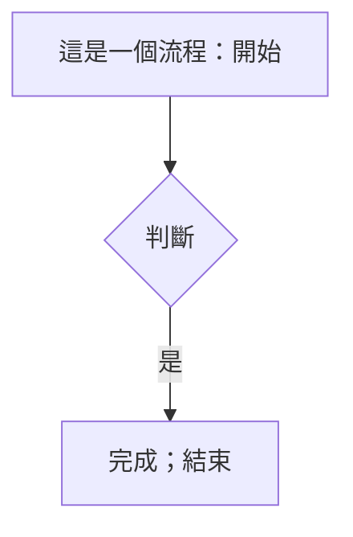

# 系統管理作業規範

**文件編號**: SYS-OP-001  
**版本**: 1.0.0  
**創建日期**: 2026-02-02  
**最後修改日期**: 2026-02-02  
**負責人**: AI-Box Team

---

## 1. 概述

### 1.1 文件目的

本文檔定義 AI-Box 系統的 Prompt 規範管理機制，確保 AI 助手在回應時遵守一致的行為規範。通過結構化的規範管理，系統可以：

- 📋 統一 AI 行為準則
- 🔧 動態調整規範內容
- ✅ 自動驗證回應品質
- 📈 持續優化回應準確性

### 1.2 系統架構

```
┌─────────────────────────────────────────────────────────────────┐
│                      AI-Box 系統架構                              │
├─────────────────────────────────────────────────────────────────┤
│                                                                  │
│   ┌──────────────┐    ┌─────────────────┐    ┌──────────────┐  │
│   │   使用者      │───▶│  API Server     │───▶│   LLM        │  │
│   │   (前端)      │    │  (FastAPI)      │    │  (MoE)       │  │
│   └──────────────┘    └────────┬────────┘    └──────────────┘  │
│                               │                                 │
│                               ▼                                 │
│                      ┌─────────────────┐                        │
│                      │ Prompt Injector │                        │
│                      │  (規範注入器)    │                        │
│                      └────────┬────────┘                        │
│                               │                                 │
│                               ▼                                 │
│                      ┌─────────────────┐                        │
│                      │  config/prompts │                        │
│                      │     (規範配置)   │                        │
│                      └─────────────────┘                        │
│                                                                  │
└─────────────────────────────────────────────────────────────────┘
```

### 1.3 核心元件

| 元件 | 路徑 | 功能 |
|------|------|------|
| 規範配置目錄 | `config/prompts/` | 存放所有規範 JSON 檔案 |
| 主配置檔案 | `config/prompts/system-prompts.json` | 規範入口，定義所有類別和規則 |
| 規範注入器 | `llm/prompt_injector.py` | 載入規範並注入到 LLM prompt |

---

## 2. 規範結構

### 2.1 配置檔案結構

```
config/prompts/
├── system-prompts.json     # 主配置檔案（必選）
├── mermaid-rules.json      # Mermaid 圖表規範（可選）
├── code-style.json         # 代碼風格規範（可選）
└── response-format.json    # 響應格式規範（可選）
```

### 2.2 規範類別

| 類別 ID | 名稱 | 優先級 | 狀態 | 規則數 |
|--------|------|--------|------|--------|
| `general` | 一般行為規範 | Critical | ✅ 啟用 | 3 |
| `mermaid` | Mermaid 圖表規範 | Critical | ✅ 啟用 | 4 |
| `code_style` | 代碼風格規範 | Medium | ✅ 啟用 | 4 |
| `response_format` | 響應格式規範 | Medium | ✅ 啟用 | 3 |

### 2.3 規則結構

每條規範包含以下欄位：

```json
{
  "id": "MR001",
  "name": "禁止使用全形標點",
  "description": "Mermaid 不支援全形冒號、逗號、分號、等號",
  "severity": "error",
  "enforcement": "hard",
  "solution": "使用半形標點 : ; , = ，或用引號包住文字"
}
```

| 欄位 | 說明 | 範例 |
|------|------|------|
| `id` | 規則唯一識別碼 | `MR001` |
| `name` | 規則名稱 | `禁止使用全形標點` |
| `description` | 規則說明 | 描述問題現象 |
| `severity` | 嚴重程度 | `error`, `warning`, `info` |
| `enforcement` | 強制等級 | `hard`（必須）, `soft`（建議）, `info`（參考） |
| `solution` | 解決方式 | 提供正確做法 |

---

## 3. 規範內容

### 3.1 一般行為規範 (general)

| ID | 名稱 | 等級 | 說明 |
|----|------|------|------|
| GB001 | 語言一致性 | Soft | 根據用戶語言自動切換回應語言（繁體中文/英文） |
| GB002 | 簡潔回應 | Soft | 除非用戶要求，否則不主動生成報告或冗長解釋 |
| GB003 | 代碼安全 | **Hard** | 拒絕生成可能被用於惡意目的的代碼 |

### 3.2 Mermaid 圖表規範 (mermaid)

| ID | 名稱 | 等級 | 說明 |
|----|------|------|------|
| MR001 | 禁止使用全形標點 | **Hard** | Mermaid 不支援全形冒號、逗號、分號、等號 |
| MR002 | 方括號內容需引號保護 | **Hard** | 節點文字包含中文或特殊符號時必須用引號 |
| MR003 | init 配置必須是合法 JSON | **Hard** | `%%{init: {...}}%%` 內的 JSON 必須使用半形標點 |
| MR004 | 正確使用程式碼塊標記 | Soft | Mermaid 代碼必須用 ```mermaid 標記包裹 |

#### 3.2.1 Mermaid 規範範例

**錯誤做法：**


**正確做法：**


### 3.3 代碼風格規範 (code_style)

| ID | 名稱 | 等級 | 說明 |
|----|------|------|------|
| CS001 | 檔案頭註解 | Soft | 新創建的檔案必須包含標準檔案頭註解 |
| CS002 | 類型註解 | Soft | 函數參數和返回值必須有類型註解 |
| CS003 | docstring 註解 | Soft | 公開函數必須有 docstring 說明 |
| CS004 | 禁止硬編碼敏感資訊 | **Hard** | API Key、密碼等敏感資訊必須使用環境變數 |

### 3.4 響應格式規範 (response_format)

| ID | 名稱 | 等級 | 說明 |
|----|------|------|------|
| RF001 | 代碼塊語言標記 | **Hard** | 所有程式碼必須使用正確的語言標記包裹 |
| RF002 | 錯誤回應格式 | Soft | 提供錯誤資訊時應包含錯誤訊息、可能原因、解決建議 |
| RF003 | 命令列指令 | Soft | 命令使用程式碼塊標記，輸出結果分開標記 |

---

## 4. 使用方式

### 4.1 程式化使用

```python
from llm.prompt_injector import create_prompt_injector

# 建立注入器
injector = create_prompt_injector()

# 列出所有類別
categories = injector.list_categories()
for cat in categories:
    print(f"{cat['name']}: {cat['rules_count']} 規則")

# 生成 System Prompt
system_prompt = injector.generate_system_prompt()

# 驗證內容
violations = injector.validate_content("你的回應內容")
if violations:
    print("發現規範違規:")
    for v in violations:
        print(f"  - {v['rule_name']}: {v['suggestion']}")

# 自動修正內容
fixed_content = injector.fix_content("你的回應內容")
```

### 4.2 命令列使用

```bash
# 測試注入器
python3 llm/prompt_injector.py

# 輸出 System Prompt
python3 -c "
from llm.prompt_injector import create_prompt_injector
print(create_prompt_injector().generate_system_prompt())
"
```

### 4.3 在 API 中整合

在 `api/routers/chat.py` 中整合：

```python
from llm.prompt_injector import create_prompt_injector

injector = create_prompt_injector()

def chat_handler(request):
    # 生成包含規範的 prompt
    system_prompt = injector.generate_system_prompt()

    # 將規範注入到 LLM
    full_prompt = f"{system_prompt}\n\nUser: {request.message}"

    response = llm.generate(full_prompt)

    # 驗證回應
    violations = injector.validate_content(response)
    if violations:
        response = injector.fix_content(response)

    return response
```

---

## 5. 新增/修改規範

### 5.1 修改現有規範

編輯 `config/prompts/system-prompts.json`：

```json
{
  "system_prompts": {
    "categories": {
      "mermaid": {
        "rules": [
          {
            "id": "MR005",
            "name": "新規則名稱",
            "description": "新規則說明",
            "enforcement": "soft"
          }
        ]
      }
    }
  }
}
```

### 5.2 新增規範類別

1. 在 `system-prompts.json` 中新增類別：

```json
{
  "system_prompts": {
    "categories": {
      "new_category": {
        "name": "新類別名稱",
        "description": "類別說明",
        "priority": "medium",
        "enabled": true,
        "rules": [
          {
            "id": "NC001",
            "name": "規則名稱",
            "description": "規則說明",
            "enforcement": "soft"
          }
        ]
      }
    },
    "active_rules": {
      "categories": ["general", "mermaid", "code_style", "response_format", "new_category"]
    }
  }
}
```

2. 重新載入配置（重啟服務）：

```bash
sudo systemctl restart ai-box-api
```

### 5.3 啟用/停用規範

在 `system-prompts.json` 中修改 `enabled` 欄位：

```json
{
  "categories": {
    "mermaid": {
      "enabled": true   // true = 啟用, false = 停用
    }
  }
}
```

---

## 6. 監控與維護

### 6.1 日誌位置

| 項目 | 路徑 |
|------|------|
| FastAPI 日誌 | `logs/fastapi.log` |
| Prompt Injector 日誌 | 標準輸出 |

### 6.2 常見問題

| 問題 | 原因 | 解決方式 |
|------|------|----------|
| 規範未生效 | 配置檔案語法錯誤 | 檢查 JSON 語法：`python3 -m json.tool config/prompts/system-prompts.json` |
| 規範未載入 | 類別已停用 | 檢查 `enabled` 欄位 |
| Mermaid 渲染失敗 | 違反 MR001/MR002 | 使用 `injector.fix_content()` 自動修正 |

### 6.3 驗證配置

```bash
# 驗證 JSON 語法
python3 -m json.tool /home/daniel/ai-box/config/prompts/system-prompts.json > /dev/null

# 測試注入器
python3 /home/daniel/ai-box/llm/prompt_injector.py
```

---

## 7. 版本歷史

| 版本 | 日期 | 變更內容 |
|------|------|----------|
| 1.0.0 | 2026-02-02 | 初始版本 |

---

## 8. 附錄

### 8.1 相關文件

- [AI-Box 上下文管理架構說明](../AI-Box上下文管理架構說明.md)
- [MoE 系统](docs/系统设计文档/核心组件/MoE系统.md)

### 8.2 參考資源

- Mermaid 文檔: https://mermaid.js.org/
- JSON Schema: https://json-schema.org/

---

**文件結束**
