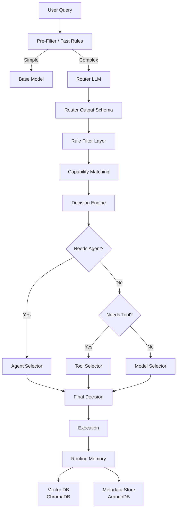

# Task Analyzer 细化开发规格

**创建日期**: 2025-12-30
**创建人**: Daniel Chung
**最后修改日期**: 2025-12-30

---

## 一、概述

本文档基于讨论稿（`docs/系统设计文档/任務分析.md`）和项目实际状况，制定 Task Analyzer 的完整细化开发规格。Task Analyzer 是 AI-Box 系统的核心决策层，负责将用户查询转换为结构化的路由决策，并选择合适的 Agent、Tool 和 Model。

### 核心目标

1. **自动、可控、可解释地**判定使用 Agent / Tool / Model
2. 决定**哪一个**Agent / Tool / Model
3. 在**成本、风险、能力**之间取得平衡

### 当前实现状况

**已实现**：

- ✅ 基础任务分类器（`TaskClassifier`）
- ✅ LLM 路由选择器（`LLMRouter`，支持新旧策略）
- ✅ 工作流选择器（`WorkflowSelector`）
- ✅ 基础决策引擎（`DecisionEngine`，仅工作流决策）
- ✅ 工具注册表加载器（`tools/registry_loader.py`）
- ✅ Agent Registry 和 Discovery 机制

**新增实现**：

- ✅ Router LLM 工程级实现（`router_llm.py`）
- ✅ Rule Filter Layer（`rule_override.py`）
- ✅ 完整的 Decision Engine（Agent/Tool/Model 选择）
- ✅ Capability Matching 机制（`capability_matcher.py`）
- ✅ Routing Memory 系统（`routing_memory/`）
- ✅ 工具能力发现集成到任务分析

---

## 二、架构设计

### 2.1 整体架构



### 2.2 核心组件

| 组件 | 职责 | 实现状态 | 文件位置 |
|------|------|----------|----------|
| Router LLM | 意图分类和路由决策 | ✅ 已实现 | `agents/task_analyzer/router_llm.py` |
| Rule Filter | 硬性规则过滤 | ✅ 已实现 | `agents/task_analyzer/rule_override.py` |
| Capability Matcher | 能力匹配计算 | ✅ 已实现 | `agents/task_analyzer/capability_matcher.py` |
| Decision Engine | 综合决策（Agent/Tool/Model） | ✅ 已扩展 | `agents/task_analyzer/decision_engine.py` |
| Routing Memory | 决策记忆存储 | ✅ 已实现 | `agents/task_analyzer/routing_memory/` |

---

## 三、Router LLM 工程级实现

### 3.1 固定 System Prompt（不可动）

**位置**: `agents/task_analyzer/router_llm.py`

**设计原则**：

- Router 是分类器，不是思考者
- 必须输出结构化 JSON
- 失败时使用安全降级

**System Prompt 内容**：

```python
ROUTER_SYSTEM_PROMPT = """You are a routing and classification engine inside an enterprise GenAI system.

Your ONLY responsibility is to classify the user's query and system context into a routing decision object.

STRICT RULES:
- You must NOT answer the user's question.
- You must NOT perform reasoning, planning, or step-by-step thinking.
- You must NOT select specific tools, agents, or models.
- You must NOT include explanations, markdown, or extra text.

You must ALWAYS return a valid JSON object that strictly follows the given JSON Schema.
If the query is ambiguous, unsafe, or unclear, choose the SAFEST and LOWEST-COST routing option.

If you are unsure, reduce complexity, avoid agents, and avoid tools."""
```

### 3.2 Router 输入格式

**模型定义**: `agents/task_analyzer/models.py`

```python
class RouterInput(BaseModel):
    """Router LLM 输入模型"""
    user_query: str
    session_context: Optional[Dict[str, Any]] = Field(default_factory=dict)
    system_constraints: Optional[Dict[str, Any]] = Field(default_factory=dict)
```

### 3.3 Router 输出 Schema

**模型定义**: `agents/task_analyzer/models.py`

```python
class RouterDecision(BaseModel):
    """Router 决策输出模型"""
    intent_type: Literal["conversation", "retrieval", "analysis", "execution"]
    complexity: Literal["low", "mid", "high"]
    needs_agent: bool
    needs_tools: bool
    determinism_required: bool
    risk_level: Literal["low", "mid", "high"]
    confidence: float = Field(ge=0.0, le=1.0)
```

### 3.4 失败保护机制

**Safe Fallback**：

```python
SAFE_FALLBACK = RouterDecision(
    intent_type="conversation",
    complexity="low",
    needs_agent=False,
    needs_tools=False,
    determinism_required=False,
    risk_level="low",
    confidence=0.0
)
```

**保护规则**：

- JSON 解析失败 → 使用 Safe Fallback
- Schema 验证失败 → 使用 Safe Fallback
- Confidence < 0.6 → 使用 Safe Fallback
- **不重试 Router LLM**（避免系统雪崩）

### 3.5 Rule Override（硬性规则）

**文件**: `agents/task_analyzer/rule_override.py`

**规则示例**：

- 包含危险关键词（delete, execute, deploy）→ `risk_level = "high"`
- 成本敏感任务 → 强制使用低成本模型
- 高延迟要求 → 强制使用本地模型

**设计原则**：**Rule > LLM 永远成立**

---

## 四、Decision Engine 完整实现

### 4.1 决策流程

```
Router Output
   ↓
Rule Filter（硬性淘汰）
   ↓
Capability Matching（能力匹配）
   ↓
Scoring Engine（加权评分）
   ↓
Best Candidate
   ↓
Fallback / Override
```

### 4.2 Rule Filter Layer

**硬性规则**（Boolean 世界）：

- 风险等级过滤：`candidate.risk_level <= router.risk_level`
- 成本限制：`candidate.cost <= system.max_cost`
- 能力要求：`required_capabilities ⊆ candidate.capabilities`

### 4.3 Capability Matching

**匹配维度**：

1. **Agent Capability Match**：从 Agent Registry 获取 Agent 能力列表，计算与 Router Intent 的匹配度
2. **Tool Capability Match**：从 Tool Registry 获取工具能力，根据 `needs_tools` 和 `determinism_required` 匹配
3. **Model Capability Match**：从 Model Registry 获取模型能力，根据任务类型和复杂度匹配

**匹配算法**：

```python
capability_match = len(intersection(router.required_capabilities, candidate.capabilities)) / len(router.required_capabilities)
```

### 4.4 Scoring Engine

**评分维度**：

| 维度 | 权重 | 说明 |
|------|------|------|
| capability_match | 0.35 | 能力匹配度 |
| cost_score | 0.20 | 成本评分（越便宜越高） |
| latency_score | 0.15 | 延迟评分（越快越高） |
| success_history | 0.20 | 历史成功率 |
| stability | 0.10 | 输出稳定度 |

**评分计算**：

```python
score = (
    0.35 * capability_match +
    0.20 * cost_score +
    0.15 * latency_score +
    0.20 * success_history +
    0.10 * stability
)
```

### 4.5 最终决策结构

**模型定义**: `agents/task_analyzer/models.py`

```python
class DecisionResult(BaseModel):
    """决策结果模型"""
    router_result: RouterDecision
    chosen_agent: Optional[str] = None
    chosen_tools: List[str] = Field(default_factory=list)
    chosen_model: Optional[str] = None
    score: float
    fallback_used: bool = False
    reasoning: str
```

---

## 五、Capability Matching 详细设计

### 5.1 Agent Capability Matching

**数据源**：

- Agent Registry（`agents/services/registry/registry.py`）
- Agent Discovery（`agents/services/registry/discovery.py`）

**匹配逻辑**：

1. 从 Router Output 提取所需能力
2. 从 Agent Registry 发现可用 Agent
3. 计算能力匹配度
4. 按匹配度排序

### 5.2 Tool Capability Matching

**数据源**：

- Tool Registry（`tools/registry_loader.py`）
- ArangoDB `tools_registry` collection

**匹配逻辑**：

1. 根据 `needs_tools` 和 `determinism_required` 筛选工具
2. 根据任务类型和意图匹配工具用途
3. 计算工具匹配度

**集成点**：

- 在 `TaskAnalyzer.analyze()` 中调用工具匹配
- 将匹配的工具添加到 `suggested_tools` 字段

### 5.3 Model Capability Matching

**数据源**：

- LLM Router（`agents/task_analyzer/llm_router.py`）
- Model Registry（如需要，从配置或 ArangoDB 读取）

**匹配逻辑**：

1. 根据任务类型和复杂度选择模型
2. 考虑成本、延迟、质量要求
3. 使用现有的 LLM Router 逻辑

---

## 六、Routing Memory 系统

### 6.1 架构设计

**存储方案**（混合方案）：

- **向量存储**：ChromaDB（决策语义）
- **元数据存储**：ArangoDB（决策事实）

**文件结构**：

```
agents/task_analyzer/routing_memory/
├── __init__.py
├── memory_service.py      # Routing Memory 服务
├── vector_store.py        # ChromaDB 向量存储
├── metadata_store.py      # ArangoDB 元数据存储
└── semantic_extractor.py  # 决策语义提取
```

### 6.2 Decision Log 结构

**模型定义**: `agents/task_analyzer/models.py`

```python
class DecisionLog(BaseModel):
    """决策日志模型"""
    decision_id: str
    timestamp: datetime
    query: Dict[str, Any]  # text, embedding (optional)
    router_output: RouterDecision
    decision_engine: DecisionResult
    execution_result: Optional[Dict[str, Any]] = None  # success, latency_ms, cost
```

### 6.3 Vector Memory（ChromaDB）

**存储内容**：决策语义（不是原始 query）

**语义提取**：

```python
def build_routing_semantic(decision_log: DecisionLog) -> str:
    """构建路由语义文本"""
    return f"""
    Intent:{decision_log.router_output.intent_type}
    Complexity:{decision_log.router_output.complexity}
    Risk:{decision_log.router_output.risk_level}
    NeedsAgent:{decision_log.router_output.needs_agent}
    NeedsTools:{decision_log.router_output.needs_tools}
    ChosenPath:{decision_log.decision_engine.chosen_agent or decision_log.decision_engine.chosen_model}
    """
```

### 6.4 Metadata Store（ArangoDB）

**Collection**: `routing_decisions`

**Schema**：

```python
{
    "_key": "decision_id",
    "intent_type": "analysis",
    "complexity": "high",
    "risk_level": "mid",
    "chosen_agent": "financial_agent",
    "chosen_model": "reasoning_llm",
    "chosen_tools": ["sql_query"],
    "fallback_used": false,
    "success": true,
    "latency_ms": 2300,
    "cost": 0.021,
    "created_at": "2025-xx-xxT12:00:00Z"
}
```

**索引**：

- `intent_type`
- `complexity`
- `risk_level`
- `chosen_agent`
- `chosen_model`
- `success`
- `created_at`
- 复合索引：`["intent_type", "complexity", "risk_level"]`

### 6.5 写入流程

**异步写入**（Fire-and-Forget）：

- 不在执行路径上（避免延迟）
- 失败不影响主流程
- 支持批量写入

**实现**：

```python
async def record_decision(decision_log: DecisionLog):
    """记录决策（异步）"""
    # 1. 提取语义
    semantic = build_routing_semantic(decision_log)

    # 2. 向量化并写入 ChromaDB
    await vector_store.add(semantic, decision_log)

    # 3. 写入 ArangoDB
    await metadata_store.save(decision_log)
```

### 6.6 Router 前置 Recall（可选）

**功能**：在 Router LLM 前检索相似决策作为 context

**实现**：

```python
async def recall_similar_decisions(query: str, top_k: int = 3) -> List[DecisionLog]:
    """检索相似决策"""
    # 1. 向量检索
    similar_semantics = await vector_store.search(query, top_k=top_k)

    # 2. 过滤条件（success=True, cost < threshold）
    filtered = [d for d in similar_semantics if d.success and d.cost < 0.05]

    return filtered
```

**注意**：不直接替代 Router，只是提供 context bias

---

## 七、集成点与数据流

### 7.1 Task Analyzer 主流程

**文件**: `agents/task_analyzer/analyzer.py`（已重构）

**新流程**：

```python
async def analyze(self, request: TaskAnalysisRequest) -> TaskAnalysisResult:
    # 1. Pre-Filter（快速规则）
    if self._is_simple_query(request.task):
        return self._handle_simple_query(request)

    # 2. Router 前置 Recall（可选）
    similar_decisions = await self.routing_memory.recall_similar_decisions(...)

    # 3. Router LLM
    router_output = await self.router_llm.route(router_input, similar_decisions)

    # 4. Rule Override
    router_output = self.rule_override.apply(router_output, request.task)

    # 5. Capability Matching
    agent_candidates = await self.capability_matcher.match_agents(router_output)
    tool_candidates = await self.capability_matcher.match_tools(router_output)
    model_candidates = await self.capability_matcher.match_models(router_output)

    # 6. Decision Engine
    decision = self.decision_engine.decide(
        router_output,
        agent_candidates,
        tool_candidates,
        model_candidates
    )

    # 7. 构建结果
    result = self._build_result(router_output, decision)

    # 8. 异步记录决策（不阻塞）
    asyncio.create_task(self.routing_memory.record_decision(result))

    return result
```

### 7.2 Orchestrator 集成

**文件**: `agents/services/orchestrator/orchestrator.py`

**修改点**：

- 使用新的 `RouterDecision` 和 `DecisionResult`
- 集成工具能力发现
- 记录决策到 Routing Memory

---

## 八、数据模型扩展

### 8.1 新增模型

**文件**: `agents/task_analyzer/models.py`

**新增模型**：

1. `RouterInput` - Router LLM 输入
2. `RouterDecision` - Router 决策输出
3. `DecisionResult` - Decision Engine 决策结果
4. `DecisionLog` - 决策日志
5. `CapabilityMatch` - 能力匹配结果

### 8.2 扩展现有模型

**TaskAnalysisResult**：

- 添加 `router_decision: RouterDecision`
- 添加 `decision_result: DecisionResult`
- 添加 `suggested_tools: List[str]`

---

## 九、实现状态

### Phase 1: 核心功能（已完成）

1. ✅ Router LLM 工程级实现
   - 固定 System Prompt
   - 完整 Schema 验证
   - 失败保护机制

2. ✅ Rule Filter Layer
   - 硬性规则过滤
   - Rule Override

3. ✅ Decision Engine 扩展
   - Agent/Tool/Model 选择
   - Scoring Engine

### Phase 2: 能力匹配（已完成）

4. ✅ Capability Matching
   - Agent 能力匹配
   - Tool 能力匹配
   - Model 能力匹配

5. ✅ 工具能力发现集成
   - 从 Tool Registry 加载工具
   - 集成到任务分析流程

### Phase 3: Routing Memory（已完成）

6. ✅ Routing Memory 基础
   - Decision Log 结构
   - ChromaDB 向量存储
   - ArangoDB 元数据存储

7. ✅ Router 前置 Recall（可选）
   - 相似决策检索
   - Context Bias

---

## 十、补充建议

### 10.1 性能优化

1. **Router LLM 缓存**：
   - 对相似查询缓存 Router 决策
   - 使用 query embedding 作为缓存 key

2. **批量处理**：
   - Routing Memory 批量写入
   - 定期批量向量化

### 10.2 可观测性

1. **决策追踪**：
   - 每个决策生成 `decision_id`
   - 在日志中记录决策链路

2. **指标收集**：
   - Router 准确率
   - Decision Engine 选择质量
   - Routing Memory 检索效果

### 10.3 未来演进

1. **小模型 Router**：
   - 使用历史决策训练小模型
   - 降低 Router LLM 成本

2. **Policy Engine**：
   - 从 Routing Memory 提取策略
   - 使用 OPA 或自研 Policy Engine

---

## 十一、文件清单

### 新增文件

1. `agents/task_analyzer/router_llm.py` - Router LLM 实现
2. `agents/task_analyzer/rule_override.py` - 规则覆盖
3. `agents/task_analyzer/capability_matcher.py` - 能力匹配
4. `agents/task_analyzer/routing_memory/` - Routing Memory 模块
   - `__init__.py`
   - `memory_service.py`
   - `vector_store.py`
   - `metadata_store.py`
   - `semantic_extractor.py`

### 修改文件

1. `agents/task_analyzer/analyzer.py` - 主流程重构
2. `agents/task_analyzer/decision_engine.py` - 扩展决策逻辑
3. `agents/task_analyzer/models.py` - 新增数据模型

### 配置文件

1. `config/config.json` - Router LLM 配置（如需要）
2. `scripts/migration/create_schema.py` - ArangoDB Schema（routing_decisions collection）

**注意**：需要在 `create_schema.py` 中添加 `routing_decisions` collection 的创建逻辑。

---

## 十二、测试计划

### 单元测试

1. Router LLM 测试
   - JSON 解析测试
   - Schema 验证测试
   - 失败保护测试

2. Decision Engine 测试
   - Rule Filter 测试
   - Scoring Engine 测试
   - Fallback 测试

3. Capability Matching 测试
   - Agent 匹配测试
   - Tool 匹配测试
   - Model 匹配测试

### 集成测试

1. 端到端测试
   - 完整决策流程
   - Routing Memory 写入
   - 相似决策检索

2. 性能测试
   - Router LLM 延迟
   - Decision Engine 性能
   - Routing Memory 写入性能

---

## 十三、已知限制与后续改进

### 已知限制

1. **ChromaDB 向量存储**：
   - 当前实现为简化版本，需要根据实际 ChromaDB API 完善
   - 需要实现实际的向量存储和检索逻辑

2. **历史数据获取**：
   - Capability Matching 中的 `success_history` 和 `stability` 目前使用默认值
   - 需要从 Routing Memory 中获取历史数据

3. **Router 前置 Recall**：
   - 当前实现为可选功能，需要测试效果
   - 可能需要调整相似度阈值和过滤条件

### 后续改进

1. **完善 ChromaDB 集成**：
   - 实现完整的向量存储逻辑
   - 实现向量检索和相似度计算

2. **历史数据集成**：
   - 从 Routing Memory 读取历史成功率
   - 计算稳定性指标

3. **性能优化**：
   - Router LLM 缓存
   - 批量写入优化

4. **监控和指标**：
   - 添加决策质量指标
   - 添加性能监控

---

**最后更新日期**: 2025-12-30
**维护人**: Daniel Chung
