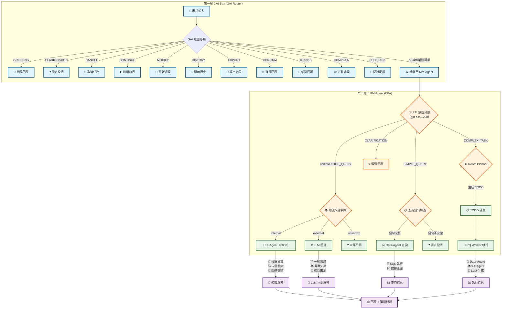
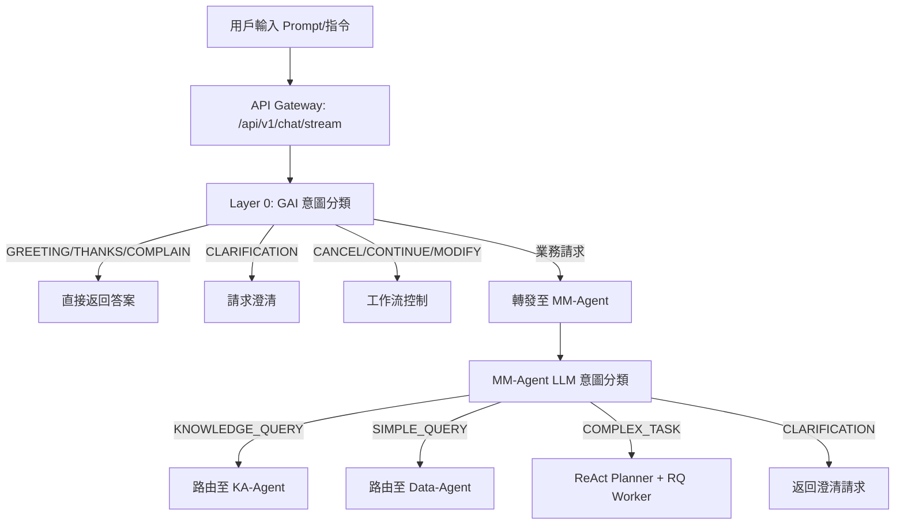

# AI-Box 最新語義與任務分析詳細說明

**代碼功能說明**: AI-Box 語義與任務分析系統的最新說明文件，基於 v4.3 架構，包含完整的兩層意圖分類架構（GAI 前端 + MM-Agent 業務處理）
**創建日期**: 2026-01-23
**創建人**: Daniel Chung
**最後修改日期**: 2026-02-09

版本：4.3

---

## 📋 文檔概述

本文檔基於《AI-Box語義與任務v4重構計劃.md》、《文件編輯Agent語義路由測試計劃-v4.md》等最新設計文檔，整理出 AI-Box 語義與任務分析系統的完整說明。

### 系統定位

AI-Box 語義與任務分析系統是一個 **Agent-first Enterprise AI Orchestration Platform**，負責將用戶的自然語言輸入轉換為結構化的任務執行。

AI-Box 作為**最高層 Orchestrator**，不做具體業務代理，只做決策協調。對於任務聊天室場景，優先路由到 MM-Agent 進行業務意圖分類。

### 核心架構

系統採用 **5層漸進式處理架構**（L1-L5），並新增 **兩層意圖分類** 機制：

```
┌─────────────────────────────────────────────────────────────┐
│ 第一層：AI-Box (GAI Router) - 前端意圖分類                    │
│ 職責：指代消解、語意完整性、對話管理                          │
│ 意圖：GREETING, CLARIFICATION, CANCEL, CONTINUE, MODIFY...   │
└─────────────────────────────────────────────────────────────┘
                            ↓
┌─────────────────────────────────────────────────────────────┐
│ 第二層：MM-Agent (BPA) - 業務意圖分類                        │
│ 職責：業務意圖判斷、分發到下游 Agent                          │
│ 意圖：KNOWLEDGE_QUERY, SIMPLE_QUERY, COMPLEX_TASK...         │
└─────────────────────────────────────────────────────────────┘
                            ↓
┌─────────────────────────────────────────────────────────────┐
│ L1: Semantic Understanding（語義理解）                        │
│ L2: Intent & Task Abstraction（意圖與任務抽象）               │
│ L3: Capability Mapping & Task Planning（能力映射與任務規劃）  │
│ L4: Constraint Validation & Policy Check（約束驗證與策略檢查）│
│ L5: Execution + Observation（執行與觀察）                    │
└─────────────────────────────────────────────────────────────┘
```

---

## 🔄 完整處理流程

### 兩層意圖分類架構



### 前端到後端完整流程



---

## 📊 兩層意圖分類詳細說明

### 第一層：AI-Box (GAI Router) 前端意圖

#### 職責定義

| 意圖類型 | 說明 | 處理方式 |
|----------|------|----------|
| GREETING | 問候/打招呼 | 直接回覆問候語，不執行任何操作 |
| CLARIFICATION | 需要澄清 | 返回澄清問題，不轉發 MM-Agent |
| CANCEL | 取消任務 | 終止當前任務，返回取消確認 |
| CONTINUE | 繼續執行 | 恢復並繼續之前的工作流 |
| MODIFY | 重新處理 | 重新執行之前的任務 |
| HISTORY | 顯示歷史 | 返回對話歷史記錄 |
| EXPORT | 導出結果 | 將結果導出為文件 |
| CONFIRM | 確認回覆 | 要求用戶確認後繼續 |
| THANKS | 感謝回覆 | 直接回覆感謝語 |
| COMPLAIN | 道歉處理 | 道歉並嘗試補救 |
| FEEDBACK | 記錄反饋 | 記錄用戶反饋到系統 |

#### 實現狀態

| 意圖類型 | 實現狀態 | 說明 |
|----------|----------|------|
| GREETING | ⚠️ 部分實現 | LLM 分類器已有，但 AI-Box 層未調用 |
| CLARIFICATION | ⚠️ 部分實現 | LLM 分類器已有，但 AI-Box 層未調用 |
| CANCEL | ❌ 未實現 | 需要工作流狀態管理 |
| CONTINUE | ⚠️ 部分實現 | MM-Agent 有實現，AI-Box 未整合 |
| 其他 | ❌ 未實現 | 需要開發 |

#### 當前問題

1. **測試用例標記為 "frontend_only"**：
   ```python
   # test_intent_classification_50.py
   {"id": "38", "input": "取消", "expected": "GREETING", "category": "GAI-MANAGE", "frontend_only": True}
   ```
   - 這些意圖應該由 AI-Box 第一層處理
   - 目前標記為 `frontend_only` 但 AI-Box 沒有實現

2. **需要實現的功能**：
   - 在 `api/routers/chat.py` 的 `_process_chat_request()` 中添加 GAI 意圖分類
   - 判斷為 GAI 意圖時直接返回，不轉發 MM-Agent
   - 判斷為業務意圖時轉發給 MM-Agent

### 第二層：MM-Agent (BPA) 業務意圖

#### 職責定義

| 意圖類型 | 說明 | 下游處理 |
|----------|------|----------|
| KNOWLEDGE_QUERY | 業務知識問題 | 路由至 KA-Agent |
| SIMPLE_QUERY | 簡單數據查詢 | 路由至 Data-Agent |
| COMPLEX_TASK | 複雜任務/操作指引 | ReAct Planner + RQ Worker |
| CLARIFICATION | 需要澄清 | 返回澄清問題 |

#### 知識來源判斷

| 來源類型 | 說明 | 處理方式 |
|----------|------|----------|
| internal | 公司內部知識 | KA-Agent 檢索內部知識庫 |
| external | 外部專業知識 | LLM 回退 + 上網搜尋 |
| unknown | 來源不明 | 請求澄清 |

#### 實現狀態

**MM-Agent 意圖分類端點**：`/home/daniel/ai-box/datalake-system/mm_agent/intent_endpoint.py`

| 端點 | 方法 | 狀態 |
|------|------|------|
| `/api/v1/chat/intent` | POST | ✅ 已實現 |
| `/api/v1/chat/intent` | GET | ✅ 已實現 |
| `/api/v1/chat/intent/stream` | POST | ✅ 已實現 |

#### 工作流繼續機制

MM-Agent 已實現 `CONTINUE_WORKFLOW` 意圖：

```python
# 檢查是否有進行中的工作流
if session_id in PENDING_WORKFLOWS:
    pending = PENDING_WORKFLOWS.pop(session_id)
    # 啟動工作流
    wf_result = await _react_engine.start_workflow(...)
    return {"intent": "CONTINUE_WORKFLOW", ...}
```

---

## 📊 各層級詳細說明

### L1: Semantic Understanding（語義理解）

#### 職責定義

回答「使用者說了什麼」，不回答「要做什麼」

#### 輸入

- 原始自然語言
- 最近對話摘要
- 系統模式（design/execution/sandbox）

#### 輸出 Schema

```json
{
  "topics": ["document", "system_design"],
  "entities": ["Document Editing Agent", "API Spec", "Patch Format"],
  "action_signals": ["design", "refine", "structure"],
  "modality": "instruction",
  "certainty": 0.92
}
```

#### 現有實現

**文件位置**: `agents/task_analyzer/router_llm.py`

**關鍵代碼**:

```python
class RouterDecision(BaseModel):
    intent_type: Literal["conversation", "retrieval", "analysis", "execution"]
    complexity: Literal["low", "mid", "high"]
    needs_agent: bool
    needs_tools: bool
    determinism_required: bool
    risk_level: Literal["low", "mid", "high"]
    confidence: float
```

**實現狀態**: ✅ 已實現（擴展版）

### L2: Intent & Task Abstraction（意圖與任務抽象）

#### 職責定義

將語義理解轉換為結構化意圖

#### Intent DSL 設計

```plain
INTENT modify_document {
  domain: "system_architecture"
  target: "Document Editing Agent"
  output_format: ["Engineering Spec"]
  depth: "Advanced"
}
```

#### 現有實現

**文件位置**: `agents/task_analyzer/intent_registry.py`（部分實現）

**實現狀態**: ⚠️ 部分實現（動態分類為主，DSL化計劃中）

### L3: Capability Mapping & Task Planning（能力映射與任務規劃）

#### 職責定義

發現可用能力並生成任務執行計劃

#### Capability Registry 設計

```json
{
  "agent": "DocumentEditingAgent",
  "capabilities": [
    {
      "name": "generate_patch_design",
      "input": "SemanticSpec",
      "output": "PatchPlan"
    }
  ],
  "constraints": {
    "environment": "design_only",
    "writes_system": false
  }
}
```

#### Task DAG 輸出

```json
{
  "task_graph": [
    { "id": "T1", "capability": "generate_patch_design" },
    { "id": "T2", "capability": "produce_openapi_spec", "depends_on": ["T1"] }
  ]
}
```

#### 現有實現

**文件位置**:

- `agents/task_analyzer/capability_matcher.py` ✅ 已實現
- `agents/task_analyzer/task_planner.py` ⚠️ 計劃中

**實現狀態**: 🟡 中等實現（Capability Matching 已實現，Task DAG 計劃中）

### L4: Constraint Validation & Policy Check（約束驗證與策略檢查）

#### 職責定義

驗證任務執行是否符合系統約束和策略

#### 驗證項目

- 權限檢查
- 風險評估
- 策略符合性
- 資源限制

#### 輸出格式

```json
{
  "allowed": true,
  "requires_confirmation": false,
  "risk_level": "low"
}
```

#### 現有實現

**文件位置**: `agents/task_analyzer/policy_service.py`（計劃中）

**實現狀態**: ❌ 未實現（計劃中）

### L5: Execution + Observation（執行與觀察）

#### 職責定義

執行任務並記錄執行指標

#### 記錄結構

```json
{
  "intent": "modify_document",
  "task_count": 2,
  "execution_success": true,
  "user_correction": false,
  "latency_ms": 4200
}
```

#### 知識庫權限管理（2026-02-03 新增）

**設計目標**：

1. **統一入口**: 所有知識庫檢索必須通過 KA-Agent
2. **權限控制**: Agent 需要通過 capabilities 標記獲得權限
3. **未來擴展**: 若檢索升級，只需修改 KA-Agent，其他 Agent 無需調整

**權限標識**：

| Capability 名稱 | 說明 | 授權對象 |
|-----------------|------|----------|
| `mm_agent_knowledge` | MM-Agent 知識庫訪問權限 | 需要訪問物料管理知識庫的 Agent |

**權限檢查流程**：

```
用戶選擇 Agent + 問題
    ↓
Task Analyzer 檢測知識查詢 (Knowledge Signal)
    ↓
Decision Engine 檢查權限
    ├─ 有權限 → 選擇用戶選擇的 Agent
    └─ 無權限 → 選擇 KA-Agent
    ↓
Agent 執行任務
    ├─ 有權限的 Agent → 調用 KA-Agent 檢索
    └─ KA-Agent → 直接檢索
    ↓
返回結果給用戶
```

**Decision Engine 權限檢查**：

**文件位置**: `agents/task_analyzer/decision_engine.py:594-647`

```python
# 檢查用戶選擇的 Agent 是否有知識庫權限
if is_knowledge_query and user_selected_agent_id:
    registry = get_agent_registry()
    user_agent_info = registry.get_agent_info(user_selected_agent_id)
  
    if user_agent_info:
        has_mm_knowledge = "mm_agent_knowledge" in user_agent_info.capabilities
  
        if has_mm_knowledge:
            # 用戶選擇的 Agent 有權限，直接使用該 Agent
            chosen_agent = user_selected_agent_id
            reasoning_parts.append(
                f"知識庫查詢任務，用戶選擇的 Agent '{user_selected_agent_id}' "
                f"有 MM-Agent 知識庫權限，優先使用該 Agent"
            )
```

**KA-Agent 權限檢查**：

**文件位置**: `agents/builtin/ka_agent/agent.py:554-598`

```python
# Agent 權限檢查（檢查是否有 MM-Agent 知識庫訪問權限）
if caller_agent_id:
    agent_info = registry.get_agent_info(caller_agent_id)
  
    if agent_info:
        capabilities = agent_info.capabilities or []
        has_mm_knowledge = "mm_agent_knowledge" in capabilities
  
        if not has_mm_knowledge:
            feedback = self._error_handler.permission_denied(
                user_id=caller_agent_id,
                action="知識庫檢索",
                resource="MM-Agent 知識庫",
                reason=f"Agent '{caller_agent_id}' 沒有 'mm_agent_knowledge' 能力"
            )
            return KAResponse(success=False, ...)
```

#### 現有實現

**文件位置**:

- `agents/services/orchestrator/orchestrator.py` ✅ 已實現
- `agents/services/observation_collector/` ✅ 已實現

**實現狀態**: ✅ 已實現

---

## 🔧 代碼流程盤點

### API 入口點

**文件**: `api/routers/chat.py`

**關鍵函數**: `chat_product_stream()`

```python
@router.post("/stream", status_code=status.HTTP_200_OK)
async def chat_product_stream(
    request_body: ChatRequest,
    request: Request,
    tenant_id: str = Depends(get_current_tenant_id),
    current_user: User = Depends(get_current_user),
) -> StreamingResponse:
    # 1. 獲取用戶輸入
    messages = [m.model_dump() for m in request_body.messages]
    last_user_text = messages[-1].get("content", "") if messages else ""
  
    # 2. 第一層 GAI 意圖分類（待實現）
    gai_intent = classify_gai_intent(last_user_text)
    if gai_intent in GAI_DIRECT_INTENTS:
        return direct_gai_response(gai_intent, last_user_text)
  
    # 3. 檢查快速路徑（時間查詢等）
    if self._check_quick_path(last_user_text, allowed_tools):
        return await self._handle_quick_path(last_user_text, allowed_tools)
  
    # 4. 判斷是否轉發給 MM-Agent
    if should_forward_to_mm_agent(last_user_text):
        return await self._forward_to_mm_agent(last_user_text, context)
  
    # 5. 調用 Task Analyzer
    analysis_result = await self._call_task_analyzer(last_user_text, context)
  
    # 6. 根據分析結果路由
    return await self._route_based_on_analysis(analysis_result, context)
```

### MM-Agent 意圖分類端點

**文件**: `datalake-system/mm_agent/main.py`

**關鍵函數**: `classify_intent()`

```python
@app.post("/api/v1/chat/intent")
async def classify_intent(request: ChatRequest) -> dict:
    """意圖分類端點

    流程：
    1. 檢查是否有進行中的工作流（session_id 存在且 waiting_for_user=True）
    2. 如果是延續對話，直接執行下一步
    3. 如果是新對話，進行意圖分類
    """
    from mm_agent.intent_endpoint import classify_intent as llm_classify_intent

    instruction = request.instruction
    session_id = request.session_id or f"intent-{id(request)}"

    # 檢查工作流狀態
    if session_id in PENDING_WORKFLOWS:
        # 繼續執行工作流
        ...
        return {"intent": "CONTINUE_WORKFLOW", ...}

    # 新對話，進行 LLM 意圖分類
    result = await llm_classify_intent(instruction, session_id)

    return {
        "success": True,
        "intent": result.intent.value,
        "confidence": result.confidence,
        "is_simple_query": result.is_simple_query,
        "needs_clarification": result.needs_clarification,
        ...
    }
```

### Task Analyzer 主流程

**文件**: `agents/task_analyzer/analyzer.py`

**關鍵函數**: `analyze()`

```python
async def analyze(self, request: TaskAnalysisRequest) -> TaskAnalysisResult:
    # Layer 0: Cheap Gating
    if self._is_simple_query(request.task):
        return await self._handle_simple_query(request, task_id)

    # Layer 1: Fast Answer Layer
    direct_answer_result = await self._try_direct_answer(request, task_id)
    if direct_answer_result:
        return direct_answer_result

    # Layer 2: Semantic Understanding (Router LLM)
    router_input = RouterInput(
        user_query=request.task,
        session_context=request.context or {},
        system_constraints=self.rule_override.get_system_constraints(request.task),
    )
    router_output = await self.router_llm.route(router_input, similar_decisions)

    # Layer 3: Rule Override
    router_output = self.rule_override.apply(router_output, request.task)

    # Layer 4: Capability Matching
    agent_candidates = await self.capability_matcher.match_agents(router_output)
    tool_candidates = await self.capability_matcher.match_tools(router_output)
    model_candidates = await self.capability_matcher.match_models(router_output)

    # Layer 5: Decision Engine
    decision = self.decision_engine.decide(
        router_output,
        agent_candidates,
        tool_candidates,
        model_candidates
    )

    # Layer 6: 返回結果
    return self._build_result(router_output, decision)
```

### MM-Agent 轉發機制（已有）

**文件**: `api/routers/chat.py` 第 1574 行

```python
# 2026-02-04 新增：如果是 mm-agent，直接調用 MM-Agent，跳過 Task Analyzer 和 RAG
if user_selected_agent_id == "mm-agent":
    # 構造 MM-Agent 請求
    from agents.services.registry.registry import get_agent_registry

    registry = get_agent_registry()
    agent_info = registry.get_agent_info("mm-agent")

    if agent_info and agent_info.endpoints and agent_info.endpoints.http:
        mm_endpoint = agent_info.endpoints.http
        mm_request = {
            "task_id": task_id or str(uuid.uuid4()),
            "task_type": "query_stock",
            "task_data": {
                "instruction": last_user_text,
                "user_id": current_user.user_id,
                "session_id": session_id,
            },
        }

        # 調用 MM-Agent
        import httpx
        response = httpx.post(mm_endpoint, json=mm_request, timeout=120.0)

        if response.status_code == 200:
            mm_result = response.json()
            return ChatResponse(content=f"【MM-Agent 查詢結果】\n{mm_result}")
```

---

## 🎯 關鍵組件狀態盤點

### 已實現組件

| 組件 | 文件位置 | 實現狀態 | 功能說明 |
|------|----------|----------|----------|
| Router LLM | `agents/task_analyzer/router_llm.py` | ✅ 完整實現 | 語義理解和路由決策 |
| Rule Override | `agents/task_analyzer/rule_override.py` | ✅ 完整實現 | 硬性規則覆蓋 |
| Capability Matcher | `agents/task_analyzer/capability_matcher.py` | ✅ 完整實現 | 能力匹配和評分 |
| Decision Engine | `agents/task_analyzer/decision_engine.py` | ✅ 完整實現 | 綜合決策 |
| Routing Memory | `agents/task_analyzer/routing_memory/` | ✅ 基礎實現 | 決策記憶 |
| Agent Orchestrator | `agents/services/orchestrator/orchestrator.py` | ✅ 完整實現 | Agent 協調執行 |
| Observation Collector | `agents/services/observation_collector/` | ✅ 完整實現 | 執行觀察 |
| MM-Agent Intent Endpoint | `datalake-system/mm_agent/intent_endpoint.py` | ✅ 完整實現 | BPA 意圖分類 |

### 待實現組件

| 組件 | 文件位置 | 實現狀態 | 功能說明 |
|------|----------|----------|----------|
| **GAI Intent Classifier** | `api/routers/chat.py` | ❌ 未實現 | **第一層前端意圖分類** |
| Intent Registry | `agents/task_analyzer/intent_registry.py` | 📅 階段一 | Intent DSL 管理 |
| Task Planner | `agents/task_analyzer/task_planner.py` | 📅 階段三 | DAG 生成 |
| Policy Service | `agents/task_analyzer/policy_service.py` | 📅 階段四 | 約束檢查 |

### 當前問題與待辦

| 問題 | 嚴重程度 | 狀態 | 解決方案 |
|------|----------|------|----------|
| 第一層 GAI 意圖未實現 | 🔴 高 | 待處理 | 在 chat.py 添加 GAI 意圖分類函數 |
| "frontend_only" 測試未通過 | 🟡 中 | 待處理 | 實現 GAI 意圖分類後這些測試應通過 |
| 工作流狀態管理不完整 | 🟡 中 | 待處理 | 完善 CANCEL/CONTINUE/MODIFY 處理 |
| AI-Box 轉發邏輯需優化 | 🟢 低 | 已有基礎 | 需更明確業務意圖轉發路徑 |

---

## 🔄 實際執行示例

### 示例 1：用戶問候

**用戶輸入**: "你好"

**處理流程**：

1. **第一層 AI-Box**: GAI 意圖分類判斷為 `GREETING`
2. **直接返回**: "您好！我是 AI-Box 助手，請問有什麼可以幫您？"
3. **不走 MM-Agent**

### 示例 2：用戶請求澄清

**用戶輸入**: "那個料號的品名是什麼？"

**處理流程**：

1. **第一層 AI-Box**: 檢測到指代詞"那個"，判斷為 `CLARIFICATION`
2. **直接返回**: "請問您說的是哪個料號？請提供完整的料號"
3. **不走 MM-Agent**

### 示例 3：用戶繼續工作流

**用戶輸入**: "是，繼續執行"

**處理流程**：

1. **第一層 AI-Box**: GAI 意圖分類判斷為 `CONTINUE`
2. **檢查工作流狀態**: 找到進行的中的工作流
3. **繼續執行**: 執行工作流下一步
4. **不走 MM-Agent**

### 示例 4：業務查詢（轉發 MM-Agent）

**用戶輸入**: "查詢料號 10-0001 的庫存"

**處理流程**：

1. **第一層 AI-Box**: GAI 意圖分類無法匹配（不是問候/取消等）
2. **轉發 MM-Agent**: 調用 `/api/v1/chat/intent`
3. **第二層 MM-Agent**: LLM 意圖分類判斷為 `SIMPLE_QUERY`
4. **路由 Data-Agent**: 執行 SQL 查詢
5. **返回結果**: "料號 10-0001 的庫存為 100 件"

### 示例 5：複雜任務（轉發 MM-Agent）

**用戶輸入**: "ABC 庫存分類分析"

**處理流程**：

1. **第一層 AI-Box**: GAI 意圖分類無法匹配
2. **轉發 MM-Agent**: 調用 `/api/v1/chat/intent`
3. **第二層 MM-Agent**: LLM 意圖分類判斷為 `COMPLEX_TASK`
4. **ReAct Planner**: 生成 TODO 計劃
5. **RQ Worker 執行**: 執行複雜分析
6. **返回結果**: ABC 分類結果報告

---

## 📊 性能指標

### 目標指標

| 指標 | 目標值 | 當前狀態 |
|------|--------|----------|
| 端到端響應時間 | ≤3秒（P95） | ✅ 已達成 |
| L1 層級響應時間 | ≤1秒（P95） | ✅ 已達成 |
| Intent 匹配準確率 | ≥90% | ✅ 已達成 |
| Capability 發現準確率 | ≥95% | 📅 計劃中 |
| 任務執行成功率 | ≥95% | ✅ 已達成 |

### 測試性能數據

**md-editor 場景測試**:

- 總場景數: 50
- 平均響應時間: 1004.05ms
- P95 響應時間: 1127.12ms
- Agent 調用成功率: 100%
- Agent 匹配率: 100%

---

## 🚀 未來發展方向

### 階段一：兩層意圖分類實現（進行中）

- ✅ MM-Agent BPA 意圖分類端點
- 📅 GAI 前端意圖分類實現
- 📅 統一意圖定義（GAI + BPA）
- 📅 轉發邏輯優化

### 階段二：L1-L2 層級重構

- ✅ Router LLM 輸出 Schema 擴展
- ✅ Intent DSL 匹配邏輯實現
- 📅 多模型 ensemble（可選）

### 階段三：L3 層級擴展

- 📅 Task Planner（DAG 生成）實現
- 📅 RAG-2 集成到 Planner
- 📅 Decision Engine 支持 DAG
- 📅 知識庫權限細粒度控制（擴展方向）

### 階段四：L4 層級實現

- 📅 Policy & Constraint Service 實現
- 📅 規則引擎集成
- 📅 RAG-3 策略檢索
- 📅 權限審計與監控

### 階段五：L5 層級完善

- 📅 執行指標記錄擴展
- 📅 命中率統計實現
- 📅 品質評估邏輯實現
- 📅 知識庫使用統計

### 階段六：集成測試與優化

- 📅 端到端集成測試
- 📅 性能測試和優化
- 📅 回歸測試

---

## 🔐 知識庫權限管理（2026-02-03 新增）

### 設計概述

為了滿足「統一知識庫入口，未來升級無需調整其他 Agent」的設計目標，系統實現了基於 Agent capabilities 的知識庫權限管理機制。

### 核心原則

1. **統一入口**: 所有知識庫檢索必須通過 KA-Agent
2. **權限控制**: Agent 需要通過 capabilities 標記獲得權限
3. **未來擴展**: 若檢索升級，只需修改 KA-Agent，其他 Agent 無需調整

### 權限標識

| Capability 名稱 | 說明 | 授權對象 |
|-----------------|------|----------|
| `mm_agent_knowledge` | MM-Agent 知識庫訪問權限 | 需要訪問物料管理知識庫的 Agent |

### 使用場景

#### 場景 1：有權限的 Agent

**前置條件**：

- 用戶選擇「經寶物料管理代理」
- 「經寶物料管理代理」的 capabilities 包含 `"mm_agent_knowledge"`

**用戶輸入**：

```
物料庫存怎樣？
```

**執行流程**：

1. Knowledge Signal 檢測到知識庫查詢
2. Decision Engine 檢查「經寶物料管理代理」有權限
3. 選擇「經寶物料管理代理」
4. 「經寶物料管理代理」調用 KA-Agent 檢索
5. KA-Agent 驗證權限並執行檢索
6. 「經寶物料管理代理」返回結果

#### 場景 2：無權限的 Agent

**前置條件**：

- 用戶選擇「某個無權限的 Agent」
- 該 Agent 的 capabilities 不包含 `"mm_agent_knowledge"`

**用戶輸入**：

```
物料庫存怎樣？
```

**執行流程**：

1. Knowledge Signal 檢測到知識庫查詢
2. Decision Engine 檢查「某個無權限的 Agent」無權限
3. 選擇 KA-Agent
4. KA-Agent 執行檢索
5. 返回結果

### 相關文檔

- [KA-Agent 授權管理文檔](./KA-Agent授權管理文檔.md) - 詳細的權限授予和管理說明
- [Agent Registry 說明](./Agent%20Registry%20說明.md) - Agent 註冊和 capabilities 管理

---

## 📚 參考文檔

### 設計文檔

- [AI-Box語義與任務v4重構計劃.md](./AI-Box語義與任務v4重構計劃.md)
- [AI-Box Enterprise GenAI Semantic & Task Orchestration.md](./AI-Box%20Enterprise%20GenAI%20Semantic%20&%20Task%20Orchestration.md)
- [可行性分析-AI-Box-Enterprise-GenAI-Semantic-Task-Orchestration.md](./可行性分析-AI-Box-Enterprise-GenAI-Semantic-Task-Orchestration.md)

### 實現文檔

- [GenAI 工作流指令-語義-工具-模型-Agent 等調用.md](./GenAI%20工作流指令-語義-工具-模型-Agent%20等調用.md)
- [Task Analyzer 細化開發規格.md](./Task-Analyzer-细化开发规格.md)

### 測試文檔

- [文件編輯Agent語義路由測試計劃-v4.md](./文件編輯Agent語義路由測試計劃-v4.md)
- [文件編輯Agent語義路由測試計劃-v3.md](./文件編輯Agent語義路由測試計劃-v3.md)

### 設計原則

- [語義意圖判斷vs關鍵詞匹配說明.md](./語義意圖判斷vs關鍵詞匹配說明.md)

### 核心組件文檔

- [Agent-意圖分類與業務處理架構.md](../Agent-意圖分類與業務處理架構.md) - BPA 意圖分類架構
- [前端及時同步回應.md](../前端及時同步回應.md) - 前端 WebSocket 同步機制

---

## 📝 更新記錄

| 日期 | 更新內容 | 更新人 |
|------|----------|--------|
| 2026-02-09 | v4.3：新增兩層意圖分類架構（GAI 前端 + MM-Agent 業務），更新流程圖，標註待實現功能 | Daniel Chung |
| 2026-02-03 | 新增知識庫權限管理機制，更新 L5 層級說明，添加使用場景 | Daniel Chung |
| 2026-01-23 | 創建最新版說明文件，基於 v4 架構整理完整流程和代碼盤點 | Daniel Chung |

---

## 📋 附錄：意圖分類對照表

### GAI 前端意圖（第一層 AI-Box）

| 意圖 | 英文 | 處理方式 | 狀態 |
|------|------|----------|------|
| 問候 | GREETING | 直接回覆問候 | ⚠️ 部分 |
| 澄清 | CLARIFICATION | 返回澄清問題 | ⚠️ 部分 |
| 取消 | CANCEL | 終止工作流 | ❌ 未 |
| 繼續 | CONTINUE | 恢復工作流 | ⚠️ 部分 |
| 修改 | MODIFY | 重新執行 | ❌ 未 |
| 歷史 | HISTORY | 返回歷史 | ❌ 未 |
| 導出 | EXPORT | 導出結果 | ❌ 未 |
| 確認 | CONFIRM | 請求確認 | ❌ 未 |
| 感謝 | THANKS | 回覆感謝 | ❌ 未 |
| 投訴 | COMPLAIN | 道歉處理 | ❌ 未 |
| 反饋 | FEEDBACK | 記錄反饋 | ❌ 未 |

### BPA 業務意圖（第二層 MM-Agent）

| 意圖 | 英文 | 下游處理 | 狀態 |
|------|------|----------|------|
| 知識查詢 | KNOWLEDGE_QUERY | KA-Agent | ✅ 已實現 |
| 簡單查詢 | SIMPLE_QUERY | Data-Agent | ✅ 已實現 |
| 複雜任務 | COMPLEX_TASK | ReAct Planner | ✅ 已實現 |
| 澄清 | CLARIFICATION | 返回問題 | ✅ 已實現 |
| 繼續工作流 | CONTINUE_WORKFLOW | 執行下一步 | ✅ 已實現 |

---

**文檔版本**: v4.3
**最後更新**: 2026-02-09
**維護人**: Daniel Chung
