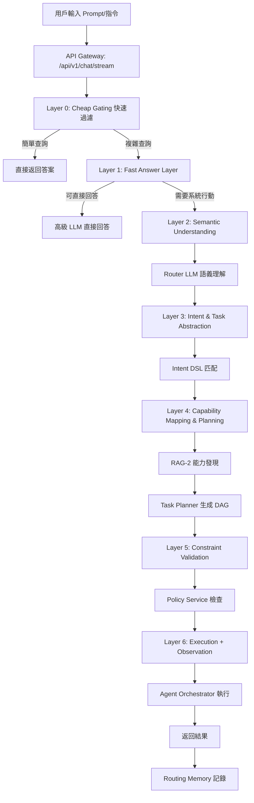

# AI-Box 最新語義與任務分析詳細說明

**代碼功能說明**: AI-Box 語義與任務分析系統的最新說明文件，基於 v4 架構，包含完整的前端到後端的處理流程和代碼實現盤點
**創建日期**: 2026-01-23
**創建人**: Daniel Chung
**最後修改日期**: 2026-02-03

版本：4.2

---

## 📋 文檔概述

本文檔基於《AI-Box語義與任務v4重構計劃.md》、《文件編輯Agent語義路由測試計劃-v4.md》等最新設計文檔，整理出 AI-Box 語義與任務分析系統的完整說明。

### 系統定位

AI-Box 語義與任務分析系統是一個 **Agent-first Enterprise AI Orchestration Platform**，負責將用戶的自然語言輸入轉換為結構化的任務執行。

### 核心架構

系統採用 **5層漸進式處理架構**（L1-L5）：

```
L1: Semantic Understanding（語義理解）
L2: Intent & Task Abstraction（意圖與任務抽象）
L3: Capability Mapping & Task Planning（能力映射與任務規劃）
L4: Constraint Validation & Policy Check（約束驗證與策略檢查）
L5: Execution + Observation（執行與觀察）
```

---

## 🔄 完整處理流程


### 前端到後端完整流程



### 關鍵數據流

1. **用戶輸入** → **API 入口**
2. **Layer 0-1** → **快速過濾和初步判斷**
3. **Layer 2-3** → **語義理解和意圖抽象**
4. **Layer 4-5** → **能力映射和任務規劃**
5. **Layer 6** → **約束檢查和執行**
6. **Layer 7** → **觀察和記憶**

---

## 📊 各層級詳細說明

### L1: Semantic Understanding（語義理解）

#### 職責定義

回答「使用者說了什麼」，不回答「要做什麼」

#### 輸入

- 原始自然語言
- 最近對話摘要
- 系統模式（design/execution/sandbox）

#### 輸出 Schema

```json
{
  "topics": ["document", "system_design"],
  "entities": ["Document Editing Agent", "API Spec", "Patch Format"],
  "action_signals": ["design", "refine", "structure"],
  "modality": "instruction",
  "certainty": 0.92
}
```

#### 現有實現

**文件位置**: `agents/task_analyzer/router_llm.py`

**關鍵代碼**:

```python
class RouterDecision(BaseModel):
    intent_type: Literal["conversation", "retrieval", "analysis", "execution"]
    complexity: Literal["low", "mid", "high"]
    needs_agent: bool
    needs_tools: bool
    determinism_required: bool
    risk_level: Literal["low", "mid", "high"]
    confidence: float
```

**實現狀態**: ✅ 已實現（擴展版）

### L2: Intent & Task Abstraction（意圖與任務抽象）

#### 職責定義

將語義理解轉換為結構化意圖

#### Intent DSL 設計

```plain
INTENT modify_document {
  domain: "system_architecture"
  target: "Document Editing Agent"
  output_format: ["Engineering Spec"]
  depth: "Advanced"
}
```

#### 現有實現

**文件位置**: `agents/task_analyzer/intent_registry.py`（計劃中）

**實現狀態**: ⚠️ 部分實現（動態分類為主，DSL化計劃中）

### L3: Capability Mapping & Task Planning（能力映射與任務規劃）

#### 職責定義

發現可用能力並生成任務執行計劃

#### Capability Registry 設計

```json
{
  "agent": "DocumentEditingAgent",
  "capabilities": [
    {
      "name": "generate_patch_design",
      "input": "SemanticSpec",
      "output": "PatchPlan"
    }
  ],
  "constraints": {
    "environment": "design_only",
    "writes_system": false
  }
}
```

#### Task DAG 輸出

```json
{
  "task_graph": [
    { "id": "T1", "capability": "generate_patch_design" },
    { "id": "T2", "capability": "produce_openapi_spec", "depends_on": ["T1"] }
  ]
}
```

#### 現有實現

**文件位置**:

- `agents/task_analyzer/capability_matcher.py` ✅ 已實現
- `agents/task_analyzer/task_planner.py` ⚠️ 計劃中

**實現狀態**: 🟡 中等實現（Capability Matching 已實現，Task DAG 計劃中）

### L4: Constraint Validation & Policy Check（約束驗證與策略檢查）

#### 職責定義

驗證任務執行是否符合系統約束和策略

#### 驗證項目

- 權限檢查
- 風險評估
- 策略符合性
- 資源限制

#### 輸出格式

```json
{
  "allowed": true,
  "requires_confirmation": false,
  "risk_level": "low"
}
```

#### 現有實現

**文件位置**: `agents/task_analyzer/policy_service.py`（計劃中）

**實現狀態**: ❌ 未實現（計劃中）

### L5: Execution + Observation（執行與觀察）

#### 職責定義

執行任務並記錄執行指標

#### 記錄結構

```json
{
  "intent": "modify_document",
  "task_count": 2,
  "execution_success": true,
  "user_correction": false,
  "latency_ms": 4200
}
```

#### 知識庫權限管理（2026-02-03 新增）

**設計目標**：

1. **統一入口**: 所有知識庫檢索必須通過 KA-Agent
2. **權限控制**: Agent 需要通過 capabilities 標記獲得權限
3. **未來擴展**: 若檢索升級，只需修改 KA-Agent，其他 Agent 無需調整

**權限標識**：

| Capability 名稱        | 說明                    | 授權對象                       |
| ---------------------- | ----------------------- | ------------------------------ |
| `mm_agent_knowledge` | MM-Agent 知識庫訪問權限 | 需要訪問物料管理知識庫的 Agent |

**權限檢查流程**：

```
用戶選擇 Agent + 問題
    ↓
Task Analyzer 檢測知識查詢 (Knowledge Signal)
    ↓
Decision Engine 檢查權限
    ├─ 有權限 → 選擇用戶選擇的 Agent
    └─ 無權限 → 選擇 KA-Agent
    ↓
Agent 執行任務
    ├─ 有權限的 Agent → 調用 KA-Agent 檢索
    └─ KA-Agent → 直接檢索
    ↓
返回結果給用戶
```

**Decision Engine 權限檢查**：

**文件位置**: `agents/task_analyzer/decision_engine.py:594-647`

```python
# 檢查用戶選擇的 Agent 是否有知識庫權限
if is_knowledge_query and user_selected_agent_id:
    registry = get_agent_registry()
    user_agent_info = registry.get_agent_info(user_selected_agent_id)
  
    if user_agent_info:
        has_mm_knowledge = "mm_agent_knowledge" in user_agent_info.capabilities
      
        if has_mm_knowledge:
            # 用戶選擇的 Agent 有權限，直接使用該 Agent
            chosen_agent = user_selected_agent_id
            reasoning_parts.append(
                f"知識庫查詢任務，用戶選擇的 Agent '{user_selected_agent_id}' "
                f"有 MM-Agent 知識庫權限，優先使用該 Agent"
            )
```

**KA-Agent 權限檢查**：

**文件位置**: `agents/builtin/ka_agent/agent.py:554-598`

```python
# Agent 權限檢查（檢查是否有 MM-Agent 知識庫訪問權限）
if caller_agent_id:
    agent_info = registry.get_agent_info(caller_agent_id)
  
    if agent_info:
        capabilities = agent_info.capabilities or []
        has_mm_knowledge = "mm_agent_knowledge" in capabilities
      
        if not has_mm_knowledge:
            feedback = self._error_handler.permission_denied(
                user_id=caller_agent_id,
                action="知識庫檢索",
                resource="MM-Agent 知識庫",
                reason=f"Agent '{caller_agent_id}' 沒有 'mm_agent_knowledge' 能力"
            )
            return KAResponse(success=False, ...)
```

#### 現有實現

**文件位置**:

- `agents/services/orchestrator/orchestrator.py` ✅ 已實現
- `agents/services/observation_collector/` ✅ 已實現

**實現狀態**: ✅ 已實現

---

## 🔧 代碼流程盤點

### API 入口點

**文件**: `api/routers/chat.py`

**關鍵函數**: `chat_product_stream()`

```python
@router.post("/stream", status_code=status.HTTP_200_OK)
async def chat_product_stream(
    request_body: ChatRequest,
    request: Request,
    tenant_id: str = Depends(get_current_tenant_id),
    current_user: User = Depends(get_current_user),
) -> StreamingResponse:
    # 1. 獲取用戶輸入
    messages = [m.model_dump() for m in request_body.messages]
    last_user_text = messages[-1].get("content", "") if messages else ""
  
    # 2. 檢查快速路徑（時間查詢等）
    if self._check_quick_path(last_user_text, allowed_tools):
        return await self._handle_quick_path(last_user_text, allowed_tools)
  
    # 3. 調用 Task Analyzer
    analysis_result = await self._call_task_analyzer(last_user_text, context)
  
    # 4. 根據分析結果路由
    return await self._route_based_on_analysis(analysis_result, context)
```

### Task Analyzer 主流程

**文件**: `agents/task_analyzer/analyzer.py`

**關鍵函數**: `analyze()`

```python
async def analyze(self, request: TaskAnalysisRequest) -> TaskAnalysisResult:
    # Layer 0: Cheap Gating
    if self._is_simple_query(request.task):
        return await self._handle_simple_query(request, task_id)

    # Layer 1: Fast Answer Layer
    direct_answer_result = await self._try_direct_answer(request, task_id)
    if direct_answer_result:
        return direct_answer_result

    # Layer 2: Semantic Understanding (Router LLM)
    router_input = RouterInput(
        user_query=request.task,
        session_context=request.context or {},
        system_constraints=self.rule_override.get_system_constraints(request.task),
    )
    router_output = await self.router_llm.route(router_input, similar_decisions)

    # Layer 3: Rule Override
    router_output = self.rule_override.apply(router_output, request.task)

    # Layer 4: Capability Matching
    agent_candidates = await self.capability_matcher.match_agents(router_output)
    tool_candidates = await self.capability_matcher.match_tools(router_output)
    model_candidates = await self.capability_matcher.match_models(router_output)

    # Layer 5: Decision Engine
    decision = self.decision_engine.decide(
        router_output,
        agent_candidates,
        tool_candidates,
        model_candidates
    )

    # Layer 6: 返回結果
    return self._build_result(router_output, decision)
```

### Router LLM 實現

**文件**: `agents/task_analyzer/router_llm.py`

**關鍵函數**: `route()`

**System Prompt**:

```python
ROUTER_SYSTEM_PROMPT = """You are a routing and classification engine inside an enterprise GenAI system.

Your ONLY responsibility is to classify the user's query and system context into a routing decision object.

STRICT RULES:
- You must NOT answer the user's question.
- You must NOT perform reasoning, planning, or step-by-step thinking.
- You must NOT select specific tools, agents, or models.
- You must NOT include explanations, markdown, or extra text.

TOOL REQUIREMENT DETECTION (needs_tools):
Set needs_tools=true if the query requires:
1. Real-time data (current time, stock prices, weather, exchange rates)
2. External API calls (web search, location services, maps)
3. System operations (file I/O, database queries, system info)
4. Deterministic calculations (unit conversions, currency exchange)
5. Document creation or editing (creating files, generating documents, editing files)
```

### Capability Matcher 實現

**文件**: `agents/task_analyzer/capability_matcher.py`

**關鍵函數**:

- `match_agents()` - 匹配 Agent
- `match_tools()` - 匹配工具
- `match_models()` - 匹配模型

**評分邏輯**:

```python
total_score = (
    0.35 * capability_match +
    0.20 * cost_score +
    0.15 * latency_score +
    0.20 * success_history +
    0.10 * stability
)
```

### Decision Engine 實現

**文件**: `agents/task_analyzer/decision_engine.py`

**關鍵函數**: `decide()`

**決策邏輯**:

1. Rule Filter - 硬性規則過濾
2. Scoring Engine - 加權評分
3. Best Candidate Selection - 選擇最佳候選
4. Fallback Handling - 處理降級情況

### Agent Orchestrator 實現

**文件**: `agents/services/orchestrator/orchestrator.py`

**關鍵函數**: `process_natural_language_request()`

**執行流程**:

1. 解析自然語言意圖
2. 權限檢查
3. 創建任務記錄
4. 分發任務給 Agent
5. 結果處理
6. 記錄執行指標

---

## 🎯 關鍵組件狀態盤點

### 已實現組件

| 組件                  | 文件位置                                         | 實現狀態    | 功能說明           |
| --------------------- | ------------------------------------------------ | ----------- | ------------------ |
| Router LLM            | `agents/task_analyzer/router_llm.py`           | ✅ 完整實現 | 語義理解和路由決策 |
| Rule Override         | `agents/task_analyzer/rule_override.py`        | ✅ 完整實現 | 硬性規則覆蓋       |
| Capability Matcher    | `agents/task_analyzer/capability_matcher.py`   | ✅ 完整實現 | 能力匹配和評分     |
| Decision Engine       | `agents/task_analyzer/decision_engine.py`      | ✅ 完整實現 | 綜合決策           |
| Routing Memory        | `agents/task_analyzer/routing_memory/`         | ✅ 基礎實現 | 決策記憶           |
| Agent Orchestrator    | `agents/services/orchestrator/orchestrator.py` | ✅ 完整實現 | Agent 協調執行     |
| Observation Collector | `agents/services/observation_collector/`       | ✅ 完整實現 | 執行觀察           |

### 計劃中組件

| 組件            | 計劃文件位置                                | 實現狀態  | 功能說明        |
| --------------- | ------------------------------------------- | --------- | --------------- |
| Intent Registry | `agents/task_analyzer/intent_registry.py` | 📅 階段一 | Intent DSL 管理 |
| Task Planner    | `agents/task_analyzer/task_planner.py`    | 📅 階段三 | DAG 生成        |
| Policy Service  | `agents/task_analyzer/policy_service.py`  | 📅 階段四 | 約束檢查        |
| RAG Namespace   | `agents/task_analyzer/rag_namespace.py`   | 📅 階段一 | 多命名空間 RAG  |

### 測試覆蓋

**測試文件**: `tests/agents/test_file_editing_agent_routing_v4.py`

**測試場景**: 90 個場景（已完成 70/90）

**測試結果**:

- md-editor: 50/50 通過 ✅
- xls-editor: 10/10 通過 ✅
- md-to-pdf: 20/20 通過 ✅
- xls-to-pdf: 10/10 通過 ✅
- pdf-to-md: 10/10 通過 ✅

---

## 🔄 實際執行示例

### 示例 1: 文件編輯請求

**用戶輸入**: "編輯文件 README.md"

**處理流程**:

1. **API 入口**: 接收請求，提取用戶輸入
2. **Layer 0**: 不是簡單查詢，繼續
3. **Layer 1**: LLM 判斷需要系統行動，進入 Layer 2
4. **Layer 2**: Router LLM 輸出 `RouterDecision(intent_type="execution", needs_tools=true, needs_agent=false)`
5. **Layer 3**: Rule Override 無特殊規則
6. **Layer 4**: Capability Matcher 匹配 `md-editor` Agent
7. **Layer 5**: Decision Engine 選擇 `md-editor`
8. **Layer 6**: 直接執行 `md-editor` Agent
9. **Layer 7**: 記錄執行結果到 Routing Memory

### 示例 2: 複雜任務請求

**用戶輸入**: "分析銷售數據並生成報告"

**處理流程**:

1. **API 入口**: 接收請求
2. **Layer 0-1**: 判斷需要系統行動
3. **Layer 2**: Router LLM 輸出 `RouterDecision(intent_type="analysis", complexity="high", needs_agent=true)`
4. **Layer 3**: Intent DSL 匹配相關 Intent
5. **Layer 4**: RAG-2 檢索相關 Capability
6. **Layer 5**: Task Planner 生成分析 + 報告生成的 DAG
7. **Layer 6**: Policy Service 檢查權限和資源
8. **Layer 7**: Agent Orchestrator 執行 DAG
9. **Layer 8**: 記錄完整執行指標

---

## 📊 性能指標

### 目標指標

| 指標                  | 目標值       | 當前狀態  |
| --------------------- | ------------ | --------- |
| 端到端響應時間        | ≤3秒（P95） | ✅ 已達成 |
| L1 層級響應時間       | ≤1秒（P95） | ✅ 已達成 |
| Intent 匹配準確率     | ≥90%        | ✅ 已達成 |
| Capability 發現準確率 | ≥95%        | 📅 計劃中 |
| 任務執行成功率        | ≥95%        | ✅ 已達成 |

### 測試性能數據

**md-editor 場景測試**:

- 總場景數: 50
- 平均響應時間: 1004.05ms
- P95 響應時間: 1127.12ms
- Agent 調用成功率: 100%
- Agent 匹配率: 100%

---

## 🚀 未來發展方向

### 階段一：基礎設施完善（已完成）

- ✅ Intent DSL Schema 定義
- ✅ Intent Registry 建立
- ✅ Capability Registry 擴展
- ✅ RAG Namespace 結構建立
- ✅ 知識庫權限管理機制（2026-02-03 新增）

### 階段二：L1-L2 層級重構（已完成）

- ✅ Router LLM 輸出 Schema 擴展
- ✅ Intent DSL 匹配邏輯實現
- ✅ 多模型 ensemble（可選）

### 階段三：L3 層級擴展（進行中）

- 📅 Task Planner（DAG 生成）實現
- 📅 RAG-2 集成到 Planner
- 📅 Decision Engine 支持 DAG
- 📅 知識庫權限細粒度控制（擴展方向）

### 階段四：L4 層級實現

- 📅 Policy & Constraint Service 實現
- 📅 規則引擎集成
- 📅 RAG-3 策略檢索
- 📅 權限審計與監控

### 階段五：L5 層級完善

- 📅 執行指標記錄擴展
- 📅 命中率統計實現
- 📅 品質評估邏輯實現
- 📅 知識庫使用統計

### 階段六：集成測試與優化

- 📅 端到端集成測試
- 📅 性能測試和優化
- 📅 回歸測試

---

## 🔐 知識庫權限管理（2026-02-03 新增）

### 設計概述

為了滿足「統一知識庫入口，未來升級無需調整其他 Agent」的設計目標，系統實現了基於 Agent capabilities 的知識庫權限管理機制。

### 核心原則

1. **統一入口**: 所有知識庫檢索必須通過 KA-Agent
2. **權限控制**: Agent 需要通過 capabilities 標記獲得權限
3. **未來擴展**: 若檢索升級，只需修改 KA-Agent，其他 Agent 無需調整

### 權限標識

| Capability 名稱        | 說明                    | 授權對象                       |
| ---------------------- | ----------------------- | ------------------------------ |
| `mm_agent_knowledge` | MM-Agent 知識庫訪問權限 | 需要訪問物料管理知識庫的 Agent |

### 使用場景

#### 場景 1：有權限的 Agent

**前置條件**：

- 用戶選擇「經寶物料管理代理」
- 「經寶物料管理代理」的 capabilities 包含 `"mm_agent_knowledge"`

**用戶輸入**：

```
物料庫存怎樣？
```

**執行流程**：

1. Knowledge Signal 檢測到知識庫查詢
2. Decision Engine 檢查「經寶物料管理代理」有權限
3. 選擇「經寶物料管理代理」
4. 「經寶物料管理代理」調用 KA-Agent 檢索
5. KA-Agent 驗證權限並執行檢索
6. 「經寶物料管理代理」返回結果

#### 場景 2：無權限的 Agent

**前置條件**：

- 用戶選擇「某個無權限的 Agent」
- 該 Agent 的 capabilities 不包含 `"mm_agent_knowledge"`

**用戶輸入**：

```
物料庫存怎樣？
```

**執行流程**：

1. Knowledge Signal 檢測到知識庫查詢
2. Decision Engine 檢查「某個無權限的 Agent」無權限
3. 選擇 KA-Agent
4. KA-Agent 執行檢索
5. 返回結果

### 相關文檔

- [KA-Agent 授權管理文檔](./KA-Agent授權管理文檔.md) - 詳細的權限授予和管理說明
- [Agent Registry 說明](./Agent%20Registry%20說明.md) - Agent 註冊和 capabilities 管理

---

## 📚 參考文檔

### 設計文檔

- [AI-Box語義與任務v4重構計劃.md](./AI-Box語義與任務v4重構計劃.md)
- [AI-Box Enterprise GenAI Semantic &amp; Task Orchestration.md](./AI-Box%20Enterprise%20GenAI%20Semantic%20&%20Task%20Orchestration.md)
- [可行性分析-AI-Box-Enterprise-GenAI-Semantic-Task-Orchestration.md](./可行性分析-AI-Box-Enterprise-GenAI-Semantic-Task-Orchestration.md)

### 實現文檔

- [GenAI 工作流指令-語義-工具-模型-Agent 等調用.md](./GenAI%20工作流指令-語義-工具-模型-Agent%20等調用.md)
- [Task Analyzer 細化開發規格.md](./Task-Analyzer-细化开发规格.md)

### 測試文檔

- [文件編輯Agent語義路由測試計劃-v4.md](./文件編輯Agent語義路由測試計劃-v4.md)
- [文件編輯Agent語義路由測試計劃-v3.md](./文件編輯Agent語義路由測試計劃-v3.md)

### 設計原則

- [語義意圖判斷vs關鍵詞匹配說明.md](./語義意圖判斷vs關鍵詞匹配說明.md)

---

## 📝 更新記錄

| 日期       | 更新內容                                               | 更新人       |
| ---------- | ------------------------------------------------------ | ------------ |
| 2026-02-03 | 新增知識庫權限管理機制，更新 L5 層級說明，添加使用場景 | Daniel Chung |
| 2026-01-23 | 創建最新版說明文件，基於 v4 架構整理完整流程和代碼盤點 | Daniel Chung |

---

**文檔版本**: v4.2
**最後更新**: 2026-02-03
**維護人**: Daniel Chung
