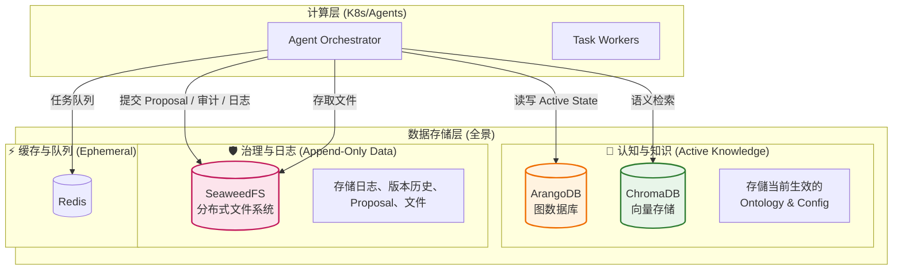

# 架构建议报告：数据存储与治理层

**创建日期**: 2025-12-29
**最后修改日期**: 2025-12-30
**关联文档**: [系统设计文档](./README.md)

---

## 📋 报告概述

本报告针对 AI-Box 系统的**数据存储架构**提出演进建议。基于目前的架构（ArangoDB + ChromaDB + Redis），建议引入 **SeaweedFS** 以完善「治理层」与「非结构化数据存储」能力，构建更稳健的企业级 AI 平台。

**重要决策**：经过分析，决定**不引入 PostgreSQL**，原因如下：

- 审计日志和系统日志是 Append-Only 模式，适合存储在 SeaweedFS
- 版本历史和变更提案也是 Append-Only 模式，适合文件存储
- 系统设置 JSON 需要频繁 CRUD 操作，保留在 ArangoDB 更合适
- 简化架构，减少运维复杂度

---

## 🎯 核心结论

1. **引入 SeaweedFS**：作为**统一对象存储 (Unified Object Storage)** 和**治理数据存储**。
   - **用途**：
     - 存储用户上传的文件、RAG 原始文档、生成的报告 (HTML/PDF)
     - 存储审计日志、系统日志（Append-Only 模式）
     - 存储版本历史记录和变更提案（Append-Only 模式）
     - 存储 DataLake dictionary 和 schema 定义
   - **价值**：
     - 替代本地文件系统，支持 Kubernetes 环境下的弹性扩展与高可用
     - 提供标准的 S3 兼容接口
     - 适合处理大量小文件（日志文件）
     - 支持多副本和分片存储，确保数据的高可用性
     - 简化架构，不需要额外的 PostgreSQL 数据库

2. **保留 ArangoDB 的职责**：专注于 Active State 数据。
   - **用途**：存储当前生效的配置、知识图谱、Ontology 定义
   - **价值**：发挥 ArangoDB 在图数据库和文档数据库方面的优势

### 專案架構說明

**重要**：未來 **DataLake** 將是獨立於 AI-Box 的專案，但在 AI-Box workspace 中會包含兩個 project：

1. **AI-Box**：現有的 AI-Box 專案
2. **DataLake**：獨立的 DataLake 專案

**SeaweedFS 雙服務部署架構**：

SeaweedFS 將部署兩個獨立的服務實例，分別服務於不同的專案需求：

#### AI-Box 專案內的 SeaweedFS 服務

**主要用途**：存放 AI-Box 專案內的非結構化數據

**存儲內容**：

- **治理相關日誌**：
  - 審計日誌（Append-Only）
  - 系統日誌（Append-Only）
- **版本歷史記錄**：配置和 Ontology 的歷史版本（Append-Only）
- **變更提案**：變更提案記錄（Append-Only）
- **DataLake 元數據**：
  - Data Agent 保存的 DataLake dictionary 定義
  - Data Agent 保存的 DataLake schema 定義
  - **注意**：目前這些數據保存在 ArangoDB 中，未來需要遷移到 SeaweedFS
- **AI-Box 專案其他非結構化數據**

**不存儲在 SeaweedFS 的數據**：

- ❌ **系統設置 JSON**：需要頻繁 CRUD 操作，保留在 ArangoDB（`system_configs` / `tenant_configs` / `user_configs`）

#### DataLake 專案內的 SeaweedFS 服務

**主要用途**：文件備份

**存儲內容**：

- 文件備份數據
- DataLake 專案相關的存儲需求

**架構優勢**：

- ✅ **職責分離**：AI-Box 和 DataLake 各自管理自己的存儲
- ✅ **獨立擴展**：兩個服務可以根據各自需求獨立擴展
- ✅ **數據隔離**：避免兩個專案之間的數據混雜
- ✅ **靈活部署**：可以根據實際需求選擇不同的部署策略

---

## 🏗️ 建议架构演进 (Data Layer Evolution)

### 演进后数据层拓扑

### 整體AI-Box實際資料存儲規劃

---

## 💡 深度解析：为何选择 SeaweedFS 存储日志和版本历史？

经过分析，决定将治理数据（日志、版本历史、变更提案）存储在 SeaweedFS 而非 PostgreSQL，原因如下：

### 1. 治理数据的特性适配

治理数据（Proposal, History, Audit）具有 **Append-Only** 特性，非常适合文件存储：

- **审计日志**：只追加写入，很少更新或删除
- **系统日志**：只追加写入，按时间分片存储
- **版本历史**：只追加写入，每次变更创建新版本文件
- **变更提案**：创建后很少修改，主要是状态更新

### 2. SeaweedFS 的优势

- **适合大量小文件**：日志文件通常是小文件，SeaweedFS 专门优化了此类场景
- **按时间分片存储**：可以按天/月分片（`logs/audit/2025/12/29.jsonl`），查询时快速定位
- **成本效益**：存储成本低于关系型数据库
- **生命周期管理**：支持自动清理旧日志，降低维护成本

### 3. 架构简化

- **不需要 PostgreSQL**：减少一个数据库系统，降低运维复杂度
- **职责分离更清晰**：
  - **ArangoDB**：专注于 Active State 数据（知识图谱、当前生效的配置）
  - **SeaweedFS**：专注于 Append-Only 数据（日志、版本历史）和非结构化文件
- **系统设置保留在 ArangoDB**：因为需要频繁的 CRUD 操作和复杂查询

---

## 💡 深度解析：为何需要 SeaweedFS？

目前的架构图中提及了 "FileStorage"，但在 Kubernetes 环境下，直接使用本地文件系统 (Local FS) 会带来巨大的扩展性问题。

### 1. 无状态化 (Statelessness) 与 K8s 亲和性

- **问题**：如果文件存在 Pod 的本地路径，当 Pod 重启或漂移到另一台节点时，文件就丢失了。使用 PVC (Persistent Volume Claim) 虽可解决，但管理复杂且难以跨节点共享。
- **解决**：SeaweedFS 将存储与计算解耦。所有 Agent 无论在哪个节点运行，都通过标准的 HTTP (S3 API 或 Filer API) 存取文件。这使得系统可以确信地实现**弹性伸缩**。

### 2. 统一非结构化数据管理

AI-Box 会产生多种类型的非结构化数据：

- **RAG 源文件**：用户上传的 PDF/Word/Excel。
- **Agent 产出物**：生成的 HTML 报告、Markdown 草稿、图表图片。
- **系统资产**：微调后的 LoRA 权重、Prompts 版本快照。
  SeaweedFS 为这些异构数据提供了一个统一的、版本化的存储池。

### 3. 高性能分布式存储

SeaweedFS 是一个高效的分布式文件系统，特别适合处理大量小文件：

- **Master-Volume 架构**：分离元数据和数据存储，提高性能
- **多副本和分片**：确保数据高可用性和容错能力
- **S3 兼容 API**：可以使用标准的 boto3 库，无需额外适配
- **Filer 接口**：提供文件系统接口，支持目录结构管理

### 4. 分层存储能力

SeaweedFS 支持生命周期管理，可以自动将旧的日志或临时文件迁移到更廉价的存储（如果未来部署在云端）或直接删除，降低长期维护成本。

---

## ✅ 实施建议 roadmap

### Phase 1: 基础设施就绪 (Infrastructure Ready)

1. **部署 SeaweedFS（雙服務架構）**：
   - **AI-Box 專案 SeaweedFS**：
     - 在 K8s 集群中部署 SeaweedFS 集群（Master + Volume + Filer）
     - 启用 S3 API 支持
     - 创建 Buckets：
       - `bucket-governance-logs`：治理相關日誌（審計日誌、系統日誌）
       - `bucket-version-history`：版本歷史記錄
       - `bucket-change-proposals`：變更提案記錄
       - `bucket-datalake-dictionary`：DataLake dictionary 定義
       - `bucket-datalake-schema`：DataLake schema 定義
       - `bucket-ai-box-assets`：AI-Box 專案其他非結構化數據
   - **DataLake 專案 SeaweedFS**：
     - 在 K8s 集群中部署獨立的 SeaweedFS 集群（Master + Volume + Filer）
     - 启用 S3 API 支持
     - 创建 Buckets：`bucket-file-backups`, `bucket-datalake-assets`
2. **配置管理**：更新系统环境变量，配置兩個 SeaweedFS S3 Endpoint（AI-Box 和 DataLake）。

### Phase 2: 治理层接入 (Governance Integration)

1. **Audit Logging**：修改 Orchestrator，将所有关键操作日志写入 SeaweedFS（JSON Lines 格式，按时间分片）。
2. **Change Proposal 机制**：实现 "Proposal Flow"，AI 修改 Config/Ontology 前先生成 Proposal 存入 SeaweedFS，审批通过后再写入 ArangoDB。
3. **版本历史记录**：实现版本历史服务，将配置和 Ontology 的变更历史存储在 SeaweedFS。

### Phase 3: 存储层迁移 (Storage Migration)

1. **文件服务改造**：将目前的本地文件读写逻辑重构为 S3 SDK 调用（使用 boto3 连接 SeaweedFS S3 API）。
2. **RAG 流程更新**：文件上传后直接存入 SeaweedFS，ChromaDB 仅存储向量与 SeaweedFS URI 的引用，不再存储大量文本 Payload（可选优化）。

---

## 📝 总结

引入 **SeaweedFS** 是 AI-Box 从「原型」迈向「企业级产品」的关键一步。它解决了**「规则与秩序」 (Governance)** 和**「资产管理」 (Assets)** 的问题，让 ArangoDB 和 ChromaDB 更专注于它们最擅长的**「认知与推理」**工作。

**架构优势**：

- ✅ **职责分离**：
  - **ArangoDB**：专注于 Active State 数据（知识图谱、当前生效的配置）
  - **SeaweedFS**：专注于 Append-Only 数据（日志、版本历史）和非结构化文件
- ✅ **架构简化**：不需要 PostgreSQL，减少运维复杂度
- ✅ **成本效益**：SeaweedFS 存储成本低于关系型数据库
- ✅ **高性能**：SeaweedFS 作为高效的分布式文件系统，特别适合处理 AI-Box 场景中的大量小文件（日志文件），通过 Master-Volume 架构和多副本机制，确保数据的高可用性和性能
