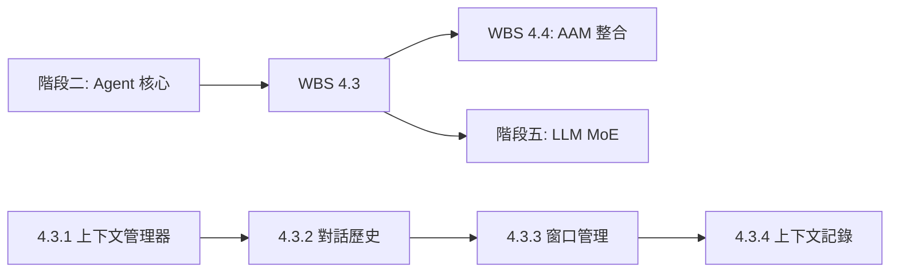

<!--
代碼功能說明: WBS 4.3 上下文管理實現子計劃
創建日期: 2025-11-26 23:05 (UTC+8)
創建人: Daniel Chung
最後修改日期: 2025-11-26 23:05 (UTC+8)
-->

# WBS 4.3: 上下文管理實現

## 1. 背景與目標

### 1.1 背景

根據 [AI-Box 架構規劃](../../../../Notion/pages/AI-Box/AI-Box-架構規劃.md) 和 [階段四主計劃](./wbs-4-data-processing.md)，WBS 4.3 專注於實現上下文管理系統，包括上下文管理器核心、對話歷史管理、上下文窗口管理和上下文記錄功能。

### 1.2 目標

- 實現上下文管理器核心邏輯
- 實現對話歷史存儲、檢索、管理功能
- 實現上下文窗口滑動、截斷邏輯
- 實現上下文記錄、持久化存儲

### 1.3 總工期

**5.5 個工作日**
**優先級**: P0（關鍵路徑）

### 1.4 依賴關係

- **前置依賴**:
  - 階段二：Agent 核心（Context Recorder 基礎）
  - 階段一：基礎架構（Redis、ChromaDB、ArangoDB）
- **後續依賴**:
  - WBS 4.4：AAM 模組整合（需要上下文管理）
  - 階段五：LLM MoE（需要上下文窗口管理）

---

## 2. 工作拆解

### 2.1 任務 4.3.1: 上下文管理器核心（1.5 天）

**目標**: 實現上下文管理器核心邏輯

**實施步驟**:

1. **上下文模型設計**
   - 建立 `agent_process/context/manager.py`
   - 定義上下文數據結構：

     ```python
     {
       "session_id": "會話ID",
       "user_id": "用戶ID",
       "messages": [
         {"role": "user", "content": "...", "timestamp": "..."},
         {"role": "assistant", "content": "...", "timestamp": "..."}
       ],
       "metadata": {
         "task_id": "任務ID",
         "workflow_type": "工作流類型",
         "context_window_size": 4096
       }
     }
     ```

2. **上下文存儲**
   - 使用 Redis 存儲短期上下文（會話級）
   - 使用 ChromaDB 存儲長期上下文（向量化存儲）
   - 使用 ArangoDB 存儲上下文關係（會話-任務-Agent 關係圖）

3. **上下文檢索**
   - 實現基於會話 ID 的上下文檢索
   - 實現基於任務 ID 的上下文檢索
   - 實現基於用戶 ID 的上下文檢索
   - 實現基於內容相似度的上下文檢索（向量檢索）

4. **上下文更新**
   - 實現上下文追加（新增消息）
   - 實現上下文更新（修改消息）
   - 實現上下文刪除（刪除會話）

**交付物**:

- `agent_process/context/manager.py`
- `agent_process/context/models.py`（上下文數據模型）
- `agent_process/context/storage.py`（存儲接口）
- 單元測試：`tests/agent_process/test_context_manager.py`

**驗收標準**:

- 上下文檢索響應時間 < 200ms（Redis）
- 上下文存儲成功率 100%
- 支持至少 1000 個並發會話
- 上下文數據一致性 100%

---

### 2.2 任務 4.3.2: 對話歷史管理（1.5 天）

**目標**: 實現對話歷史存儲、檢索、管理功能

**實施步驟**:

1. **對話歷史模型**
   - 建立 `agent_process/context/conversation_history.py`
   - 定義對話消息結構（role、content、timestamp、metadata）
   - 實現對話會話管理（創建、查詢、刪除會話）

2. **歷史存儲策略**
   - 短期歷史（最近 100 條消息）：存儲在 Redis
   - 長期歷史（所有消息）：存儲在 ChromaDB（向量化）
   - 歷史元數據：存儲在 ArangoDB（會話關係圖）

3. **歷史檢索功能**
   - 實現按時間範圍檢索（最近 N 天、N 小時）
   - 實現按關鍵詞檢索（全文搜索）
   - 實現按相似度檢索（向量檢索）
   - 實現按任務類型檢索

4. **歷史管理功能**
   - 實現歷史清理（刪除過期會話）
   - 實現歷史導出（JSON、CSV 格式）
   - 實現歷史統計（會話數量、消息數量、活躍度）

**交付物**:

- `agent_process/context/conversation_history.py`
- `services/api/routers/conversation_history.py`（API 端點）
- 單元測試：`tests/agent_process/test_conversation_history.py`

**驗收標準**:

- 對話歷史檢索響應時間 < 500ms
- 支持至少 10000 條消息的歷史存儲
- 歷史檢索準確率 > 95%
- 歷史清理功能正常運行（無數據丟失）

---

### 2.3 任務 4.3.3: 上下文窗口管理（1.5 天）

**目標**: 實現上下文窗口滑動、截斷邏輯

**實施步驟**:

1. **上下文窗口計算**
   - 建立 `agent_process/context/window_manager.py`
   - 實現 Token 計數（使用 tiktoken 或 transformers tokenizer）
   - 實現上下文窗口大小計算（基於模型限制）
   - 實現窗口滑動策略（保留重要消息，移除舊消息）

2. **窗口截斷策略**
   - 實現固定窗口截斷（保留最近 N 條消息）
   - 實現智能截斷（保留系統消息、用戶關鍵消息、最新消息）
   - 實現摘要截斷（將舊消息摘要後保留）

3. **窗口優化**
   - 實現消息壓縮（長消息摘要）
   - 實現重複內容去除
   - 實現無關內容過濾

4. **窗口配置**
   - 在 `config/config.example.json` 添加窗口配置：

     ```json
     "context_window": {
       "max_tokens": 4096,
       "reserve_system_messages": true,
       "reserve_user_messages": 10,
       "enable_compression": true,
       "compression_threshold": 2048
     }
     ```

**交付物**:

- `agent_process/context/window_manager.py`
- `config/config.example.json` 更新
- 單元測試：`tests/agent_process/test_window_manager.py`

**驗收標準**:

- Token 計數準確率 > 99%
- 上下文窗口截斷後仍保持對話連貫性
- 窗口管理響應時間 < 100ms
- 支持至少 5 種截斷策略

---

### 2.4 任務 4.3.4: 上下文記錄（1 天）

**目標**: 實現上下文記錄、持久化存儲

**實施步驟**:

1. **上下文記錄器實現**
   - 建立 `agent_process/context/recorder.py`（參考現有實現）
   - 實現上下文自動記錄（每次對話後記錄）
   - 實現上下文手動記錄（API 觸發）
   - 實現記錄去重（避免重複記錄）

2. **記錄存儲**
   - 使用 ChromaDB 存儲上下文記錄（向量化）
   - 使用 ArangoDB 存儲上下文關係（會話-任務-結果關係）
   - 實現記錄索引（時間、用戶、任務類型）

3. **記錄檢索**
   - 實現基於內容的記錄檢索（向量檢索）
   - 實現基於元數據的記錄檢索（時間、用戶、任務）
   - 實現記錄聚合查詢（統計分析）

4. **記錄管理**
   - 實現記錄刪除（用戶請求或自動清理）
   - 實現記錄導出（JSON、CSV 格式）
   - 實現記錄分析（會話模式、任務分布）

**交付物**:

- `agent_process/context/recorder.py`（更新）
- `services/api/routers/context_record.py`（API 端點）
- 單元測試：`tests/agent_process/test_context_recorder.py`

**驗收標準**:

- 上下文記錄成功率 100%
- 記錄檢索響應時間 < 500ms
- 支持至少 10000 條記錄的存儲和檢索
- 記錄數據完整性 100%

---

## 3. 時間表

| 任務 | 工期 | 負責人 | 開始日期 | 完成日期 |
|------|------|--------|---------|---------|
| 4.3.1 上下文管理器核心 | 1.5 天 | Backend-1 | Day 16 | Day 16-17 |
| 4.3.2 對話歷史管理 | 1.5 天 | Backend-1 | Day 17 | Day 17-18 |
| 4.3.3 上下文窗口管理 | 1.5 天 | Backend-1 | Day 18 | Day 18-19 |
| 4.3.4 上下文記錄 | 1 天 | Backend-1 | Day 19 | Day 19 |

**總計**: 5.5 天

---

## 4. 資源需求

### 4.1 人力資源

- **Backend-1**: 5.5 天（所有上下文管理任務）

### 4.2 技術資源

- **開發環境**: Python 3.11+、FastAPI
- **數據庫**: Redis（短期上下文）、ChromaDB（長期上下文）、ArangoDB（關係圖）
- **工具庫**: tiktoken、transformers

---

## 5. 驗收標準

### 5.1 功能驗收

- ✅ 上下文檢索響應時間 < 200ms
- ✅ 對話歷史管理完整
- ✅ 上下文窗口管理正確
- ✅ 上下文記錄成功率 100%

### 5.2 性能驗收

- ✅ 上下文檢索：響應時間 < 200ms（Redis）
- ✅ 對話歷史檢索：響應時間 < 500ms
- ✅ 窗口管理：響應時間 < 100ms

### 5.3 質量驗收

- ✅ 單元測試覆蓋率 > 80%
- ✅ 代碼審查通過
- ✅ API 文檔完整

---

## 6. 風險與對策

| 風險 | 影響 | 概率 | 對策 |
|------|------|------|------|
| 上下文窗口管理複雜度高 | 中 | 低 | 1. 採用成熟的 Token 計數庫<br>2. 實現多種截斷策略<br>3. 提供配置化選項 |
| 大量並發會話性能問題 | 中 | 中 | 1. 實現 Redis 連接池<br>2. 實現緩存機制<br>3. 優化數據庫查詢 |
| 上下文數據一致性問題 | 高 | 低 | 1. 實現事務機制<br>2. 實現數據同步<br>3. 實現一致性檢查 |

---

## 7. 依賴關係



---

## 8. 更新紀錄

| 日期 | 版本 | 說明 | 更新人 |
|------|------|------|--------|
| 2025-11-26 | 1.0 | 初版子計劃建立 | Daniel Chung |

---

**文檔版本**: 1.0
**最後更新**: 2025-11-26 23:05 (UTC+8)
**維護者**: AI Box 開發團隊
